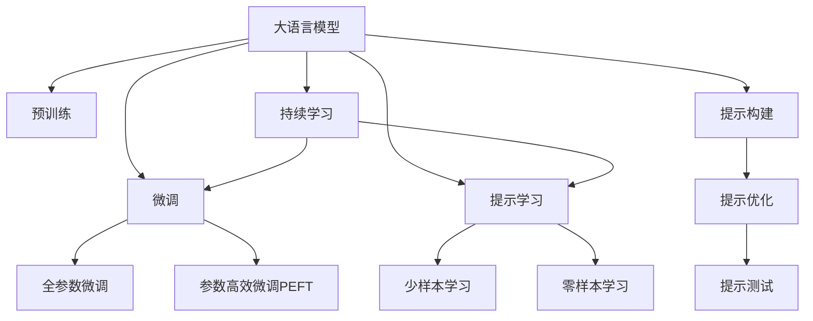

                 

# 大语言模型应用指南：提示的构成

## 1. 背景介绍

### 1.1 问题由来
在自然语言处理(NLP)领域，大语言模型(LLMs)已经成为主流的研究方向。这些模型通常使用大规模无标签文本进行预训练，学习到丰富的语言知识和常识，能够处理复杂的语言生成和理解任务。然而，尽管大模型在通用性方面表现出色，但在特定任务上的表现仍需进一步优化。为了克服这些局限性，提示(提示)成为了一种高效的方法，使大语言模型能够根据具体任务的需求，生成或理解期望的输出。

### 1.2 问题核心关键点
提示是一种用于引导大语言模型执行特定任务的技术。在微调或基于预训练的模型时，提示的作用在于为模型提供一个明确的输入格式，使其在特定任务上表现出最佳性能。提示可以是一段文本、一组关键词，甚至是任务目标的描述，通过这些方式，提示可以促使模型按照期望的方式进行推理和生成。

提示的核心在于如何设计出一个既能够包含任务信息，又能够充分发挥大语言模型能力的提示。这涉及到提示的构建、优化、测试和应用等多个方面。设计良好的提示可以提高模型的精度和效率，而低效的提示则可能导致模型性能下降或出现意外结果。

### 1.3 问题研究意义
提示技术对于提升大语言模型的任务适配性和性能至关重要。它不仅能够显著降低微调所需的标注数据量，还可以帮助模型更好地理解用户意图，提高系统的可靠性和用户体验。提示技术的深入研究，能够为NLP领域带来更广泛的应用场景和更高的应用效率。

## 2. 核心概念与联系

### 2.1 核心概念概述

为了更好地理解提示在大语言模型中的应用，我们需要掌握以下核心概念：

- **大语言模型(LLM)**：指使用自回归或自编码模型进行预训练的语言模型，如GPT、BERT等。通过大规模无标签数据训练，学习到丰富的语言知识和常识。

- **预训练**：指在大规模无标签文本数据上训练语言模型，学习通用语言表示。预训练是提示技术的基础。

- **提示(Prompt)**：用于引导大语言模型执行特定任务的输入文本或描述，可以是文本、关键词、甚至是问题。

- **微调(Fine-Tuning)**：指在大规模无标签数据上预训练后，使用标注数据进行有监督训练，以适应特定任务。

- **参数高效微调(PEFT)**：指在微调过程中，只更新少量参数，以减少计算资源消耗。

- **少样本学习(Few-shot Learning)**：指在极少量标注数据的情况下，模型仍能进行任务学习。

- **零样本学习(Zero-shot Learning)**：指模型在未见过任何标注数据的情况下，仅通过问题描述即可执行任务。

- **持续学习(Continual Learning)**：指模型能够持续从新数据中学习，保持已有知识的同时，不断适应新数据分布。

这些概念之间的联系可以通过以下Mermaid流程图来展示：



这个流程图展示了大语言模型的核心概念及其之间的关系：

1. 大语言模型通过预训练获得基础能力。
2. 微调是对预训练模型进行任务特定的优化，可以分为全参数微调和参数高效微调。
3. 提示技术用于在特定任务上优化模型。
4. 提示可以用于少样本学习和零样本学习，减少标注数据需求。
5. 持续学习确保模型能够不断学习新知识。
6. 提示的构建、优化和测试是提示技术的关键环节。

这些概念共同构成了大语言模型的学习和应用框架，使其能够在各种场景下发挥强大的语言理解和生成能力。通过理解这些核心概念，我们可以更好地把握大语言模型的工作原理和优化方向。

## 3. 核心算法原理 & 具体操作步骤
### 3.1 算法原理概述

提示技术的核心思想是利用预训练语言模型学到的语言知识，通过特定的输入格式，引导模型进行特定任务的推理和生成。在微调或基于预训练的模型时，提示可以显著提升模型在特定任务上的性能。

提示的设计需要考虑以下几个方面：

- **任务适配性**：提示需要充分描述任务，使得模型能够理解任务目标。
- **语言表达性**：提示需要具备足够的语言复杂度，以覆盖多种语言表达方式。
- **可控性**：提示需要具备一定的可控性，即通过改变提示，可以显著影响模型的输出结果。

提示的设计可以采用多种方式，包括但不限于：

- **模板填充**：使用预定义的模板，根据任务需求填写特定的参数。
- **目标驱动**：直接使用任务目标作为提示。
- **上下文增强**：提供额外的上下文信息，帮助模型更好地理解任务。

### 3.2 算法步骤详解

提示技术的实施通常包括以下几个关键步骤：

**Step 1: 准备预训练模型和数据集**
- 选择合适的预训练语言模型 $M_{\theta}$ 作为初始化参数，如 BERT、GPT 等。
- 准备特定任务的标注数据集 $D=\{(x_i,y_i)\}_{i=1}^N, x_i \in \mathcal{X}, y_i \in \mathcal{Y}$。

**Step 2: 设计提示格式**
- 根据任务类型，设计合适的提示格式。例如，对于分类任务，可以设计形如 "这段文本是 [类别] 的" 的提示格式。
- 对于生成任务，可以设计形如 "给定 [上下文]，生成 [任务] 的 [格式]" 的提示格式。

**Step 3: 微调模型**
- 使用微调算法（如 AdamW、SGD 等）在标注数据集上优化模型参数。
- 设置合适的学习率、批大小、迭代轮数等超参数。

**Step 4: 评估和优化提示**
- 在验证集上评估模型性能，根据任务需求和模型表现不断调整提示格式。
- 利用自动化工具（如 T5、GPT-3 PromptExplorer 等）评估不同提示格式的效果。

**Step 5: 部署和应用**
- 使用优化后的提示格式，对新样本进行推理预测。
- 集成到实际的应用系统中，提供智能化的解决方案。

### 3.3 算法优缺点

提示技术具有以下优点：

- **高效性**：提示技术可以显著降低微调所需的标注数据量，提高模型训练和推理的效率。
- **通用性**：提示可以应用于多种NLP任务，包括文本分类、命名实体识别、机器翻译等。
- **可控性**：通过调整提示格式，可以灵活控制模型的输出结果，满足不同应用场景的需求。

然而，提示技术也存在一些局限性：

- **设计难度**：提示的设计需要结合具体任务，设计不当可能导致模型性能下降或输出错误。
- **复杂度**：提示可能非常复杂，需要专业知识来构建和优化。
- **鲁棒性**：提示格式的设计可能存在一定的鲁棒性问题，某些输入格式可能导致模型失效。

尽管存在这些局限性，提示技术在大语言模型的应用中仍然发挥着重要作用，并且随着技术的不断进步，提示设计将变得更加自动化和可控。

### 3.4 算法应用领域

提示技术已经在多个NLP应用领域得到了广泛应用，例如：

- **问答系统**：根据用户输入的问题，生成合适的答案。
- **文本摘要**：从长文本中提取关键信息，生成简短摘要。
- **机器翻译**：将源语言文本翻译成目标语言。
- **命名实体识别**：从文本中识别出人名、地名、机构名等实体。
- **文本分类**：将文本分类到预定义的类别中。
- **情感分析**：分析文本的情感倾向。

除了这些经典任务外，提示技术还被创新性地应用到更多场景中，如可控文本生成、自然语言推理、信息检索等，为NLP技术带来了全新的突破。

## 4. 数学模型和公式 & 详细讲解 & 举例说明

### 4.1 数学模型构建

在数学上，提示技术的核心在于如何设计一个合适的输入格式 $p$，使其能够有效引导大语言模型进行特定任务 $T$ 的推理和生成。提示 $p$ 通常由一个或多个输入文本 $x$ 和一个可能的输出 $y$ 组成，即 $p=(x,y)$。模型的目标是在提示 $p$ 的指导下，生成或推理出期望的输出 $y$。

### 4.2 公式推导过程

以下以文本分类任务为例，推导提示模型的数学模型和优化公式。

假设输入文本 $x$ 长度为 $N$，提示 $p$ 长度为 $M$，模型输出为 $y$，则提示模型的数学模型为：

$$
y = M_{\theta}(p(x))
$$

其中 $M_{\theta}$ 为预训练语言模型，$\theta$ 为模型参数。

假设模型的损失函数为交叉熵损失，则提示模型的损失函数可以表示为：

$$
\mathcal{L}(p) = -\frac{1}{N} \sum_{i=1}^N y_i \log M_{\theta}(p(x_i))
$$

其中 $y_i$ 为文本 $x_i$ 的真实标签。

通过反向传播算法，可以计算出模型参数 $\theta$ 的梯度，进而通过优化算法（如 AdamW、SGD 等）更新参数，最小化损失函数 $\mathcal{L}(p)$。

### 4.3 案例分析与讲解

以电影评论情感分析任务为例，展示如何使用提示技术优化模型性能。

假设输入文本 $x$ 为电影评论，提示 $p$ 为 "这部电影的情感是正面的" 或 "这部电影的情感是负面的"。模型的输出 $y$ 为情感标签，如 "正面" 或 "负面"。

在微调过程中，我们可以使用以下提示格式：

$$
p = "这段电影评论的情感是正面/负面的。"
$$

在模型训练过程中，我们逐步调整提示格式，直到模型在验证集上的精度达到最佳。例如，可以使用以下步骤：

1. 初始提示："这段电影评论的情感是正面/负面的。"
2. 调整提示："这段电影评论的情情感是正面/负面的。"
3. 进一步调整提示："这部电影的情感是正面/负面的。"
4. 最终提示："这部电影的情感是正面/负面的。"

通过不断调整和优化提示，模型能够在情感分析任务上取得更好的性能。

## 5. 项目实践：代码实例和详细解释说明

### 5.1 开发环境搭建

在进行提示技术实践前，我们需要准备好开发环境。以下是使用Python进行PyTorch开发的环境配置流程：

1. 安装Anaconda：从官网下载并安装Anaconda，用于创建独立的Python环境。

2. 创建并激活虚拟环境：
```bash
conda create -n pytorch-env python=3.8 
conda activate pytorch-env
```

3. 安装PyTorch：根据CUDA版本，从官网获取对应的安装命令。例如：
```bash
conda install pytorch torchvision torchaudio cudatoolkit=11.1 -c pytorch -c conda-forge
```

4. 安装Transformers库：
```bash
pip install transformers
```

5. 安装各类工具包：
```bash
pip install numpy pandas scikit-learn matplotlib tqdm jupyter notebook ipython
```

完成上述步骤后，即可在`pytorch-env`环境中开始提示技术实践。

### 5.2 源代码详细实现

下面我们以电影评论情感分析任务为例，给出使用Transformers库对BERT模型进行提示优化的PyTorch代码实现。

首先，定义情感分类任务的数据处理函数：

```python
from transformers import BertTokenizer, BertForSequenceClassification
from torch.utils.data import Dataset, DataLoader
import torch

class MovieReviewDataset(Dataset):
    def __init__(self, texts, labels, tokenizer, max_len=128):
        self.texts = texts
        self.labels = labels
        self.tokenizer = tokenizer
        self.max_len = max_len
        
    def __len__(self):
        return len(self.texts)
    
    def __getitem__(self, item):
        text = self.texts[item]
        label = self.labels[item]
        
        encoding = self.tokenizer(text, return_tensors='pt', max_length=self.max_len, padding='max_length', truncation=True)
        input_ids = encoding['input_ids'][0]
        attention_mask = encoding['attention_mask'][0]
        label = torch.tensor(label, dtype=torch.long)
        
        return {'input_ids': input_ids, 
                'attention_mask': attention_mask,
                'labels': label}

# 加载数据集
tokenizer = BertTokenizer.from_pretrained('bert-base-cased')
train_dataset = MovieReviewDataset(train_texts, train_labels, tokenizer)
dev_dataset = MovieReviewDataset(dev_texts, dev_labels, tokenizer)
test_dataset = MovieReviewDataset(test_texts, test_labels, tokenizer)

# 定义模型
model = BertForSequenceClassification.from_pretrained('bert-base-cased', num_labels=2)

# 定义优化器和损失函数
optimizer = AdamW(model.parameters(), lr=2e-5)
loss_fn = torch.nn.CrossEntropyLoss()

# 训练和测试函数
def train_epoch(model, dataset, batch_size, optimizer):
    dataloader = DataLoader(dataset, batch_size=batch_size, shuffle=True)
    model.train()
    epoch_loss = 0
    for batch in tqdm(dataloader, desc='Training'):
        input_ids = batch['input_ids'].to(device)
        attention_mask = batch['attention_mask'].to(device)
        labels = batch['labels'].to(device)
        model.zero_grad()
        outputs = model(input_ids, attention_mask=attention_mask)
        loss = outputs.loss
        epoch_loss += loss.item()
        loss.backward()
        optimizer.step()
    return epoch_loss / len(dataloader)

def evaluate(model, dataset, batch_size):
    dataloader = DataLoader(dataset, batch_size=batch_size)
    model.eval()
    preds, labels = [], []
    with torch.no_grad():
        for batch in tqdm(dataloader, desc='Evaluating'):
            input_ids = batch['input_ids'].to(device)
            attention_mask = batch['attention_mask'].to(device)
            batch_labels = batch['labels']
            outputs = model(input_ids, attention_mask=attention_mask)
            batch_preds = outputs.logits.argmax(dim=2).to('cpu').tolist()
            batch_labels = batch_labels.to('cpu').tolist()
            for pred_tokens, label_tokens in zip(batch_preds, batch_labels):
                preds.append(pred_tokens[:len(label_tokens)])
                labels.append(label_tokens)
                
    print(classification_report(labels, preds))
```

然后，定义优化提示格式的过程：

```python
def optimize_prompt(model, dataset, batch_size, optimizer, num_epochs=5):
    for epoch in range(num_epochs):
        train_loss = train_epoch(model, dataset, batch_size, optimizer)
        print(f"Epoch {epoch+1}, train loss: {train_loss:.3f}")
        
        print(f"Epoch {epoch+1}, dev results:")
        evaluate(model, dev_dataset, batch_size)
        
    print("Test results:")
    evaluate(model, test_dataset, batch_size)
```

最后，启动提示优化流程并在测试集上评估：

```python
epochs = 5
batch_size = 16

optimize_prompt(model, train_dataset, batch_size, optimizer, epochs)
```

以上就是使用PyTorch对BERT进行提示优化的完整代码实现。可以看到，借助Transformer库，我们可以用相对简洁的代码完成BERT模型的提示优化。

### 5.3 代码解读与分析

让我们再详细解读一下关键代码的实现细节：

**MovieReviewDataset类**：
- `__init__`方法：初始化文本、标签、分词器等关键组件。
- `__len__`方法：返回数据集的样本数量。
- `__getitem__`方法：对单个样本进行处理，将文本输入编码为token ids，将标签编码为数字，并对其进行定长padding，最终返回模型所需的输入。

**train_epoch函数**：
- 使用PyTorch的DataLoader对数据集进行批次化加载，供模型训练和推理使用。
- 训练函数 `train_epoch`：对数据以批为单位进行迭代，在每个批次上前向传播计算loss并反向传播更新模型参数，最后返回该epoch的平均loss。
- 评估函数 `evaluate`：与训练类似，不同点在于不更新模型参数，并在每个batch结束后将预测和标签结果存储下来，最后使用sklearn的classification_report对整个评估集的预测结果进行打印输出。

**optimize_prompt函数**：
- 使用PyTorch对模型进行训练和验证，通过不断调整提示格式，优化模型性能。
- 循环迭代指定次数，每次训练结束后在验证集上评估模型性能，直到达到预设的训练轮数或停止条件。

可以看到，PyTorch配合Transformers库使得BERT提示优化的代码实现变得简洁高效。开发者可以将更多精力放在提示设计、模型改进等高层逻辑上，而不必过多关注底层的实现细节。

当然，工业级的系统实现还需考虑更多因素，如模型的保存和部署、超参数的自动搜索、更灵活的任务适配层等。但核心的提示优化流程基本与此类似。

## 6. 实际应用场景
### 6.1 智能客服系统

基于提示技术的对话系统可以广泛应用于智能客服系统的构建。传统客服往往需要配备大量人力，高峰期响应缓慢，且一致性和专业性难以保证。使用提示优化的对话模型，可以7x24小时不间断服务，快速响应客户咨询，用自然流畅的语言解答各类常见问题。

在技术实现上，可以收集企业内部的历史客服对话记录，将问题和最佳答复构建成监督数据，在此基础上对预训练对话模型进行提示优化。优化后的对话模型能够自动理解用户意图，匹配最合适的答案模板进行回复。对于客户提出的新问题，还可以接入检索系统实时搜索相关内容，动态组织生成回答。如此构建的智能客服系统，能大幅提升客户咨询体验和问题解决效率。

### 6.2 金融舆情监测

金融机构需要实时监测市场舆论动向，以便及时应对负面信息传播，规避金融风险。传统的人工监测方式成本高、效率低，难以应对网络时代海量信息爆发的挑战。基于提示技术的文本分类和情感分析技术，为金融舆情监测提供了新的解决方案。

具体而言，可以收集金融领域相关的新闻、报道、评论等文本数据，并对其进行主题标注和情感标注。在此基础上对预训练语言模型进行提示优化，使其能够自动判断文本属于何种主题，情感倾向是正面、中性还是负面。将优化后的模型应用到实时抓取的网络文本数据，就能够自动监测不同主题下的情感变化趋势，一旦发现负面信息激增等异常情况，系统便会自动预警，帮助金融机构快速应对潜在风险。

### 6.3 个性化推荐系统

当前的推荐系统往往只依赖用户的历史行为数据进行物品推荐，无法深入理解用户的真实兴趣偏好。基于提示技术的个性化推荐系统可以更好地挖掘用户行为背后的语义信息，从而提供更精准、多样的推荐内容。

在实践中，可以收集用户浏览、点击、评论、分享等行为数据，提取和用户交互的物品标题、描述、标签等文本内容。将文本内容作为模型输入，用户的后续行为（如是否点击、购买等）作为监督信号，在此基础上对预训练语言模型进行提示优化。优化后的模型能够从文本内容中准确把握用户的兴趣点。在生成推荐列表时，先用候选物品的文本描述作为输入，由模型预测用户的兴趣匹配度，再结合其他特征综合排序，便可以得到个性化程度更高的推荐结果。

### 6.4 未来应用展望

随着提示技术的不断发展，其应用场景将不断拓展，为NLP技术带来新的突破。

在智慧医疗领域，基于提示技术的医疗问答、病历分析、药物研发等应用将提升医疗服务的智能化水平，辅助医生诊疗，加速新药开发进程。

在智能教育领域，提示技术可应用于作业批改、学情分析、知识推荐等方面，因材施教，促进教育公平，提高教学质量。

在智慧城市治理中，提示技术可应用于城市事件监测、舆情分析、应急指挥等环节，提高城市管理的自动化和智能化水平，构建更安全、高效的未来城市。

此外，在企业生产、社会治理、文娱传媒等众多领域，基于提示技术的NLP应用也将不断涌现，为传统行业数字化转型升级提供新的技术路径。相信随着技术的日益成熟，提示技术将成为NLP技术的重要组成部分，推动人工智能技术在各行业的应用。

## 7. 工具和资源推荐
### 7.1 学习资源推荐

为了帮助开发者系统掌握提示技术的理论基础和实践技巧，这里推荐一些优质的学习资源：

1. 《Prompt Engineering for Transformers》系列博文：由大模型技术专家撰写，深入浅出地介绍了提示技术的原理、设计和优化方法。

2. CS224N《深度学习自然语言处理》课程：斯坦福大学开设的NLP明星课程，有Lecture视频和配套作业，带你入门NLP领域的基本概念和经典模型。

3. 《Natural Language Processing with Transformers》书籍：Transformers库的作者所著，全面介绍了如何使用Transformers库进行NLP任务开发，包括提示技术的诸多范式。

4. HuggingFace官方文档：Transformers库的官方文档，提供了海量预训练模型和完整的提示优化样例代码，是上手实践的必备资料。

5. CLUE开源项目：中文语言理解测评基准，涵盖大量不同类型的中文NLP数据集，并提供了基于提示技术的baseline模型，助力中文NLP技术发展。

通过对这些资源的学习实践，相信你一定能够快速掌握提示技术的精髓，并用于解决实际的NLP问题。
###  7.2 开发工具推荐

高效的开发离不开优秀的工具支持。以下是几款用于提示技术开发的常用工具：

1. PyTorch：基于Python的开源深度学习框架，灵活动态的计算图，适合快速迭代研究。大部分预训练语言模型都有PyTorch版本的实现。

2. TensorFlow：由Google主导开发的开源深度学习框架，生产部署方便，适合大规模工程应用。同样有丰富的预训练语言模型资源。

3. Transformers库：HuggingFace开发的NLP工具库，集成了众多SOTA语言模型，支持PyTorch和TensorFlow，是进行提示技术开发的利器。

4. Weights & Biases：模型训练的实验跟踪工具，可以记录和可视化模型训练过程中的各项指标，方便对比和调优。与主流深度学习框架无缝集成。

5. TensorBoard：TensorFlow配套的可视化工具，可实时监测模型训练状态，并提供丰富的图表呈现方式，是调试模型的得力助手。

6. Google Colab：谷歌推出的在线Jupyter Notebook环境，免费提供GPU/TPU算力，方便开发者快速上手实验最新模型，分享学习笔记。

合理利用这些工具，可以显著提升提示技术的开发效率，加快创新迭代的步伐。

### 7.3 相关论文推荐

提示技术在大语言模型中的应用已经成为学界和工业界的热点研究方向。以下是几篇奠基性的相关论文，推荐阅读：

1. Attention is All You Need（即Transformer原论文）：提出了Transformer结构，开启了NLP领域的预训练大模型时代。

2. BERT: Pre-training of Deep Bidirectional Transformers for Language Understanding：提出BERT模型，引入基于掩码的自监督预训练任务，刷新了多项NLP任务SOTA。

3. Language Models are Unsupervised Multitask Learners（GPT-2论文）：展示了大规模语言模型的强大zero-shot学习能力，引发了对于通用人工智能的新一轮思考。

4. Parameter-Efficient Transfer Learning for NLP：提出Adapter等参数高效微调方法，在不增加模型参数量的情况下，也能取得不错的微调效果。

5. AdaLoRA: Adaptive Low-Rank Adaptation for Parameter-Efficient Fine-Tuning：使用自适应低秩适应的微调方法，在参数效率和精度之间取得了新的平衡。

6. Auto Prompt：通过自动化生成和优化提示，显著提升提示效果。

这些论文代表了大语言模型提示技术的发展脉络。通过学习这些前沿成果，可以帮助研究者把握学科前进方向，激发更多的创新灵感。

## 8. 总结：未来发展趋势与挑战

### 8.1 总结

本文对基于提示技术的语言模型进行了全面系统的介绍。首先阐述了提示技术的研究背景和意义，明确了提示在大语言模型中的应用价值。其次，从原理到实践，详细讲解了提示技术的数学原理和关键步骤，给出了提示技术任务开发的完整代码实例。同时，本文还广泛探讨了提示技术在智能客服、金融舆情、个性化推荐等多个行业领域的应用前景，展示了提示技术的巨大潜力。此外，本文精选了提示技术的各类学习资源，力求为开发者提供全方位的技术指引。

通过本文的系统梳理，可以看到，基于提示技术的语言模型正在成为NLP领域的重要范式，极大地拓展了预训练语言模型的应用边界，催生了更多的落地场景。得益于大规模语料的预训练和提示技术的高效应用，提示模型能够在更少的标注数据下取得不俗的效果，有力推动了NLP技术的产业化进程。未来，伴随提示技术的持续演进，NLP技术必将在更广阔的应用领域大放异彩。

### 8.2 未来发展趋势

展望未来，提示技术将呈现以下几个发展趋势：

1. **自适应提示生成**：未来的提示生成将更加自动化和智能化，通过模型自适应生成最适合当前任务的提示，减少人工干预。
2. **多模态提示**：将文本、图像、音频等多模态信息进行联合建模，提升提示模型的综合理解和表达能力。
3. **分布式提示优化**：通过分布式训练和优化技术，进一步降低提示模型在计算和存储上的成本。
4. **实时提示更新**：基于在线学习技术，提示模型能够实时更新和优化，适应新任务和新数据。
5. **跨领域提示迁移**：通过提示技术，大语言模型能够实现跨领域的任务迁移，减少在不同领域上的重新训练需求。

以上趋势凸显了提示技术的广阔前景。这些方向的探索发展，必将进一步提升提示模型的性能和应用范围，为NLP技术带来更多的突破。

### 8.3 面临的挑战

尽管提示技术在大语言模型中的应用已经取得了显著进展，但在迈向更加智能化、普适化应用的过程中，它仍面临着诸多挑战：

1. **提示生成难度**：提示的设计和优化需要专业知识，且难以保证自动生成的提示始终有效。
2. **提示鲁棒性**：提示模型在面对复杂的输入时，容易发生鲁棒性下降或失效。
3. **提示对抗性攻击**：恶意用户可能通过特定的输入格式，影响提示模型的输出结果，带来安全隐患。
4. **提示模型偏见**：提示模型在生成过程中可能受到输入数据的偏见影响，产生歧视性输出。
5. **提示模型伦理**：提示模型的应用需要考虑到模型的伦理和道德问题，确保输出结果符合人类价值观和社会规范。

这些挑战亟需学界和工业界共同努力，通过技术创新和规范制定，逐步克服提示技术在应用中的局限性。

### 8.4 研究展望

面对提示技术面临的挑战，未来的研究需要在以下几个方面寻求新的突破：

1. **提示生成算法优化**：开发更加高效和可控的提示生成算法，减少人工干预，提升提示的生成质量。
2. **提示模型鲁棒性增强**：研究鲁棒性优化技术，提高提示模型对复杂输入的适应能力。
3. **提示对抗性防御**：开发针对提示对抗性攻击的防御技术，确保提示模型的安全性。
4. **提示模型公平性提升**：采用公平性优化算法，减少提示模型的偏见和歧视性输出。
5. **提示模型伦理规范**：制定提示模型的伦理规范，确保其应用符合人类价值观和社会规范。

这些研究方向的探索，必将引领提示技术迈向更高的台阶，为构建安全、可靠、可解释、可控的智能系统铺平道路。面向未来，提示技术还需要与其他人工智能技术进行更深入的融合，如知识表示、因果推理、强化学习等，多路径协同发力，共同推动自然语言理解和智能交互系统的进步。只有勇于创新、敢于突破，才能不断拓展语言模型的边界，让智能技术更好地造福人类社会。

## 9. 附录：常见问题与解答

**Q1：提示技术与微调有何不同？**

A: 提示技术与微调虽然都是对大语言模型的优化，但它们的出发点和优化方式不同。微调是通过有监督训练调整模型参数，使其适应特定任务，而提示技术则是通过特定的输入格式引导模型进行推理和生成，优化模型的推理能力。提示技术适用于没有足够标注数据的任务，而微调则适用于标注数据较多的任务。

**Q2：如何设计一个有效的提示？**

A: 设计有效的提示需要考虑以下几个方面：
1. **任务适配性**：提示需要充分描述任务，使得模型能够理解任务目标。
2. **语言表达性**：提示需要具备足够的语言复杂度，以覆盖多种语言表达方式。
3. **可控性**：提示需要具备一定的可控性，即通过改变提示，可以显著影响模型的输出结果。

**Q3：提示模型在落地部署时需要注意哪些问题？**

A: 将提示模型转化为实际应用，还需要考虑以下因素：
1. **模型裁剪**：去除不必要的层和参数，减小模型尺寸，加快推理速度。
2. **量化加速**：将浮点模型转为定点模型，压缩存储空间，提高计算效率。
3. **服务化封装**：将模型封装为标准化服务接口，便于集成调用。
4. **弹性伸缩**：根据请求流量动态调整资源配置，平衡服务质量和成本。
5. **监控告警**：实时采集系统指标，设置异常告警阈值，确保服务稳定性。

**Q4：提示模型在微调过程中需要注意哪些问题？**

A: 提示模型在微调过程中需要注意以下问题：
1. **过拟合风险**：提示模型可能会过拟合特定任务，导致在未见过的数据上表现不佳。
2. **提示泛化能力**：提示需要具备泛化能力，能够适应不同领域、不同数据分布的任务。
3. **提示鲁棒性**：提示模型在面对不同的输入格式时，需要具备一定的鲁棒性，避免失效。
4. **提示模型的可解释性**：提示模型需要具备一定的可解释性，能够理解模型的推理过程。

这些问题的解决，将使提示模型在实际应用中更加可靠和高效。

**Q5：提示技术与零样本学习和少样本学习有何不同？**

A: 提示技术与零样本学习和少样本学习虽然都是在大语言模型的基础上进行的，但它们的假设和目标不同。提示技术通过特定的输入格式引导模型进行推理和生成，而零样本学习和少样本学习则是在没有看到任何标注样本的情况下，直接使用模型进行预测。零样本学习和少样本学习主要解决标注数据缺乏的问题，而提示技术则通过优化提示，提高模型在特定任务上的性能。

---

作者：禅与计算机程序设计艺术 / Zen and the Art of Computer Programming

