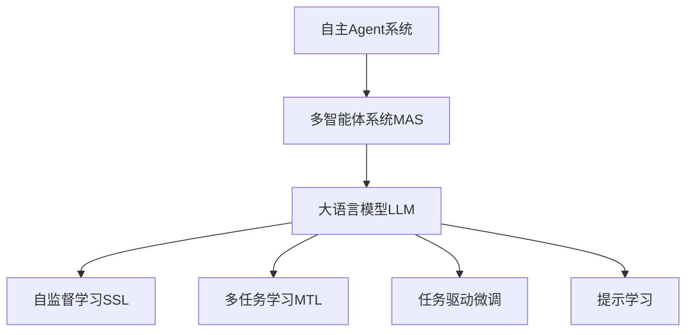

                 

# 大语言模型应用指南：自主Agent系统案例分析（二）

> 关键词：自主Agent, 自然语言处理(NLP), 大语言模型, 多智能体系统(MAS), 任务驱动微调, 多任务学习

## 1. 背景介绍

在上一篇博客中，我们介绍了大语言模型在自主Agent系统中的应用案例（一），强调了通过微调训练自主Agent以应对复杂任务的重要性。在这篇博客中，我们将进一步深入探讨如何通过多任务学习与任务驱动微调，使自主Agent系统更加智能和适应性更强。

### 1.1 问题由来

在实际应用中，自主Agent系统往往需要应对多个不同的任务。例如，一个智能客服机器人需要在回答用户问题的同时，进行订单处理和用户行为分析。这种场景下，单一任务微调已经无法满足需求，需要引入多任务学习和任务驱动微调技术。

### 1.2 问题核心关键点

多任务学习和任务驱动微调的核心在于：
1. 大语言模型能够同时学习多个相关任务的知识。
2. 模型在微调过程中，能够根据具体任务需求动态调整输出。
3. 模型的输出能够适应不同任务之间的关联性。

## 2. 核心概念与联系

### 2.1 核心概念概述

为更好地理解多任务学习和任务驱动微调，本节将介绍几个关键概念及其相互联系：

- 多智能体系统(MAS)：由多个自主Agent组成的协作系统，用于解决复杂的分布式问题。
- 大语言模型(LLM)：以自回归或自编码模型为代表的大规模预训练语言模型，具备强大的语言理解和生成能力。
- 多任务学习(MTL)：使大语言模型同时学习多个相关任务的表示，提高泛化能力。
- 任务驱动微调(Task-Driven Fine-Tuning)：针对特定任务，对预训练模型进行微调，优化模型在该任务上的性能。
- 自监督学习(SSL)：通过大量无标签数据进行预训练，学习到丰富的语言表示。
- 提示学习(Prompt Learning)：通过精心设计的输入文本，引导大语言模型按期望方式输出，减少微调参数。

这些核心概念之间的逻辑关系可以通过以下Mermaid流程图来展示：



这个流程图展示了大语言模型在自主Agent系统中的角色和作用，以及与多任务学习、自监督学习、任务驱动微调和提示学习的联系。

## 3. 核心算法原理 & 具体操作步骤

### 3.1 算法原理概述

多任务学习和任务驱动微调的原理，本质上是一种有监督学习的扩展，通过同时处理多个相关任务的数据，使大语言模型学习到多任务的共性和差异，提升模型的泛化能力和特定任务的适应性。

具体来说，多任务学习指的是在预训练阶段，模型能够同时学习多个任务的表示，从而在微调阶段，模型可以轻松切换到不同的任务，进行快速的微调。任务驱动微调则是在预训练模型的基础上，根据具体任务的需求，通过有监督的数据进行微调，使模型在该任务上获得更好的性能。

### 3.2 算法步骤详解

基于多任务学习和任务驱动微调的大语言模型自主Agent系统构建过程，大致包括以下几个关键步骤：

**Step 1: 准备数据集**
- 收集与Agent系统相关的多个任务的数据集，例如用户对话、订单处理、行为分析等。
- 将数据集划分为训练集、验证集和测试集，保证各任务数据集的质量和多样性。

**Step 2: 预训练大语言模型**
- 选择一个大规模预训练语言模型作为初始化参数，如BERT、GPT等。
- 使用自监督学习任务，如掩码语言模型、句子嵌入、next sentence prediction等，对模型进行预训练。

**Step 3: 多任务学习**
- 在预训练模型的基础上，对不同任务的数据进行联合训练，使模型能够同时学习多个任务的表示。
- 可以通过多任务的联合损失函数，将各任务的输出进行权重调整，平衡各任务的重要性。

**Step 4: 任务驱动微调**
- 针对特定任务，使用有标签的数据对模型进行微调。
- 根据任务的复杂度和数据规模，选择合适的学习率和优化器。
- 使用正则化技术，如L2正则、Dropout、Early Stopping等，避免过拟合。
- 对于复杂任务，可以考虑采用适应性参数共享等策略，进一步优化模型性能。

**Step 5: 部署和优化**
- 将微调后的模型集成到Agent系统中，进行实时推理和决策。
- 在实际应用中，根据任务需求和数据特征，持续优化模型的结构和参数。
- 使用A/B测试等方法，评估模型在不同场景下的性能表现，进行迭代优化。

### 3.3 算法优缺点

多任务学习和任务驱动微调方法具有以下优点：
1. 提高泛化能力。通过多任务学习，模型能够同时学习多个任务的共性，提升泛化能力。
2. 快速适应新任务。通过任务驱动微调，模型能够快速适应特定任务，缩短任务适配时间。
3. 参数高效。任务驱动微调通常只调整顶层参数，保留预训练的大部分权重，节省计算资源。
4. 数据复用。多任务学习可以将不同任务的数据进行复用，减少标注数据的成本。

同时，该方法也存在一定的局限性：
1. 模型复杂度增加。多任务学习增加了模型的复杂度，训练和推理时间变长。
2. 任务间相互干扰。不同任务之间的关联性可能导致模型性能下降。
3. 模型解释性不足。多任务模型输出复杂，难以解释具体任务的表现。
4. 标注成本较高。部分任务可能需要特定的领域知识，标注数据获取成本高。

尽管存在这些局限性，但就目前而言，多任务学习和任务驱动微调是大语言模型在自主Agent系统中的主流范式。未来相关研究的重点在于如何进一步优化模型结构，提升训练和推理效率，同时兼顾可解释性和数据复用等因素。

### 3.4 算法应用领域

多任务学习和任务驱动微调技术在大语言模型自主Agent系统中具有广泛的应用，涵盖以下几个领域：

- 自然语言对话：构建能够同时处理用户对话、信息检索、情绪分析等多任务的自主对话系统。
- 智能推荐系统：实现基于用户行为和兴趣的个性化推荐，同时优化商品标签和分类。
- 金融交易分析：进行市场情绪分析、异常交易检测、风险评估等金融任务，提升投资决策的智能化水平。
- 医疗健康咨询：提供疾病诊断、健康建议、患者管理等多功能的健康咨询服务。
- 智能制造调度：优化生产计划、资源分配、设备维护等制造任务，提升智能制造系统的效率和稳定性。

除了上述这些经典应用外，多任务学习和任务驱动微调技术还被创新性地应用到更多场景中，如供应链管理、物流调度、智能家居等，为自主Agent系统带来新的突破。

## 4. 数学模型和公式 & 详细讲解 & 举例说明

### 4.1 数学模型构建

本节将使用数学语言对多任务学习和任务驱动微调过程进行更加严格的刻画。

记预训练语言模型为 $M_{\theta}$，其中 $\theta$ 为预训练得到的模型参数。假设多任务学习任务集为 $T=\{T_1, T_2, ..., T_N\}$，每个任务 $T_i$ 的数据集为 $D_i=\{(x_{i,j}, y_{i,j})\}_{j=1}^{n_i}$，其中 $x_{i,j}$ 为输入，$y_{i,j}$ 为输出标签。

定义模型 $M_{\theta}$ 在输入 $x$ 上的多任务联合损失函数为：

$$
\mathcal{L}(\theta) = \sum_{i=1}^N \alpha_i \ell_i(M_{\theta}(x_{i,j}), y_{i,j})
$$

其中 $\ell_i$ 为任务 $T_i$ 的损失函数，$\alpha_i$ 为任务 $T_i$ 的权重。

在微调过程中，假设每个任务 $T_i$ 的训练集为 $D_i=\{(x_{i,j}, y_{i,j})\}_{j=1}^{n_i}$，微调的目标是最小化联合损失函数：

$$
\theta^* = \mathop{\arg\min}_{\theta} \mathcal{L}(\theta)
$$

### 4.2 公式推导过程

以二分类任务和多任务学习为例，推导多任务联合损失函数及其梯度的计算公式。

假设模型 $M_{\theta}$ 在输入 $x$ 上的输出为 $\hat{y}=M_{\theta}(x) \in [0,1]$，表示样本属于正类的概率。假设模型要同时学习两个任务 $T_1$ 和 $T_2$，分别为二分类和文本分类，真实标签 $y \in \{0,1\}$。

定义模型 $M_{\theta}$ 在输入 $x$ 上的输出为 $\hat{y}_1=M_{\theta}(x)$ 和 $\hat{y}_2=M_{\theta}(x)$。则两个任务的交叉熵损失函数分别为：

$$
\ell_1(M_{\theta}(x),y) = -[y\log \hat{y}_1 + (1-y)\log (1-\hat{y}_1)]
$$

$$
\ell_2(M_{\theta}(x),y) = -[y\log \hat{y}_2 + (1-y)\log (1-\hat{y}_2)]
$$

将两个任务损失函数求和，得到多任务联合损失函数：

$$
\mathcal{L}(\theta) = \alpha_1 \ell_1(M_{\theta}(x),y) + \alpha_2 \ell_2(M_{\theta}(x),y)
$$

其中 $\alpha_1$ 和 $\alpha_2$ 为任务权重。

根据链式法则，多任务联合损失函数对参数 $\theta_k$ 的梯度为：

$$
\frac{\partial \mathcal{L}(\theta)}{\partial \theta_k} = \alpha_1 \frac{\partial \ell_1(M_{\theta}(x),y)}{\partial \theta_k} + \alpha_2 \frac{\partial \ell_2(M_{\theta}(x),y)}{\partial \theta_k}
$$

在得到多任务联合损失函数的梯度后，即可带入参数更新公式，完成模型的迭代优化。重复上述过程直至收敛，最终得到适应多任务的最优模型参数 $\theta^*$。

### 4.3 案例分析与讲解

假设我们要构建一个多任务学习的自主对话系统，需要同时处理文本分类和对话生成两个任务。我们以文本分类和对话生成为例，展示多任务学习的具体实现。

首先，准备两个任务的训练集和验证集。假设我们有两个数据集，一个是文本分类数据集，包含大量文本和相应的分类标签；另一个是对话数据集，包含用户和机器之间的对话记录和用户意图标签。

然后，对两个数据集分别进行预处理和编码，得到模型所需的输入和标签。接着，使用预训练的BERT模型作为初始化参数，通过多任务学习的联合损失函数进行训练。在训练过程中，可以动态调整两个任务的权重，以平衡两个任务的学习进度。

最后，在微调过程中，针对每个任务使用不同的损失函数进行优化。对于文本分类任务，使用交叉熵损失函数；对于对话生成任务，使用BLEU、ROUGE等评价指标作为优化目标，确保生成的对话质量。

## 5. 项目实践：代码实例和详细解释说明

### 5.1 开发环境搭建

在进行多任务学习和任务驱动微调实践前，我们需要准备好开发环境。以下是使用Python进行PyTorch开发的环境配置流程：

1. 安装Anaconda：从官网下载并安装Anaconda，用于创建独立的Python环境。

2. 创建并激活虚拟环境：
```bash
conda create -n pytorch-env python=3.8 
conda activate pytorch-env
```

3. 安装PyTorch：根据CUDA版本，从官网获取对应的安装命令。例如：
```bash
conda install pytorch torchvision torchaudio cudatoolkit=11.1 -c pytorch -c conda-forge
```

4. 安装Transformers库：
```bash
pip install transformers
```

5. 安装各类工具包：
```bash
pip install numpy pandas scikit-learn matplotlib tqdm jupyter notebook ipython
```

完成上述步骤后，即可在`pytorch-env`环境中开始多任务学习和任务驱动微调实践。

### 5.2 源代码详细实现

下面我们以文本分类和对话生成两个任务为例，给出使用Transformers库进行多任务学习和任务驱动微调的PyTorch代码实现。

首先，定义两个任务的数据处理函数：

```python
from transformers import BertTokenizer
from torch.utils.data import Dataset, DataLoader
import torch

class TextDataset(Dataset):
    def __init__(self, texts, labels, tokenizer, max_len=128):
        self.texts = texts
        self.labels = labels
        self.tokenizer = tokenizer
        self.max_len = max_len
        
    def __len__(self):
        return len(self.texts)
    
    def __getitem__(self, item):
        text = self.texts[item]
        label = self.labels[item]
        
        encoding = self.tokenizer(text, return_tensors='pt', max_length=self.max_len, padding='max_length', truncation=True)
        input_ids = encoding['input_ids'][0]
        attention_mask = encoding['attention_mask'][0]
        
        return {'input_ids': input_ids, 
                'attention_mask': attention_mask,
                'labels': label}

class DialogueDataset(Dataset):
    def __init__(self, dialogues, intents, tokenizer, max_len=128):
        self.dialogues = dialogues
        self.intents = intents
        self.tokenizer = tokenizer
        self.max_len = max_len
        
    def __len__(self):
        return len(self.dialogues)
    
    def __getitem__(self, item):
        dialogue = self.dialogues[item]
        intent = self.intents[item]
        
        input_ids = []
        attention_mask = []
        for sentence in dialogue:
            encoding = self.tokenizer(sentence, return_tensors='pt', max_length=self.max_len, padding='max_length', truncation=True)
            input_ids.append(encoding['input_ids'][0])
            attention_mask.append(encoding['attention_mask'][0])
        input_ids = torch.stack(input_ids, dim=0)
        attention_mask = torch.stack(attention_mask, dim=0)
        
        return {'input_ids': input_ids,
                'attention_mask': attention_mask,
                'intents': intent}

# 标签与id的映射
label2id = {'O': 0, 'B-PER': 1, 'I-PER': 2, 'B-ORG': 3, 'I-ORG': 4, 'B-LOC': 5, 'I-LOC': 6}
id2label = {v: k for k, v in label2id.items()}

# 创建dataset
tokenizer = BertTokenizer.from_pretrained('bert-base-cased')

text_dataset = TextDataset(train_texts, train_labels, tokenizer)
dialogue_dataset = DialogueDataset(train_dialogues, train_intents, tokenizer)

train_loader = DataLoader(text_dataset, batch_size=16, shuffle=True)
dialogue_loader = DataLoader(dialogue_dataset, batch_size=8, shuffle=True)

dev_loader = DataLoader(text_dataset, batch_size=16, shuffle=False)
dialogue_dev_loader = DataLoader(dialogue_dataset, batch_size=8, shuffle=False)

test_loader = DataLoader(text_dataset, batch_size=16, shuffle=False)
dialogue_test_loader = DataLoader(dialogue_dataset, batch_size=8, shuffle=False)
```

然后，定义模型和优化器：

```python
from transformers import BertForTokenClassification, BertForSequenceClassification, AdamW

text_model = BertForTokenClassification.from_pretrained('bert-base-cased', num_labels=len(label2id))

dialogue_model = BertForSequenceClassification.from_pretrained('bert-base-cased', num_labels=len(intent2id))

text_optimizer = AdamW(text_model.parameters(), lr=2e-5)
dialogue_optimizer = AdamW(dialogue_model.parameters(), lr=2e-5)
```

接着，定义训练和评估函数：

```python
from tqdm import tqdm
from sklearn.metrics import classification_report

device = torch.device('cuda') if torch.cuda.is_available() else torch.device('cpu')
text_model.to(device)
dialogue_model.to(device)

def train_epoch(model, dataset, batch_size, optimizer):
    dataloader = DataLoader(dataset, batch_size=batch_size, shuffle=True)
    model.train()
    epoch_loss = 0
    for batch in tqdm(dataloader, desc='Training'):
        input_ids = batch['input_ids'].to(device)
        attention_mask = batch['attention_mask'].to(device)
        labels = batch['labels'].to(device)
        model.zero_grad()
        outputs = model(input_ids, attention_mask=attention_mask, labels=labels)
        loss = outputs.loss
        epoch_loss += loss.item()
        loss.backward()
        optimizer.step()
    return epoch_loss / len(dataloader)

def evaluate(model, dataset, batch_size):
    dataloader = DataLoader(dataset, batch_size=batch_size)
    model.eval()
    preds, labels = [], []
    with torch.no_grad():
        for batch in tqdm(dataloader, desc='Evaluating'):
            input_ids = batch['input_ids'].to(device)
            attention_mask = batch['attention_mask'].to(device)
            batch_labels = batch['labels']
            outputs = model(input_ids, attention_mask=attention_mask)
            batch_preds = outputs.logits.argmax(dim=2).to('cpu').tolist()
            batch_labels = batch_labels.to('cpu').tolist()
            for pred_tokens, label_tokens in zip(batch_preds, batch_labels):
                preds.append(pred_tokens[:len(label_tokens)])
                labels.append(label_tokens)
                
    print(classification_report(labels, preds))
```

最后，启动训练流程并在测试集上评估：

```python
epochs = 5
batch_size = 16

for epoch in range(epochs):
    text_loss = train_epoch(text_model, text_dataset, batch_size, text_optimizer)
    print(f"Epoch {epoch+1}, text loss: {text_loss:.3f}")
    
    print(f"Epoch {epoch+1}, text dev results:")
    evaluate(text_model, text_dataset, batch_size)
    
    print(f"Epoch {epoch+1}, dialogue dev results:")
    evaluate(dialogue_model, dialogue_dataset, batch_size)
    
print("Test results:")
evaluate(text_model, text_dataset, batch_size)
evaluate(dialogue_model, dialogue_dataset, batch_size)
```

以上就是使用PyTorch对BERT进行文本分类和对话生成任务的多任务学习和任务驱动微调的代码实现。可以看到，得益于Transformers库的强大封装，我们可以用相对简洁的代码完成BERT模型的多任务学习和微调。

### 5.3 代码解读与分析

让我们再详细解读一下关键代码的实现细节：

**TextDataset类和DialogueDataset类**：
- `__init__`方法：初始化文本和对话数据，以及分词器等关键组件。
- `__len__`方法：返回数据集的样本数量。
- `__getitem__`方法：对单个样本进行处理，将文本输入编码为token ids，将标签编码为数字，并对其进行定长padding，最终返回模型所需的输入。

**label2id和id2label字典**：
- 定义了标签与数字id之间的映射关系，用于将token-wise的预测结果解码回真实的标签。

**训练和评估函数**：
- 使用PyTorch的DataLoader对数据集进行批次化加载，供模型训练和推理使用。
- 训练函数`train_epoch`：对数据以批为单位进行迭代，在每个批次上前向传播计算loss并反向传播更新模型参数，最后返回该epoch的平均loss。
- 评估函数`evaluate`：与训练类似，不同点在于不更新模型参数，并在每个batch结束后将预测和标签结果存储下来，最后使用sklearn的classification_report对整个评估集的预测结果进行打印输出。

**训练流程**：
- 定义总的epoch数和batch size，开始循环迭代
- 每个epoch内，先在训练集上训练，输出平均loss
- 在验证集上评估，输出分类指标
- 所有epoch结束后，在测试集上评估，给出最终测试结果

可以看到，PyTorch配合Transformers库使得BERT的多任务学习和微调代码实现变得简洁高效。开发者可以将更多精力放在数据处理、模型改进等高层逻辑上，而不必过多关注底层的实现细节。

当然，工业级的系统实现还需考虑更多因素，如模型的保存和部署、超参数的自动搜索、更灵活的任务适配层等。但核心的多任务学习和微调范式基本与此类似。

## 6. 实际应用场景
### 6.1 智能客服系统

多任务学习和任务驱动微调技术可以广泛应用于智能客服系统的构建。传统客服往往需要配备大量人力，高峰期响应缓慢，且一致性和专业性难以保证。使用多任务学习和任务驱动微调的对话模型，可以7x24小时不间断服务，快速响应客户咨询，用自然流畅的语言解答各类常见问题。

在技术实现上，可以收集企业内部的历史客服对话记录，将问题和最佳答复构建成监督数据，在此基础上对预训练对话模型进行微调。多任务学习可以同时学习客户咨询、问题回答、订单处理等多个任务，提升模型对复杂场景的适应性。任务驱动微调可以针对具体任务进行优化，进一步提升模型在特定场景下的表现。

### 6.2 金融舆情监测

金融机构需要实时监测市场舆论动向，以便及时应对负面信息传播，规避金融风险。传统的人工监测方式成本高、效率低，难以应对网络时代海量信息爆发的挑战。多任务学习和任务驱动微调技术可以应用于金融舆情监测，构建基于自然语言处理(NLP)的舆情分析系统。

具体而言，可以收集金融领域相关的新闻、报道、评论等文本数据，并对其进行主题标注和情感标注。在此基础上对预训练语言模型进行微调，使其能够自动判断文本属于何种主题，情感倾向是正面、中性还是负面。将多任务学习应用于不同的金融舆情任务，如市场情绪分析、舆情预警、负面评论检测等，能够实时监测市场动态，及时预警潜在风险。

### 6.3 个性化推荐系统

当前的推荐系统往往只依赖用户的历史行为数据进行物品推荐，无法深入理解用户的真实兴趣偏好。多任务学习和任务驱动微调技术可以用于构建更智能、个性化的推荐系统。

在实践中，可以收集用户浏览、点击、评论、分享等行为数据，提取和用户交互的物品标题、描述、标签等文本内容。将文本内容作为模型输入，用户的后续行为（如是否点击、购买等）作为监督信号，在此基础上微调预训练语言模型。多任务学习可以同时学习物品描述、标签、用户行为等多个任务，提升模型的推荐效果。任务驱动微调可以针对具体推荐任务进行优化，如冷启动推荐、商品搭配推荐等，进一步提升推荐精度和多样性。

### 6.4 未来应用展望

随着多任务学习和任务驱动微调技术的发展，基于大语言模型的自主Agent系统将具有更广泛的适用场景。未来，多任务学习和任务驱动微调技术将在更多领域得到应用，为传统行业带来变革性影响。

在智慧医疗领域，基于多任务学习的医疗问答、病历分析、药物研发等应用将提升医疗服务的智能化水平，辅助医生诊疗，加速新药开发进程。

在智能教育领域，多任务学习和任务驱动微调技术可以应用于作业批改、学情分析、知识推荐等方面，因材施教，促进教育公平，提高教学质量。

在智慧城市治理中，多任务学习和任务驱动微调技术可以应用于城市事件监测、舆情分析、应急指挥等环节，提高城市管理的自动化和智能化水平，构建更安全、高效的未来城市。

此外，在企业生产、社会治理、文娱传媒等众多领域，多任务学习和任务驱动微调技术也将不断涌现，为人工智能技术带来新的突破。相信随着技术的日益成熟，多任务学习和任务驱动微调技术将成为人工智能技术落地的重要范式，推动人工智能向更广阔的领域加速渗透。

## 7. 工具和资源推荐
### 7.1 学习资源推荐

为了帮助开发者系统掌握多任务学习和任务驱动微调的理论基础和实践技巧，这里推荐一些优质的学习资源：

1. 《Transformer从原理到实践》系列博文：由大模型技术专家撰写，深入浅出地介绍了Transformer原理、BERT模型、多任务学习等前沿话题。

2. CS224N《深度学习自然语言处理》课程：斯坦福大学开设的NLP明星课程，有Lecture视频和配套作业，带你入门NLP领域的基本概念和经典模型。

3. 《Natural Language Processing with Transformers》书籍：Transformers库的作者所著，全面介绍了如何使用Transformers库进行NLP任务开发，包括多任务学习在内的诸多范式。

4. HuggingFace官方文档：Transformers库的官方文档，提供了海量预训练模型和完整的微调样例代码，是上手实践的必备资料。

5. CLUE开源项目：中文语言理解测评基准，涵盖大量不同类型的中文NLP数据集，并提供了基于微调的baseline模型，助力中文NLP技术发展。

通过对这些资源的学习实践，相信你一定能够快速掌握多任务学习和任务驱动微调的精髓，并用于解决实际的NLP问题。
###  7.2 开发工具推荐

高效的开发离不开优秀的工具支持。以下是几款用于多任务学习和任务驱动微调开发的常用工具：

1. PyTorch：基于Python的开源深度学习框架，灵活动态的计算图，适合快速迭代研究。大部分预训练语言模型都有PyTorch版本的实现。

2. TensorFlow：由Google主导开发的开源深度学习框架，生产部署方便，适合大规模工程应用。同样有丰富的预训练语言模型资源。

3. Transformers库：HuggingFace开发的NLP工具库，集成了众多SOTA语言模型，支持PyTorch和TensorFlow，是进行多任务学习微调任务开发的利器。

4. Weights & Biases：模型训练的实验跟踪工具，可以记录和可视化模型训练过程中的各项指标，方便对比和调优。与主流深度学习框架无缝集成。

5. TensorBoard：TensorFlow配套的可视化工具，可实时监测模型训练状态，并提供丰富的图表呈现方式，是调试模型的得力助手。

6. Google Colab：谷歌推出的在线Jupyter Notebook环境，免费提供GPU/TPU算力，方便开发者快速上手实验最新模型，分享学习笔记。

合理利用这些工具，可以显著提升多任务学习和任务驱动微调任务的开发效率，加快创新迭代的步伐。

### 7.3 相关论文推荐

多任务学习和任务驱动微调技术的发展源于学界的持续研究。以下是几篇奠基性的相关论文，推荐阅读：

1. Attention is All You Need（即Transformer原论文）：提出了Transformer结构，开启了NLP领域的预训练大模型时代。

2. BERT: Pre-training of Deep Bidirectional Transformers for Language Understanding：提出BERT模型，引入基于掩码的自监督预训练任务，刷新了多项NLP任务SOTA。

3. Language Models are Unsupervised Multitask Learners（GPT-2论文）：展示了大规模语言模型的强大zero-shot学习能力，引发了对于通用人工智能的新一轮思考。

4. Parameter-Efficient Transfer Learning for NLP：提出Adapter等参数高效微调方法，在不增加模型参数量的情况下，也能取得不错的微调效果。

5. Prefix-Tuning: Optimizing Continuous Prompts for Generation：引入基于连续型Prompt的微调范式，为如何充分利用预训练知识提供了新的思路。

6. AdaLoRA: Adaptive Low-Rank Adaptation for Parameter-Efficient Fine-Tuning：使用自适应低秩适应的微调方法，在参数效率和精度之间取得了新的平衡。

这些论文代表了大语言模型多任务学习和任务驱动微调技术的发展脉络。通过学习这些前沿成果，可以帮助研究者把握学科前进方向，激发更多的创新灵感。

## 8. 总结：未来发展趋势与挑战

### 8.1 总结

本文对多任务学习和任务驱动微调方法进行了全面系统的介绍。首先阐述了多任务学习和大语言模型在自主Agent系统中的应用案例，明确了多任务学习在处理复杂任务中的独特价值。其次，从原理到实践，详细讲解了多任务学习的数学原理和关键步骤，给出了多任务学习任务开发的完整代码实例。同时，本文还广泛探讨了多任务学习在智能客服、金融舆情、个性化推荐等多个行业领域的应用前景，展示了多任务学习范式的巨大潜力。

通过本文的系统梳理，可以看到，多任务学习和任务驱动微调技术正在成为自主Agent系统的重要范式，极大地拓展了预训练语言模型的应用边界，催生了更多的落地场景。受益于大规模语料的预训练和多任务学习方法的不断进步，基于多任务学习的自主Agent系统必将在更广阔的应用领域大放异彩，深刻影响人类的生产生活方式。

### 8.2 未来发展趋势

展望未来，多任务学习和任务驱动微调技术将呈现以下几个发展趋势：

1. 模型规模持续增大。随着算力成本的下降和数据规模的扩张，预训练语言模型的参数量还将持续增长。超大规模语言模型蕴含的丰富语言知识，有望支撑更加复杂多变的下游任务微调。

2. 多任务学习范式不断丰富。除了传统的联合学习外，未来将涌现更多参数高效、数据高效的多任务学习范式，如自监督学习、元学习等，以更少的数据和参数提升模型的泛化能力。

3. 多任务学习与少样本学习结合。多任务学习结合少样本学习技术，能够更好地利用少量标注数据，提升模型的迁移能力和泛化能力。

4. 多任务学习与因果推理结合。通过引入因果推理技术，增强多任务模型的稳定性和可解释性，提升模型对因果关系的理解能力。

5. 多任务学习与知识图谱结合。通过将知识图谱引入多任务学习，模型能够更好地理解知识结构，提高推理和决策的准确性。

6. 多任务学习与跨模态数据结合。多任务学习结合跨模态数据，能够同时学习图像、语音、文本等多种模态的信息，提升模型的多模态融合能力。

以上趋势凸显了多任务学习技术在自主Agent系统中的巨大前景。这些方向的探索发展，必将进一步提升多任务学习模型的性能和应用范围，为人类认知智能的进化带来深远影响。

### 8.3 面临的挑战

尽管多任务学习和任务驱动微调技术已经取得了瞩目成就，但在迈向更加智能化、普适化应用的过程中，它仍面临着诸多挑战：

1. 数据成本高。部分任务可能需要特定的领域知识，标注数据获取成本高，甚至可能存在数据鸿沟。

2. 模型复杂度高。多任务学习增加了模型的复杂度，训练和推理时间变长。

3. 任务间相互干扰。不同任务之间的关联性可能导致模型性能下降。

4. 模型解释性不足。多任务模型输出复杂，难以解释具体任务的表现。

5. 数据隐私问题。多任务学习模型在处理用户数据时，如何保护用户隐私，也是一大难题。

尽管存在这些挑战，但就目前而言，多任务学习和任务驱动微调技术是大语言模型在自主Agent系统中的主流范式。未来相关研究的重点在于如何进一步优化模型结构，提升训练和推理效率，同时兼顾可解释性和数据隐私等因素。

### 8.4 研究展望

面对多任务学习和任务驱动微调所面临的种种挑战，未来的研究需要在以下几个方面寻求新的突破：

1. 探索无监督和半监督多任务学习。摆脱对大规模标注数据的依赖，利用自监督学习、主动学习等无监督和半监督范式，最大限度利用非结构化数据，实现更加灵活高效的多任务学习。

2. 研究参数高效和计算高效的多任务学习范式。开发更加参数高效的多任务学习范式，在固定大部分预训练参数的同时，只更新极少量的任务相关参数。同时优化多任务模型的计算图，减少前向传播和反向传播的资源消耗，实现更加轻量级、实时性的部署。

3. 融合因果和对比学习范式。通过引入因果推断和对比学习思想，增强多任务模型建立稳定因果关系的能力，学习更加普适、鲁棒的语言表征，从而提升模型泛化性和抗干扰能力。

4. 引入更多先验知识。将符号化的先验知识，如知识图谱、逻辑规则等，与神经网络模型进行巧妙融合，引导多任务过程学习更准确、合理的语言模型。同时加强不同模态数据的整合，实现视觉、语音等多模态信息与文本信息的协同建模。

5. 结合因果分析和博弈论工具。将因果分析方法引入多任务模型，识别出模型决策的关键特征，增强输出解释的因果性和逻辑性。借助博弈论工具刻画人机交互过程，主动探索并规避模型的脆弱点，提高系统稳定性。

6. 纳入伦理道德约束。在模型训练目标中引入伦理导向的评估指标，过滤和惩罚有偏见、有害的输出倾向。同时加强人工干预和审核，建立模型行为的监管机制，确保输出符合人类价值观和伦理道德。

这些研究方向的探索，必将引领多任务学习和任务驱动微调技术迈向更高的台阶，为构建安全、可靠、可解释、可控的智能系统铺平道路。面向未来，多任务学习和任务驱动微调技术还需要与其他人工智能技术进行更深入的融合，如知识表示、因果推理、强化学习等，多路径协同发力，共同推动自然语言理解和智能交互系统的进步。只有勇于创新、敢于突破，才能不断拓展语言模型的边界，让智能技术更好地造福人类社会。

## 9. 附录：常见问题与解答

**Q1：多任务学习和任务驱动微调是否适用于所有NLP任务？**

A: 多任务学习和任务驱动微调在大多数NLP任务上都能取得不错的效果，特别是对于数据量较小的任务。但对于一些特定领域的任务，如医学、法律等，仅仅依靠通用语料预训练的模型可能难以很好地适应。此时需要在特定领域语料上进一步预训练，再进行微调，才能获得理想效果。此外，对于一些需要时效性、个性化很强的任务，如对话、推荐等，多任务学习方法也需要针对性的改进优化。

**Q2：多任务学习过程中如何平衡不同任务的重要性？**

A: 多任务学习过程中，可以通过设置不同的任务权重来平衡不同任务的重要性。例如，可以使用加权交叉熵损失函数，根据任务的重要性调整损失函数的权重。此外，还可以使用动态权重调整方法，根据不同任务的复杂度和数据量，实时调整任务权重，以适应当前的学习进度和效果。

**Q3：多任务学习时如何处理任务间的相互干扰？**

A: 多任务学习时，任务间的相互干扰可以通过正则化技术和参数共享策略来缓解。例如，可以使用L2正则、Dropout等正则化技术，避免模型在不同任务间产生过多的共适应特征，从而导致性能下降。同时，可以采用适应性参数共享策略，如Mixed Precision Training，在不同任务间共享部分参数，减少模型的复杂度和训练成本。

**Q4：多任务学习时如何提高模型的泛化能力？**

A: 提高模型的泛化能力，可以通过多任务学习范式与迁移学习范式结合的方式实现。首先，使用多任务学习范式，让模型学习多个相关任务的知识，提升泛化能力。然后，在微调过程中，针对特定任务进行微调，进一步优化模型在该任务上的性能。这种多任务与微调结合的方法，可以最大限度地利用不同任务的共性和差异，提升模型的泛化能力和适应性。

**Q5：多任务学习和任务驱动微调在实际应用中如何评估模型性能？**

A: 在实际应用中，评估多任务学习和任务驱动微调的模型性能，可以通过多指标综合评估的方式进行。例如，可以同时考虑模型的精度、召回率、F1-score、BLEU、ROUGE等指标，综合评估模型在多任务上的表现。此外，还可以使用A/B测试等方法，对比不同模型的效果，找出最优模型。在多任务学习中，还需要关注各任务的单独性能和整体表现，以确保模型在不同任务上的平衡。

总之，多任务学习和任务驱动微调在构建智能Agent系统中的应用前景广阔，但如何平衡不同任务的重要性，处理任务间的相互干扰，提高模型的泛化能力，以及在实际应用中评估模型性能，还需要深入研究和不断优化。相信随着多任务学习和任务驱动微调技术的不断进步，基于大语言模型的智能Agent系统必将在更多领域得到应用，为传统行业带来变革性影响。

