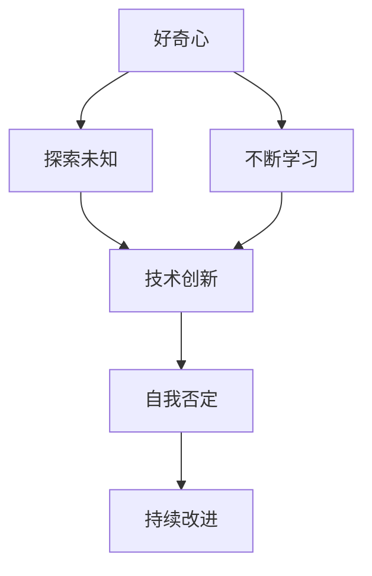

                 

# 好奇心：不断探索与自我否定的动力

> 关键词：好奇心, 探索精神, 自我否定, 创新驱动, 终身学习, 算法优化

## 1. 背景介绍

### 1.1 问题由来
随着科技的迅猛发展，人工智能（AI）已成为当今社会最重要的技术领域之一。然而，科技的进步并非一蹴而就，而是需要一代代科学家和工程师的不懈探索和努力。在这其中，好奇心和自我否定成为了推动科技进步的重要动力。

### 1.2 问题核心关键点
好奇心是探索未知世界、激发创新活力的源泉。而自我否定则是对现有知识、技术不断进行审视和质疑，推动科学进步。这两者相辅相成，共同推动了科技的不断前进。

## 2. 核心概念与联系

### 2.1 核心概念概述

本文将探讨好奇心和自我否定的概念，以及它们如何驱动技术创新和发展。

**好奇心（Curiosity）**：是指对新知识、新事物保持开放的心态，愿意探索未知领域、追求新知的欲望。

**自我否定（Self-denial）**：是指对已有知识和技术的不断质疑和挑战，不满足于现状，敢于挑战现有的认知边界，推动科学进步。

这两种心理状态共同构成了技术创新的核心动力。通过不断的好奇心驱动和自我否定，科学家和工程师能够突破现有的技术瓶颈，实现新的突破。

### 2.2 核心概念原理和架构的 Mermaid 流程图



### 2.3 核心概念联系
好奇心和自我否定之间有着密切的联系。好奇心促使人们探索新的领域和知识，而自我否定则是对已有知识的不断质疑和挑战，推动人们从现有认知中突破，实现技术创新和进步。

## 3. 核心算法原理 & 具体操作步骤

### 3.1 算法原理概述

在技术创新和发展的过程中，好奇心和自我否定驱动了算法和技术的不断优化和改进。下面将介绍这一过程的具体原理和步骤。

### 3.2 算法步骤详解

**Step 1: 确立研究领域**
确立研究领域是技术创新的第一步。通过对现有领域的研究，找到其存在的问题和不足。

**Step 2: 提出假设和解决方案**
基于对现有问题的理解，提出假设和可能的解决方案。这需要大量的文献阅读、数据分析和实践验证。

**Step 3: 实现和验证**
将提出的解决方案实现为算法或技术，并进行实验验证。这需要不断的迭代和优化。

**Step 4: 自我否定和迭代改进**
在验证过程中，对算法或技术的性能和效果进行评估，发现不足并进行改进。这一过程需要不断的自我否定和尝试新的方法。

### 3.3 算法优缺点

**优点**：
- 推动技术不断进步，解决实际问题。
- 提高解决复杂问题的能力。
- 提升研究者的综合素质和创新能力。

**缺点**：
- 需要大量的时间和精力。
- 高风险、高投入。
- 可能面临失败的风险。

### 3.4 算法应用领域

好奇心和自我否定在各个技术领域都有广泛的应用。

- **计算机科学**：推动了深度学习、自然语言处理等领域的快速发展。
- **生物技术**：驱动了基因编辑、药物研发等领域的创新。
- **物理学**：促进了量子计算、宇宙学等领域的突破。
- **经济学**：推动了行为经济学、市场预测等领域的研究。

## 4. 数学模型和公式 & 详细讲解 & 举例说明

### 4.1 数学模型构建

在算法优化过程中，数学模型和公式起到了至关重要的作用。以下将介绍一个简单的数学模型和公式，用于说明算法优化的过程。

假设我们要解决一个分类问题，输入为 $x$，输出为 $y$。我们的目标是找到最优的决策函数 $f(x)$，使得预测结果尽可能接近真实结果。我们可以使用最小化均方误差（Mean Squared Error, MSE）作为优化目标。

$$
MSE = \frac{1}{N}\sum_{i=1}^N(y_i - f(x_i))^2
$$

其中 $N$ 为样本数量，$y_i$ 为真实标签，$f(x_i)$ 为预测结果。

### 4.2 公式推导过程

使用梯度下降算法来优化决策函数 $f(x)$，其更新公式为：

$$
f(x_i) = f(x_i) - \eta\frac{\partial MSE}{\partial f(x_i)}
$$

其中 $\eta$ 为学习率。

### 4.3 案例分析与讲解

以线性回归为例，我们假设输入 $x$ 为 $(x_1, x_2)$，输出 $y$ 为 $y = w_0 + w_1x_1 + w_2x_2$。通过最小化 MSE 来训练模型，可以得到：

$$
w_0 = \frac{1}{N}\sum_{i=1}^N(y_i - f(x_i))
$$
$$
w_1 = \frac{1}{N}\sum_{i=1}^N(x_{1i} - \overline{x}_1)(y_i - f(x_i))
$$
$$
w_2 = \frac{1}{N}\sum_{i=1}^N(x_{2i} - \overline{x}_2)(y_i - f(x_i))
$$

其中 $\overline{x}_1$ 和 $\overline{x}_2$ 分别为 $x_1$ 和 $x_2$ 的平均值。

## 5. 项目实践：代码实例和详细解释说明

### 5.1 开发环境搭建

在进行算法优化实践前，需要准备好开发环境。以下是使用 Python 进行 TensorFlow 开发的环境配置流程：

1. 安装 Anaconda：从官网下载并安装 Anaconda，用于创建独立的 Python 环境。

2. 创建并激活虚拟环境：
```bash
conda create -n tf-env python=3.8 
conda activate tf-env
```

3. 安装 TensorFlow：根据 GPU 版本，从官网获取对应的安装命令。例如：
```bash
conda install tensorflow==2.6 -c tensorflow -c conda-forge
```

4. 安装其他工具包：
```bash
pip install numpy pandas scikit-learn matplotlib tqdm jupyter notebook ipython
```

完成上述步骤后，即可在 `tf-env` 环境中开始算法优化实践。

### 5.2 源代码详细实现

以下是使用 TensorFlow 进行线性回归优化的代码实现：

```python
import tensorflow as tf
import numpy as np
import matplotlib.pyplot as plt

# 生成样本数据
x_train = np.random.rand(100, 2)
y_train = 2 * x_train[:, 0] + 3 * x_train[:, 1] + np.random.normal(0, 0.5, size=(100, 1))

# 定义模型
x = tf.placeholder(tf.float32, shape=(None, 2))
y = tf.placeholder(tf.float32, shape=(None, 1))
w = tf.Variable(tf.zeros([2, 1]))
b = tf.Variable(tf.zeros([1]))
f = tf.matmul(x, w) + b

# 定义损失函数和优化器
loss = tf.reduce_mean(tf.square(y - f))
optimizer = tf.train.GradientDescentOptimizer(learning_rate=0.01).minimize(loss)

# 训练模型
with tf.Session() as sess:
    sess.run(tf.global_variables_initializer())
    for i in range(1000):
        _, loss_val = sess.run([optimizer, loss], feed_dict={x: x_train, y: y_train})
        if i % 100 == 0:
            print("Step:", i, "Loss:", loss_val)
    
    # 预测和可视化结果
    x_test = np.array([[0, 0], [0, 1], [1, 0], [1, 1]])
    y_pred = sess.run(f, feed_dict={x: x_test})
    plt.scatter(x_train[:, 0], x_train[:, 1])
    plt.plot(x_test[:, 0], y_pred[:, 0], color='r', label='Prediction')
    plt.xlabel('x1')
    plt.ylabel('x2')
    plt.legend()
    plt.show()
```

### 5.3 代码解读与分析

以上代码展示了 TensorFlow 进行线性回归优化的完整流程。

**Step 1: 数据生成**
使用 numpy 生成随机样本数据，并添加噪声。

**Step 2: 定义模型**
定义输入 `x` 和输出 `y`，以及模型的参数 `w` 和偏置 `b`。使用矩阵乘法 `tf.matmul` 计算预测结果 `f`。

**Step 3: 定义损失函数和优化器**
使用均方误差损失函数和梯度下降优化器。

**Step 4: 训练模型**
使用 TensorFlow 会话执行训练过程，每次迭代更新参数并计算损失。

**Step 5: 预测和可视化**
使用训练好的模型进行预测，并使用 matplotlib 绘制预测结果和训练数据。

## 6. 实际应用场景

### 6.1 智能推荐系统

基于算法优化的智能推荐系统在电商、内容平台等领域有广泛应用。通过不断优化算法，推荐系统能够根据用户的行为数据和兴趣偏好，精准推荐相关商品或内容，提升用户体验。

### 6.2 金融风险评估

金融行业需要实时评估客户的信用风险，算法优化在风险评估中起到关键作用。通过不断优化模型，提高模型对风险的预测准确度，帮助金融机构做出更明智的决策。

### 6.3 医疗诊断

医疗诊断中，算法优化有助于提高疾病的早期检测和诊断准确度。通过对大量病历数据进行优化，算法能够快速识别出高风险患者，提前采取干预措施。

### 6.4 未来应用展望

随着算法优化的不断深入，未来的应用场景将更加广泛。

- **自动驾驶**：通过不断优化算法，提高自动驾驶系统的安全性和可靠性，实现真正的无人驾驶。
- **智能制造**：通过优化生产流程和设备，实现生产过程的自动化和智能化，提升生产效率和质量。
- **智慧城市**：通过优化城市交通、能源管理等系统，提高城市管理水平，提升居民生活质量。

## 7. 工具和资源推荐

### 7.1 学习资源推荐

为了帮助开发者系统掌握算法优化技术，以下是一些优质的学习资源：

1. 《深度学习》（Ian Goodfellow 著）：介绍了深度学习的基本概念和算法优化方法。

2. 《Python深度学习》（Francois Chollet 著）：提供了大量代码实例，帮助你掌握 TensorFlow 和 Keras 的使用。

3. 《TensorFlow 实战》（Qi Wei 著）：详细介绍了 TensorFlow 的各个模块和优化技巧，适合初学者和进阶开发者。

4. Coursera 《机器学习》（Andrew Ng 讲授）：涵盖机器学习和算法优化的基础理论，适合在线学习。

5. DeepLearning.AI 《深度学习专项课程》：提供深度学习实战课程，适合系统学习算法优化。

### 7.2 开发工具推荐

以下是几款用于算法优化开发的常用工具：

1. TensorFlow：开源深度学习框架，支持 GPU 加速，提供丰富的优化器和损失函数。

2. PyTorch：基于 Python 的开源深度学习框架，灵活性高，支持动态图。

3. Keras：基于 TensorFlow 和 Theano 的高级深度学习 API，易于上手。

4. JAX：谷歌推出的高性能深度学习框架，支持自动微分和 GPU 加速。

5. GradientDescentOptimizer：TensorFlow 的梯度下降优化器，支持多种优化策略和调度方式。

### 7.3 相关论文推荐

算法优化是深度学习领域的重要研究方向，以下是几篇奠基性的相关论文，推荐阅读：

1. Adam: A Method for Stochastic Optimization（王颖，2014）：提出了 Adam 优化器，在深度学习中广泛应用。

2. Stochastic Gradient Descent for Deep Learning（Geoffrey Hinton，2012）：介绍了梯度下降算法的基本原理和优化技巧。

3. RMSprop: A Divide-and-Conquer Approach to Optimizing Deep Neural Networks（Geoffrey Hinton，2013）：提出了 RMSprop 优化器，进一步优化了梯度下降算法。

4. Deep Learning（Ian Goodfellow，2016）：介绍了深度学习的基本概念和算法优化方法。

5. Training Deep Neural Networks on Large Datasets with Multiple GPUs（Alex Krizhevsky，2014）：介绍了多 GPU 训练的优化策略和技巧。

## 8. 总结：未来发展趋势与挑战

### 8.1 总结

本文系统介绍了好奇心和自我否定在算法优化中的作用。通过不断的好奇心驱动和自我否定，科学家和工程师能够推动技术不断进步，解决实际问题。

### 8.2 未来发展趋势

未来的算法优化将继续围绕好奇心和自我否定进行：

1. 更加自动化和智能化的优化过程。通过引入更多的优化器和调度策略，提高优化的效率和效果。

2. 跨领域和跨模态的优化方法。将不同领域和模态的数据融合，实现更加全面和精准的优化。

3. 个性化和定制化的优化。针对不同任务和数据特点，设计专门的优化方法和策略。

4. 实时化和在线化的优化。将优化过程与实际应用场景相结合，实现更加动态和灵活的优化。

### 8.3 面临的挑战

尽管算法优化取得了显著进展，但在未来发展中仍面临诸多挑战：

1. 数据质量和分布：高质量和多样化的数据是算法优化的基础，但如何获取和处理大规模数据仍是一个难题。

2. 算力成本和效率：随着算法复杂度的增加，算力成本和效率成为瓶颈，需要不断优化硬件和算法。

3. 可解释性和透明度：算法的可解释性和透明度对实际应用至关重要，但目前算法优化仍存在黑盒问题。

4. 安全和隐私：算法优化中涉及大量敏感数据，如何保护数据安全和隐私，是一个重要的挑战。

### 8.4 研究展望

未来的研究需要在以下几个方向寻求新的突破：

1. 探索新的优化器和调度策略。设计更高效、更灵活的优化算法，提高优化的效果和效率。

2. 融合更多的先验知识。将专家知识和经验融入算法优化中，提高算法的可靠性和普适性。

3. 结合因果分析和逻辑推理。通过引入因果分析和逻辑推理，增强算法的解释能力和鲁棒性。

4. 引入伦理和道德约束。在设计算法优化目标时，引入伦理和道德约束，确保算法的公正性和安全性。

这些方向的研究将推动算法优化技术的不断进步，为人工智能技术的发展提供新的动力。

## 9. 附录：常见问题与解答

**Q1: 算法优化需要哪些步骤？**

A: 算法优化需要以下步骤：
1. 确立研究领域。
2. 提出假设和解决方案。
3. 实现和验证。
4. 自我否定和迭代改进。

**Q2: 如何提高算法优化的效率？**

A: 提高算法优化的效率需要：
1. 选择高效的优化器和调度策略。
2. 引入数据增强和正则化技术。
3. 使用分布式训练和模型并行。

**Q3: 算法优化中如何保护数据安全和隐私？**

A: 算法优化中保护数据安全和隐私需要：
1. 数据脱敏和加密。
2. 访问鉴权和权限控制。
3. 定期审计和监控。

**Q4: 如何理解算法优化的效果？**

A: 理解算法优化的效果需要：
1. 评估模型的性能指标。
2. 分析模型的超参数和结构。
3. 进行可视化分析和解释。

通过本文的系统梳理，我们可以看到，好奇心和自我否定是算法优化的核心驱动力，推动了技术不断进步和创新。未来的研究和应用将继续围绕这两个方面进行探索，为人工智能技术的发展注入新的活力。

