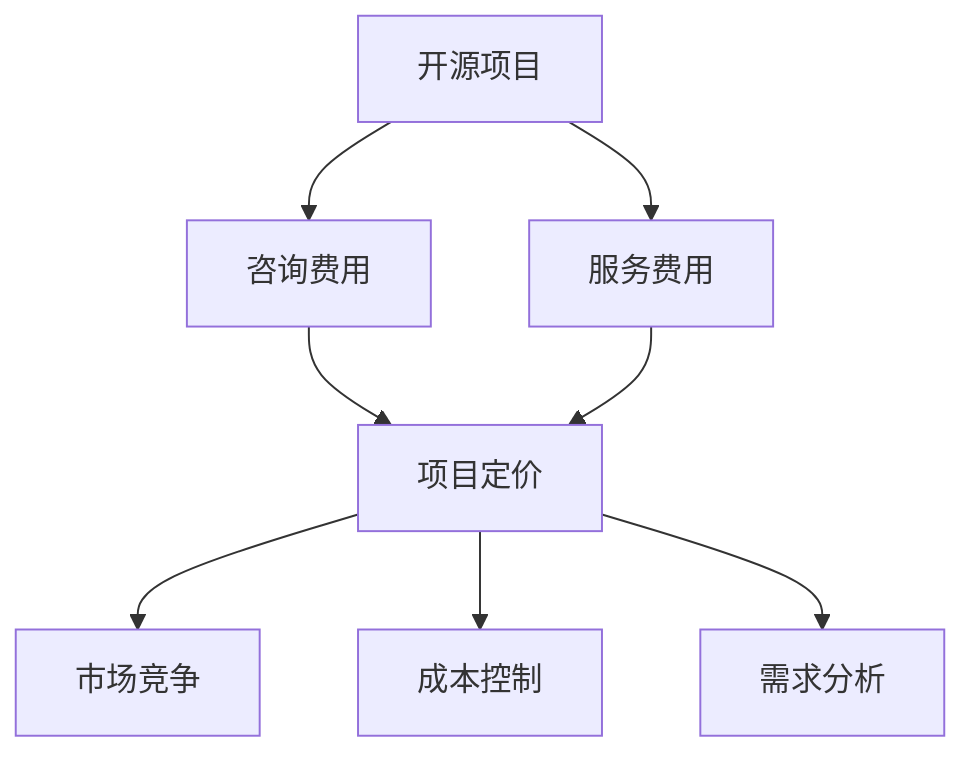

                 

# 如何为开源项目定价：咨询和服务费用策略

> 关键词：开源项目, 定价策略, 咨询费用, 服务费用, 商业化

## 1. 背景介绍

### 1.1 问题由来

近年来，开源项目凭借其灵活性、可扩展性和社区支持，逐渐成为技术创新的重要力量。然而，在开源项目的推广和维护过程中，如何准确、有效地定价是一个不容忽视的问题。合理的定价策略不仅能提升开源项目的商业价值，还能吸引更多的社区贡献者和用户，实现可持续发展的良性循环。本文将深入探讨如何为开源项目制定合理的咨询和服务费用策略，帮助项目维护者更好地进行商业化运作。

### 1.2 问题核心关键点

制定合理的咨询和服务费用策略需要考虑多个因素，包括但不限于项目复杂度、客户需求、市场竞争、成本控制等。本节将详细分析这些关键点，并给出初步的定价框架。

## 2. 核心概念与联系

### 2.1 核心概念概述

- **开源项目**：基于开源许可协议（如GPL、Apache等）发布的项目代码，强调共享、自由和协作。
- **咨询费用**：提供专业咨询服务所需收取的费用，包括技术咨询、需求分析、系统设计等。
- **服务费用**：提供特定功能的维护、升级、定制化开发等有偿服务所需收取的费用。
- **商业化**：将开源项目转化为商业模式的过程，包括定价、营销、销售等环节。
- **定价策略**：确定产品或服务价格的过程，涉及成本计算、市场需求分析、竞争分析等。

### 2.2 核心概念原理和架构的 Mermaid 流程图(Mermaid 流程节点中不要有括号、逗号等特殊字符)



这个流程图展示了开源项目定价策略的关键流程：

1. 开源项目（A）通过提供免费的代码资源和灵活的协作机制，吸引社区贡献者和用户。
2. 咨询费用（B）和服务费用（C）是开源项目商业化的重要手段，通过提供专业的技术支持和维护服务，获得商业收入。
3. 市场竞争（E）和成本控制（F）是定价策略必须考虑的因素，确保价格具有竞争力且能够覆盖成本。
4. 需求分析（G）帮助确定客户具体需求，提供针对性的咨询和服务，提升客户满意度。

## 3. 核心算法原理 & 具体操作步骤

### 3.1 算法原理概述

开源项目定价策略的核心在于平衡成本与收益，同时满足客户需求和市场竞争要求。具体的定价算法包括但不限于以下几种：

- **成本加成定价**：在项目成本基础上加一定比例的利润率，适用于成本明确、需求稳定的项目。
- **市场定价**：根据市场竞争情况，参考同行业或类似产品的定价，确保价格具有竞争力。
- **价值定价**：基于客户对项目价值的主观评估，确定价格，适用于高度定制化的项目。
- **成本效益定价**：基于项目带来的经济效益和预期收益，确定价格，适用于期望高收益的项目。

### 3.2 算法步骤详解

制定开源项目定价策略的步骤如下：

1. **成本分析**：详细计算项目开发、维护、市场营销等成本，包括人员工资、工具费用、服务器成本等。
2. **市场需求调研**：通过问卷调查、客户访谈等方式，了解潜在客户的需求和支付意愿。
3. **竞争分析**：分析同行业或类似产品的定价策略，了解竞争对手的价格水平。
4. **需求分类**：根据客户需求的不同层次，分类提供基础服务、高级定制、技术支持等不同层次的咨询和服务。
5. **定价模型选择**：根据项目特点选择合适的定价模型，并根据市场需求和竞争情况进行调整。
6. **定价测试和优化**：在市场上进行价格测试，收集反馈信息，持续优化定价策略。

### 3.3 算法优缺点

制定合理的定价策略有助于开源项目的商业化和可持续发展，但同时也面临一些挑战：

**优点**：
- 提升开源项目的商业价值，吸引更多客户和贡献者。
- 为项目开发和维护提供稳定资金来源。
- 促进技术创新和应用推广。

**缺点**：
- 定价不当可能导致客户流失或价格战，影响项目收益。
- 商业化过程可能削弱开源项目的社区驱动特性。
- 定价策略需要不断调整和优化，增加管理复杂度。

### 3.4 算法应用领域

开源项目定价策略广泛适用于各种类型的项目，包括但不限于：

- **Web应用**：提供网站设计、开发、维护等咨询服务。
- **移动应用**：提供应用开发、技术支持、定制化开发等服务。
- **数据科学**：提供数据分析、机器学习模型训练、数据管理等服务。
- **云计算**：提供云服务、云存储、云安全等咨询和服务。
- **物联网**：提供设备连接、数据采集、系统集成等服务。

## 4. 数学模型和公式 & 详细讲解 & 举例说明（备注：数学公式请使用latex格式，latex嵌入文中独立段落使用 $$，段落内使用 $)
### 4.1 数学模型构建

开源项目定价的数学模型可以表示为：

$$
P = C + M + V
$$

其中，$P$ 为定价，$C$ 为成本，$M$ 为市场竞争因素，$V$ 为客户价值感知。

### 4.2 公式推导过程

通过成本加成定价模型，我们有：

$$
P = C(1 + r)
$$

其中，$r$ 为利润率。当市场需求较大时，可采用市场定价模型：

$$
P = P_{competitor} \times (1 + m)
$$

其中，$m$ 为市场调整系数。当客户需求多样时，可采用价值定价模型：

$$
P = V \times p_v
$$

其中，$p_v$ 为价值定价系数。

### 4.3 案例分析与讲解

假设某开源项目开发和维护成本为$C = 10000$元，市场竞争系数$m = 0.2$，价值定价系数$p_v = 1.5$，利润率$r = 0.2$，则定价计算如下：

$$
P_{base} = C(1 + r) = 10000(1 + 0.2) = 12000 \text{元}
$$

$$
P_{market} = P_{competitor} \times (1 + m) = P_{competitor} \times 1.2
$$

$$
P_{value} = V \times p_v = V \times 1.5
$$

根据市场需求和竞争情况，我们可以选择合适的定价模型进行调整，如将竞争系数调整为$m = 0.3$，则有：

$$
P_{market} = P_{competitor} \times 1.3
$$

通过综合考虑成本、市场和客户价值，确定最终的定价策略，可以最大化项目的商业收益和客户满意度。

## 5. 项目实践：代码实例和详细解释说明

### 5.1 开发环境搭建

为了实现上述定价策略，我们需要搭建一个简单的开源项目，并提供相应的咨询和服务支持。以下是Python和Django框架的示例代码：

```python
# 导入必要的库
from django.http import HttpResponse
from django.shortcuts import render

# 定义定价计算器
def price_calculator(request):
    # 获取用户输入的参数
    cost = float(request.POST.get('cost', 0))
    market_coefficient = float(request.POST.get('market_coefficient', 0))
    value_coefficient = float(request.POST.get('value_coefficient', 0))
    profit_margin = float(request.POST.get('profit_margin', 0))
    
    # 计算定价
    base_price = cost * (1 + profit_margin)
    market_price = base_price * (1 + market_coefficient)
    value_price = cost * value_coefficient
    
    # 返回定价结果
    context = {
        'base_price': base_price,
        'market_price': market_price,
        'value_price': value_price
    }
    return render(request, 'price_calculator.html', context)
```

### 5.2 源代码详细实现

上述代码定义了一个简单的定价计算器，用于计算基于成本加成、市场竞争和客户价值感知的定价。用户可以通过表单输入成本、市场竞争系数、价值定价系数和利润率，获取计算结果。

### 5.3 代码解读与分析

代码中使用了Django框架来构建Web应用，提供了一个简单的表单页面，用户可以在其中输入定价参数，并通过后端计算输出结果。以下是代码的详细解读：

- `price_calculator`函数：接收用户请求，计算定价并返回结果页面。
- `cost`等参数：用户输入的成本、市场竞争系数、价值定价系数和利润率。
- `base_price`等变量：根据不同定价模型计算出的基础定价、市场定价和价值定价。
- `context`字典：将定价结果传递给模板页面。
- `price_calculator.html`模板：显示定价结果。

### 5.4 运行结果展示

运行上述代码，打开定价计算器页面，输入参数后，即可得到不同定价模型下的定价结果。例如，假设成本为10000元，利润率20%，市场竞争系数30%，价值定价系数1.5，则市场定价结果为：

$$
P_{market} = 10000 \times (1 + 0.2) \times (1 + 0.3) = 17200 \text{元}
$$

## 6. 实际应用场景

### 6.1 开源社区

开源社区中的许多项目已经开始尝试商业化，通过提供咨询、培训、支持等服务获得资金支持。例如，Linode提供了灵活的云服务定价策略，根据用户的使用量和服务等级，提供不同的价格套餐。GitHub也推出了SaaS服务GitHub Enterprise，为团队提供定制化的项目管理服务。

### 6.2 企业应用

企业用户往往需要更专业的技术支持和定制化开发，开源项目可以通过提供这些服务获得额外的收入。例如，Kubernetes社区通过提供Kubernetes咨询服务，帮助企业部署和管理容器化应用，获得了大量的商业收益。

### 6.3 教育培训

教育机构和培训机构可以借助开源项目提供的教学资源和工具，为学生和学员提供优质的学习体验。例如，Google的TensorFlow社区提供了大量的学习资源和开发工具，吸引了大量的开发者和学生。

### 6.4 未来应用展望

开源项目的商业化前景广阔，未来将有更多项目通过提供优质的咨询和服务，实现商业价值最大化。随着技术的不断进步和市场需求的变化，开源项目定价策略也将不断创新，满足不同客户的需求和期望。

## 7. 工具和资源推荐

### 7.1 学习资源推荐

- **《开源项目商业化》系列书籍**：详细介绍了开源项目商业化的全过程，包括定价、营销、销售等环节。
- **Django官方文档**：提供了Django框架的详细文档，包括搭建Web应用、处理表单数据等。
- **GitHub Learning Lab**：提供丰富的开源项目实战课程，帮助开发者提升技能和经验。
- **Kubernetes官方文档**：提供了Kubernetes的详细文档和官方指南，帮助用户更好地部署和管理容器化应用。

### 7.2 开发工具推荐

- **Django框架**：一个成熟的Web应用框架，提供了丰富的功能和扩展性，适合开发定价计算器等Web应用。
- **GitHub平台**：提供了丰富的开源项目和社区支持，适合开发者进行项目管理和商业化推广。
- **TensorFlow社区**：提供了大量的学习资源和工具，适合开发者进行深度学习和人工智能应用开发。

### 7.3 相关论文推荐

- **《开源项目的商业化》**：介绍开源项目的商业化模式和定价策略。
- **《开源社区的可持续发展》**：分析开源社区的可持续发展和商业化策略。
- **《开源项目定价模型研究》**：探讨开源项目定价模型的选择和优化方法。

## 8. 总结：未来发展趋势与挑战

### 8.1 总结

本文系统介绍了如何为开源项目制定合理的咨询和服务费用策略，通过成本分析、市场需求调研、竞争分析等步骤，得出定价模型，并通过Python和Django框架提供了代码实现和运行结果展示。通过分析实际应用场景和未来发展趋势，展示了开源项目定价策略的重要性和广阔前景。

### 8.2 未来发展趋势

开源项目定价策略的未来发展趋势包括：

1. **多样化定价模型**：随着市场和客户需求的变化，定价模型将更加多样化，以满足不同的客户需求。
2. **智能化定价**：利用机器学习和大数据技术，实现定价模型的自动化调整和优化。
3. **按需付费**：提供更加灵活的定价方式，根据实际使用情况进行计费，提升客户满意度。
4. **全球化定价**：根据不同国家和地区的市场情况，调整定价策略，扩大国际市场。

### 8.3 面临的挑战

制定合理的定价策略虽然有助于开源项目的商业化，但也面临以下挑战：

1. **市场需求变化**：市场需求的不确定性增加了定价策略的复杂性，需要持续调整和优化。
2. **市场竞争加剧**：市场竞争的加剧可能导致价格战，影响项目收益。
3. **客户需求多样**：客户需求的多样性增加了定价策略的复杂性，需要提供多样化的服务和定价方案。
4. **技术更新快**：技术更新速度快，需要不断跟进最新的技术和市场趋势，调整定价策略。

### 8.4 研究展望

未来的研究可以从以下几个方面进行：

1. **定价模型优化**：利用机器学习和大数据技术，优化定价模型，提高定价准确性和客户满意度。
2. **客户需求分析**：通过用户反馈和数据分析，深入理解客户需求，提供更加个性化的服务和定价。
3. **竞争分析工具**：开发竞争分析工具，实时监控市场竞争情况，调整定价策略。
4. **定价自动化**：开发自动化定价系统，实时调整定价策略，提升运营效率。

总之，开源项目定价策略的研究和实践是一个不断迭代和优化的过程，需要不断跟进市场需求和技术趋势，以确保项目的商业价值和客户满意度。相信随着技术的发展和研究的深入，开源项目的定价策略将更加科学和高效，实现可持续发展和商业化成功。

## 9. 附录：常见问题与解答

**Q1：如何确定咨询费用和服务费用？**

A: 确定咨询费用和服务费用的关键在于了解项目的特点和客户的需求。一般来说，可以采用成本加成、市场定价、价值定价等方法，结合项目成本、市场需求和客户价值，综合确定定价。

**Q2：如何评估项目成本？**

A: 项目成本包括开发成本、维护成本、市场营销成本等，需要详细记录和分析。可以通过成本核算表、预算表等工具，准确计算和监控项目成本。

**Q3：如何应对市场竞争？**

A: 应对市场竞争的关键在于提供高质量的服务和灵活的定价策略。可以通过不断提升服务质量和客户满意度，增强品牌竞争力。同时，通过按需付费等灵活的定价方式，吸引更多的客户和贡献者。

**Q4：如何提升客户满意度？**

A: 提升客户满意度的关键在于提供优质的服务和定制化的解决方案。可以通过定期的客户反馈和需求调研，了解客户需求和痛点，及时调整和优化服务方案。

**Q5：如何处理定价策略的调整？**

A: 定价策略的调整需要灵活处理，及时根据市场需求和技术变化进行调整。可以通过定期进行市场调研和客户反馈，动态调整定价策略，确保定价的合理性和市场竞争力。

---

作者：禅与计算机程序设计艺术 / Zen and the Art of Computer Programming

