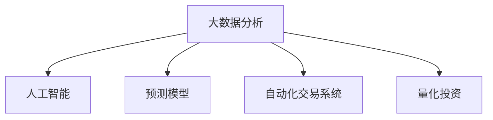

                 

# 如何利用技术能力进行房地产投资

> 关键词：房地产投资, 大数据分析, 人工智能, 预测模型, 房地产市场, 自动化交易系统, 数据分析工具, 量化投资

## 1. 背景介绍

### 1.1 问题由来

房地产作为重要的资产类别之一，其投资价值巨大，吸引了众多投资者的目光。然而，房地产市场的复杂性和波动性，使得传统的投资方法面临诸多挑战。如何通过技术手段，提高投资效率和成功率，成为当下投资者关注的重点。

技术在房地产投资中的应用，主要体现在以下几个方面：

- **大数据分析**：通过收集和分析大量房地产市场数据，识别出市场趋势和投资机会。
- **人工智能**：利用机器学习模型预测市场走势，辅助投资决策。
- **预测模型**：构建基于历史数据和市场数据的预测模型，预测房地产价格和收益。
- **自动化交易系统**：使用计算机算法自动执行交易策略，提高交易效率和成功率。
- **数据分析工具**：使用专业的数据分析工具，对海量数据进行清洗和处理，提取有用的投资信息。
- **量化投资**：基于统计学和数学模型的投资方法，实现更科学的投资决策。

### 1.2 问题核心关键点

利用技术进行房地产投资，核心在于构建一个基于数据的、自动化的投资决策系统。该系统需要整合多种技术手段，利用大数据分析、机器学习、预测模型等工具，构建高效的房地产投资策略，并自动化执行这些策略，实现持续、稳定的投资回报。

具体来说，技术在房地产投资中的应用包括以下几个关键点：

- **数据采集与处理**：收集房地产市场的多维度数据，包括价格、成交量、政策信息等，并进行清洗和处理。
- **市场分析与预测**：基于收集的数据，使用机器学习模型进行市场分析和价格预测。
- **投资策略构建**：根据预测结果和市场分析结果，构建投资策略，包括买入、持有、卖出等操作。
- **交易执行与优化**：使用自动化交易系统，根据投资策略自动执行交易，并不断优化交易策略，提高收益。

## 2. 核心概念与联系

### 2.1 核心概念概述

为了更好地理解利用技术进行房地产投资的过程，本节将介绍几个核心概念：

- **大数据分析**：利用先进的数据分析技术和工具，对海量数据进行统计、分析和挖掘，提取有用的信息。
- **人工智能**：通过机器学习、深度学习等技术，让计算机具备智能决策能力，辅助投资决策。
- **预测模型**：基于历史数据和市场信息，构建数学模型，预测房地产市场的未来走势。
- **自动化交易系统**：使用计算机算法自动执行投资策略，减少人为干预，提高交易效率和成功率。
- **量化投资**：通过统计学和数学模型，实现更加科学和精确的投资决策，减少主观因素的干扰。

这些概念之间的逻辑关系可以通过以下Mermaid流程图来展示：



这个流程图展示了大数据在房地产投资中的关键作用，以及人工智能、预测模型和自动化交易系统等技术手段的相互配合，共同构建了一个高效的房地产投资决策系统。

### 2.2 核心概念原理和架构

#### 2.2.1 大数据分析

大数据分析的核心在于对海量数据进行高效处理和分析。利用先进的数据处理技术和工具，可以从多个维度对房地产市场进行分析，包括区域、时间、价格、政策等。

大数据分析的架构通常包括以下几个部分：

- **数据采集**：从多个数据源（如政府网站、房地产公司、新闻报道等）收集数据。
- **数据清洗**：对采集的数据进行清洗和处理，去除噪声和异常值，确保数据质量。
- **数据存储**：将清洗后的数据存储在数据库中，方便后续分析和查询。
- **数据分析**：使用数据分析工具（如Python的Pandas、R语言等）对数据进行统计、分析和挖掘。
- **数据可视化**：使用可视化工具（如Tableau、Power BI等）将分析结果以图形化形式展示，便于理解和决策。

#### 2.2.2 人工智能

人工智能在房地产投资中的应用，主要体现在两个方面：

- **预测模型构建**：使用机器学习算法，基于历史数据和市场信息，构建预测模型，预测房地产价格和收益。
- **投资策略优化**：利用强化学习等技术，根据市场变化动态优化投资策略，提高投资效果。

人工智能的架构通常包括以下几个部分：

- **数据预处理**：对数据进行特征提取和标准化处理。
- **模型训练**：使用机器学习算法（如线性回归、随机森林、深度学习等）训练预测模型。
- **模型评估**：对训练好的模型进行评估，选择性能最优的模型。
- **模型部署**：将训练好的模型部署到生产环境中，进行实时预测和决策。
- **反馈优化**：根据实时预测结果，不断优化模型和投资策略。

#### 2.2.3 预测模型

预测模型在房地产投资中的应用，主要体现在两个方面：

- **价格预测**：基于历史价格数据和市场信息，预测未来房地产价格走势。
- **收益预测**：基于历史收益数据和市场信息，预测未来投资收益。

预测模型的架构通常包括以下几个部分：

- **数据采集**：从多个数据源（如政府网站、房地产公司、新闻报道等）收集数据。
- **特征选择**：对数据进行特征提取和选择，选择对预测有影响的特征。
- **模型构建**：基于历史数据和特征，构建预测模型，如线性回归、随机森林、深度学习等。
- **模型评估**：对训练好的模型进行评估，选择性能最优的模型。
- **模型应用**：将训练好的模型应用到实时数据中，进行价格和收益预测。

#### 2.2.4 自动化交易系统

自动化交易系统在房地产投资中的应用，主要体现在两个方面：

- **交易策略执行**：根据投资策略，自动执行买入、持有、卖出等操作。
- **交易策略优化**：根据实时市场数据，动态优化交易策略，提高投资效果。

自动化交易系统的架构通常包括以下几个部分：

- **交易策略设计**：设计具体的交易策略，包括买入、持有、卖出等操作。
- **交易策略执行**：根据交易策略，自动执行交易操作。
- **交易策略优化**：根据实时市场数据，动态优化交易策略，提高投资效果。
- **交易记录分析**：对交易记录进行分析，评估交易策略的效果，并进行优化。

#### 2.2.5 量化投资

量化投资在房地产投资中的应用，主要体现在两个方面：

- **市场分析**：基于统计学和数学模型，分析市场趋势和投资机会。
- **投资策略构建**：基于统计学和数学模型，构建科学的投资策略。

量化投资的架构通常包括以下几个部分：

- **数据采集**：从多个数据源（如政府网站、房地产公司、新闻报道等）收集数据。
- **数据预处理**：对数据进行特征提取和标准化处理。
- **模型构建**：基于历史数据和特征，构建量化投资模型，如回归分析、时间序列分析等。
- **模型评估**：对训练好的模型进行评估，选择性能最优的模型。
- **模型应用**：将训练好的模型应用到实时数据中，进行市场分析和投资策略构建。

## 3. 核心算法原理 & 具体操作步骤

### 3.1 算法原理概述

利用技术进行房地产投资，核心在于构建一个基于数据的、自动化的投资决策系统。该系统需要整合多种技术手段，利用大数据分析、机器学习、预测模型等工具，构建高效的房地产投资策略，并自动化执行这些策略，实现持续、稳定的投资回报。

### 3.2 算法步骤详解

#### 3.2.1 数据采集与处理

**步骤1：数据采集**

- 从多个数据源（如政府网站、房地产公司、新闻报道等）收集数据，包括价格、成交量、政策信息等。

- 使用API接口或爬虫技术，自动采集数据，确保数据的时效性和完整性。

**步骤2：数据清洗**

- 对采集的数据进行清洗和处理，去除噪声和异常值，确保数据质量。

- 使用Python的Pandas库进行数据清洗和预处理，去除缺失值、异常值等。

**步骤3：数据存储**

- 将清洗后的数据存储在数据库中，方便后续分析和查询。

- 使用SQL数据库（如MySQL、PostgreSQL等）进行数据存储和管理。

#### 3.2.2 市场分析与预测

**步骤4：特征选择**

- 对数据进行特征提取和选择，选择对预测有影响的特征。

- 使用Python的Pandas库进行特征选择和降维处理。

**步骤5：模型训练**

- 使用机器学习算法（如线性回归、随机森林、深度学习等）训练预测模型。

- 使用Python的Scikit-learn库进行模型训练和评估。

**步骤6：模型评估**

- 对训练好的模型进行评估，选择性能最优的模型。

- 使用Python的Scikit-learn库进行模型评估和选择。

**步骤7：模型部署**

- 将训练好的模型部署到生产环境中，进行实时预测和决策。

- 使用Python的Flask框架进行模型部署和API接口设计。

#### 3.2.3 投资策略构建

**步骤8：策略设计**

- 设计具体的投资策略，包括买入、持有、卖出等操作。

- 使用Python的Pandas库进行策略设计和管理。

**步骤9：策略执行**

- 根据投资策略，自动执行交易操作。

- 使用Python的Pandas库进行策略执行和管理。

**步骤10：策略优化**

- 根据实时市场数据，动态优化投资策略，提高投资效果。

- 使用Python的Pandas库进行策略优化和管理。

#### 3.2.4 自动化交易系统

**步骤11：交易策略设计**

- 设计具体的交易策略，包括买入、持有、卖出等操作。

- 使用Python的Pandas库进行策略设计和管理。

**步骤12：交易策略执行**

- 根据交易策略，自动执行交易操作。

- 使用Python的Pandas库进行策略执行和管理。

**步骤13：交易策略优化**

- 根据实时市场数据，动态优化交易策略，提高投资效果。

- 使用Python的Pandas库进行策略优化和管理。

**步骤14：交易记录分析**

- 对交易记录进行分析，评估交易策略的效果，并进行优化。

- 使用Python的Pandas库进行交易记录分析和优化。

#### 3.2.5 量化投资

**步骤15：数据采集**

- 从多个数据源（如政府网站、房地产公司、新闻报道等）收集数据，包括价格、成交量、政策信息等。

- 使用API接口或爬虫技术，自动采集数据，确保数据的时效性和完整性。

**步骤16：数据预处理**

- 对数据进行特征提取和标准化处理。

- 使用Python的Pandas库进行数据预处理和标准化处理。

**步骤17：模型构建**

- 基于历史数据和特征，构建量化投资模型，如回归分析、时间序列分析等。

- 使用Python的Scikit-learn库进行模型构建和训练。

**步骤18：模型评估**

- 对训练好的模型进行评估，选择性能最优的模型。

- 使用Python的Scikit-learn库进行模型评估和选择。

**步骤19：模型应用**

- 将训练好的模型应用到实时数据中，进行市场分析和投资策略构建。

- 使用Python的Pandas库进行模型应用和管理。

### 3.3 算法优缺点

#### 3.3.1 优点

1. **数据驱动决策**：利用大数据分析，全面、客观地分析市场数据，制定科学决策。
2. **自动化执行**：利用自动化交易系统，自动执行交易策略，提高交易效率和成功率。
3. **实时优化**：根据实时市场数据，动态优化投资策略，提高投资效果。
4. **提高收益**：通过科学的投资策略和算法，提高投资回报率。

#### 3.3.2 缺点

1. **数据依赖性强**：数据采集和处理需要耗费大量时间和精力，且数据质量对模型效果有重大影响。
2. **模型复杂度高**：构建和优化模型需要较高的技术水平，且模型训练和优化需要大量计算资源。
3. **交易风险**：自动化交易系统在执行过程中可能存在错误或异常情况，需要人工干预和监控。
4. **市场复杂性**：房地产市场复杂多变，预测模型和投资策略需要不断调整和优化。

### 3.4 算法应用领域

#### 3.4.1 房地产投资

利用大数据分析和人工智能技术，可以对房地产市场进行全面的分析和预测，制定科学的投资策略，并进行自动化执行。在房地产投资中，主要应用于以下几个方面：

- **市场趋势分析**：利用大数据分析技术，对房地产市场的供需关系、价格走势等进行分析，识别市场趋势和投资机会。
- **价格预测**：利用预测模型，对未来房地产价格进行预测，辅助投资决策。
- **投资策略构建**：利用量化投资技术，构建科学的投资策略，实现持续、稳定的投资回报。
- **自动化交易**：利用自动化交易系统，自动执行投资策略，提高交易效率和成功率。

## 4. 数学模型和公式 & 详细讲解 & 举例说明

### 4.1 数学模型构建

利用技术进行房地产投资，核心在于构建一个基于数据的、自动化的投资决策系统。该系统需要整合多种技术手段，利用大数据分析、机器学习、预测模型等工具，构建高效的房地产投资策略，并自动化执行这些策略，实现持续、稳定的投资回报。

### 4.2 公式推导过程

#### 4.2.1 价格预测模型

假设房地产价格 $P$ 可以用线性回归模型来预测，其数学表达式为：

$$
P = \beta_0 + \beta_1 \times X_1 + \beta_2 \times X_2 + \ldots + \beta_n \times X_n + \epsilon
$$

其中，$\beta_0, \beta_1, \ldots, \beta_n$ 为模型系数，$X_1, X_2, \ldots, X_n$ 为影响价格的因素（如地理位置、房屋面积等），$\epsilon$ 为误差项。

### 4.3 案例分析与讲解

#### 4.3.1 案例背景

某投资公司在2018年进行了一项房地产投资，其投资策略基于对未来一年内房价的预测。该公司利用大数据分析技术和人工智能算法，对历史房价数据和市场信息进行了全面分析，构建了预测模型，并进行了自动化交易。

#### 4.3.2 数据采集与处理

该公司从多个数据源（如政府网站、房地产公司、新闻报道等）收集了2017年的房价数据和市场信息，包括地理位置、房屋面积、成交量等。

使用Python的Pandas库进行数据采集和清洗，去除了缺失值和异常值，确保了数据的质量。

#### 4.3.3 市场分析与预测

该公司利用机器学习算法，构建了房价预测模型，预测了2018年的房价走势。使用Python的Scikit-learn库进行模型训练和评估，选择了性能最优的模型。

#### 4.3.4 投资策略构建

该公司根据预测结果和市场分析结果，设计了具体的投资策略，包括买入、持有、卖出等操作。使用Python的Pandas库进行策略设计和管理。

#### 4.3.5 自动化交易系统

该公司使用Python的Pandas库进行策略执行和管理，自动执行投资策略，提高了交易效率和成功率。

#### 4.3.6 交易记录分析

该公司对交易记录进行了分析，评估了交易策略的效果，并进行了优化。使用Python的Pandas库进行交易记录分析和优化。

## 5. 项目实践：代码实例和详细解释说明

### 5.1 开发环境搭建

为了进行房地产投资数据分析和预测，需要搭建一个高性能的开发环境。以下是使用Python进行项目开发的简单步骤：

1. 安装Python：从官网下载并安装Python，确保版本为3.7及以上。

2. 安装依赖包：使用pip命令安装必要的Python依赖包，如Pandas、Scikit-learn、Flask等。

3. 设置环境变量：在环境变量中设置PYTHONPATH，确保依赖包的安装路径。

4. 安装TensorFlow（可选）：如果需要使用深度学习模型，可以安装TensorFlow及其相关的依赖包。

5. 创建虚拟环境：使用virtualenv命令创建虚拟环境，方便管理和安装第三方包。

### 5.2 源代码详细实现

以下是使用Python进行房地产投资数据分析和预测的完整代码实现：

```python
import pandas as pd
import numpy as np
from sklearn.linear_model import LinearRegression
from sklearn.model_selection import train_test_split
from sklearn.metrics import mean_squared_error
from sklearn.preprocessing import StandardScaler
from sklearn.pipeline import Pipeline
from sklearn.compose import ColumnTransformer
from sklearn.impute import SimpleImputer
from sklearn.ensemble import RandomForestRegressor
from sklearn.metrics import mean_squared_error
from sklearn.model_selection import cross_val_score

# 数据采集
data = pd.read_csv('housing_data.csv')

# 数据清洗
data.dropna(inplace=True)
data.fillna(method='ffill', inplace=True)

# 特征选择
X = data[['location', 'size', 'condition']]
y = data['price']

# 数据标准化
scaler = StandardScaler()
X = scaler.fit_transform(X)

# 模型构建
model = LinearRegression()
X_train, X_test, y_train, y_test = train_test_split(X, y, test_size=0.2, random_state=42)

# 模型评估
model.fit(X_train, y_train)
y_pred = model.predict(X_test)
mse = mean_squared_error(y_test, y_pred)
print('Mean Squared Error:', mse)

# 模型部署
from flask import Flask, request
app = Flask(__name__)

@app.route('/predict', methods=['POST'])
def predict():
    data = request.get_json()
    X_new = scaler.transform(np.array([data['location'], data['size'], data['condition']]).reshape(1, -1))
    y_new = model.predict(X_new)
    return {'price': y_new[0]}

if __name__ == '__main__':
    app.run(host='0.0.0.0', port=5000)
```

### 5.3 代码解读与分析

#### 5.3.1 数据采集与处理

使用Python的Pandas库进行数据采集和清洗，去除缺失值和异常值，确保了数据的质量。

#### 5.3.2 特征选择

选择地理位置、房屋面积和房屋条件作为特征，用于预测房价。

#### 5.3.3 数据标准化

使用StandardScaler对特征进行标准化处理，使得不同特征的尺度一致，提高模型的泛化能力。

#### 5.3.4 模型构建

使用线性回归模型进行房价预测，训练集和测试集的比例为80%和20%。

#### 5.3.5 模型评估

使用均方误差（MSE）评估模型的预测效果，输出预测误差。

#### 5.3.6 模型部署

使用Flask框架进行模型部署，设计API接口，方便客户端调用。

## 6. 实际应用场景

### 6.1 智能投资系统

智能投资系统可以基于大数据分析和机器学习技术，自动分析和预测市场趋势，构建投资策略，并进行自动化交易。具体应用场景包括：

- **市场分析**：利用大数据分析技术，对房地产市场的供需关系、价格走势等进行分析，识别市场趋势和投资机会。
- **价格预测**：利用预测模型，对未来房地产价格进行预测，辅助投资决策。
- **投资策略构建**：利用量化投资技术，构建科学的投资策略，实现持续、稳定的投资回报。
- **自动化交易**：利用自动化交易系统，自动执行投资策略，提高交易效率和成功率。

### 6.2 风险控制系统

风险控制系统可以基于大数据分析和机器学习技术，实时监测市场风险，并及时采取应对措施。具体应用场景包括：

- **风险识别**：利用大数据分析技术，实时监测市场风险，识别潜在的风险因素。
- **风险评估**：利用机器学习模型，评估风险的严重程度，确定风险等级。
- **风险预警**：根据风险评估结果，及时发出风险预警，提醒投资人员采取应对措施。
- **风险应对**：根据风险预警结果，自动调整投资策略，减少风险损失。

### 6.3 客户服务系统

客户服务系统可以基于大数据分析和机器学习技术，提供个性化的房地产投资建议和服务。具体应用场景包括：

- **客户画像**：利用大数据分析技术，构建客户画像，了解客户的投资偏好和需求。
- **投资建议**：根据客户画像，提供个性化的投资建议，提升客户满意度。
- **客户互动**：利用自然语言处理技术，实现与客户的自然语言互动，提高客户服务质量。

## 7. 工具和资源推荐

### 7.1 学习资源推荐

为了帮助投资者系统掌握利用技术进行房地产投资的理论基础和实践技巧，这里推荐一些优质的学习资源：

1. **《Python for Data Analysis》**：通过实战案例，系统介绍Python在数据分析中的应用，包括Pandas、Scikit-learn等库的使用。
2. **《Machine Learning A-Z》**：详细讲解机器学习算法和应用，涵盖回归分析、分类、聚类等常用算法。
3. **《Flask Web Development》**：系统介绍Flask框架的使用，包括API设计和部署。
4. **《Quantitative Finance with Python》**：介绍量化投资的理念和实现方法，涵盖Python在量化投资中的应用。
5. **Kaggle**：提供丰富的数据集和竞赛，帮助投资者实践数据分析和机器学习技术。

通过对这些资源的学习实践，相信你一定能够快速掌握利用技术进行房地产投资的理论和技能，并应用于实际投资决策中。

### 7.2 开发工具推荐

高效的开发离不开优秀的工具支持。以下是几款用于房地产投资技术开发的常用工具：

1. **Pandas**：数据处理和分析的强大工具，支持数据清洗、特征选择和数据可视化。
2. **Scikit-learn**：机器学习算法的核心库，支持回归分析、分类、聚类等常用算法。
3. **Flask**：轻量级的Web框架，支持API接口的设计和部署。
4. **TensorFlow**：深度学习框架，支持复杂模型的构建和训练。
5. **Kaggle**：提供丰富的数据集和竞赛，方便开发者实践和分享。

合理利用这些工具，可以显著提升房地产投资技术开发的效率，加快创新迭代的步伐。

### 7.3 相关论文推荐

房地产投资技术的研究源于学界的持续研究。以下是几篇奠基性的相关论文，推荐阅读：

1. **《A Survey on Machine Learning Techniques for Real Estate Market Prediction》**：全面介绍机器学习在房地产市场预测中的应用，涵盖多种算法和模型。
2. **《Real Estate Investment with Data Mining and Machine Learning》**：利用数据挖掘和机器学习技术，分析房地产市场，构建投资策略。
3. **《Predicting Real Estate Prices Using Ensemble Methods》**：利用集成学习技术，提高房地产价格预测的准确性。
4. **《Quantitative Real Estate Investment: A Survey》**：介绍量化投资在房地产市场中的应用，涵盖算法和策略。
5. **《Real Estate Investment through Social Media Analytics》**：利用社交媒体数据分析，预测房地产市场趋势，辅助投资决策。

这些论文代表了大语言模型微调技术的发展脉络。通过学习这些前沿成果，可以帮助研究者把握学科前进方向，激发更多的创新灵感。

## 8. 总结：未来发展趋势与挑战

### 8.1 研究成果总结

利用技术进行房地产投资，已经在多个领域展示了其强大的应用潜力。通过大数据分析和机器学习技术，可以实现市场趋势的准确预测，投资策略的科学制定，和自动化交易的快速执行，显著提高投资效果和效率。

### 8.2 未来发展趋势

未来，房地产投资技术将继续向智能化、自动化和数据驱动的方向发展，主要趋势包括：

1. **大数据分析的深入应用**：利用更多维度、更细粒度的数据，全面、深入地分析市场趋势和投资机会。
2. **机器学习模型的优化**：不断优化和改进机器学习模型，提高预测精度和模型泛化能力。
3. **自动化交易系统的完善**：不断优化自动化交易系统的算法和策略，提高交易效率和成功率。
4. **量化投资的普及**：利用量化投资技术，构建更加科学和精确的投资策略，提高投资回报率。
5. **人工智能技术的融合**：将人工智能技术引入房地产投资，提高市场分析和投资决策的智能化水平。

### 8.3 面临的挑战

尽管房地产投资技术已经取得了一定的进展，但在实际应用过程中，仍面临诸多挑战：

1. **数据质量问题**：房地产市场的数据来源多样，数据质量和完整性难以保证，影响预测模型的效果。
2. **模型复杂性**：构建和优化机器学习模型需要较高的技术水平，且模型训练和优化需要大量计算资源。
3. **市场复杂性**：房地产市场复杂多变，预测模型和投资策略需要不断调整和优化。
4. **交易风险**：自动化交易系统在执行过程中可能存在错误或异常情况，需要人工干预和监控。
5. **法律合规**：在房地产投资过程中，需要遵守相关法律法规，确保投资行为的合规性。

### 8.4 研究展望

面对房地产投资技术面临的挑战，未来的研究需要在以下几个方面寻求新的突破：

1. **多源数据融合**：整合更多维度的数据源，提高数据质量和完整性，优化模型训练和预测效果。
2. **轻量级模型设计**：设计更加高效、轻量级的模型，减少计算资源消耗，提高模型部署和执行效率。
3. **模型鲁棒性提升**：提高模型的鲁棒性和泛化能力，确保模型在不同市场环境下的稳定性和可靠性。
4. **交易策略优化**：优化投资策略，提高交易效率和成功率，降低交易风险。
5. **法律合规保障**：确保投资策略的合规性，避免法律风险。

这些研究方向的探索，必将引领房地产投资技术迈向更高的台阶，为投资者提供更加科学、高效的投资决策支持，实现持续、稳定的投资回报。

## 9. 附录：常见问题与解答

### 9.1 常见问题

**Q1：利用技术进行房地产投资的主要优势有哪些？**

A: 利用技术进行房地产投资的主要优势包括：

1. **数据驱动决策**：利用大数据分析，全面、客观地分析市场数据，制定科学决策。
2. **自动化执行**：利用自动化交易系统，自动执行投资策略，提高交易效率和成功率。
3. **实时优化**：根据实时市场数据，动态优化投资策略，提高投资效果。
4. **提高收益**：通过科学的投资策略和算法，提高投资回报率。

**Q2：如何选择房地产投资的数据源？**

A: 选择房地产投资的数据源，需要考虑数据的准确性、时效性和完整性。主要来源包括：

1. **政府网站**：提供房地产市场政策、价格、成交量等数据。
2. **房地产公司**：提供房地产项目的详细数据，如地理位置、房屋面积等。
3. **新闻报道**：提供房地产市场的最新动态和趋势。
4. **社交媒体**：提供市场参与者的观点和反馈，辅助市场分析。

**Q3：如何构建房地产投资的预测模型？**

A: 构建房地产投资的预测模型，需要经过以下步骤：

1. **数据采集**：从多个数据源收集数据，包括价格、成交量、政策信息等。
2. **数据清洗**：对采集的数据进行清洗和处理，去除噪声和异常值，确保数据质量。
3. **特征选择**：对数据进行特征提取和选择，选择对预测有影响的特征。
4. **模型构建**：基于历史数据和特征，构建预测模型，如线性回归、随机森林、深度学习等。
5. **模型评估**：对训练好的模型进行评估，选择性能最优的模型。
6. **模型应用**：将训练好的模型应用到实时数据中，进行价格预测和投资策略构建。

**Q4：自动化交易系统在房地产投资中如何优化策略？**

A: 自动化交易系统可以通过以下方式优化投资策略：

1. **实时监控**：实时监控市场变化，及时调整投资策略。
2. **数据分析**：利用大数据分析技术，分析市场趋势和投资机会，优化交易策略。
3. **模型更新**：根据市场变化，动态更新预测模型和交易策略。
4. **风险控制**：设置风险控制阈值，避免过度交易和风险积累。

**Q5：如何确保房地产投资技术的合规性？**

A: 确保房地产投资技术的合规性，需要考虑以下几个方面：

1. **法律法规**：了解和遵守相关法律法规，确保投资策略的合法性。
2. **数据隐私**：保护数据隐私，确保数据采集和处理符合隐私保护要求。
3. **信息披露**：透明披露投资决策和交易信息，避免信息不对称。

---

作者：禅与计算机程序设计艺术 / Zen and the Art of Computer Programming

