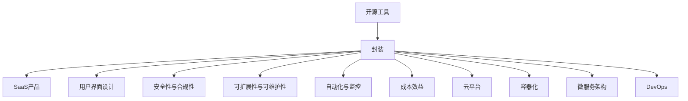

                 

# 如何将开源工具转化为SaaS产品

开源工具为开发者提供了强大且灵活的技术基础，但要将其转化为可用的SaaS（Software as a Service，软件即服务）产品，还需要进一步的开发、设计和部署。本文将详细介绍如何将开源工具转化为SaaS产品的全过程，包括关键概念、技术原理、操作步骤、应用案例、工具推荐、未来展望等内容。

## 1. 背景介绍

### 1.1 问题由来

在当前的软件开发和IT基础设施中，开源工具发挥着至关重要的作用。这些工具涵盖了从开发环境构建、代码管理、测试自动化，到持续集成和部署等各个方面。然而，尽管开源工具功能强大，但它们往往缺乏用户界面，操作复杂，难以直接应用于生产环境中。

为了满足企业对软件即服务的需求，需要将这些开源工具转化为易于使用、灵活扩展、安全可靠的服务。这一过程就是将开源工具转化为SaaS产品的关键所在。

### 1.2 问题核心关键点

将开源工具转化为SaaS产品是一个复杂的过程，涉及多个关键点：

1. **用户界面设计**：将复杂的技术工具封装为用户友好的界面。
2. **安全性与合规性**：确保数据和操作的安全性，遵守相关法律法规。
3. **可扩展性与可维护性**：提供灵活的扩展选项和易于维护的代码架构。
4. **自动化与监控**：实现自动化的部署和监控，确保系统稳定运行。
5. **成本效益**：平衡开发和运维成本，提供合理的定价策略。

通过理解这些关键点，我们可以系统地构建SaaS产品，实现从开源工具到SaaS服务的无缝转换。

### 1.3 问题研究意义

将开源工具转化为SaaS产品具有重要的研究和应用价值：

1. **降低开发成本**：利用开源工具的基础设施，减少重复开发工作。
2. **加速产品上市**：快速构建并上线SaaS产品，缩短上市时间。
3. **提升用户体验**：提供简单易用的用户界面，提升用户满意度。
4. **增强安全性**：确保数据和操作的安全性，保护用户隐私。
5. **促进技术创新**：在开源社区的加持下，持续迭代和优化产品。

## 2. 核心概念与联系

### 2.1 核心概念概述

为了更好地理解开源工具到SaaS产品的转化过程，我们首先介绍几个核心概念：

- **开源工具**：指由社区开发者贡献的代码库和工具，如Kubernetes、Docker、GitLab等。
- **SaaS产品**：通过互联网提供的应用软件服务，用户通过浏览器或API使用，无需安装和维护。
- **封装**：将复杂的技术实现封装成易于使用的API和用户界面。
- **云平台**：提供计算、存储、网络等资源的云服务提供商，如AWS、Google Cloud、阿里云等。
- **容器化**：将应用程序及其依赖打包在容器中，以便于部署和运维。
- **微服务架构**：将大型应用拆分成多个小服务，每个服务独立部署和扩展。
- **DevOps**：涵盖软件开发和运维的全生命周期管理实践，强调自动化和持续集成。

这些概念通过以下Mermaid流程图展示了它们之间的联系：



这个流程图展示了开源工具到SaaS产品的转化过程，以及其中涉及的关键技术和实践。

## 3. 核心算法原理 & 具体操作步骤

### 3.1 算法原理概述

将开源工具转化为SaaS产品的过程涉及多个算法和技术原理：

- **封装算法**：将复杂的开源工具封装为用户友好的API和界面。
- **安全性算法**：确保数据传输和存储的安全性，防止数据泄露和攻击。
- **可扩展性算法**：设计可水平扩展的架构，支持大规模并发请求。
- **自动化算法**：实现自动化的部署、监控和故障恢复，确保系统稳定运行。
- **成本效益算法**：根据服务的使用情况和业务需求，设计合理的定价策略。

这些算法和技术原理构成了开源工具到SaaS产品转化的核心框架。

### 3.2 算法步骤详解

将开源工具转化为SaaS产品的步骤主要包括：

1. **需求分析**：明确SaaS产品的目标用户和功能需求。
2. **技术选型**：选择合适的开源工具和框架，进行技术评估和可行性分析。
3. **架构设计**：设计适合SaaS产品的技术架构，包括微服务、容器化、DevOps等。
4. **用户界面设计**：创建直观易用的用户界面，简化用户操作流程。
5. **安全性设计**：实施安全策略，如数据加密、访问控制、身份验证等。
6. **自动化部署与监控**：使用CI/CD和监控工具，实现自动化部署和故障恢复。
7. **测试与优化**：进行全面的测试，优化性能和用户体验。
8. **上线与迭代**：上线SaaS产品，持续收集用户反馈，进行迭代优化。

### 3.3 算法优缺点

将开源工具转化为SaaS产品的算法有以下优点：

1. **复用性高**：利用开源工具的基础设施，减少重复开发工作。
2. **成本低**：开源工具的广泛应用使得开发和运维成本较低。
3. **灵活性高**：开源工具通常支持多种扩展和定制，能够灵活适应业务需求。
4. **社区支持**：开源工具通常有活跃的社区支持，便于获取技术支持和解决方案。

然而，这一过程也存在一些挑战：

1. **复杂性高**：将开源工具转化为SaaS产品需要综合考虑多种技术和业务需求。
2. **安全性风险**：开源工具可能存在安全漏洞，需要在转化过程中加以修复和加固。
3. **性能瓶颈**：开源工具的性能优化需要精心设计和实施。
4. **用户体验设计**：提供简单易用的用户界面和操作流程，提升用户体验。

### 3.4 算法应用领域

将开源工具转化为SaaS产品的算法和技术广泛应用于以下领域：

- **开发环境构建**：如Jenkins、GitLab CI等工具的SaaS化。
- **容器编排**：如Kubernetes的SaaS云平台服务。
- **应用程序监控**：如Prometheus、Grafana等监控工具的SaaS化。
- **云基础设施管理**：如AWS、Google Cloud、阿里云等云服务提供商提供的SaaS产品。

这些应用领域展示了开源工具到SaaS产品转化的广泛适用性。

## 4. 数学模型和公式 & 详细讲解 & 举例说明

### 4.1 数学模型构建

为了方便理解，我们使用数学模型来描述开源工具到SaaS产品的转化过程。

记原始的开源工具为 $T_{\text{original}}$，其用户界面和API为 $I_{\text{original}}$，安全性为 $S_{\text{original}}$，可扩展性为 $E_{\text{original}}$，自动化为 $A_{\text{original}}$，成本效益为 $C_{\text{original}}$。

目标SaaS产品为 $T_{\text{SaaS}}$，其用户界面和API为 $I_{\text{SaaS}}$，安全性为 $S_{\text{SaaS}}$，可扩展性为 $E_{\text{SaaS}}$，自动化为 $A_{\text{SaaS}}$，成本效益为 $C_{\text{SaaS}}$。

转化过程可以表示为：

$$
T_{\text{SaaS}} = f(T_{\text{original}}, I_{\text{original}}, S_{\text{original}}, E_{\text{original}}, A_{\text{original}}, C_{\text{original}})
$$

其中 $f$ 为转换函数，表示将原始工具转化为SaaS产品的过程。

### 4.2 公式推导过程

以下我们推导封装和安全性两个核心步骤的数学模型：

**封装步骤**：假设原始工具的用户界面和API为 $I_{\text{original}}$，转化后的用户界面和API为 $I_{\text{SaaS}}$。封装过程包括界面设计、API简化和标准化。

设原始用户界面的复杂度为 $C_{I_{\text{original}}}$，转化后的复杂度为 $C_{I_{\text{SaaS}}}$。封装过程的目标是减少复杂度：

$$
C_{I_{\text{SaaS}}} = C_{I_{\text{original}}} - D_{I}
$$

其中 $D_{I}$ 为封装带来的复杂度损失。

**安全性步骤**：假设原始工具的安全性为 $S_{\text{original}}$，转化后的安全性为 $S_{\text{SaaS}}$。安全性转化包括数据加密、访问控制、身份验证等。

设原始安全性的漏洞数为 $L_{\text{original}}$，转化后的漏洞数为 $L_{\text{SaaS}}$。安全性转化的目标是通过修复和加固，减少漏洞数：

$$
L_{\text{SaaS}} = L_{\text{original}} - F_{\text{S}}
$$

其中 $F_{\text{S}}$ 为安全加固带来的漏洞减少量。

### 4.3 案例分析与讲解

以Jenkins作为示例，展示开源工具到SaaS产品的转化过程：

**需求分析**：Jenkins是一款开源的自动化工具，支持持续集成和部署。需求分析确定Jenkins需要提供简单易用的用户界面和API，支持跨项目协作和资源管理。

**技术选型**：选择合适的云平台和容器化工具，如AWS和Docker。

**架构设计**：设计微服务架构，将Jenkins拆分为多个服务，如构建服务、测试服务、部署服务等。

**用户界面设计**：创建直观易用的用户界面，简化用户操作流程。

**安全性设计**：实施数据加密、访问控制、身份验证等安全措施。

**自动化部署与监控**：使用CI/CD和监控工具，实现自动化部署和故障恢复。

**测试与优化**：进行全面的测试，优化性能和用户体验。

**上线与迭代**：上线Jenkins SaaS产品，持续收集用户反馈，进行迭代优化。

## 5. 项目实践：代码实例和详细解释说明

### 5.1 开发环境搭建

在进行SaaS产品开发前，我们需要准备好开发环境。以下是使用Python进行Django开发的环境配置流程：

1. 安装Anaconda：从官网下载并安装Anaconda，用于创建独立的Python环境。

2. 创建并激活虚拟环境：
```bash
conda create -n django-env python=3.8 
conda activate django-env
```

3. 安装Django：
```bash
pip install django
```

4. 安装其他依赖：
```bash
pip install psycopg2-binary gunicorn
```

5. 配置数据库：
```bash
psql
CREATE DATABASE saas_db;
CREATE USER saas_user WITH PASSWORD 'password';
ALTER ROLE saas_user SET PASSWORD ENCRYPTED;
ALTER ROLE saas_user SET LOGIN;
GRANT ALL PRIVILEGES ON DATABASE saas_db TO saas_user;
\q
```

完成上述步骤后，即可在`django-env`环境中开始SaaS产品开发。

### 5.2 源代码详细实现

下面我们以Jenkins SaaS化为例，给出使用Django进行SaaS开发的PyTorch代码实现。

首先，定义Jenkins SaaS的数据模型：

```python
from django.db import models
from django.contrib.auth.models import User

class Project(models.Model):
    name = models.CharField(max_length=255)
    description = models.TextField()
    creator = models.ForeignKey(User, on_delete=models.CASCADE)
    created_at = models.DateTimeField(auto_now_add=True)

class Job(models.Model):
    name = models.CharField(max_length=255)
    project = models.ForeignKey(Project, on_delete=models.CASCADE)
    creator = models.ForeignKey(User, on_delete=models.CASCADE)
    created_at = models.DateTimeField(auto_now_add=True)

# 定义模型关系和查询集
```

然后，定义Jenkins SaaS的视图和URL映射：

```python
from django.shortcuts import render, redirect
from django.http import HttpResponse

def index(request):
    projects = Project.objects.all()
    return render(request, 'index.html', {'projects': projects})

def project_detail(request, project_id):
    project = Project.objects.get(id=project_id)
    jobs = project.job_set.all()
    return render(request, 'project_detail.html', {'project': project, 'jobs': jobs})

def job_detail(request, job_id):
    job = Job.objects.get(id=job_id)
    return render(request, 'job_detail.html', {'job': job})

def create_project(request):
    if request.method == 'POST':
        name = request.POST.get('name')
        description = request.POST.get('description')
        user = User.objects.get(id=request.user.id)
        project = Project(name=name, description=description, creator=user)
        project.save()
        return redirect('index')
    else:
        return render(request, 'create_project.html')

def create_job(request, project_id):
    project = Project.objects.get(id=project_id)
    if request.method == 'POST':
        name = request.POST.get('name')
        user = User.objects.get(id=request.user.id)
        job = Job(name=name, project=project, creator=user)
        job.save()
        return redirect('project_detail', project_id=project.id)
    else:
        return render(request, 'create_job.html', {'project': project})

def run_job(request, job_id):
    job = Job.objects.get(id=job_id)
    # 执行Jenkins构建任务
    return HttpResponse(f'{job.name} job is running')

```

最后，定义Jenkins SaaS的模板和静态文件：

```html
<!-- index.html -->



  <h1>Projects</h1>
  <ul>
    
      <li><a href="">{{ project.name }}</a></li>
    
  </ul>
  <a href="">Create a new project</a>

```

```html
<!-- project_detail.html -->



  <h1>{{ project.name }}</h1>
  <p>{{ project.description }}</p>
  <h2>Jobs</h2>
  <ul>
    
      <li><a href="">{{ job.name }}</a></li>
    
  </ul>
  <a href="">Create a new job</a>

```

```html
<!-- job_detail.html -->



  <h1>{{ job.name }}</h1>
  <p>Last run at {{ job.last_run_time }}</p>
  <a href="">Run job</a>

```

```html
<!-- create_project.html -->



  <h1>Create a new project</h1>
  <form method="post">
    
    {{ form.as_p }}
    <button type="submit">Create project</button>
  </form>

```

```html
<!-- create_job.html -->



  <h1>Create a new job for {{ project.name }}</h1>
  <form method="post">
    
    {{ form.as_p }}
    <button type="submit">Create job</button>
  </form>

```

```css
/* base.css */
body {
  font-family: Arial, sans-serif;
}

h1 {
  color: #333;
}

ul {
  list-style: none;
  padding: 0;
}

a {
  color: #007bff;
}

form input, form select {
  margin-bottom: 10px;
}
```

完成上述步骤后，即可在`django-env`环境中开始Jenkins SaaS产品开发。

### 5.3 代码解读与分析

让我们再详细解读一下关键代码的实现细节：

**Project和Job模型**：
- `models.Model`类：定义了Django模型的基类。
- `CharField`和`TextField`：分别用于定义字符串和文本字段。
- `ForeignKey`：定义了外键关系。

**视图和URL映射**：
- `index`视图：获取所有项目，渲染到`index.html`模板。
- `project_detail`视图：获取指定项目和其所有任务，渲染到`project_detail.html`模板。
- `job_detail`视图：获取指定任务，渲染到`job_detail.html`模板。
- `create_project`视图：创建新项目，重定向到项目列表页面。
- `create_job`视图：创建新任务，重定向到项目详情页面。
- `run_job`视图：执行指定任务，返回运行状态。

**模板和静态文件**：
- `index.html`：显示所有项目的列表。
- `project_detail.html`：显示指定项目和其所有任务。
- `job_detail.html`：显示指定任务详情。
- `create_project.html`：创建新项目表单。
- `create_job.html`：创建新任务表单。
- `base.html`：基础模板，包含通用样式和布局。

## 6. 实际应用场景

### 6.1 智能客服系统

智能客服系统是SaaS产品在企业内部的典型应用场景之一。通过SaaS化，客服系统能够提供更加灵活、易于部署和维护的服务。

**需求分析**：智能客服系统需要提供简单易用的界面，支持自然语言处理和知识图谱，以实现智能问答和问题解决。

**技术选型**：选择合适的自然语言处理工具，如Dialogflow、Rasa等。

**架构设计**：设计微服务架构，将智能客服系统拆分为问答服务、知识图谱服务、自然语言处理服务等多个模块。

**用户界面设计**：创建直观易用的用户界面，简化客服操作流程。

**安全性设计**：实施数据加密、访问控制、身份验证等安全措施。

**自动化部署与监控**：使用CI/CD和监控工具，实现自动化部署和故障恢复。

**测试与优化**：进行全面的测试，优化性能和用户体验。

**上线与迭代**：上线智能客服系统，持续收集用户反馈，进行迭代优化。

### 6.2 金融交易平台

金融交易平台是另一个典型的SaaS应用场景。通过SaaS化，金融交易平台能够提供更加稳定、高效、安全的服务。

**需求分析**：金融交易平台需要提供实时交易、风险管理、报告生成等功能。

**技术选型**：选择合适的金融交易平台工具，如Elastica、TCloud等。

**架构设计**：设计微服务架构，将交易平台拆分为交易服务、风险管理服务、报告服务等多个模块。

**用户界面设计**：创建直观易用的用户界面，简化交易操作流程。

**安全性设计**：实施数据加密、访问控制、身份验证等安全措施。

**自动化部署与监控**：使用CI/CD和监控工具，实现自动化部署和故障恢复。

**测试与优化**：进行全面的测试，优化性能和用户体验。

**上线与迭代**：上线金融交易平台，持续收集用户反馈，进行迭代优化。

### 6.3 教育学习平台

教育学习平台是另一个典型的SaaS应用场景。通过SaaS化，教育学习平台能够提供更加灵活、互动、个性化的学习体验。

**需求分析**：教育学习平台需要提供课程学习、互动讨论、作业提交等功能。

**技术选型**：选择合适的教育学习平台工具，如Moodle、Canvas等。

**架构设计**：设计微服务架构，将学习平台拆分为课程服务、讨论服务、作业服务等模块。

**用户界面设计**：创建直观易用的用户界面，简化学习操作流程。

**安全性设计**：实施数据加密、访问控制、身份验证等安全措施。

**自动化部署与监控**：使用CI/CD和监控工具，实现自动化部署和故障恢复。

**测试与优化**：进行全面的测试，优化性能和用户体验。

**上线与迭代**：上线教育学习平台，持续收集用户反馈，进行迭代优化。

## 7. 工具和资源推荐

### 7.1 学习资源推荐

为了帮助开发者系统掌握将开源工具转化为SaaS产品的理论基础和实践技巧，这里推荐一些优质的学习资源：

1. **《SaaS：软件即服务的建设与运营》**：全面介绍SaaS产品从规划到运营的全过程。

2. **《Django实战》**：详细讲解使用Django框架进行Web应用的开发和部署。

3. **《Python网络编程》**：深入浅出地讲解Python网络编程的基础知识和实践技巧。

4. **《微服务架构》**：详细介绍微服务架构的设计原则和最佳实践。

5. **《DevOps实践指南》**：系统介绍DevOps文化的核心理念和实践方法。

通过对这些资源的学习实践，相信你一定能够快速掌握将开源工具转化为SaaS产品的精髓，并用于解决实际的IT应用问题。

### 7.2 开发工具推荐

高效的开发离不开优秀的工具支持。以下是几款用于SaaS产品开发的常用工具：

1. **Django**：一个高级Python Web框架，提供强大的ORM、模板引擎、表单处理等特性，适合快速开发Web应用。

2. **Flask**：一个轻量级的Python Web框架，适合小型应用或API开发。

3. **Spring Boot**：一个快速开发的Java Web框架，支持微服务架构和Spring Cloud。

4. **AWS**：亚马逊云服务，提供强大的云基础设施和SaaS产品部署平台。

5. **Google Cloud**：谷歌云服务，提供广泛的云服务和SaaS产品部署平台。

6. **阿里云**：阿里巴巴云服务，提供丰富的云服务和SaaS产品部署平台。

合理利用这些工具，可以显著提升SaaS产品开发的效率，加速产品上市和市场推广。

### 7.3 相关论文推荐

SaaS产品开发涉及多种技术和业务需求，相关研究进展不断。以下是几篇奠基性的相关论文，推荐阅读：

1. **《SaaS的现状与未来》**：全面分析SaaS产品的现状、挑战和未来发展方向。

2. **《微服务架构的构建与实践》**：详细介绍微服务架构的设计原则和最佳实践。

3. **《DevOps文化的核心理念》**：系统介绍DevOps文化的核心理念和实践方法。

4. **《云计算与SaaS产品的结合》**：探讨云计算技术在SaaS产品中的应用和优势。

这些论文代表了大语言模型微调技术的发展脉络。通过学习这些前沿成果，可以帮助研究者把握学科前进方向，激发更多的创新灵感。

## 8. 总结：未来发展趋势与挑战

### 8.1 总结

本文对将开源工具转化为SaaS产品的过程进行了全面系统的介绍。首先阐述了SaaS产品的研究背景和意义，明确了转化过程的关键点，包括需求分析、技术选型、架构设计等。其次，从理论到实践，详细讲解了开源工具到SaaS产品转化的全过程，包括用户界面设计、安全性设计、自动化部署与监控等关键步骤。同时，本文还提供了实际应用场景和工具资源推荐，帮助开发者更好地理解和实践SaaS产品开发。

通过本文的系统梳理，可以看到，将开源工具转化为SaaS产品是一个复杂的过程，但通过合理的设计和开发，可以将其转化为易于使用、灵活扩展、安全可靠的服务。未来，随着技术的不断进步和市场需求的不断变化，SaaS产品的开发和运营将变得更加智能化和自动化，为各类IT应用带来更高效、更可靠的解决方案。

### 8.2 未来发展趋势

SaaS产品的未来发展趋势包括以下几个方面：

1. **智能化与自动化**：未来的SaaS产品将更加智能化，利用机器学习和人工智能技术，实现自动化的数据分析、决策支持等功能。

2. **云原生**：SaaS产品将更加云原生，通过容器化、微服务、DevOps等技术，实现更高效的部署和运维。

3. **多云与混合云**：未来的SaaS产品将支持多云与混合云部署，提供更灵活的资源选择和成本控制。

4. **AI与大数据结合**：SaaS产品将更加依赖AI与大数据技术，实现更深入的数据分析和用户行为预测。

5. **安全性与合规性**：未来的SaaS产品将更加注重数据安全与合规性，确保用户数据和操作的安全性。

### 8.3 面临的挑战

尽管SaaS产品开发取得了诸多进展，但在实际应用中仍面临以下挑战：

1. **技术复杂性**：SaaS产品的开发涉及多种技术和业务需求，技术实现复杂度高。

2. **性能瓶颈**：SaaS产品需要处理大规模并发请求，性能优化任务艰巨。

3. **安全性风险**：SaaS产品面临的安全威胁不断增加，数据泄露和攻击风险不容忽视。

4. **用户体验设计**：提供直观易用的用户界面，提升用户体验，仍需不断优化。

5. **成本效益**：SaaS产品的开发和运维成本高，需要合理定价以平衡收益。

### 8.4 研究展望

未来，SaaS产品开发需要在以下几个方向进行深入研究：

1. **人工智能与机器学习**：引入人工智能技术，提高SaaS产品的智能化水平。

2. **云计算与边缘计算**：结合云计算与边缘计算技术，实现更高效的资源管理和服务部署。

3. **区块链与分布式技术**：引入区块链与分布式技术，提高SaaS产品的透明性和安全性。

4. **多模态融合**：实现多模态数据融合，提升SaaS产品的综合分析能力。

5. **人机交互设计**：引入人机交互设计理念，提升SaaS产品的用户体验。

6. **生态系统建设**：构建SaaS产品的生态系统，提供更丰富的应用场景和业务支持。

这些研究方向将推动SaaS产品的不断创新和优化，为各行各业带来更高效、更可靠、更智能的解决方案。

## 9. 附录：常见问题与解答

**Q1：SaaS产品的优势是什么？**

A: SaaS产品的优势包括：

1. **降低成本**：提供按需付费模式，减少硬件和软件购置成本。
2. **灵活性高**：支持快速部署和扩展，灵活应对业务需求变化。
3. **易用性高**：提供直观易用的用户界面，降低使用门槛。
4. **可靠性高**：通过云基础设施提供高可靠性和高可用性服务。
5. **易于维护**：提供远程监控和管理，方便快速修复故障。

**Q2：如何选择合适的SaaS产品？**

A: 选择合适的SaaS产品需要考虑以下几个方面：

1. **功能需求**：评估产品功能是否满足业务需求。
2. **性能指标**：评估产品的性能指标，如响应时间、并发能力等。
3. **可扩展性**：评估产品的可扩展性，支持未来的业务增长。
4. **安全性与合规性**：评估产品的安全性与合规性，确保数据和操作的安全性。
5. **成本效益**：评估产品的成本效益，合理定价以平衡收益。

**Q3：SaaS产品的开发难点是什么？**

A: SaaS产品的开发难点包括：

1. **技术复杂性高**：涉及多种技术和业务需求，技术实现复杂度高。
2. **性能优化困难**：需要处理大规模并发请求，性能优化任务艰巨。
3. **安全性风险高**：面临的数据泄露和攻击风险不断增加。
4. **用户体验设计挑战**：提供直观易用的用户界面，提升用户体验。
5. **成本控制难**：开发和运维成本高，需要合理定价以平衡收益。

**Q4：SaaS产品的优势是什么？**

A: SaaS产品的优势包括：

1. **降低成本**：提供按需付费模式，减少硬件和软件购置成本。
2. **灵活性高**：支持快速部署和扩展，灵活应对业务需求变化。
3. **易用性高**：提供直观易用的用户界面，降低使用门槛。
4. **可靠性高**：通过云基础设施提供高可靠性和高可用性服务。
5. **易于维护**：提供远程监控和管理，方便快速修复故障。

**Q5：如何选择合适的SaaS产品？**

A: 选择合适的SaaS产品需要考虑以下几个方面：

1. **功能需求**：评估产品功能是否满足业务需求。
2. **性能指标**：评估产品的性能指标，如响应时间、并发能力等。
3. **可扩展性**：评估产品的可扩展性，支持未来的业务增长。
4. **安全性与合规性**：评估产品的安全性与合规性，确保数据和操作的安全性。
5. **成本效益**：评估产品的成本效益，合理定价以平衡收益。

**Q6：SaaS产品的开发难点是什么？**

A: SaaS产品的开发难点包括：

1. **技术复杂性高**：涉及多种技术和业务需求，技术实现复杂度高。
2. **性能优化困难**：需要处理大规模并发请求，性能优化任务艰巨。
3. **安全性风险高**：面临的数据泄露和攻击风险不断增加。
4. **用户体验设计挑战**：提供直观易用的用户界面，提升用户体验。
5. **成本控制难**：开发和运维成本高，需要合理定价以平衡收益。

---

作者：禅与计算机程序设计艺术 / Zen and the Art of Computer Programming

