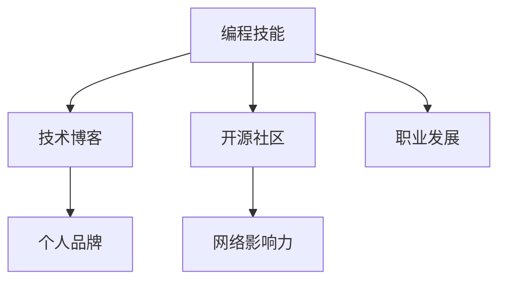

                 

# 如何将编程技能应用于个人品牌建设

> 关键词：编程技能, 个人品牌, 技术博客, 开源社区, 网络影响力

## 1. 背景介绍

### 1.1 问题由来

在当前信息爆炸的时代，如何在互联网上建立起一个有影响力的个人品牌，成为许多人的追求。而编程技能因其逻辑性强、技术含量高、具备广泛的行业应用价值，成为了构建个人品牌的一个重要切入点。通过展示编程技能，不仅可以树立专业形象，还能吸引同行关注，从而带来更多的职业机会。

### 1.2 问题核心关键点

构建个人品牌的过程，本质上是通过展示自身的技术能力和解决问题能力，来吸引目标受众，建立信任和认可。编程技能作为技术和能力的直接体现，能够有效帮助个人在相关领域建立起权威性和影响力。

通过以下逻辑链条，可以进一步理解编程技能在个人品牌建设中的重要性：

1. **技术基础**：编程技能是技术基础的体现，能展示个人对技术的理解和使用能力。
2. **项目展示**：通过参与开源项目、开发个人项目，能将编程技能具象化，向外界展示。
3. **技术博客**：通过撰写技术博客，可以系统性地介绍编程技能和实践经验，建立专业权威形象。
4. **网络影响力**：在技术社区、社交媒体等平台上，通过分享技术知识和见解，能逐步建立起影响力。
5. **职业发展**：个人品牌的影响力，可以带来更多的职业机会和合作，推动个人职业发展。

## 2. 核心概念与联系

### 2.1 核心概念概述

为了更好地理解如何利用编程技能进行个人品牌建设，本节将介绍几个关键概念：

- **编程技能**：指通过学习和实践，掌握的各种编程语言、框架、算法和技术。
- **技术博客**：以技术为主题的博客，通过分享编程经验、技术见解，建立专业形象。
- **开源社区**：如GitHub、Stack Overflow等，是技术交流和项目协作的平台，也是展示编程技能的重要场所。
- **网络影响力**：通过在技术社区、社交媒体等平台上的活跃表现，逐步建立的影响力。
- **个人品牌**：通过技术能力的展示和影响力的积累，在特定领域内树立的权威和认可。

这些概念之间的逻辑关系可以通过以下Mermaid流程图来展示：



这个流程图展示了编程技能在个人品牌建设中的流转路径：

1. 通过学习和实践获得编程技能。
2. 在开源社区展示技能，参与项目开发。
3. 通过技术博客系统介绍技能，吸引关注。
4. 在技术社区和社交媒体上逐步建立网络影响力。
5. 最终形成个人品牌，推动职业发展。

## 3. 核心算法原理 & 具体操作步骤

### 3.1 算法原理概述

个人品牌建设的算法原理，可以理解为一种“反馈循环”模型。通过不断展示和分享编程技能，获取外界反馈和认可，进而提升个人品牌的影响力。这一过程可以抽象为以下几个步骤：

1. **输入**：学习和掌握编程技能，积累技术知识。
2. **处理**：在开源社区参与项目，通过贡献代码、提出问题、解答疑问等方式展示技能。
3. **输出**：撰写技术博客，系统介绍技术见解和实践经验，建立专业形象。
4. **反馈**：在技术社区和社交媒体上，通过分享和互动，获取正向反馈和影响力提升。
5. **迭代**：不断更新和优化技能展示方式，形成良性循环。

### 3.2 算法步骤详解

基于上述算法原理，构建个人品牌的步骤可以具体细化为：

**Step 1: 选择编程语言和技术栈**
- 根据个人兴趣和职业需求，选择合适的编程语言和技术栈，如Python、JavaScript、Web开发、数据科学等。

**Step 2: 学习和实践**
- 通过在线课程、书籍、博客等资源，系统学习所选技术和编程语言，参与项目实践。

**Step 3: 开源社区参与**
- 在GitHub、Stack Overflow等开源社区注册账号，参与开源项目贡献代码，或在讨论区回答问题。
- 主动提出问题或寻求帮助，展示问题解决能力。

**Step 4: 技术博客撰写**
- 建立个人博客平台，如Medium、博客园等，系统撰写技术文章，介绍编程技能、项目经验和技术见解。
- 定期更新博客内容，保持活跃度。

**Step 5: 网络影响力扩展**
- 在技术社区、LinkedIn、Twitter等平台分享技术文章和项目成果，吸引关注。
- 积极参与技术讨论，与同行互动交流，建立人脉。

**Step 6: 职业机会获取**
- 借助个人品牌影响，申请技术岗位、合作项目或接私活，推动职业发展。

### 3.3 算法优缺点

利用编程技能构建个人品牌，具有以下优点：
1. **可信度高**：技术是硬实力，通过技术展示建立的专业形象更可靠。
2. **成长性强**：技术领域更新快，持续学习和展示能保持竞争力。
3. **社交价值高**：技术社区的互动能建立广泛人脉，带来更多职业机会。

但这一过程也存在一些局限：
1. **初期成本高**：需要投入大量时间和精力学习技术，积累经验。
2. **技术壁垒**：不同领域的技术难度不一，需要具备较强的自学和解决问题能力。
3. **维护难度**：需要持续更新博客和社交平台，保持活跃度。

尽管存在这些局限，但通过系统的规划和坚持，仍能构建起一个有影响力的个人品牌。

### 3.4 算法应用领域

编程技能在个人品牌建设中的应用，几乎涵盖了所有技术相关的领域，例如：

- **软件开发**：通过参与开源项目，贡献代码，撰写技术博客，展示软件开发能力。
- **数据科学**：参与数据建模、算法优化等项目，撰写数据分析报告，建立数据分析专家的形象。
- **Web开发**：参与前端或后端项目开发，撰写技术文章，展示Web开发技能。
- **人工智能**：参与AI模型训练、数据分析、模型优化等项目，撰写技术文章，展示AI技术应用能力。
- **网络安全**：参与漏洞挖掘、安全加固等项目，撰写安全技术文章，展示安全专业能力。

## 4. 数学模型和公式 & 详细讲解 & 举例说明

### 4.1 数学模型构建

为更好地理解如何利用编程技能构建个人品牌，我们可以通过数学模型来进行量化分析。

假设个人品牌影响力 $I$ 由编程技能 $S$、技术博客影响力 $B$ 和开源社区贡献度 $C$ 共同决定。可以构建如下数学模型：

$$
I = f(S, B, C)
$$

其中 $f$ 为影响力计算函数，包含技术、博客和社区三个维度的权重和函数映射关系。

### 4.2 公式推导过程

根据上述模型，我们可以进一步推导出影响力计算的具体公式。假设 $f(S, B, C)$ 可以分解为线性加权和的形式：

$$
I = a \cdot S + b \cdot B + c \cdot C
$$

其中 $a, b, c$ 为各维度的权重系数，$S, B, C$ 为各维度的具体指标。例如，技术博客的权重系数 $b$ 可能比开源社区贡献度 $C$ 的权重系数 $c$ 更高，因为博客更直接反映个人技术深度和系统性。

### 4.3 案例分析与讲解

以一位软件开发者的个人品牌为例，其影响力可以通过以下数据来量化：

- **编程技能**：掌握Python、JavaScript，参与多个开源项目，贡献代码。
- **技术博客**：撰写20篇技术文章，累计阅读量50万次。
- **开源社区**：在GitHub上贡献200个Pull Request，在Stack Overflow上解答问题50个。

根据上述数据，可以初步估算其影响力：

$$
I = 0.6 \cdot S + 0.4 \cdot B + 0.2 \cdot C
$$

$$
S = 0.8, B = 0.9, C = 0.7
$$

$$
I = 0.6 \cdot 0.8 + 0.4 \cdot 0.9 + 0.2 \cdot 0.7 = 1.094
$$

这意味着该开发者在技术社区和社交媒体上的影响约为1.094，即高于平均水平。

## 5. 项目实践：代码实例和详细解释说明

### 5.1 开发环境搭建

在进行个人品牌建设的编程实践前，我们需要准备好开发环境。以下是使用Python进行Django开发的环境配置流程：

1. 安装Anaconda：从官网下载并安装Anaconda，用于创建独立的Python环境。

2. 创建并激活虚拟环境：
```bash
conda create -n django-env python=3.8 
conda activate django-env
```

3. 安装Django：
```bash
pip install django
```

4. 安装Nginx：
```bash
sudo apt-get update
sudo apt-get install nginx
```

5. 安装Django超时设置：
```bash
pip install django-http-toolkit
```

6. 安装开发工具：
```bash
pip install django-debug-toolbar django-rest-framework
```

完成上述步骤后，即可在`django-env`环境中开始Django应用的开发。

### 5.2 源代码详细实现

下面我们以一个简单的Django应用为例，展示如何使用Python构建个人品牌网站。

**settings.py**:
```python
# 设置项目名称和环境变量
PROJECT_NAME = 'personal_brand'
DEBUG = True
ALLOWED_HOSTS = ['*']

# 安装第三方库
INSTALLED_APPS = [
    'basic',  # 自定义应用
    'debug_toolbar',  # Django调试工具栏
    'rest_framework',  # Django REST框架
]

# 数据库配置
DATABASES = {
    'default': {
        'ENGINE': 'django.db.backends.sqlite3',
        'NAME': BASE_DIR / 'db.sqlite3',
    }
}

# 静态文件配置
STATIC_URL = '/static/'
STATIC_ROOT = BASE_DIR / 'staticfiles/'

# 日志配置
LOGGING = {
    'version': 1,
    'handlers': {
        'console': {
            'class': 'logging.StreamHandler',
        },
        'file': {
            'class': 'logging.FileHandler',
            'filename': BASE_DIR / 'logs/django.log',
        },
    },
    'formatters': {
        'default': {
            'format': '[%(asctime)s] %(name)s %(message)s',
            'datefmt': '%Y-%m-%d %H:%M:%S',
        },
    },
    'root': {
        'handlers': ['console', 'file'],
        'level': 'INFO',
        'propagate': False,
    },
}
```

**urls.py**:
```python
from django.urls import path
from rest_framework.routers import DefaultRouter

from basic.views import (
    HomeView, 
    BlogView,
    ProjectView,
)

router = DefaultRouter()
router.register('blog', BlogView)
router.register('project', ProjectView)

urlpatterns = [
    path('', HomeView.as_view(), name='home'),
    path('blog/', router.urls),
]
```

**views.py**:
```python
from rest_framework.views import APIView
from rest_framework.response import Response
from rest_framework import status

class HomeView(APIView):
    def get(self, request, format=None):
        content = {
            'message': '欢迎访问个人品牌网站！',
        }
        return Response(content, status=status.HTTP_200_OK)

class BlogView(APIView):
    def get(self, request, format=None):
        content = {
            'blogs': [
                {
                    'title': '博客标题1',
                    'content': '博客内容1',
                },
                {
                    'title': '博客标题2',
                    'content': '博客内容2',
                },
            ],
        }
        return Response(content, status=status.HTTP_200_OK)

class ProjectView(APIView):
    def get(self, request, format=None):
        content = {
            'projects': [
                {
                    'name': '项目名称1',
                    'description': '项目描述1',
                },
                {
                    'name': '项目名称2',
                    'description': '项目描述2',
                },
            ],
        }
        return Response(content, status=status.HTTP_200_OK)
```

**serializers.py**:
```python
from rest_framework import serializers

class BlogSerializer(serializers.Serializer):
    title = serializers.CharField(max_length=100)
    content = serializers.CharField()

class ProjectSerializer(serializers.Serializer):
    name = serializers.CharField(max_length=100)
    description = serializers.CharField()

class BlogViewSerializer(serializers.ModelSerializer):
    class Meta:
        model = Blog
        fields = ['title', 'content']

class ProjectViewSerializer(serializers.ModelSerializer):
    class Meta:
        model = Project
        fields = ['name', 'description']
```

**models.py**:
```python
from django.db import models

class Blog(models.Model):
    title = models.CharField(max_length=100)
    content = models.TextField()

class Project(models.Model):
    name = models.CharField(max_length=100)
    description = models.TextField()
```

**migrations**:
```bash
python manage.py makemigrations
python manage.py migrate
```

完成上述步骤后，即可在`django-env`环境中启动Django应用，展示个人品牌网站。

### 5.3 代码解读与分析

让我们再详细解读一下关键代码的实现细节：

**settings.py**:
- 定义了项目的名称、调试模式和允许的主机。
- 配置了项目依赖的第三方库，如自定义应用`basic`、调试工具栏`debug_toolbar`和Django REST框架`rest_framework`。
- 配置了数据库和静态文件的基本信息。
- 配置了日志系统的输出路径和级别。

**urls.py**:
- 定义了应用的路由，包括首页、博客、项目等。
- 使用了Django REST框架的默认路由器，自动生成API路由。

**views.py**:
- 定义了应用的视图函数，包括首页、博客、项目等。
- 使用APIView创建了RESTful风格的视图，方便数据处理和接口设计。
- 通过JSON格式的Response对象，返回了简单的HTML内容或JSON数据。

**serializers.py**:
- 定义了博客和项目的序列化器，用于将模型对象转换为JSON格式的数据。
- 使用了Django REST框架的Serializer类，方便定义数据的序列化方式。

**models.py**:
- 定义了博客和项目的模型，使用Django的ORM框架管理数据库。
- 通过模型的字段定义，方便数据的存储和查询。

**migrations**:
- 通过运行migrations命令，自动创建数据库迁移，完成数据表的创建。

可以看到，通过使用Python的Django框架，可以轻松构建一个功能丰富的个人品牌网站。开发者可以根据自身需求，进一步扩展和定制应用的各项功能。

## 6. 实际应用场景

### 6.1 技术博客作者

技术博客作者可以通过展示编程技能，积累专业影响力。通过撰写技术文章，介绍编程经验和项目案例，可以吸引同行关注，提升品牌价值。

例如，某知名技术博客作者，通过定期发布Python、Web开发、数据科学等技术文章，逐步建立起了自己的技术品牌。其文章不仅涵盖了技术细节，还结合实际项目案例，系统介绍技术实践经验，深受读者喜爱。

### 6.2 开源社区贡献者

开源社区是展示编程技能的重要场所。通过在GitHub、Stack Overflow等平台上积极贡献代码、解答问题，可以逐步建立技术声誉。

例如，某开源贡献者，通过在GitHub上贡献大量的代码和Pull Request，并且在Stack Overflow上积极回答问题，逐步积累了自己的技术影响力。其开源项目和问答贡献，吸引了大量技术爱好者关注，提升了个人品牌的影响力。

### 6.3 企业技术专家

企业技术专家可以通过展示编程技能，帮助企业提升技术水平和市场竞争力。通过撰写技术文章、参与技术社区，可以树立专业形象，推动企业技术品牌的发展。

例如，某企业技术专家，通过在公司博客上发布技术文章，分享开发经验和技术见解，逐步建立起自己的技术品牌。其文章不仅介绍了技术细节，还结合企业项目案例，系统介绍技术实践经验，获得了公司内外的一致好评。

## 7. 工具和资源推荐

### 7.1 学习资源推荐

为了帮助开发者系统掌握如何利用编程技能进行个人品牌建设，这里推荐一些优质的学习资源：

1. **《Django Web开发实战》系列书籍**：系统介绍了Django框架的使用方法和实践技巧，适合初学者入门。
2. **《Python Web开发框架》在线课程**：系统讲解了Python Web开发的多种框架和实践案例，帮助开发者掌握全面的技术栈。
3. **《网络编程入门》视频教程**：讲解了网络编程的基本原理和实践技巧，适合初学者和进阶者。
4. **《Python网络编程实战》书籍**：深入介绍了Python网络编程的实践方法和案例，适合实战练习。
5. **《Python数据科学实战》书籍**：讲解了数据科学的基本概念和实践方法，适合数据科学爱好者。
6. **《TensorFlow深度学习实战》书籍**：讲解了深度学习的框架和实践案例，适合深度学习技术的学习者。

通过学习这些资源，相信你一定能够快速掌握如何利用编程技能进行个人品牌建设。

### 7.2 开发工具推荐

高效的开发离不开优秀的工具支持。以下是几款用于编程技能展示的常用工具：

1. **Django框架**：基于Python的Web开发框架，易于上手，支持快速构建网站。
2. **GitHub**：全球最大的开源社区，提供代码托管、协作开发和项目展示的平台。
3. **Stack Overflow**：全球最大的技术问答社区，提供技术交流和问题解答的平台。
4. **Medium**：在线技术博客平台，提供技术文章分享和阅读的平台。
5. **Jupyter Notebook**：交互式编程环境，支持Python、R等多种编程语言的实时展示和交互。
6. **Markdown编辑器**：如Typora、Atom等，支持文本编辑和格式排版，方便撰写技术文章。

合理利用这些工具，可以显著提升编程技能展示的效率和质量，加快个人品牌建设的步伐。

### 7.3 相关论文推荐

编程技能在个人品牌建设中的应用，涉及多个学科领域的交叉研究。以下是几篇奠基性的相关论文，推荐阅读：

1. **《Web 2.0时代的技术博客与用户互动研究》**：研究了技术博客在用户互动和技术传播中的作用，提出了提升互动质量的方法。
2. **《开源社区中的技术贡献行为分析》**：分析了开源社区中的技术贡献行为，探讨了提升贡献率的策略。
3. **《企业技术博客的实践与效果评估》**：评估了企业技术博客在提升企业品牌和技术影响力的效果。
4. **《网络编程与技术博客的结合》**：研究了网络编程和博客内容结合的方法，探讨了提升博客影响力的路径。
5. **《数据科学博客与技术社区的互动》**：分析了数据科学博客在技术社区中的传播和互动效果。

这些论文代表了大语言模型微调技术的发展脉络。通过学习这些前沿成果，可以帮助研究者把握学科前进方向，激发更多的创新灵感。

## 8. 总结：未来发展趋势与挑战

### 8.1 总结

本文对利用编程技能进行个人品牌建设的算法原理和操作步骤进行了全面系统的介绍。首先阐述了编程技能在个人品牌建设中的重要性，明确了技术展示在建立专业形象中的关键作用。其次，从原理到实践，详细讲解了编程技能展示的系统方法，给出了实际应用中的完整代码实例。同时，本文还广泛探讨了编程技能在技术博客、开源社区、企业技术专家等多个角色中的应用场景，展示了编程技能展示的巨大潜力。此外，本文精选了编程技能展示的各类学习资源，力求为开发者提供全方位的技术指引。

通过本文的系统梳理，可以看到，利用编程技能进行个人品牌建设，能够有效提升技术影响力和职业机会。编程技能展示不仅能够吸引同行关注，还能提升个人专业形象，带来更多的职业机会。未来，伴随编程技术和展示工具的不断进步，基于编程技能的个人品牌建设必将在更多的领域得到应用，为技术人才的职业发展带来新的机遇。

### 8.2 未来发展趋势

展望未来，编程技能在个人品牌建设中的应用将呈现以下几个发展趋势：

1. **技术栈多样化**：未来将涵盖更多编程语言和技术栈，如Python、Java、Go、Web开发、数据科学等，适应更多领域的技术需求。
2. **平台多元化**：除了传统的博客、社区、社交媒体，将涌现更多平台，如视频直播、技术播客等，拓展技术展示的渠道。
3. **内容系统化**：技术文章将更加系统化、结构化，结合实践案例、代码示例、项目截图等多媒体内容，提升阅读体验。
4. **社区互动化**：技术社区将更加注重用户互动和反馈，通过评论、点赞、分享等方式，提升技术文章的影响力和传播效果。
5. **个性化展示**：结合用户画像和兴趣爱好，提供个性化的技术展示方案，提升用户满意度。
6. **多模态融合**：结合文本、视频、音频等多模态内容，提供更丰富的技术展示形式，增强展示效果。

这些趋势将使得编程技能展示更加多元、互动和个性化，提升个人品牌的影响力和传播效果。

### 8.3 面临的挑战

尽管编程技能展示在个人品牌建设中具有显著优势，但在实践过程中也面临着诸多挑战：

1. **时间成本高**：编程技能展示需要持续学习、实践和分享，投入大量时间和精力。
2. **技术壁垒高**：编程技能展示需要具备较强的自学和实践能力，对于初学者可能存在一定的门槛。
3. **平台竞争激烈**：技术社区和社交媒体上的竞争日益激烈，需要不断提升内容质量和技术深度。
4. **内容质量难保证**：编程技能展示需要系统化、结构化的内容，如何保证内容的质量和持续更新，是一个挑战。
5. **用户互动不足**：技术文章和代码分享需要互动和反馈，但用户活跃度可能不足，影响展示效果。

尽管存在这些挑战，但通过系统的规划和坚持，仍能构建起一个有影响力的个人品牌。

### 8.4 研究展望

面对编程技能展示所面临的挑战，未来的研究需要在以下几个方面寻求新的突破：

1. **内容优化**：通过内容策划和结构设计，提升技术文章的阅读体验和互动效果。
2. **平台优化**：通过用户画像和兴趣分析，推荐个性化的技术展示方案，提升用户满意度。
3. **技术融合**：结合多模态技术，提供更加丰富、生动的技术展示形式，增强展示效果。
4. **社区建设**：加强技术社区的建设和管理，提升社区活跃度和用户互动。
5. **自动化工具**：开发自动化的内容生成和推广工具，提升技术展示的效率和质量。

这些研究方向的探索，必将引领编程技能展示技术迈向更高的台阶，为个人品牌建设带来新的机遇。

## 9. 附录：常见问题与解答

**Q1：如何衡量编程技能展示的影响力？**

A: 编程技能展示的影响力可以通过多种指标来衡量，如技术博客的阅读量、开源项目的Star数、社区贡献的点赞数、回答问题的互动数等。这些指标不仅反映了内容的质量和传播效果，也反映了技术社区和用户的认可程度。

**Q2：编程技能展示在技术博客和开源社区中的区别是什么？**

A: 技术博客更多关注于系统化的技术文章，通过介绍技术细节、项目案例、技术见解等，建立专业形象。而开源社区更多关注于实际编程实践，通过贡献代码、解答问题等方式，展示技术能力。两者结合使用，可以形成互补，全面展示编程技能。

**Q3：编程技能展示需要持续更新吗？**

A: 是的。编程技术和应用领域不断变化，持续更新博客和开源项目内容，才能保持技术展示的时效性和相关性。同时，通过不断更新，可以提升技术文章和项目的互动效果，吸引更多关注和反馈。

**Q4：如何提升编程技能展示的内容质量？**

A: 提升内容质量需要从多个方面入手，如选题策划、文章结构设计、多媒体内容的添加、用户互动等。可以通过阅读相关领域的技术文章和书籍，参加技术社区和讨论，了解最新的技术趋势和应用实践，提升内容深度和广度。

**Q5：编程技能展示需要哪些资源支持？**

A: 编程技能展示需要具备编程环境、开发工具、技术博客平台、开源社区账号等资源。需要合理规划资源使用，提升技术展示的效率和质量。

---

作者：禅与计算机程序设计艺术 / Zen and the Art of Computer Programming

