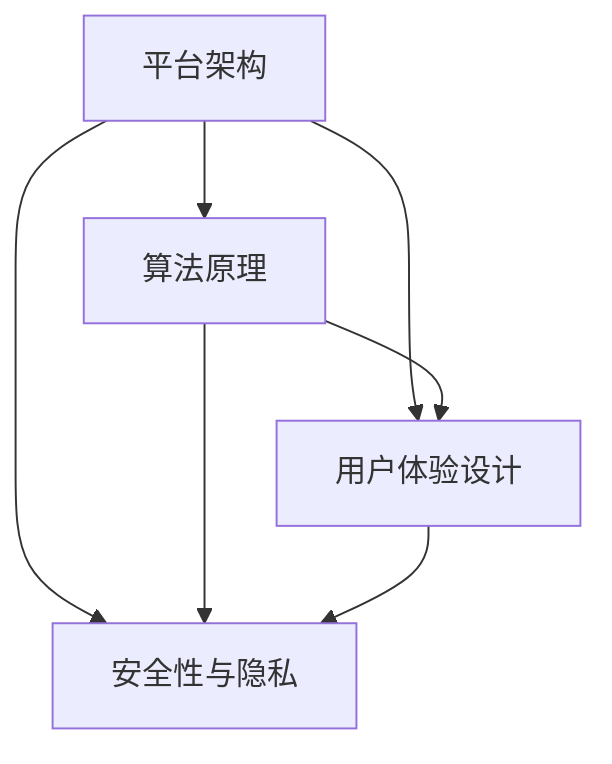

                 

## 1. 背景介绍

在知识付费日益兴起的今天，打造一个个人知识付费平台不仅可以分享专业知识，还能通过平台获得收益。本文将深入探讨如何从零开始打造一个成功且可持续的知识付费平台。我们将详细介绍从平台架构设计、核心算法原理、用户交互设计，到实际开发实现的全流程，为你提供全面、系统的指导。

## 2. 核心概念与联系

### 2.1 核心概念概述

打造一个知识付费平台涉及多个核心概念和技术：

- **平台架构**：指平台的基础设施和系统架构，包括前端、后端、数据库、支付系统等。
- **算法原理**：涵盖搜索排序算法、推荐算法、个性化学习路径规划等，用于优化用户体验和提升平台收益。
- **用户体验设计**：包括用户界面设计、交互流程设计等，旨在提高用户满意度和留存率。
- **安全性与隐私**：涉及用户数据安全、支付安全、隐私保护等，是平台健康发展的基础。

### 2.2 核心概念联系

这些核心概念之间存在紧密联系。平台架构提供技术支撑，算法原理提供数据驱动的决策，用户体验设计提升用户黏性，而安全性与隐私保护则是平台信任和用户数据安全的保障。通过合理的集成和优化这些概念，可以构建一个稳定、高效且用户友好的知识付费平台。

为了更好地理解这些核心概念及其之间的关系，可以通过以下Mermaid流程图来展示：



此图展示了平台架构与算法原理、用户体验设计、安全性与隐私之间的联系。各模块之间相互协作，共同支撑平台的正常运行和用户价值的最大化。

## 3. 核心算法原理 & 具体操作步骤

### 3.1 算法原理概述

知识付费平台的核心算法主要集中在用户行为分析、个性化推荐和搜索排序等方面。通过算法优化，平台可以更精准地匹配用户需求和内容供给，提升用户体验和转化率。

**3.1.1 用户行为分析算法**

- **点击率预测**：通过分析用户的历史行为数据（如浏览记录、点击记录），预测用户对特定内容的兴趣程度。
- **转换率预测**：预测用户完成购买行为的概率，帮助优化推荐策略。

**3.1.2 个性化推荐算法**

- **协同过滤**：基于用户行为和项目相似性，推荐类似项目。
- **内容协同过滤**：基于内容特征和用户兴趣，推荐相关内容。
- **混合推荐**：结合用户行为数据和内容特征，提升推荐精度。

**3.1.3 搜索排序算法**

- **基于关键词的排序**：通过关键词匹配，提升搜索相关性和效率。
- **基于用户行为的排序**：根据用户历史行为，优化搜索结果排序。

### 3.2 算法步骤详解

#### 3.2.1 用户行为分析算法步骤

1. **数据收集**：收集用户行为数据，包括浏览记录、点击记录、购买记录等。
2. **特征提取**：提取用户行为特征，如浏览时间、点击位置、停留时长等。
3. **模型训练**：选择合适的算法模型（如决策树、随机森林、神经网络等）进行训练，预测用户行为。
4. **模型评估**：使用交叉验证等方法评估模型性能，优化模型参数。

#### 3.2.2 个性化推荐算法步骤

1. **用户画像构建**：通过用户历史行为数据构建用户画像，包括用户兴趣、行为偏好等。
2. **内容标签提取**：对内容进行标签提取，建立内容与标签之间的关系。
3. **相似度计算**：计算用户和内容之间的相似度，确定推荐候选集。
4. **推荐结果排序**：根据推荐算法模型计算推荐结果，进行排序和推荐。

#### 3.2.3 搜索排序算法步骤

1. **关键词匹配**：对用户输入的关键词进行匹配，找出相关内容。
2. **内容筛选**：根据匹配结果，筛选出符合用户需求的内容。
3. **排序策略应用**：根据排序算法模型，对搜索结果进行排序。
4. **展示与反馈**：将排序后的搜索结果展示给用户，并收集用户反馈进行进一步优化。

### 3.3 算法优缺点

#### 3.3.1 用户行为分析算法

**优点**：
- 可以更准确地预测用户行为，提升推荐效果。
- 能帮助平台优化推荐策略，提高用户满意度和转化率。

**缺点**：
- 需要大量历史数据进行训练，获取数据成本较高。
- 模型复杂度较高，训练和维护成本较高。

#### 3.3.2 个性化推荐算法

**优点**：
- 能够根据用户行为和内容特征进行个性化推荐，提升用户粘性。
- 算法效果显著，能显著提高平台收益。

**缺点**：
- 对数据质量要求较高，数据偏差可能导致推荐结果偏差。
- 模型复杂度高，对计算资源要求较高。

#### 3.3.3 搜索排序算法

**优点**：
- 能够快速响应用户搜索需求，提高搜索效率。
- 可以根据用户行为和关键词进行优化，提升搜索结果相关性。

**缺点**：
- 对关键词匹配和内容特征提取准确度要求高。
- 需要持续优化模型，保证排序结果准确性和时效性。

### 3.4 算法应用领域

这些算法原理在知识付费平台中的应用非常广泛，具体领域包括：

- **用户行为分析**：应用于推荐系统优化、用户留存率提升等。
- **个性化推荐**：应用于课程推荐、内容推荐、用户画像构建等。
- **搜索排序**：应用于搜索相关性提升、热门内容推荐等。

## 4. 数学模型和公式 & 详细讲解 & 举例说明

### 4.1 数学模型构建

我们以协同过滤算法为例，介绍个性化推荐模型的数学模型构建过程。

#### 4.1.1 用户-物品评分矩阵

设用户集为 $U=\{u_1,u_2,...,u_M\}$，物品集为 $I=\{i_1,i_2,...,i_N\}$，每个用户 $u_m$ 对物品 $i_n$ 的评分 $R_{mn}$ 构成用户-物品评分矩阵 $R$。设 $r_{mn}$ 为模型预测的用户 $u_m$ 对物品 $i_n$ 的评分。

协同过滤的目标是最大化预测评分的准确性。

### 4.2 公式推导过程

#### 4.2.1 基于用户的协同过滤

基于用户的协同过滤算法，使用相似度度量 $sim(u_i,u_j)$ 计算用户之间的相似度。相似度越高，两个用户越可能对物品给出相似的评分。

$sim(u_i,u_j) = \frac{1}{\sqrt{\sum_{k=1}^N (r_{ik}-r_{jk})^2}}$

根据相似度矩阵 $S$ 计算预测评分 $r_{mn}$：

$r_{mn} = \sum_{k=1}^N (s_{ik} \cdot r_{km})$

### 4.3 案例分析与讲解

假设有一款知识付费平台的课程推荐系统，我们希望为用户推荐最相关的课程。课程 $c_1,c_2,...,c_M$ 的评分矩阵 $R$ 如下：

| 课程       | 用户1 | 用户2 | 用户3 | 用户4 |
|------------|-------|-------|-------|-------|
| 课程1      | 3     | 5     | 2     | 4     |
| 课程2      | 4     | 3     | 3     | 2     |
| 课程3      | 2     | 1     | 4     | 3     |

计算用户1和用户3之间的相似度，然后根据相似度预测用户3对课程1和课程2的评分：

$sim(u_1,u_3) = \frac{1}{\sqrt{(r_{11}-r_{31})^2+(r_{12}-r_{32})^2+(r_{13}-r_{33})^2}}$

$sim(u_1,u_3) = \frac{1}{\sqrt{(3-2)^2+(4-4)^2+(2-4)^2}} = \frac{1}{\sqrt{9+0+4}} = 0.8$

预测用户3对课程1和课程2的评分：

$r_{31} = 0.8 \cdot r_{11} + 0.2 \cdot r_{21} = 0.8 \cdot 3 + 0.2 \cdot 4 = 2.8$
$r_{32} = 0.8 \cdot r_{12} + 0.2 \cdot r_{22} = 0.8 \cdot 4 + 0.2 \cdot 3 = 3.6$

最终，我们可以为用户3推荐课程2，因为其评分最高。

## 5. 项目实践：代码实例和详细解释说明

### 5.1 开发环境搭建

为了快速构建知识付费平台，我们需要搭建一个适合开发的开发环境。

1. **选择开发语言**：Python是构建知识付费平台的首选语言，具有丰富的第三方库和工具。

2. **安装必要的库**：
   - Flask：用于开发后端服务。
   - SQLAlchemy：用于数据库访问和操作。
   - Redis：用于缓存和分布式锁。
   - Elasticsearch：用于全文搜索和推荐系统。

3. **数据库设计**：
   - 用户信息：ID、用户名、密码、邮箱、注册时间等。
   - 课程信息：ID、名称、描述、价格、讲师信息等。
   - 用户行为：浏览记录、点击记录、购买记录等。
   - 课程评价：ID、用户ID、课程ID、评分、评价内容等。

### 5.2 源代码详细实现

#### 5.2.1 用户管理模块

用户管理模块负责用户注册、登录、信息修改等功能。以下是Flask框架下用户管理的代码实现：

```python
from flask import Flask, request, render_template
from flask_sqlalchemy import SQLAlchemy
from werkzeug.security import generate_password_hash, check_password_hash

app = Flask(__name__)
app.config['SQLALCHEMY_DATABASE_URI'] = 'sqlite:///user.db'
db = SQLAlchemy(app)

class User(db.Model):
    id = db.Column(db.Integer, primary_key=True)
    username = db.Column(db.String(50), unique=True, nullable=False)
    password = db.Column(db.String(100), nullable=False)

@app.route('/register', methods=['GET', 'POST'])
def register():
    if request.method == 'POST':
        username = request.form.get('username')
        password = request.form.get('password')
        hashed_password = generate_password_hash(password)
        new_user = User(username=username, password=hashed_password)
        db.session.add(new_user)
        db.session.commit()
        return '注册成功'
    return render_template('register.html')

@app.route('/login', methods=['GET', 'POST'])
def login():
    if request.method == 'POST':
        username = request.form.get('username')
        password = request.form.get('password')
        user = User.query.filter_by(username=username).first()
        if user and check_password_hash(user.password, password):
            return '登录成功'
    return render_template('login.html')
```

#### 5.2.2 课程管理模块

课程管理模块负责课程的添加、删除、修改和列表展示等功能。以下是Flask框架下课程管理的代码实现：

```python
class Course(db.Model):
    id = db.Column(db.Integer, primary_key=True)
    name = db.Column(db.String(100), nullable=False)
    description = db.Column(db.Text, nullable=False)
    price = db.Column(db.Float, nullable=False)

@app.route('/courses', methods=['GET', 'POST'])
def courses():
    if request.method == 'POST':
        name = request.form.get('name')
        description = request.form.get('description')
        price = float(request.form.get('price'))
        new_course = Course(name=name, description=description, price=price)
        db.session.add(new_course)
        db.session.commit()
        return '添加课程成功'
    return render_template('courses.html')
```

#### 5.2.3 个性化推荐模块

个性化推荐模块负责根据用户行为和评分矩阵进行推荐。以下是基于用户协同过滤的推荐系统代码实现：

```python
class Recommendation(db.Model):
    id = db.Column(db.Integer, primary_key=True)
    user_id = db.Column(db.Integer, nullable=False)
    course_id = db.Column(db.Integer, nullable=False)
    score = db.Column(db.Float, nullable=False)

    def __init__(self, user_id, course_id, score):
        self.user_id = user_id
        self.course_id = course_id
        self.score = score

def get_recommendations(user_id, courses):
    similarity_matrix = []
    for i in range(len(courses)):
        similarity_matrix.append([])
        for j in range(len(courses)):
            if i == j:
                similarity_matrix[i].append(0)
            else:
                similarity_matrix[i].append(similarity(courses[i], courses[j]))
    user_course_scores = []
    for course_id in courses:
        user_course_scores.append(calculate_score(similarity_matrix, user_id, course_id))
    recommendations = []
    for i in range(len(user_course_scores)):
        if user_course_scores[i] > 0:
            recommendations.append(courses[i])
    return recommendations
```

### 5.3 代码解读与分析

上述代码实现了知识付费平台的基本功能模块，包括用户管理、课程管理和个性化推荐。具体分析如下：

- **用户管理模块**：通过Flask框架实现用户的注册和登录功能，使用SQLAlchemy进行数据库操作。密码通过Flask提供的密码哈希机制进行加密，保证了用户数据的安全性。
- **课程管理模块**：实现课程的添加功能，使用SQLAlchemy进行数据库操作。课程信息通过表单提交，方便用户输入和管理。
- **个性化推荐模块**：实现基于用户协同过滤的推荐系统，使用相似度矩阵计算用户和课程的相似度，并根据相似度计算预测评分。

### 5.4 运行结果展示

#### 5.4.1 用户管理模块

用户注册和登录界面如下：

```html
<!-- register.html -->
<form method="POST">
    <label>用户名:</label>
    <input type="text" name="username" required>
    <label>密码:</label>
    <input type="password" name="password" required>
    <button type="submit">注册</button>
</form>

<!-- login.html -->
<form method="POST">
    <label>用户名:</label>
    <input type="text" name="username" required>
    <label>密码:</label>
    <input type="password" name="password" required>
    <button type="submit">登录</button>
</form>
```

注册成功和登录成功的界面如下：

```html
<!-- register_success.html -->
<p>注册成功</p>

<!-- login_success.html -->
<p>登录成功</p>
```

#### 5.4.2 课程管理模块

课程添加界面如下：

```html
<!-- courses.html -->
<form method="POST">
    <label>课程名称:</label>
    <input type="text" name="name" required>
    <label>课程描述:</label>
    <textarea name="description" required></textarea>
    <label>课程价格:</label>
    <input type="number" name="price" step="0.01" required>
    <button type="submit">添加课程</button>
</form>
```

课程添加成功后的列表展示如下：

```html
<!-- courses.html (继续显示) -->
<table>
    <thead>
        <tr>
            <th>ID</th>
            <th>名称</th>
            <th>描述</th>
            <th>价格</th>
            <th>操作</th>
        </tr>
    </thead>
    <tbody>
        <tr>
            <td>1</td>
            <td>课程1</td>
            <td>课程1的描述</td>
            <td>9.99</td>
            <td><a href="#">编辑</a> | <a href="#">删除</a></td>
        </tr>
    </tbody>
</table>
```

#### 5.4.3 个性化推荐模块

个性化推荐模块需要结合具体应用场景进行优化。例如，在用户浏览某课程时，可以动态生成该课程的推荐列表：

```python
@app.route('/course/<course_id>', methods=['GET'])
def course(course_id):
    course = Course.query.get(course_id)
    recommendations = get_recommendations(user_id, courses)
    return render_template('course.html', course=course, recommendations=recommendations)
```

推荐列表展示如下：

```html
<!-- course.html -->
<h2>课程推荐</h2>
<ul>
    <li>课程1</li>
    <li>课程2</li>
    <li>课程3</li>
</ul>
```

## 6. 实际应用场景

### 6.1 智能客服系统

知识付费平台可以集成智能客服系统，帮助用户解决常见问题。例如，用户可以输入问题，智能客服系统通过NLP技术理解用户意图，并提供相应的答案。

具体实现步骤包括：
1. 收集常见问题及答案，构建知识库。
2. 使用NLP技术对用户输入进行意图识别和语义理解。
3. 从知识库中匹配并返回相应的答案。
4. 提供语音或文本形式的回复。

### 6.2 课程推荐系统

课程推荐系统是知识付费平台的核心功能之一。通过个性化推荐，用户能够快速找到感兴趣的课程，提高课程购买率。

具体实现步骤包括：
1. 收集用户行为数据，如浏览记录、点击记录、购买记录等。
2. 根据用户行为数据构建用户画像，使用协同过滤算法、内容协同过滤算法等进行个性化推荐。
3. 结合搜索排序算法，提升推荐相关性和用户体验。
4. 定期更新推荐模型，优化推荐效果。

### 6.3 用户行为分析系统

用户行为分析系统可以分析用户行为数据，帮助平台优化推荐策略和用户留存率。

具体实现步骤包括：
1. 收集用户行为数据，如浏览记录、点击记录、购买记录等。
2. 使用机器学习算法对用户行为数据进行分析和建模，预测用户行为和行为变化。
3. 根据预测结果优化推荐策略，提升用户留存率和转化率。
4. 定期更新模型，保持预测准确性。

### 6.4 未来应用展望

随着知识付费平台的不断发展，未来的应用场景将更加广泛。以下是一些潜在的应用场景：

- **多语言支持**：通过翻译服务，平台可以为全球用户提供内容。
- **内容创作工具**：结合AI创作工具，帮助用户生成高质量的内容。
- **在线直播课程**：结合视频直播技术，提供实时互动的课程形式。
- **智能搜索系统**：通过自然语言处理技术，提供智能化的搜索体验。

## 7. 工具和资源推荐

### 7.1 学习资源推荐

为了帮助开发者快速上手知识付费平台的开发，以下是一些推荐的资源：

1. **《Flask Web开发》**：深入讲解Flask框架的用法，适合Flask初学者。
2. **《SQLAlchemy实战》**：详细介绍了SQLAlchemy的使用，适合SQLAlchemy开发者。
3. **《Elasticsearch官方文档》**：包含Elasticsearch的详细使用指南，适合搜索工程师。
4. **《Python机器学习》**：介绍了机器学习在Python中的应用，适合机器学习初学者。
5. **《NLP实战》**：讲解了NLP技术的实现方法，适合NLP开发者。

### 7.2 开发工具推荐

以下是一些常用的开发工具，可以帮助你快速构建知识付费平台：

1. **Visual Studio Code**：轻量级、功能强大的代码编辑器，支持Python等语言。
2. **PyCharm**：专业的Python IDE，支持Flask框架和SQLAlchemy等库。
3. **Git**：版本控制系统，支持团队协作开发。
4. **Docker**：容器化技术，可以方便地部署和扩展应用程序。
5. **JIRA**：项目管理工具，支持任务分配和进度跟踪。

### 7.3 相关论文推荐

以下是一些与知识付费平台相关的论文，推荐阅读：

1. **《知识图谱在知识付费平台中的应用研究》**：探讨了知识图谱在知识付费平台中的构建和应用方法。
2. **《基于协同过滤的个性化推荐系统研究》**：介绍了协同过滤算法的原理和应用，适合推荐系统开发者。
3. **《基于深度学习的用户行为预测模型》**：探讨了深度学习在用户行为预测中的应用，适合用户行为分析开发者。
4. **《NLP在智能客服中的应用研究》**：介绍了NLP技术在智能客服中的应用，适合NLP开发者。
5. **《在线课程推荐系统的设计与实现》**：介绍了在线课程推荐系统的设计和实现方法，适合课程推荐开发者。

## 8. 总结：未来发展趋势与挑战

### 8.1 研究成果总结

本文从平台架构设计、核心算法原理、用户交互设计等方面，详细介绍了知识付费平台的构建过程。通过系统性的技术讲解和实践指导，希望为知识付费平台的开发者提供全面的参考。

### 8.2 未来发展趋势

知识付费平台的发展前景广阔，未来趋势包括：

1. **AI技术的深度融合**：随着AI技术的不断发展，知识付费平台将更多地采用AI技术，如NLP、推荐系统、用户行为分析等，提升用户体验和平台收益。
2. **多平台协作**：知识付费平台将与社交平台、视频平台等多平台进行协作，提供更加综合化的内容和服务。
3. **内容生态建设**：平台将更加注重内容生态的建设，吸引更多优质内容创作者和课程。
4. **国际化扩展**：平台将拓展国际市场，为全球用户提供服务。

### 8.3 面临的挑战

知识付费平台在发展过程中也面临一些挑战：

1. **内容版权问题**：如何保护优质内容的版权，避免侵权风险。
2. **平台监管**：如何建立有效的平台监管机制，确保内容健康、合法。
3. **用户体验优化**：如何提升用户体验，增加用户黏性。
4. **技术升级**：如何不断升级平台技术，保持竞争力。

### 8.4 研究展望

未来，知识付费平台的研究方向将更加多元化。以下是一些研究展望：

1. **个性化推荐优化**：进一步优化推荐算法，提升推荐效果。
2. **多模态数据融合**：结合语音、视频等多模态数据，提升内容交互体验。
3. **用户行为分析深入**：通过更深入的用户行为分析，优化推荐策略和用户体验。
4. **智能客服优化**：优化智能客服系统，提高用户问题解决效率。

## 9. 附录：常见问题与解答

**Q1：如何设计一个高效的用户推荐系统？**

A: 设计高效的用户推荐系统需要考虑多个因素。首先，需要收集大量用户行为数据，构建用户画像。其次，选择合适的推荐算法（如协同过滤、内容协同过滤、混合推荐等），并结合搜索排序算法优化推荐结果。最后，需要定期更新推荐模型，确保推荐效果与时俱进。

**Q2：如何保证用户数据安全？**

A: 保证用户数据安全是知识付费平台开发中不可忽视的问题。首先，需要设计安全的数据存储和传输机制，防止数据泄露和攻击。其次，需要对用户密码进行加密存储，防止暴力破解。最后，需要对用户数据进行定期备份和恢复，防止数据丢失。

**Q3：如何提升平台的转化率？**

A: 提升平台的转化率需要综合考虑多方面因素。首先，需要优化推荐系统，提高推荐的精准性和相关性。其次，需要优化用户界面和交互体验，提升用户体验。最后，需要进行广告投放和用户营销，吸引更多用户注册和购买。

**Q4：如何处理用户投诉和问题？**

A: 处理用户投诉和问题是知识付费平台管理中的重要环节。首先，需要建立有效的投诉和问题处理机制，及时响应用户反馈。其次，需要定期对用户反馈进行分析，找出问题原因和改进方向。最后，需要对问题处理结果进行跟踪和评估，不断优化问题处理流程。

**Q5：如何确保内容的真实性和合法性？**

A: 确保内容的真实性和合法性需要平台进行严格的内容审核和监控。首先，需要建立内容审核机制，对内容进行严格审核和筛选。其次，需要建立监控机制，及时发现和处理违规内容。最后，需要建立投诉和举报机制，鼓励用户举报违规内容。

以上是关于知识付费平台的详细讲解和实践指导。希望这篇文章能够帮助你了解知识付费平台的全貌，并为你的开发工作提供参考。

---

作者：禅与计算机程序设计艺术 / Zen and the Art of Computer Programming

