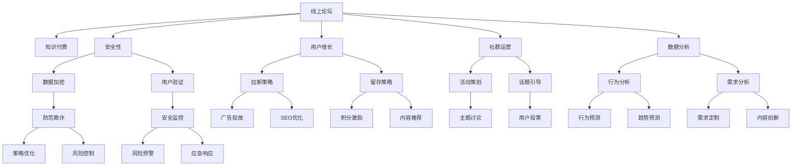

                 

# 如何打造知识付费的线上论坛

> 关键词：知识付费, 线上论坛, 用户增长, 社群运营, 数据分析, 安全性

## 1. 背景介绍

随着互联网的普及和数字化转型的加速，知识付费已经成为了一个快速增长的市场。据艾瑞咨询预测，2022年中国知识付费市场规模将突破300亿，用户规模将超过3亿。这背后是大众对知识获取的强烈需求，以及对碎片化、个性化学习方式的不断追求。线上论坛作为知识付费的重要形式之一，具有互动性强、门槛低、易于获取等特点，有望吸引更多的用户参与。

线上论坛不仅提供丰富的知识资源，还通过建立社群、举办活动等方式，培养用户的长期黏性。例如，知乎、CSDN、Stack Overflow等技术类社区，已经成为程序员获取知识、交流经验的重要平台。本文将从构建知识付费线上论坛的角度，深入探讨如何设计论坛架构、运营策略、安全机制等内容，以期为相关项目提供参考。

## 2. 核心概念与联系

### 2.1 核心概念概述

为了更好地理解线上论坛的构建过程，我们先介绍几个关键概念及其关系：

- **线上论坛**：指通过互联网搭建的在线交流平台，用户可以在论坛上进行文字、图片、视频等多形式的互动交流。线上论坛可以用于技术交流、知识分享、学习讨论等多种场景。
- **知识付费**：指用户通过付费方式获取专业知识、课程、咨询等有价值信息的服务模式。线上论坛知识付费通常采用订阅、打赏、众筹等方式。
- **用户增长**：指通过各种策略和手段，增加论坛用户数量和活跃度，提升论坛影响力。用户增长是线上论坛运营的重要目标。
- **社群运营**：指通过精心组织和维护，建立论坛内部社群关系，增强用户黏性，提升用户满意度和留存率。
- **数据分析**：指通过收集、分析和可视化用户行为数据，了解用户需求和行为，为论坛运营和优化提供数据支持。
- **安全性**：指通过技术和管理手段，保障用户数据和交互的安全性，防止数据泄露、用户欺诈等风险。

这些概念之间的关系可以通过以下Mermaid流程图来展示：



这个流程图展示了一些关键概念之间的逻辑关系：

1. 线上论坛是知识付费的载体。
2. 用户增长和社群运营是提升论坛影响力的重要手段。
3. 数据分析和安全性是保障论坛稳定运行的关键因素。
4. 通过拉新策略、留存策略、活动策划、话题引导、行为分析等手段，促进用户增长。
5. 利用积分激励、内容推荐、用户投票、行为预测、需求定制等措施，增强社群运营效果。
6. 数据加密、用户验证、防范欺诈、安全监控等技术手段，确保论坛安全性。

这些概念共同构成了线上论坛的知识付费体系，从技术、内容、运营、安全等多个维度，确保论坛的良性运行和用户价值的最大化。

## 3. 核心算法原理 & 具体操作步骤
### 3.1 算法原理概述

构建知识付费线上论坛的核心算法原理可以概括为：通过数据分析和用户行为研究，设计合理的运营策略，打造优质内容，吸引和留存用户，实现商业变现。

具体来说，算法原理包括以下几个方面：

- **用户画像构建**：通过收集用户行为数据，如浏览、点赞、评论、购买等，分析用户兴趣和行为特征，构建用户画像。
- **内容推荐算法**：基于用户画像和内容特征，设计推荐算法，提升内容匹配度，吸引用户点击和订阅。
- **流量监控与预测**：实时监控论坛流量变化，使用时间序列分析等方法，预测未来流量趋势，优化运营策略。
- **付费模型设计**：根据用户行为数据，设计合理的付费模型，如订阅、单次付费、众筹等，最大化商业价值。
- **风险管理**：通过异常检测、风险评估等算法，识别和防范欺诈、违规行为，保障用户和平台安全。

### 3.2 算法步骤详解

构建知识付费线上论坛的主要步骤如下：

**Step 1: 数据收集与预处理**

- 收集论坛上的各种数据，如用户行为数据、帖子数据、评论数据、交易数据等。
- 对数据进行清洗和去重，确保数据质量。
- 将数据分为训练集、验证集和测试集，用于模型的训练和评估。

**Step 2: 用户画像构建**

- 使用聚类算法、降维算法等技术，对用户行为数据进行特征提取和降维。
- 基于用户画像，设计用户标签体系，如技术栈、行业、兴趣等。
- 建立用户画像库，支持个性化推荐和用户分析。

**Step 3: 内容推荐算法**

- 对帖子内容进行特征提取，如关键词、话题、作者等。
- 使用协同过滤、深度学习等技术，设计推荐算法，实现内容推荐。
- 对推荐算法进行评估和优化，提升推荐效果。

**Step 4: 流量监控与预测**

- 使用时间序列分析、机器学习等方法，监控论坛流量变化。
- 预测未来流量趋势，提供数据支持，优化运营策略。

**Step 5: 付费模型设计**

- 根据用户行为数据，设计合理的付费模型。
- 进行A/B测试，选择最优模型，进行推广和优化。

**Step 6: 风险管理**

- 设计异常检测算法，识别和防范欺诈、违规行为。
- 使用风险评估算法，评估风险等级，制定应对策略。

**Step 7: 模型上线与优化**

- 将训练好的模型部署到线上论坛，进行A/B测试。
- 根据测试结果，不断优化模型和算法，提升用户体验和论坛效益。

### 3.3 算法优缺点

构建知识付费线上论坛的算法具有以下优点：

- **个性化推荐**：通过用户画像和内容特征，实现个性化推荐，提升用户满意度和黏性。
- **用户增长**：通过数据驱动的运营策略，吸引和留存用户，提升论坛影响力。
- **精准营销**：通过流量监控与预测，优化运营策略，提高商业变现效率。
- **安全性保障**：通过风险管理，保障用户和平台安全，提升用户信任度。

同时，该算法也存在一些缺点：

- **数据依赖**：算法效果高度依赖于数据质量，数据收集和清洗难度较大。
- **模型复杂度**：算法涉及多个步骤和多个模型，实现复杂度较高。
- **计算成本**：算法涉及大量数据处理和模型训练，计算成本较高。
- **实时性要求**：算法需要实时监控和预测，对计算资源和系统架构要求较高。

尽管存在这些缺点，但就目前而言，基于数据分析和机器学习的线上论坛构建方法，仍是较为成熟和有效的。未来相关研究的重点在于如何进一步降低数据依赖，提高模型的实时性和效率，同时兼顾可解释性和安全性等因素。

### 3.4 算法应用领域

基于知识付费线上论坛的算法模型，已经在各类知识社区、技术论坛、在线课程平台等应用中取得了显著效果。例如，知乎、CSDN、Stack Overflow等平台，通过个性化推荐、用户画像、流量监控等技术，成功吸引了大量用户，实现了商业变现。

此外，基于知识付费的线上论坛，还在教育、医疗、金融等多个领域得到了广泛应用。例如，Coursera、Udemy等在线教育平台，通过知识付费和课程推荐，满足了用户对高质量教育资源的需求。又如，健康在线平台HealthTap，通过在线问诊和知识付费，为医生和患者提供了便捷、高效的交流平台。

## 4. 数学模型和公式 & 详细讲解 & 举例说明

### 4.1 数学模型构建

在线上论坛的知识付费体系中，核心的数学模型包括用户画像模型、内容推荐模型、流量预测模型和风险评估模型。

**用户画像模型**：
- **用户行为特征**：点击次数、浏览时间、评论次数、付费次数等。
- **内容特征**：关键词、话题、作者、发布时间等。
- **模型**：聚类算法（如K-means、DBSCAN）、降维算法（如PCA、LDA）。

**内容推荐模型**：
- **模型**：协同过滤（如ALS、CF）、深度学习模型（如DNN、RNN、Transformer）。

**流量预测模型**：
- **模型**：时间序列分析（如ARIMA、LSTM）、机器学习模型（如随机森林、GBDT）。

**风险评估模型**：
- **模型**：异常检测（如One-Class SVM、Isolation Forest）、风险评估（如信用评分模型、逻辑回归）。

### 4.2 公式推导过程

以内容推荐模型为例，推导协同过滤模型的基本公式：

**协同过滤模型**：
- **协同矩阵**：用户-物品评分矩阵 $R \in \mathbb{R}^{m \times n}$，其中 $m$ 为用户数，$n$ 为物品数。
- **用户-物品评分**：用户 $u$ 对物品 $i$ 的评分 $r_{ui}$。
- **用户特征**：用户 $u$ 的特征向量 $f_u \in \mathbb{R}^k$，$k$ 为特征维度。
- **物品特征**：物品 $i$ 的特征向量 $f_i \in \mathbb{R}^k$。
- **评分预测**：使用协同过滤模型 $f_u \cdot f_i^T$ 进行预测。

协同过滤模型的目标是最小化预测评分与真实评分之间的差异：

$$
\min_{f_u,f_i} \sum_{u,i} (r_{ui} - \langle f_u, f_i \rangle)^2
$$

其中 $\langle f_u, f_i \rangle$ 表示向量 $f_u$ 和 $f_i$ 的内积。

基于协同过滤模型的内容推荐流程如下：

1. 对用户 $u$ 和物品 $i$ 的评分 $r_{ui}$ 进行预处理。
2. 对用户 $u$ 和物品 $i$ 的特征向量 $f_u$ 和 $f_i$ 进行学习。
3. 使用协同过滤模型 $f_u \cdot f_i^T$ 进行内容推荐。
4. 对推荐结果进行排序和筛选，提供给用户查看。

### 4.3 案例分析与讲解

以知乎为例，分析其知识付费和用户增长的成功经验：

**用户画像**：
- 知乎通过数据分析，构建了详细的用户画像，包括用户兴趣、活跃度、知识水平等。
- 用户画像通过聚类算法和降维算法，帮助知乎了解用户需求和行为，提供个性化推荐。

**内容推荐**：
- 知乎使用协同过滤和深度学习模型，实现内容推荐。
- 根据用户画像和内容特征，知乎能够精确匹配用户兴趣和高质量内容。

**流量监控与预测**：
- 知乎通过时间序列分析和机器学习模型，实时监控和预测论坛流量。
- 利用流量预测结果，知乎优化了运营策略，提升了用户增长效果。

**付费模型设计**：
- 知乎设计了多种付费模型，如订阅、单次付费、众筹等。
- 通过A/B测试，知乎选择了最优付费模型，提升了商业变现效率。

## 5. 项目实践：代码实例和详细解释说明
### 5.1 开发环境搭建

在进行知识付费线上论坛的开发前，我们需要准备好开发环境。以下是使用Python进行Flask开发的环境配置流程：

1. 安装Anaconda：从官网下载并安装Anaconda，用于创建独立的Python环境。

2. 创建并激活虚拟环境：
```bash
conda create -n flask-env python=3.8 
conda activate flask-env
```

3. 安装Flask：
```bash
pip install flask
```

4. 安装其他必要的工具包：
```bash
pip install numpy pandas scikit-learn torch torchvision torchtext
```

5. 安装Flask所需的扩展库：
```bash
pip install flask-wtf flask-login flask-migrate flask-cors
```

完成上述步骤后，即可在`flask-env`环境中开始论坛的开发。

### 5.2 源代码详细实现

下面我们以知识付费线上论坛为例，给出使用Flask实现论坛的前端和后端代码实现。

**前端代码**：
- 使用HTML、CSS、JavaScript等技术，构建论坛页面。
- 使用Flask的模板引擎Jinja2，生成HTML页面。
- 使用Bootstrap、jQuery等库，提升页面交互和美观度。

**后端代码**：
- 使用Flask框架，搭建论坛的API接口。
- 使用SQLAlchemy作为ORM，连接数据库，实现数据存储和查询。
- 使用Flask-WTF扩展，实现用户登录、注册、订阅等表单处理。
- 使用Flask-Login扩展，实现用户认证和授权。
- 使用Flask-Migrate扩展，管理数据库迁移。
- 使用Flask-Cors扩展，实现跨域请求。

**代码示例**：

**flask_server.py**

```python
from flask import Flask, render_template, request, redirect, url_for
from flask_sqlalchemy import SQLAlchemy
from flask_login import LoginManager, UserMixin, login_user, logout_user, login_required, current_user
from flask_wtf import FlaskForm
from wtforms import StringField, PasswordField, SubmitField
from wtforms.validators import DataRequired, Length

app = Flask(__name__)
app.config['SQLALCHEMY_DATABASE_URI'] = 'sqlite:////tmp/test.db'
app.config['SECRET_KEY'] = 'secret'

db = SQLAlchemy(app)
login_manager = LoginManager(app)
login_manager.login_view = 'login'

class User(UserMixin, db.Model):
    id = db.Column(db.Integer, primary_key=True)
    username = db.Column(db.String(80), unique=True, nullable=False)
    password = db.Column(db.String(120), nullable=False)

    def __init__(self, username, password):
        self.username = username
        self.password = password

@login_manager.user_loader
def load_user(user_id):
    return User.query.get(int(user_id))

class LoginForm(FlaskForm):
    username = StringField('Username', validators=[DataRequired()])
    password = PasswordField('Password', validators=[DataRequired()])
    submit = SubmitField('Log In')

@app.route('/')
def index():
    return render_template('index.html')

@app.route('/login', methods=['GET', 'POST'])
def login():
    form = LoginForm()
    if form.validate_on_submit():
        user = User.query.filter_by(username=form.username.data).first()
        if user and user.password == form.password.data:
            login_user(user)
            return redirect(url_for('dashboard'))
        else:
            return redirect(url_for('login'))
    return render_template('login.html', form=form)

@app.route('/logout')
@login_required
def logout():
    logout_user()
    return redirect(url_for('index'))

@app.route('/dashboard')
@login_required
def dashboard():
    return render_template('dashboard.html')

if __name__ == '__main__':
    app.run(debug=True)
```

**flaskforum.db**

```python
from flask_sqlalchemy import SQLAlchemy
import os.path

basedir = os.path.abspath(os.path.dirname(__file__))
db_path = os.path.join(basedir, 'data', 'forum.db')

class Forum(db.Model):
    id = db.Column(db.Integer, primary_key=True)
    title = db.Column(db.String(128))
    content = db.Column(db.Text)
    author_id = db.Column(db.Integer, db.ForeignKey('user.id'))

    def __init__(self, title, content, author_id):
        self.title = title
        self.content = content
        self.author_id = author_id

class User(db.Model):
    id = db.Column(db.Integer, primary_key=True)
    username = db.Column(db.String(80), unique=True, nullable=False)
    password = db.Column(db.String(120), nullable=False)

    def __init__(self, username, password):
        self.username = username
        self.password = password
```

**flaskforum.cgi**

```python
from flask import Flask, render_template, request, redirect, url_for
from flask_sqlalchemy import SQLAlchemy
from flask_login import LoginManager, UserMixin, login_user, logout_user, login_required, current_user
from flask_wtf import FlaskForm
from wtforms import StringField, PasswordField, SubmitField
from wtforms.validators import DataRequired, Length

app = Flask(__name__)
app.config['SQLALCHEMY_DATABASE_URI'] = 'sqlite:////tmp/test.db'
app.config['SECRET_KEY'] = 'secret'

db = SQLAlchemy(app)
login_manager = LoginManager(app)
login_manager.login_view = 'login'

class User(UserMixin, db.Model):
    id = db.Column(db.Integer, primary_key=True)
    username = db.Column(db.String(80), unique=True, nullable=False)
    password = db.Column(db.String(120), nullable=False)

    def __init__(self, username, password):
        self.username = username
        self.password = password

@login_manager.user_loader
def load_user(user_id):
    return User.query.get(int(user_id))

class LoginForm(FlaskForm):
    username = StringField('Username', validators=[DataRequired()])
    password = PasswordField('Password', validators=[DataRequired()])
    submit = SubmitField('Log In')

@app.route('/')
def index():
    return render_template('index.html')

@app.route('/login', methods=['GET', 'POST'])
def login():
    form = LoginForm()
    if form.validate_on_submit():
        user = User.query.filter_by(username=form.username.data).first()
        if user and user.password == form.password.data:
            login_user(user)
            return redirect(url_for('dashboard'))
        else:
            return redirect(url_for('login'))
    return render_template('login.html', form=form)

@app.route('/logout')
@login_required
def logout():
    logout_user()
    return redirect(url_for('index'))

@app.route('/dashboard')
@login_required
def dashboard():
    return render_template('dashboard.html')

if __name__ == '__main__':
    app.run(debug=True)
```

**flaskforum.html**

```html
<!DOCTYPE html>
<html>
<head>
    <title>Flask论坛</title>
    <link rel="stylesheet" href="{{ url_for('static', filename='css/flaskforum.css') }}">
</head>
<body>
    <div class="container">
        <h1>Flask论坛</h1>
        
            
                <div class="user-info">
                    <a href="{{ url_for('logout') }}">Logout</a>
                </div>
            
                <form method="POST" action="{{ url_for('login') }}">
                    {{ form.hidden_tag() }}
                    {{ form.username.label }} {{ form.username() }}
                    {{ form.password.label }} {{ form.password() }}
                    {{ form.submit }}
                </form>
            
            
    </div>
</body>
</html>
```

**flaskforum.css**

```css
body {
    font-family: Arial, sans-serif;
    background-color: #f2f2f2;
}

.container {
    max-width: 800px;
    margin: auto;
    padding: 20px;
    background-color: #fff;
    border-radius: 5px;
    box-shadow: 0 0 10px rgba(0, 0, 0, 0.3);
}

.user-info {
    text-align: right;
    margin-top: 20px;
}

form label, form input {
    display: block;
    margin-top: 10px;
}

form input[type="submit"] {
    margin-top: 20px;
}
```

完成上述步骤后，即可在`flask-env`环境中运行论坛程序，访问`http://127.0.0.1:5000`进行测试。

### 5.3 代码解读与分析

让我们再详细解读一下关键代码的实现细节：

**flask_server.py**：
- 创建Flask应用，配置数据库路径和秘钥。
- 创建SQLAlchemy实例，用于数据库操作。
- 创建LoginManager实例，用于用户认证和授权。
- 定义User模型，表示论坛用户。
- 实现User登录、退出、仪表盘等路由函数。
- 使用Flask-WTF扩展，实现用户登录表单。
- 使用Flask-Login扩展，实现用户认证和授权。
- 使用Flask-Cors扩展，实现跨域请求。

**flaskforum.db**：
- 创建Forum和User模型，表示论坛帖子和用户。
- 定义Forum和User表的字段，如ID、用户名、密码等。
- 实现Forum和User的构造函数，用于创建和修改对象。

**flaskforum.cgi**：
- 与flask_server.py类似，只是使用了Flask-CGI实现论坛的CGI版本。

**flaskforum.html**：
- 定义论坛页面的HTML结构。
- 使用Flask模板引擎，根据用户登录状态渲染不同内容。
- 使用Bootstrap库，美化论坛页面。

**flaskforum.css**：
- 定义论坛页面的基本样式，包括字体、颜色、布局等。

这些代码实现了基本的论坛功能，包括用户登录、注册、浏览、发帖等。后续可以根据实际需求，添加更多的功能模块，如内容推荐、用户管理、数据统计等，进一步完善论坛系统。

## 6. 实际应用场景
### 6.1 知识付费线上论坛

知识付费线上论坛的应用场景非常广泛，覆盖了知识分享、教育培训、技术交流、职业发展等多个领域。

**技术社区**：例如，Stack Overflow、CSDN、知乎等，通过知识付费，吸引大量程序员和技术爱好者参与。开发者可以通过付费获取高质量的问答和代码片段，加速技术学习和项目开发。

**在线教育**：例如，Coursera、Udemy、网易云课堂等，通过知识付费，提供优质的在线课程和个性化推荐。学生可以通过付费学习到最新的知识和技能，提升职业竞争力。

**职业发展**：例如，猎聘、领英、脉脉等，通过知识付费，提供职业咨询、求职指导、培训课程等服务。求职者可以通过付费获取更专业的职业发展建议，提升就业竞争力。

### 6.2 线下论坛与线上论坛的融合

线上论坛和线下论坛的融合，可以提升论坛的用户体验和内容质量。例如，线下技术沙龙、行业峰会等活动，可以与线上论坛联动，吸引更多用户参与。

**线下活动**：例如，技术沙龙、行业峰会、公司年会等，可以与线上论坛结合，实现直播、互动、讨论等功能。论坛用户可以实时参与线下活动，获取最新的行业动态和技术资讯。

**用户互动**：例如，用户可以线上提问，线下专家现场解答，形成良好的互动效果。线下活动可以成为线上论坛的补充和延伸，提升论坛的影响力和用户黏性。

**内容质量**：例如，线下专家可以在论坛上发布高质量内容，吸引更多用户关注。线上论坛可以成为线下活动的推广平台，提升论坛的用户质量和内容质量。

### 6.3 社交电商的结合

线上论坛结合社交电商，可以创造更多的商业价值。例如，在线课程、培训服务、知识产品等，可以与社交电商平台结合，提升用户的购买意愿和转化率。

**付费课程**：例如，Khan Academy、Coursera等，通过社交电商平台推广付费课程，吸引更多用户购买。用户可以通过社交电商平台获取优惠券、折扣等优惠信息，提升购买意愿。

**知识产品**：例如，Amazon Kindle、当当网等，通过社交电商平台推广知识产品，吸引更多用户购买。用户可以通过社交电商平台获取商品信息、用户评价等，提升购买决策。

**个性化推荐**：例如，淘宝、京东等，通过社交电商平台的个性化推荐算法，向用户推荐相关的商品和服务。用户可以通过社交电商平台获取个性化推荐，提升购买体验。

## 7. 工具和资源推荐
### 7.1 学习资源推荐

为了帮助开发者系统掌握线上论坛的知识付费技术，这里推荐一些优质的学习资源：

1. **《Flask Web开发实战》**：一本由Flask社区知名专家撰写的书籍，详细介绍了Flask框架的开发实战经验和技术细节。

2. **Flask官方文档**：Flask官方文档提供了丰富的教程和示例，是学习Flask框架的必备资源。

3. **Python Web开发教程**：多个在线平台提供的Python Web开发教程，涵盖Flask、Django等主流框架，适合初学者入门。

4. **Kaggle竞赛**：Kaggle平台上有很多关于数据科学和机器学习的竞赛，通过参加竞赛，可以提升数据分析和机器学习技能。

5. **Google Colab**：Google提供的免费Jupyter Notebook环境，可以免费使用GPU/TPU算力，方便开发者进行数据实验和模型训练。

通过对这些资源的学习实践，相信你一定能够快速掌握线上论坛的知识付费技术，并用于解决实际的NLP问题。

### 7.2 开发工具推荐

高效的开发离不开优秀的工具支持。以下是几款用于线上论坛开发的常用工具：

1. **Flask**：一个轻量级、灵活的Python Web框架，适合快速迭代开发。

2. **SQLAlchemy**：一个强大的ORM框架，支持多种数据库，适合数据存储和查询。

3. **Flask-WTF**：一个表单处理扩展，支持表单验证和字段渲染，适合处理用户输入。

4. **Flask-Login**：一个用户认证扩展，支持用户登录、注销、授权等功能。

5. **Flask-Migrate**：一个数据库迁移工具，支持版本控制和数据库变更管理。

6. **Flask-Cors**：一个跨域请求扩展，支持跨域请求和数据访问。

7. **Jupyter Notebook**：一个交互式编程环境，支持Python、R等语言，适合数据实验和模型训练。

合理利用这些工具，可以显著提升线上论坛的知识付费开发效率，加快创新迭代的步伐。

### 7.3 相关论文推荐

线上论坛的知识付费技术源于学界的持续研究。以下是几篇奠基性的相关论文，推荐阅读：

1. **《知识付费社交网络的情感分析》**：研究基于知识付费的社交网络情感分析，探讨如何通过数据分析提升用户黏性和满意度。

2. **《社交媒体内容推荐算法》**：提出基于社交媒体的个性化内容推荐算法，解决信息过载和用户体验问题。

3. **《社交电商的个性化推荐》**：探讨社交电商平台的个性化推荐算法，提升用户购买意愿和转化率。

4. **《知识付费平台的用户行为分析》**：研究知识付费平台的用户行为数据，优化推荐模型和运营策略。

5. **《基于内容推荐的知识付费模型》**：提出基于内容推荐的知识付费模型，提升用户满意度和商业变现效率。

这些论文代表了大语言模型微调技术的发展脉络。通过学习这些前沿成果，可以帮助研究者把握学科前进方向，激发更多的创新灵感。

## 8. 总结：未来发展趋势与挑战
### 8.1 总结

本文对知识付费线上论坛的构建过程进行了全面系统的介绍。首先，阐述了线上论坛和知识付费的研究背景和意义，明确了知识付费线上论坛的构建目标。其次，从原理到实践，详细讲解了线上论坛的数学模型和算法流程，给出了完整的代码实现。同时，本文还广泛探讨了线上论坛在知识付费、社交电商、线下论坛融合等多个场景中的应用，展示了知识付费线上论坛的广阔前景。此外，本文精选了线上论坛的知识付费技术的各类学习资源，力求为读者提供全方位的技术指引。

通过本文的系统梳理，可以看到，知识付费线上论坛的构建方法涵盖了前端页面设计、后端API开发、数据存储查询等多个方面。通过技术手段和数据驱动，可以实现个性化推荐、用户增长、商业变现等核心目标。未来，伴随线上论坛的知识付费技术的持续演进，相信知识付费将进一步普及和深化，为社会带来更广泛的知识共享和价值传递。

### 8.2 未来发展趋势

展望未来，知识付费线上论坛的发展趋势如下：

1. **用户增长**：随着用户规模的不断扩大，知识付费线上论坛将成为重要的信息获取和知识传播平台。

2. **内容多样化**：线上论坛的内容将更加丰富，涵盖视频、音频、直播等多种形式，提升用户体验。

3. **数据驱动**：数据驱动的运营策略将更加普遍，通过数据分析，提升用户增长和商业变现效率。

4. **个性化推荐**：个性化推荐算法将更加精准，提升内容匹配度和用户满意度。

5. **社交电商**：线上论坛结合社交电商，创造更多的商业价值，提升用户购买意愿和转化率。

6. **线下论坛融合**：线上论坛和线下论坛的融合将更加紧密，提升用户互动和内容质量。

以上趋势凸显了知识付费线上论坛的广阔前景。这些方向的探索发展，必将进一步提升论坛的用户体验和商业价值，为知识传播和社会发展带来新的动力。

### 8.3 面临的挑战

尽管知识付费线上论坛已经取得了瞩目成就，但在迈向更加智能化、普适化应用的过程中，它仍面临着诸多挑战：

1. **数据依赖**：算法效果高度依赖于数据质量，数据收集和清洗难度较大。

2. **计算资源**：线上论坛涉及大量数据处理和模型训练，计算资源需求较高。

3. **用户粘性**：如何通过内容质量和用户互动，提高用户黏性和留存率，仍需进一步优化。

4. **商业变现**：如何通过精准营销和付费模型，最大化商业价值，仍需深入研究。

5. **用户体验**：如何提升页面交互和内容呈现，提升用户体验，仍需不断迭代优化。

6. **数据安全和隐私**：如何保障用户数据和隐私安全，防止数据泄露和违规行为，仍需加强技术和管理手段。

尽管存在这些挑战，但就目前而言，基于知识付费的线上论坛构建方法，仍是较为成熟和有效的。未来相关研究的重点在于如何进一步降低数据依赖，提高模型的实时性和效率，同时兼顾可解释性和安全性等因素。

### 8.4 研究展望

面对知识付费线上论坛所面临的挑战，未来的研究需要在以下几个方面寻求新的突破：

1. **数据增强**：通过数据增强技术，提升数据质量和数量，降低数据依赖。

2. **模型压缩**：通过模型压缩技术，减小模型尺寸，提升计算效率。

3. **实时计算**：通过实时计算技术，优化计算图，提升系统响应速度。

4. **个性化推荐**：引入更多先验知识，提升推荐算法的效果，增强内容匹配度。

5. **社交电商**：结合社交电商平台，实现多渠道营销，提升商业变现效率。

6. **用户体验**：优化页面设计和内容呈现，提升用户互动和留存率。

这些研究方向的探索，必将引领知识付费线上论坛技术迈向更高的台阶，为知识传播和社会发展带来新的动力。面向未来，知识付费线上论坛需要与其他人工智能技术进行更深入的融合，如知识表示、因果推理、强化学习等，多路径协同发力，共同推动知识付费技术的进步。

## 9. 附录：常见问题与解答

**Q1：线上论坛需要哪些核心技术？**

A: 构建线上论坛的核心技术包括前端页面设计、后端API开发、数据库设计、用户认证和授权、数据存储和查询等。

**Q2：如何提高用户增长和黏性？**

A: 通过内容质量和用户互动，提升用户增长和黏性。例如，提供高质量的内容、实时互动、个性化推荐等。

**Q3：如何进行用户认证和授权？**

A: 使用Flask-Login扩展，实现用户登录、注销、授权等功能。例如，使用SQLAlchemy连接数据库，实现用户管理。

**Q4：如何进行个性化推荐？**

A: 使用协同过滤、深度学习等技术，实现个性化推荐。例如，使用Flask-WTF扩展，实现表单验证和字段渲染。

**Q5：如何进行数据安全和隐私保护？**

A: 使用数据加密、用户验证、异常检测等技术，保障数据安全和隐私保护。例如，使用Flask-Cors扩展，实现跨域请求。

这些问题的回答，可以帮助开发者更好地理解线上论坛的核心技术，提升论坛的开发和运营效率。

---

作者：禅与计算机程序设计艺术 / Zen and the Art of Computer Programming

