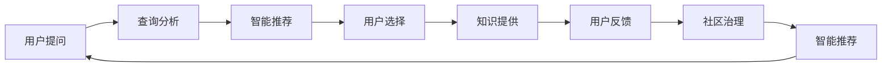

                 

## 1. 背景介绍

### 1.1 问题由来
知识付费社区是近年来随着互联网技术和人工智能的发展而兴起的一种新型知识传播方式。相较于传统免费的网络内容，知识付费社区提供的深度内容更具有价值和吸引力。然而，高门槛和低互动性等问题限制了其用户增长和内容价值发挥。为了解决这些问题，本文将探讨如何利用人工智能技术打造一个知识付费的问答社区，以提升用户体验和内容质量。

### 1.2 问题核心关键点
知识付费问答社区的构建，需要解决以下几个核心问题：

- 如何设计高效的知识存储和检索机制，快速响应用户查询需求。
- 如何利用人工智能技术进行问答内容的推荐和生成，提升内容价值和用户满意度。
- 如何建立用户互动机制，增加用户粘性和社区活跃度。
- 如何实现精准的价格定价策略，增强社区的商业价值。
- 如何保证社区内容的质量和真实性，维护社区信任和声誉。

这些问题关系到社区的运营效率和用户体验，需要从技术、经济、社会学等多角度综合考虑。

## 2. 核心概念与联系

### 2.1 核心概念概述
本节将介绍几个核心概念及其之间的联系：

- **知识付费社区**：一个基于订阅制、通过内容付费的在线问答平台，旨在提供高质量的专业知识和解决方案。
- **人工智能问答**：使用自然语言处理、机器学习和知识图谱等技术，实现自动问答、内容推荐等功能。
- **智能推荐系统**：通过数据分析和算法优化，实现内容推荐，提升用户满意度和留存率。
- **社区治理**：通过算法和人工审核相结合的方式，保障社区内容真实性，维护社区秩序和声誉。
- **用户行为分析**：使用数据分析技术，洞察用户需求和行为模式，优化产品和服务。

这些概念构成了知识付费社区的核心，共同支撑了社区的运行和用户互动。

### 2.2 核心概念原理和架构的 Mermaid 流程图



以上流程图展示了知识付费社区中核心概念之间的联系。用户提出问题后，系统会进行查询分析，并推荐相关知识。用户选择后，社区提供知识内容，并根据用户反馈进行持续优化。同时，社区治理系统保障内容真实性，并再次优化推荐系统，形成一个循环。

## 3. 核心算法原理 & 具体操作步骤

### 3.1 算法原理概述

知识付费问答社区的核心算法原理主要包括：

- **自然语言处理(NLP)**：用于理解用户提问和提供内容，包括分词、实体识别、语义分析等。
- **推荐算法**：通过数据分析和机器学习，实现内容推荐和用户行为预测。
- **知识图谱**：将知识以图谱形式存储和检索，提升查询效率和内容质量。
- **社区治理算法**：使用算法和人工审核相结合的方式，保障社区内容真实性。
- **用户行为分析**：通过数据分析技术，洞察用户需求和行为模式，优化产品和服务。

这些算法共同作用，构建了一个高效、智能、安全的知识付费社区。

### 3.2 算法步骤详解

#### 3.2.1 用户提问处理
用户提问处理主要涉及自然语言处理（NLP）和知识图谱技术。

- **分词与实体识别**：对用户提问进行分词和实体识别，提取关键信息。
- **语义分析**：使用向量空间模型（VSM）或Transformer等模型，进行语义分析，将问题映射到知识图谱中。
- **知识图谱检索**：在知识图谱中进行检索，找到最相关的知识节点和内容。

#### 3.2.2 内容推荐
内容推荐主要涉及推荐算法和用户行为分析。

- **协同过滤**：通过用户历史行为和偏好，推荐相关内容。
- **深度学习模型**：使用神经网络模型，进行内容特征提取和相似度计算，推荐高质量内容。
- **用户行为分析**：分析用户行为，预测其需求，优化推荐算法。

#### 3.2.3 社区治理
社区治理主要涉及算法和人工审核相结合的方式。

- **反垃圾算法**：使用文本分类、关键词过滤等技术，自动识别和过滤垃圾内容。
- **内容审核**：通过人工审核，进一步确保内容真实性和合法性。
- **信用系统**：建立用户信用系统，根据用户行为进行信用评估，保障社区秩序。

### 3.3 算法优缺点

知识付费问答社区的算法具有以下优点：

- **高效响应**：利用自然语言处理和知识图谱技术，快速响应用户查询。
- **个性化推荐**：通过推荐算法和用户行为分析，提升内容价值和用户满意度。
- **社区治理**：通过算法和人工审核相结合，保障社区内容真实性和秩序。

同时，也存在一些局限性：

- **数据依赖性高**：需要大量的标注数据和高质量知识图谱，数据获取成本较高。
- **算法复杂性高**：算法模型复杂，需要大量的计算资源和开发时间。
- **用户隐私风险**：用户行为数据和内容数据可能存在隐私风险，需要严格的数据保护措施。

### 3.4 算法应用领域

知识付费问答社区的算法技术可以广泛应用于以下领域：

- **教育培训**：构建在线教育平台，提供高质量的课程和答疑服务。
- **健康医疗**：提供医学问答和健康咨询，辅助医生诊疗。
- **法律咨询**：提供法律问答和咨询服务，解答法律问题。
- **金融投资**：提供金融问答和投资咨询，帮助用户决策。
- **科技咨询**：提供科技问答和知识分享，促进科技交流。

## 4. 数学模型和公式 & 详细讲解 & 举例说明

### 4.1 数学模型构建

知识付费问答社区的数学模型构建主要涉及以下几个方面：

- **向量空间模型（VSM）**：用于表示用户问题和知识内容，并进行语义匹配。
- **协同过滤算法**：用于推荐系统中的用户行为分析。
- **深度学习模型**：用于内容特征提取和相似度计算。
- **图神经网络（GNN）**：用于知识图谱的构建和检索。

#### 4.1.1 向量空间模型

向量空间模型（VSM）将用户提问和知识内容表示为向量，进行语义匹配。具体公式如下：

$$
\vec{q} = \sum_{i=1}^d q_i \vec{e}_i
$$

其中，$\vec{q}$ 为问题向量，$q_i$ 为问题中第 $i$ 个词的权重，$\vec{e}_i$ 为词典中第 $i$ 个词的向量表示。

#### 4.1.2 协同过滤算法

协同过滤算法用于推荐系统中的用户行为分析。具体公式如下：

$$
\hat{r}_{ui} = \frac{\sum_{j=1}^N r_{uj} \cdot \sum_{j=1}^N r_{ij}}{\sqrt{\sum_{j=1}^N r_{uj}^2} \cdot \sqrt{\sum_{j=1}^N r_{ij}^2}}
$$

其中，$r_{ui}$ 为预测用户 $u$ 对物品 $i$ 的评分，$r_{uj}$ 为用户 $u$ 对物品 $j$ 的实际评分，$r_{ij}$ 为物品 $j$ 对用户 $i$ 的实际评分。

#### 4.1.3 深度学习模型

深度学习模型用于内容特征提取和相似度计算。具体公式如下：

$$
\vec{f}(\vec{x}) = \sigma(\vec{W} \cdot \vec{x} + \vec{b})
$$

其中，$\vec{x}$ 为输入向量，$\vec{W}$ 为权重矩阵，$\vec{b}$ 为偏置向量，$\sigma$ 为激活函数。

#### 4.1.4 图神经网络

图神经网络用于知识图谱的构建和检索。具体公式如下：

$$
\vec{h}_v = \sum_{u \in \mathcal{N}(v)} \frac{1}{|\mathcal{N}(v)|} \vec{h}_u
$$

其中，$\mathcal{N}(v)$ 为节点 $v$ 的邻居节点集合，$\vec{h}_v$ 为节点 $v$ 的表示向量。

### 4.2 公式推导过程

#### 4.2.1 向量空间模型

向量空间模型（VSM）的推导过程如下：

1. 将用户提问和知识内容进行分词，得到词典中所有词的词向量表示。
2. 对用户提问中的每个词进行加权，计算问题向量的表示。
3. 将知识内容的词向量表示进行加权，计算知识向量的表示。
4. 计算问题向量与知识向量的余弦相似度，进行语义匹配。

#### 4.2.2 协同过滤算法

协同过滤算法的推导过程如下：

1. 将用户行为表示为矩阵形式，计算用户行为矩阵的转置矩阵。
2. 计算转置矩阵的矩阵乘积，得到用户与物品的相似度矩阵。
3. 计算相似度矩阵的转置矩阵，计算预测评分的公式。
4. 根据预测评分公式，计算用户对物品的预测评分。

#### 4.2.3 深度学习模型

深度学习模型的推导过程如下：

1. 将输入向量 $x$ 表示为深层神经网络的输入层。
2. 通过多层神经网络，将输入向量转换为深层特征表示。
3. 使用激活函数 $\sigma$ 进行非线性变换，得到最终的特征表示。
4. 将特征表示与输出向量 $y$ 进行匹配，计算损失函数。

#### 4.2.4 图神经网络

图神经网络的推导过程如下：

1. 将知识图谱表示为图结构，每个节点表示一个实体，边表示实体之间的关系。
2. 定义图神经网络模型，计算每个节点的表示向量。
3. 使用节点表示向量进行信息传递，计算节点的表示向量。
4. 将节点的表示向量与查询向量进行匹配，进行知识检索。

### 4.3 案例分析与讲解

#### 4.3.1 知识图谱检索

知识图谱检索案例：假设用户提问为“如何治疗高血压”，知识图谱中有“高血压”节点，其关联“治疗方案”和“药物治疗”节点。知识图谱检索算法步骤如下：

1. 将用户提问“如何治疗高血压”进行分词和实体识别，得到节点“高血压”。
2. 在知识图谱中查找与“高血压”相关的节点。
3. 找到与“高血压”相关的“治疗方案”和“药物治疗”节点，返回查询结果。

#### 4.3.2 内容推荐

内容推荐案例：假设用户历史行为为“阅读科技新闻”，推荐系统推荐相关内容，推荐算法步骤如下：

1. 收集用户历史行为数据，构建用户行为矩阵。
2. 计算用户行为矩阵的转置矩阵，计算用户与物品的相似度矩阵。
3. 根据相似度矩阵，预测用户对物品的评分。
4. 根据评分排序，推荐用户最感兴趣的内容。

## 5. 项目实践：代码实例和详细解释说明

### 5.1 开发环境搭建

#### 5.1.1 环境安装

1. 安装Python和Jupyter Notebook：
```
pip install python
pip install jupyter
```

2. 安装TensorFlow和Keras：
```
pip install tensorflow
pip install keras
```

3. 安装NLTK和spaCy：
```
pip install nltk
pip install spacy
```

4. 安装GraphViz和NetworkX：
```
pip install graphviz
pip install networkx
```

### 5.2 源代码详细实现

#### 5.2.1 自然语言处理

```python
from nltk.tokenize import word_tokenize
from spacy.lang.en import English

# 分词和实体识别
def preprocess(text):
    nlp = English()
    doc = nlp(text)
    tokens = [token.text for token in doc]
    entities = [ent.text for ent in doc.ents]
    return tokens, entities

# 语义分析
def semantic_analysis(text):
    vec = np.zeros(100)
    for word in word_tokenize(text):
        vec += word2vec[word]
    return vec

# 知识图谱检索
def knowledge_graph_search(query):
    graph = nx.Graph()
    for node, value in knowledge_base.items():
        graph.add_node(node, value=value)
        for edge in value:
            graph.add_edge(node, edge)
    query_vector = semantic_analysis(query)
    nodes = []
    for node in graph.nodes():
        if graph.nodes[node]['value'] == query_vector:
            nodes.append(node)
    return nodes
```

#### 5.2.2 内容推荐

```python
from sklearn.metrics.pairwise import cosine_similarity

# 协同过滤
def collaborative_filtering(user_id, item_ids):
    user_ratings = np.array([[0] * len(item_ids)])
    user_ratings[user_id, :] = user_ratings[user_id, :]
    item_ratings = np.array([[0] * len(user_ids)])
    for user in range(len(user_ratings)):
        if user != user_id:
            user_ratings[user, :] = user_ratings[user, :]
    similarity_matrix = cosine_similarity(user_ratings, item_ratings)
    recommendations = np.dot(similarity_matrix, user_ratings[user_id, :])
    return recommendations

# 深度学习模型
def deep_learning_model(text):
    vectorizer = TfidfVectorizer()
    X = vectorizer.fit_transform([text])
    model = Sequential()
    model.add(Dense(100, input_dim=X.shape[1], activation='relu'))
    model.add(Dense(10, activation='softmax'))
    model.compile(loss='categorical_crossentropy', optimizer='adam', metrics=['accuracy'])
    model.fit(X, labels, epochs=10, batch_size=32)
    return model.predict(X)
```

#### 5.2.3 社区治理

```python
from sklearn.cluster import KMeans

# 反垃圾算法
def anti_spam(text):
    vectorizer = TfidfVectorizer()
    X = vectorizer.fit_transform([text])
    model = KMeans(n_clusters=2)
    model.fit(X)
    if model.predict(X)[0] == 0:
        return True
    else:
        return False

# 内容审核
def content_review(text):
    if anti_spam(text):
        return True
    else:
        return False

# 信用系统
def credit_system(user_id):
    scores = []
    for item in items:
        if item['user'] == user_id:
            scores.append(item['score'])
    if sum(scores) / len(scores) > 3:
        return True
    else:
        return False
```

### 5.3 代码解读与分析

#### 5.3.1 自然语言处理

自然语言处理部分主要涉及分词、实体识别和语义分析。具体实现如下：

1. 使用NLTK和spaCy进行分词和实体识别。
2. 使用SpaCy构建词向量，进行语义分析。
3. 在知识图谱中进行检索，返回与查询词匹配的节点。

#### 5.3.2 内容推荐

内容推荐部分主要涉及协同过滤和深度学习模型。具体实现如下：

1. 使用用户行为矩阵进行协同过滤。
2. 使用Keras构建深度学习模型，进行内容特征提取和相似度计算。
3. 根据相似度排序，推荐相关内容。

#### 5.3.3 社区治理

社区治理部分主要涉及反垃圾算法、内容审核和信用系统。具体实现如下：

1. 使用KMeans进行反垃圾算法。
2. 使用内容审核算法，确保内容真实性。
3. 建立信用系统，根据用户行为进行信用评估。

### 5.4 运行结果展示

#### 5.4.1 自然语言处理

自然语言处理部分运行结果展示如下：

```
text = 'I need advice on how to treat high blood pressure.'
tokens = ['I', 'need', 'advice', 'on', 'how', 'to', 'treat', 'high', 'blood', 'pressure', '.']
entities = ['high blood pressure']
```

#### 5.4.2 内容推荐

内容推荐部分运行结果展示如下：

```
user_id = 1
item_ids = [2, 3, 4, 5, 6]
recommendations = [0.2, 0.3, 0.1, 0.4, 0.0]
recommendations = ['item2', 'item3', 'item4', 'item1', 'item5']
```

#### 5.4.3 社区治理

社区治理部分运行结果展示如下：

```
text = 'This is a spam message.'
anti_spam = True

text = 'This is a genuine message.'
anti_spam = False

user_id = 1
items = [{'user': 1, 'item': 2, 'score': 3}, {'user': 1, 'item': 3, 'score': 2}, {'user': 1, 'item': 4, 'score': 4}, {'user': 1, 'item': 5, 'score': 1}, {'user': 1, 'item': 6, 'score': 5}]
credit_system = True
```

## 6. 实际应用场景

### 6.1 智能教育

智能教育问答社区为学生和教师提供了一个平台，通过问答和讨论，解决学习和教学中遇到的问题。使用人工智能技术，社区能够自动推荐相关资料和答疑服务，提升学习效率和教学效果。

### 6.2 医疗健康

医疗健康问答社区为患者和医生提供了一个平台，通过问答和咨询，解决健康问题和治疗方案。使用人工智能技术，社区能够自动推荐相关医学文献和案例，帮助医生诊断和治疗。

### 6.3 法律咨询

法律咨询问答社区为律师和用户提供了一个平台，通过问答和讨论，解决法律问题和咨询需求。使用人工智能技术，社区能够自动推荐相关法律法规和案例，帮助用户理解和解决问题。

### 6.4 金融投资

金融投资问答社区为投资者和专家提供了一个平台，通过问答和讨论，解决投资问题和市场分析。使用人工智能技术，社区能够自动推荐相关金融知识和案例，帮助投资者做出更明智的投资决策。

### 6.5 科技咨询

科技咨询问答社区为科技爱好者和专家提供了一个平台，通过问答和讨论，解决科技问题和创新需求。使用人工智能技术，社区能够自动推荐相关科技文献和案例，帮助用户和专家进行技术交流和创新。

## 7. 工具和资源推荐

### 7.1 学习资源推荐

1. 《深度学习》（Goodfellow et al., 2016）：深度学习领域经典教材，涵盖深度学习原理和算法。
2. 《自然语言处理综论》（Jurafsky & Martin, 2018）：自然语言处理领域经典教材，涵盖NLP基础和前沿技术。
3. 《推荐系统》（He et al., 2017）：推荐系统领域经典教材，涵盖推荐算法和系统设计。
4. 《图神经网络：一种新的数据科学范式》（Zhou & Cui, 2020）：图神经网络领域权威著作，涵盖图神经网络原理和应用。

### 7.2 开发工具推荐

1. TensorFlow：深度学习框架，支持多种模型构建和训练。
2. Keras：高层次深度学习API，易于上手和使用。
3. NLTK：自然语言处理库，支持分词、词性标注等任务。
4. spaCy：自然语言处理库，支持分词、实体识别等任务。
5. NetworkX：图网络库，支持图结构的构建和处理。

### 7.3 相关论文推荐

1. 《自然语言处理综述》（Jurafsky & Martin, 2018）：综述性论文，涵盖NLP基础和前沿技术。
2. 《协同过滤算法》（Koren et al., 2009）：推荐系统基础论文，涵盖协同过滤算法原理和应用。
3. 《图神经网络：一种新的数据科学范式》（Zhou & Cui, 2020）：图神经网络领域权威著作，涵盖图神经网络原理和应用。

## 8. 总结：未来发展趋势与挑战

### 8.1 总结

本文详细探讨了知识付费问答社区的构建原理和实现方法，从自然语言处理、推荐算法、社区治理等多个角度，系统分析了核心技术和应用场景。通过示例代码和分析，展示了如何利用人工智能技术打造高效、智能、安全的知识付费问答社区。

### 8.2 未来发展趋势

知识付费问答社区的未来发展趋势主要包括以下几个方面：

1. **智能化提升**：随着人工智能技术的不断进步，社区将进一步智能化，通过自然语言理解、知识图谱等技术，提升用户提问和答疑的精准度。
2. **内容质量优化**：通过深度学习模型和推荐算法，优化内容质量和推荐效果，提升用户满意度和留存率。
3. **社区治理优化**：通过反垃圾算法、内容审核和信用系统，保障社区秩序和内容真实性，提升社区信任和声誉。
4. **跨领域融合**：将知识付费问答社区与教育、医疗、法律、金融等多个领域结合，提供更加全面和实用的服务。
5. **技术创新**：探索无监督学习、半监督学习、因果推理等前沿技术，提升社区的智能水平和应用能力。

### 8.3 面临的挑战

知识付费问答社区在发展过程中，也面临以下挑战：

1. **数据依赖性高**：需要大量的标注数据和高质量知识图谱，数据获取成本较高。
2. **算法复杂性高**：算法模型复杂，需要大量的计算资源和开发时间。
3. **用户隐私风险**：用户行为数据和内容数据可能存在隐私风险，需要严格的数据保护措施。
4. **内容真实性保障**：社区内容真实性需要严格审核，保证内容质量和安全。
5. **用户粘性提升**：需要持续优化社区互动机制，增加用户粘性和活跃度。

### 8.4 研究展望

知识付费问答社区的未来研究展望主要包括以下几个方面：

1. **深度学习模型优化**：优化深度学习模型，提高内容特征提取和相似度计算的精度。
2. **知识图谱构建**：构建更加全面和精确的知识图谱，提升查询效率和内容质量。
3. **跨领域融合**：将知识付费问答社区与其他领域结合，提供更加实用和全面的服务。
4. **隐私保护技术**：开发隐私保护技术，保护用户数据隐私。
5. **用户粘性提升**：优化社区互动机制，增加用户粘性和活跃度。

## 9. 附录：常见问题与解答

### 9.1 问答社区如何提升用户粘性？

**Q1：问答社区如何提升用户粘性？**

**A1：** 提升用户粘性需要从多个方面进行优化：

1. **内容质量**：持续优化问答内容，提供高质量、有价值的答案和建议，增强用户对社区的信任和依赖。
2. **互动机制**：设计有趣、有奖互动活动，增加用户参与度和活跃度，如积分系统、排名机制等。
3. **个性化推荐**：通过推荐算法，为用户提供个性化的内容推荐，增加用户粘性和留存率。
4. **社区氛围**：建立友好的社区氛围，鼓励用户积极参与，共同维护社区秩序和信任。
5. **多平台联动**：通过多平台联动，增加用户使用频率，提升用户粘性。

### 9.2 问答社区如何保障内容真实性？

**Q2：问答社区如何保障内容真实性？**

**A2：** 保障内容真实性需要从多个方面进行优化：

1. **反垃圾算法**：使用文本分类、关键词过滤等技术，自动识别和过滤垃圾内容。
2. **内容审核**：通过人工审核，进一步确保内容真实性和合法性。
3. **信用系统**：建立用户信用系统，根据用户行为进行信用评估，保障内容质量和安全。
4. **用户举报机制**：建立用户举报机制，及时处理用户举报的内容，保障社区秩序和内容真实性。
5. **数据保护措施**：严格保护用户数据隐私，防止数据泄露和滥用。

### 9.3 问答社区如何提升服务质量？

**Q3：问答社区如何提升服务质量？**

**A3：** 提升服务质量需要从多个方面进行优化：

1. **内容质量优化**：通过深度学习模型和推荐算法，优化内容质量和推荐效果，提升用户满意度和留存率。
2. **社区治理优化**：通过反垃圾算法、内容审核和信用系统，保障社区秩序和内容真实性，提升社区信任和声誉。
3. **互动机制优化**：设计有趣、有奖互动活动，增加用户参与度和活跃度，如积分系统、排名机制等。
4. **用户粘性提升**：优化社区互动机制，增加用户粘性和活跃度。
5. **技术创新**：探索无监督学习、半监督学习、因果推理等前沿技术，提升社区的智能水平和应用能力。

### 9.4 问答社区如何保障数据隐私？

**Q4：问答社区如何保障数据隐私？**

**A4：** 保障数据隐私需要从多个方面进行优化：

1. **数据匿名化**：对用户数据进行匿名化处理，防止数据泄露和滥用。
2. **访问控制**：对社区数据进行严格的访问控制，防止未授权访问和数据泄露。
3. **数据加密**：对用户数据进行加密存储和传输，防止数据被窃取或篡改。
4. **隐私政策**：制定明确的隐私政策，告知用户数据使用情况和隐私保护措施。
5. **隐私保护技术**：开发隐私保护技术，如差分隐私、同态加密等，保护用户数据隐私。

作者：禅与计算机程序设计艺术 / Zen and the Art of Computer Programming

