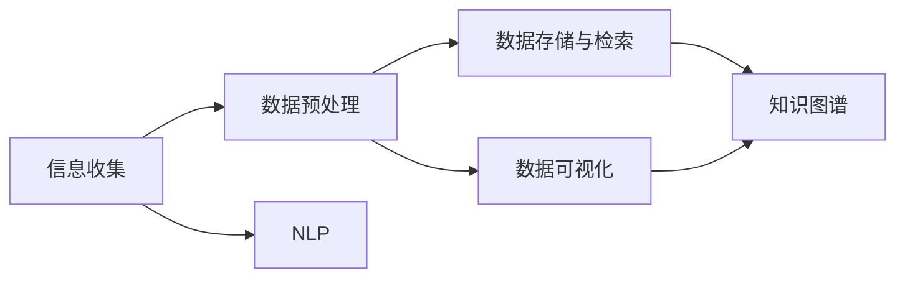

                 

# 如何进行信息收集：如何获取有效的信息和知识？

> 关键词：信息收集, 数据获取, 知识提取, 信息检索, 数据预处理, 数据可视化, 自然语言处理(NLP), 信息管理

## 1. 背景介绍

### 1.1 问题由来
在当今信息爆炸的时代，信息收集、处理和利用已经成为了各行各业的重要任务。无论是科研、商业、教育还是政府，都需要高效地从海量数据中提取有用的信息和知识。然而，信息源的复杂性、数据量的庞大性和内容的模糊性，使得信息收集和知识提取成为了一项具有挑战性的任务。本文将围绕如何高效地获取有效的信息和知识，探讨相关技术和方法，为信息收集和知识提取提供指导。

### 1.2 问题核心关键点
信息收集和知识提取的核心在于以下几个方面：
- **信息源多样性**：信息可能来源于网页、文档、社交媒体、传感器等多种渠道，需要多样化的收集方法。
- **数据量大**：随着数据产生速度的加快，如何高效地处理和存储大量数据成为挑战。
- **内容模糊性**：文本、图像、语音等多种形式的数据，内容解析和理解具有较高的复杂度。
- **信息时效性**：信息需要及时更新，以保持其相关性和准确性。
- **知识表示**：如何将信息转化为有组织、可利用的知识，是知识提取的关键。

## 2. 核心概念与联系

### 2.1 核心概念概述

为了更好地理解信息收集和知识提取的技术，本节将介绍几个密切相关的核心概念：

- **信息收集**：从不同信息源获取原始数据的过程，包括网页抓取、API接口调用、传感器数据采集等。
- **数据预处理**：对原始数据进行清洗、转换、归一化等操作，以提高数据的质量和可用性。
- **数据存储与检索**：选择合适的数据库或数据仓库存储和管理数据，以便高效地检索和查询。
- **数据可视化**：通过图表、地图等形式将数据进行可视化展示，帮助用户更好地理解和分析数据。
- **自然语言处理(NLP)**：对文本数据进行分词、标注、理解等操作，提取出有用的信息。
- **知识图谱**：构建语义化的知识表示，用于存储和管理知识，支持知识推理和关联查询。

这些概念之间存在紧密的联系，构成了一个完整的信息收集和知识提取系统。以下是一个Mermaid流程图，展示了它们之间的关系：



这个流程图展示了信息收集和知识提取的关键环节：

1. 从不同信息源获取原始数据。
2. 对数据进行预处理，提高其质量和可用性。
3. 使用数据库或数据仓库存储和管理数据。
4. 通过可视化展示数据，帮助用户理解。
5. 应用自然语言处理技术提取文本信息。
6. 构建知识图谱，支持知识表示和推理。

## 3. 核心算法原理 & 具体操作步骤

### 3.1 算法原理概述

信息收集和知识提取的过程可以分为两个主要阶段：**数据收集**和**数据处理**。下面将详细介绍这两个阶段的核心算法原理。

### 3.2 算法步骤详解

#### 3.2.1 数据收集算法

数据收集的主要目的是从不同的信息源获取原始数据。常见的数据收集方法包括：

- **网页抓取**：使用爬虫程序抓取网页内容，存储到本地或数据库中。
- **API接口调用**：通过API接口获取结构化数据，如金融市场数据、天气预报等。
- **传感器数据采集**：使用传感器获取物理世界的数据，如温度、湿度、位置等。
- **社交媒体数据采集**：从社交平台获取用户生成内容，如微博、微信、Twitter等。

#### 3.2.2 数据处理算法

数据处理的主要任务是对原始数据进行清洗、转换和分析。常见的数据处理技术包括：

- **数据清洗**：去除噪音数据、处理缺失值、校正数据格式等。
- **数据转换**：将数据转换为统一的格式，便于后续分析和使用。
- **数据归一化**：对数据进行标准化处理，以便不同数据源之间的比较。
- **数据集成**：将来自不同数据源的数据进行合并和融合，形成统一的数据集。

#### 3.2.3 算法优缺点

信息收集和知识提取算法具有以下优点：

- **高效性**：通过自动化工具和算法，可以大幅提高数据收集和处理的效率。
- **可扩展性**：随着数据量的增加，可以灵活扩展数据收集和处理能力。
- **多样性**：能够处理多种形式的数据，如文本、图像、语音等。

同时，这些算法也存在一些局限性：

- **数据源限制**：需要获取的信息源可能受限于可访问性和数据开放性。
- **数据质量问题**：数据来源多样，数据质量参差不齐，需要额外的处理。
- **隐私和安全问题**：在数据收集和处理过程中，需要确保数据隐私和安全。

### 3.3 算法应用领域

信息收集和知识提取技术在多个领域得到了广泛应用，包括但不限于：

- **科学研究**：通过网络爬虫和传感器数据采集，获取科学实验数据和研究文献。
- **商业分析**：从市场数据、社交媒体和销售记录中提取商业洞察，支持决策分析。
- **医疗健康**：从电子病历和健康监测设备中收集患者数据，支持疾病诊断和治疗。
- **教育领域**：从在线学习平台和学术资源中获取教育数据，支持个性化学习。
- **政府治理**：从公共数据和调查问卷中收集数据，支持政策制定和公共服务。

## 4. 数学模型和公式 & 详细讲解 & 举例说明

### 4.1 数学模型构建

为了更好地理解和设计信息收集和知识提取的算法，我们将使用一些数学模型来描述这一过程。

### 4.2 公式推导过程

#### 4.2.1 网页抓取模型

网页抓取算法可以抽象为以下数学模型：

- **输入**：要抓取网页的URL和抓取频率。
- **输出**：抓取到的网页内容和元数据。
- **目标函数**：最大化抓取到的有效数据量，同时最小化抓取时间和成本。

假设抓取总时间为 $T$，抓取速度为 $v$，抓取频率为 $f$，抓取到有效数据的比例为 $p$。则抓取到的有效数据量为 $pTv$，抓取成本为 $C = T \times f$。

#### 4.2.2 数据清洗模型

数据清洗模型可以抽象为以下数学模型：

- **输入**：原始数据集和清洗规则。
- **输出**：清洗后的数据集。
- **目标函数**：最大化清洗后数据的质量，同时最小化清洗时间和成本。

假设清洗时间为 $t$，清洗规则数量为 $n$，清洗后的数据质量为 $q$。则清洗后的数据质量 $q$ 与原始数据集的质量 $q_0$ 和清洗规则的数量 $n$ 相关，可以表示为：$q = q_0 \times (1 - \epsilon) \times n$，其中 $\epsilon$ 为清洗规则的误差率。

#### 4.2.3 数据转换模型

数据转换模型可以抽象为以下数学模型：

- **输入**：原始数据集和转换规则。
- **输出**：转换后的数据集。
- **目标函数**：最大化转换后的数据可用性，同时最小化转换时间和成本。

假设转换时间为 $t$，转换规则数量为 $n$，转换后的数据可用性为 $u$。则转换后的数据可用性 $u$ 与原始数据集的可用性 $u_0$ 和转换规则的数量 $n$ 相关，可以表示为：$u = u_0 \times (1 - \delta) \times n$，其中 $\delta$ 为转换规则的误差率。

### 4.3 案例分析与讲解

#### 4.3.1 网页抓取案例

假设我们要从Google Scholar中抓取论文标题和摘要，并将其存储到本地数据库中。可以使用Python的Scrapy框架和Selenium库来实现。

```python
import scrapy
from scrapy.crawler import CrawlerProcess
from selenium import webdriver

class ScholarSpider(scrapy.Spider):
    name = "scholar_spider"
    start_urls = ["https://scholar.google.com/"]  # 从Google Scholar首页抓取

    def parse(self, response):
        for link in response.css("a.scholarLink"):
            url = link.attrib["href"]
            yield {
                "title": response.css("h3.title").get(),
                "abstract": response.css("div.scholarAbstract").get(),
                "url": url
            }

# 使用Selenium加载动态网页
driver = webdriver.Chrome()
driver.get("https://scholar.google.com/")

# 抓取网页
process = CrawlerProcess()
process.crawl(ScholarSpider)
process.start()

# 关闭Selenium浏览器
driver.quit()
```

#### 4.3.2 数据清洗案例

假设我们要对一组基因表达数据进行清洗，去除噪音数据和缺失值。可以使用Python的Pandas库实现。

```python
import pandas as pd
import numpy as np

# 读取原始数据
df = pd.read_csv("raw_data.csv")

# 去除噪音数据
df = df[(df["expression"] != "") & (df["mutation"] != "")]

# 处理缺失值
df = df.dropna()

# 数据转换
df["expression"] = df["expression"].apply(lambda x: np.log(x))

# 数据归一化
df["expression"] = (df["expression"] - df["expression"].mean()) / df["expression"].std()
```

## 5. 项目实践：代码实例和详细解释说明

### 5.1 开发环境搭建

在进行信息收集和知识提取的实践前，我们需要准备好开发环境。以下是使用Python进行Pandas开发的环境配置流程：

1. 安装Anaconda：从官网下载并安装Anaconda，用于创建独立的Python环境。

2. 创建并激活虚拟环境：
```bash
conda create -n data-env python=3.8 
conda activate data-env
```

3. 安装Pandas：
```bash
conda install pandas
```

4. 安装各类工具包：
```bash
pip install numpy scipy matplotlib tqdm jupyter notebook ipython
```

完成上述步骤后，即可在`data-env`环境中开始信息收集和知识提取的实践。

### 5.2 源代码详细实现

下面以网页抓取和数据清洗为例，给出使用Pandas库的Python代码实现。

#### 网页抓取

```python
import requests
from bs4 import BeautifulSoup

url = "https://example.com"
response = requests.get(url)
soup = BeautifulSoup(response.content, "html.parser")
```

#### 数据清洗

```python
import pandas as pd
import numpy as np

df = pd.read_csv("raw_data.csv")

# 去除噪音数据
df = df[(df["expression"] != "") & (df["mutation"] != "")]

# 处理缺失值
df = df.dropna()

# 数据转换
df["expression"] = df["expression"].apply(lambda x: np.log(x))

# 数据归一化
df["expression"] = (df["expression"] - df["expression"].mean()) / df["expression"].std()
```

### 5.3 代码解读与分析

让我们再详细解读一下关键代码的实现细节：

#### 网页抓取代码

**requests库**：用于发送HTTP请求并获取响应内容。

**BeautifulSoup库**：用于解析HTML和XML文档，方便提取数据。

**BeautifulSoup对象**：通过解析HTML文档，使用CSS选择器或正则表达式提取数据。

#### 数据清洗代码

**Pandas库**：用于数据处理和分析，提供了强大的数据结构和操作函数。

**DataFrame对象**：用于存储和操作二维表格数据，支持多种数据操作。

**DataFrame方法**：如`read_csv`用于读取CSV文件，`apply`用于对列进行自定义操作，`dropna`用于删除缺失值等。

**Numpy库**：用于数值计算，支持多种数学函数和数组操作。

**Numpy方法**：如`log`用于对数组元素进行自然对数计算，`mean`和`std`用于计算数组的均值和标准差。

## 6. 实际应用场景

### 6.1 科研领域

在科研领域，信息收集和知识提取技术被广泛应用于文献检索、实验数据分析和研究趋势分析。例如，通过网页抓取技术，科研人员可以从大量公开的论文库中自动抓取相关文献，并使用自然语言处理技术提取摘要、关键词等信息，帮助科研人员快速定位研究领域和前沿进展。

### 6.2 商业分析

在商业分析中，信息收集和知识提取技术被用于市场数据分析、客户行为预测和产品推荐。例如，通过API接口调用和数据集成技术，企业可以从多个数据源获取用户数据、市场数据和社交媒体数据，使用数据分析工具进行多维度分析，提取有价值的商业洞察，支持业务决策和产品优化。

### 6.3 医疗健康

在医疗健康领域，信息收集和知识提取技术被用于患者数据收集、疾病监测和医疗决策支持。例如，通过传感器数据采集和电子病历系统，医疗机构可以获取患者的生命体征数据和诊疗记录，使用数据分析技术进行疾病监测和预测，支持临床决策和治疗方案优化。

### 6.4 教育领域

在教育领域，信息收集和知识提取技术被用于在线学习数据收集和个性化学习推荐。例如，通过在线学习平台和学术资源抓取，教育机构可以收集学生的学习数据和行为数据，使用数据分析技术进行学习效果评估和个性化推荐，支持学生的个性化学习和教育资源的优化。

### 6.5 政府治理

在政府治理中，信息收集和知识提取技术被用于公共数据收集和政策分析。例如，通过政府网站和公开数据API，政府部门可以获取公众数据和政府政策信息，使用数据分析技术进行公共服务评估和政策制定，支持政府决策和公共服务优化。

## 7. 工具和资源推荐

### 7.1 学习资源推荐

为了帮助开发者系统掌握信息收集和知识提取的理论基础和实践技巧，这里推荐一些优质的学习资源：

1. 《Python数据科学手册》：由Jake VanderPlas编写，系统介绍了Python数据科学生态系统和常用数据处理工具。

2. 《自然语言处理综论》：由斯坦福大学LingPipe项目组编写，全面介绍了自然语言处理的基础理论和常用技术。

3. 《机器学习实战》：由Peter Harrington编写，介绍了机器学习的基本概念和常用算法，包括分类、聚类、回归等。

4. 《数据科学入门》：由Michael H. Wittevrongel和Michiel Adriaens编写，介绍了数据科学的基本流程和常用工具。

5. Coursera和edX：提供众多数据科学和机器学习课程，涵盖从基础到高级的多个领域。

通过对这些资源的学习实践，相信你一定能够快速掌握信息收集和知识提取的精髓，并用于解决实际的NLP问题。

### 7.2 开发工具推荐

高效的开发离不开优秀的工具支持。以下是几款用于信息收集和知识提取开发的常用工具：

1. Scrapy：用于网页抓取和数据爬取，支持CSS选择器和正则表达式，支持异步请求。

2. BeautifulSoup：用于HTML和XML文档的解析和数据提取，支持多种解析器和数据处理。

3. Pandas：用于数据处理和分析，支持数据读写、数据清洗、数据转换等。

4. Scikit-learn：用于机器学习模型的训练和评估，支持多种算法和评估指标。

5. TensorFlow和PyTorch：用于深度学习模型的训练和推理，支持大规模数据处理和模型优化。

6. Weights & Biases：用于模型训练的实验跟踪和可视化，支持实时监测和图表展示。

合理利用这些工具，可以显著提升信息收集和知识提取的开发效率，加快创新迭代的步伐。

### 7.3 相关论文推荐

信息收集和知识提取技术的发展源于学界的持续研究。以下是几篇奠基性的相关论文，推荐阅读：

1. "Web Scraping 101: A Beginner's Guide to Web Scraping"：介绍网页抓取技术的基础和最佳实践。

2. "Natural Language Processing in Action"：由斯坦福大学讲解的NLP技术教程，涵盖文本处理、情感分析、问答系统等。

3. "Data Wrangling with Pandas"：由Pandas官方文档编写的教程，介绍Pandas库的多种数据处理技术。

4. "Scikit-learn: Machine Learning in Python"：由Scikit-learn官方文档编写的教程，介绍机器学习算法的实现和应用。

这些论文代表了大语言模型微调技术的发展脉络。通过学习这些前沿成果，可以帮助研究者把握学科前进方向，激发更多的创新灵感。

## 8. 总结：未来发展趋势与挑战

### 8.1 总结

本文对信息收集和知识提取技术进行了全面系统的介绍。首先阐述了信息收集和知识提取的背景和意义，明确了信息收集和知识提取在各个领域的应用价值。其次，从原理到实践，详细讲解了信息收集和知识提取的数学模型和核心算法，给出了详细的代码实例和解释说明。同时，本文还广泛探讨了信息收集和知识提取在实际应用中的多种场景，展示了其广泛的应用前景。此外，本文精选了信息收集和知识提取相关的学习资源，力求为开发者提供全方位的技术指引。

通过本文的系统梳理，可以看到，信息收集和知识提取技术在当今信息爆炸时代具有重要意义。这些技术的持续演进和优化，将为各行业带来更深远的影响，推动社会的进步和发展。

### 8.2 未来发展趋势

展望未来，信息收集和知识提取技术将呈现以下几个发展趋势：

1. **数据集成和融合**：随着数据来源和形式的多样化，数据集成和融合技术将更加重要。通过数据集成，可以将来自不同数据源的数据进行合并和融合，形成统一的数据集。

2. **自动化和智能化**：信息收集和知识提取将更多地依赖于自动化和智能化技术，如机器学习、深度学习等。通过自动化技术，可以大幅提升数据收集和处理的效率和准确性。

3. **多模态数据处理**：信息收集和知识提取将更多地应用到多模态数据，如文本、图像、语音等。通过多模态数据融合，可以提取更丰富的信息，支持更全面的数据分析。

4. **实时数据处理**：信息收集和知识提取将更多地应用到实时数据处理技术，如流式数据处理、实时数据清洗等。通过实时数据处理，可以及时获取最新的数据，支持实时决策和分析。

5. **数据隐私和安全**：在信息收集和知识提取过程中，数据隐私和安全问题将更加重要。通过数据脱敏、加密等技术，可以保护数据隐私和安全，防止数据泄露和滥用。

### 8.3 面临的挑战

尽管信息收集和知识提取技术已经取得了不少进展，但在迈向更加智能化、普适化应用的过程中，它仍面临着诸多挑战：

1. **数据源多样性**：数据来源多样，数据质量和格式各异，需要多样化的数据处理技术。

2. **数据处理复杂性**：数据规模庞大，数据处理复杂度高，需要高效的数据处理算法和硬件支持。

3. **数据隐私问题**：在数据收集和处理过程中，需要确保数据隐私和安全，防止数据泄露和滥用。

4. **数据标准化**：不同数据源的数据格式和标准各异，需要统一的数据标准化规范。

5. **跨领域应用**：信息收集和知识提取技术在不同领域的应用存在差异，需要针对不同领域进行优化和适配。

### 8.4 研究展望

面对信息收集和知识提取所面临的种种挑战，未来的研究需要在以下几个方面寻求新的突破：

1. **自动化数据标注**：通过自动化技术，减少人工标注的工作量，提高数据标注的效率和质量。

2. **知识图谱构建**：构建语义化的知识图谱，支持知识表示和推理，增强知识提取的准确性。

3. **数据隐私保护**：在数据收集和处理过程中，引入隐私保护技术，如数据脱敏、差分隐私等，保护数据隐私。

4. **多模态数据融合**：开发多模态数据融合技术，将文本、图像、语音等多种数据进行有效融合，提取更全面的信息。

5. **跨领域应用优化**：针对不同领域的特点，开发针对性的信息收集和知识提取技术，提升在不同领域的应用效果。

这些研究方向的探索发展，将推动信息收集和知识提取技术迈向更高的台阶，为构建更加智能、普适的信息处理系统铺平道路。总之，信息收集和知识提取技术将在未来社会中扮演更加重要的角色，为各个行业带来更高效、更智能的信息处理能力。

## 9. 附录：常见问题与解答

**Q1：信息收集和知识提取的主要步骤是什么？**

A: 信息收集和知识提取的主要步骤包括：数据源选择、数据收集、数据预处理、数据存储与检索、数据可视化、知识提取。

**Q2：如何进行数据清洗？**

A: 数据清洗的主要步骤包括：去除噪音数据、处理缺失值、校正数据格式、数据转换、数据归一化等。

**Q3：如何选择合适的数据存储方式？**

A: 选择合适的数据存储方式需要考虑数据的规模、访问频率、查询需求等因素。常见的数据存储方式包括关系型数据库、NoSQL数据库、数据仓库等。

**Q4：如何构建知识图谱？**

A: 构建知识图谱的主要步骤包括：数据采集、实体识别、关系抽取、知识表示、知识推理等。可以使用Grafova、Neo4j等工具进行构建和查询。

**Q5：信息收集和知识提取面临哪些挑战？**

A: 信息收集和知识提取面临的挑战包括数据源多样性、数据处理复杂性、数据隐私问题、数据标准化、跨领域应用等。

---

作者：禅与计算机程序设计艺术 / Zen and the Art of Computer Programming

