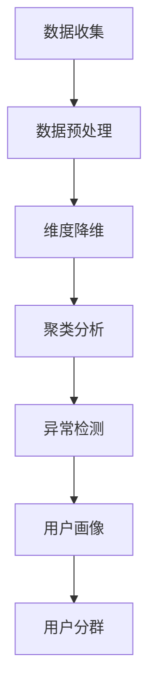

                 

# 如何进行有效的用户分群管理

## 1. 背景介绍

### 1.1 问题由来

在互联网、电商、社交媒体等数字化平台上，用户分群管理（User Segmentation）是至关重要的一环。合理的用户分群可以帮助企业更好地理解用户需求和行为，从而制定更为精准的市场策略和运营方案。然而，面对海量数据和多样化用户需求，如何高效、准确地进行用户分群，成为了当前各大企业面临的共同挑战。

### 1.2 问题核心关键点

用户分群管理的核心在于通过数据分析手段，将大量用户划分为具有相似特征的群体，每个群体具备一致的行为模式、需求偏好和消费倾向。通过建立用户画像，企业可以更精细化地进行个性化营销、产品推荐和客户服务。

用户分群通常需要考虑以下几个关键因素：
1. **用户行为**：包括点击率、购买行为、浏览记录、互动情况等，反映用户对产品或服务的兴趣和消费倾向。
2. **用户属性**：包括年龄、性别、职业、收入、地理位置等，反映用户的社会经济特征和消费能力。
3. **用户需求**：通过用户评论、评分、反馈等数据，了解用户对产品或服务的满意度、期望和痛点。

## 2. 核心概念与联系

### 2.1 核心概念概述

为了更好地理解用户分群管理的流程和技术，我们先介绍一些核心概念：

- **用户画像（User Profile）**：详细描述一个用户的行为、属性和需求的概貌，通常由多个维度的数据组成，如基本信息、消费行为、兴趣爱好等。
- **聚类分析（Clustering）**：一种无监督学习技术，将相似数据点划分为同一簇，用于发现数据中的隐藏模式和结构。
- **异常检测（Anomaly Detection）**：识别与正常数据不同的异常点，用于发现异常用户或行为，常与聚类分析结合使用。
- **维度降维（Dimensionality Reduction）**：通过降维算法，将高维数据转换为低维数据，便于处理和分析。
- **数据预处理（Data Preprocessing）**：包括数据清洗、归一化、特征选择等步骤，提高数据质量和分析效率。

这些核心概念相互联系，共同构成了用户分群管理的理论基础。聚类分析和异常检测技术用于发现用户间的相似性和差异性，而维度降维和数据预处理则用于优化数据分析过程。

### 2.2 核心概念原理和架构的 Mermaid 流程图



上述流程图展示了用户分群管理的核心流程：

1. **数据收集**：从不同的数据源收集用户行为、属性和需求的数据。
2. **数据预处理**：对原始数据进行清洗、归一化和特征选择，提高数据质量。
3. **维度降维**：使用PCA、t-SNE等降维算法，减少数据维度，便于后续分析。
4. **聚类分析**：通过K-means、层次聚类等聚类算法，将用户分为多个簇，每个簇代表一种用户群体。
5. **异常检测**：使用孤立森林、One-Class SVM等算法，识别出异常用户或行为。
6. **用户画像**：综合聚类和异常检测结果，建立详细的用户画像。
7. **用户分群**：根据用户画像，将用户划分为不同分群，提供个性化服务和策略。

## 3. 核心算法原理 & 具体操作步骤

### 3.1 算法原理概述

用户分群管理主要涉及无监督学习中的聚类算法和异常检测技术。下面分别介绍这两个关键算法。

### 3.2 算法步骤详解

#### 3.2.1 聚类分析

**步骤1：选择聚类算法**
- K-means算法：基于距离度量的聚类算法，适用于数据分布较为均匀的情况。
- 层次聚类算法：通过构建层次结构，自下而上或自上而下进行聚类。
- DBSCAN算法：基于密度的聚类算法，可以识别任意形状的聚类。

**步骤2：确定聚类数**
- 手肘法：通过绘制SSE与聚类数的关系图，找到最佳的聚类数。
- 轮廓系数法：计算样本的轮廓系数，选择轮廓系数最大的聚类数。
- 信息增益法：通过计算信息增益，选择最佳的聚类数。

**步骤3：进行聚类**
- 输入数据集，选择聚类算法和聚类数，执行聚类算法，得到聚类结果。

**步骤4：评估聚类结果**
- 计算聚类内平方误差（SSE）：衡量同一簇内样本的差异。
- 轮廓系数：衡量样本与其所属簇内样本的相似度。
- Silhouette系数：衡量簇内密度和簇间差异。

#### 3.2.2 异常检测

**步骤1：选择异常检测算法**
- 孤立森林（Isolation Forest）
- One-Class SVM
- 局部离群因子（LOF）

**步骤2：训练模型**
- 输入数据集，选择异常检测算法，训练异常检测模型。

**步骤3：检测异常**
- 输入新数据，使用训练好的异常检测模型，检测异常点。

**步骤4：评估异常检测结果**
- 计算F1分数、召回率、准确率等指标，评估异常检测模型的性能。

### 3.3 算法优缺点

**聚类分析的优缺点**：
- **优点**：
  - 适用于大规模数据集，能够发现数据中的隐藏模式和结构。
  - 算法实现简单，易于理解和实现。
  - 可以发现自然的分群结构，不需要预先定义簇的数量。
  
- **缺点**：
  - 对数据分布的假设较强，如K-means假设簇为球状或椭球状。
  - 聚类结果依赖于初始聚类中心的选择，可能导致局部最优解。
  - 无法直接解释聚类结果的含义。

**异常检测的优缺点**：
- **优点**：
  - 能够识别出与正常数据不同的异常点，发现潜在的问题和异常行为。
  - 算法鲁棒性较好，对数据分布的假设较少。
  
- **缺点**：
  - 异常点的定义可能主观性强，影响异常检测结果。
  - 对异常点的数量和分布敏感，可能会误报或漏报。
  - 计算复杂度较高，处理大规模数据时可能较慢。

### 3.4 算法应用领域

用户分群管理技术广泛应用于各个领域，例如：

- **电商零售**：通过用户分群，可以制定更精准的营销策略，提升销售转化率。
- **金融服务**：识别高风险用户，制定相应的风险控制措施。
- **社交媒体**：分析用户行为和兴趣，提升内容推荐和广告投放效果。
- **健康医疗**：通过用户分群，提供个性化的健康干预和疾病预防服务。
- **物流运输**：根据用户行为和地理位置，优化配送路线和调度方案。

这些应用场景展示了用户分群管理的广泛价值，助力企业在各领域提升运营效率和用户体验。

## 4. 数学模型和公式 & 详细讲解 & 举例说明

### 4.1 数学模型构建

用户分群管理主要涉及聚类分析和异常检测，下面分别介绍这两种算法的数学模型。

**聚类算法数学模型**：
- K-means算法：
$$
\text{minimize} \sum_{i=1}^{n} \sum_{j=1}^{k} ||x_i - \mu_j||^2
$$
其中，$x_i$ 为样本点，$\mu_j$ 为簇中心。

- 层次聚类算法：
$$
D(h_j, h_l) = \sum_{i \in h_j} \sum_{k \in h_l} d(x_i, x_k)
$$
其中，$h_j$ 和 $h_l$ 为两个簇，$d(x_i, x_k)$ 为样本点之间的距离。

**异常检测算法数学模型**：
- 孤立森林（Isolation Forest）：
$$
\text{IsolationScore}(x) = -\frac{g(x)}{\log_2 n}
$$
其中，$g(x)$ 为样本被隔离的平均路径长度。

- One-Class SVM：
$$
\text{minimize} \frac{1}{2} \|\omega\|^2 + C \sum_{i=1}^{n}\xi_i
$$
$$
\text{subject to} \begin{cases}
y_i (\omega^T \phi(x_i) + b) \geq 1 - \xi_i \\
\xi_i \geq 0
\end{cases}
$$
其中，$\omega$ 为超平面，$\xi_i$ 为松弛变量。

### 4.2 公式推导过程

**K-means算法推导**：
- 定义聚类中心：
$$
\mu_j = \frac{1}{|H_j|} \sum_{x_i \in H_j} x_i
$$
- 定义损失函数：
$$
J = \sum_{i=1}^{n} \sum_{j=1}^{k} ||x_i - \mu_j||^2
$$
- 迭代更新聚类中心：
$$
\mu_j \leftarrow \frac{1}{|H_j|} \sum_{x_i \in H_j} x_i
$$
重复以上步骤直至收敛。

**孤立森林推导**：
- 定义隔离路径长度：
$$
g(x) = \sum_{t=1}^{T} \text{IsolationTree}(x)
$$
- 定义隔离分数：
$$
\text{IsolationScore}(x) = -\frac{g(x)}{\log_2 n}
$$
其中，$T$ 为树的数量，$\log_2 n$ 为树的最大深度。

**One-Class SVM推导**：
- 定义拉格朗日乘子：
$$
\alpha_i = \begin{cases}
0 & y_i (\omega^T \phi(x_i) + b) \geq 1 \\
C (1 - y_i (\omega^T \phi(x_i) + b)) & y_i (\omega^T \phi(x_i) + b) < 1
\end{cases}
$$
- 定义拉格朗日函数：
$$
L(\alpha) = \frac{1}{2} \|\omega\|^2 + C \sum_{i=1}^{n} \alpha_i - \sum_{i=1}^{n} \alpha_i y_i (\omega^T \phi(x_i) + b)
$$
- 求解拉格朗日函数：
$$
\begin{cases}
\partial L(\alpha) / \partial \omega = 0 \\
\partial L(\alpha) / \partial b = 0 \\
0 \leq \alpha_i \leq C
\end{cases}
$$
解得超平面 $\omega$ 和偏移量 $b$。

### 4.3 案例分析与讲解

**案例1：电商用户分群管理**

假设某电商公司希望通过对用户行为数据进行分群管理，制定更精准的营销策略。

**数据集**：包含用户ID、购买记录、浏览记录、评分等数据。

**步骤1：数据预处理**
- 清洗数据，去除缺失值和异常值。
- 归一化数据，确保不同特征的数值尺度一致。
- 特征选择，选取对营销策略有影响的重要特征，如购买金额、浏览时长等。

**步骤2：维度降维**
- 使用PCA算法，将高维数据转换为低维数据。
- 选取前三个主成分，生成新的低维特征。

**步骤3：聚类分析**
- 使用K-means算法，将用户分为不同簇。
- 通过轮廓系数法，确定最佳的聚类数为5。

**步骤4：异常检测**
- 使用孤立森林算法，检测异常用户。
- 将异常用户从正常用户中排除，避免其影响聚类结果。

**步骤5：用户画像**
- 综合聚类和异常检测结果，生成详细的用户画像。
- 每个用户画像包括基本信息、购买行为、浏览偏好等。

**步骤6：用户分群**
- 根据用户画像，将用户分为高潜力用户、忠诚用户、流失用户等分群。
- 针对不同分群，制定不同的营销策略。

**案例2：金融风险管理**

假设某金融公司希望通过用户分群管理，识别高风险用户，进行风险控制。

**数据集**：包含用户ID、交易记录、账户余额、信用评分等数据。

**步骤1：数据预处理**
- 清洗数据，去除缺失值和异常值。
- 归一化数据，确保不同特征的数值尺度一致。
- 特征选择，选取对风险控制有影响的重要特征，如交易金额、账户余额等。

**步骤2：维度降维**
- 使用PCA算法，将高维数据转换为低维数据。
- 选取前三个主成分，生成新的低维特征。

**步骤3：聚类分析**
- 使用层次聚类算法，将用户分为不同簇。
- 通过轮廓系数法，确定最佳的聚类数为3。

**步骤4：异常检测**
- 使用One-Class SVM算法，检测异常用户。
- 将异常用户标记为高风险用户。

**步骤5：用户画像**
- 综合聚类和异常检测结果，生成详细的用户画像。
- 每个用户画像包括基本信息、交易行为、信用状况等。

**步骤6：用户分群**
- 根据用户画像，将用户分为高风险用户、低风险用户等分群。
- 针对不同分群，制定相应的风险控制措施。

## 5. 项目实践：代码实例和详细解释说明

### 5.1 开发环境搭建

在进行用户分群管理项目实践前，我们需要准备好开发环境。以下是使用Python进行项目开发的环境配置流程：

1. 安装Anaconda：从官网下载并安装Anaconda，用于创建独立的Python环境。

2. 创建并激活虚拟环境：
```bash
conda create -n user-segmentation python=3.8 
conda activate user-segmentation
```

3. 安装必要的Python库：
```bash
pip install numpy pandas scikit-learn scikit-cluster matplotlib seaborn
```

4. 安装必要的深度学习库：
```bash
pip install tensorflow tensorflow-hub keras
```

5. 安装必要的异常检测库：
```bash
pip install isolation-forest pyod
```

完成上述步骤后，即可在`user-segmentation`环境中开始项目实践。

### 5.2 源代码详细实现

我们先来看一个使用K-means算法进行聚类的示例代码。

```python
import numpy as np
from sklearn.cluster import KMeans

# 创建样本数据
X = np.random.rand(100, 2)

# 创建K-means模型
kmeans = KMeans(n_clusters=3, random_state=0)

# 训练模型
kmeans.fit(X)

# 输出聚类结果
print(kmeans.labels_)
```

### 5.3 代码解读与分析

**创建样本数据**：
- 使用`numpy`生成一个二维的随机数据集，包含100个样本和两个特征。

**创建K-means模型**：
- 使用`sklearn.cluster.KMeans`创建K-means模型，设置簇的数量为3，随机状态为0。

**训练模型**：
- 使用`fit`方法训练模型，将数据集`X`作为输入，输出聚类结果。

**输出聚类结果**：
- 通过`labels_`属性，输出每个样本所属的簇编号。

可以看到，使用K-means算法进行聚类非常简单，只需要几行代码即可实现。接下来，我们可以将以上代码应用到实际项目中，处理用户行为数据，进行用户分群管理。

## 6. 实际应用场景

### 6.1 智能推荐系统

在智能推荐系统中，用户分群管理能够帮助推荐系统理解用户需求，提高推荐准确性和用户体验。

**应用流程**：
- 收集用户行为数据，如浏览记录、点击记录、评分等。
- 使用聚类算法，将用户分为不同簇，每个簇代表一种用户群体。
- 根据用户画像，推荐系统能够为每个用户群体生成个性化推荐列表。
- 根据用户行为变化，动态调整推荐策略，提升推荐效果。

### 6.2 个性化营销

通过用户分群管理，企业能够制定更为精准的营销策略，提升营销效果。

**应用流程**：
- 收集用户行为数据，如购买记录、浏览记录、互动情况等。
- 使用聚类算法，将用户分为不同簇，每个簇代表一种用户群体。
- 根据用户画像，制定个性化的营销方案，提升用户转化率。
- 实时监控用户反馈，动态调整营销策略，提高用户满意度。

### 6.3 风险控制

在金融、保险等高风险行业，用户分群管理能够帮助识别高风险用户，进行风险控制。

**应用流程**：
- 收集用户行为数据，如交易记录、账户余额、信用评分等。
- 使用异常检测算法，识别高风险用户。
- 根据用户画像，制定相应的风险控制措施，如提高风控等级、调整信用额度等。
- 实时监控用户行为，动态调整风控策略，防范风险事件。

## 7. 工具和资源推荐

### 7.1 学习资源推荐

为了帮助开发者系统掌握用户分群管理的理论基础和实践技巧，这里推荐一些优质的学习资源：

1. 《Python机器学习》：适合初学者和中级开发者，详细介绍了机器学习算法和实战案例。
2. 《数据挖掘导论》：由数据科学领域权威学者撰写，系统介绍了数据挖掘的各个方面。
3. 《深度学习入门》：适合入门者学习，介绍了深度学习算法和框架。
4. 《推荐系统实战》：介绍了推荐系统的理论基础和实战应用。
5. 《Python数据分析实战》：适合数据分析师，介绍了Python数据分析的各个方面。

通过对这些资源的学习实践，相信你一定能够快速掌握用户分群管理的精髓，并用于解决实际的业务问题。

### 7.2 开发工具推荐

高效的开发离不开优秀的工具支持。以下是几款用于用户分群管理的常用工具：

1. Jupyter Notebook：交互式的数据分析和代码编写平台，适合进行数据预处理和模型训练。
2. Scikit-learn：开源机器学习库，提供了多种聚类和异常检测算法，易于使用。
3. TensorFlow：开源深度学习框架，支持分布式计算和模型部署。
4. PyTorch：开源深度学习框架，灵活的计算图和动态图设计。
5. Gephi：开源网络分析工具，支持可视化用户分群结果。

合理利用这些工具，可以显著提升用户分群管理的开发效率，加快创新迭代的步伐。

### 7.3 相关论文推荐

用户分群管理技术的发展源于学界的持续研究。以下是几篇奠基性的相关论文，推荐阅读：

1. K-means算法：
   - "K-means: Algorithms for vectors quantization" (Arthur & Vassilvitskii, 2007)
2. 异常检测：
   - "Isolation Forest" (Li et al., 2008)
   - "Local Outlier Factor: Novelty Detection Using Local Density Estimates" (Breunig et al., 2000)

这些论文代表了大规模聚类和异常检测技术的发展脉络。通过学习这些前沿成果，可以帮助研究者把握学科前进方向，激发更多的创新灵感。

## 8. 总结：未来发展趋势与挑战

### 8.1 总结

本文对用户分群管理的核心概念、算法原理和具体操作步骤进行了全面系统的介绍。首先阐述了用户分群管理的背景和意义，明确了其对于企业运营和市场策略制定的重要性。其次，从理论到实践，详细讲解了聚类和异常检测算法的数学模型和实现步骤，给出了完整的代码实例。同时，本文还探讨了用户分群管理在智能推荐、个性化营销、风险控制等多个行业领域的应用前景，展示了其广阔的业务价值。

通过本文的系统梳理，可以看到，用户分群管理技术正在成为企业数字化运营的重要工具，助力企业在各领域提升运营效率和用户体验。未来，伴随技术的发展和应用的推广，用户分群管理必将在更多行业得到应用，为各行各业带来新的业务机遇。

### 8.2 未来发展趋势

展望未来，用户分群管理技术将呈现以下几个发展趋势：

1. **自动化程度提升**：通过深度学习技术，实现自动化聚类和异常检测，减少人工干预，提高效率。
2. **多模态融合**：结合文本、图像、语音等多模态数据，进行更全面的用户画像构建和分群管理。
3. **实时化处理**：通过流式计算和在线学习，实现用户分群管理的实时处理和动态调整。
4. **联邦学习**：在保证用户隐私的前提下，实现跨机构、跨平台的用户数据融合和分群管理。
5. **解释性增强**：通过可解释性模型和工具，增强聚类和异常检测结果的可理解性和可解释性。

这些趋势凸显了用户分群管理技术的不断进步，将进一步提升企业在数字化运营中的能力和效率。

### 8.3 面临的挑战

尽管用户分群管理技术已经取得了显著进展，但在迈向更加智能化、普适化应用的过程中，仍面临诸多挑战：

1. **数据隐私和安全**：用户数据的收集、存储和使用需要遵守相关法律法规，确保数据隐私和安全。
2. **数据质量和完整性**：数据质量问题会影响聚类和异常检测的结果，需要采用数据清洗和数据补全等技术进行改进。
3. **算法鲁棒性和可解释性**：聚类和异常检测算法可能存在一定的鲁棒性问题和解释性不足，需要进行优化和改进。
4. **计算资源和时间成本**：大规模用户分群管理需要大量计算资源和时间成本，需要优化算法和硬件设备。
5. **跨领域应用难度**：不同领域的数据特点和用户需求不同，用户分群管理技术需要适应特定领域的特点和需求。

正视用户分群管理面临的这些挑战，积极应对并寻求突破，将是大规模用户分群管理走向成熟的必由之路。相信随着学界和产业界的共同努力，这些挑战终将一一被克服，用户分群管理技术必将在构建数字化运营体系中扮演越来越重要的角色。

### 8.4 研究展望

面向未来，用户分群管理技术需要在以下几个方面寻求新的突破：

1. **自动化聚类**：利用深度学习技术，实现自动化的聚类过程，提高效率和准确性。
2. **多模态融合**：结合文本、图像、语音等多模态数据，进行更全面的用户画像构建和分群管理。
3. **实时处理**：通过流式计算和在线学习，实现用户分群管理的实时处理和动态调整。
4. **跨领域应用**：针对不同领域的数据特点和用户需求，优化和改进用户分群管理技术，提高普适性和灵活性。
5. **解释性增强**：通过可解释性模型和工具，增强聚类和异常检测结果的可理解性和可解释性。

这些研究方向的探索，必将引领用户分群管理技术迈向更高的台阶，为构建数字化运营体系和提升用户满意度提供有力支持。

## 9. 附录：常见问题与解答

**Q1：用户分群管理的核心技术是什么？**

A: 用户分群管理的核心技术主要包括聚类分析和异常检测。聚类分析通过将相似数据点划分为同一簇，识别出数据中的隐藏模式和结构；异常检测通过识别与正常数据不同的异常点，发现潜在的问题和异常行为。

**Q2：用户分群管理的数据预处理有哪些步骤？**

A: 用户分群管理的数据预处理通常包括以下步骤：
1. 数据清洗：去除缺失值和异常值。
2. 数据归一化：确保不同特征的数值尺度一致。
3. 特征选择：选取对业务有影响的重要特征。
4. 维度降维：使用PCA、t-SNE等降维算法，减少数据维度，便于后续分析。

**Q3：用户分群管理中常用的聚类算法有哪些？**

A: 用户分群管理中常用的聚类算法包括：
1. K-means算法：基于距离度量的聚类算法。
2. 层次聚类算法：通过构建层次结构，自下而上或自上而下进行聚类。
3. DBSCAN算法：基于密度的聚类算法。

**Q4：用户分群管理的异常检测算法有哪些？**

A: 用户分群管理的异常检测算法包括：
1. 孤立森林（Isolation Forest）：基于树的异常检测算法。
2. One-Class SVM：基于支持向量机的异常检测算法。
3. 局部离群因子（LOF）：基于密度的异常检测算法。

**Q5：用户分群管理在电商推荐系统中的应用流程是什么？**

A: 用户分群管理在电商推荐系统中的应用流程通常包括以下步骤：
1. 收集用户行为数据，如浏览记录、点击记录、评分等。
2. 使用聚类算法，将用户分为不同簇，每个簇代表一种用户群体。
3. 根据用户画像，推荐系统能够为每个用户群体生成个性化推荐列表。
4. 根据用户行为变化，动态调整推荐策略，提升推荐效果。

---

作者：禅与计算机程序设计艺术 / Zen and the Art of Computer Programming

