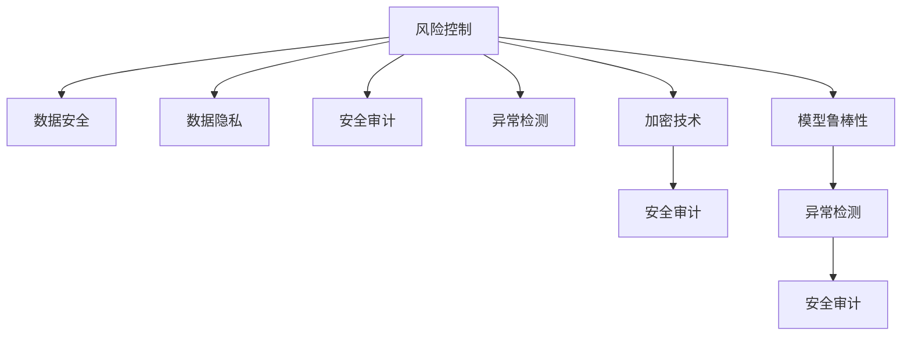

                 

# 如何进行风险控制：如何规避风险和降低损失？

> 关键词：风险控制, 金融风险, 数据安全, 数据隐私, 安全审计, 模型鲁棒性

## 1. 背景介绍

### 1.1 问题由来

随着信息技术的快速发展，数据的价值不断提升，数据泄露、欺诈行为、网络攻击等风险事件频发，给企业和个人带来了巨大的损失。风险控制已经成为当今信息化时代一个不可忽视的重要议题。

### 1.2 问题核心关键点

风险控制的核心在于建立一套完整的、系统的风险管理体系，涵盖数据安全、数据隐私、安全审计等多个层面。而技术层面的风险控制，则主要依赖于先进的算法和工具，如异常检测、加密技术、安全审计等。这些技术的合理应用，可以有效规避风险和降低损失。

### 1.3 问题研究意义

风险控制技术的研究和应用，对于保护企业数据安全、维护用户隐私、防范网络攻击具有重要意义：

1. 保护企业数据安全。通过先进的算法和工具，企业可以有效识别和防止数据泄露、篡改、篡改等风险事件，保障企业资产安全。
2. 维护用户隐私。通过加密技术和隐私保护算法，企业可以有效保护用户的个人信息，避免信息被滥用或泄露。
3. 防范网络攻击。通过异常检测和安全审计技术，企业可以有效识别和应对网络攻击，保障系统的安全稳定运行。

## 2. 核心概念与联系

### 2.1 核心概念概述

为更好地理解风险控制技术，本节将介绍几个密切相关的核心概念：

- 风险控制(Risk Control)：通过建立有效的风险管理体系，防范和控制各类风险事件的发生，保障信息系统的安全稳定运行。
- 数据安全(Data Security)：指保护数据在传输、存储和处理过程中的安全性和完整性，避免数据被篡改、窃取或泄露。
- 数据隐私(Data Privacy)：指在数据处理过程中，保护用户的个人隐私信息，防止其被滥用或泄露。
- 安全审计(Security Audit)：指对信息系统进行全面的安全检查和评估，发现和修复安全漏洞。
- 异常检测(Anomaly Detection)：指通过算法模型识别出数据中的异常行为或事件，用于防范网络攻击、数据泄露等风险。
- 加密技术(Encryption)：指通过算法将数据加密处理，保障数据在传输和存储过程中的安全性。
- 安全审计(Audit Trail)：指记录和追踪信息系统中的操作行为，发现和防范潜在的安全风险。
- 模型鲁棒性(Robustness of Model)：指模型在面对各种异常和噪声数据时的稳定性和可靠性，避免因数据异常导致模型失效。

这些核心概念之间的逻辑关系可以通过以下Mermaid流程图来展示：



这个流程图展示了这个体系中各个核心概念的关联关系：

1. 风险控制是整个体系的核心目标。
2. 数据安全和数据隐私是风险控制的基础，保障数据的完整性和隐私性。
3. 安全审计是风险控制的保障措施，发现和修复潜在的安全漏洞。
4. 异常检测和加密技术是数据安全和数据隐私的具体实现手段。
5. 模型鲁棒性是保证风险控制技术有效性的关键因素。

## 3. 核心算法原理 & 具体操作步骤

### 3.1 算法原理概述

风险控制技术可以分为数据安全、数据隐私、异常检测和模型鲁棒性等多个方面。本节将分别介绍这些核心技术的算法原理和操作步骤。

### 3.2 算法步骤详解

#### 3.2.1 数据安全

数据安全的实现依赖于加密技术和访问控制技术。加密技术可以将数据转化为密文，防止数据在传输和存储过程中被窃取或篡改。访问控制技术则通过身份验证和权限管理，保障数据仅对授权用户可见。

- **加密算法**：常见的加密算法包括对称加密(如AES)、非对称加密(如RSA)、哈希函数(如MD5、SHA-256)等。
- **访问控制**：基于角色的访问控制(RBAC)和基于属性的访问控制(ABAC)是常用的访问控制技术。

#### 3.2.2 数据隐私

数据隐私保护通常采用差分隐私、同态加密、多方安全计算等技术。差分隐私通过对数据添加噪声，确保单个数据样本对最终结果的影响微乎其微，从而保护用户隐私。同态加密可以在密文上直接进行计算，防止数据在处理过程中的泄露。多方安全计算则允许多方在不共享数据的前提下，协同完成计算任务，保护数据隐私。

- **差分隐私**：通过在查询结果中添加噪声，确保单个数据对结果的影响极小。
- **同态加密**：允许在密文上直接进行计算，保护数据隐私。
- **多方安全计算**：允许多方在不共享数据的前提下，协同完成计算任务。

#### 3.2.3 异常检测

异常检测依赖于机器学习、深度学习和时序分析等技术。通过建立异常检测模型，识别出数据中的异常行为或事件，用于防范网络攻击、数据泄露等风险。

- **机器学习**：通过分类、聚类、回归等算法，识别出数据中的异常行为。
- **深度学习**：通过神经网络模型，对数据进行更深入的特征学习和模式识别。
- **时序分析**：通过对时间序列数据进行分析，识别出异常行为或事件。

#### 3.2.4 模型鲁棒性

模型鲁棒性指的是模型在面对各种异常和噪声数据时的稳定性和可靠性。通过加入正则化、Dropout、对抗训练等技术，可以提高模型的鲁棒性。

- **正则化**：通过L1、L2正则化，防止模型过拟合，提高模型的泛化能力。
- **Dropout**：通过在神经网络中随机丢弃部分神经元，防止模型对某一输入的过度依赖。
- **对抗训练**：通过加入对抗样本，训练模型对异常数据具有鲁棒性。

### 3.3 算法优缺点

风险控制技术的优点在于：

1. 通过技术手段，可以有效防范和控制各类风险事件，保障信息系统的安全稳定运行。
2. 加密技术和访问控制技术可以保障数据在传输和存储过程中的安全性。
3. 差分隐私、同态加密、多方安全计算等技术可以有效保护用户隐私。
4. 异常检测和模型鲁棒性技术可以识别和防范数据异常和攻击，保障系统的稳定性和可靠性。

但这些技术也存在一些局限性：

1. 加密技术的性能开销较大，影响系统处理速度。
2. 差分隐私和同态加密等技术在实现复杂度上较高，实现难度较大。
3. 异常检测和模型鲁棒性技术的准确率受限于数据质量和模型选择，需要不断优化。

尽管存在这些局限性，但风险控制技术仍是大数据时代保障信息安全的重要手段。未来研究的方向在于如何进一步降低技术实现的复杂度，提升系统的处理速度和准确率，同时确保系统的安全性和隐私保护。

### 3.4 算法应用领域

风险控制技术在金融、医疗、政府等多个领域得到了广泛应用，具体如下：

- **金融领域**：通过加密技术和访问控制技术，保护金融数据的安全性和隐私性。通过异常检测和模型鲁棒性技术，防范金融欺诈和网络攻击。
- **医疗领域**：通过差分隐私和同态加密技术，保护医疗数据的隐私性。通过异常检测和模型鲁棒性技术，保障医疗数据的准确性和可靠性。
- **政府领域**：通过加密技术和访问控制技术，保护政府数据的隐私和安全。通过异常检测和模型鲁棒性技术，防范政府数据泄露和网络攻击。

## 4. 数学模型和公式 & 详细讲解 & 举例说明

### 4.1 数学模型构建

本节将使用数学语言对风险控制技术进行更加严格的刻画。

记待保护的数据集为 $D=\{x_1, x_2, ..., x_n\}$，其中 $x_i \in \mathbb{R}^d$ 为第 $i$ 个样本的特征向量。记数据的敏感属性为 $s_i \in \mathbb{R}$。

定义数据的隐私损失函数为 $\mathcal{L}(\epsilon)$，其中 $\epsilon$ 为隐私保护参数，表示在隐私保护条件下，数据的敏感属性 $s_i$ 对最终结果的影响。

### 4.2 公式推导过程

以差分隐私为例，通过在查询结果中添加噪声，确保单个数据样本对最终结果的影响极小。差分隐私的隐私损失函数为：

$$
\mathcal{L}(\epsilon) = \max_{s \neq s'} \frac{1}{n} \sum_{i=1}^n \frac{1}{2\epsilon} \lVert s_i - s'_i \rVert_2
$$

其中 $\lVert \cdot \rVert_2$ 为欧式范数，$n$ 为样本数量，$\epsilon$ 为隐私保护参数。

对于数据查询函数 $f$，差分隐私的实现过程如下：

1. 对查询结果进行概率分布的噪声化，得到新的查询结果 $f_\epsilon(x)$。
2. 对噪声化后的查询结果进行采样，得到最终的查询结果 $y$。

差分隐私的详细推导过程可以参考《差分隐私：概念与算法》等书籍，这里不再赘述。

## 5. 项目实践：代码实例和详细解释说明

### 5.1 开发环境搭建

在进行风险控制项目实践前，我们需要准备好开发环境。以下是使用Python进行开发的环境配置流程：

1. 安装Anaconda：从官网下载并安装Anaconda，用于创建独立的Python环境。

2. 创建并激活虚拟环境：
```bash
conda create -n risk_control_env python=3.8 
conda activate risk_control_env
```

3. 安装Python库：
```bash
pip install numpy pandas scikit-learn torch
```

4. 安装深度学习库：
```bash
pip install tensorflow keras
```

完成上述步骤后，即可在`risk_control_env`环境中开始项目实践。

### 5.2 源代码详细实现

这里以差分隐私为例，实现一个简单的差分隐私保护程序。

```python
import numpy as np
import pandas as pd

def laplace_noise(sensitive_data, noise_multiplier=1.0, epsilon=1.0):
    """
    添加拉普拉斯噪声，实现差分隐私
    :param sensitive_data: 敏感数据，可以是列表或数组
    :param noise_multiplier: 噪声强度
    :param epsilon: 隐私保护参数
    :return: 添加了噪声的敏感数据
    """
    assert noise_multiplier > 0, "noise_multiplier should be greater than 0"
    assert epsilon > 0, "epsilon should be greater than 0"
    
    data = np.array(sensitive_data)
    delta = 2.0 / epsilon
    noise = np.random.laplace(scale=2.0, size=len(data)) / noise_multiplier
    return data + noise

# 示例数据
sensitive_data = [10, 20, 30, 40, 50]

# 差分隐私保护
noisy_data = laplace_noise(sensitive_data, noise_multiplier=1.0, epsilon=1.0)
print(noisy_data)
```

### 5.3 代码解读与分析

以上代码实现了一个简单的差分隐私保护程序，详细解读如下：

**laplace_noise函数**：
- 定义了添加拉普拉斯噪声的函数，实现差分隐私保护。
- 函数接受三个参数：敏感数据、噪声强度和隐私保护参数。
- 首先计算噪声量，再随机生成拉普拉斯噪声并加到敏感数据上，返回添加了噪声的敏感数据。

**示例数据**：
- 定义了一个示例敏感数据列表，表示数据的敏感属性。

**差分隐私保护**：
- 调用laplace_noise函数，对敏感数据进行差分隐私保护。
- 设置噪声强度为1.0，隐私保护参数为1.0，表示在保护隐私的同时，保证数据的准确性。
- 输出添加了噪声的敏感数据。

可以看出，差分隐私保护虽然实现了隐私保护，但也引入了一定的噪声，影响了数据的准确性。如何在隐私保护和数据准确性之间取得平衡，需要根据具体场景进行优化。

## 6. 实际应用场景

### 6.1 金融领域

在金融领域，风险控制技术主要应用于数据加密、访问控制、异常检测等方面。例如：

- **数据加密**：通过对称加密、非对称加密等技术，保障金融数据的传输和存储安全。
- **访问控制**：通过RBAC、ABAC等技术，保障金融数据的访问权限。
- **异常检测**：通过机器学习和深度学习技术，识别出金融欺诈和网络攻击行为。

### 6.2 医疗领域

在医疗领域，风险控制技术主要应用于数据隐私保护、数据安全等方面。例如：

- **数据隐私保护**：通过差分隐私和同态加密技术，保障医疗数据的隐私性。
- **数据安全**：通过加密技术和访问控制技术，保障医疗数据的安全性和完整性。

### 6.3 政府领域

在政府领域，风险控制技术主要应用于数据加密、访问控制、异常检测等方面。例如：

- **数据加密**：通过对称加密、非对称加密等技术，保障政府数据的传输和存储安全。
- **访问控制**：通过RBAC、ABAC等技术，保障政府数据的访问权限。
- **异常检测**：通过机器学习和深度学习技术，防范政府数据泄露和网络攻击行为。

## 7. 工具和资源推荐

### 7.1 学习资源推荐

为了帮助开发者系统掌握风险控制技术，这里推荐一些优质的学习资源：

1. 《密码学原理与实践》：讲解了对称加密、非对称加密、哈希函数等密码学基础技术。
2. 《差分隐私：概念与算法》：介绍了差分隐私的理论基础和实现方法。
3. 《机器学习实战》：讲解了机器学习的基本概念和常用算法，包括分类、聚类、回归等。
4. 《深度学习》：讲解了深度学习的基本概念和常用模型，包括神经网络、卷积神经网络、循环神经网络等。
5. 《安全审计：技术与管理》：介绍了安全审计的基本概念和实现方法。

通过这些资源的学习实践，相信你一定能够快速掌握风险控制技术的精髓，并用于解决实际的业务问题。

### 7.2 开发工具推荐

高效的开发离不开优秀的工具支持。以下是几款用于风险控制开发的常用工具：

1. Python：强大的编程语言，适用于数据分析、机器学习和深度学习等任务。
2. TensorFlow：由Google主导开发的开源深度学习框架，支持多种模型训练和优化。
3. PyTorch：由Facebook主导开发的开源深度学习框架，灵活易用。
4. Anaconda：用于创建和管理Python虚拟环境，方便不同项目间的代码隔离。
5. Jupyter Notebook：免费的交互式编程环境，支持多种编程语言和数据处理库。
6. Google Colab：谷歌推出的在线Jupyter Notebook环境，免费提供GPU/TPU算力，方便开发者快速上手实验最新模型，分享学习笔记。

合理利用这些工具，可以显著提升风险控制任务的开发效率，加快创新迭代的步伐。

### 7.3 相关论文推荐

风险控制技术的发展源于学界的持续研究。以下是几篇奠基性的相关论文，推荐阅读：

1. "A Framework of Data Privacy-Preserving Machine Learning"：介绍了数据隐私保护的基本概念和实现方法。
2. "Differential Privacy: An Introduction"：介绍了差分隐私的理论基础和实现方法。
3. "Adversarial Examples for Deep Neural Networks"：介绍了对抗训练的基本概念和实现方法。
4. "A Survey on Anomaly Detection in Network Intrusion Detection Systems"：介绍了网络入侵检测系统的异常检测方法。
5. "Secure Multi-party Computation: Survey of Current Status and Future Directions"：介绍了多方安全计算的基本概念和实现方法。

这些论文代表了大数据时代风险控制技术的发展脉络。通过学习这些前沿成果，可以帮助研究者把握学科前进方向，激发更多的创新灵感。

## 8. 总结：未来发展趋势与挑战

### 8.1 总结

本文对风险控制技术进行了全面系统的介绍。首先阐述了风险控制技术的研究背景和意义，明确了风险控制在保障数据安全和隐私保护方面的重要价值。其次，从原理到实践，详细讲解了风险控制技术的算法原理和操作步骤，给出了风险控制任务开发的完整代码实例。同时，本文还广泛探讨了风险控制技术在金融、医疗、政府等多个领域的应用前景，展示了风险控制技术的广阔前景。最后，本文精选了风险控制技术的各类学习资源，力求为读者提供全方位的技术指引。

通过本文的系统梳理，可以看到，风险控制技术在保障数据安全和隐私保护方面具有重要作用，技术层面提供了多种有效的实现手段。未来，伴随技术的不断进步和应用场景的不断拓展，风险控制技术必将在保障信息安全方面发挥更大的作用。

### 8.2 未来发展趋势

展望未来，风险控制技术的发展呈现以下几个趋势：

1. 隐私保护技术将更加成熟。差分隐私、同态加密、多方安全计算等技术将逐步完善，隐私保护效果将得到显著提升。
2. 异常检测技术将更加精准。机器学习和深度学习等技术将进一步提升异常检测的准确率，降低误报率。
3. 模型鲁棒性将进一步提升。正则化、Dropout、对抗训练等技术将进一步提升模型的鲁棒性，提高系统的稳定性。
4. 安全审计技术将更加完善。自动化安全审计工具将逐步普及，发现和修复安全漏洞的效率将得到提升。
5. 风险控制技术将更加多样化。基于区块链、多方计算等新兴技术，风险控制技术将更加灵活多样。

以上趋势凸显了风险控制技术的广阔前景。这些方向的探索发展，必将进一步提升风险控制技术的效果，保障信息系统的安全稳定运行。

### 8.3 面临的挑战

尽管风险控制技术已经取得了显著进展，但在实际应用中仍面临诸多挑战：

1. 隐私保护技术的实现复杂度高。差分隐私和同态加密等技术在实现上较为复杂，难度较大。
2. 异常检测技术的准确率受限于数据质量和模型选择，需要不断优化。
3. 模型鲁棒性受限于数据分布和噪声，需要更多的数据和模型选择。
4. 安全审计技术的自动化程度较低，需要更多人工参与。
5. 风险控制技术的综合应用难度较大，需要更多跨学科的协作。

尽管存在这些挑战，但风险控制技术仍然是大数据时代保障信息安全的重要手段。未来研究的方向在于如何进一步降低技术实现的复杂度，提升系统的处理速度和准确率，同时确保系统的安全性和隐私保护。

### 8.4 研究展望

面对风险控制技术面临的挑战，未来的研究需要在以下几个方面寻求新的突破：

1. 探索无监督和半监督风险控制方法。摆脱对大量标注数据的依赖，利用自监督学习、主动学习等无监督和半监督范式，最大限度利用非结构化数据，实现更加灵活高效的隐私保护。
2. 研究参数高效和计算高效的异常检测方法。开发更加参数高效和计算高效的异常检测模型，在固定大部分预训练参数的同时，只更新极少量的任务相关参数。
3. 融合因果和对比学习范式。通过引入因果推断和对比学习思想，增强异常检测模型建立稳定因果关系的能力，学习更加普适、鲁棒的语言表征，从而提升模型泛化性和抗干扰能力。
4. 引入更多先验知识。将符号化的先验知识，如知识图谱、逻辑规则等，与神经网络模型进行巧妙融合，引导风险控制过程学习更准确、合理的语言模型。同时加强不同模态数据的整合，实现视觉、语音等多模态信息与文本信息的协同建模。
5. 结合因果分析和博弈论工具。将因果分析方法引入风险控制模型，识别出模型决策的关键特征，增强输出解释的因果性和逻辑性。借助博弈论工具刻画人机交互过程，主动探索并规避模型的脆弱点，提高系统稳定性。
6. 纳入伦理道德约束。在模型训练目标中引入伦理导向的评估指标，过滤和惩罚有偏见、有害的输出倾向。同时加强人工干预和审核，建立模型行为的监管机制，确保输出符合人类价值观和伦理道德。

这些研究方向的探索，必将引领风险控制技术迈向更高的台阶，为构建安全、可靠、可解释、可控的智能系统铺平道路。面向未来，风险控制技术还需要与其他人工智能技术进行更深入的融合，如知识表示、因果推理、强化学习等，多路径协同发力，共同推动风险控制技术的进步。只有勇于创新、敢于突破，才能不断拓展风险控制技术的边界，让智能技术更好地造福人类社会。

## 9. 附录：常见问题与解答

**Q1：如何进行风险控制？**

A: 风险控制通常包括以下几个关键步骤：
1. 数据加密：通过加密算法对数据进行加密处理，防止数据泄露。
2. 访问控制：通过RBAC、ABAC等技术，保障数据访问权限。
3. 隐私保护：通过差分隐私、同态加密等技术，保障数据隐私。
4. 异常检测：通过机器学习和深度学习技术，识别数据中的异常行为。
5. 模型鲁棒性：通过正则化、Dropout、对抗训练等技术，提升模型的鲁棒性。
6. 安全审计：通过安全审计工具，发现和修复安全漏洞。

**Q2：如何实现差分隐私？**

A: 实现差分隐私的主要步骤包括：
1. 对查询结果进行概率分布的噪声化，得到新的查询结果。
2. 对噪声化后的查询结果进行采样，得到最终的查询结果。

具体实现可以参考差分隐私相关的库和框架，如TensorFlow Privacy、PyTorch Privacy等。

**Q3：如何防范网络攻击？**

A: 防范网络攻击通常包括以下几个关键步骤：
1. 入侵检测：通过入侵检测系统(IDS)实时监控网络流量，识别出异常行为。
2. 入侵防御：通过入侵防御系统(IPS)对攻击行为进行防御。
3. 安全审计：通过安全审计工具，发现和修复安全漏洞。

合理利用入侵检测和入侵防御技术，可以有效防范网络攻击。

**Q4：如何保障数据的完整性？**

A: 保障数据完整性通常包括：
1. 数据加密：通过对称加密、非对称加密等技术，防止数据泄露。
2. 访问控制：通过RBAC、ABAC等技术，保障数据访问权限。
3. 数据备份：通过数据备份技术，防止数据丢失或损坏。

通过以上措施，可以有效保障数据的完整性。

**Q5：如何提升模型的鲁棒性？**

A: 提升模型鲁棒性通常包括：
1. 正则化：通过L1、L2正则化，防止模型过拟合，提高模型的泛化能力。
2. Dropout：通过在神经网络中随机丢弃部分神经元，防止模型对某一输入的过度依赖。
3. 对抗训练：通过加入对抗样本，训练模型对异常数据具有鲁棒性。

通过以上措施，可以有效提升模型的鲁棒性，防止模型在面对异常数据时失效。

---

作者：禅与计算机程序设计艺术 / Zen and the Art of Computer Programming

