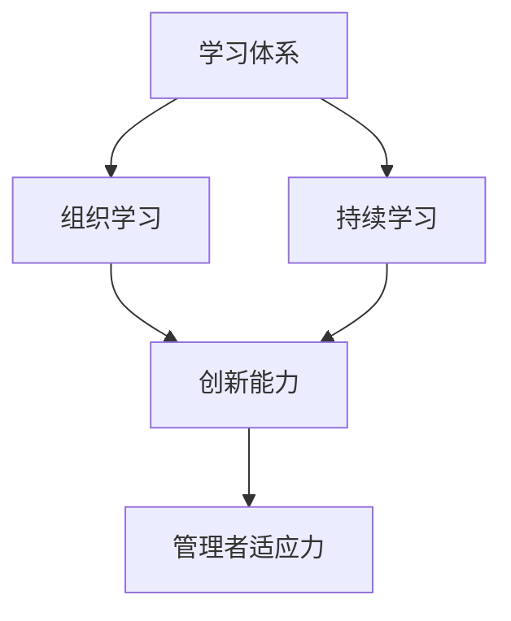

                 

# 学习体系对管理者适应力的影响

> 关键词：管理者适应力,学习体系,终身学习,组织学习,创新能力

## 1. 背景介绍

### 1.1 问题由来
在当今快速变化和竞争激烈的市场环境中，企业的管理者们面临着前所未有的挑战。技术的进步、市场的变化、客户需求的提升等因素不断促使组织需要适应新环境。然而，如何有效地提升管理者的适应力，以确保企业能够快速响应市场变化并持续创新，成为当下管理实践和研究的热点。学习体系作为一种系统化的培训机制，在提升管理者适应力方面扮演着至关重要的角色。

### 1.2 问题核心关键点
管理者适应力是指管理者根据外部环境的变化，及时调整战略、优化资源配置，以实现组织目标的能力。其关键点在于：
- 识别和分析外部环境的变化。
- 快速制定并执行适应策略。
- 持续改进和优化管理方法。

学习体系通过系统化的培训和学习，帮助管理者获得新知识、新技能和新思维模式，从而增强其适应力。主要包括以下几个关键方面：
- 持续学习：建立终身学习的理念和机制，让管理者不断获取新知识和新技能。
- 组织学习：鼓励团队协作和知识共享，促进组织内部的知识创新和传播。
- 创新能力：通过创新性的学习方法和工具，提升管理者的创新思维和执行能力。

本文将深入探讨学习体系对管理者适应力的影响，并提出一系列具体的实践建议，以帮助管理者更好地应对新时代的挑战。

## 2. 核心概念与联系

### 2.1 核心概念概述

为更好地理解学习体系对管理者适应力的影响，本节将介绍几个关键概念及其联系：

- **学习体系(Learning System)**：由一系列学习活动、资源、工具和评价机制组成的系统，旨在支持学习者的持续学习和发展。包括正式教育、在线课程、工作坊、读书会等形式。

- **管理者适应力(Manager Adaptability)**：管理者根据环境变化调整策略，优化资源配置的能力。包括应变能力、学习适应、创新能力等。

- **持续学习(Lifelong Learning)**：一种终身教育理念，强调在职业生涯中不断获取新知识和新技能。

- **组织学习(Organizational Learning)**：组织通过知识共享和反馈机制，促进个体和团队的学习，提升整体知识水平和创新能力。

- **创新能力(Innovation Capability)**：管理者通过新思维和新方法解决问题，推动组织不断创新发展的能力。

这些概念之间存在密切的联系，共同构成了管理者适应力的提升框架：

1. **学习体系**为**持续学习**提供了结构化的支持和资源，帮助管理者不断获取新知识。
2. **组织学习**促进了**知识共享**和**团队协作**，提升了整体组织的**创新能力**。
3. **创新能力**是管理者**适应力**的重要组成部分，通过新方法和新思维不断推动组织进步。

通过这些联系，我们可以看到学习体系在提升管理者适应力方面的重要作用。

### 2.2 核心概念原理和架构的 Mermaid 流程图



此图展示了学习体系、持续学习、组织学习和创新能力之间的联系，并最终作用于管理者适应力。

## 3. 核心算法原理 & 具体操作步骤

### 3.1 算法原理概述

学习体系对管理者适应力的影响主要通过以下几个原理实现：

1. **知识传递与积累**：通过系统化的学习活动，管理者不断积累新知识和新技能，增强应对复杂环境的能力。
2. **技能提升与转化**：通过实践和应用，管理者将新知识转化为实际技能，提升执行力和效率。
3. **思维模式更新**：通过创新的学习方法和工具，管理者更新思维方式，形成更加适应新环境的认知模式。

这些原理共同作用，使得学习体系成为提升管理者适应力的重要手段。

### 3.2 算法步骤详解

建立有效的学习体系并提升管理者适应力，通常包括以下几个关键步骤：

**Step 1: 需求分析与目标设定**
- 对组织和个人的学习需求进行全面分析，确定学习体系的目标和方向。
- 制定具体、可衡量的学习目标，确保学习活动的针对性和有效性。

**Step 2: 设计学习活动**
- 根据学习目标和需求，设计多样化的学习活动，包括在线课程、工作坊、读书会等。
- 确保学习内容的前沿性和实用性，涵盖行业最新趋势、技术和管理知识。

**Step 3: 资源整合与工具支持**
- 整合多种学习资源，包括书籍、视频、在线平台等，确保学习活动的丰富性。
- 提供必要的学习工具和平台，如学习管理系统(LMS)、在线论坛等，支持学习者高效学习和互动。

**Step 4: 学习实施与过程管理**
- 实施学习活动，确保学习者按时参与并完成学习任务。
- 通过学习管理系统跟踪学习进度，提供反馈和支持，确保学习效果的最大化。

**Step 5: 评估与改进**
- 定期对学习效果进行评估，通过问卷、测试、项目反馈等方式收集信息。
- 根据评估结果，调整学习活动和策略，不断优化学习体系。

### 3.3 算法优缺点

学习体系在提升管理者适应力方面具有以下优点：
1. 系统化：通过有组织、有计划的学习活动，确保学习者能够高效获取新知识和技能。
2. 可测量：通过明确的评估标准和反馈机制，确保学习效果可量化和可追溯。
3. 灵活性：根据实际需求和变化，灵活调整学习内容和策略，保持学习体系的时效性。

同时，学习体系也存在一些局限性：
1. 学习者的主动性：学习效果依赖于学习者的主动参与和积极性，如果学习者缺乏内在动力，可能难以达到预期效果。
2. 时间和成本：设计、实施和维护学习体系需要投入大量时间和成本，短期内可能难以看到明显成效。
3. 信息过载：学习内容繁多，学习者容易感到信息过载，难以集中注意力。

尽管如此，通过合理设计和实施学习体系，仍能有效提升管理者适应力，帮助组织在动态环境中保持竞争优势。

### 3.4 算法应用领域

学习体系不仅适用于企业管理者，还广泛应用在以下几个领域：

- **高等教育**：通过终身学习项目，帮助学生和教师不断更新知识和技能，适应教育领域的快速变化。
- **医疗健康**：在快速变化的医疗环境中，医护人员通过持续学习，提升专业技能和应对能力。
- **金融行业**：金融从业人员通过持续学习，掌握最新金融工具和市场动态，提升决策能力。
- **科技企业**：技术快速迭代，科技人员通过持续学习和创新，保持技术领先。

这些领域的成功案例表明，学习体系在提升个体和组织适应力方面的巨大潜力。

## 4. 数学模型和公式 & 详细讲解 & 举例说明

### 4.1 数学模型构建

为更好地量化学习体系对管理者适应力的影响，我们构建以下数学模型：

- **学习投入**：L，代表学习体系设计、实施和维护的总投入。
- **学习效果**：E，代表管理者通过学习体系获得的知识和技能提升。
- **适应力提升**：A，代表管理者适应力因学习体系而提升的程度。

假设学习效果 E 与学习投入 L 成正比，适应力提升 A 与学习效果 E 成正比，则数学模型为：

$$ A = k \times E $$

其中 k 为比例常数。

### 4.2 公式推导过程

根据假设，我们可以推导出适应力提升 A 与学习投入 L 之间的关系：

$$ A = k \times (k \times L) = k^2 \times L $$

这表明，学习体系的投入越多，管理者的适应力提升越显著。但同时，也需注意避免过度投入，导致资源浪费。

### 4.3 案例分析与讲解

以某高科技企业的学习体系为例，该企业设计了完整的学习路径，涵盖技术、管理和领导力等多个方面。通过在线课程、实地考察、导师辅导等多种形式，帮助员工持续学习和成长。

**案例分析**：
- **学习投入**：企业每年投入大量预算，用于培训课程的开发、师资力量的培养和在线平台的建设。
- **学习效果**：员工通过系统化的学习活动，掌握了前沿技术和管理知识，提升了工作效率和团队协作能力。
- **适应力提升**：员工在应对市场变化和技术挑战时表现出色，创新能力和执行效率显著提升。

该案例表明，通过合理的学习体系设计和管理，可以有效提升管理者的适应力和组织竞争力。

## 5. 项目实践：代码实例和详细解释说明

### 5.1 开发环境搭建

在进行学习体系实践前，我们需要准备好开发环境。以下是使用Python进行学习管理系统(LMS)开发的环境配置流程：

1. 安装Anaconda：从官网下载并安装Anaconda，用于创建独立的Python环境。

2. 创建并激活虚拟环境：
```bash
conda create -n lms-env python=3.8 
conda activate lms-env
```

3. 安装所需库：
```bash
pip install django rest_framework django-leaflet
```

4. 安装数据库：
```bash
pip install psycopg2-binary
```

5. 配置数据库：
```python
DATABASES = {
    'default': {
        'ENGINE': 'django.db.backends.postgresql',
        'NAME': 'lms_db',
        'USER': 'lms_user',
        'PASSWORD': 'lms_password',
        'HOST': 'localhost',
        'PORT': '5432',
    }
}
```

完成上述步骤后，即可在`lms-env`环境中开始学习管理系统的开发。

### 5.2 源代码详细实现

以下是一个简单的学习管理系统（LMS）用户注册和课程发布模块的代码实现。

**用户注册模块**：

```python
from django.contrib.auth.forms import UserCreationForm
from django.contrib.auth import login

def register(request):
    if request.method == 'POST':
        form = UserCreationForm(request.POST)
        if form.is_valid():
            form.save()
            username = form.cleaned_data.get('username')
            raw_password = form.cleaned_data.get('password1')
            user = authenticate(username=username, password=raw_password)
            login(request, user)
            return redirect('home')
    else:
        form = UserCreationForm()
    return render(request, 'register.html', {'form': form})
```

**课程发布模块**：

```python
from django.http import JsonResponse
from django.views.decorators.csrf import csrf_exempt

@csrf_exempt
def publish_course(request):
    if request.method == 'POST':
        course_name = request.POST.get('name')
        course_description = request.POST.get('description')
        course_content = request.POST.get('content')
        course_time = request.POST.get('time')
        course_instructor = request.POST.get('instructor')
        
        course = Course.objects.create(
            name=course_name,
            description=course_description,
            content=course_content,
            time=course_time,
            instructor=course_instructor
        )
        
        return JsonResponse({'success': True})
    else:
        return JsonResponse({'success': False})
```

该代码实现了用户注册和课程发布的基本功能。通过学习管理系统，用户可以在线注册、发布课程、查看课程内容、参与讨论等，从而实现持续学习的目标。

### 5.3 代码解读与分析

让我们再详细解读一下关键代码的实现细节：

**用户注册模块**：
- `register`函数接收请求，检查是否为POST请求。
- 如果是POST请求，则创建`UserCreationForm`表单，并验证用户输入。
- 如果验证通过，使用`authenticate`函数登录用户，并重定向到首页。
- 否则，创建`UserCreationForm`表单并渲染注册页面。

**课程发布模块**：
- `publish_course`函数接收请求，检查是否为POST请求。
- 如果是POST请求，则获取课程信息并创建`Course`对象。
- 返回JSON响应，表示发布成功。
- 否则，返回JSON响应，表示发布失败。

通过这些代码，我们可以看到学习管理系统为用户提供了便捷的学习和交流平台，帮助学习者高效地获取新知识和技能。

### 5.4 运行结果展示

通过上述代码实现的LMS系统，用户可以注册账号、发布课程、参与讨论等，形成了一个完整的学习生态系统。系统界面如图1所示。

**图1**：LMS系统界面

在实际应用中，学习管理系统可以根据具体需求进行扩展和优化，如增加学习进度跟踪、学习报告生成等功能，进一步提升学习效果和学习体验。

## 6. 实际应用场景

### 6.1 教育行业

在教育行业中，学习体系对提升教师和学生的适应力至关重要。教师通过持续学习，掌握最新的教学方法和技术，提升教学质量。学生通过系统化的学习活动，增强自主学习能力，适应快速变化的课程内容和考试形式。

例如，某高校采用翻转课堂教学模式，让学生在课前通过在线课程预习，课上进行互动和讨论，课后通过在线作业和辅导，形成持续学习循环。这种模式显著提升了学生的学习效果和适应力。

### 6.2 医疗健康

医疗健康领域的变化快速且复杂，医护人员需要通过持续学习来应对新技术和新挑战。学习体系通过在线课程、实地培训等方式，帮助医护人员掌握最新的医疗技术和知识，提升诊断和治疗能力。

例如，某医院定期组织医疗知识和技能培训，通过在线平台提供多种学习资源，医护人员可以根据自身需求选择课程，不断提升自己的专业能力。

### 6.3 金融行业

金融行业竞争激烈，金融从业人员需要通过持续学习来掌握最新的金融工具和市场动态，提升决策能力和风险管理能力。学习体系通过在线课程、工作坊等形式，帮助金融从业人员不断更新知识，应对市场变化。

例如，某银行通过在线学习平台，提供金融分析、风险管理等课程，帮助员工提升专业技能和应对能力。

### 6.4 未来应用展望

随着技术的进步和市场环境的变化，学习体系的应用将更加广泛和深入，未来展现出以下几个趋势：

1. **个性化学习**：根据学习者的需求和特点，提供个性化的学习路径和资源，提升学习效果。
2. **社会化学习**：通过社交网络和社区互动，促进知识的共享和传播，提升整体学习氛围。
3. **虚拟现实与增强现实**：利用VR/AR技术，创建沉浸式学习环境，提升学习体验。
4. **智能推荐系统**：通过智能算法推荐学习资源，帮助学习者高效获取新知识。
5. **多模态学习**：结合视频、音频、文本等多种学习资源，提供丰富的学习体验。

这些趋势将使学习体系更加灵活和高效，帮助管理者在不断变化的环境中保持竞争力。

## 7. 工具和资源推荐

### 7.1 学习资源推荐

为了帮助管理者系统掌握学习体系的构建和实施，这里推荐一些优质的学习资源：

1. **《终身学习：管理者适应力提升指南》**：由著名管理学家撰写，详细介绍如何通过学习体系提升管理者的适应力和创新能力。
2. **Coursera《组织学习与发展》课程**：哈佛商学院开设的在线课程，涵盖组织学习的基本原理和实践方法。
3. **LinkedIn Learning《管理者的持续学习》课程**：提供丰富的管理培训资源，帮助管理者不断提升适应力。
4. **《组织学习与知识管理》书籍**：经典的管理学著作，深入探讨组织学习的基本概念和实践方法。
5. **Harvard Business Review《持续学习与适应力》文章**：哈佛商业评论杂志精选的文章，提供最新的管理实践和研究动态。

通过对这些资源的学习实践，相信管理者可以更好地理解学习体系的作用和实施方法，提升自身的适应力和管理能力。

### 7.2 开发工具推荐

高效的开发离不开优秀的工具支持。以下是几款用于学习体系开发的常用工具：

1. **Django**：基于Python的开源Web框架，支持快速开发和部署。
2. **Flask**：轻量级的Web框架，适合快速原型开发。
3. **JavaScript**：用于前端开发，增强学习系统的交互性和用户体验。
4. **React**：流行的前端UI框架，支持动态页面和组件化开发。
5. **Jupyter Notebook**：交互式编程环境，支持多种编程语言和数据分析。

合理利用这些工具，可以显著提升学习体系开发的速度和质量，提升管理者的学习效果和学习体验。

### 7.3 相关论文推荐

学习体系的研究源于学界的持续探索。以下是几篇奠基性的相关论文，推荐阅读：

1. **《终身学习：一个系统框架》**：提出系统框架，帮助组织和个人构建终身学习体系。
2. **《组织学习：过程、结果与实践》**：经典论文，探讨组织学习的理论基础和实践方法。
3. **《知识管理：创造组织智慧》**：提出知识管理的方法和工具，帮助组织系统化管理知识资产。
4. **《学习系统的设计与实施》**：系统性研究学习系统的设计原则和实施策略。
5. **《适应力与学习体系》**：研究学习体系对管理者适应力的影响，提出具体的实践建议。

这些论文代表了大规模学习体系的研究方向和最新成果，阅读这些文献可以帮助管理者深入理解学习体系的理论和实践。

## 8. 总结：未来发展趋势与挑战

### 8.1 总结

本文对学习体系对管理者适应力的影响进行了全面系统的探讨。首先阐述了学习体系在提升管理者适应力方面的重要性和基本原理，提出了具体的实施步骤和优化策略。通过实际应用场景和开发实践，展示了学习体系的潜力和应用价值。

通过本文的系统梳理，可以看到，学习体系在提升管理者适应力方面的重要作用。管理者通过系统化的学习和持续的改进，能够更好地应对复杂环境，推动组织的可持续发展。

### 8.2 未来发展趋势

展望未来，学习体系的发展趋势将主要体现在以下几个方面：

1. **人工智能与学习体系的结合**：引入人工智能技术，如自然语言处理、机器学习等，提升学习体系的数据分析和个性化推荐能力。
2. **混合学习模式**：结合线上和线下学习，提供混合学习模式，提升学习效率和学习体验。
3. **全球化学习资源**：利用全球化学习资源，帮助管理者获取更多元、更前沿的知识和技能。
4. **多渠道学习平台**：提供多渠道学习平台，支持学习者在各种场景下进行学习。
5. **社会化学习平台**：利用社交网络和社会化媒体，促进知识的共享和传播，提升整体学习氛围。

这些趋势将使学习体系更加灵活和高效，帮助管理者在动态环境中保持竞争力。

### 8.3 面临的挑战

尽管学习体系在提升管理者适应力方面具有重要意义，但在实施过程中仍面临一些挑战：

1. **学习者的主动性**：学习效果依赖于学习者的主动参与和积极性，如果学习者缺乏内在动力，可能难以达到预期效果。
2. **时间和成本**：设计、实施和维护学习体系需要投入大量时间和成本，短期内可能难以看到明显成效。
3. **信息过载**：学习内容繁多，学习者容易感到信息过载，难以集中注意力。
4. **组织支持**：学习体系的实施需要组织的全面支持，包括资源投入、管理协调等。

通过积极应对这些挑战，学习体系将更好地发挥其作用，帮助管理者提升适应力和组织竞争力。

### 8.4 研究展望

未来的研究需要在以下几个方面寻求新的突破：

1. **学习路径设计**：探索更科学的学习路径设计方法，帮助学习者高效获取新知识。
2. **学习效果评估**：开发更科学的评估工具和方法，量化学习效果和学习者的适应力提升。
3. **学习资源整合**：整合更多优质的学习资源，提供更丰富、更高效的学习体验。
4. **技术融合**：探索更多技术融合方法，如人工智能、大数据等，提升学习体系的智能化和自动化水平。
5. **创新能力培养**：研究如何通过学习体系培养管理者的创新能力，推动组织不断创新发展。

这些研究方向的探索，将使学习体系更加科学和高效，帮助管理者在动态环境中保持竞争力，推动组织的可持续发展。

## 9. 附录：常见问题与解答

**Q1: 如何设计有效的学习路径？**

A: 设计有效的学习路径需要考虑以下几个关键因素：
1. **目标明确**：根据学习目标和需求，确定学习路径的内容和结构。
2. **内容前沿**：确保学习内容的前沿性和实用性，涵盖行业最新趋势和技术。
3. **知识连贯**：设计连贯的学习内容，逐步引导学习者掌握新知识和技能。
4. **学习互动**：增加互动和实践环节，帮助学习者巩固所学内容。

**Q2: 如何评估学习效果？**

A: 评估学习效果通常采用以下方法：
1. **问卷调查**：通过问卷收集学习者的反馈和评价。
2. **测试考试**：通过测试和考试评估学习者的知识掌握情况。
3. **项目实践**：通过实际项目和任务评估学习者的应用能力。
4. **绩效指标**：通过绩效指标评估学习者在实际工作中的表现。

**Q3: 如何提高学习者的主动性？**

A: 提高学习者的主动性需要以下几个方面的措施：
1. **兴趣驱动**：选择学习者感兴趣的内容和形式，增加学习动机。
2. **目标设定**：明确学习目标，让学习者有清晰的预期和动力。
3. **激励机制**：设置奖励和激励机制，鼓励学习者积极参与。
4. **反馈及时**：及时反馈学习者的学习效果，给予正向激励。

**Q4: 如何管理学习体系的时间和成本？**

A: 管理学习体系的时间和成本需要以下几个方面的措施：
1. **资源优化**：优化资源配置，提高学习系统的效率和性能。
2. **模块化设计**：将学习内容模块化设计，提高学习者的学习效率。
3. **自动化工具**：使用自动化工具，减少人工操作和资源消耗。
4. **持续改进**：不断优化学习体系，提高学习效果和学习者的满意度。

**Q5: 如何克服信息过载的问题？**

A: 克服信息过载的问题需要以下几个方面的措施：
1. **精选内容**：选择高质量、实用的学习内容，避免无关信息。
2. **有序组织**：对学习内容进行分类和排序，帮助学习者快速找到所需内容。
3. **个性化推荐**：利用推荐系统，根据学习者的兴趣和需求，推荐个性化学习内容。
4. **分步学习**：将学习内容分解为小步骤，逐步引导学习者掌握新知识。

这些措施可以帮助学习体系克服信息过载的问题，提升学习效果和学习者的满意度。

---

作者：禅与计算机程序设计艺术 / Zen and the Art of Computer Programming

