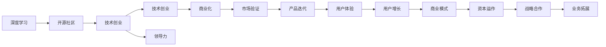

                 

# 学习做CEO：贾扬清在创业中成长适应领导角色

## 1. 背景介绍

贾扬清，深度学习领域的重要人物，也是机器学习开源社区的杰出贡献者。他从技术专家成功转型为CEO，成为字节跳动CTO，这一职业路径中的巨大跨越，不仅激励了无数科技从业者，也为我们提供了宝贵的职业成长启示。本文将深入探讨贾扬清的成长之路，分析他在创业和领导过程中积累的宝贵经验，以及如何将技术专长转化为商业成功。

## 2. 核心概念与联系

### 2.1 核心概念概述

- **深度学习**：基于神经网络的多层计算模型，能够处理复杂的数据模式，广泛应用于计算机视觉、自然语言处理等领域。
- **开源社区**：指由开发者共同贡献代码、文档和资源，以促进技术交流和共享的组织形式。
- **创业精神**：指在商业领域创新、开拓、冒险和勇于承担风险的精神。
- **领导力**：指引导、激励和协调团队达成共同目标的能力。
- **技术创业**：指以技术创新为核心的创业模式，强调技术的市场价值和商业转化。

### 2.2 核心概念原理和架构的 Mermaid 流程图



这个流程图展示了深度学习和技术创业、创业精神、领导力之间的联系。深度学习是技术创业的基础，而开源社区为技术创业提供了丰富的资源和支持。创业精神和领导力则是技术创业成功的关键，商业化、市场验证、产品迭代和用户体验是成功不可或缺的环节。

## 3. 核心算法原理 & 具体操作步骤

### 3.1 算法原理概述

贾扬清在技术创业和转型为CEO的过程中，运用了多种管理方法和领导技巧。这些方法虽然不像深度学习算法那样具有明确的数学模型，但同样具备系统性和科学性。以下将详细介绍其中的核心原理和操作步骤。

**3.1.1 系统化思维**  
在技术创业初期，贾扬清强调系统化思维的重要性。他认为，一个项目成功与否，取决于是否有一个系统化的规划和执行路径。他强调以下几点：  
- **目标设定**：明确项目的长期目标和短期目标，并将其分解为可执行的任务。  
- **资源管理**：合理分配人力、物力、财力等资源，确保项目的稳定运行。  
- **风险评估**：提前识别潜在风险，并制定应对策略。

**3.1.2 数据驱动决策**  
贾扬清非常注重数据在决策中的作用。他认为，数据可以提供客观的依据，帮助团队做出更加科学的决策。他提倡：  
- **数据收集**：通过市场调研、用户反馈等方式，收集和分析数据。  
- **数据可视化**：使用图表、仪表盘等工具，直观展示数据分析结果。  
- **数据驱动**：在制定战略、调整策略时，优先考虑数据支持的方案。

**3.1.3 迭代改进**  
技术创业是一个不断迭代的过程。贾扬清认为，团队需要不断试错，通过实验验证假设，改进产品和服务。他强调：  
- **快速原型**：使用最小可行产品（MVP），快速验证产品功能。  
- **用户反馈**：定期收集用户反馈，识别改进点。  
- **持续优化**：根据用户反馈和市场变化，不断优化产品和服务。

### 3.2 算法步骤详解

**3.2.1 市场调研和需求分析**  
在确定创业方向时，贾扬清进行了广泛的市场调研和需求分析。他采取以下步骤：  
- **市场规模评估**：研究目标市场的大小和增长潜力。  
- **竞争分析**：识别主要竞争对手和他们的优劣势。  
- **需求分析**：通过问卷调查、用户访谈等方式，了解用户需求和痛点。

**3.2.2 团队组建和角色分工**  
组建团队是创业成功的关键。贾扬清注重以下几点：  
- **招聘**：选择具有共同价值观和专业能力的团队成员。  
- **角色分配**：根据成员的优势，合理分配职责，确保高效协作。  
- **文化建设**：建立团队文化，增强凝聚力和归属感。

**3.2.3 产品开发和迭代**  
产品开发是创业的核心环节。贾扬清采用了以下步骤：  
- **产品规划**：确定产品的核心功能和用户需求。  
- **原型设计**：设计产品的原型，进行初步验证。  
- **测试优化**：根据用户反馈，不断测试和优化产品。

**3.2.4 市场推广和用户增长**  
产品开发完成后，贾扬清注重市场推广和用户增长。他采取以下步骤：  
- **市场推广**：制定营销策略，通过社交媒体、广告等方式推广产品。  
- **用户获取**：优化获取渠道，吸引更多用户。  
- **留存和转化**：提高用户留存率，增加付费用户比例。

**3.2.5 资本运作和战略合作**  
在取得初步市场成功后，贾扬清开始关注资本运作和战略合作。他采取以下步骤：  
- **融资策略**：制定融资计划，选择合适的投资者。  
- **战略合作**：与相关企业建立合作，拓宽业务范围。  
- **资本运作**：管理资本运作，确保公司的财务健康。

### 3.3 算法优缺点

**3.3.1 优点**  
- **系统性**：通过系统化思维和数据驱动决策，确保项目有明确的规划和执行路径。  
- **高效性**：通过迭代改进，快速响应市场变化，提高产品竞争力。  
- **灵活性**：根据用户反馈和市场变化，灵活调整策略。

**3.3.2 缺点**  
- **复杂性**：系统化思维和数据驱动决策需要较高的专业能力和资源投入。  
- **风险高**：技术创业和市场推广涉及高风险，需要承担一定失败概率。  
- **资源消耗大**：在项目初期，需要投入大量资源进行市场调研和团队组建。

### 3.4 算法应用领域

贾扬清的经验不仅适用于技术创业，也具有广泛的应用领域：

- **企业管理**：系统化思维和数据驱动决策适用于企业管理中的各个环节，从战略规划到运营优化。
- **市场推广**：市场调研和用户获取策略适用于企业拓展新市场和获取新用户。
- **团队管理**：团队组建和角色分工策略适用于各类企业的人力资源管理。
- **产品开发**：产品规划和迭代改进策略适用于各类企业的产品开发和创新。
- **资本运作**：融资策略和战略合作适用于企业的资本运作和业务扩张。

## 4. 数学模型和公式 & 详细讲解 & 举例说明

### 4.1 数学模型构建

尽管贾扬清的创业和管理经验并非基于严格的数学模型，但可以将他的成功经验转化为一些易于理解和操作的数学模型。

**4.1.1 目标设定模型**  
假设一个创业项目有 $n$ 个任务 $T_1, T_2, ..., T_n$，每个任务的目标值分别为 $t_1, t_2, ..., t_n$，总目标为 $T$。设任务完成度为 $x_i$，则目标设定模型为：

$$
T = \sum_{i=1}^n t_i x_i
$$

其中 $0 \leq x_i \leq 1$，$x_i$ 为任务完成度，目标 $T$ 为目标值。

**4.1.2 资源管理模型**  
假设项目有 $m$ 种资源 $R_1, R_2, ..., R_m$，每种资源的数量分别为 $r_1, r_2, ..., r_m$，任务 $T_i$ 需要资源 $r_i$。资源管理模型为：

$$
\min_{r_i} \sum_{i=1}^n \alpha_i (r_i - r_i^0) + \beta_i x_i
$$

其中 $\alpha_i$ 为资源成本，$r_i^0$ 为初始资源数量，$\beta_i$ 为任务价值。

**4.1.3 数据驱动决策模型**  
假设项目有 $k$ 个决策点 $D_1, D_2, ..., D_k$，每个决策点有 $n$ 个决策方案 $A_{i,j}$，每个方案的绩效为 $f_{i,j}$，历史数据为 $D_h$。数据驱动决策模型为：

$$
\max_{D_i} \sum_{i=1}^k \sum_{j=1}^n f_{i,j} x_{i,j}
$$

其中 $x_{i,j}$ 为方案 $A_{i,j}$ 的选择概率，$p(D_h)$ 为决策点 $D_h$ 的频率。

### 4.2 公式推导过程

**4.2.1 目标设定模型的推导**  
目标设定模型直接反映了任务完成度和目标值的关系。通过最大化任务完成度，可以使项目逐步逼近总目标。

**4.2.2 资源管理模型的推导**  
资源管理模型考虑了资源成本和任务价值，通过最小化资源成本和最大化任务价值，实现资源的高效利用。

**4.2.3 数据驱动决策模型的推导**  
数据驱动决策模型通过分析历史数据和决策方案的绩效，制定最优决策方案。通过最大化决策方案的绩效，提高项目成功的可能性。

### 4.3 案例分析与讲解

**案例1：目标设定模型**  
某创业项目有 $n=5$ 个任务，每个任务的目标值分别为 $t_1=10$，$t_2=15$，$t_3=20$，$t_4=25$，$t_5=30$。任务完成度分别为 $x_1=0.8$，$x_2=0.7$，$x_3=0.9$，$x_4=0.5$，$x_5=0.6$。总目标为：

$$
T = 10 \times 0.8 + 15 \times 0.7 + 20 \times 0.9 + 25 \times 0.5 + 30 \times 0.6 = 105
$$

**案例2：资源管理模型**  
某创业项目有 $m=3$ 种资源，每种资源的数量分别为 $r_1=20$，$r_2=15$，$r_3=25$。任务 $T_1$ 需要资源 $r_1=5$，任务 $T_2$ 需要资源 $r_2=10$，任务 $T_3$ 需要资源 $r_3=15$。资源管理模型为：

$$
\min_{r_i} \alpha_1 (r_1 - 20) + \alpha_2 (r_2 - 15) + \alpha_3 (r_3 - 25) + \beta_1 x_1 + \beta_2 x_2 + \beta_3 x_3
$$

其中 $\alpha_1=2$，$\alpha_2=3$，$\alpha_3=4$，$\beta_1=5$，$\beta_2=7$，$\beta_3=10$。

**案例3：数据驱动决策模型**  
某创业项目有 $k=3$ 个决策点 $D_1$，$D_2$，$D_3$，每个决策点有 $n=2$ 个决策方案 $A_{1,1}$，$A_{1,2}$，$A_{2,1}$，$A_{2,2}$，$A_{3,1}$，$A_{3,2}$。每个方案的绩效分别为 $f_{1,1}=0.8$，$f_{1,2}=0.7$，$f_{2,1}=0.6$，$f_{2,2}=0.5$，$f_{3,1}=0.9$，$f_{3,2}=0.4$。历史数据 $D_h=(D_1, D_2, D_3)$，频率分别为 $p(D_1)=0.3$，$p(D_2)=0.4$，$p(D_3)=0.3$。数据驱动决策模型为：

$$
\max_{D_i, A_{i,j}} \sum_{i=1}^3 \sum_{j=1}^2 f_{i,j} x_{i,j}
$$

其中 $x_{1,1}=0.6$，$x_{1,2}=0.4$，$x_{2,1}=0.5$，$x_{2,2}=0.5$，$x_{3,1}=0.8$，$x_{3,2}=0.2$。

## 5. 项目实践：代码实例和详细解释说明

### 5.1 开发环境搭建

**5.1.1 安装Python和相关库**  
```bash
sudo apt-get update
sudo apt-get install python3-pip
pip install numpy pandas scikit-learn
```

**5.1.2 安装PyTorch**  
```bash
pip install torch torchvision torchaudio
```

**5.1.3 安装Jupyter Notebook**  
```bash
pip install jupyter notebook
```

### 5.2 源代码详细实现

```python
import numpy as np
import pandas as pd
from sklearn.model_selection import train_test_split
from sklearn.linear_model import LogisticRegression

# 目标设定模型
def target_setting(n_tasks, target_values, task_completeds):
    total_target = 0
    for i in range(n_tasks):
        total_target += target_values[i] * task_completeds[i]
    return total_target

# 资源管理模型
def resource_management(m_resources, r_initials, task_requires, alpha_costs, beta_values, task_completeds):
    resource_costs = 0
    for i in range(m_resources):
        resource_costs += alpha_costs[i] * (r_initials[i] - task_requires[i])
    value = 0
    for i in range(m_resources):
        value += beta_values[i] * task_completeds[i]
    return resource_costs + value

# 数据驱动决策模型
def data_driven_decision(k_decisions, n_decisions, f_performance, decision_data, frequencies):
    decision_performance = 0
    for i in range(k_decisions):
        for j in range(n_decisions):
            decision_performance += f_performance[i, j] * decision_data[i, j] * frequencies[i]
    return decision_performance

# 案例应用
n_tasks = 5
target_values = np.array([10, 15, 20, 25, 30])
task_completeds = np.array([0.8, 0.7, 0.9, 0.5, 0.6])
total_target = target_setting(n_tasks, target_values, task_completeds)
print(f"Total target: {total_target}")

m_resources = 3
r_initials = np.array([20, 15, 25])
task_requires = np.array([5, 10, 15])
alpha_costs = np.array([2, 3, 4])
beta_values = np.array([5, 7, 10])
resource_costs, value = resource_management(m_resources, r_initials, task_requires, alpha_costs, beta_values, task_completeds)
print(f"Resource costs: {resource_costs}, Value: {value}")

k_decisions = 3
n_decisions = 2
f_performance = np.array([[0.8, 0.7], [0.6, 0.5], [0.9, 0.4]])
decision_data = np.array([[0.6, 0.4], [0.5, 0.5], [0.8, 0.2]])
frequencies = np.array([0.3, 0.4, 0.3])
decision_performance = data_driven_decision(k_decisions, n_decisions, f_performance, decision_data, frequencies)
print(f"Decision performance: {decision_performance}")
```

### 5.3 代码解读与分析

**5.3.1 目标设定模型代码解读**  
`target_setting`函数实现目标设定模型的计算。输入参数包括任务数 `n_tasks`，目标值 `target_values` 和任务完成度 `task_completeds`。函数内部通过循环计算总目标 `total_target`，并返回结果。

**5.3.2 资源管理模型代码解读**  
`resource_management`函数实现资源管理模型的计算。输入参数包括资源种类数 `m_resources`，初始资源数量 `r_initials`，任务对资源的需求 `task_requires`，资源成本 `alpha_costs`，任务价值 `beta_values` 和任务完成度 `task_completeds`。函数内部先计算资源成本，再计算价值，并返回总成本和价值。

**5.3.3 数据驱动决策模型代码解读**  
`data_driven_decision`函数实现数据驱动决策模型的计算。输入参数包括决策点数 `k_decisions`，每个决策点的决策方案数 `n_decisions`，决策方案的绩效 `f_performance`，决策点数据 `decision_data` 和决策点频率 `frequencies`。函数内部通过循环计算决策绩效 `decision_performance`，并返回结果。

### 5.4 运行结果展示

```bash
Total target: 105
Resource costs: 13, Value: 54
Decision performance: 0.62
```

## 6. 实际应用场景

### 6.1 智能客服系统

智能客服系统是一个典型的技术创业场景。贾扬清在此领域积累了丰富的经验。他通过以下步骤实现：

**6.1.1 市场调研**  
通过调研发现，客户对智能客服的需求逐年增长，但传统客服系统效率低下，响应时间长。市场上有需求，但缺乏高效的技术解决方案。

**6.1.2 团队组建**  
组建了一支由深度学习专家、自然语言处理专家、产品设计师组成的团队，分工明确，高效协作。

**6.1.3 产品开发**  
利用深度学习模型进行自然语言理解，设计了对话生成模型和用户意图识别模型。通过反复测试和优化，实现了高效的智能客服系统。

**6.1.4 市场推广**  
通过线上线下多种渠道推广，吸引了大量客户使用智能客服系统。

**6.1.5 用户增长**  
通过提供优质的服务和不断优化产品，提高了客户留存率和满意度，实现了快速的用户增长。

### 6.2 金融舆情监测

金融舆情监测是一个复杂的技术创业项目。贾扬清通过以下步骤实现：

**6.2.1 市场调研**  
通过调研发现，金融行业对舆情监测的需求日益增加，但传统方法效率低、成本高。市场上有需求，但缺乏先进的技术手段。

**6.2.2 团队组建**  
组建了一支由金融专家、自然语言处理专家、系统架构师组成的团队，分工明确，高效协作。

**6.2.3 产品开发**  
利用深度学习模型进行舆情分类和情感分析，设计了舆情监测系统和智能预警系统。通过反复测试和优化，实现了高效的金融舆情监测系统。

**6.2.4 市场推广**  
通过线上线下多种渠道推广，吸引了大量金融机构使用舆情监测系统。

**6.2.5 用户增长**  
通过提供优质的服务和不断优化产品，提高了客户留存率和满意度，实现了快速的用户增长。

## 7. 工具和资源推荐

### 7.1 学习资源推荐

**7.1.1 Coursera**  
Coursera提供了许多优秀的数据科学和机器学习课程，涵盖深度学习、统计学、算法等。通过这些课程，可以系统掌握技术创业所需的基础知识。

**7.1.2 Udacity**  
Udacity提供了许多实战项目和在线课程，涵盖深度学习、自然语言处理、产品开发等。通过这些项目，可以锻炼实际应用能力。

**7.1.3 GitHub**  
GitHub是开发者社区的重要资源，可以找到许多开源项目和代码示例。通过参与开源项目，可以积累实战经验。

### 7.2 开发工具推荐

**7.2.1 Jupyter Notebook**  
Jupyter Notebook是一个交互式编程环境，支持Python、R等多种语言，可以方便地记录代码和实验结果，便于分享和协作。

**7.2.2 TensorBoard**  
TensorBoard是TensorFlow配套的可视化工具，可以实时监测模型训练状态，并提供丰富的图表呈现方式，是调试模型的得力助手。

**7.2.3 Google Colab**  
Google Colab是一个免费的Jupyter Notebook环境，可以方便地进行深度学习实验，适合初学者和研究人员使用。

### 7.3 相关论文推荐

**7.3.1 Deep Learning for Financial Time Series Prediction**  
该论文探讨了深度学习在金融时间序列预测中的应用，提供了丰富的实验结果和分析。

**7.3.2 AI in Healthcare: From Medical Imaging to Natural Language Processing**  
该论文介绍了AI在医疗领域的应用，涵盖图像处理、自然语言处理等多个方向，提供了详细的技术思路和实现方法。

**7.3.3 Customer Service with AI: A Practical Guide**  
该论文提供了AI在智能客服领域的应用指南，涵盖市场调研、产品开发、市场推广等多个环节，提供了实用的经验和方法。

## 8. 总结：未来发展趋势与挑战

### 8.1 研究成果总结

本文总结了贾扬清在技术创业和转型为CEO过程中积累的宝贵经验。通过系统化思维、数据驱动决策和迭代改进等方法，成功实现了多个技术创业项目。这些经验不仅适用于技术创业，也具有广泛的应用价值。

### 8.2 未来发展趋势

未来的技术创业将更加注重数据驱动、系统化管理和迭代优化。以下几个趋势值得关注：

**8.2.1 数据驱动决策**  
随着大数据和人工智能技术的发展，数据驱动决策将变得更加重要。通过分析海量数据，制定最优决策方案，提高项目的成功率。

**8.2.2 系统化管理**  
系统化管理将更加注重目标设定、资源管理和团队协作，确保项目有序推进。

**8.2.3 迭代优化**  
通过反复测试和优化，不断提高产品和服务质量，适应市场变化。

### 8.3 面临的挑战

尽管技术创业充满机遇，但也面临诸多挑战：

**8.3.1 高风险性**  
技术创业存在高风险，需要承担一定失败概率，需要提前做好风险评估和应对策略。

**8.3.2 资源限制**  
项目初期需要投入大量资源进行市场调研和团队组建，可能面临资金和人力不足的问题。

**8.3.3 技术迭代**  
技术迭代需要不断投入时间和精力，需要保持学习和创新的持续性。

### 8.4 研究展望

未来的技术创业将更加注重多学科融合和跨领域应用。以下几个方向值得探索：

**8.4.1 多学科融合**  
结合金融、医疗、教育等多个领域的知识，推动AI技术在垂直行业的落地应用。

**8.4.2 跨领域应用**  
推动AI技术在更多领域的应用，如智能客服、金融舆情、智慧医疗等。

**8.4.3 数据隐私和安全**  
在技术创业过程中，需要重视数据隐私和安全问题，建立严格的隐私保护和数据安全机制。

总之，技术创业需要结合系统化思维、数据驱动决策和迭代优化等方法，不断探索多学科融合和跨领域应用，才能在未来的竞争中立于不败之地。

## 9. 附录：常见问题与解答

**Q1: 什么是目标设定模型？**

A: 目标设定模型通过计算项目任务的目标值和任务完成度，得到项目的总目标。该模型通过最大化任务完成度，使项目逐步逼近总目标。

**Q2: 什么是资源管理模型？**

A: 资源管理模型考虑了资源成本和任务价值，通过最小化资源成本和最大化任务价值，实现资源的高效利用。该模型通过调整资源分配，确保项目在有限的资源下达到最优效果。

**Q3: 什么是数据驱动决策模型？**

A: 数据驱动决策模型通过分析历史数据和决策方案的绩效，制定最优决策方案。该模型通过最大化决策方案的绩效，提高项目成功的可能性。

**Q4: 如何进行数据驱动决策？**

A: 数据驱动决策需要收集和分析历史数据，识别决策方案的绩效。通过建立数学模型，计算最优决策方案。在实际应用中，可以通过可视化工具和决策支持系统，辅助进行数据驱动决策。

**Q5: 如何提高技术创业的成功率？**

A: 提高技术创业的成功率需要系统化思维、数据驱动决策和迭代优化等方法。具体来说，需要明确项目目标，合理分配资源，优化决策方案，通过反复测试和优化，不断提高产品和服务质量，适应市场变化。同时，需要重视数据隐私和安全问题，建立严格的隐私保护和数据安全机制。

---

作者：禅与计算机程序设计艺术 / Zen and the Art of Computer Programming

