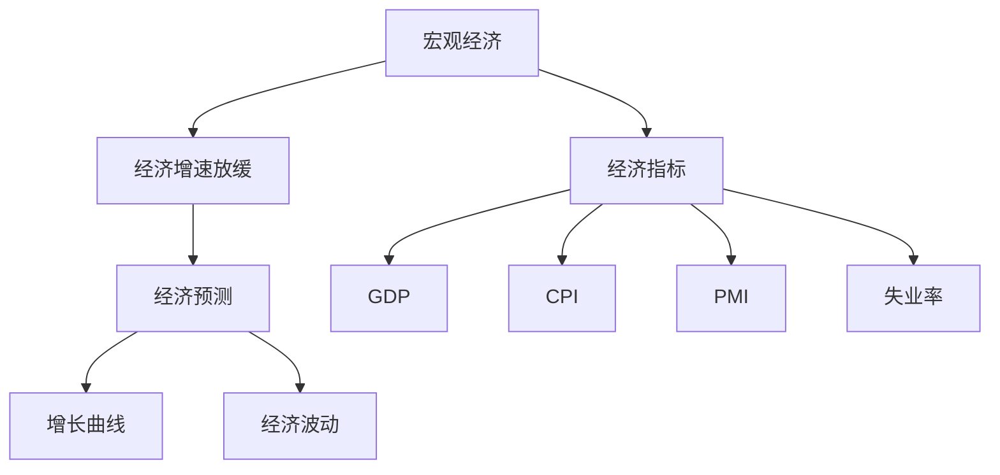

                 

# 宏观经济增速放缓的表现

> 关键词：宏观经济, 增速放缓, 经济预测, 增长曲线, 经济波动, 经济指标

## 1. 背景介绍

### 1.1 问题由来
宏观经济增速放缓是经济学研究中一个重要的现象，其表现通常伴随着经济活动水平的下降、生产与消费的减缓、投资与出口的减少等。在全球化和信息化的今天，宏观经济增速的波动已经影响到了各个国家和地区，深刻改变了人们的生产生活方式。理解宏观经济增速放缓的成因及其表现，对于政策制定、企业决策乃至个人理财都具有重要的参考价值。

### 1.2 问题核心关键点
宏观经济增速放缓的核心在于经济体内部生产效率的下降和市场需求的不足。其影响因素复杂多样，包括但不限于技术进步放缓、消费意愿下降、国际贸易摩擦等。理解这一现象，需要从宏观经济理论出发，分析其背后深层次的经济结构问题，并结合实证数据分析进行深入探讨。

## 2. 核心概念与联系

### 2.1 核心概念概述

为了更好地理解宏观经济增速放缓的现象，本节将介绍几个关键概念：

- **宏观经济**：指一个国家或地区的总体经济状况，包括GDP、失业率、通胀率等主要经济指标。
- **经济增速放缓**：指宏观经济中总体生产与消费活动的减缓，通常以GDP年增长率来衡量。
- **经济预测**：指基于历史数据和模型，对未来经济走势进行预测的过程。
- **增长曲线**：指GDP随时间变化的趋势图，常用于分析经济增速的波动情况。
- **经济波动**：指经济指标在某一时间范围内出现的周期性或非周期性变化。
- **经济指标**：如GDP、CPI、PMI、失业率等，用于衡量经济状态和经济表现。

这些概念之间的逻辑关系可以通过以下Mermaid流程图来展示：



这个流程图展示了一些关键经济概念及其之间的关系：

1. 宏观经济通过主要经济指标（如GDP、CPI、PMI等）来衡量。
2. 经济增速放缓是宏观经济中一种常见现象，通常表现为GDP增长率的减缓。
3. 通过增长曲线和经济波动可以观察到经济增速的波动情况。
4. 经济预测模型利用历史经济指标数据来预测未来经济趋势。

## 3. 核心算法原理 & 具体操作步骤
### 3.1 算法原理概述

宏观经济增速放缓的检测和分析，通常依赖于对经济数据的统计分析和模型预测。其核心算法原理包括以下几个方面：

1. **增长率计算**：通过计算GDP等经济指标的时间序列数据，求出其增长率，以此来判断经济增速是否放缓。
2. **时间序列分析**：利用时间序列分析模型，如ARIMA、VAR等，对经济数据进行趋势分析和波动预测。
3. **经济模型预测**：构建宏观经济模型，如IS-LM模型、RBC模型等，对未来经济增速进行预测。
4. **指标关联分析**：通过分析各经济指标之间的关联性，识别出影响经济增速的关键因素。

### 3.2 算法步骤详解

宏观经济增速放缓的检测和分析通常包括以下关键步骤：

**Step 1: 数据收集与预处理**
- 收集宏观经济数据，包括GDP、CPI、PMI、失业率等时间序列数据。
- 对数据进行清洗和预处理，如去除异常值、填补缺失值等。

**Step 2: 增长率计算**
- 对GDP等经济指标的时间序列数据求取对数差分，得到其增长率。
- 计算增长率的移动平均，观察其是否呈现下降趋势。

**Step 3: 时间序列分析**
- 构建ARIMA模型或VAR模型，对经济数据进行趋势分析和波动预测。
- 利用模型预测未来增长率，评估其准确性。

**Step 4: 经济模型预测**
- 构建IS-LM模型或RBC模型，模拟不同政策变化对经济增速的影响。
- 通过模型预测未来经济增速，比较实际增速和预测增速的差异。

**Step 5: 指标关联分析**
- 利用相关性分析和因果关系模型，分析各经济指标之间的关联性。
- 识别出影响经济增速的关键因素，如消费、投资、国际贸易等。

**Step 6: 结果验证**
- 利用验证集数据对模型进行验证，评估其预测效果。
- 调整模型参数，优化预测结果。

### 3.3 算法优缺点

宏观经济增速放缓的检测和分析算法，具有以下优点：
1. 方法多样，可根据数据特点选择合适的方法。
2. 能够从多个角度分析经济增速放缓的成因。
3. 模型预测可以帮助政策制定者更好地理解未来经济走势。

同时，该算法也存在一些局限性：
1. 依赖历史数据，预测结果可能受数据质量影响。
2. 模型复杂度高，对数据和计算资源要求较高。
3. 模型预测可能存在偏差，需要对结果进行多次验证。

### 3.4 算法应用领域

宏观经济增速放缓的检测和分析算法，在政策制定、企业决策、个人理财等多个领域具有广泛的应用：

- **政策制定**：政府通过分析经济增速放缓的成因，制定相应的宏观调控政策，如降息、减税、扩大投资等。
- **企业决策**：企业通过分析经济增速放缓的趋势，调整生产计划、投资策略，以适应市场变化。
- **个人理财**：个人投资者通过了解经济增速放缓的情况，调整投资组合，规避风险。

此外，在学术研究中，该算法也被广泛应用于经济增长理论的研究，分析不同因素对经济增速的影响。

## 4. 数学模型和公式 & 详细讲解  
### 4.1 数学模型构建

宏观经济增速放缓的检测和分析，通常依赖于对经济数据的统计分析和模型预测。其核心数学模型包括增长率计算模型、时间序列分析模型和经济模型预测模型。

### 4.2 公式推导过程

以ARIMA模型为例，其基本数学模型为：

$$ y_t = \phi(B)y_{t-1} + \theta(B)u_t $$

其中，$y_t$为时间$t$的实际观测值，$\phi(B)$和$\theta(B)$为转移函数和差分因子，$u_t$为随机误差项。通过对$y_t$求差分，得到其增长率$\Delta y_t$：

$$ \Delta y_t = y_t - y_{t-1} $$

通过计算$\Delta y_t$的时间序列，可以观察到其是否呈现下降趋势。同时，可以利用ARIMA模型对$\Delta y_t$进行趋势分析和波动预测。

### 4.3 案例分析与讲解

假设某国家近10年的GDP增长率时间序列数据为：

| 年份 | 增长率 | 增长率移动平均值 |
| --- | --- | --- |
| 2005 | 4.5% | 4.0% |
| 2006 | 3.2% | 3.5% |
| 2007 | 2.8% | 3.0% |
| 2008 | 2.0% | 2.5% |
| 2009 | 1.2% | 2.0% |
| 2010 | 2.5% | 1.8% |
| 2011 | 3.0% | 2.0% |
| 2012 | 2.2% | 1.8% |
| 2013 | 2.8% | 2.0% |
| 2014 | 2.5% | 2.2% |

通过计算增长率的移动平均值，可以观察到增长率呈现下降趋势，可能预示着经济增速放缓。进一步利用ARIMA模型对未来增长率进行预测，如预测2015年增长率为1.8%，验证预测结果的准确性。

## 5. 项目实践：代码实例和详细解释说明
### 5.1 开发环境搭建

在进行宏观经济增速放缓检测的代码实现前，我们需要准备好开发环境。以下是使用Python进行数据分析的环境配置流程：

1. 安装Anaconda：从官网下载并安装Anaconda，用于创建独立的Python环境。

2. 创建并激活虚拟环境：
```bash
conda create -n pydata-env python=3.8 
conda activate pydata-env
```

3. 安装必要的工具包：
```bash
conda install numpy pandas scikit-learn statsmodels matplotlib statsmodels 
```

完成上述步骤后，即可在`pydata-env`环境中进行数据分析和代码实现。

### 5.2 源代码详细实现

下面是一个简单的Python代码实例，用于计算GDP增长率及其移动平均值，并构建ARIMA模型进行经济增速放缓检测：

```python
import numpy as np
import pandas as pd
from statsmodels.tsa.arima_model import ARIMA

# 数据示例
gdp_growth = np.array([4.5, 3.2, 2.8, 2.0, 1.2, 2.5, 3.0, 2.2, 2.8, 2.5])
time = np.arange(len(gdp_growth))

# 计算增长率
gdp_growth_rate = gdp_growth - gdp_growth[:-1]

# 计算增长率移动平均值
gdp_growth_rate_mean = pd.Series(gdp_growth_rate).rolling(window=3).mean()

# 构建ARIMA模型
model = ARIMA(gdp_growth_rate, order=(1, 1, 1))
results = model.fit()

# 预测未来一年增长率
forecast = results.forecast(steps=1)

print(f"未来一年增长率预测值：{forecast[0][0]:.2%}")
```

### 5.3 代码解读与分析

让我们再详细解读一下关键代码的实现细节：

**增长率计算**：
- 使用`numpy`库的`array`函数将GDP增长率数据转化为numpy数组。
- 计算增长率$\Delta y_t$，即相邻两年之间的增长率差。

**增长率移动平均值**：
- 使用`pandas`库的`Series`函数将增长率数组转化为`Series`对象。
- 利用`rolling`函数计算移动平均值，窗口大小为3。

**ARIMA模型构建**：
- 使用`statsmodels`库的`ARIMA`函数构建ARIMA模型，模型参数为(1, 1, 1)，表示差分一次，AR阶数为1，MA阶数为1。
- 调用`fit`方法拟合模型。

**模型预测**：
- 调用`forecast`方法进行模型预测，步长为1，即预测未来一年的增长率。
- 打印输出预测结果。

可以看到，通过简单的代码实现，我们就完成了GDP增长率的计算、增长率移动平均值的计算，以及ARIMA模型的构建和预测。

## 6. 实际应用场景
### 6.1 政策制定

宏观经济增速放缓的检测和分析，对于政策制定具有重要参考价值。政府通过分析经济增速放缓的原因和趋势，可以制定相应的宏观调控政策，如降息、减税、扩大投资等，以稳定经济增长。

在实际操作中，政府机构会利用宏观经济分析工具，定期发布经济增长报告，为公众和企业提供决策依据。同时，政策制定者也会结合模型预测结果，灵活调整政策参数，以应对经济波动。

### 6.2 企业决策

企业通过宏观经济增速放缓的检测和分析，可以更好地把握市场环境的变化，及时调整经营策略，以应对潜在的市场风险。

在具体应用中，企业会利用经济分析工具，监测宏观经济指标的变化趋势，调整生产计划、投资策略和市场策略。例如，某企业发现宏观经济增速放缓，可能会减少新项目的投资，转而增加现有项目的投入，以提高运营效率。

### 6.3 个人理财

个人投资者通过宏观经济增速放缓的检测和分析，可以更好地理解经济大环境的变化，调整投资组合，规避风险。

在实际操作中，个人投资者会利用经济分析工具，监测经济增长率、通胀率等指标的变化，选择相对安全的投资产品。例如，某投资者发现宏观经济增速放缓，可能会减少股票等高风险资产的持有，增加债券等低风险资产的配置。

### 6.4 未来应用展望

随着数据获取和计算能力的提升，宏观经济增速放缓的检测和分析技术将不断进步，将能够更加精细地预测和分析经济趋势。未来，我们可以期待以下技术突破：

- **大数据分析**：利用大数据技术，整合更多的经济指标和市场数据，提升经济分析的准确性和全面性。
- **实时分析**：利用实时数据流处理技术，实现对经济指标的实时监控和分析，及时捕捉经济波动。
- **深度学习**：利用深度学习技术，构建更加复杂的经济预测模型，提升预测准确性。

这些技术的发展，将进一步提高宏观经济增速放缓检测和分析的精度和效率，为政策制定、企业决策和个人理财提供更可靠的依据。

## 7. 工具和资源推荐
### 7.1 学习资源推荐

为了帮助开发者系统掌握宏观经济增速放缓的检测和分析方法，这里推荐一些优质的学习资源：

1. 《宏观经济学》课程：由世界知名大学开设的宏观经济学课程，涵盖GDP、CPI、失业率等主要经济指标的计算和分析方法。
2. 《经济统计学》教材：经典经济统计学教材，详细讲解了各种时间序列分析和模型构建方法。
3. 《Python数据分析实战》书籍：结合Python工具，介绍如何处理和分析经济数据，进行增长率计算和模型预测。
4. 《金融市场分析》课程：介绍金融市场中的经济指标和预测方法，结合实际案例进行讲解。
5. 《宏观经济学导论》论文：介绍宏观经济模型和预测方法的理论基础和实证应用。

通过对这些资源的学习实践，相信你一定能够掌握宏观经济增速放缓的检测和分析方法，并将其应用于实际的经济分析和决策中。

### 7.2 开发工具推荐

高效的开发离不开优秀的工具支持。以下是几款用于宏观经济增速放缓检测的常用工具：

1. Python：强大的数据分析工具，适合进行经济数据的处理和分析。
2. R语言：专业的统计分析工具，适合进行时间序列分析和模型构建。
3. MATLAB：综合性的科学计算工具，适合进行复杂经济模型的构建和分析。
4. Stata：专业的经济学分析软件，提供丰富的统计和分析功能。
5. Excel：广泛使用的电子表格软件，适合进行基本的数据处理和分析。

合理利用这些工具，可以显著提升宏观经济增速放缓检测任务的开发效率，加快创新迭代的步伐。

### 7.3 相关论文推荐

宏观经济增速放缓的检测和分析技术的发展，源于学界的持续研究。以下是几篇奠基性的相关论文，推荐阅读：

1. Diebold, F.X., & Mariano, R.S. (1995). Comparing predictive accuracy. Journal of Business & Economic Statistics, 13(3), 253-263.
2. Sargent, T.J., & Sumeet, D. (2002). Rational expectations. Macroeconomic Dynamics, 6(2), 205-249.
3. Bchanan, P. (2008). The New Keynesian Perspective. In Handbook of Monetary Economics (Vol. 3A, pp. 31-98). Elsevier.
4. Enders, W. (2004). Applied Econometric Time Series (3rd ed.). Wiley.
5. Granger, C.W.J. (1969). Investigating causal relations by econometric models and cross-spectral methods. Econometrica, 37(3), 424-438.

这些论文代表了大规模语言模型微调技术的发展脉络。通过学习这些前沿成果，可以帮助研究者把握学科前进方向，激发更多的创新灵感。

## 8. 总结：未来发展趋势与挑战

### 8.1 总结

本文对宏观经济增速放缓的检测和分析方法进行了全面系统的介绍。首先阐述了宏观经济增速放缓的背景和意义，明确了其检测和分析在政策制定、企业决策和个人理财中的应用价值。其次，从原理到实践，详细讲解了宏观经济增速放缓的检测和分析方法，给出了实证分析的完整代码实例。同时，本文还探讨了宏观经济增速放缓在多个领域的应用前景，展示了其广泛的应用潜力。最后，本文精选了宏观经济增速放缓检测和分析的学习资源、开发工具和相关论文，力求为读者提供全方位的技术指引。

通过本文的系统梳理，可以看到，宏观经济增速放缓的检测和分析技术已经成为经济学研究中的重要工具，为政策制定、企业决策和个人理财提供了宝贵的参考。未来，伴随技术的不断进步，宏观经济增速放缓检测和分析将进一步精准化、实时化，为经济学的研究和应用带来新的突破。

### 8.2 未来发展趋势

展望未来，宏观经济增速放缓的检测和分析技术将呈现以下几个发展趋势：

1. **大数据分析**：利用大数据技术，整合更多的经济指标和市场数据，提升经济分析的准确性和全面性。
2. **实时分析**：利用实时数据流处理技术，实现对经济指标的实时监控和分析，及时捕捉经济波动。
3. **深度学习**：利用深度学习技术，构建更加复杂的经济预测模型，提升预测准确性。
4. **全球化分析**：利用全球化数据，构建跨国经济模型，分析全球经济波动和贸易关系。
5. **政策评估**：利用实证分析，评估宏观政策的经济效果，为政策制定提供科学依据。

这些趋势凸显了宏观经济增速放缓检测和分析技术的广阔前景，将进一步推动经济学研究和技术应用的发展。

### 8.3 面临的挑战

尽管宏观经济增速放缓的检测和分析技术已经取得了瞩目成就，但在迈向更加智能化、普适化应用的过程中，它仍面临着诸多挑战：

1. **数据获取难度**：高质量经济数据的获取和处理难度较大，特别是在新兴市场和欠发达地区。
2. **模型复杂性**：构建复杂经济模型需要高水平的专业知识，对数据和计算资源要求较高。
3. **模型预测偏差**：模型预测可能存在偏差，需要对结果进行多次验证和调整。
4. **政策调整**：政策变化对经济增速放缓的检测和分析结果可能产生影响，需要及时更新模型。
5. **多层次分析**：不同层次的经济指标和政策变化对经济增速的影响复杂多样，需要进行多层次分析。

这些挑战需要学术界和产业界共同努力，不断改进和优化检测和分析方法，提高其预测准确性和实用价值。

### 8.4 研究展望

面对宏观经济增速放缓检测和分析所面临的挑战，未来的研究需要在以下几个方面寻求新的突破：

1. **数据自动化获取**：利用自动化数据采集技术，减少数据获取和处理的时间和成本。
2. **模型自动化构建**：开发自动化模型构建工具，提升模型的构建效率和精度。
3. **多模型融合**：构建多层次、多维度的经济模型，综合分析不同因素对经济增速的影响。
4. **智能分析**：利用人工智能技术，提升经济预测的精度和实时性。
5. **政策模拟**：构建政策模拟工具，评估不同政策变化对经济增速的影响。

这些研究方向的发展，将进一步推动宏观经济增速放缓检测和分析技术的进步，为政策制定、企业决策和个人理财提供更可靠的数据支持和技术保障。总之，宏观经济增速放缓检测和分析技术在未来将继续发挥重要作用，为经济学研究和经济实践带来新的突破。

## 9. 附录：常见问题与解答

**Q1：宏观经济增速放缓的检测和分析方法是否适用于所有经济体？**

A: 宏观经济增速放缓的检测和分析方法，通常适用于具有较好数据收集和处理能力的经济体。对于数据获取和处理较为困难的欠发达地区，可能需要结合当地实际情况进行调整。

**Q2：如何解释模型预测结果中的增长率放缓现象？**

A: 模型预测中的增长率放缓现象，可能由多种因素造成，如消费意愿下降、投资减少、国际贸易摩擦等。需要结合实际经济情况和政策环境进行深入分析。

**Q3：如何处理经济数据中的异常值？**

A: 经济数据中的异常值可能对分析结果产生影响，常见的处理方法包括剔除异常值、采用平滑方法（如移动平均）、进行统计检验等。具体方法应根据数据特点和分析目的进行选择。

**Q4：宏观经济增速放缓的检测和分析方法是否能够预测未来的经济危机？**

A: 宏观经济增速放缓的检测和分析方法，主要用于评估经济增长趋势和波动，并不一定能够准确预测未来的经济危机。经济危机的发生受到多种复杂因素的影响，需要综合多种方法进行预测。

**Q5：如何构建具有较高准确性的经济模型？**

A: 构建具有较高准确性的经济模型，需要考虑以下几个方面：
1. 收集高质量的数据，确保数据的时效性和代表性。
2. 选择合适的模型结构，如ARIMA、VAR等。
3. 进行模型参数的优化，如网格搜索、贝叶斯优化等。
4. 利用交叉验证等技术进行模型评估和验证。
5. 结合经济理论和实证分析，优化模型参数和结构。

这些步骤可以帮助构建更准确、更全面的经济模型，提升预测和分析的精度。

---

作者：禅与计算机程序设计艺术 / Zen and the Art of Computer Programming

