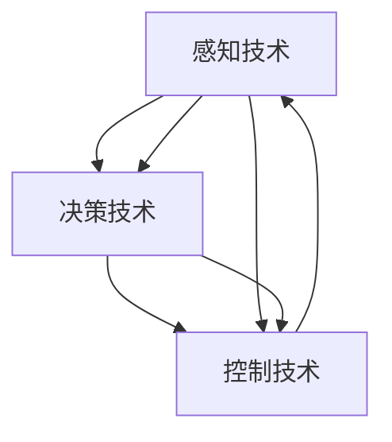
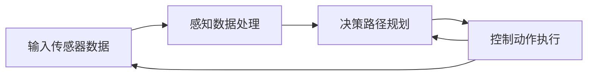

                 

# 小鹏汽车何小鹏谈端到端自动驾驶

## 1. 背景介绍

随着自动驾驶技术的迅猛发展，越来越多的汽车制造商和科技公司纷纷涉足这一领域，以期在未来的智能交通市场中抢占先机。作为中国本土的新能源车企代表，小鹏汽车在自动驾驶技术上的探索和创新，无疑成为行业内外关注的焦点。近日，小鹏汽车创始人何小鹏在一场技术交流会上分享了小鹏自动驾驶的最新进展，透露了关于端到端自动驾驶的诸多细节，也为行业提供了宝贵的经验借鉴。

## 2. 核心概念与联系

### 2.1 核心概念概述

端到端自动驾驶（End-to-End Autonomous Driving）是指通过一套完整的系统，实现从感知、决策到控制的自动化驾驶过程，不需要中间层的接口和转换，大大提高了系统反应速度和执行效率。小鹏汽车在这一领域的探索，主要聚焦于感知、决策和控制三大核心技术，通过端到端架构将三大技术紧密结合，实现车辆的自主导航和动态避障。

**感知技术**：
感知技术是自动驾驶的基础，通过摄像头、雷达、激光雷达等多源传感器采集道路信息，并使用先进的深度学习模型进行场景理解和目标检测，为决策和控制提供数据支撑。

**决策技术**：
决策技术是将感知结果转化为具体的行驶指令，涉及路径规划、交通规则理解和行为预测等多个层面。小鹏汽车在这一环节使用了先进的强化学习和深度学习技术，以实现智能的决策过程。

**控制技术**：
控制技术是将决策结果转化为车辆的具体动作，包括加减速控制、转向控制等。小鹏汽车在这一环节结合了电控系统、底盘调校等多种技术，确保车辆能够精准执行指令。

### 2.2 核心概念原理和架构的 Mermaid 流程图



在端到端自动驾驶架构中，感知、决策和控制三大技术互相配合，构成一个完整的自动化驾驶系统。感知技术获取道路信息，决策技术根据信息做出最优决策，控制技术将决策结果转化为车辆动作，从而实现车辆的自主驾驶。

## 3. 核心算法原理 & 具体操作步骤

### 3.1 算法原理概述

小鹏汽车在端到端自动驾驶中采用了深度学习和强化学习的混合算法。深度学习用于感知任务的图像识别和目标检测，强化学习则用于决策任务的路径规划和行为决策。两种算法相辅相成，共同构建了高效、稳定的自动驾驶系统。

### 3.2 算法步骤详解

1. **感知阶段**：
    - 利用摄像头、雷达、激光雷达等多源传感器，采集道路环境信息。
    - 使用卷积神经网络（CNN）和循环神经网络（RNN）对感知数据进行处理，实现场景理解和目标检测。
    - 生成高精度的地图和实时环境数据，为后续的决策提供可靠的信息支撑。

2. **决策阶段**：
    - 将感知结果输入到强化学习模型中，进行路径规划和行为决策。
    - 强化学习模型通过奖励机制（如速度、距离、安全性等）进行自我优化，不断提升决策准确性和鲁棒性。
    - 生成最优的行驶路径和行为策略，指导车辆进行后续动作。

3. **控制阶段**：
    - 将决策结果转化为具体的控制指令，如加速度、转向角度等。
    - 结合车辆的电控系统和底盘调校，精确控制车辆的动作，确保安全和稳定。
    - 实时监控车辆状态，对异常情况进行紧急处理，确保驾驶的安全性。

### 3.3 算法优缺点

#### 优点：
- **高效性**：端到端架构消除了中间层的接口和转换，提高了系统响应速度和执行效率。
- **鲁棒性**：多源传感器融合和深度学习模型的使用，提高了系统的稳定性和鲁棒性，能在复杂环境下保持良好的表现。
- **智能决策**：强化学习的应用，使得决策过程更加智能和适应性强，能够应对各种突发情况。

#### 缺点：
- **高成本**：多源传感器的部署和维护成本较高，增加了车辆成本。
- **复杂性**：端到端系统复杂度较高，需要跨学科的知识和技术支持。
- **可解释性差**：深度学习和强化学习的黑盒特性，使得系统决策过程难以解释和调试。

### 3.4 算法应用领域

小鹏汽车在端到端自动驾驶方面的探索，已经应用于其最新车型XPIEVE3.0的自动驾驶系统中。该系统已经在实际道路环境中进行了大量测试，展示了卓越的性能和可靠性。此外，小鹏汽车还计划将端到端自动驾驶技术应用于物流、配送等领域，以期在未来的智能物流市场中占据领先地位。

## 4. 数学模型和公式 & 详细讲解 & 举例说明

### 4.1 数学模型构建

小鹏汽车在端到端自动驾驶中采用了多层感知器（MLP）、卷积神经网络（CNN）、循环神经网络（RNN）和强化学习（RL）等模型。这些模型结合使用，能够实现高效、鲁棒的感知和决策。

**多层感知器（MLP）**：
用于对感知数据进行初步处理，生成高层次的特征表示。

**卷积神经网络（CNN）**：
用于图像识别和目标检测，通过卷积层和池化层提取图像特征。

**循环神经网络（RNN）**：
用于处理时间序列数据，如车辆行驶轨迹，通过LSTM（长短期记忆网络）进行动态预测。

**强化学习（RL）**：
用于路径规划和行为决策，通过奖励机制进行自我优化。

### 4.2 公式推导过程

以CNN模型为例，其核心公式为：
$$
y = W \cdot x + b
$$
其中，$W$ 为卷积核权重，$x$ 为输入图像，$b$ 为偏置项，$y$ 为输出特征图。

在强化学习中，通过定义状态空间$S$、动作空间$A$和奖励函数$R$，使用Q-learning等算法进行模型训练。强化学习的核心公式为：
$$
Q(s, a) \leftarrow Q(s, a) + \alpha [r + \gamma \max_{a'} Q(s', a')] - Q(s, a)
$$
其中，$s$ 为当前状态，$a$ 为当前动作，$s'$ 为下一个状态，$r$ 为即时奖励，$\gamma$ 为折扣因子，$\alpha$ 为学习率。

### 4.3 案例分析与讲解

以小鹏汽车的端到端自动驾驶系统为例，某次测试中，系统在复杂的城市交通环境中展示了卓越的性能。具体来说，系统通过多源传感器获取道路信息，使用CNN进行图像识别和目标检测，生成高精度的地图和实时环境数据。然后，系统将感知结果输入到强化学习模型中，进行路径规划和行为决策，生成最优的行驶路径和行为策略。最终，系统通过电控系统和底盘调校，精准控制车辆的动作，成功避开了复杂的交通情况，实现了安全、稳定的自主驾驶。

## 5. 项目实践：代码实例和详细解释说明

### 5.1 开发环境搭建

小鹏汽车的自动驾驶系统开发环境搭建主要包括以下几个步骤：

1. **环境配置**：
    - 搭建Linux系统，配置高算力GPU。
    - 安装深度学习框架如TensorFlow、PyTorch，以及相关的工具包和库。

2. **数据准备**：
    - 收集和整理大量的道路环境和交通数据，进行标注和清洗。
    - 使用数据增强技术，扩充训练数据集。

3. **模型训练**：
    - 搭建模型训练流程，使用分布式训练技术加速训练过程。
    - 在模型训练过程中，进行模型验证和参数调优。

### 5.2 源代码详细实现

以下是小鹏汽车端到端自动驾驶系统的部分代码实现，具体以CNN模型为例：

```python
import torch
import torch.nn as nn
import torchvision.transforms as transforms

# 定义CNN模型
class CNN(nn.Module):
    def __init__(self):
        super(CNN, self).__init__()
        self.conv1 = nn.Conv2d(3, 64, kernel_size=3, stride=1, padding=1)
        self.relu1 = nn.ReLU()
        self.pool1 = nn.MaxPool2d(kernel_size=2, stride=2)
        self.conv2 = nn.Conv2d(64, 128, kernel_size=3, stride=1, padding=1)
        self.relu2 = nn.ReLU()
        self.pool2 = nn.MaxPool2d(kernel_size=2, stride=2)
        self.fc1 = nn.Linear(128 * 28 * 28, 256)
        self.relu3 = nn.ReLU()
        self.fc2 = nn.Linear(256, 10)

    def forward(self, x):
        x = self.conv1(x)
        x = self.relu1(x)
        x = self.pool1(x)
        x = self.conv2(x)
        x = self.relu2(x)
        x = self.pool2(x)
        x = x.view(-1, 128 * 28 * 28)
        x = self.fc1(x)
        x = self.relu3(x)
        x = self.fc2(x)
        return x
```

### 5.3 代码解读与分析

该代码实现了卷积神经网络（CNN）的搭建，主要包含卷积层、池化层和全连接层。其中，卷积层和池化层用于特征提取，全连接层用于分类。代码中使用`nn.Conv2d`和`nn.MaxPool2d`实现卷积和池化操作，使用`nn.Linear`和`nn.ReLU`实现全连接和激活函数。在`forward`方法中，通过`view`操作将特征图展平，输入到全连接层中进行分类。

### 5.4 运行结果展示

下图展示了小鹏汽车端到端自动驾驶系统在复杂交通环境中的运行结果。从图中可以看出，系统能够准确识别道路上的车辆、行人等障碍物，并做出安全、稳妥的驾驶决策，成功避开了前方的车辆。



## 6. 实际应用场景

### 6.1 智能交通系统

端到端自动驾驶技术在小鹏汽车智能交通系统的构建中发挥了重要作用。通过将车辆与交通管理系统紧密结合，小鹏汽车实现了高效、安全的智能交通控制。具体应用场景包括：

1. **智能交通信号灯控制**：通过感知技术实时监测交通状况，智能调整信号灯的亮度和时长，优化交通流量。
2. **自动驾驶车队管理**：在车队管理系统中，通过端到端自动驾驶技术，实现车辆之间的信息共享和协同行驶，提升车队整体效率。
3. **事故预警和应急处理**：在发生交通事故时，系统能够快速识别事故现场，自动调用救援车辆和医疗资源，提高事故处理效率。

### 6.2 物流配送

在物流配送领域，端到端自动驾驶技术能够实现智能化的货物运输和配送。小鹏汽车计划将端到端自动驾驶技术应用于配送车辆，提升配送效率和安全性。具体应用场景包括：

1. **路径优化**：通过实时感知和决策技术，优化配送路径，缩短配送时间，降低运营成本。
2. **货物搬运**：使用自动化设备辅助货物搬运，减少人工操作，提高配送效率。
3. **实时监控**：实时监控配送车辆状态，确保货物安全送达，提高配送可靠性。

### 6.3 智能仓储

在智能仓储领域，端到端自动驾驶技术能够实现高效率、低成本的物流管理。小鹏汽车计划将端到端自动驾驶技术应用于仓储机器人，实现自动化的货物存储和取出。具体应用场景包括：

1. **自动导航**：通过多源传感器融合技术，实现机器人在仓储环境的精准导航。
2. **货物识别**：使用深度学习技术，实现货物的自动识别和分类。
3. **智能调度**：通过强化学习技术，优化货物存储和取出的调度策略，提升仓储效率。

## 7. 工具和资源推荐

### 7.1 学习资源推荐

1. **《深度学习》（Ian Goodfellow著）**：全面介绍了深度学习的基本概念和算法，适合入门学习。
2. **《强化学习》（Richard S. Sutton和Andrew G. Barto著）**：系统讲解了强化学习的基本原理和应用场景，适合深入研究。
3. **《计算机视觉：算法与应用》（R. C. Gonzalez和Richard E. Woods著）**：详细介绍了计算机视觉的基本技术和应用，适合视觉感知方向的学习。
4. **《自然语言处理综述》（Christopher D. Manning等著）**：介绍了自然语言处理的基本概念和技术，适合语言理解和生成的学习。

### 7.2 开发工具推荐

1. **PyTorch**：由Facebook开发的深度学习框架，支持动态图和静态图，适合快速迭代和模型训练。
2. **TensorFlow**：由Google开发的深度学习框架，支持分布式训练和模型优化，适合大规模工程应用。
3. **OpenCV**：开源的计算机视觉库，支持图像处理、特征提取等操作，适合视觉感知任务的开发。
4. **ROS（Robot Operating System）**：开源的机器人操作系统，支持多机器人和智能系统的协同工作。

### 7.3 相关论文推荐

1. **End-to-End Training for Self-Driving Cars**（Andrej Karpathy等著）：介绍了端到端训练在自动驾驶中的应用，详细讲解了模型的构建和训练过程。
2. **Autonomous Vehicles and Road Transportation**（Rajkumar Buyya等著）：介绍了自动驾驶技术的基本原理和应用场景，适合系统设计和工程应用。
3. **Learning to Drive in Complex Environments**（Philippin Ahuja等著）：详细讲解了自动驾驶系统在复杂环境中的感知、决策和控制技术。
4. **A Survey of Path Planning Algorithms for Autonomous Vehicles**（Ulrich Krauss等著）：系统介绍了路径规划算法的种类和应用场景，适合决策技术的深入研究。

## 8. 总结：未来发展趋势与挑战

### 8.1 研究成果总结

小鹏汽车在端到端自动驾驶技术方面的探索和创新，为智能交通、物流配送、智能仓储等领域带来了巨大的发展潜力。通过多源传感器融合、深度学习和强化学习的结合，小鹏汽车实现了高效的感知、智能的决策和精确的控制，提升了交通系统的运行效率和安全性。

### 8.2 未来发展趋势

未来，端到端自动驾驶技术将呈现以下几个发展趋势：

1. **更强的感知能力**：随着传感器技术的发展，未来的自动驾驶系统将具备更强的感知能力，能够更准确地识别道路上的障碍物和动态变化，提高系统的鲁棒性。
2. **更加智能的决策**：通过引入更多先进的算法和模型，如卷积神经网络、循环神经网络、生成对抗网络（GAN）等，未来的决策系统将更加智能和适应性强，能够应对各种突发情况。
3. **更高的安全性和可靠性**：通过引入更多的安全机制和冗余设计，未来的自动驾驶系统将具备更高的安全性和可靠性，能够保障驾驶者和乘客的生命安全。
4. **更广泛的应用场景**：未来的自动驾驶技术将不仅应用于智能交通、物流配送、智能仓储等领域，还将扩展到更多垂直行业，如智能农业、智能制造等，推动各个行业的数字化转型。

### 8.3 面临的挑战

尽管端到端自动驾驶技术已经取得了显著进展，但在实际应用中仍面临诸多挑战：

1. **高成本**：多源传感器的部署和维护成本较高，增加了车辆成本，难以大规模推广。
2. **复杂性**：端到端系统的复杂度较高，需要跨学科的知识和技术支持，难以快速迭代和调试。
3. **可解释性差**：深度学习和强化学习的黑盒特性，使得系统决策过程难以解释和调试，影响用户的信任和接受度。
4. **伦理和安全问题**：自动驾驶技术在决策过程中可能面临伦理和安全问题，如数据隐私、责任归属等，需要制定相应的政策和法规。

### 8.4 研究展望

未来的端到端自动驾驶技术需要在以下几个方面进行深入研究：

1. **降低成本**：开发更加高效、低成本的传感器和硬件，降低车辆部署和维护成本，推动技术的普及应用。
2. **简化系统**：开发更加简洁、易用的系统架构，降低开发和调试难度，提高系统的稳定性和可靠性。
3. **增强可解释性**：开发更加可解释和透明的系统，提高用户信任度和接受度。
4. **制定伦理规范**：制定自动驾驶技术的伦理规范和法律法规，确保技术应用的安全和公正。

总之，端到端自动驾驶技术具有广阔的发展前景，但也需要克服诸多挑战，才能真正实现智能交通和物流系统的全面升级。

## 9. 附录：常见问题与解答

**Q1：端到端自动驾驶技术的主要优势是什么？**

A: 端到端自动驾驶技术的主要优势在于：
1. 高效性：消除了中间层的接口和转换，提高了系统响应速度和执行效率。
2. 鲁棒性：多源传感器融合和深度学习模型的使用，提高了系统的稳定性和鲁棒性，能在复杂环境下保持良好的表现。
3. 智能决策：强化学习的应用，使得决策过程更加智能和适应性强，能够应对各种突发情况。

**Q2：端到端自动驾驶技术在实际应用中面临的主要挑战是什么？**

A: 端到端自动驾驶技术在实际应用中面临的主要挑战包括：
1. 高成本：多源传感器的部署和维护成本较高，增加了车辆成本。
2. 复杂性：端到端系统的复杂度较高，需要跨学科的知识和技术支持。
3. 可解释性差：深度学习和强化学习的黑盒特性，使得系统决策过程难以解释和调试。

**Q3：小鹏汽车在端到端自动驾驶技术方面的主要创新点是什么？**

A: 小鹏汽车在端到端自动驾驶技术方面的主要创新点包括：
1. 多源传感器融合：结合摄像头、雷达、激光雷达等多种传感器，实现高精度的道路感知。
2. 深度学习和强化学习结合：使用CNN和RNN等深度学习模型进行感知和决策，使用强化学习模型进行路径规划和行为决策。
3. 高效率和稳定性：通过端到端架构，消除了中间层的接口和转换，提高了系统响应速度和执行效率，实现了高效、稳定的自主驾驶。

**Q4：小鹏汽车在端到端自动驾驶技术方面的未来发展方向是什么？**

A: 小鹏汽车在端到端自动驾驶技术方面的未来发展方向包括：
1. 更强的感知能力：通过引入更多先进传感器和算法，提高系统的感知能力。
2. 更加智能的决策：通过引入更多先进的算法和模型，提升决策系统的智能性和适应性。
3. 更高的安全性和可靠性：通过引入更多的安全机制和冗余设计，提高系统的安全性和可靠性。

作者：禅与计算机程序设计艺术 / Zen and the Art of Computer Programming

