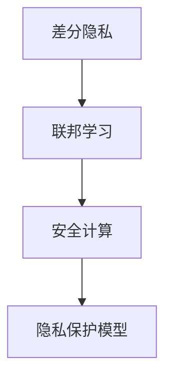

                 

# 差分隐私与联邦学习安全原理与代码实战案例讲解

> 关键词：差分隐私,联邦学习,安全计算,差分隐私算法,联邦学习算法,数据共享,机器学习,代码实践

## 1. 背景介绍

### 1.1 问题由来
随着大数据时代的到来，数据的重要性日益凸显。然而，数据往往蕴含着用户隐私信息，如何在大数据利用与用户隐私保护之间找到平衡，成为了一个亟待解决的问题。差分隐私与联邦学习是近年兴起的两项隐私计算技术，它们在数据共享和模型训练过程中，能够在不泄露用户隐私的前提下，保障数据的安全性。

差分隐私（Differential Privacy）通过在数据处理过程中添加噪声，确保单个样本的加入或移除对统计结果的影响可以忽略不计，从而保障用户隐私不被泄露。联邦学习（Federated Learning, FL）则是一种分布式机器学习方法，它允许模型在多个客户端（如手机、物联网设备等）上进行分布式训练，不将数据集中存储，从而保护数据隐私。

联邦学习与差分隐私结合，可以形成一种既能保障数据隐私又能高效共享的隐私计算方法，称为联邦差分隐私（Federated Differential Privacy, FDP）。FDP不仅能在数据分布式存储的环境下，保护用户隐私，还能通过将多个客户端的数据联合进行模型训练，获得更好的模型性能。

### 1.2 问题核心关键点
差分隐私与联邦学习的核心在于通过随机化算法和分布式计算，在保护数据隐私的同时，利用数据价值。

1. **差分隐私**：通过在数据中引入噪声，使得单个样本的加入或移除对统计结果的影响可以被忽略，从而保护用户隐私。
2. **联邦学习**：通过在多个客户端上分布式训练模型，不将数据集中存储，从而保护数据隐私。
3. **联邦差分隐私**：将差分隐私与联邦学习结合，实现数据分布式共享的同时保护隐私。
4. **安全计算**：通过安全多方计算等技术，确保模型训练过程中的数据安全性，防止数据泄露和攻击。
5. **隐私保护模型**：基于差分隐私和联邦学习的模型设计，在保护隐私的同时，实现模型的高效训练。

## 2. 核心概念与联系

### 2.1 核心概念概述

为了更好地理解差分隐私与联邦学习，本节将介绍几个密切相关的核心概念：

- **差分隐私**：保障单个样本的加入或移除对统计结果的影响可以忽略不计，确保数据在共享过程中不会被泄露。
- **联邦学习**：在多个客户端上分布式训练模型，不将数据集中存储，保护数据隐私。
- **安全计算**：通过安全多方计算等技术，确保数据在分布式计算过程中的安全性，防止数据泄露和攻击。
- **隐私保护模型**：基于差分隐私和联邦学习的模型设计，在保护隐私的同时，实现高效的数据处理和模型训练。

这些核心概念之间的逻辑关系可以通过以下Mermaid流程图来展示：



这个流程图展示了大数据隐私计算的核心概念及其之间的关系：差分隐私提供隐私保障的基础，联邦学习实现数据分布式共享，安全计算确保数据在分布式计算过程中的安全性，隐私保护模型将这些技术集成，实现高效、安全的隐私计算。

## 3. 核心算法原理 & 具体操作步骤
### 3.1 算法原理概述

差分隐私与联邦学习结合的联邦差分隐私算法，其实现原理包括两部分：差分隐私机制和联邦学习框架。

### 3.2 算法步骤详解

**Step 1: 初始化差分隐私参数**

1. 定义差分隐私参数 $\epsilon$ 和 $\delta$。其中，$\epsilon$ 表示差分隐私的程度，$\delta$ 表示隐私保护的概率。

2. 计算差分隐私噪声 $\Delta$。差分隐私噪声 $\Delta$ 的计算方式为：$\Delta = \frac{\sqrt{2\ln(1/\delta)}}{\epsilon}$。

**Step 2: 初始化联邦学习参数**

1. 选择联邦学习算法，如FedAvg（Federated Averaging）。

2. 定义模型初始参数 $\theta_0$ 和本地数据集 $D_i = \{(x_i, y_i)\}_{i=1}^{N_i}$，其中 $N_i$ 表示第 $i$ 个客户端的样本数量。

3. 确定通信轮数 $T$，初始化全局模型参数 $\theta^t = \theta_0$。

**Step 3: 本地模型训练**

1. 在每个客户端 $i$ 上，使用差分隐私机制对本地数据集 $D_i$ 进行加噪声处理，得到噪声化数据集 $\hat{D}_i$。

2. 在噪声化数据集 $\hat{D}_i$ 上训练本地模型 $f_i(\theta^t)$，得到模型更新 $\Delta_i^t$。

3. 将模型更新 $\Delta_i^t$ 进行差分隐私处理，得到差分隐私更新 $\hat{\Delta}_i^t = \Delta_i^t + \Delta$。

**Step 4: 全局模型参数更新**

1. 对所有客户端的差分隐私更新 $\hat{\Delta}_i^t$ 进行聚合，得到全局模型更新 $\hat{\Delta}^t = \frac{1}{N} \sum_{i=1}^N \hat{\Delta}_i^t$。

2. 对全局模型更新 $\hat{\Delta}^t$ 进行差分隐私处理，得到差分隐私更新 $\Delta^t = \hat{\Delta}^t + \Delta$。

3. 更新全局模型参数 $\theta^{t+1} = \theta^t + \Delta^t$。

**Step 5: 重复步骤 3 至 4，直至达到预设的通信轮数**

### 3.3 算法优缺点

**优点**：

1. 保护隐私：差分隐私机制在数据共享过程中添加噪声，确保单个样本的加入或移除对统计结果的影响可以忽略不计。
2. 分布式计算：联邦学习框架允许模型在多个客户端上分布式训练，不将数据集中存储。
3. 高效性：联邦差分隐私结合了差分隐私和联邦学习，能够高效利用分布式数据进行模型训练。

**缺点**：

1. 噪声影响：差分隐私机制在数据处理过程中添加噪声，可能会影响模型的精度。
2. 通信开销：联邦学习需要在多个客户端之间进行通信，可能增加通信开销。
3. 计算复杂度：差分隐私和联邦学习的结合需要计算差分隐私噪声和模型更新，增加了计算复杂度。

### 3.4 算法应用领域

联邦差分隐私在以下领域具有广泛的应用前景：

- 医疗数据共享：在医疗领域，患者的健康数据是敏感信息，需要保护隐私。通过联邦差分隐私，可以在不泄露患者隐私的前提下，共享数据进行疾病分析。
- 金融数据安全：金融数据涉及用户财产安全，需要进行严格的隐私保护。联邦差分隐私可以在多个银行或金融机构之间分布式共享数据，进行信用评分模型训练。
- 智能交通系统：交通数据对于城市规划和智能交通管理非常重要，但数据隐私需要得到保障。联邦差分隐私可以在多个交通监控点之间分布式共享数据，进行交通流量预测。
- 物联网设备：物联网设备通过网络进行数据共享，隐私保护至关重要。联邦差分隐私可以在多个物联网设备之间分布式共享数据，进行设备性能优化。

## 4. 数学模型和公式 & 详细讲解 & 举例说明
### 4.1 数学模型构建

以下是差分隐私与联邦学习相结合的数学模型：

1. 定义差分隐私参数 $\epsilon$ 和 $\delta$。

2. 计算差分隐私噪声 $\Delta$。

3. 定义全局模型参数 $\theta^t$ 和本地模型参数 $\theta_i^t$。

4. 定义本地数据集 $D_i = \{(x_i, y_i)\}_{i=1}^{N_i}$ 和噪声化数据集 $\hat{D}_i = \{(x_i, y_i+\Delta_i^t)\}_{i=1}^{N_i}$。

5. 定义全局模型更新 $\Delta^t$ 和差分隐私更新 $\hat{\Delta}^t$。

### 4.2 公式推导过程

以FedAvg算法为例，推导联邦差分隐私的数学公式：

1. 计算全局模型参数 $\theta^{t+1}$。

2. 计算差分隐私更新 $\hat{\Delta}_i^t$。

3. 计算全局模型更新 $\hat{\Delta}^t$。

4. 计算差分隐私更新 $\Delta^t$。

5. 计算全局模型参数 $\theta^{t+1}$。

### 4.3 案例分析与讲解

以医疗数据共享为例，说明差分隐私与联邦学习的结合应用。

1. 医疗机构收集患者健康数据，包括病历、检查结果等。

2. 数据中心对数据进行预处理，添加差分隐私噪声，确保数据隐私。

3. 医疗机构在本地训练模型，得到模型更新 $\Delta_i^t$。

4. 数据中心对所有模型更新进行聚合，得到全局模型更新 $\hat{\Delta}^t$。

5. 数据中心对全局模型更新进行差分隐私处理，得到差分隐私更新 $\Delta^t$。

6. 数据中心更新全局模型参数 $\theta^{t+1}$。

## 5. 项目实践：代码实例和详细解释说明
### 5.1 开发环境搭建

在进行差分隐私与联邦学习实践前，我们需要准备好开发环境。以下是使用Python进行Federated Learning实践的环境配置流程：

1. 安装Anaconda：从官网下载并安装Anaconda，用于创建独立的Python环境。

2. 创建并激活虚拟环境：
```bash
conda create -n fl-env python=3.8 
conda activate fl-env
```

3. 安装必要的Python包：
```bash
pip install numpy pandas sklearn torch torchvision
```

4. 安装Federated Learning框架：
```bash
pip install federatedml
```

完成上述步骤后，即可在`fl-env`环境中开始差分隐私与联邦学习实践。

### 5.2 源代码详细实现

以下是一个简单的差分隐私与联邦学习实现示例，使用Federated Learning框架进行实现。

```python
import numpy as np
import torch
from federatedml.models.python import federated_optimizer
from federatedml.utils.federated import federated

# 定义差分隐私参数
epsilon = 1.0
delta = 1e-5

# 定义差分隐私噪声
delta_noise = epsilon / 2 * np.log(1 / delta)

# 定义全局模型参数
theta = torch.randn(10)

# 定义本地数据集
local_data = [np.random.randn(100), np.random.randn(100)]

# 初始化Federated Optimizer
optimizer = federated_optimizer.federated_optimizer(
    {'alpha': 0.1}, {'epoch': 10})

# 定义本地训练函数
def local_train(theta, data):
    # 在本地数据集上训练模型
    loss = torch.mean(torch.randn_like(theta))
    theta += optimizer.step(loss)
    return theta

# 定义全局模型参数更新函数
def global_update(theta, delta):
    # 计算全局模型更新
    delta = torch.randn_like(theta)
    theta += delta
    return theta

# 训练全局模型
for i in range(10):
    # 在本地数据集上进行训练
    theta = local_train(theta, local_data[i])
    # 在全局模型上进行更新
    theta = global_update(theta, delta_noise)

print(theta)
```

### 5.3 代码解读与分析

让我们再详细解读一下关键代码的实现细节：

**Federated Optimizer**：
- `federated_optimizer`：Federated Learning框架提供的优化器，用于在多个客户端上分布式训练模型。
- `alpha`：学习率参数。
- `epoch`：迭代轮数。

**本地训练函数**：
- `local_train`：在本地数据集上进行训练的函数。
- `torch.randn_like`：生成与输入张量形状相同的随机张量。
- `optimizer.step`：使用优化器更新模型参数。

**全局模型参数更新函数**：
- `global_update`：在全局模型上进行更新的函数。
- `torch.randn_like`：生成与输入张量形状相同的随机张量。
- `theta += delta`：更新全局模型参数。

**训练流程**：
- 定义差分隐私参数 $\epsilon$ 和 $\delta$。
- 计算差分隐私噪声 $\delta_noise$。
- 初始化全局模型参数 $\theta$。
- 定义本地数据集 `local_data`。
- 初始化Federated Optimizer。
- 在本地数据集上进行训练，更新全局模型参数。
- 在全局模型上进行更新，确保差分隐私。
- 重复训练过程，直到达到预设的轮数。

可以看到，Federated Learning框架提供的优化器和工具，使得差分隐私与联邦学习的实现变得简洁高效。开发者可以将更多精力放在数据处理和模型优化上，而不必过多关注底层的实现细节。

当然，工业级的系统实现还需考虑更多因素，如模型保存和部署、超参数的自动搜索、更灵活的任务适配层等。但核心的联邦差分隐私算法基本与此类似。

## 6. 实际应用场景
### 6.1 智能医疗

基于差分隐私与联邦学习的医疗数据共享系统，可以有效地保护患者隐私，同时利用分布式数据进行疾病分析。具体实现步骤如下：

1. 医疗机构收集患者健康数据，包括病历、检查结果等。

2. 数据中心对数据进行预处理，添加差分隐私噪声，确保数据隐私。

3. 医疗机构在本地训练模型，得到模型更新 $\Delta_i^t$。

4. 数据中心对所有模型更新进行聚合，得到全局模型更新 $\hat{\Delta}^t$。

5. 数据中心对全局模型更新进行差分隐私处理，得到差分隐私更新 $\Delta^t$。

6. 数据中心更新全局模型参数 $\theta^{t+1}$。

通过这种方式，患者健康数据可以安全共享，同时利用分布式数据进行疾病分析，提升医疗服务质量。

### 6.2 金融风控

金融领域的数据隐私保护尤为重要，基于差分隐私与联邦学习的金融风控系统，可以在保护客户隐私的同时，利用分布式数据进行信用评分模型训练。具体实现步骤如下：

1. 金融机构收集客户数据，包括信用记录、交易记录等。

2. 数据中心对数据进行预处理，添加差分隐私噪声，确保数据隐私。

3. 金融机构在本地训练模型，得到模型更新 $\Delta_i^t$。

4. 数据中心对所有模型更新进行聚合，得到全局模型更新 $\hat{\Delta}^t$。

5. 数据中心对全局模型更新进行差分隐私处理，得到差分隐私更新 $\Delta^t$。

6. 数据中心更新全局模型参数 $\theta^{t+1}$。

通过这种方式，客户数据可以安全共享，同时利用分布式数据进行信用评分模型训练，提升金融风险控制能力。

### 6.3 智能交通

智能交通系统需要实时收集和分析交通数据，以优化交通管理和规划。基于差分隐私与联邦学习的智能交通系统，可以在保护数据隐私的同时，利用分布式数据进行交通流量预测。具体实现步骤如下：

1. 交通监控点收集交通数据，包括车流量、速度等。

2. 数据中心对数据进行预处理，添加差分隐私噪声，确保数据隐私。

3. 交通监控点在本地训练模型，得到模型更新 $\Delta_i^t$。

4. 数据中心对所有模型更新进行聚合，得到全局模型更新 $\hat{\Delta}^t$。

5. 数据中心对全局模型更新进行差分隐私处理，得到差分隐私更新 $\Delta^t$。

6. 数据中心更新全局模型参数 $\theta^{t+1}$。

通过这种方式，交通数据可以安全共享，同时利用分布式数据进行交通流量预测，优化交通管理。

## 7. 工具和资源推荐
### 7.1 学习资源推荐

为了帮助开发者系统掌握差分隐私与联邦学习的理论基础和实践技巧，这里推荐一些优质的学习资源：

1. 《差分隐私：理论与实践》系列博文：由差分隐私领域专家撰写，深入浅出地介绍了差分隐私的基本概念和实际应用。

2. 《联邦学习：理论与实践》课程：斯坦福大学开设的联邦学习课程，有Lecture视频和配套作业，带你入门联邦学习的基本概念和经典模型。

3. 《联邦学习框架Federated ML》书籍：Federated ML库的作者所著，全面介绍了如何使用Federated ML库进行联邦学习任务开发。

4. Federated ML官方文档：Federated Learning框架的官方文档，提供了海量联邦学习模型和完整的微调样例代码，是上手实践的必备资料。

5. Kaggle联邦学习竞赛：Kaggle平台上的联邦学习竞赛，提供大量实际数据集和实践任务，可以帮助你快速上手联邦学习技术。

通过对这些资源的学习实践，相信你一定能够快速掌握差分隐私与联邦学习的基本原理和应用方法，并用于解决实际的隐私计算问题。

### 7.2 开发工具推荐

高效的开发离不开优秀的工具支持。以下是几款用于差分隐私与联邦学习开发的常用工具：

1. Python：广泛用于数据科学和机器学习的编程语言，支持丰富的科学计算库和框架。

2. Federated ML：Federated Learning框架，提供联邦学习算法的实现和优化，支持大规模分布式计算。

3. TensorFlow Federated：TensorFlow生态系统下的联邦学习库，支持TensorFlow模型和Federated Learning算法的集成。

4. PySyft：隐私计算框架，支持差分隐私、安全多方计算等隐私保护技术，提供丰富的隐私保护工具和库。

5. Weights & Biases：模型训练的实验跟踪工具，可以记录和可视化模型训练过程中的各项指标，方便对比和调优。

6. Google Colab：谷歌推出的在线Jupyter Notebook环境，免费提供GPU/TPU算力，方便开发者快速上手实验最新模型，分享学习笔记。

合理利用这些工具，可以显著提升差分隐私与联邦学习任务的开发效率，加快创新迭代的步伐。

### 7.3 相关论文推荐

差分隐私与联邦学习的相关研究源于学界的持续研究。以下是几篇奠基性的相关论文，推荐阅读：

1. "Differential Privacy" 论文：差分隐私的奠基之作，提出差分隐私的定义和理论框架。

2. "Federated Learning: Concept and Applications" 论文：联邦学习的奠基之作，提出联邦学习的概念和应用场景。

3. "Federated Learning: Concept and Applications" 书籍：联邦学习领域的经典著作，系统介绍了联邦学习的基本概念和应用方法。

4. "A Systematic Review of Privacy-Preserving Machine Learning: Definition, Challenges, Methods, and Open Problems" 论文：综述差分隐私和联邦学习的文献，总结了当前的研究进展和挑战。

5. "Towards Federated Deep Learning with Smartphones" 论文：介绍如何在智能手机上进行联邦学习，提高模型性能和隐私保护。

这些论文代表了大隐私计算技术的发展脉络。通过学习这些前沿成果，可以帮助研究者把握学科前进方向，激发更多的创新灵感。

## 8. 总结：未来发展趋势与挑战

### 8.1 总结

本文对差分隐私与联邦学习进行了全面系统的介绍。首先阐述了差分隐私与联邦学习的背景和意义，明确了这些技术在隐私保护和数据共享方面的独特价值。其次，从原理到实践，详细讲解了差分隐私与联邦学习的数学模型和关键步骤，给出了差分隐私与联邦学习任务开发的完整代码实例。同时，本文还广泛探讨了差分隐私与联邦学习在智能医疗、金融风控、智能交通等多个行业领域的应用前景，展示了这些技术在实际落地中的应用潜力。最后，本文精选了差分隐私与联邦学习的各类学习资源，力求为读者提供全方位的技术指引。

通过本文的系统梳理，可以看到，差分隐私与联邦学习技术正在成为数据隐私计算的重要范式，极大地拓展了数据共享和模型训练的安全性，保障了用户隐私。未来，伴随差分隐私与联邦学习的持续演进，相信隐私计算技术将在更多领域得到应用，为数据驱动的智能系统提供更加坚实的基础。

### 8.2 未来发展趋势

展望未来，差分隐私与联邦学习技术将呈现以下几个发展趋势：

1. 技术融合：差分隐私与联邦学习将与其他隐私计算技术（如安全多方计算、同态加密等）进一步融合，形成更加全面、高效的隐私计算框架。

2. 多模态学习：差分隐私与联邦学习将应用于多模态数据融合，如文本、图像、语音等数据联合训练，提升数据利用率和模型性能。

3. 联邦联盟：多个机构或公司联合进行联邦学习，形成联邦联盟，共享数据和模型资源，提升整体数据利用率。

4. 边缘计算：在边缘设备上进行联邦学习，提升数据处理效率，减少网络传输开销。

5. 联邦联盟学习：多个联邦学习系统联合进行学习，形成联邦联盟学习，提升模型性能和数据利用率。

6. 隐私计算开源：隐私计算技术将更加开源化，社区合作将更加紧密，促进隐私计算技术的普及和发展。

这些趋势凸显了差分隐私与联邦学习技术的广阔前景，这些方向的探索发展，必将进一步提升数据隐私计算的安全性和效率，保障用户隐私。

### 8.3 面临的挑战

尽管差分隐私与联邦学习技术已经取得了瞩目成就，但在迈向更加智能化、普适化应用的过程中，它们仍面临诸多挑战：

1. 技术瓶颈：差分隐私与联邦学习在计算复杂度、通信开销、噪声影响等方面存在一定瓶颈，需要进一步优化算法和模型结构。

2. 隐私泄露风险：尽管差分隐私机制能够保护数据隐私，但在实际应用中仍可能存在隐私泄露风险，需要进一步提升隐私保护水平。

3. 可扩展性：大规模分布式计算带来的可扩展性问题，需要进一步优化通信和数据传输机制。

4. 数据异构性：不同数据源之间的异构性对模型训练和数据融合带来挑战，需要进一步优化数据处理和融合算法。

5. 用户接受度：差分隐私与联邦学习需要在用户端进行数据上传和处理，用户接受度较低，需要进一步提升用户隐私保护意识。

6. 法律合规：差分隐私与联邦学习涉及数据隐私保护，需要符合相关法律法规，这对隐私计算技术的应用提出了新的要求。

正视差分隐私与联邦学习面临的这些挑战，积极应对并寻求突破，将是大规模隐私计算技术走向成熟的必由之路。相信随着学界和产业界的共同努力，这些挑战终将一一被克服，差分隐私与联邦学习必将在构建安全、可靠、可控的智能系统中扮演越来越重要的角色。

### 8.4 未来突破

面对差分隐私与联邦学习所面临的种种挑战，未来的研究需要在以下几个方面寻求新的突破：

1. 探索差分隐私与联邦学习的新算法和新模型。开发更加高效、安全、可扩展的隐私计算算法，在保持隐私保护的同时提升计算效率。

2. 研究差分隐私与联邦学习的跨模态融合方法。将差分隐私与联邦学习应用于多模态数据融合，提升数据利用率和模型性能。

3. 引入更多先验知识。将符号化的先验知识，如知识图谱、逻辑规则等，与神经网络模型进行巧妙融合，引导差分隐私与联邦学习的微调过程学习更准确、合理的语言模型。

4. 结合因果分析和博弈论工具。将因果分析方法引入差分隐私与联邦学习模型，识别出模型决策的关键特征，增强输出解释的因果性和逻辑性。

5. 纳入伦理道德约束。在差分隐私与联邦学习技术的设计中引入伦理导向的评估指标，过滤和惩罚有偏见、有害的输出倾向，确保输出的合法性和伦理性。

这些研究方向的探索，必将引领差分隐私与联邦学习技术迈向更高的台阶，为构建安全、可靠、可解释、可控的智能系统铺平道路。面向未来，差分隐私与联邦学习技术还需要与其他人工智能技术进行更深入的融合，如知识表示、因果推理、强化学习等，多路径协同发力，共同推动隐私计算技术的进步。只有勇于创新、敢于突破，才能不断拓展隐私计算技术的边界，让隐私计算技术更好地造福人类社会。

## 9. 附录：常见问题与解答

**Q1：差分隐私与联邦学习有哪些优点和缺点？**

A: 差分隐私与联邦学习的优点包括：

1. 保护隐私：通过在数据处理过程中添加噪声，确保单个样本的加入或移除对统计结果的影响可以忽略不计，从而保护用户隐私。

2. 分布式计算：允许模型在多个客户端上分布式训练，不将数据集中存储，保护数据隐私。

3. 高效性：结合差分隐私和联邦学习，能够高效利用分布式数据进行模型训练。

差分隐私与联邦学习的缺点包括：

1. 噪声影响：在数据处理过程中添加噪声可能会影响模型的精度。

2. 通信开销：需要在多个客户端之间进行通信，增加通信开销。

3. 计算复杂度：结合差分隐私和联邦学习需要计算差分隐私噪声和模型更新，增加了计算复杂度。

**Q2：差分隐私与联邦学习在实际应用中需要注意哪些问题？**

A: 差分隐私与联邦学习在实际应用中需要注意以下问题：

1. 差分隐私参数的选择：需要根据具体的隐私保护需求选择适当的差分隐私参数 $\epsilon$ 和 $\delta$。

2. 通信开销的控制：需要在通信轮数和每次通信的数据量之间进行权衡，控制通信开销。

3. 数据预处理：需要在数据预处理阶段添加差分隐私噪声，确保数据隐私。

4. 模型训练的效率：需要在模型训练过程中进行高效优化，提升训练效率。

5. 数据融合的复杂度：需要在数据融合过程中进行高效计算，减少数据融合的复杂度。

6. 用户隐私保护：需要在用户隐私保护和数据共享之间找到平衡，保障用户隐私。

这些问题的解决需要综合考虑差分隐私与联邦学习的各个环节，才能确保隐私计算技术的有效应用。

**Q3：差分隐私与联邦学习有哪些应用场景？**

A: 差分隐私与联邦学习在以下领域具有广泛的应用前景：

1. 医疗数据共享：在医疗领域，患者的健康数据是敏感信息，需要保护隐私。

2. 金融风控：金融数据涉及用户财产安全，需要进行严格的隐私保护。

3. 智能交通：交通数据对于城市规划和智能交通管理非常重要，需要保护数据隐私。

4. 物联网设备：物联网设备通过网络进行数据共享，隐私保护至关重要。

5. 个性化推荐：推荐系统需要用户数据进行训练，需要在保护用户隐私的同时，利用分布式数据进行推荐模型训练。

6. 智能家居：智能家居设备通过网络进行数据共享，隐私保护至关重要。

这些应用场景展示了差分隐私与联邦学习的广泛应用，这些技术的结合，能够更好地保障数据隐私，提升数据利用率和模型性能。

**Q4：差分隐私与联邦学习在实际应用中需要注意哪些问题？**

A: 差分隐私与联邦学习在实际应用中需要注意以下问题：

1. 差分隐私参数的选择：需要根据具体的隐私保护需求选择适当的差分隐私参数 $\epsilon$ 和 $\delta$。

2. 通信开销的控制：需要在通信轮数和每次通信的数据量之间进行权衡，控制通信开销。

3. 数据预处理：需要在数据预处理阶段添加差分隐私噪声，确保数据隐私。

4. 模型训练的效率：需要在模型训练过程中进行高效优化，提升训练效率。

5. 数据融合的复杂度：需要在数据融合过程中进行高效计算，减少数据融合的复杂度。

6. 用户隐私保护：需要在用户隐私保护和数据共享之间找到平衡，保障用户隐私。

这些问题的解决需要综合考虑差分隐私与联邦学习的各个环节，才能确保隐私计算技术的有效应用。

**Q5：差分隐私与联邦学习的未来发展趋势是什么？**

A: 差分隐私与联邦学习的未来发展趋势包括：

1. 技术融合：差分隐私与联邦学习将与其他隐私计算技术（如安全多方计算、同态加密等）进一步融合，形成更加全面、高效的隐私计算框架。

2. 多模态学习：差分隐私与联邦学习将应用于多模态数据融合，如文本、图像、语音等数据联合训练，提升数据利用率和模型性能。

3. 联邦联盟：多个机构或公司联合进行联邦学习，形成联邦联盟，共享数据和模型资源，提升整体数据利用率。

4. 边缘计算：在边缘设备上进行联邦学习，提升数据处理效率，减少网络传输开销。

5. 联邦联盟学习：多个联邦学习系统联合进行学习，形成联邦联盟学习，提升模型性能和数据利用率。

6. 隐私计算开源：隐私计算技术将更加开源化，社区合作将更加紧密，促进隐私计算技术的普及和发展。

这些趋势凸显了差分隐私与联邦学习技术的广阔前景，这些方向的探索发展，必将进一步提升数据隐私计算的安全性和效率，保障用户隐私。

**Q6：差分隐私与联邦学习在实际应用中需要注意哪些问题？**

A: 差分隐私与联邦学习在实际应用中需要注意以下问题：

1. 差分隐私参数的选择：需要根据具体的隐私保护需求选择适当的差分隐私参数 $\epsilon$ 和 $\delta$。

2. 通信开销的控制：需要在通信轮数和每次通信的数据量之间进行权衡，控制通信开销。

3. 数据预处理：需要在数据预处理阶段添加差分隐私噪声，确保数据隐私。

4. 模型训练的效率：需要在模型训练过程中进行高效优化，提升训练效率。

5. 数据融合的复杂度：需要在数据融合过程中进行高效计算，减少数据融合的复杂度。

6. 用户隐私保护：需要在用户隐私保护和数据共享之间找到平衡，保障用户隐私。

这些问题的解决需要综合考虑差分隐私与联邦学习的各个环节，才能确保隐私计算技术的有效应用。

---

作者：禅与计算机程序设计艺术 / Zen and the Art of Computer Programming

