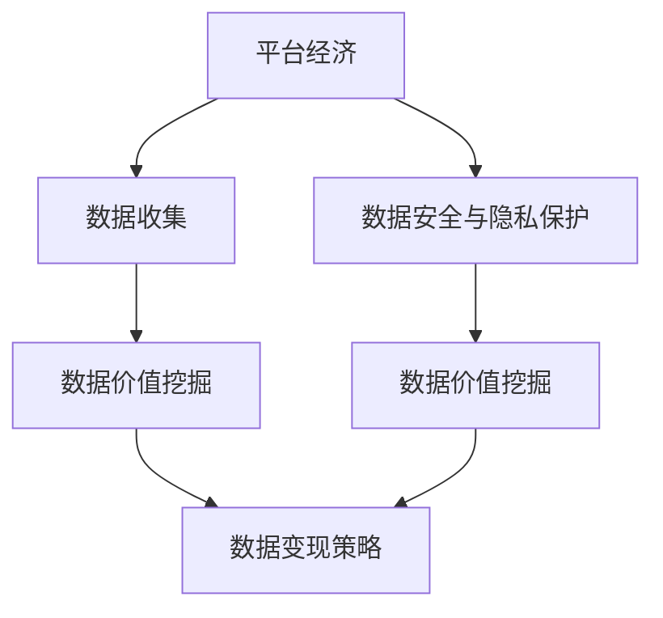

                 

# 平台经济的数据价值：如何实现数据变现？

> 关键词：平台经济,数据价值,数据变现,智能算法,数据挖掘,机器学习,商业智能

## 1. 背景介绍

### 1.1 问题由来
随着互联网技术的迅猛发展，平台经济逐渐成为全球经济的重要组成部分。各大电商平台、社交平台、内容平台等通过连接供需双方，实现了巨大的商业价值。然而，平台经济的发展并非一帆风顺，其在面临数据安全、隐私保护、数据垄断等挑战的同时，还存在数据价值的挖掘和变现问题。

数据作为平台经济的核心资源，蕴含着巨大的商业价值和应用潜力。如何高效、安全地挖掘和利用这些数据，最大化其商业价值，是平台经济发展的关键课题。本文将从平台经济的数据价值入手，探讨如何通过智能算法和商业智能工具实现数据变现。

### 1.2 问题核心关键点
平台经济的数据变现问题主要集中在以下几个关键点：

- **数据收集与整理**：平台需要收集和整理大量用户数据，包括行为数据、交易数据、社交数据等，以便后续分析和挖掘。
- **数据安全与隐私保护**：如何在数据收集和分析过程中，保障用户数据的安全和隐私，避免数据泄露和滥用。
- **数据价值挖掘**：如何通过数据挖掘和机器学习算法，发现数据中的商业洞察和潜在价值。
- **数据变现策略**：如何将挖掘出的数据价值转化为实际的经济收益，实现商业变现。

本文将系统地介绍如何从数据收集、数据挖掘、数据安全与隐私保护到数据变现的全链条，实现平台经济中的数据价值最大化。

## 2. 核心概念与联系

### 2.1 核心概念概述

为了更好地理解平台经济中的数据变现问题，本节将介绍几个核心概念：

- **平台经济(Platform Economy)**：指通过建立线上平台，连接供需双方，实现资源共享和价值交换的经济模式。平台包括电商、社交、内容等众多类型。
- **数据价值(Data Value)**：指数据在商业应用中能够带来的实际效益，包括商业洞察、客户价值、业务优化等。
- **数据变现(Data Monetization)**：指通过分析和挖掘数据，将其转化为商业收益的过程。
- **智能算法(Intelligent Algorithm)**：指用于数据挖掘、预测、分类等数据处理任务的机器学习算法，如深度学习、决策树、聚类等。
- **商业智能(Business Intelligence, BI)**：指通过数据挖掘、数据分析、数据可视化等手段，为商业决策提供支持的智能系统。

这些核心概念之间的逻辑关系可以通过以下Mermaid流程图来展示：



这个流程图展示出平台经济中数据变现的全链条：平台通过收集用户数据，在保障数据安全和隐私的前提下，进行数据价值挖掘，最后通过数据变现策略实现商业收益。

## 3. 核心算法原理 & 具体操作步骤

### 3.1 算法原理概述

平台经济中的数据变现问题，本质上是通过数据挖掘和智能算法，将数据中的潜在价值转化为实际收益的过程。其核心思想是：

1. **数据收集与整理**：平台收集用户行为数据、交易数据、社交数据等，整理成可分析的格式。
2. **数据价值挖掘**：通过数据挖掘算法，如关联规则挖掘、聚类分析、情感分析等，发现数据中的商业洞察和潜在价值。
3. **数据安全与隐私保护**：采用数据脱敏、访问控制等技术，确保数据安全和隐私保护。
4. **数据变现策略**：将挖掘出的数据价值转化为实际收益，如广告投放、推荐系统、用户个性化服务等。

### 3.2 算法步骤详解

平台经济中的数据变现步骤包括：

**Step 1: 数据收集与整理**
- 收集用户行为数据：包括浏览、购买、评价等行为数据。
- 收集交易数据：包括订单、支付、退款等交易数据。
- 收集社交数据：包括评论、点赞、分享等社交互动数据。
- 数据清洗与整理：去除噪声数据，填充缺失值，进行特征工程，确保数据质量。

**Step 2: 数据安全与隐私保护**
- 数据脱敏处理：对敏感数据进行加密、伪化处理，确保数据隐私。
- 访问控制策略：设置数据访问权限，确保只有授权人员能够访问敏感数据。
- 审计与监控：记录数据访问日志，实时监控数据使用情况，确保数据安全。

**Step 3: 数据价值挖掘**
- 数据预处理：包括数据清洗、标准化、归一化等步骤。
- 特征选择：根据业务需求选择关键特征，减少维度，提升模型性能。
- 数据建模：采用各种智能算法，如深度学习、随机森林、逻辑回归等，建立数据模型。
- 模型评估与优化：通过交叉验证、A/B测试等手段，评估模型效果，不断优化模型。

**Step 4: 数据变现策略**
- 广告投放：基于用户行为数据和交易数据，精准投放广告，提升广告效果。
- 推荐系统：通过分析用户兴趣和行为数据，推荐相关产品或内容，提高用户粘性。
- 用户个性化服务：根据用户数据，提供个性化推荐、个性化营销等增值服务。

### 3.3 算法优缺点

平台经济中的数据变现方法具有以下优点：
1. 精准度高：通过数据挖掘和智能算法，实现对用户行为的精准分析和预测。
2. 效率高：自动化的数据处理流程，大幅提升数据挖掘和变现的效率。
3. 成本低：相比人工分析，数据变现方法成本更低。

同时，该方法也存在一定的局限性：
1. 依赖数据质量：数据收集和整理质量直接影响模型效果。
2. 技术门槛高：需要较高的技术水平和资源投入，对中小企业可能不友好。
3. 数据隐私风险：数据处理不当可能导致隐私泄露，需要严格的监管和控制。
4. 模型泛化能力：过度拟合训练数据可能导致模型泛化能力不足，影响变现效果。

尽管存在这些局限性，但就目前而言，数据变现方法仍然是平台经济中的主流范式。未来相关研究的重点在于如何进一步降低数据变现的技术门槛，提高模型的泛化能力，同时兼顾数据隐私和安全等因素。

### 3.4 算法应用领域

平台经济中的数据变现方法在以下几个领域中具有广泛的应用：

- **电商领域**：通过推荐系统、广告投放、用户行为分析等手段，提升电商平台的转化率和用户粘性。
- **社交媒体**：利用情感分析、用户画像等技术，实现精准营销和个性化推荐，提升平台的用户活跃度和广告效果。
- **内容平台**：通过用户行为数据和内容分析，实现内容推荐和用户推荐，提高平台的用户留存率和广告收益。
- **金融领域**：通过数据分析和模型预测，实现风险控制、客户信用评估、投资建议等增值服务，提高金融服务的精准度和效率。
- **健康医疗**：通过患者数据和医疗记录分析，实现疾病预测、诊疗建议等医疗服务，提升医疗服务的质量和效率。

此外，数据变现方法也在众多新兴领域中得到应用，如智能交通、智能制造、智能城市等，为这些领域带来了新的增长点。随着数据的不断积累和技术的不断进步，数据变现方法将在更多领域发挥更大的作用。

## 4. 数学模型和公式 & 详细讲解 & 举例说明

### 4.1 数学模型构建

为了更好地理解平台经济中的数据变现问题，本节将使用数学语言对关键环节进行详细讲解。

设平台收集的用户行为数据为 $X$，交易数据为 $Y$，社交数据为 $Z$。设数据模型为 $M(x, y, z)$，数据挖掘任务为 $T$，数据变现策略为 $P$。则平台经济中的数据变现过程可以表示为：

$$
P(X, Y, Z, T, M) = \max_{M} \{\mathcal{L}(M, T, P)\}
$$

其中，$\mathcal{L}(M, T, P)$ 为数据变现的损失函数，衡量数据变现过程中模型的效果和变现策略的匹配度。

### 4.2 公式推导过程

以电商领域的推荐系统为例，推导数据变现的数学模型和公式。

**推荐系统数学模型**：
设用户 $u$ 对商品 $i$ 的评分 $r_{ui}$，商品 $i$ 的隐含特征 $f_i$，用户 $u$ 的隐含特征 $f_u$。则推荐系统可以表示为：

$$
r_{ui} = \sigma(\langle f_u, f_i \rangle)
$$

其中 $\sigma(\cdot)$ 为激活函数，$\langle \cdot, \cdot \rangle$ 为内积运算。

**数据变现损失函数**：
推荐系统的目标是最小化用户和模型的误差，即：

$$
\mathcal{L}(\theta) = \frac{1}{N}\sum_{i=1}^N \sum_{u=1}^N (y_{ui} - \sigma(\langle f_u, f_i \rangle))^2
$$

其中 $\theta$ 为模型的参数，$y_{ui}$ 为实际评分，$\sigma(\cdot)$ 为激活函数。

### 4.3 案例分析与讲解

以电商平台为例，分析推荐系统在实际应用中的数据变现过程：

1. **数据收集与整理**：
   - 收集用户行为数据：记录用户浏览、点击、购买等行为数据。
   - 收集交易数据：记录订单、支付、退款等交易数据。
   - 收集社交数据：记录用户评论、点赞、分享等社交互动数据。

2. **数据安全与隐私保护**：
   - 数据脱敏处理：对用户ID、订单ID等敏感数据进行加密、伪化处理。
   - 访问控制策略：设置数据访问权限，确保只有授权人员能够访问敏感数据。
   - 审计与监控：记录数据访问日志，实时监控数据使用情况，确保数据安全。

3. **数据价值挖掘**：
   - 数据预处理：包括数据清洗、标准化、归一化等步骤。
   - 特征选择：根据业务需求选择关键特征，减少维度，提升模型性能。
   - 数据建模：采用各种智能算法，如深度学习、随机森林、逻辑回归等，建立数据模型。
   - 模型评估与优化：通过交叉验证、A/B测试等手段，评估模型效果，不断优化模型。

4. **数据变现策略**：
   - 广告投放：基于用户行为数据和交易数据，精准投放广告，提升广告效果。
   - 推荐系统：通过分析用户兴趣和行为数据，推荐相关产品或内容，提高用户粘性。
   - 用户个性化服务：根据用户数据，提供个性化推荐、个性化营销等增值服务。

## 5. 项目实践：代码实例和详细解释说明

### 5.1 开发环境搭建

在进行数据变现实践前，我们需要准备好开发环境。以下是使用Python进行TensorFlow开发的环境配置流程：

1. 安装Anaconda：从官网下载并安装Anaconda，用于创建独立的Python环境。

2. 创建并激活虚拟环境：
```bash
conda create -n tf-env python=3.8 
conda activate tf-env
```

3. 安装TensorFlow：根据CUDA版本，从官网获取对应的安装命令。例如：
```bash
conda install tensorflow tensorflow-gpu=2.4.0 -c pytorch -c conda-forge
```

4. 安装Pandas、NumPy、Matplotlib等常用工具包：
```bash
pip install pandas numpy matplotlib scikit-learn tqdm jupyter notebook ipython
```

完成上述步骤后，即可在`tf-env`环境中开始数据变现实践。

### 5.2 源代码详细实现

下面我们以电商平台推荐系统为例，给出使用TensorFlow进行推荐系统的PyTorch代码实现。

首先，定义推荐系统的数据处理函数：

```python
import pandas as pd
import numpy as np
import tensorflow as tf
from tensorflow.keras.layers import Input, Dense, Embedding, Flatten, concatenate, dot
from tensorflow.keras.models import Model

def load_data(file_path):
    data = pd.read_csv(file_path)
    return data['user_id'], data['item_id'], data['rating']

user_ids, item_ids, ratings = load_data('ratings.csv')
```

然后，定义推荐系统的模型：

```python
user_input = Input(shape=(1,), name='user')
item_input = Input(shape=(1,), name='item')
user_embedding = Embedding(100000, 10, name='user_embedding')(user_input)
item_embedding = Embedding(100000, 10, name='item_embedding')(item_input)
concat = concatenate([user_embedding, item_embedding])
dot_product = dot(concat, [1, 1])
predictions = Dense(1, activation='sigmoid')(dot_product)

model = Model(inputs=[user_input, item_input], outputs=predictions)
model.compile(optimizer='adam', loss='binary_crossentropy', metrics=['accuracy'])
```

接着，定义推荐系统的训练函数：

```python
def train_recommender(model, train_data, test_data, batch_size, epochs):
    model.fit(x=train_data, y=test_data, batch_size=batch_size, epochs=epochs, validation_data=(test_data, test_data), verbose=2)
    return model
```

最后，启动训练流程：

```python
train_data = np.array(user_ids).reshape((-1, 1)), np.array(item_ids).reshape((-1, 1))
test_data = np.array(user_ids).reshape((-1, 1)), np.array(item_ids).reshape((-1, 1))

batch_size = 128
epochs = 10

model = train_recommender(model, train_data, test_data, batch_size, epochs)

# 使用模型进行推荐
user_id = np.array(1).reshape((-1, 1))
item_id = np.array(1).reshape((-1, 1))
prediction = model.predict([user_id, item_id])
print(prediction)
```

以上就是使用TensorFlow对推荐系统进行数据变现的完整代码实现。可以看到，通过TensorFlow的高效计算能力，推荐系统模型的训练和推理变得简单快捷。

### 5.3 代码解读与分析

让我们再详细解读一下关键代码的实现细节：

**数据处理函数**：
- `load_data`函数：从CSV文件中加载数据，并返回用户ID、商品ID和评分。
- `user_input`和`item_input`：定义用户ID和商品ID的输入层。
- `user_embedding`和`item_embedding`：使用嵌入层对用户ID和商品ID进行映射，得到低维稠密向量表示。
- `concat`：将用户和商品的嵌入向量进行拼接。
- `dot_product`：计算用户和商品的向量内积，得到推荐分数。
- `predictions`：定义输出层，使用sigmoid激活函数得到推荐概率。
- `Model`函数：使用`Input`、`Embedding`、`Flatten`、`concat`、`dot`、`Dense`等层定义模型。

**训练函数**：
- `train_recommender`函数：对推荐系统模型进行训练，通过`fit`方法拟合数据，设置批次大小和迭代轮数，并使用测试数据进行验证。

**启动训练流程**：
- `train_data`和`test_data`：对用户ID和商品ID进行数组化处理，并设置批次大小和迭代轮数。
- `model`：调用训练函数对模型进行训练，并使用新用户ID和商品ID进行推荐预测。

可以看到，TensorFlow提供的高级API使得推荐系统模型的实现变得简单高效。开发者可以将更多精力放在模型优化和业务实现上，而不必过多关注底层细节。

当然，工业级的系统实现还需考虑更多因素，如模型的保存和部署、超参数的自动搜索、更灵活的任务适配层等。但核心的推荐系统微调范式基本与此类似。

## 6. 实际应用场景

### 6.1 智能客服系统

智能客服系统在平台经济中的应用越来越广泛。通过推荐系统、情感分析等技术，智能客服系统可以为用户提供更精准、更高效的服务体验。

例如，电商平台可以通过推荐系统为用户推荐可能感兴趣的商品，提升用户满意度和购买率。同时，智能客服系统还可以根据用户对话内容，识别用户情绪，提供个性化的解决方案，提升用户体验。

### 6.2 金融风控系统

金融风控系统是平台经济中的重要组成部分，其目标是通过数据分析和建模，防范金融风险，保障金融安全。

通过数据挖掘和机器学习算法，金融风控系统可以实时监控用户行为，识别潜在的欺诈和风险，及时采取应对措施。例如，信贷评估系统可以通过用户信用历史和行为数据，评估用户信用风险，提升授信决策的准确性和安全性。

### 6.3 内容推荐系统

内容推荐系统是平台经济中的关键环节，其目标是通过推荐系统，提高用户满意度和平台粘性。

例如，视频平台可以通过推荐系统为用户推荐相关视频内容，提升用户观看时长和平台流量。同时，推荐系统还可以根据用户行为和偏好，实现个性化推荐，提升用户粘性和转化率。

### 6.4 未来应用展望

随着平台经济的发展，数据变现方法将在更多领域得到应用，为平台带来更多的商业价值和用户粘性。

在未来，数据变现方法将不断融合更多新兴技术，如区块链、边缘计算、AIoT等，实现更加智能、高效、安全的平台经济。例如，区块链技术可以用于保障数据隐私和安全，边缘计算可以实现实时数据处理和分析，AIoT技术可以实现智能设备的实时监控和数据采集，提升平台经济的数据变现能力。

## 7. 工具和资源推荐
### 7.1 学习资源推荐

为了帮助开发者系统掌握平台经济中的数据变现理论基础和实践技巧，这里推荐一些优质的学习资源：

1. 《数据挖掘与统计学习》系列博文：由数据挖掘领域的专家撰写，详细讲解了数据挖掘和机器学习的理论和实践方法。
2. 《机器学习实战》书籍：由机器学习领域的知名学者撰写，提供了大量实战案例，帮助读者理解机器学习算法的实现和应用。
3. 《商业智能BI》课程：由知名商业智能厂商提供，涵盖BI系统的架构设计、开发部署等全流程内容，适合系统化学习。
4. 《深度学习》课程：由斯坦福大学开设的深度学习课程，涵盖深度学习的理论和实践，适合有一定基础的开发者学习。

通过对这些资源的学习实践，相信你一定能够快速掌握平台经济中数据变现的精髓，并用于解决实际的商业问题。
###  7.2 开发工具推荐

高效的开发离不开优秀的工具支持。以下是几款用于数据变现开发的常用工具：

1. TensorFlow：由Google主导开发的开源深度学习框架，生产部署方便，适合大规模工程应用。
2. PyTorch：基于Python的开源深度学习框架，灵活动态的计算图，适合快速迭代研究。
3. Scikit-learn：Python的机器学习库，提供了丰富的分类、回归、聚类等算法实现。
4. Apache Spark：开源的大数据处理框架，支持大规模数据集的实时处理和分析。
5. Hadoop：Apache的分布式计算平台，支持海量数据的高效处理和存储。

合理利用这些工具，可以显著提升数据变现任务的开发效率，加快创新迭代的步伐。

### 7.3 相关论文推荐

平台经济中的数据变现技术源于学界的持续研究。以下是几篇奠基性的相关论文，推荐阅读：

1. "Data Mining and Statistical Learning"（《数据挖掘与统计学习》）：详细讲解了数据挖掘和机器学习的理论和实践方法。
2. "Pattern Recognition and Machine Learning"（《模式识别与机器学习》）：由机器学习领域的知名学者撰写，涵盖了机器学习的理论和算法。
3. "Towards a Theory of Data Value"（《数据价值理论》）：探讨了数据价值的概念和评估方法，提出了新的数据价值度量模型。
4. "Machine Learning in Practice"（《实践中的机器学习》）：提供了大量机器学习算法的实现和应用案例，适合初学者和实践者参考。

这些论文代表了大数据变现技术的发展脉络。通过学习这些前沿成果，可以帮助研究者把握学科前进方向，激发更多的创新灵感。

## 8. 总结：未来发展趋势与挑战

### 8.1 总结

本文对平台经济中的数据变现问题进行了全面系统的介绍。首先阐述了平台经济的数据价值，明确了数据变现的重要性和实施步骤。其次，从数据收集、数据挖掘、数据安全与隐私保护到数据变现的全链条，详细讲解了平台经济中的数据变现过程，并给出了实际应用场景和开发实践案例。

通过本文的系统梳理，可以看到，数据变现方法在平台经济中的应用前景广阔，通过数据挖掘和智能算法，可以实现精准预测和智能推荐，提升用户满意度和商业价值。未来，伴随数据量的不断积累和技术的不断进步，数据变现方法将在更多领域得到应用，为平台经济带来新的增长点。

### 8.2 未来发展趋势

展望未来，平台经济中的数据变现技术将呈现以下几个发展趋势：

1. 数据规模持续增大：随着平台经济的发展，数据量将不断增长，数据变现方法将在更大规模的数据上发挥作用。
2. 技术手段不断丰富：数据变现将融合更多新兴技术，如区块链、边缘计算、AIoT等，提升数据处理和分析的效率和安全性。
3. 算法模型更加高效：数据变现算法将不断优化，实现更高精度的推荐和预测，提升用户体验和平台收益。
4. 数据变现自动化：基于自动化机器学习(AutoML)技术，数据变现方法将更加灵活和智能，提升开发效率。
5. 数据隐私保护更加严格：随着数据隐私法规的完善，数据变现方法将更加注重隐私保护和合规性，保障用户数据的安全。

以上趋势凸显了数据变现技术的广阔前景。这些方向的探索发展，必将进一步提升平台经济中的数据价值，实现商业变现的高效化和智能化。

### 8.3 面临的挑战

尽管数据变现技术已经取得了一定的进展，但在迈向更加智能化、普适化应用的过程中，它仍面临着诸多挑战：

1. 数据隐私和安全风险：数据收集和处理过程中，如何保障用户隐私和安全，避免数据泄露和滥用。
2. 数据质量和多样性问题：数据采集和处理过程中，如何确保数据的质量和多样性，提升模型的泛化能力。
3. 技术复杂性和成本高昂：数据变现方法需要较高的技术水平和资源投入，对中小企业可能不友好。
4. 模型性能和鲁棒性问题：如何提升模型的鲁棒性和泛化能力，避免过度拟合训练数据。

尽管存在这些挑战，但数据变现技术仍然是平台经济中的重要范式。未来相关研究的重点在于如何进一步降低技术门槛，提高模型的泛化能力，同时兼顾数据隐私和安全等因素。

### 8.4 研究展望

面对数据变现面临的挑战，未来的研究需要在以下几个方面寻求新的突破：

1. 探索低成本高效的数据变现方法：如何降低数据变现的技术门槛，提高模型的泛化能力和鲁棒性。
2. 引入更多的外部知识：将符号化的先验知识，如知识图谱、逻辑规则等，与神经网络模型进行融合，提升模型的解释性和鲁棒性。
3. 结合因果分析和博弈论工具：将因果分析方法引入数据变现模型，识别出模型决策的关键特征，增强输出解释的因果性和逻辑性。
4. 纳入伦理道德约束：在模型训练目标中引入伦理导向的评估指标，过滤和惩罚有偏见、有害的输出倾向，确保数据变现过程的公平性和可控性。

这些研究方向的探索，必将引领数据变现技术迈向更高的台阶，为平台经济带来新的突破和变革。

## 9. 附录：常见问题与解答

**Q1：数据变现方法是否适用于所有平台经济领域？**

A: 数据变现方法在电商、金融、内容等平台经济领域中具有广泛的应用前景。但需要根据具体领域的特点，对数据收集、处理和建模等环节进行优化调整。例如，金融领域需要更多的隐私保护和风险控制措施，内容平台需要更多的推荐算法和用户体验优化。

**Q2：如何降低数据变现的技术门槛？**

A: 降低数据变现的技术门槛，可以通过自动化机器学习(AutoML)技术，实现模型自动构建和优化，降低开发者对技术水平和资源投入的需求。同时，可以通过数据脱敏、模型压缩等技术，降低数据处理和存储的成本，提升系统的可扩展性和可靠性。

**Q3：数据变现方法是否会带来隐私风险？**

A: 数据变现方法在平台经济中的应用需要严格的数据隐私保护措施。可以采用数据脱敏、访问控制等技术，确保用户数据的安全和隐私。同时，需要遵循数据隐私法规，建立数据使用的透明性和合规性。

**Q4：如何提升数据变现模型的鲁棒性和泛化能力？**

A: 提升数据变现模型的鲁棒性和泛化能力，可以通过引入更多数据、优化模型结构、增加数据增强等手段实现。同时，需要进行充分的模型评估和交叉验证，确保模型在训练数据和测试数据上的一致性和稳定性。

**Q5：数据变现方法是否适用于传统行业？**

A: 数据变现方法不仅适用于平台经济领域，在传统行业中也有广泛的应用前景。例如，零售业可以通过推荐系统提升用户购买率，制造业可以通过预测维护提升设备利用率，医疗业可以通过病历分析提高诊断准确性。数据变现方法在各行各业中都有潜在的商业价值。

通过本文的系统梳理，可以看到，数据变现方法在平台经济中的应用前景广阔，通过数据挖掘和智能算法，可以实现精准预测和智能推荐，提升用户满意度和商业价值。未来，伴随数据量的不断积累和技术的不断进步，数据变现方法将在更多领域得到应用，为平台经济带来新的增长点。

