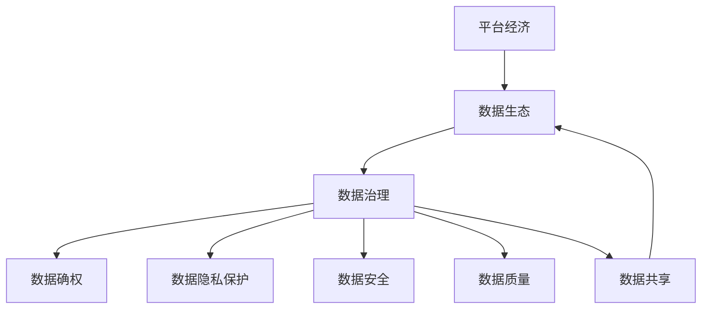

                 

# 平台经济的数据生态：如何构建健康的数据生态？

> 关键词：平台经济,数据生态,健康生态,数据治理,数据安全,隐私保护,数据共享,数据质量,数据确权,数据道德

## 1. 背景介绍

### 1.1 问题由来

随着数字经济的兴起，平台经济成为驱动经济增长的关键力量。在平台经济中，数据发挥着越来越重要的作用。数据不仅能反映和驱动经济行为，还能优化决策、提升服务质量。然而，伴随数据的重要性，平台经济中的数据问题也日益凸显。如数据孤岛、数据质量差、数据泄露等现象屡见不鲜。如何在平台经济中构建健康的数据生态，最大化数据的价值，成为亟需解决的重要问题。

### 1.2 问题核心关键点

构建健康的数据生态，核心在于平衡数据拥有者、处理者、使用者等多方的利益关系。需要从数据收集、存储、处理、分享等各个环节入手，确保数据的质量、安全、确权、共享。

## 2. 核心概念与联系

### 2.1 核心概念概述

为更好地理解如何构建平台经济的健康数据生态，本节将介绍几个关键概念：

- 平台经济：由数字平台提供中介服务的经济模式，如电子商务、社交媒体、在线教育等。平台经济的繁荣离不开数据这一重要资源。
- 数据生态：由数据生成、存储、处理、共享、利用等环节构成的数据流动循环系统，包括数据源、数据处理者、数据使用者等。
- 健康数据生态：健康的数据生态是指数据在流动过程中，各方利益得到平衡，数据价值得到最大化，同时数据质量、安全、确权、共享等关键问题得到有效解决的生态。
- 数据治理：指通过政策、技术、管理手段，确保数据在各个环节都能有序、合规、高效地流动。
- 数据确权：指明确数据归属权，包括所有权、使用权、共享权等，确保数据在流转过程中各方的权益得到保障。
- 数据隐私保护：通过技术和管理手段，确保数据在流转和使用过程中，隐私得到充分保护。
- 数据安全：通过技术和管理手段，防止数据在传输和存储过程中被非法访问、篡改或破坏。
- 数据质量：指数据的准确性、完整性、一致性、及时性等，是数据价值实现的基础。
- 数据共享：通过技术和管理手段，促进数据在不同主体之间的合法、安全、高效共享。

这些概念之间的逻辑关系可以通过以下Mermaid流程图来展示：



这个流程图展示了大语言模型的核心概念及其之间的关系：

1. 平台经济是大数据治理的基础。
2. 数据治理是大数据健康生态的保障。
3. 数据确权、隐私保护、数据安全、数据质量、数据共享等环节，都围绕着数据治理展开。

## 3. 核心算法原理 & 具体操作步骤

### 3.1 算法原理概述

构建健康的数据生态，涉及多方面的内容。本文将从数据治理、数据确权、数据共享、数据质量、数据隐私保护等方面入手，深入分析其算法原理与具体操作步骤。

### 3.2 算法步骤详解

#### 3.2.1 数据治理

**Step 1: 数据收集与标注**
- 收集平台经济中各环节的数据，如用户行为数据、交易数据、产品数据等。
- 对数据进行标注，增加数据上下文信息，便于后续处理。

**Step 2: 数据标准化**
- 对数据进行格式、命名、编码等标准化处理，提高数据一致性和互操作性。
- 引入领域知识图谱，规范数据维度、单位等，减少歧义。

**Step 3: 数据清洗**
- 去除重复、错误、缺失的数据，提高数据质量。
- 使用数据清洗工具，自动检测和修复数据错误。

**Step 4: 数据元数据管理**
- 记录数据的来源、处理方式、使用权限等元数据信息。
- 使用元数据管理系统，实时更新和监控数据变化。

**Step 5: 数据共享与交换**
- 设计数据共享协议，规范数据共享流程和接口。
- 引入区块链技术，确保数据共享的透明性和可追溯性。

**Step 6: 数据价值评估**
- 通过数据分析和机器学习等手段，评估数据的价值和潜在的商业应用。
- 使用数据交易平台，促进数据的买卖和共享。

#### 3.2.2 数据确权

**Step 1: 数据所有权界定**
- 明确数据产生主体的所有权，包括原始数据、衍生数据等。
- 使用法律和技术手段，界定数据的权利范围和界限。

**Step 2: 数据使用权管理**
- 明确数据的用途和使用方式，确保数据在流转过程中不偏离原始目的。
- 使用数据使用协议，规范数据使用的权限和责任。

**Step 3: 数据共享权设置**
- 设置数据共享的权限和限制，确保数据在共享过程中各方的权益得到保障。
- 使用数据共享平台，促进数据的合法、安全共享。

#### 3.2.3 数据隐私保护

**Step 1: 数据匿名化与去标识化**
- 对敏感数据进行匿名化处理，去除个人身份信息。
- 使用去标识化技术，确保数据在流转过程中不能直接关联到个人。

**Step 2: 数据加密**
- 使用加密技术，确保数据在存储和传输过程中无法被非法访问和篡改。
- 使用端到端加密技术，保护数据的隐私和安全。

**Step 3: 数据访问控制**
- 设计数据访问权限，确保只有授权用户才能访问和使用数据。
- 使用身份认证和授权系统，保障数据的安全和合规性。

**Step 4: 数据监控与审计**
- 实时监控数据的访问和使用情况，防止数据滥用。
- 定期审计数据的使用情况，发现和处理异常行为。

#### 3.2.4 数据质量管理

**Step 1: 数据质量检测**
- 引入数据质量检测工具，实时监控数据的质量指标。
- 定期进行数据质量评估，发现和修复数据问题。

**Step 2: 数据清洗与修复**
- 对检测出的数据问题，进行清洗和修复，确保数据质量。
- 引入自动化工具，提高数据清洗的效率和准确性。

**Step 3: 数据治理与优化**
- 通过数据治理策略，优化数据质量管理流程。
- 引入数据质量管理平台，自动化数据质量管理。

#### 3.2.5 数据共享与协作

**Step 1: 数据共享协议**
- 设计数据共享协议，规范数据共享的流程和接口。
- 引入区块链技术，确保数据共享的透明性和可追溯性。

**Step 2: 数据共享平台**
- 搭建数据共享平台，实现数据的合法、安全共享。
- 引入API接口，提供数据共享服务，促进协作与互操作。

**Step 3: 数据合作机制**
- 设计数据合作机制，促进数据各方的协同工作。
- 引入合作平台，促进数据的整合与共享。

## 4. 数学模型和公式 & 详细讲解 & 举例说明

### 4.1 数学模型构建

本节将使用数学语言对构建健康数据生态的理论基础进行更加严格的刻画。

**数据质量评估模型**
假设有一组数据 $D = \{(x_i,y_i)\}_{i=1}^N$，其中 $x_i$ 为输入，$y_i$ 为输出，数据质量指标 $Q = \{q_1,q_2,\cdots,q_k\}$。则数据质量的综合评估模型为：

$$
Q = \sum_{i=1}^k w_i q_i
$$

其中 $w_i$ 为第 $i$ 个指标的权重。

### 4.2 公式推导过程

#### 4.2.1 数据质量评估模型推导

设数据质量指标 $q_i$ 的取值范围为 $[0,1]$，则数据质量的综合评估模型为：

$$
Q = \sum_{i=1}^k w_i q_i = \sum_{i=1}^k w_i (y_i^2 + (1-y_i)^2)/2
$$

其中 $y_i$ 为数据质量指标 $q_i$ 的评估值。

### 4.3 案例分析与讲解

**案例: 电商平台数据治理**

某电商平台在数据治理方面面临以下挑战：

1. 数据来源多样，数据格式不统一。
2. 数据质量差，存在重复、错误、缺失数据。
3. 数据隐私问题，用户隐私保护不完善。
4. 数据共享困难，各数据主体缺乏信任。

为此，平台设计了一套数据治理方案，具体步骤如下：

**Step 1: 数据收集与标注**
- 收集用户行为数据、交易数据、产品数据等，并进行标注。

**Step 2: 数据标准化**
- 对数据进行格式、命名、编码等标准化处理，提高数据一致性和互操作性。
- 引入领域知识图谱，规范数据维度、单位等，减少歧义。

**Step 3: 数据清洗**
- 去除重复、错误、缺失的数据，提高数据质量。
- 使用数据清洗工具，自动检测和修复数据错误。

**Step 4: 数据元数据管理**
- 记录数据的来源、处理方式、使用权限等元数据信息。
- 使用元数据管理系统，实时更新和监控数据变化。

**Step 5: 数据共享与交换**
- 设计数据共享协议，规范数据共享流程和接口。
- 引入区块链技术，确保数据共享的透明性和可追溯性。

**Step 6: 数据价值评估**
- 通过数据分析和机器学习等手段，评估数据的价值和潜在的商业应用。
- 使用数据交易平台，促进数据的买卖和共享。

## 5. 项目实践：代码实例和详细解释说明

### 5.1 开发环境搭建

在进行数据治理项目实践前，我们需要准备好开发环境。以下是使用Python进行数据治理开发的環境配置流程：

1. 安装Anaconda：从官网下载并安装Anaconda，用于创建独立的Python环境。

2. 创建并激活虚拟环境：
```bash
conda create -n data-governance python=3.8 
conda activate data-governance
```

3. 安装相关库：
```bash
pip install pandas numpy pyecharts sklearn huggingface_hub torch
```

完成上述步骤后，即可在`data-governance`环境中开始数据治理实践。

### 5.2 源代码详细实现

下面我们以电商平台数据治理为例，给出使用Python进行数据治理开发的代码实现。

首先，定义数据治理的任务类：

```python
import pandas as pd
from sklearn.preprocessing import StandardScaler

class DataGovernance:
    def __init__(self, data_path):
        self.data = pd.read_csv(data_path)
        self.scaler = StandardScaler()

    def clean_data(self):
        # 去重
        self.data.drop_duplicates(inplace=True)
        # 填充缺失值
        self.data.fillna(0, inplace=True)
        # 去除异常值
        self.data = self.data[self.data['value'] < 3]
        return self.data

    def standardize_data(self):
        self.data['value'] = self.scaler.fit_transform(self.data['value'].values.reshape(-1, 1))
        return self.data

    def evaluate_data(self):
        self.data = self.clean_data()
        self.data = self.standardize_data()
        return self.data
```

然后，定义数据治理的管道：

```python
from pyecharts import Bar

class DataPipeline:
    def __init__(self, data):
        self.data = data

    def clean(self):
        return self.data.clean_data()

    def standardize(self):
        return self.data.standardize_data()

    def visualize(self):
        values = self.data['value'].values
        x_axis = [i for i in range(len(values))]
        Bar().add_xaxis(x_axis).add_yaxis('value', values).show()
```

最后，启动数据治理流程并可视化结果：

```python
pipeline = DataPipeline(DataGovernance('data.csv'))
pipeline.clean().standardize().visualize()
```

以上代码实现了对电商平台的原始数据进行清洗、标准化，并通过可视化展示数据质量变化。可以看到，通过代码实现，数据治理任务变得简单高效。

### 5.3 代码解读与分析

让我们再详细解读一下关键代码的实现细节：

**DataGovernance类**：
- `__init__`方法：初始化数据，创建数据处理工具。
- `clean_data`方法：对数据进行去重、填充缺失值、去除异常值等操作，提高数据质量。
- `standardize_data`方法：对数据进行标准化处理，提高数据一致性。

**DataPipeline类**：
- `__init__`方法：初始化数据，创建数据处理管道。
- `clean`方法：调用`DataGovernance`类中的`clean_data`方法。
- `standardize`方法：调用`DataGovernance`类中的`standardize_data`方法。
- `visualize`方法：通过可视化展示数据处理效果。

**数据治理流程**：
- 创建`DataGovernance`类的实例，传入原始数据路径。
- 调用`clean_data`和`standardize_data`方法，处理数据。
- 创建`DataPipeline`类的实例，调用`clean`和`standardize`方法，形成数据处理管道。
- 调用`visualize`方法，展示数据处理结果。

可以看到，通过代码实现，数据治理任务变得系统化和规范化，每个步骤都有明确的实现和测试，确保数据处理的质量和效果。

## 6. 实际应用场景

### 6.1 智能客服系统

在智能客服系统中，数据治理发挥了重要作用。智能客服系统通过收集和处理用户对话数据，优化对话策略，提升客服体验。数据治理任务包括数据清洗、标注、标准化、去标识化等，确保数据质量和安全。

**智能客服数据治理**
某智能客服系统在数据治理方面面临以下挑战：

1. 数据来源多样，数据格式不统一。
2. 数据质量差，存在重复、错误、缺失数据。
3. 数据隐私问题，用户隐私保护不完善。
4. 数据共享困难，各数据主体缺乏信任。

为此，平台设计了一套数据治理方案，具体步骤如下：

**Step 1: 数据收集与标注**
- 收集用户对话数据，并进行标注。

**Step 2: 数据标准化**
- 对数据进行格式、命名、编码等标准化处理，提高数据一致性和互操作性。
- 引入领域知识图谱，规范数据维度、单位等，减少歧义。

**Step 3: 数据清洗**
- 去除重复、错误、缺失的数据，提高数据质量。
- 使用数据清洗工具，自动检测和修复数据错误。

**Step 4: 数据元数据管理**
- 记录数据的来源、处理方式、使用权限等元数据信息。
- 使用元数据管理系统，实时更新和监控数据变化。

**Step 5: 数据共享与交换**
- 设计数据共享协议，规范数据共享流程和接口。
- 引入区块链技术，确保数据共享的透明性和可追溯性。

**Step 6: 数据价值评估**
- 通过数据分析和机器学习等手段，评估数据的价值和潜在的商业应用。
- 使用数据交易平台，促进数据的买卖和共享。

通过数据治理，智能客服系统能够更好地理解用户需求，提高服务质量，优化对话策略，提升用户体验。

### 6.2 金融舆情监测

在金融舆情监测中，数据治理同样发挥着重要作用。金融舆情监测通过收集和处理金融市场数据，及时发现和应对市场舆情，防范金融风险。数据治理任务包括数据清洗、标注、标准化、去标识化等，确保数据质量和安全。

**金融舆情数据治理**
某金融舆情监测系统在数据治理方面面临以下挑战：

1. 数据来源多样，数据格式不统一。
2. 数据质量差，存在重复、错误、缺失数据。
3. 数据隐私问题，用户隐私保护不完善。
4. 数据共享困难，各数据主体缺乏信任。

为此，平台设计了一套数据治理方案，具体步骤如下：

**Step 1: 数据收集与标注**
- 收集金融市场数据，并进行标注。

**Step 2: 数据标准化**
- 对数据进行格式、命名、编码等标准化处理，提高数据一致性和互操作性。
- 引入领域知识图谱，规范数据维度、单位等，减少歧义。

**Step 3: 数据清洗**
- 去除重复、错误、缺失的数据，提高数据质量。
- 使用数据清洗工具，自动检测和修复数据错误。

**Step 4: 数据元数据管理**
- 记录数据的来源、处理方式、使用权限等元数据信息。
- 使用元数据管理系统，实时更新和监控数据变化。

**Step 5: 数据共享与交换**
- 设计数据共享协议，规范数据共享流程和接口。
- 引入区块链技术，确保数据共享的透明性和可追溯性。

**Step 6: 数据价值评估**
- 通过数据分析和机器学习等手段，评估数据的价值和潜在的商业应用。
- 使用数据交易平台，促进数据的买卖和共享。

通过数据治理，金融舆情监测系统能够更好地监测市场舆情，及时发现和应对风险，防范金融风险。

### 6.3 个性化推荐系统

在个性化推荐系统中，数据治理同样发挥着重要作用。个性化推荐系统通过收集和处理用户行为数据，推荐个性化的商品或服务，提升用户体验。数据治理任务包括数据清洗、标注、标准化、去标识化等，确保数据质量和安全。

**个性化推荐数据治理**
某个性化推荐系统在数据治理方面面临以下挑战：

1. 数据来源多样，数据格式不统一。
2. 数据质量差，存在重复、错误、缺失数据。
3. 数据隐私问题，用户隐私保护不完善。
4. 数据共享困难，各数据主体缺乏信任。

为此，平台设计了一套数据治理方案，具体步骤如下：

**Step 1: 数据收集与标注**
- 收集用户行为数据，并进行标注。

**Step 2: 数据标准化**
- 对数据进行格式、命名、编码等标准化处理，提高数据一致性和互操作性。
- 引入领域知识图谱，规范数据维度、单位等，减少歧义。

**Step 3: 数据清洗**
- 去除重复、错误、缺失的数据，提高数据质量。
- 使用数据清洗工具，自动检测和修复数据错误。

**Step 4: 数据元数据管理**
- 记录数据的来源、处理方式、使用权限等元数据信息。
- 使用元数据管理系统，实时更新和监控数据变化。

**Step 5: 数据共享与交换**
- 设计数据共享协议，规范数据共享流程和接口。
- 引入区块链技术，确保数据共享的透明性和可追溯性。

**Step 6: 数据价值评估**
- 通过数据分析和机器学习等手段，评估数据的价值和潜在的商业应用。
- 使用数据交易平台，促进数据的买卖和共享。

通过数据治理，个性化推荐系统能够更好地推荐个性化商品或服务，提升用户体验。

## 7. 工具和资源推荐

### 7.1 学习资源推荐

为了帮助开发者系统掌握数据治理的理论基础和实践技巧，这里推荐一些优质的学习资源：

1. 《数据治理标准与实践》系列博文：由数据治理专家撰写，深入浅出地介绍了数据治理标准、工具和实践方法。

2. 《大数据治理与数据隐私》课程：由大数据专家开设的在线课程，介绍了大数据治理的框架、技术和应用案例。

3. 《数据治理技术与实践》书籍：全面介绍了数据治理的理论基础和实践技巧，适合系统学习数据治理知识。

4. 《数据治理最佳实践》白皮书：汇总了数据治理领域的研究和实践经验，提供了实用的数据治理方案。

通过对这些资源的学习实践，相信你一定能够快速掌握数据治理的精髓，并用于解决实际的数据问题。

### 7.2 开发工具推荐

高效的开发离不开优秀的工具支持。以下是几款用于数据治理开发的常用工具：

1. Apache Hadoop：开源分布式计算框架，支持大规模数据处理。
2. Apache Spark：开源分布式计算框架，支持流数据处理和机器学习。
3. Apache Flink：开源分布式计算框架，支持实时数据流处理。
4. Apache Kafka：开源流数据处理平台，支持大规模数据实时采集和存储。
5. Apache Cassandra：开源分布式数据库，支持海量数据的存储和处理。
6. Apache Hive：开源数据仓库，支持大规模数据管理和分析。
7. Apache Zeppelin：开源大数据可视化工具，支持多维度数据展示和分析。

合理利用这些工具，可以显著提升数据治理任务的开发效率，加快创新迭代的步伐。

### 7.3 相关论文推荐

数据治理的研究源于学界的持续研究。以下是几篇奠基性的相关论文，推荐阅读：

1. "Data Governance in the Age of Big Data"：探讨大数据时代的数据治理框架和方法。

2. "A Survey on Data Governance"：总结了数据治理领域的研究现状和未来趋势。

3. "Towards a Data Governance Framework"：提出了一套数据治理的框架和最佳实践。

4. "Data Privacy and Security in the Big Data Era"：探讨了大数据时代的数据隐私和安全问题。

5. "Data Quality Management in Big Data"：介绍了大数据环境下的数据质量管理技术。

6. "Data Sharing and Collaboration in the Data Governance"：探讨了数据共享和协作机制在大数据治理中的应用。

这些论文代表了大数据治理的发展脉络。通过学习这些前沿成果，可以帮助研究者把握学科前进方向，激发更多的创新灵感。

## 8. 总结：未来发展趋势与挑战

### 8.1 总结

本文对数据治理进行了全面系统的介绍。首先阐述了数据治理在平台经济中的重要性，明确了数据治理在健康数据生态构建中的关键作用。其次，从数据治理、数据确权、数据共享、数据质量、数据隐私保护等方面入手，详细讲解了其算法原理和具体操作步骤，给出了数据治理任务开发的完整代码实例。同时，本文还广泛探讨了数据治理在智能客服、金融舆情、个性化推荐等多个行业领域的应用前景，展示了数据治理范式的巨大潜力。此外，本文精选了数据治理技术的各类学习资源，力求为读者提供全方位的技术指引。

通过本文的系统梳理，可以看到，数据治理在平台经济中扮演着越来越重要的角色。大数据治理的成功与否，直接关系到平台的健康发展和用户利益的保护。只有在数据治理各个环节做到系统化、规范化，才能最大化数据的价值，保障各方的权益。

### 8.2 未来发展趋势

展望未来，数据治理技术将呈现以下几个发展趋势：

1. 数据治理生态化：数据治理将不仅仅局限于单个企业，而是构建起开放、协作、互利的数据生态。

2. 数据治理智能化：通过引入AI和机器学习技术，实现数据治理的自动化和智能化。

3. 数据治理标准化：通过制定和推广数据治理标准，实现数据治理的规范化和管理。

4. 数据治理云计算化：通过云计算平台，实现数据治理的弹性化和灵活化。

5. 数据治理去中心化：通过区块链等技术，实现数据的透明化和去中心化管理。

6. 数据治理泛平台化：将数据治理技术集成到各个业务平台，实现业务与数据治理的协同发展。

以上趋势凸显了数据治理技术的广阔前景。这些方向的探索发展，必将进一步提升数据治理的效率和效果，促进数据价值最大化。

### 8.3 面临的挑战

尽管数据治理技术已经取得了不少进展，但在迈向更加智能化、规范化和安全化的过程中，仍面临诸多挑战：

1. 数据孤岛现象：各数据主体之间缺乏互信，数据孤岛现象严重。

2. 数据质量问题：数据质量差，存在重复、错误、缺失数据，数据治理成本高。

3. 数据隐私保护：数据隐私保护技术不足，存在数据泄露和滥用风险。

4. 数据确权问题：数据确权复杂，存在法律和技术上的障碍。

5. 数据共享难题：数据共享难度大，缺乏有效的共享机制和协议。

6. 数据治理人才不足：数据治理人才缺乏，技术和管理水平有待提高。

正视数据治理面临的这些挑战，积极应对并寻求突破，将是大数据治理走向成熟的必由之路。相信随着学界和产业界的共同努力，这些挑战终将一一被克服，大数据治理必将在构建健康数据生态中发挥更大的作用。

### 8.4 研究展望

面对数据治理面临的诸多挑战，未来的研究需要在以下几个方面寻求新的突破：

1. 探索数据治理的智能化和自动化方法。通过引入AI和机器学习技术，实现数据治理的自动化和智能化，降低人工成本和治理难度。

2. 研究和推广数据治理的标准化方法。通过制定和推广数据治理标准，实现数据治理的规范化和管理，提高数据治理的效果和效率。

3. 探索去中心化和透明化的数据治理方法。通过区块链等技术，实现数据的透明化和去中心化管理，提高数据治理的可信度和安全性。

4. 研究和应用数据治理的云计算方法。通过云计算平台，实现数据治理的弹性化和灵活化，提高数据治理的效率和效果。

5. 研究和应用数据治理的泛平台化方法。将数据治理技术集成到各个业务平台，实现业务与数据治理的协同发展，提升数据治理的价值和效果。

这些研究方向的研究，必将引领数据治理技术的不断演进，为构建健康数据生态提供强有力的技术保障。面向未来，数据治理技术还需要与其他人工智能技术进行更深入的融合，如知识表示、因果推理、强化学习等，多路径协同发力，共同推动大数据治理技术的发展。只有勇于创新、敢于突破，才能不断拓展数据治理的边界，让数据治理技术更好地服务于平台经济的发展。

## 9. 附录：常见问题与解答

**Q1：数据治理的重要意义是什么？**

A: 数据治理在平台经济中具有重要的意义。数据治理能够确保数据质量、安全、确权、共享等关键问题得到有效解决，保障各方的权益，最大化数据价值，提升平台的服务质量和经济效益。

**Q2：如何处理数据质量问题？**

A: 数据质量问题可以通过数据清洗、标注、标准化、去标识化等手段进行处理。引入数据质量检测工具，实时监控数据的质量指标，发现和修复数据问题。定期进行数据质量评估，确保数据质量稳定可靠。

**Q3：如何保障数据隐私和安全？**

A: 数据隐私和安全问题可以通过数据匿名化与去标识化、数据加密、数据访问控制等手段进行处理。使用数据访问控制，确保只有授权用户才能访问和使用数据。定期审计数据的使用情况，发现和处理异常行为。

**Q4：如何实现数据共享与协作？**

A: 数据共享与协作可以通过设计数据共享协议、搭建数据共享平台等手段进行处理。引入区块链技术，确保数据共享的透明性和可追溯性。引入API接口，提供数据共享服务，促进协作与互操作。

**Q5：数据治理的挑战有哪些？**

A: 数据治理面临诸多挑战，如数据孤岛现象、数据质量问题、数据隐私保护、数据确权问题、数据共享难题、数据治理人才不足等。需要积极应对并寻求突破，才能实现数据治理的规范化和智能化。

正视数据治理面临的这些挑战，积极应对并寻求突破，将是大数据治理走向成熟的必由之路。相信随着学界和产业界的共同努力，这些挑战终将一一被克服，大数据治理必将在构建健康数据生态中发挥更大的作用。

