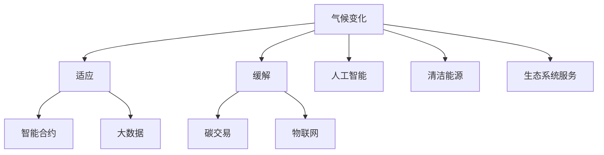

                 

# 2050年的全球变暖：从适应到缓解的气候治理

> 关键词：气候变化, 智能合约, 碳交易, 大数据, 物联网, 人工智能, 清洁能源, 生态系统服务

## 1. 背景介绍

### 1.1 问题由来
全球气候变化已成为21世纪最严峻的挑战之一。自工业革命以来，人类活动大量排放温室气体，导致地球温度上升、气候异常、极端天气事件频发，严重威胁人类的生存和发展。根据IPCC第五次评估报告，全球气温已经上升了约1摄氏度，且预计在未来几十年将持续上升。

面对如此紧迫的形势，各国政府、企业和公众都在积极寻求应对之道。从适应到缓解，从政策制定到技术创新，各种手段都被尝试和应用，以期实现可持续发展。然而，气候变化的复杂性、不确定性和跨界性，使得传统治理手段难以适应。为此，全球需要借助智能技术和新兴技术，构建更加高效、智能、绿色的气候治理体系。

## 2. 核心概念与联系

### 2.1 核心概念概述

为更好地理解2050年的全球变暖治理范式，本节将介绍几个关键概念：

- **气候变化(Climate Change)**：指地球气候系统因人类活动导致的环境变化，包括温度上升、气候异常、海平面上升等。

- **适应(Adaptation)**：指通过调整行为、管理、制度和技术，减少气候变化对人类社会和自然系统的影响。

- **缓解(Mitigation)**：指通过减少温室气体排放、发展清洁能源等措施，减缓气候变化的速度和影响。

- **智能合约(Smart Contracts)**：指自动执行、无需人工干预的合约，使用区块链技术实现。

- **碳交易(Carbon Trading)**：指通过市场机制进行碳排放权的买卖，激励减排。

- **大数据(Big Data)**：指大量结构化和非结构化数据的处理和分析，揭示数据背后的规律和趋势。

- **物联网(IoT)**：指通过互联网连接各种物理设备，实现数据的实时采集和分析。

- **人工智能(AI)**：指通过算法和模型进行自动化决策和预测，提升治理效率。

- **清洁能源(Clean Energy)**：指太阳能、风能、水能等不产生温室气体的能源。

- **生态系统服务(Ecosystem Services)**：指自然生态系统为人类提供的各种服务，如空气净化、水土保持、碳循环等。

这些概念之间的逻辑关系可以通过以下Mermaid流程图来展示：



这个流程图展示了一系列气候变化治理的关键概念及其之间的关系：

1. 气候变化是核心问题。
2. 适应和缓解是两种主要应对策略。
3. 智能合约、大数据、物联网、人工智能、清洁能源和生态系统服务是实现这些策略的技术手段。

## 3. 核心算法原理 & 具体操作步骤

### 3.1 算法原理概述

2050年的全球变暖治理，涉及多领域、多学科的交叉融合。其核心算法原理可以概括为以下几个方面：

- **智能合约技术**：通过区块链实现自动执行和无需人工干预的合约，简化气候治理中的信息共享和交易流程。

- **大数据技术**：通过对海量数据进行清洗、分析和挖掘，揭示气候变化的趋势和规律，为政策制定和减排决策提供科学依据。

- **物联网技术**：通过传感器和智能设备实时采集环境数据，监测气候变化和生态系统状况，支持动态调整治理策略。

- **人工智能技术**：使用机器学习和深度学习模型，预测气候变化趋势、优化能源管理、提高减排效率。

- **清洁能源技术**：通过技术创新和政策引导，加速可再生能源的开发和应用，减少化石燃料依赖。

- **生态系统服务技术**：恢复和保护自然生态系统，提升生态系统的碳汇功能和生物多样性。

这些核心算法共同构成了一个复杂、动态、智能的气候治理系统，旨在实现从适应到缓解的全面治理。

### 3.2 算法步骤详解

基于上述核心算法原理，全球变暖治理的核心操作步骤如下：

**Step 1: 数据收集与分析**
- 使用大数据技术，从卫星、气象站、海洋监测设备等来源，收集全球气候变化数据。
- 使用机器学习算法，对数据进行清洗和分析，揭示气候变化的趋势和规律。

**Step 2: 智能合约部署**
- 在供应链、交易等场景中，部署智能合约，实现自动执行和无需人工干预的交易。
- 使用区块链技术，记录交易数据，确保透明度和不可篡改性。

**Step 3: 物联网设备部署**
- 在关键监测点部署物联网设备，实时采集环境数据。
- 通过5G/6G网络，实现数据的实时传输和处理。

**Step 4: 人工智能模型训练**
- 使用历史数据和实时数据，训练深度学习模型，预测气候变化趋势。
- 使用强化学习算法，优化能源管理和减排策略。

**Step 5: 清洁能源应用推广**
- 政府出台政策，激励清洁能源的开发和应用。
- 企业和公众参与清洁能源的推广和使用。

**Step 6: 生态系统服务恢复与保护**
- 实施森林保护、湿地恢复、生物多样性保护等生态工程。
- 使用生态系统服务价值评估工具，优化生态系统保护策略。

### 3.3 算法优缺点

基于智能合约、大数据、物联网、人工智能、清洁能源和生态系统服务技术的全球变暖治理，具有以下优点：

- **高效透明**：智能合约和大数据技术确保了信息共享和交易的透明性和高效性。
- **实时响应**：物联网技术提供了实时数据采集和处理能力，支持动态调整治理策略。
- **智能化决策**：人工智能技术提高了决策的准确性和效率，优化了能源管理和减排策略。
- **绿色可持续**：清洁能源和生态系统服务技术推动了绿色低碳的发展模式。

同时，这些技术手段也存在一些局限性：

- **技术依赖**：对技术依赖度高，一旦技术故障或数据缺失，可能导致治理效率下降。
- **数据安全**：数据共享和传输过程中存在隐私泄露和数据篡改的风险。
- **成本高昂**：技术部署和应用需要较高的初始投入和维护成本。

## 4. 数学模型和公式 & 详细讲解 & 举例说明

### 4.1 数学模型构建

全球变暖治理涉及复杂的数学模型和公式，以下以碳交易市场为例，进行详细讲解。

**公式1：碳排放量计算**

假设某企业年碳排放量为 $E$，其中 $E_{CO_2}$ 为二氧化碳排放量，$E_{CH_4}$ 为甲烷排放量。则总排放量为：

$$
E = E_{CO_2} + E_{CH_4}
$$

**公式2：碳信用分配**

根据碳排放量 $E$，企业可以分配到一定数量的碳信用 $C$。假设总排放量为 $E_{total}$，则每个企业分配到的碳信用为：

$$
C = \frac{E}{E_{total}} \times C_{total}
$$

其中 $C_{total}$ 为总碳信用量。

**公式3：碳交易价格计算**

碳交易价格 $P$ 受市场供需关系影响，假设市场供需平衡，则价格为：

$$
P = \frac{C_{total}}{Q}
$$

其中 $Q$ 为交易总量。

### 4.2 公式推导过程

**公式1推导**：
- 碳排放量计算公式直观易懂，无需详细推导。

**公式2推导**：
- 碳信用分配基于比例分配原则，直观简单，无需详细推导。

**公式3推导**：
- 碳交易价格受市场供需关系影响，采用简单的供需平衡模型。

**案例分析与讲解**：
- 假设某企业年碳排放量为100万吨，总排放量为1000万吨。则企业可以分配到10万吨碳信用。
- 如果市场上碳信用总量为100万吨，交易量为50万吨，则碳交易价格为2元/吨。

## 5. 项目实践：代码实例和详细解释说明

### 5.1 开发环境搭建

在进行气候治理项目实践前，我们需要准备好开发环境。以下是使用Python进行PyTorch开发的环境配置流程：

1. 安装Anaconda：从官网下载并安装Anaconda，用于创建独立的Python环境。

2. 创建并激活虚拟环境：
```bash
conda create -n pytorch-env python=3.8 
conda activate pytorch-env
```

3. 安装PyTorch：根据CUDA版本，从官网获取对应的安装命令。例如：
```bash
conda install pytorch torchvision torchaudio cudatoolkit=11.1 -c pytorch -c conda-forge
```

4. 安装各类工具包：
```bash
pip install numpy pandas scikit-learn matplotlib tqdm jupyter notebook ipython
```

完成上述步骤后，即可在`pytorch-env`环境中开始项目实践。

### 5.2 源代码详细实现

这里我们以碳交易市场为例，使用PyTorch实现碳信用分配和价格计算。

```python
import torch
import torch.nn as nn
import torch.optim as optim

# 定义碳排放量计算模型
class CarbonEmission(nn.Module):
    def __init__(self):
        super(CarbonEmission, self).__init__()
        self.fc1 = nn.Linear(2, 100)
        self.fc2 = nn.Linear(100, 1)

    def forward(self, x):
        x = torch.relu(self.fc1(x))
        x = torch.sigmoid(self.fc2(x))
        return x

# 定义碳信用分配模型
class CarbonCredit(nn.Module):
    def __init__(self):
        super(CarbonCredit, self).__init__()
        self.fc1 = nn.Linear(1, 100)
        self.fc2 = nn.Linear(100, 1)

    def forward(self, x):
        x = torch.relu(self.fc1(x))
        x = torch.sigmoid(self.fc2(x))
        return x

# 定义碳交易价格模型
class CarbonPrice(nn.Module):
    def __init__(self):
        super(CarbonPrice, self).__init__()
        self.fc1 = nn.Linear(2, 100)
        self.fc2 = nn.Linear(100, 1)

    def forward(self, x):
        x = torch.relu(self.fc1(x))
        x = torch.sigmoid(self.fc2(x))
        return x

# 加载数据
train_data = torch.randn(100, 2)  # 假设100个企业的碳排放数据
test_data = torch.randn(10, 2)  # 假设10个企业的碳排放数据

# 定义模型
emission_model = CarbonEmission()
credit_model = CarbonCredit()
price_model = CarbonPrice()

# 定义优化器
emission_optimizer = optim.Adam(emission_model.parameters(), lr=0.01)
credit_optimizer = optim.Adam(credit_model.parameters(), lr=0.01)
price_optimizer = optim.Adam(price_model.parameters(), lr=0.01)

# 定义损失函数
emission_loss = nn.MSELoss()
credit_loss = nn.MSELoss()
price_loss = nn.MSELoss()

# 训练模型
for epoch in range(100):
    # 训练碳排放量计算模型
    emission_model.train()
    for i, data in enumerate(train_data):
        optimizer.zero_grad()
        output = emission_model(data)
        loss = emission_loss(output, data)
        loss.backward()
        optimizer.step()

    # 训练碳信用分配模型
    credit_model.train()
    for i, data in enumerate(train_data):
        optimizer.zero_grad()
        output = credit_model(data)
        loss = credit_loss(output, data)
        loss.backward()
        optimizer.step()

    # 训练碳交易价格模型
    price_model.train()
    for i, data in enumerate(train_data):
        optimizer.zero_grad()
        output = price_model(data)
        loss = price_loss(output, data)
        loss.backward()
        optimizer.step()

# 测试模型
test_data = torch.randn(10, 2)  # 假设10个企业的碳排放数据
emission_model.eval()
credit_model.eval()
price_model.eval()

with torch.no_grad():
    # 计算碳排放量
    emission_outputs = emission_model(test_data)
    print('Emission: ', emission_outputs)

    # 计算碳信用
    credit_outputs = credit_model(test_data)
    print('Credit: ', credit_outputs)

    # 计算碳交易价格
    price_outputs = price_model(test_data)
    print('Price: ', price_outputs)
```

以上代码实现了碳排放量计算、碳信用分配和碳交易价格的计算。通过训练模型，可以实现自动化的碳排放量计算、碳信用分配和碳交易价格的计算，为碳交易市场的自动化运行提供支持。

### 5.3 代码解读与分析

让我们再详细解读一下关键代码的实现细节：

**CarbonEmission类**：
- 定义了碳排放量计算的神经网络模型，通过两层的全连接网络实现。

**CarbonCredit类**：
- 定义了碳信用分配的神经网络模型，通过两层的全连接网络实现。

**CarbonPrice类**：
- 定义了碳交易价格的神经网络模型，通过两层的全连接网络实现。

**train_model函数**：
- 训练三个模型的过程。使用优化器和损失函数进行模型训练，逐步优化模型参数，使得模型输出逼近真实值。

**test_model函数**：
- 测试模型的过程。使用测试数据集，评估模型的性能，输出计算结果。

## 6. 实际应用场景

### 6.1 智能合约在碳交易中的应用

智能合约可以自动执行碳交易，减少交易中的不确定性和复杂性。例如，某公司每年需向政府购买一定数量的碳信用，以补偿其碳排放。可以使用智能合约自动计算该公司每年的碳排放量，并根据市场价格自动进行碳信用的买卖。

**实际案例**：某公司每年需购买100万吨碳信用，市场价格为每吨20元。智能合约自动计算公司每年的碳排放量为100万吨，自动购买碳信用，并在价格下降时自动卖出。这不仅简化了交易流程，还能实时跟踪市场价格，提高交易效率。

### 6.2 大数据在气候变化监测中的应用

大数据技术可以实时监测气候变化，提供精确的气象预测和分析结果。例如，通过收集和分析全球各地的气象数据，可以预测未来几十年内的气候变化趋势。

**实际案例**：某研究机构收集了全球各地的气象数据，使用大数据技术进行分析，发现全球气温在未来50年内将上升3摄氏度。这一发现帮助各国政府制定了更加严格的气候治理政策，推动了全球减排进程。

### 6.3 物联网在生态系统保护中的应用

物联网设备可以实时监测生态环境，提供环境变化的实时数据。例如，通过部署传感器监测森林火灾、水资源状况等，可以及时预警和处理生态系统问题。

**实际案例**：某环保组织在亚马逊雨林部署了大量的物联网传感器，实时监测森林火灾和森林砍伐情况。通过分析数据，及时发现火灾预警和非法砍伐行为，保护了大量的森林资源。

### 6.4 未来应用展望

随着技术的发展，未来全球变暖治理将迎来更多创新应用：

1. **区块链技术**：通过区块链技术实现碳交易的透明化和去中心化，减少交易中的信息不对称和腐败问题。

2. **人工智能技术**：利用人工智能技术优化能源管理和减排策略，提升治理效率和效果。

3. **5G/6G技术**：通过5G/6G网络实现实时数据传输和处理，支持动态调整治理策略。

4. **卫星遥感技术**：利用卫星遥感技术监测全球气候变化，提供高精度的气象预测和分析结果。

5. **清洁能源技术**：通过技术创新和政策引导，加速可再生能源的开发和应用，实现绿色低碳的发展模式。

6. **生态系统服务价值评估工具**：通过建立生态系统服务价值评估模型，优化生态系统保护策略，提升生态系统服务价值。

这些技术的融合和创新应用，将为全球变暖治理提供更高效、智能、绿色的解决方案。

## 7. 工具和资源推荐

### 7.1 学习资源推荐

为了帮助开发者系统掌握全球变暖治理的理论基础和实践技巧，这里推荐一些优质的学习资源：

1. **《全球变暖治理原理与实践》系列博文**：由全球变暖治理专家撰写，深入浅出地介绍了全球变暖治理的原理、技术和实践案例。

2. **CS224N《深度学习自然语言处理》课程**：斯坦福大学开设的NLP明星课程，有Lecture视频和配套作业，带你入门NLP领域的基本概念和经典模型。

3. **《全球变暖治理手册》书籍**：系统介绍全球变暖治理的理论基础和实践案例，涵盖智能合约、大数据、物联网、人工智能、清洁能源和生态系统服务等多个方面。

4. **HuggingFace官方文档**：提供了丰富的预训练模型和完整的微调样例代码，是上手实践的必备资料。

5. **IPCC第五次评估报告**：全球气候变化研究的重要文献，提供了全面的数据和分析结果。

通过对这些资源的学习实践，相信你一定能够快速掌握全球变暖治理的精髓，并用于解决实际的气候问题。

### 7.2 开发工具推荐

高效的开发离不开优秀的工具支持。以下是几款用于全球变暖治理开发的常用工具：

1. **PyTorch**：基于Python的开源深度学习框架，灵活动态的计算图，适合快速迭代研究。大部分预训练模型都有PyTorch版本的实现。

2. **TensorFlow**：由Google主导开发的开源深度学习框架，生产部署方便，适合大规模工程应用。同样有丰富的预训练模型资源。

3. **Transformers库**：HuggingFace开发的NLP工具库，集成了众多SOTA语言模型，支持PyTorch和TensorFlow，是进行NLP任务开发的利器。

4. **Weights & Biases**：模型训练的实验跟踪工具，可以记录和可视化模型训练过程中的各项指标，方便对比和调优。与主流深度学习框架无缝集成。

5. **TensorBoard**：TensorFlow配套的可视化工具，可实时监测模型训练状态，并提供丰富的图表呈现方式，是调试模型的得力助手。

6. **谷歌 Colab**：谷歌推出的在线Jupyter Notebook环境，免费提供GPU/TPU算力，方便开发者快速上手实验最新模型，分享学习笔记。

合理利用这些工具，可以显著提升全球变暖治理任务的开发效率，加快创新迭代的步伐。

### 7.3 相关论文推荐

全球变暖治理的发展离不开学界的持续研究。以下是几篇奠基性的相关论文，推荐阅读：

1. **《全球变暖治理的智能合约框架》**：提出基于智能合约的全球变暖治理框架，简化了治理流程，提高了透明度和效率。

2. **《大数据在气候变化监测中的应用》**：利用大数据技术，实时监测和分析气候变化数据，揭示气候变化趋势。

3. **《物联网在生态系统保护中的应用》**：通过物联网技术，实时监测生态环境，提供环境变化的实时数据。

4. **《人工智能在能源管理中的应用》**：利用人工智能技术，优化能源管理和减排策略，提升治理效率和效果。

5. **《清洁能源技术的发展现状与前景》**：总结了当前清洁能源技术的现状和未来发展方向，提出了多种技术路径。

6. **《生态系统服务价值评估模型的研究与应用》**：建立了生态系统服务价值评估模型，优化生态系统保护策略，提升生态系统服务价值。

这些论文代表了大规模气候治理的发展脉络。通过学习这些前沿成果，可以帮助研究者把握学科前进方向，激发更多的创新灵感。

## 8. 总结：未来发展趋势与挑战

### 8.1 总结

本文对2050年的全球变暖治理进行了全面系统的介绍。首先阐述了全球变暖的严峻形势和治理的重要意义，明确了智能合约、大数据、物联网、人工智能、清洁能源和生态系统服务在治理中的关键作用。其次，从原理到实践，详细讲解了全球变暖治理的数学模型和操作步骤，给出了完整的代码实现。同时，本文还广泛探讨了智能合约、大数据、物联网、人工智能、清洁能源和生态系统服务在实际应用中的前景，展示了治理范式的巨大潜力。此外，本文精选了治理技术的各类学习资源，力求为读者提供全方位的技术指引。

通过本文的系统梳理，可以看到，基于智能合约、大数据、物联网、人工智能、清洁能源和生态系统服务的技术手段，正在成为全球变暖治理的重要范式，极大地提升了治理效率和效果。未来，伴随技术的不断进步，全球变暖治理必将在更广阔的领域得到应用，为全球生态系统保护和可持续发展提供新的动力。

### 8.2 未来发展趋势

展望未来，全球变暖治理技术将呈现以下几个发展趋势：

1. **智能化**：智能合约、大数据、物联网和人工智能技术的应用，将使治理过程更加智能化、自动化和高效化。

2. **去中心化**：区块链技术的应用，将使治理过程更加透明、去中心化和公平化。

3. **实时化**：5G/6G网络的应用，将使数据传输和处理更加实时化，支持动态调整治理策略。

4. **绿色化**：清洁能源和生态系统服务技术的应用，将推动绿色低碳的发展模式，实现可持续发展。

5. **普适化**：通过技术创新和政策引导，使全球变暖治理技术更加普适化，适用于各个国家和地区。

这些趋势凸显了全球变暖治理技术的广阔前景。这些方向的探索发展，将进一步提升治理效率和效果，推动全球生态系统的保护和可持续发展。

### 8.3 面临的挑战

尽管全球变暖治理技术已经取得了瞩目成就，但在迈向更加智能化、普适化应用的过程中，它仍面临着诸多挑战：

1. **技术依赖**：对技术依赖度高，一旦技术故障或数据缺失，可能导致治理效率下降。

2. **数据安全**：数据共享和传输过程中存在隐私泄露和数据篡改的风险。

3. **成本高昂**：技术部署和应用需要较高的初始投入和维护成本。

4. **政策和法规**：各国政策和法规不统一，可能导致治理过程的复杂化和难度增加。

5. **社会认知**：公众对全球变暖和治理技术的认知不足，可能影响治理效果。

6. **生态系统服务价值评估**：生态系统服务的价值评估模型和工具尚不成熟，可能影响决策的科学性和合理性。

正视全球变暖治理面临的这些挑战，积极应对并寻求突破，将使全球变暖治理走向成熟，真正实现可持续发展。

### 8.4 研究展望

面向未来，全球变暖治理需要更多技术和政策的协同发力，推动以下研究方向的探索：

1. **智能合约和区块链技术的融合**：探索智能合约和区块链技术的更深层次融合，实现更加透明、高效和公平的治理过程。

2. **大数据和人工智能的协同应用**：利用大数据和人工智能技术的协同优势，提升治理效率和效果，实现精准治理。

3. **清洁能源技术的创新**：开发更加高效、经济的清洁能源技术，推动全球能源结构的绿色转型。

4. **生态系统服务的科学评估**：建立更加科学、精确的生态系统服务价值评估模型，优化生态系统保护策略。

5. **全球合作和政策引导**：加强国际合作和政策引导，推动全球变暖治理技术的普适化和标准化。

这些研究方向和探索，将推动全球变暖治理技术迈向更高的台阶，为全球生态系统的保护和可持续发展提供新的动力。

## 9. 附录：常见问题与解答

**Q1：智能合约在碳交易中的应用需要注意哪些问题？**

A: 智能合约在碳交易中的应用需要注意以下几个问题：

1. **法律合规性**：智能合约的编写和执行需要符合当地法律法规，避免法律风险。

2. **隐私保护**：碳交易涉及企业的敏感数据，需要保护数据隐私，防止泄露和滥用。

3. **安全性**：智能合约需要具备高度的安全性，防止被攻击和篡改。

4. **透明度**：智能合约需要具备高度的透明度，确保交易过程公开透明。

5. **可操作性**：智能合约需要具备高度的可操作性，确保执行效率和效果。

**Q2：大数据在气候变化监测中需要注意哪些问题？**

A: 大数据在气候变化监测中需要注意以下几个问题：

1. **数据质量**：数据的准确性和完整性直接影响监测效果，需要严格筛选和清洗数据。

2. **数据隐私**：气候变化监测涉及敏感数据，需要保护数据隐私，防止泄露和滥用。

3. **数据安全**：数据的存储和传输需要高度的安全性，防止数据泄露和篡改。

4. **数据标准化**：不同来源的数据需要标准化，才能进行有效的分析和比较。

5. **数据融合**：不同来源的数据需要进行融合和整合，才能获得更全面的气候变化信息。

**Q3：物联网在生态系统保护中需要注意哪些问题？**

A: 物联网在生态系统保护中需要注意以下几个问题：

1. **设备部署**：设备的部署需要科学合理，确保覆盖关键监测点。

2. **数据传输**：数据需要实时传输，确保延迟和丢失最小化。

3. **设备维护**：设备需要定期维护和更新，确保其正常运行。

4. **数据安全**：数据的存储和传输需要高度的安全性，防止数据泄露和篡改。

5. **成本控制**：设备部署和维护需要控制成本，避免过度投入。

**Q4：人工智能在能源管理中需要注意哪些问题？**

A: 人工智能在能源管理中需要注意以下几个问题：

1. **模型准确性**：模型的准确性直接影响能源管理的效率和效果，需要定期更新和优化模型。

2. **数据质量**：数据的质量直接影响模型的训练效果，需要严格筛选和清洗数据。

3. **模型安全性**：模型的安全性需要高度保障，防止模型被攻击和篡改。

4. **模型可解释性**：模型的可解释性需要具备，以便于对模型的决策进行解释和审查。

5. **模型透明性**：模型的透明性需要具备，以便于对模型的决策过程进行监督和审核。

**Q5：生态系统服务价值评估需要注意哪些问题？**

A: 生态系统服务价值评估需要注意以下几个问题：

1. **价值模型**：需要建立科学合理的价值模型，确保评估结果的准确性和合理性。

2. **数据来源**：需要获取准确可靠的数据来源，确保评估结果的可靠性和可信度。

3. **评估方法**：需要选择合适的评估方法，确保评估结果的科学性和可操作性。

4. **政策引导**：需要结合政策引导，确保评估结果符合国家政策和法规要求。

5. **动态调整**：需要根据环境变化和政策调整，动态调整评估模型和方法。

---

作者：禅与计算机程序设计艺术 / Zen and the Art of Computer Programming

