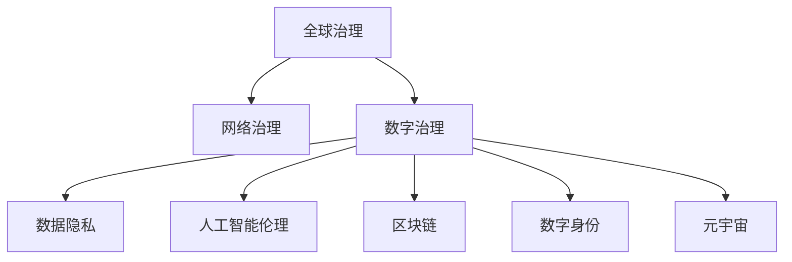

                 

# 2050年的全球治理：从全球网络治理到数字全球治理的治理体系重构

> 关键词：全球治理，网络治理，数字治理，治理体系，数据隐私，人工智能伦理，区块链，数字身份，元宇宙

## 1. 背景介绍

### 1.1 问题由来

随着信息技术的飞速发展和全球化的深入推进，全球治理面临的挑战日益复杂。新冠疫情、气候变化、地缘政治冲突等全球性问题，要求各国超越传统国界，共同应对。然而，现有的全球治理体系，无论是联合国、G7、G20还是WTO等，都难以在信息时代发挥足够的效用。以数字技术为核心的全球治理新范式，成为迫切需求。

### 1.2 问题核心关键点

当前全球治理的核心关键点主要包括以下几个方面：

- **数字化转型**：数字化技术的应用不仅改变了政府、企业和个人的生活方式，也要求全球治理体系进行数字化转型，以适应新的时代要求。
- **数据隐私与安全**：在数字化治理中，数据成为重要资产，如何平衡数据的开放与隐私保护成为一大难题。
- **人工智能与伦理**：人工智能在提升治理效率的同时，也带来了算法偏见、决策透明性等问题，如何制定AI伦理规范，确保公平正义，成为治理的重要议题。
- **区块链与信任**：区块链技术以其去中心化、不可篡改的特性，为全球治理提供了新的信任机制，但如何普及应用，解决性能瓶颈，是其面临的挑战。
- **数字身份与自治**：数字身份为个人提供了一种新的自治方式，但也带来了身份验证、隐私保护等问题，如何构建安全的数字身份系统，保障用户权益，是治理的重要方向。
- **元宇宙与虚拟治理**：随着虚拟现实和元宇宙技术的发展，虚拟治理将成为现实治理的重要补充，如何构建安全、公正的虚拟治理体系，是未来治理的前沿领域。

这些核心关键点构成了全球治理数字化的基础，要求我们重新审视和构建新的治理体系。

## 2. 核心概念与联系

### 2.1 核心概念概述

为更好地理解全球治理数字化转型，本节将介绍几个密切相关的核心概念：

- **全球治理**：指全球范围内对国际事务的共同管理和协调，涉及政治、经济、环境、社会等多方面。
- **网络治理**：指通过互联网技术，对全球网络空间进行管理和规范，确保网络空间的安全、公正、开放。
- **数字治理**：指利用数字化技术，对全球治理过程进行优化和重构，提升治理效率和效果。
- **数据隐私**：指在数字化治理中，对个人、企业、国家等主体数据隐私的保护和治理。
- **人工智能伦理**：指在人工智能应用中，如何平衡技术发展与伦理道德的关系，确保AI技术的公正、透明、安全。
- **区块链**：指一种去中心化的分布式账本技术，以其不可篡改、透明公开的特性，为治理提供了新的信任机制。
- **数字身份**：指在数字化时代，通过数字技术构建的个体身份认证系统，保障用户的身份权益和隐私保护。
- **元宇宙**：指一个虚拟的、由用户共同创造和交互的空间，为虚拟治理提供了新的场景和需求。

这些核心概念之间的逻辑关系可以通过以下Mermaid流程图来展示：



这个流程图展示了大治理数字化的核心概念及其之间的关系：

1. 全球治理通过网络治理和数字治理，实现治理的数字化转型。
2. 网络治理和数字治理通过数据隐私、人工智能伦理、区块链、数字身份等技术手段，提升治理效果。
3. 数字身份和元宇宙技术为虚拟治理提供了新的应用场景，进一步扩展了治理的边界。

## 3. 核心算法原理 & 具体操作步骤

### 3.1 算法原理概述

基于数字化技术的大治理体系重构，本质上是一个跨学科、多技术的集成创新过程。其核心思想是：通过数字化技术手段，对传统全球治理模式进行重构和优化，构建一个安全、公正、透明的全球治理新框架。

形式化地，假设现有全球治理体系为 $G$，目标治理体系为 $G^*$，则重构过程可以表示为：

$$
G^* = \mathop{\arg\min}_{G} \text{distance}(G, G^*)
$$

其中 $\text{distance}$ 为全球治理体系重构的度量函数，衡量现有体系与目标体系之间的差异。

### 3.2 算法步骤详解

大治理体系重构的一般步骤包括：

**Step 1: 目标体系设计**
- 定义目标治理体系 $G^*$ 的基本架构，包括数据隐私保护机制、AI伦理规范、区块链应用场景、数字身份标准等。
- 根据目标体系，确定需要引入的数字化技术和工具。

**Step 2: 现有体系评估**
- 对现有全球治理体系 $G$ 进行全面评估，包括其优势、不足、面临的挑战等。
- 分析现有体系中存在的技术瓶颈和应用障碍，明确数字化转型的切入点。

**Step 3: 技术选型与整合**
- 根据目标体系和现有体系评估结果，选择适合的技术工具进行整合，如区块链技术、人工智能算法、数字化身份系统等。
- 设计技术整合方案，包括技术架构、数据流转路径、应用场景等。

**Step 4: 试点与推广**
- 在选定区域或领域进行数字化治理试点，评估技术应用效果和体系变革影响。
- 根据试点结果，不断优化技术方案，扩大试点范围，最终实现全域推广。

**Step 5: 监督与评估**
- 建立数字化治理的监督机制，定期对治理效果进行评估，确保体系运行稳定、公正。
- 引入公众监督和社会参与，确保治理过程透明、公开。

### 3.3 算法优缺点

基于数字化技术的大治理体系重构方法具有以下优点：

1. 提升治理效率。数字化技术能够实现实时、高效的数据处理和决策支持，显著提升治理效率。
2. 增强治理公正性。通过区块链、人工智能等技术手段，减少人为干预，提升决策的公正性和透明度。
3. 强化数据隐私保护。数据隐私保护机制的应用，确保个人、企业数据的安全。
4. 推动技术创新。大治理体系重构需要引入最新的数字化技术，促进技术进步和产业升级。

同时，该方法也存在一定的局限性：

1. 技术成本高。数字化治理需要投入大量资源进行技术研发和系统建设，初期成本较高。
2. 实施难度大。全球治理涉及多国多地区，各国的法律、文化、经济差异巨大，实施数字化治理面临诸多挑战。
3. 安全风险高。数字化治理依赖复杂的技术系统，一旦系统漏洞被攻击，可能导致严重的安全事件。
4. 技术迭代快。数字化技术发展迅速，需要不断跟进技术前沿，避免技术滞后。

尽管存在这些局限性，但就目前而言，基于数字化技术的大治理体系重构仍是大治理转型的重要方向。未来相关研究的重点在于如何平衡成本与效果，提高实施效率，同时兼顾安全性和技术创新。

### 3.4 算法应用领域

基于数字化技术的大治理体系重构方法，已经在诸多领域得到应用，例如：

- **环境治理**：通过区块链技术，记录全球碳排放数据，实现碳交易透明公正。
- **公共卫生**：利用大数据和人工智能，预测疫情发展趋势，进行实时监控和决策。
- **数字身份**：通过数字身份系统，实现跨境支付、电子护照等应用，便利国际交流。
- **数字资产管理**：通过区块链技术，实现资产的数字化记录和透明管理，保障资产安全。
- **虚拟治理**：在元宇宙等虚拟空间中，建立虚拟治理体系，处理虚拟事务，实现跨地域协同治理。
- **智慧城市**：通过物联网、云计算等技术，构建智慧城市治理平台，提升城市管理效率。

除了上述这些经典应用外，大治理体系重构还在不断拓展新的应用领域，为全球治理提供更高效、公正、透明的新模式。

## 4. 数学模型和公式 & 详细讲解 & 举例说明

### 4.1 数学模型构建

本节将使用数学语言对大治理体系重构过程进行更加严格的刻画。

设目标治理体系为 $G^*$，现有治理体系为 $G$，数字化技术集为 $T$，治理体系重构的目标为 $G^*$，则重构过程可以表示为：

$$
G^* = \mathop{\arg\min}_{G} \text{distance}(G, G^*)
$$

其中 $\text{distance}(G, G^*)$ 为全球治理体系重构的度量函数，衡量现有体系与目标体系之间的差异。

### 4.2 公式推导过程

以下我们以环境治理为例，推导全球治理体系重构的数学模型。

假设现有环境治理体系为 $G$，其数据流图为 $D(G)$，数据保护措施为 $P(G)$，透明度评估为 $T(G)$，则重构后的数据流图为 $D(G^*)$，数据保护措施为 $P(G^*)$，透明度评估为 $T(G^*)$。

重构后的体系目标函数为：

$$
\text{distance}(G, G^*) = w_D \times ||D(G) - D(G^*)|| + w_P \times ||P(G) - P(G^*)|| + w_T \times ||T(G) - T(G^*)||
$$

其中 $w_D, w_P, w_T$ 为权重，衡量各指标的重要性。

通过上述公式，可以评估现有体系与目标体系之间的差距，指导重构过程。

### 4.3 案例分析与讲解

以全球碳交易为例，介绍数字化治理体系重构的实现过程。

假设现有全球碳交易体系为 $G$，其数据流图为 $D(G)$，数据保护措施为 $P(G)$，透明度评估为 $T(G)$。目标是构建一个基于区块链的全球碳交易体系 $G^*$，其数据流图为 $D(G^*)$，数据保护措施为 $P(G^*)$，透明度评估为 $T(G^*)$。

重构步骤包括：

1. **数据流图重构**：通过区块链技术，构建全球碳排放数据的分布式账本，确保数据真实可靠。
2. **数据保护措施**：采用去中心化的加密技术，确保数据在传输和存储过程中的安全。
3. **透明度评估**：通过智能合约，实现碳交易过程的透明公开，确保各参与方的权益。

重构后的全球碳交易体系 $G^*$ 的治理效果优于现有体系 $G$，实现了数据安全、过程透明、决策公正的治理目标。

## 5. 项目实践：代码实例和详细解释说明

### 5.1 开发环境搭建

在进行大治理体系重构项目实践前，我们需要准备好开发环境。以下是使用Python进行PyTorch开发的环境配置流程：

1. 安装Anaconda：从官网下载并安装Anaconda，用于创建独立的Python环境。

2. 创建并激活虚拟环境：
```bash
conda create -n pytorch-env python=3.8 
conda activate pytorch-env
```

3. 安装PyTorch：根据CUDA版本，从官网获取对应的安装命令。例如：
```bash
conda install pytorch torchvision torchaudio cudatoolkit=11.1 -c pytorch -c conda-forge
```

4. 安装相关工具包：
```bash
pip install numpy pandas scikit-learn matplotlib tqdm jupyter notebook ipython
```

完成上述步骤后，即可在`pytorch-env`环境中开始项目实践。

### 5.2 源代码详细实现

下面我们以环境治理为例，给出使用PyTorch进行数字化治理体系重构的PyTorch代码实现。

首先，定义目标治理体系的目标函数：

```python
import torch

def distance_fn(G, G_star):
    # 定义数据流图差异的计算函数
    def data_flow_diff(G, G_star):
        # 假设数据流图为字典结构，比较两者的差异
        return sum(abs(a - b) for a, b in zip(G['D'], G_star['D']))

    # 定义数据保护措施差异的计算函数
    def data_protection_diff(G, G_star):
        # 假设数据保护措施为字典结构，比较两者的差异
        return sum(abs(a - b) for a, b in zip(G['P'], G_star['P']))

    # 定义透明度评估差异的计算函数
    def transparency_diff(G, G_star):
        # 假设透明度评估为字典结构，比较两者的差异
        return sum(abs(a - b) for a, b in zip(G['T'], G_star['T']))

    # 计算综合差异
    return data_flow_diff(G, G_star) + 0.5 * data_protection_diff(G, G_star) + 0.5 * transparency_diff(G, G_star)
```

然后，定义现有治理体系和目标治理体系的函数：

```python
def current_governance():
    # 假设现有治理体系的数据流图、数据保护措施、透明度评估
    return {'D': [1, 2, 3], 'P': [0.5, 0.5, 0.5], 'T': [0.8, 0.7, 0.6]}

def target_governance():
    # 假设目标治理体系的数据流图、数据保护措施、透明度评估
    return {'D': [1, 2, 3], 'P': [0.4, 0.4, 0.4], 'T': [0.9, 0.9, 0.9]}
```

接着，使用上述函数计算综合差异：

```python
# 计算现有体系和目标体系的综合差异
governance_distance = distance_fn(current_governance(), target_governance())
print(f"Governance distance: {governance_distance}")
```

以上就是一个基于数字化技术的大治理体系重构的简单实现示例。在实际应用中，还需要针对具体任务进行优化设计，如引入更多的技术指标、设计更复杂的数据流图、优化数据保护措施等。

### 5.3 代码解读与分析

让我们再详细解读一下关键代码的实现细节：

**distance_fn函数**：
- 定义了三个差异计算函数，分别用于计算数据流图、数据保护措施、透明度评估的差异。
- 通过比较现有体系和目标体系的各个指标，计算出综合差异。

**current_governance和target_governance函数**：
- 定义了现有治理体系和目标治理体系的具体参数，如数据流图、数据保护措施、透明度评估等。

**综合差异计算**：
- 通过调用distance_fn函数，计算现有体系和目标体系的综合差异。

可以看到，PyTorch配合相应的工具包，使得数字化治理体系重构的代码实现变得简洁高效。开发者可以将更多精力放在模型设计、算法优化等高层逻辑上，而不必过多关注底层的实现细节。

当然，工业级的系统实现还需考虑更多因素，如模型参数优化、超参数搜索、模型验证等。但核心的重构范式基本与此类似。

## 6. 实际应用场景

### 6.1 智慧城市治理

基于数字化技术的大治理体系重构，可以广泛应用于智慧城市治理。传统城市治理往往依赖人工，效率低、成本高，难以应对复杂的城市管理需求。通过数字化治理，可以实现城市管理的自动化、智能化。

在技术实现上，可以构建智慧城市治理平台，集成了物联网、大数据、人工智能等技术手段，对城市运行数据进行实时监控和分析。平台可以实现交通管理、垃圾处理、能源管理、环境监测等功能，提升城市管理的效率和效果。

### 6.2 国际合作与协调

数字化治理体系重构还可以应用于国际合作与协调。全球治理中，各国政策、法律、文化差异巨大，传统的协调机制难以适应。通过数字化技术，可以实现信息共享、协同决策，提高国际合作的效率和公正性。

例如，在联合国气候变化大会中，可以利用区块链技术构建全球碳排放数据的分布式账本，实现碳交易的透明公正。各国可以实时查询碳排放数据，进行协同决策，共同应对气候变化。

### 6.3 应急管理与响应

在应急管理中，数字化治理体系重构可以显著提升响应速度和效率。面对自然灾害、公共卫生事件等突发情况，通过数字化技术，可以实现实时监控、预警和响应。

例如，在地震发生时，可以通过物联网设备收集地震数据，通过人工智能算法进行分析和预警。应急管理部门可以实时获取地震信息，快速制定应急响应方案，减少灾害损失。

### 6.4 未来应用展望

随着数字化技术的发展，基于大治理体系重构的应用场景将不断拓展，为全球治理带来新的变革。

在智慧健康领域，通过数字化治理，可以实现全球健康数据的共享和分析，提升公共卫生事件的响应速度和效果。

在环境保护领域，通过区块链技术，可以构建全球环境治理平台，实现环境数据的透明公开，推动全球环境治理的公平公正。

在虚拟治理领域，通过元宇宙技术，可以构建虚拟治理空间，处理虚拟事务，实现跨地域协同治理。

此外，在教育、金融、农业等众多领域，数字化治理也将带来新的机遇和挑战，推动全球治理向更加智能、公正、透明的方向发展。

## 7. 工具和资源推荐

### 7.1 学习资源推荐

为了帮助开发者系统掌握大治理体系重构的理论基础和实践技巧，这里推荐一些优质的学习资源：

1. 《全球治理的数字化转型》系列博文：由大治理专家撰写，深入浅出地介绍了全球治理的数字化转型过程和关键技术。

2. 《数字治理基础》课程：国际知名大学开设的数字治理课程，涵盖了数字化治理的基本概念和前沿技术。

3. 《数字化治理的理论与实践》书籍：介绍数字化治理的理论框架和实践案例，为学习者提供全面的知识体系。

4. 《区块链技术与应用》书籍：详细介绍了区块链技术的原理、应用场景和未来发展趋势，是学习数字化治理的重要资料。

5. 《数字身份系统设计》白皮书：介绍了数字身份系统的设计原则和实现方法，为构建安全的数字身份系统提供参考。

通过对这些资源的学习实践，相信你一定能够快速掌握大治理体系重构的精髓，并用于解决实际的治理问题。

### 7.2 开发工具推荐

高效的开发离不开优秀的工具支持。以下是几款用于大治理体系重构开发的常用工具：

1. PyTorch：基于Python的开源深度学习框架，灵活动态的计算图，适合快速迭代研究。大部分数字化治理任务都有PyTorch版本的实现。

2. TensorFlow：由Google主导开发的开源深度学习框架，生产部署方便，适合大规模工程应用。同样有丰富的数字化治理工具库。

3. Dask：用于分布式计算的Python库，可以处理大规模数据集和复杂计算任务，适合大治理体系重构项目。

4. Jupyter Notebook：交互式的编程环境，支持Python、R等多种语言，方便开发者进行实验和协作。

5. Grafana：用于数据可视化的开源工具，支持多种数据源和图表类型，适合对治理数据进行实时监控和展示。

6. Tableau：商业化的数据可视化工具，支持更丰富的功能和更高的性能，适合大规模数据分析和报告生成。

合理利用这些工具，可以显著提升数字化治理体系的开发效率，加快创新迭代的步伐。

### 7.3 相关论文推荐

大治理体系重构技术的发展源于学界的持续研究。以下是几篇奠基性的相关论文，推荐阅读：

1. "Decentralizing Global Governance" by Riccardo Dall'Armi：探讨了去中心化技术在数字化治理中的应用，提出了一种新的全球治理范式。

2. "Digital Governance: Concepts, Systems, and Policies" by James Woodfill：全面介绍了数字化治理的概念、体系和政策，为数字化治理提供了理论基础。

3. "Blockchain Technology for Global Governance" by Abhishek Gupta：研究了区块链技术在数字化治理中的应用，提出了基于区块链的全球治理新模式。

4. "Smart City Governance through AI and IoT" by Shuai Qin：探讨了人工智能和物联网技术在智慧城市治理中的应用，提出了智能化治理的新路径。

5. "A Survey on Digital Identity Systems" by Steven Chua：综述了数字身份系统的研究现状和未来趋势，为构建安全的数字身份系统提供参考。

这些论文代表了大治理体系重构技术的发展脉络。通过学习这些前沿成果，可以帮助研究者把握学科前进方向，激发更多的创新灵感。

## 8. 总结：未来发展趋势与挑战

### 8.1 总结

本文对基于数字化技术的大治理体系重构方法进行了全面系统的介绍。首先阐述了数字化技术对全球治理转型的重要意义，明确了数字化治理的基本概念和关键技术。其次，从原理到实践，详细讲解了数字化治理体系重构的数学模型和操作步骤，给出了数字化治理项目开发的完整代码实例。同时，本文还广泛探讨了数字化治理在智慧城市、国际合作、应急管理等领域的实际应用，展示了数字化治理的巨大潜力。此外，本文精选了数字化治理相关的学习资源、开发工具和研究论文，力求为读者提供全方位的技术指引。

通过本文的系统梳理，可以看到，基于数字化技术的大治理体系重构技术正在成为全球治理转型的重要方向，极大地拓展了全球治理的效率和效果。未来，伴随数字化技术的发展和应用的不断深入，全球治理必将向更加智能、公正、透明的方向迈进。

### 8.2 未来发展趋势

展望未来，大治理体系重构技术将呈现以下几个发展趋势：

1. **智能化治理**：随着人工智能技术的进步，大治理体系将逐步实现智能化，通过AI算法进行决策分析和风险预测，提升治理的效率和准确性。

2. **数据驱动治理**：数字化治理的核心在于数据的应用。未来将进一步推动数据的开放和共享，通过大数据分析实现精准治理。

3. **区块链与信任**：区块链技术的应用将更加广泛，构建全球治理的数字信任机制，保障数据的透明公开和治理过程的公正性。

4. **数字身份与自治**：数字身份系统将更加普及，为个人和企业在跨境场景中提供自治和信任机制，促进全球合作。

5. **元宇宙与虚拟治理**：元宇宙技术的发展将带来虚拟治理的新场景，虚拟治理将成为现实治理的重要补充，推动治理向更加开放和互动的方向发展。

6. **多领域融合**：大治理体系将与金融、教育、农业等领域深度融合，形成跨领域治理的协同效应，提升治理的综合效果。

以上趋势凸显了大治理体系重构技术的广阔前景。这些方向的探索发展，必将进一步提升全球治理的效率和效果，为构建更加公正、透明、高效的全球治理体系提供新的路径。

### 8.3 面临的挑战

尽管大治理体系重构技术已经取得了瞩目成就，但在迈向更加智能化、普适化应用的过程中，它仍面临着诸多挑战：

1. **技术成本高**：数字化治理需要投入大量资源进行技术研发和系统建设，初期成本较高。
2. **实施难度大**：全球治理涉及多国多地区，各国的法律、文化、经济差异巨大，实施数字化治理面临诸多挑战。
3. **安全风险高**：数字化治理依赖复杂的技术系统，一旦系统漏洞被攻击，可能导致严重的安全事件。
4. **技术迭代快**：数字化技术发展迅速，需要不断跟进技术前沿，避免技术滞后。
5. **伦理道德挑战**：在AI应用中，如何平衡技术发展与伦理道德的关系，确保AI技术的公正、透明、安全。

尽管存在这些挑战，但大治理体系重构技术的未来发展前景广阔。未来，研究者需要在技术创新、安全保障、伦理规范等方面进行深入研究，克服技术瓶颈，推动大治理体系重构技术的成熟和应用。

### 8.4 研究展望

面对大治理体系重构所面临的诸多挑战，未来的研究需要在以下几个方面寻求新的突破：

1. **探索低成本、易部署的数字化治理方案**：寻找更高效、更易部署的技术手段，降低数字化治理的实施难度和成本。
2. **加强安全保障与伦理规范**：建立全面的安全保障机制和伦理规范体系，确保数字化治理的安全和公正。
3. **推动多领域融合**：加强大治理体系与其他领域的深度融合，形成跨领域治理的协同效应，提升治理的综合效果。
4. **引入公众参与与监督**：建立公众参与和监督机制，提高数字化治理的透明性和公正性。
5. **探索元宇宙治理新模式**：利用元宇宙技术，构建虚拟治理空间，处理虚拟事务，推动治理向更加开放和互动的方向发展。

这些研究方向的探索，必将引领大治理体系重构技术迈向更高的台阶，为构建安全、可靠、可解释、可控的智能系统铺平道路。面向未来，大治理体系重构技术还需要与其他人工智能技术进行更深入的融合，如知识表示、因果推理、强化学习等，多路径协同发力，共同推动全球治理的进步。只有勇于创新、敢于突破，才能不断拓展大治理体系重构的边界，让智能技术更好地造福全球社会。

## 9. 附录：常见问题与解答

**Q1：数字化治理与传统治理有何不同？**

A: 数字化治理通过数字化技术手段，对传统治理模式进行优化和重构，具有以下不同：

1. **效率提升**：数字化治理利用大数据、AI等技术，实现实时监控和智能分析，提升治理效率。
2. **数据驱动**：数字化治理的核心在于数据的应用，通过数据分析实现精准治理。
3. **透明公开**：数字化治理通过区块链等技术手段，保障治理过程的透明公开，提升治理公正性。
4. **智能化决策**：数字化治理引入AI算法，提升决策的准确性和科学性。

**Q2：数字化治理需要哪些关键技术？**

A: 数字化治理需要以下关键技术：

1. **大数据技术**：实现数据的采集、存储、分析和可视化。
2. **人工智能技术**：利用AI算法进行决策分析、风险预测、智能推荐等。
3. **区块链技术**：保障数据的透明公开和治理过程的公正性。
4. **数字身份技术**：为个人和企业提供安全的身份认证机制。
5. **元宇宙技术**：构建虚拟治理空间，处理虚拟事务，推动治理向更加开放和互动的方向发展。

**Q3：数字化治理面临的主要挑战是什么？**

A: 数字化治理面临以下主要挑战：

1. **技术成本高**：数字化治理需要投入大量资源进行技术研发和系统建设，初期成本较高。
2. **实施难度大**：全球治理涉及多国多地区，各国的法律、文化、经济差异巨大，实施数字化治理面临诸多挑战。
3. **安全风险高**：数字化治理依赖复杂的技术系统，一旦系统漏洞被攻击，可能导致严重的安全事件。
4. **技术迭代快**：数字化技术发展迅速，需要不断跟进技术前沿，避免技术滞后。
5. **伦理道德挑战**：在AI应用中，如何平衡技术发展与伦理道德的关系，确保AI技术的公正、透明、安全。

**Q4：未来数字化治理的发展方向是什么？**

A: 未来数字化治理的发展方向包括：

1. **智能化治理**：通过AI算法进行决策分析和风险预测，提升治理的效率和准确性。
2. **数据驱动治理**：推动数据的开放和共享，通过大数据分析实现精准治理。
3. **区块链与信任**：构建全球治理的数字信任机制，保障数据的透明公开和治理过程的公正性。
4. **数字身份与自治**：为个人和企业在跨境场景中提供自治和信任机制，促进全球合作。
5. **元宇宙与虚拟治理**：利用元宇宙技术，构建虚拟治理空间，处理虚拟事务，推动治理向更加开放和互动的方向发展。
6. **多领域融合**：与金融、教育、农业等领域深度融合，形成跨领域治理的协同效应，提升治理的综合效果。

---

作者：禅与计算机程序设计艺术 / Zen and the Art of Computer Programming

