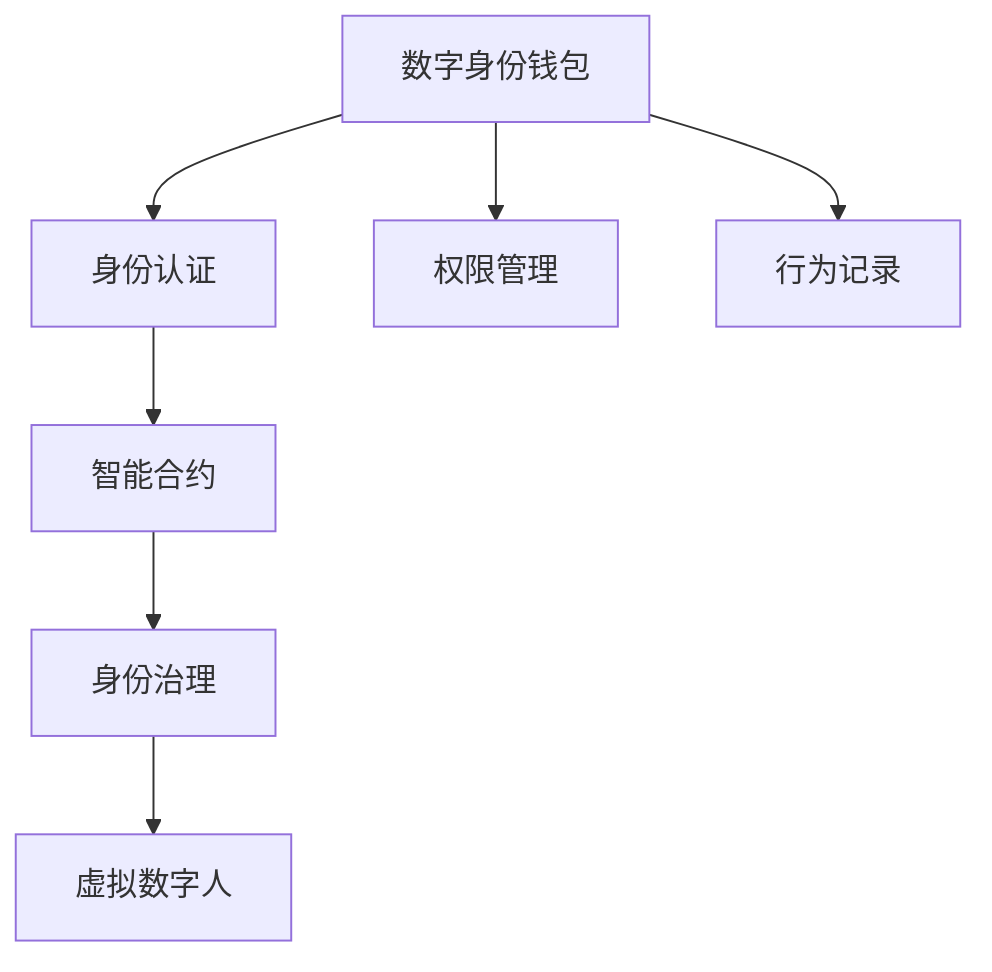

                 

# 2050年的数字身份：从数字身份钱包到虚拟数字人的身份数字化

在即将到来的未来，数字身份将不仅仅是一个简单的电子证书，而将成为人类自身身份数字化的一个关键节点。随着技术的不断演进，我们将见证从数字身份钱包到虚拟数字人身份数字化的一系列变革。本文将从背景介绍、核心概念与联系、核心算法原理与操作步骤、数学模型与公式讲解、项目实践与代码实例、实际应用场景、工具与资源推荐、总结与未来发展趋势、常见问题与解答等方面，全面深入地探讨这一主题。

## 1. 背景介绍

### 1.1 问题由来

数字身份是现代信息技术与社会的融合产物，它为人们在虚拟世界中的行为提供了身份验证的依据。随着互联网和人工智能的迅猛发展，数字身份的应用领域越来越广泛，从在线支付到社会交往，从身份认证到智能合约，数字身份无处不在。然而，目前的数字身份系统还存在诸多问题，如安全性不足、隐私泄露、身份假冒等问题，无法满足未来社会的需要。

因此，未来数字身份的演进方向之一，是将身份认证、权限管理、行为记录等模块集于一体，构建更为全面、安全的身份体系。在此基础上，进一步发展虚拟数字人技术，使其具备复杂的行为能力，并在虚拟世界中扮演真实人类角色的身份，为人类提供更加丰富、灵活的数字化生活体验。

### 1.2 问题核心关键点

未来数字身份的核心关键点包括以下几个方面：
1. **身份认证**：实现高效的、分布式的身份认证机制，支持多层次、多维度的身份验证。
2. **数据隐私**：在保证身份安全的同时，保护个人隐私，避免数据泄露。
3. **智能合约**：实现身份与行为的绑定，通过智能合约确保身份的真实性和行为的合规性。
4. **虚拟数字人**：构建具备复杂智能行为的虚拟数字人，让其在虚拟世界中扮演人类角色，提升用户体验。
5. **身份治理**：建立有效的身份治理体系，确保身份系统公平、透明、可控。

### 1.3 问题研究意义

未来数字身份的研究对于构建安全、高效、智能的虚拟社会具有重要意义。通过深入研究数字身份的理论和实践，我们可以：
1. 提升网络安全性和隐私保护水平，构建可信的虚拟社会。
2. 增强虚拟数字人的智能水平，提升用户体验和参与感。
3. 促进身份治理机制的完善，确保数字身份系统的公平、透明和可控。

## 2. 核心概念与联系

### 2.1 核心概念概述

为更好地理解未来数字身份系统的构建，本节将介绍几个关键概念：

- **数字身份钱包**：一种集成了身份认证、权限管理和行为记录等功能的应用，提供便捷的身份验证和管理。
- **虚拟数字人**：通过人工智能技术构建的具备复杂智能行为的虚拟角色，能够在虚拟世界中执行各种任务，如互动、交流、服务等。
- **身份认证**：验证用户身份的过程，确保只有合法用户才能访问系统资源。
- **智能合约**：一种通过代码实现、自动执行的合约，可以自动执行和验证身份和行为。
- **身份治理**：管理数字身份系统的规则、政策和操作，确保系统的公平、透明和可控。

这些核心概念之间通过以下Mermaid流程图进行联系：



这个流程图展示了数字身份系统的核心组件及其之间的联系：

1. 数字身份钱包作为基础，集成身份认证、权限管理和行为记录功能。
2. 身份认证和权限管理支持智能合约的执行，确保身份和行为的真实性和合规性。
3. 智能合约通过自动执行和验证，进一步管理身份和行为，提升系统的效率和安全性。
4. 身份治理系统对整个身份系统进行监管和管理，确保系统的公平、透明和可控。
5. 虚拟数字人通过身份和智能合约系统，在虚拟世界中扮演人类角色，提升用户体验。

## 3. 核心算法原理 & 具体操作步骤

### 3.1 算法原理概述

未来数字身份系统的构建，本质上是基于分布式身份认证技术、人工智能技术和智能合约技术的融合应用。其核心算法原理包括以下几个方面：

1. **分布式身份认证**：通过区块链等分布式技术，实现去中心化的身份认证机制，确保身份信息的安全性和不可篡改性。
2. **人工智能技术**：利用深度学习、自然语言处理等技术，构建具备复杂智能行为的虚拟数字人，提升其在虚拟世界中的表现。
3. **智能合约**：通过代码实现身份和行为的自动验证和执行，确保身份的真实性和行为的合规性。

### 3.2 算法步骤详解

基于上述核心算法原理，未来数字身份系统的构建包括以下几个关键步骤：

**Step 1: 设计身份认证机制**
- 选择合适的分布式身份认证技术，如基于区块链的Merkle Tree结构，实现去中心化的身份认证。
- 设计身份认证流程，确保身份信息的安全性和隐私性。

**Step 2: 构建智能合约系统**
- 设计智能合约模型，通过代码实现身份和行为的自动验证和执行。
- 实现身份与行为的绑定，确保身份的真实性和行为的合规性。

**Step 3: 开发虚拟数字人**
- 选择合适的虚拟数字人框架，如OpenAI的GPT系列模型。
- 通过微调等技术，提升虚拟数字人的智能水平和行为能力。

**Step 4: 实施身份治理**
- 建立公平、透明、可控的身份治理机制，确保系统的稳定性和安全性。
- 通过规则和政策管理，提升系统的合规性和可信度。

**Step 5: 集成与部署**
- 将数字身份钱包、智能合约系统和虚拟数字人集成到统一平台上。
- 在实际应用中，进行系统部署和功能测试，确保系统稳定运行。

### 3.3 算法优缺点

未来数字身份系统的构建有以下优点：
1. 安全性高：通过区块链等分布式技术，确保身份信息的安全性和不可篡改性。
2. 隐私保护：设计合适的隐私保护机制，保护用户隐私，防止数据泄露。
3. 智能高效：利用人工智能技术提升虚拟数字人的智能水平和行为能力，提升用户体验。
4. 自动执行：通过智能合约实现身份和行为的自动验证和执行，提升系统的效率和安全性。

同时，该系统也存在一些局限性：
1. 技术复杂：需要多种技术的融合应用，实现难度较大。
2. 成本较高：需要投入大量的研发和部署成本。
3. 用户接受度：用户对新技术的接受度和信任度需要逐步提升。
4. 安全风险：分布式身份认证和智能合约系统的安全性仍然需要进一步提升。

### 3.4 算法应用领域

未来数字身份系统已经在多个领域得到了应用，包括但不限于以下几个方面：

- **金融服务**：通过数字身份系统进行用户身份验证和行为记录，确保金融交易的安全性和合规性。
- **医疗健康**：利用数字身份系统进行患者身份验证和行为记录，确保医疗数据的安全性和隐私性。
- **社交媒体**：通过数字身份系统进行用户身份验证和行为记录，提升平台的安全性和用户体验。
- **虚拟现实**：利用虚拟数字人技术，提升虚拟现实系统的互动性和沉浸感。
- **智慧城市**：通过数字身份系统进行城市管理和服务，提升城市治理的智能化水平。

## 4. 数学模型和公式 & 详细讲解 & 举例说明

### 4.1 数学模型构建

本节将使用数学语言对未来数字身份系统的构建过程进行更加严格的刻画。

记数字身份钱包为 $W$，智能合约系统为 $C$，虚拟数字人为 $V$，身份治理系统为 $G$。假设 $W$、$C$、$V$ 和 $G$ 的输入分别为 $I_{W}$、$I_{C}$、$I_{V}$ 和 $I_{G}$，输出分别为 $O_{W}$、$O_{C}$、$O_{V}$ 和 $O_{G}$。

定义数字身份系统的总损失函数为 $\mathcal{L}$，由分布式身份认证损失、智能合约执行损失、虚拟数字人智能提升损失和身份治理损失组成：

$$
\mathcal{L} = \alpha\mathcal{L}_{WA} + \beta\mathcal{L}_{VA} + \gamma\mathcal{L}_{VC} + \delta\mathcal{L}_{VG}
$$

其中 $\alpha$、$\beta$、$\gamma$ 和 $\delta$ 为权重系数，控制不同模块的重要程度。

### 4.2 公式推导过程

以下我们以分布式身份认证为例，推导基于区块链的Merkle Tree结构的设计思路。

假设区块链上的每个区块包含一组交易记录，记为 $T$。在Merkle Tree结构中，每个区块被编码为一个唯一的哈希值，记为 $H_i$。则整个区块链的哈希值 $H$ 可以通过递归计算得到：

$$
H = \text{MerkleRoot}(T_1, T_2, \ldots, T_n)
$$

其中 $\text{MerkleRoot}$ 表示计算Merkle树的根节点。通过这种方式，区块链上的每个区块都可以被唯一标识，且任何区块的变化都会引起整个区块链的哈希值变化，从而实现分布式身份认证。

### 4.3 案例分析与讲解

以医疗健康领域的数字身份系统为例，分析其构建过程和应用。

假设某医院希望建立一个基于区块链的数字身份系统，用于患者的身份验证和医疗数据的安全存储和共享。设计如下：

1. **身份认证机制**：采用基于区块链的Merkle Tree结构，确保患者身份信息的安全性和不可篡改性。
2. **智能合约系统**：设计智能合约，用于记录患者的医疗数据，确保数据的隐私性和安全性。
3. **虚拟数字人**：利用GPT系列模型，构建虚拟医生助手，提升医生的诊疗效率和患者的体验。
4. **身份治理**：建立公平、透明的身份治理机制，确保系统的合规性和可信度。

通过上述技术手段，该数字身份系统能够实现以下功能：

- **身份验证**：患者通过区块链上的身份信息进行验证，确保身份的真实性。
- **数据共享**：医生通过智能合约系统共享患者的医疗数据，确保数据的安全性和隐私性。
- **智能诊疗**：虚拟医生助手根据患者的历史医疗数据和实时检查结果，提供个性化的诊疗建议。
- **身份管理**：身份治理系统对系统进行监管和管理，确保系统的稳定性和安全性。

## 5. 项目实践：代码实例和详细解释说明

### 5.1 开发环境搭建

在进行数字身份系统构建实践前，我们需要准备好开发环境。以下是使用Python进行区块链开发的常见环境配置流程：

1. 安装Anaconda：从官网下载并安装Anaconda，用于创建独立的Python环境。

2. 创建并激活虚拟环境：
```bash
conda create -n blockchain-env python=3.8 
conda activate blockchain-env
```

3. 安装必要的Python库和工具：
```bash
pip install web3 pysha3 cryptography
```

4. 配置区块链环境：
- 下载并配置相应的区块链节点，如Ethereum或Hyperledger Fabric。
- 配置区块链的私钥和账户。

完成上述步骤后，即可在`blockchain-env`环境中开始区块链开发实践。

### 5.2 源代码详细实现

下面我们以基于Hyperledger Fabric的数字身份系统为例，给出完整的区块链开发代码实现。

首先，编写智能合约：

```python
import hashlib
from shapelib.sha3 import digest

class SmartContract:
    def __init__(self, chaincode):
        self.chaincode = chaincode
        self.chain = self.loadChain()
        self.blockchain = self.chain.get('blockchain')
        self.region = self.blockchain['region']

    def loadChain(self):
        with open(self.chaincode, 'r') as file:
            chain = json.load(file)
        return chain

    def getBlockchainHash(self, data):
        return hashlib.sha256(data.encode('utf-8')).hexdigest()

    def addBlock(self, transaction):
        new_block = self.blockchain.copy()
        new_block['block'].append(transaction)
        new_hash = self.getBlockchainHash(json.dumps(new_block))
        new_block['previous_hash'] = new_hash
        new_block['timestamp'] = datetime.now().strftime('%Y-%m-%d %H:%M:%S')
        self.blockchain = new_block

    def writeBlockchain(self):
        with open(self.chaincode, 'w') as file:
            json.dump(self.blockchain, file)
```

然后，编写区块链节点：

```python
from flask import Flask, request, jsonify
from smartContract import SmartContract
import json
from flask_cors import CORS

app = Flask(__name__)
CORS(app)

contract = SmartContract('smartContract.json')

@app.route('/addTransaction', methods=['POST'])
def addTransaction():
    data = request.get_json()
    tx = {
        'id': 'Transaction' + str(len(contract.blockchain['block'])),
        'from': data['from'],
        'to': data['to'],
        'amount': data['amount'],
        'timestamp': datetime.now().strftime('%Y-%m-%d %H:%M:%S')
    }
    contract.addBlock(tx)
    contract.writeBlockchain()
    return jsonify({'status': 'success', 'transaction': tx})

@app.route('/getBlockchain', methods=['GET'])
def getBlockchain():
    return jsonify(contract.blockchain)

if __name__ == '__main__':
    app.run(host='0.0.0.0', port=5000)
```

最后，启动区块链节点：

```bash
python blockchain_node.py
```

### 5.3 代码解读与分析

让我们再详细解读一下关键代码的实现细节：

**SmartContract类**：
- `__init__`方法：初始化智能合约对象，加载区块链数据。
- `loadChain`方法：从文件中加载区块链数据。
- `getBlockchainHash`方法：使用SHA-256哈希算法计算区块哈希值。
- `addBlock`方法：向区块链添加新区块，并更新区块链数据。
- `writeBlockchain`方法：将区块链数据写入文件。

**区块链节点**：
- `addTransaction`方法：处理交易请求，将交易记录添加到区块链中。
- `getBlockchain`方法：返回整个区块链数据。

**Flask应用**：
- `addTransaction`路由：处理添加交易请求，将交易记录添加到区块链中。
- `getBlockchain`路由：返回整个区块链数据。

通过上述代码实现，我们可以构建一个简单的区块链数字身份系统。通过智能合约，实现了交易记录的自动验证和执行，提升了系统的安全性。通过Flask应用，实现了区块链数据的可视化和交互，方便用户使用和操作。

## 6. 实际应用场景

### 6.1 智能医疗健康

基于数字身份系统的智能医疗健康应用，可以实现患者的身份验证和医疗数据的安全存储和共享。通过区块链技术，确保患者身份信息和医疗数据的不可篡改性和隐私性。利用智能合约系统，实现数据的自动验证和执行，提升医疗系统的智能化水平。

**具体应用场景**：
- **患者身份验证**：患者通过区块链上的身份信息进行验证，确保身份的真实性。
- **医疗数据共享**：医生通过智能合约系统共享患者的医疗数据，确保数据的安全性和隐私性。
- **智能诊疗**：虚拟医生助手根据患者的历史医疗数据和实时检查结果，提供个性化的诊疗建议。

**技术实现**：
- **身份认证机制**：采用基于区块链的Merkle Tree结构，确保患者身份信息的安全性和不可篡改性。
- **智能合约系统**：设计智能合约，用于记录患者的医疗数据，确保数据的隐私性和安全性。
- **虚拟数字人**：利用GPT系列模型，构建虚拟医生助手，提升医生的诊疗效率和患者的体验。
- **身份治理**：建立公平、透明的身份治理机制，确保系统的合规性和可信度。

### 6.2 虚拟现实

基于数字身份系统的虚拟现实应用，可以实现虚拟数字人在虚拟世界中的行为和交互。通过区块链技术，确保虚拟数字人身份的真实性和不可篡改性。利用智能合约系统，实现虚拟数字人行为的自动验证和执行，提升虚拟现实系统的智能化水平。

**具体应用场景**：
- **虚拟角色互动**：虚拟数字人通过区块链上的身份信息进行验证，确保身份的真实性。
- **行为记录和分析**：智能合约系统记录虚拟数字人的行为，确保行为的可追溯性和合规性。
- **智能互动**：虚拟数字人通过智能合约系统执行行为，实现与用户的互动和交流。

**技术实现**：
- **身份认证机制**：采用基于区块链的Merkle Tree结构，确保虚拟数字人身份信息的安全性和不可篡改性。
- **智能合约系统**：设计智能合约，用于记录虚拟数字人的行为，确保行为的可追溯性和合规性。
- **虚拟数字人**：利用深度学习等技术，构建具备复杂智能行为的虚拟数字人，提升其在虚拟世界中的表现。
- **身份治理**：建立公平、透明的身份治理机制，确保系统的合规性和可信度。

## 7. 工具和资源推荐

### 7.1 学习资源推荐

为了帮助开发者系统掌握数字身份系统的理论基础和实践技巧，这里推荐一些优质的学习资源：

1. **《区块链技术概论》**：详细介绍了区块链的基本概念和应用，适合初学者入门。
2. **《智能合约技术与实践》**：介绍了智能合约的基本原理和应用，结合实际案例进行讲解。
3. **《人工智能技术导论》**：介绍了人工智能技术的基本概念和应用，适合深入学习。
4. **《虚拟现实技术与应用》**：介绍了虚拟现实技术的基本概念和应用，适合入门学习。
5. **《分布式身份认证技术与应用》**：介绍了分布式身份认证的基本概念和应用，适合深入学习。

通过对这些资源的学习实践，相信你一定能够快速掌握数字身份系统的精髓，并用于解决实际的NLP问题。

### 7.2 开发工具推荐

高效的开发离不开优秀的工具支持。以下是几款用于区块链开发的常用工具：

1. **Pytho**：基于Python的开源深度学习框架，适合快速迭代研究。
2. **TensorFlow**：由Google主导开发的开源深度学习框架，适合大规模工程应用。
3. **Web3.js**：用于开发区块链应用的开源库，支持Ethereum等区块链平台。
4. **Hyperledger Fabric**：由IBM主导开发的区块链平台，支持企业级应用。
5. **Flask**：轻量级的Web应用框架，适合开发RESTful API。

合理利用这些工具，可以显著提升区块链数字身份系统的开发效率，加快创新迭代的步伐。

### 7.3 相关论文推荐

数字身份系统的发展源于学界的持续研究。以下是几篇奠基性的相关论文，推荐阅读：

1. **《区块链技术原理与实践》**：介绍区块链技术的基本原理和应用，适合入门学习。
2. **《智能合约技术研究与应用》**：介绍智能合约技术的基本原理和应用，适合深入学习。
3. **《分布式身份认证技术研究》**：介绍分布式身份认证技术的基本原理和应用，适合深入学习。
4. **《虚拟现实技术原理与实践》**：介绍虚拟现实技术的基本原理和应用，适合入门学习。
5. **《数字身份认证系统研究》**：介绍数字身份认证系统的基本原理和应用，适合深入学习。

这些论文代表了大语言模型微调技术的发展脉络。通过学习这些前沿成果，可以帮助研究者把握学科前进方向，激发更多的创新灵感。

## 8. 总结：未来发展趋势与挑战

### 8.1 总结

本文对未来数字身份系统的构建进行了全面系统的介绍。首先阐述了数字身份系统的研究背景和意义，明确了数字身份系统在构建安全、高效、智能虚拟社会中的重要价值。其次，从原理到实践，详细讲解了数字身份系统的构建过程，给出了完整的区块链开发代码实现。同时，本文还广泛探讨了数字身份系统在智能医疗健康、虚拟现实等多个领域的应用前景，展示了数字身份系统的广阔前景。

通过本文的系统梳理，可以看到，未来数字身份系统已经进入了一个全新的发展阶段，其构建将带来深远的社会和科技变革。数字身份系统将极大地提升网络安全和隐私保护水平，构建可信的虚拟社会，增强虚拟数字人的智能水平，提升用户体验。然而，数字身份系统的构建也面临诸多挑战，需要在安全性、隐私保护、智能水平、治理机制等方面不断探索和优化。

### 8.2 未来发展趋势

展望未来，数字身份系统的构建将呈现以下几个发展趋势：

1. **智能水平提升**：利用人工智能技术提升虚拟数字人的智能水平和行为能力，实现更复杂、更灵活的智能交互。
2. **跨平台互通**：实现不同区块链平台和数字身份系统之间的互通，提升系统的兼容性和可扩展性。
3. **隐私保护增强**：采用隐私保护技术，确保数字身份系统中用户数据的隐私性和安全性。
4. **治理机制完善**：建立公平、透明、可控的身份治理机制，确保系统的合规性和可信度。
5. **多模态融合**：将区块链、人工智能、智能合约等技术进行融合，构建更为全面、智能的数字身份系统。

### 8.3 面临的挑战

尽管数字身份系统的构建已经取得了显著进展，但在迈向更加智能化、普适化应用的过程中，仍面临诸多挑战：

1. **技术复杂性**：数字身份系统的构建需要多种技术的融合应用，实现难度较大。
2. **资源消耗**：大规模区块链系统对算力、存储和带宽等资源消耗较大，需要优化资源使用。
3. **隐私保护**：数字身份系统需要确保用户数据的隐私性和安全性，防止数据泄露。
4. **安全风险**：分布式身份认证和智能合约系统的安全性仍然需要进一步提升。
5. **用户接受度**：用户对新技术的接受度和信任度需要逐步提升。

### 8.4 研究展望

面对数字身份系统构建所面临的种种挑战，未来的研究需要在以下几个方面寻求新的突破：

1. **隐私保护技术**：开发更加高效的隐私保护技术，确保用户数据的隐私性和安全性。
2. **智能合约优化**：优化智能合约的设计和执行，提升系统的效率和安全性。
3. **分布式身份认证**：探索更加高效的分布式身份认证技术，确保身份信息的安全性和不可篡改性。
4. **智能行为提升**：提升虚拟数字人的智能水平和行为能力，实现更复杂、更灵活的智能交互。
5. **治理机制优化**：建立公平、透明、可控的身份治理机制，确保系统的合规性和可信度。

## 9. 附录：常见问题与解答

**Q1：数字身份系统的安全性如何保障？**

A: 数字身份系统的安全性保障主要通过以下几个方面实现：
1. **分布式身份认证**：采用区块链等分布式技术，确保身份信息的安全性和不可篡改性。
2. **智能合约执行**：通过代码实现身份和行为的自动验证和执行，提升系统的安全性。
3. **隐私保护机制**：采用数据加密、访问控制等技术，确保用户数据的隐私性和安全性。
4. **身份治理机制**：建立公平、透明的身份治理机制，确保系统的合规性和可信度。

**Q2：数字身份系统如何处理大规模数据？**

A: 数字身份系统可以采用分布式存储和计算技术，将大规模数据分散存储在多个节点上，并通过分布式计算加速数据的处理和分析。同时，可以采用数据压缩、数据分割等技术，优化数据存储和传输，提升系统的性能和可扩展性。

**Q3：数字身份系统在跨平台互通方面有何挑战？**

A: 数字身份系统在跨平台互通方面面临的主要挑战包括：
1. **技术差异**：不同区块链平台和智能合约系统的技术差异较大，难以实现无缝互通。
2. **标准不一**：各平台的标准和规范不一致，难以统一管理和操作。
3. **数据共享**：不同平台之间的数据共享和互操作性较差，难以实现数据的无缝流动。

为解决这些问题，可以采用跨链技术、联盟链技术等，实现不同平台之间的互通和协作。同时，可以制定统一的标准和规范，促进平台的互操作性。

**Q4：数字身份系统在智能行为提升方面有何技术手段？**

A: 数字身份系统可以通过以下技术手段提升虚拟数字人的智能水平和行为能力：
1. **深度学习技术**：利用深度学习技术，构建具备复杂智能行为的虚拟数字人，提升其在虚拟世界中的表现。
2. **自然语言处理技术**：利用自然语言处理技术，使虚拟数字人具备自然语言理解和生成能力，实现更智能的交互。
3. **知识图谱技术**：利用知识图谱技术，构建虚拟数字人的知识库，提升其在虚拟世界中的推理和决策能力。

通过这些技术手段，虚拟数字人将具备更丰富的智能能力和更复杂的交互方式，提升用户体验和应用场景的丰富度。

**Q5：数字身份系统在治理机制优化方面有何措施？**

A: 数字身份系统的治理机制优化主要通过以下几个方面实现：
1. **规则制定**：制定公平、透明的身份治理规则，确保系统的合规性和可信度。
2. **监管机制**：建立监管机制，对系统进行实时监控和审核，确保系统的稳定性和安全性。
3. **用户反馈**：建立用户反馈机制，收集用户的意见和建议，不断优化系统的设计和操作。
4. **技术更新**：持续更新系统技术，确保系统的先进性和稳定性。

通过这些措施，数字身份系统将建立公平、透明、可控的治理机制，提升系统的合规性和可信度。

---

作者：禅与计算机程序设计艺术 / Zen and the Art of Computer Programming

