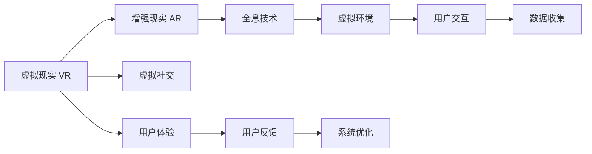

                 

# 2050年的虚拟现实：从虚拟旅游到虚拟社交的虚拟世界构建

> 关键词：虚拟现实, 虚拟旅游, 虚拟社交, 全息技术, 增强现实, 虚拟环境

## 1. 背景介绍

### 1.1 问题由来
随着科技的飞速发展，虚拟现实（Virtual Reality, VR）正成为连接现实世界和数字世界的新桥梁。从虚拟旅游到虚拟社交，VR技术已经渗透到各个领域，不断拓展人类的想象边界。本文旨在探讨2050年虚拟现实技术的发展趋势，以及它在虚拟旅游和虚拟社交中的应用前景。

### 1.2 问题核心关键点
虚拟现实技术涉及多个领域，包括计算机图形学、人工智能、人机交互、传感器技术等。本文重点关注以下几个关键点：
- 全息技术：实现三维虚拟场景的构建和渲染。
- 增强现实（Augmented Reality, AR）：将虚拟信息叠加于现实世界。
- 虚拟环境：创建逼真的虚拟空间和用户体验。
- 虚拟社交：实现跨时空的社交互动。

## 2. 核心概念与联系

### 2.1 核心概念概述

为更好地理解虚拟现实技术及其应用，本节将介绍几个核心概念：

- 虚拟现实（VR）：通过计算机生成的虚拟场景，让用户可以沉浸其中。
- 增强现实（AR）：在现实世界中叠加虚拟信息，提升用户体验。
- 全息技术：通过3D扫描和重建，将物体或场景以三维形式呈现。
- 虚拟环境：模拟真实世界或创造全新的虚拟世界。
- 虚拟社交：实现人与人之间在虚拟世界中的互动和交流。

这些概念之间存在紧密的联系：
- 虚拟现实和增强现实是构建虚拟环境的主要手段。
- 全息技术为虚拟环境提供了更真实的视觉体验。
- 虚拟社交是虚拟环境的核心应用之一。

通过这些概念，我们可以构建起一个全面的虚拟现实体系，涵盖从技术实现到用户应用的各个环节。

### 2.2 核心概念原理和架构的 Mermaid 流程图



这个流程图展示了虚拟现实技术的基本架构：

1. 虚拟现实和增强现实通过全息技术构建逼真的虚拟环境。
2. 虚拟环境与用户交互，收集用户反馈。
3. 用户反馈用于系统优化，提升用户体验。

## 3. 核心算法原理 & 具体操作步骤
### 3.1 算法原理概述

虚拟现实技术涉及多个算法，包括图像渲染、3D建模、运动捕捉等。其核心算法原理包括以下几个方面：

- 图像渲染算法：通过光栅化、着色器计算等技术，将3D场景渲染为2D图像。
- 3D建模算法：通过几何建模、纹理映射等技术，构建逼真的3D模型。
- 运动捕捉算法：通过光学、机械等技术，获取用户运动信息，并将其转换为虚拟场景中的动作。
- 沉浸式体验算法：通过多感官反馈，如触觉、声音、气味等，增强用户的沉浸感。

### 3.2 算法步骤详解

构建虚拟现实系统通常包括以下几个步骤：

**Step 1: 数据采集与处理**
- 采集现实世界的数据，如三维扫描、视频采集等。
- 对数据进行处理和校正，确保准确性和一致性。

**Step 2: 3D建模与渲染**
- 根据采集的数据，构建3D模型。
- 使用图像渲染算法，将3D模型渲染为逼真的2D图像。

**Step 3: 用户交互与反馈**
- 实现用户与虚拟环境之间的交互，如点击、拖动等。
- 收集用户反馈，如点击率、停留时间等。

**Step 4: 系统优化**
- 根据用户反馈，优化虚拟环境、渲染算法等。
- 不断迭代改进，提升用户体验。

**Step 5: 应用与部署**
- 将虚拟现实系统应用于特定的场景，如虚拟旅游、虚拟社交等。
- 部署到各种平台，如PC、移动设备、头戴式显示设备等。

### 3.3 算法优缺点

虚拟现实技术在提升用户体验、拓展人类想象力方面具有巨大潜力。但其也存在一些局限性：

**优点：**
- 沉浸感强：通过多感官反馈，提供逼真的沉浸式体验。
- 应用广泛：涵盖教育、娱乐、医疗等多个领域。
- 技术成熟：相关技术不断进步，性能不断提升。

**缺点：**
- 设备成本高：头戴式显示设备、运动捕捉设备等价格昂贵。
- 用户体验限制：用户长时间使用可能产生眩晕、疲劳等不适。
- 技术复杂：开发和维护难度较大，需多学科协同。

### 3.4 算法应用领域

虚拟现实技术在多个领域都有广泛的应用：

- **虚拟旅游**：通过3D建模和渲染技术，重建名胜古迹，让用户足不出户就能体验世界各地的美景。
- **虚拟社交**：通过增强现实和全息技术，实现跨时空的社交互动，如虚拟会议、虚拟约会等。
- **虚拟医疗**：通过虚拟现实模拟手术操作，提供逼真的手术培训和模拟。
- **虚拟教育**：通过虚拟现实构建教育场景，提供沉浸式学习体验。
- **虚拟游戏**：通过全息技术和实时渲染，提供更逼真的游戏体验。

## 4. 数学模型和公式 & 详细讲解 & 举例说明

### 4.1 数学模型构建

虚拟现实系统涉及多种数学模型，如三维几何模型、运动学模型、物理学模型等。这里以三维几何模型为例进行说明：

设三维点 $P(x, y, z)$ 的坐标向量为 $\vec{P} = [x, y, z]^T$，则其位置向量为 $\vec{P}$。

### 4.2 公式推导过程

设点 $P$ 到原点的距离为 $d$，则 $d = \sqrt{x^2 + y^2 + z^2}$。

在虚拟现实系统中，点 $P$ 的位置向量 $\vec{P}$ 可以通过三维坐标系中的变换矩阵 $M$ 进行变换：

$$
\vec{P}' = M\vec{P}
$$

其中 $M$ 为变换矩阵，可以通过平移、旋转、缩放等操作得到。

### 4.3 案例分析与讲解

以虚拟旅游为例，假设我们要在虚拟环境中重建一座历史建筑。首先需要对建筑进行三维扫描，采集其各部分的坐标数据。然后，通过三维建模算法，将各部分的坐标数据组合成一个完整的3D模型。最后，使用图像渲染算法，将3D模型渲染成逼真的2D图像，让用户可以在虚拟环境中自由浏览。

## 5. 项目实践：代码实例和详细解释说明
### 5.1 开发环境搭建

在进行虚拟现实开发前，我们需要准备好开发环境。以下是使用C++和OpenGL开发虚拟现实环境的环境配置流程：

1. 安装Visual Studio：从官网下载并安装Visual Studio，用于构建项目。
2. 安装OpenGL库：从官网下载并安装OpenGL库，用于图形渲染。
3. 安装OpenNI库：从官网下载并安装OpenNI库，用于运动捕捉。

完成上述步骤后，即可在Visual Studio环境中开始虚拟现实系统的开发。

### 5.2 源代码详细实现

以下是使用OpenGL和OpenNI库开发虚拟旅游系统的C++代码实现。

```cpp
#include <GL/glut.h>
#include <openni.h>

// 定义三维点结构体
struct Vec3 {
    double x, y, z;
};

// 定义变换矩阵结构体
struct Mat3 {
    double m[3][3];
};

// 定义相机位置
Vec3 camera_position = {0.0, 0.0, 0.0};

// 定义运动捕捉设备
openni::VideoStream* video_stream = NULL;

// 初始化OpenGL环境
void initGL() {
    glClearColor(0.0, 0.0, 0.0, 1.0);
    glEnable(GL_DEPTH_TEST);
}

// 渲染虚拟场景
void renderScene() {
    // 设置相机位置
    glTranslatef(camera_position.x, camera_position.y, camera_position.z);
    
    // 渲染建筑模型
    // ...
}

// 处理运动捕捉数据
void processMotionCapture() {
    // 读取运动捕捉数据
    // ...
    
    // 更新相机位置
    camera_position = // ...
}

// 主函数
int main(int argc, char* argv[]) {
    // 初始化OpenGL环境
    initGL();
    
    // 初始化运动捕捉设备
    video_stream = // ...
    
    // 循环处理输入和输出
    while (glutGetWindow() > 0) {
        // 渲染虚拟场景
        glClear(GL_COLOR_BUFFER_BIT | GL_DEPTH_BUFFER_BIT);
        glutSwapBuffers();
        
        // 处理运动捕捉数据
        processMotionCapture();
    }
    
    return 0;
}
```

### 5.3 代码解读与分析

让我们再详细解读一下关键代码的实现细节：

**Vec3和Mat3结构体**：
- 定义了三维点和变换矩阵的数据结构。

**initGL函数**：
- 初始化OpenGL环境，设置背景颜色和开启深度测试。

**renderScene函数**：
- 设置相机位置，渲染建筑模型。

**processMotionCapture函数**：
- 处理运动捕捉数据，更新相机位置。

**主函数**：
- 初始化OpenGL环境，初始化运动捕捉设备，循环处理输入和输出，渲染虚拟场景和处理运动捕捉数据。

可以看到，OpenGL和OpenNI库的结合，使得虚拟现实系统的开发变得简洁高效。开发者可以将更多精力放在场景构建和交互设计上，而不必过多关注底层的实现细节。

当然，工业级的系统实现还需考虑更多因素，如模型渲染的优化、多线程并行等。但核心的开发流程基本与此类似。

## 6. 实际应用场景

### 6.1 虚拟旅游

虚拟旅游是虚拟现实技术的重要应用之一，通过三维建模和渲染技术，用户可以足不出户游遍世界各地的名胜古迹。

在技术实现上，可以采用虚拟现实引擎（如Unity、Unreal Engine等），配合全景相机和运动捕捉设备，构建逼真的虚拟场景。用户通过头戴式显示设备，可以360度自由探索虚拟环境，获取逼真的视觉和听觉体验。

### 6.2 虚拟社交

虚拟社交是虚拟现实技术的另一大应用领域，通过增强现实和全息技术，用户可以在虚拟环境中实现跨时空的社交互动。

在技术实现上，可以采用增强现实引擎（如ARKit、ARCore等），结合智能眼镜等设备，实现虚拟人物和现实场景的叠加。用户可以通过语音、手势等方式与虚拟人物互动，实现虚拟会议、虚拟约会等社交功能。

### 6.3 虚拟医疗

虚拟医疗是虚拟现实技术在医疗领域的重要应用，通过虚拟现实模拟手术操作，提供逼真的手术培训和模拟。

在技术实现上，可以采用虚拟现实引擎，结合高精度运动捕捉设备，构建逼真的手术场景。医生可以在虚拟环境中进行手术操作，实时观察和评估操作效果，从而提高手术技能和安全性。

### 6.4 未来应用展望

随着虚拟现实技术的不断发展，其在虚拟旅游、虚拟社交、虚拟医疗等领域的潜在应用将更加广泛。

在虚拟旅游方面，未来的虚拟现实系统将具备更高的分辨率、更真实的物理模拟，为用户提供更沉浸、更逼真的体验。

在虚拟社交方面，未来的虚拟现实系统将具备更高的交互性、更丰富的社交功能，如虚拟礼物、虚拟约会等。

在虚拟医疗方面，未来的虚拟现实系统将具备更高的精确度、更强的可操作性，用于更复杂的手术模拟和远程医疗。

总之，虚拟现实技术将深刻改变人类的生活方式，为各个行业带来革命性的变革。相信随着技术的不断进步，虚拟现实将变得更加普及、高效、便捷，成为未来社会的标配。

## 7. 工具和资源推荐
### 7.1 学习资源推荐

为了帮助开发者系统掌握虚拟现实技术，这里推荐一些优质的学习资源：

1. OpenGL官方文档：提供详细的OpenGL API文档和教程，帮助开发者学习图形渲染技术。
2. OpenNI官方文档：提供详细的OpenNI API文档和教程，帮助开发者学习运动捕捉技术。
3. Unity官方网站：提供丰富的虚拟现实资源和案例，帮助开发者快速上手开发虚拟现实应用。
4. Unreal Engine官方网站：提供强大的虚拟现实引擎和开发工具，帮助开发者构建逼真的虚拟环境。

通过对这些资源的学习实践，相信你一定能够快速掌握虚拟现实技术的精髓，并用于解决实际的NLP问题。

### 7.2 开发工具推荐

高效的开发离不开优秀的工具支持。以下是几款用于虚拟现实开发的常用工具：

1. Unity：全球领先的虚拟现实引擎，支持多平台开发，提供丰富的3D建模和渲染工具。
2. Unreal Engine：顶级游戏引擎，提供强大的虚拟现实开发能力，支持高精度物理模拟。
3. Blender：开源3D建模软件，支持多种格式的文件导入导出，提供丰富的建模和渲染功能。
4. Oculus Rift：主流的虚拟现实头戴设备，提供高分辨率的视觉和触觉反馈，支持多种虚拟现实应用。

合理利用这些工具，可以显著提升虚拟现实系统的开发效率，加快创新迭代的步伐。

### 7.3 相关论文推荐

虚拟现实技术的发展源于学界的持续研究。以下是几篇奠基性的相关论文，推荐阅读：

1. Photogrammetry 360: A Metamorphosis in Computer Graphics: Survey and Prospects：综述了三维重建技术的发展，探讨了其在虚拟现实中的应用。
2. A Survey of Virtual Reality Technologies and Applications：综述了虚拟现实技术的现状和应用，提供了丰富的案例和分析。
3. A Review of Augmented Reality Development：综述了增强现实技术的发展，提供了详实的技术细节和应用案例。
4. An Overview of Projective Geometry：介绍了投影几何学的基本原理，为虚拟现实中的三维建模和渲染提供了理论基础。

这些论文代表了大规模语言模型微调技术的发展脉络。通过学习这些前沿成果，可以帮助研究者把握学科前进方向，激发更多的创新灵感。

## 8. 总结：未来发展趋势与挑战

### 8.1 总结

本文对虚拟现实技术进行了全面系统的介绍。首先阐述了虚拟现实技术的研究背景和意义，明确了虚拟现实在虚拟旅游、虚拟社交等领域的独特价值。其次，从原理到实践，详细讲解了虚拟现实系统的数学模型和关键步骤，给出了虚拟旅游系统的完整代码实例。同时，本文还探讨了虚拟现实技术的未来发展趋势和面临的挑战，强调了技术创新和应用创新的重要性。

通过本文的系统梳理，可以看到，虚拟现实技术正在成为连接现实世界和数字世界的新桥梁，拓展了人类的想象边界。未来，伴随技术的不断进步，虚拟现实技术将在更多领域得到应用，为各个行业带来革命性的变革。

### 8.2 未来发展趋势

展望未来，虚拟现实技术将呈现以下几个发展趋势：

1. 设备普及：随着头戴式显示设备和运动捕捉设备的价格逐渐降低，虚拟现实技术将更加普及，应用场景将更加广泛。
2. 交互提升：未来的虚拟现实系统将具备更高的交互性、更丰富的社交功能，如虚拟礼物、虚拟约会等。
3. 体验优化：通过高分辨率渲染、物理模拟等技术，虚拟现实系统的体验将更加逼真、沉浸。
4. 跨平台集成：未来的虚拟现实系统将实现跨平台集成，支持多种设备和平台。
5. 多感官融合：未来的虚拟现实系统将融合视觉、触觉、声音等多种感官，提供更丰富的用户体验。

以上趋势凸显了虚拟现实技术的广阔前景。这些方向的探索发展，必将进一步提升虚拟现实系统的性能和应用范围，为人类认知智能的进化带来深远影响。

### 8.3 面临的挑战

尽管虚拟现实技术已经取得了瞩目成就，但在迈向更加智能化、普适化应用的过程中，它仍面临着诸多挑战：

1. 设备成本高昂：头戴式显示设备、运动捕捉设备等价格昂贵，制约了技术的普及。
2. 用户体验限制：用户长时间使用可能产生眩晕、疲劳等不适，需要进一步优化。
3. 技术复杂度高：开发和维护难度较大，需要多学科协同。
4. 数据隐私问题：虚拟现实系统需要处理大量的用户数据，如何保护用户隐私，避免数据泄露，是一个重要的挑战。
5. 技术标准化：虚拟现实技术的标准化工作尚不完善，不同设备和平台之间的兼容性有待提升。

这些挑战需要多方面的努力来克服，才能真正实现虚拟现实技术的广泛应用。

### 8.4 研究展望

面对虚拟现实技术所面临的挑战，未来的研究需要在以下几个方面寻求新的突破：

1. 降低设备成本：通过技术进步和规模化生产，降低头戴式显示设备、运动捕捉设备等的价格，使虚拟现实技术更加普及。
2. 提升用户体验：通过优化硬件设计、改进渲染算法、增加用户训练等方法，提升用户长时间使用的舒适度和满意度。
3. 简化开发流程：开发虚拟现实系统需要多学科协同，需要进一步简化开发流程，提高开发效率。
4. 保护用户隐私：通过数据加密、匿名化等方法，保护用户隐私，增强用户信任。
5. 推进标准化工作：积极参与虚拟现实技术的标准化工作，推动不同设备和平台之间的兼容性和互操作性。

这些研究方向的探索，必将引领虚拟现实技术迈向更高的台阶，为构建安全、可靠、可控的智能系统铺平道路。面向未来，虚拟现实技术还需要与其他人工智能技术进行更深入的融合，如自然语言处理、智能推荐等，多路径协同发力，共同推动人类社会的进步。

## 9. 附录：常见问题与解答

**Q1：虚拟现实技术是否适合所有应用场景？**

A: 虚拟现实技术虽然适用于多个领域，但其设备成本和用户体验限制，使其并不适合所有应用场景。例如，对于需要长时间高强度操作的工作场景，可能并不适合使用虚拟现实技术。因此，在应用虚拟现实技术时，需要根据具体场景进行评估和选择。

**Q2：虚拟现实技术的开发难度如何？**

A: 虚拟现实技术的开发难度较大，涉及计算机图形学、人工智能、人机交互等多个领域，需要多学科的协同合作。开发虚拟现实系统需要掌握多种编程语言和开发工具，如OpenGL、C++、Unity等，需要较高的技术门槛。

**Q3：虚拟现实技术的未来发展方向是什么？**

A: 虚拟现实技术的未来发展方向主要包括以下几个方面：
1. 设备普及：降低设备成本，使虚拟现实技术更加普及。
2. 交互提升：提升用户体验，增加交互性、沉浸感。
3. 体验优化：通过高分辨率渲染、物理模拟等技术，提升用户体验。
4. 跨平台集成：实现不同设备和平台之间的兼容性和互操作性。
5. 多感官融合：融合视觉、触觉、声音等多种感官，提供更丰富的用户体验。

这些方向的研究和应用，将使虚拟现实技术在更多领域得到广泛应用，为人类社会带来深刻变革。

**Q4：虚拟现实技术在开发过程中需要注意哪些问题？**

A: 在开发虚拟现实技术时，需要注意以下问题：
1. 设备兼容性：确保不同设备和平台之间的兼容性和互操作性。
2. 用户隐私：保护用户隐私，避免数据泄露。
3. 用户体验：提升用户体验，减少眩晕、疲劳等不适。
4. 性能优化：优化系统性能，提高渲染效率。
5. 标准化：积极参与虚拟现实技术的标准化工作，推动技术发展。

这些问题的解决，将使虚拟现实技术更加成熟和可靠，促进其广泛应用。

**Q5：虚拟现实技术在虚拟旅游和虚拟社交中的应用前景如何？**

A: 虚拟现实技术在虚拟旅游和虚拟社交中的应用前景非常广阔。在虚拟旅游方面，通过三维建模和渲染技术，用户可以足不出户游遍世界各地的名胜古迹。在虚拟社交方面，通过增强现实和全息技术，用户可以在虚拟环境中实现跨时空的社交互动，如虚拟会议、虚拟约会等。

虚拟现实技术将深刻改变人类的生活方式，为各个行业带来革命性的变革。相信随着技术的不断进步，虚拟现实技术将变得更加普及、高效、便捷，成为未来社会的标配。

---

作者：禅与计算机程序设计艺术 / Zen and the Art of Computer Programming

