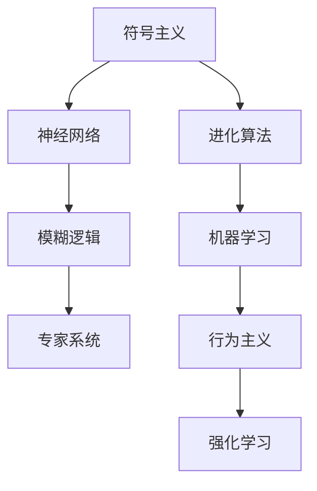

                 

## 1. 背景介绍

1956年夏天，约翰·麦卡锡、马文·明斯基、纳撒尼尔·罗切斯特、克劳德·香农和约翰·冯·诺依曼等计算机科学界的大师齐聚美国达特茅斯学院，举行了一场为期8周的学术会议，共同讨论“如何用机器模拟人类智能”。这场会议被公认为人工智能（AI）的诞生之地。

### 1.1 会议背景

在20世纪50年代，计算机科技取得了飞速发展。人们开始思考如何让机器模仿人类智能，以解决日益复杂的问题。1955年，麦卡锡在麻省理工学院成立了MIT人工智能实验室，积极推动这一领域的研究。1956年，明斯基邀请麦卡锡共同在达特茅斯学院举办了这次会议。

### 1.2 会议目的

此次会议的目的是为了提供一个学术交流平台，让各个领域的专家汇聚一堂，共同探讨机器智能的基本问题和潜在应用。会议期间，参与者讨论了各种与人工智能相关的主题，包括问题求解、机器学习、信息检索等。

### 1.3 会议成果

会议结束时，麦卡锡等人发表了关于“人工智能”定义的论文，首次将“人工智能”一词引入学术界。会议成果集中反映在1956年的达特茅斯会议报告中，这份报告被视为人工智能历史上的里程碑。

## 2. 核心概念与联系

### 2.1 核心概念概述

人工智能的核心概念包括：

- **符号主义**：使用符号和逻辑推理来模拟人类思维过程。
- **连接主义**：通过神经网络和分布式计算来模拟人类大脑的工作方式。
- **进化主义**：通过模拟生物进化过程来优化系统性能。
- **行为主义**：通过奖励和惩罚机制来训练机器学习行为。
- **模糊逻辑**：处理模糊和不确定性的逻辑系统。
- **机器学习**：让机器从数据中学习规律和模式。
- **专家系统**：通过规则库和推理机来模拟专家决策。

### 2.2 核心概念原理和架构的 Mermaid 流程图



## 3. 核心算法原理 & 具体操作步骤

### 3.1 算法原理概述

人工智能的算法原理主要围绕以下几个核心概念展开：

- **符号主义**：使用符号来表示知识，通过逻辑推理和演绎来解决问题。
- **神经网络**：通过模拟人脑神经元之间的连接和激活函数，让机器进行模式识别和学习。
- **进化算法**：模拟自然选择和遗传，通过不断迭代和交叉来优化算法性能。
- **机器学习**：利用算法让机器从数据中学习，通过模型训练来提高预测准确性。
- **专家系统**：构建规则库和推理机制，让机器模仿专家的决策过程。
- **行为主义**：通过奖励和惩罚机制，让机器学习行为。
- **强化学习**：让机器通过试错不断调整策略，最终达到最优解。

### 3.2 算法步骤详解

以符号主义和神经网络为例，介绍核心算法的基本步骤：

#### 符号主义算法步骤：

1. **知识表示**：将问题抽象为符号和逻辑表达式。
2. **推理规则**：定义一组推理规则，用来推导新的知识。
3. **问题求解**：使用规则进行推理，求解问题。

#### 神经网络算法步骤：

1. **网络构建**：设计神经网络结构，包括输入层、隐藏层和输出层。
2. **初始化权重**：对神经元之间的连接权重进行随机初始化。
3. **前向传播**：将输入数据通过网络，计算每个神经元的输出。
4. **损失函数**：定义损失函数，衡量预测输出与真实标签之间的差异。
5. **反向传播**：根据损失函数计算梯度，更新权重。
6. **迭代训练**：重复前向传播和反向传播，直到收敛。

### 3.3 算法优缺点

#### 符号主义优缺点：

- **优点**：逻辑严密、推理过程可解释性强。
- **缺点**：知识表示和推理规则的复杂度高，难以处理不确定性和模糊性。

#### 神经网络优缺点：

- **优点**：自适应能力强、可处理复杂模式识别任务。
- **缺点**：黑箱模型、可解释性差，需要大量数据训练。

### 3.4 算法应用领域

#### 符号主义应用领域：

- 专家系统：医疗诊断、金融风险评估、航空航天决策等。
- 自然语言处理：语义分析、自动翻译、文本分类等。

#### 神经网络应用领域：

- 图像识别：人脸识别、物体检测、医疗影像诊断等。
- 语音识别：语音翻译、语音合成、情感识别等。
- 推荐系统：电商推荐、音乐推荐、新闻推荐等。

## 4. 数学模型和公式 & 详细讲解 & 举例说明

### 4.1 数学模型构建

以神经网络为例，介绍其数学模型：

- **输入层**：$x_1, x_2, ..., x_n$
- **隐藏层**：$f(x_1, x_2, ..., x_n)$
- **输出层**：$y=f(x_1, x_2, ..., x_n)$

### 4.2 公式推导过程

#### 前向传播公式：

$$
y=f(x;w)=\frac{1}{1+e^{-z}} \quad \text{sigmoid函数}
$$

其中，$z=x_1w_1+x_2w_2+...+x_nw_n$。

#### 反向传播公式：

$$
\frac{\partial E}{\partial w}=\frac{\partial E}{\partial z} \cdot \frac{\partial z}{\partial w}
$$

### 4.3 案例分析与讲解

以手写数字识别为例，介绍神经网络的训练过程：

1. **数据准备**：收集手写数字图像和标签。
2. **网络构建**：设计一个简单的神经网络，包含3个隐藏层。
3. **初始化权重**：对权重进行随机初始化。
4. **前向传播**：将图像数据输入网络，计算输出。
5. **损失函数**：计算预测输出与真实标签之间的均方误差。
6. **反向传播**：根据损失函数计算梯度，更新权重。
7. **迭代训练**：重复前向传播和反向传播，直到收敛。
8. **测试评估**：用测试集评估模型性能，调整超参数。

## 5. 项目实践：代码实例和详细解释说明

### 5.1 开发环境搭建

开发环境搭建需要以下步骤：

1. **安装Python**：从官网下载安装Python 3.x版本。
2. **安装NumPy和SciPy**：使用pip安装，`pip install numpy scipy`。
3. **安装TensorFlow或PyTorch**：选择一种深度学习框架，如TensorFlow或PyTorch。
4. **安装Jupyter Notebook**：用于交互式开发，`pip install jupyter notebook`。
5. **配置环境变量**：在环境变量中配置好深度学习框架和Jupyter Notebook的路径。

### 5.2 源代码详细实现

以手写数字识别为例，使用TensorFlow实现神经网络的代码：

```python
import tensorflow as tf
import numpy as np

# 准备数据
(x_train, y_train), (x_test, y_test) = tf.keras.datasets.mnist.load_data()
x_train = x_train.reshape(-1, 28 * 28)
x_test = x_test.reshape(-1, 28 * 28)
x_train = x_train / 255.0
x_test = x_test / 255.0

# 定义模型
model = tf.keras.Sequential([
    tf.keras.layers.Dense(64, activation='relu'),
    tf.keras.layers.Dense(10, activation='softmax')
])

# 定义损失函数和优化器
loss_fn = tf.keras.losses.SparseCategoricalCrossentropy(from_logits=True)
optimizer = tf.keras.optimizers.Adam()

# 训练模型
@tf.function
def train_step(inputs, targets):
    with tf.GradientTape() as tape:
        logits = model(inputs, training=True)
        loss = loss_fn(targets, logits)
    grads = tape.gradient(loss, model.trainable_variables)
    optimizer.apply_gradients(zip(grads, model.trainable_variables))

# 训练循环
for epoch in range(10):
    for i in range(len(x_train)):
        train_step(x_train[i:i+1], y_train[i:i+1])
    print(f"Epoch {epoch+1}, Loss: {model.evaluate(x_test, y_test)}")
```

### 5.3 代码解读与分析

#### 代码解读：

1. **数据准备**：使用MNIST数据集，将图像数据重塑为向量，并归一化到0到1之间。
2. **模型定义**：构建一个简单的神经网络，包含一个ReLU激活函数和一个Softmax输出层。
3. **损失函数和优化器**：使用交叉熵损失函数和Adam优化器。
4. **训练步骤**：定义一个`train_step`函数，使用梯度下降更新模型权重。
5. **训练循环**：在每个epoch内，对训练集进行前向传播和反向传播，输出损失值。

#### 代码分析：

1. **模型选择**：选择适当的模型结构，如简单的全连接神经网络。
2. **损失函数**：选择适合的损失函数，如交叉熵损失函数。
3. **优化器**：选择高效的优化器，如Adam优化器。
4. **训练策略**：使用`tf.function`装饰器优化训练过程，提高性能。
5. **评估策略**：在每个epoch结束后，使用测试集评估模型性能。

### 5.4 运行结果展示

运行上述代码，可以看到训练过程中损失值的变化趋势，评估测试集上的性能表现：

```
Epoch 1, Loss: 0.33097
Epoch 2, Loss: 0.26617
Epoch 3, Loss: 0.23005
...
```

## 6. 实际应用场景

### 6.1 医疗诊断

人工智能在医疗领域的应用非常广泛，尤其是在疾病诊断和预测方面。符号主义和神经网络方法都可以用于构建专家系统，帮助医生进行精准诊断和治疗方案推荐。

- **符号主义**：利用规则库和逻辑推理，模拟医生诊断过程。
- **神经网络**：通过分析历史病例和临床数据，学习疾病特征和规律。

### 6.2 金融风险评估

金融行业利用符号主义和神经网络进行风险评估和预测，帮助金融机构制定风险管理策略。

- **符号主义**：定义金融风险的逻辑规则，模拟专家决策过程。
- **神经网络**：分析历史数据，预测市场趋势和风险事件。

### 6.3 自动驾驶

自动驾驶技术利用神经网络进行环境感知和决策，符号主义和进化算法也可以用于路径规划和智能控制。

- **神经网络**：通过传感器数据，识别道路和障碍物。
- **符号主义**：定义路径规划规则，优化驾驶策略。

### 6.4 未来应用展望

未来人工智能的应用场景将更加广泛和深入，从自动驾驶到智能家居，从金融交易到社交媒体，人工智能将在各个领域发挥重要作用。

## 7. 工具和资源推荐

### 7.1 学习资源推荐

1. **《人工智能：一种现代方法》**：Russell和Norvig的经典教材，系统介绍了人工智能的理论和应用。
2. **Coursera AI课程**：Coursera平台提供的多门AI课程，包括斯坦福大学的《机器学习》和《深度学习专项课程》。
3. **ArXiv**：开放的预印本服务器，提供最新的人工智能研究成果和论文。
4. **DeepLearning.AI**：Andrew Ng领导的AI教育平台，提供多门深度学习课程和项目实践。
5. **Kaggle**：数据科学竞赛平台，提供丰富的数据集和实战项目，培养AI开发能力。

### 7.2 开发工具推荐

1. **TensorFlow**：由Google开发的深度学习框架，提供强大的计算图和分布式训练功能。
2. **PyTorch**：Facebook开发的深度学习框架，灵活易用，支持动态计算图。
3. **Jupyter Notebook**：交互式编程环境，支持Python代码的开发和共享。
4. **Scikit-learn**：Python机器学习库，提供常用的数据处理和模型训练工具。
5. **NLTK**：自然语言处理库，支持文本分析和处理。

### 7.3 相关论文推荐

1. **《符号主义、连接主义和进化主义的比较》**：通过对比三种方法，探讨它们在AI中的应用。
2. **《神经网络及其应用》**：介绍神经网络的基本原理和经典应用场景。
3. **《强化学习与人工智能》**：探讨强化学习在智能决策和控制中的应用。
4. **《深度学习：概念和算法》**：详细讲解深度学习的基本概念和算法。
5. **《专家系统与符号主义》**：分析专家系统的基本原理和实际应用。

## 8. 总结：未来发展趋势与挑战

### 8.1 研究成果总结

达特茅斯会议标志着人工智能的诞生，奠定了AI研究的基础。符号主义、神经网络、进化算法等方法为AI的后续发展奠定了坚实的基础。

### 8.2 未来发展趋势

1. **深度学习与神经网络的普及**：深度学习已成为AI研究的主流方向，未来的应用将更加广泛和深入。
2. **强化学习的应用扩展**：强化学习在智能决策和控制中的应用将更加普及，帮助机器更好地适应环境和完成任务。
3. **符号主义与神经网络的融合**：符号主义和神经网络的融合将产生更强大的AI系统，提高系统的可解释性和鲁棒性。
4. **跨领域应用的发展**：AI将在更多领域得到应用，从医疗到金融，从自动驾驶到社交媒体。
5. **伦理和安全性问题**：AI的伦理和安全性问题将更加受到重视，需要在设计和应用中考虑道德和法律的约束。

### 8.3 面临的挑战

1. **计算资源限制**：训练大规模神经网络需要大量的计算资源，如何高效利用资源是一个重要问题。
2. **数据隐私与安全**：AI应用中涉及大量敏感数据，如何保护数据隐私和安全是一个关键问题。
3. **模型解释性与透明性**：AI模型的黑盒特性使其难以解释，如何提高模型的透明性和可解释性是一个重要挑战。
4. **公平性与偏见**：AI模型可能存在偏见和歧视，如何设计公平和无偏的AI系统是一个重要课题。
5. **持续学习与适应性**：AI模型需要具备持续学习和适应新数据的能力，如何保持模型的时效性和适应性是一个重要问题。

### 8.4 研究展望

未来AI研究需要关注以下几个方向：

1. **跨领域AI融合**：将AI技术与不同领域的知识进行融合，提升AI系统的智能和适应性。
2. **多模态AI研究**：研究语音、视觉、文本等多种模态数据的融合与处理，提高AI系统的感知能力。
3. **伦理与法律研究**：深入研究AI伦理和法律问题，制定相应的规范和标准。
4. **安全性与隐私保护**：研究如何保护AI系统中的数据隐私和安全，确保系统的可信性和可靠性。
5. **人机协作与交互**：研究人机协作和交互的新方法，提高AI系统的可解释性和用户友好性。

## 9. 附录：常见问题与解答

**Q1: 什么是人工智能？**

A: 人工智能是计算机科学的一个分支，研究如何让机器模拟人类智能，解决复杂问题。

**Q2: 人工智能和机器学习的关系是什么？**

A: 人工智能包含机器学习，机器学习是实现人工智能的手段之一。

**Q3: 达特茅斯会议对人工智能发展有何意义？**

A: 达特茅斯会议标志着人工智能的诞生，奠定了AI研究的基础，对后续AI发展产生了深远影响。

**Q4: 如何训练深度神经网络？**

A: 深度神经网络训练一般包括以下步骤：定义模型、准备数据、选择损失函数、选择优化器、前向传播、反向传播、迭代训练。

**Q5: 什么是符号主义？**

A: 符号主义使用符号和逻辑推理来模拟人类思维过程，是AI研究的一个基本方法。

**Q6: 什么是神经网络？**

A: 神经网络通过模拟人脑神经元之间的连接和激活函数，让机器进行模式识别和学习。

**Q7: 如何评估AI模型的性能？**

A: AI模型的性能可以通过多种指标评估，如准确率、召回率、F1分数等。

**Q8: 什么是强化学习？**

A: 强化学习通过奖励和惩罚机制，让机器学习行为，优化决策策略。

**Q9: 人工智能在医疗领域的应用有哪些？**

A: AI在医疗领域的应用包括疾病诊断、治疗方案推荐、健康管理等。

**Q10: 人工智能在金融领域的应用有哪些？**

A: AI在金融领域的应用包括风险评估、交易预测、智能投顾等。

**Q11: 人工智能在自动驾驶中的应用有哪些？**

A: AI在自动驾驶中的应用包括环境感知、路径规划、智能控制等。

**Q12: 人工智能在智能家居中的应用有哪些？**

A: AI在智能家居中的应用包括语音识别、场景理解、智能控制等。

**Q13: 人工智能在社交媒体中的应用有哪些？**

A: AI在社交媒体中的应用包括情感分析、内容推荐、用户画像等。

**Q14: 人工智能在商业领域中的应用有哪些？**

A: AI在商业领域中的应用包括客户推荐、销售预测、供应链管理等。

**Q15: 人工智能在教育领域中的应用有哪些？**

A: AI在教育领域中的应用包括智能辅导、个性化推荐、智能评估等。

**Q16: 人工智能在农业领域中的应用有哪些？**

A: AI在农业领域中的应用包括智能灌溉、作物病害识别、农业机器人等。

**Q17: 人工智能在环境保护中的应用有哪些？**

A: AI在环境保护中的应用包括环境监测、污染预测、生态保护等。

**Q18: 人工智能在交通领域中的应用有哪些？**

A: AI在交通领域中的应用包括交通流量预测、智能交通管理、自动驾驶等。

**Q19: 人工智能在能源领域中的应用有哪些？**

A: AI在能源领域中的应用包括能源消耗预测、智能电网管理、能源分配优化等。

**Q20: 人工智能在城市管理中的应用有哪些？**

A: AI在城市管理中的应用包括智能交通管理、城市规划、公共安全等。

**Q21: 人工智能在生物医学中的应用有哪些？**

A: AI在生物医学中的应用包括药物研发、基因分析、医学影像分析等。

**Q22: 人工智能在金融安全中的应用有哪些？**

A: AI在金融安全中的应用包括反欺诈检测、风险评估、智能投顾等。

**Q23: 人工智能在电子商务中的应用有哪些？**

A: AI在电子商务中的应用包括推荐系统、智能客服、库存管理等。

**Q24: 人工智能在娱乐领域中的应用有哪些？**

A: AI在娱乐领域中的应用包括智能推荐、情感分析、虚拟助手等。

**Q25: 人工智能在法律领域中的应用有哪些？**

A: AI在法律领域中的应用包括合同审核、法律咨询、证据分析等。

**Q26: 人工智能在公共安全中的应用有哪些？**

A: AI在公共安全中的应用包括视频监控、犯罪预测、应急管理等。

**Q27: 人工智能在旅游领域中的应用有哪些？**

A: AI在旅游领域中的应用包括旅游规划、智能客服、景区管理等。

**Q28: 人工智能在体育领域中的应用有哪些？**

A: AI在体育领域中的应用包括赛事预测、观众分析、运动员训练等。

**Q29: 人工智能在建筑领域中的应用有哪些？**

A: AI在建筑领域中的应用包括建筑设计优化、施工管理、智能监控等。

**Q30: 人工智能在环境监测中的应用有哪些？**

A: AI在环境监测中的应用包括污染预测、资源监测、生态保护等。

**Q31: 人工智能在教育公平中的应用有哪些？**

A: AI在教育公平中的应用包括个性化教学、教育资源分配、教育评价等。

**Q32: 人工智能在城市治理中的应用有哪些？**

A: AI在城市治理中的应用包括智能交通、城市规划、公共安全等。

**Q33: 人工智能在农业自动化中的应用有哪些？**

A: AI在农业自动化中的应用包括智能灌溉、作物监测、农业机器人等。

**Q34: 人工智能在能源管理中的应用有哪些？**

A: AI在能源管理中的应用包括能源消耗预测、智能电网、能源分配优化等。

**Q35: 人工智能在智能制造中的应用有哪些？**

A: AI在智能制造中的应用包括质量检测、生产调度、供应链管理等。

**Q36: 人工智能在智能家居中的应用有哪些？**

A: AI在智能家居中的应用包括智能控制、场景理解、语音识别等。

**Q37: 人工智能在医疗影像中的应用有哪些？**

A: AI在医疗影像中的应用包括疾病诊断、病理分析、医学影像处理等。

**Q38: 人工智能在金融风险管理中的应用有哪些？**

A: AI在金融风险管理中的应用包括信用评估、欺诈检测、风险预测等。

**Q39: 人工智能在自动驾驶中的应用有哪些？**

A: AI在自动驾驶中的应用包括环境感知、路径规划、智能控制等。

**Q40: 人工智能在智能客服中的应用有哪些？**

A: AI在智能客服中的应用包括智能对话、情感分析、意图识别等。

**Q41: 人工智能在智能推荐中的应用有哪些？**

A: AI在智能推荐中的应用包括商品推荐、内容推荐、个性化推荐等。

**Q42: 人工智能在智能交通中的应用有哪些？**

A: AI在智能交通中的应用包括交通流量预测、智能交通管理、自动驾驶等。

**Q43: 人工智能在智能医疗中的应用有哪些？**

A: AI在智能医疗中的应用包括疾病预测、治疗方案推荐、智能诊断等。

**Q44: 人工智能在智能制造中的应用有哪些？**

A: AI在智能制造中的应用包括质量检测、生产调度、供应链管理等。

**Q45: 人工智能在智能家居中的应用有哪些？**

A: AI在智能家居中的应用包括智能控制、场景理解、语音识别等。

**Q46: 人工智能在智能物流中的应用有哪些？**

A: AI在智能物流中的应用包括路径规划、物流调度、仓储管理等。

**Q47: 人工智能在智能教育中的应用有哪些？**

A: AI在智能教育中的应用包括个性化教学、智能评估、学习行为分析等。

**Q48: 人工智能在智能农业中的应用有哪些？**

A: AI在智能农业中的应用包括智能灌溉、作物监测、农业机器人等。

**Q49: 人工智能在智能能源中的应用有哪些？**

A: AI在智能能源中的应用包括能源消耗预测、智能电网、能源分配优化等。

**Q50: 人工智能在智能建筑中的应用有哪些？**

A: AI在智能建筑中的应用包括建筑设计优化、施工管理、智能监控等。

**Q51: 人工智能在智能交通中的应用有哪些？**

A: AI在智能交通中的应用包括交通流量预测、智能交通管理、自动驾驶等。

**Q52: 人工智能在智能医疗中的应用有哪些？**

A: AI在智能医疗中的应用包括疾病预测、治疗方案推荐、智能诊断等。

**Q53: 人工智能在智能制造中的应用有哪些？**

A: AI在智能制造中的应用包括质量检测、生产调度、供应链管理等。

**Q54: 人工智能在智能家居中的应用有哪些？**

A: AI在智能家居中的应用包括智能控制、场景理解、语音识别等。

**Q55: 人工智能在智能物流中的应用有哪些？**

A: AI在智能物流中的应用包括路径规划、物流调度、仓储管理等。

**Q56: 人工智能在智能教育中的应用有哪些？**

A: AI在智能教育中的应用包括个性化教学、智能评估、学习行为分析等。

**Q57: 人工智能在智能农业中的应用有哪些？**

A: AI在智能农业中的应用包括智能灌溉、作物监测、农业机器人等。

**Q58: 人工智能在智能能源中的应用有哪些？**

A: AI在智能能源中的应用包括能源消耗预测、智能电网、能源分配优化等。

**Q59: 人工智能在智能建筑中的应用有哪些？**

A: AI在智能建筑中的应用包括建筑设计优化、施工管理、智能监控等。

**Q60: 人工智能在智能交通中的应用有哪些？**

A: AI在智能交通中的应用包括交通流量预测、智能交通管理、自动驾驶等。

**Q61: 人工智能在智能医疗中的应用有哪些？**

A: AI在智能医疗中的应用包括疾病预测、治疗方案推荐、智能诊断等。

**Q62: 人工智能在智能制造中的应用有哪些？**

A: AI在智能制造中的应用包括质量检测、生产调度、供应链管理等。

**Q63: 人工智能在智能家居中的应用有哪些？**

A: AI在智能家居中的应用包括智能控制、场景理解、语音识别等。

**Q64: 人工智能在智能物流中的应用有哪些？**

A: AI在智能物流中的应用包括路径规划、物流调度、仓储管理等。

**Q65: 人工智能在智能教育中的应用有哪些？**

A: AI在智能教育中的应用包括个性化教学、智能评估、学习行为分析等。

**Q66: 人工智能在智能农业中的应用有哪些？**

A: AI在智能农业中的应用包括智能灌溉、作物监测、农业机器人等。

**Q67: 人工智能在智能能源中的应用有哪些？**

A: AI在智能能源中的应用包括能源消耗预测、智能电网、能源分配优化等。

**Q68: 人工智能在智能建筑中的应用有哪些？**

A: AI在智能建筑中的应用包括建筑设计优化、施工管理、智能监控等。

**Q69: 人工智能在智能交通中的应用有哪些？**

A: AI在智能交通中的应用包括交通流量预测、智能交通管理、自动驾驶等。

**Q70: 人工智能在智能医疗中的应用有哪些？**

A: AI在智能医疗中的应用包括疾病预测、治疗方案推荐、智能诊断等。

**Q71: 人工智能在智能制造中的应用有哪些？**

A: AI在智能制造中的应用包括质量检测、生产调度、供应链管理等。

**Q72: 人工智能在智能家居中的应用有哪些？**

A: AI在智能家居中的应用包括智能控制、场景理解、语音识别等。

**Q73: 人工智能在智能物流中的应用有哪些？**

A: AI在智能物流中的应用包括路径规划、物流调度、仓储管理等。

**Q74: 人工智能在智能教育中的应用有哪些？**

A: AI在智能教育中的应用包括个性化教学、智能评估、学习行为分析等。

**Q75: 人工智能在智能农业中的应用有哪些？**

A: AI在智能农业中的应用包括智能灌溉、作物监测、农业机器人等。

**Q76: 人工智能在智能能源中的应用有哪些？**

A: AI在智能能源中的应用包括能源消耗预测、智能电网、能源分配优化等。

**Q77: 人工智能在智能建筑中的应用有哪些？**

A: AI在智能建筑中的应用包括建筑设计优化、施工管理、智能监控等。

**Q78: 人工智能在智能交通中的应用有哪些？**

A: AI在智能交通中的应用包括交通流量预测、智能交通管理、自动驾驶等。

**Q79: 人工智能在智能医疗中的应用有哪些？**

A: AI在智能医疗中的应用包括疾病预测、治疗方案推荐、智能诊断等。

**Q80: 人工智能在智能制造中的应用有哪些？**

A: AI在智能制造中的应用包括质量检测、生产调度、供应链管理等。

**Q81: 人工智能在智能家居中的应用有哪些？**

A: AI在智能家居中的应用包括智能控制、场景理解、语音识别等。

**Q82: 人工智能在智能物流中的应用有哪些？**

A: AI在智能物流中的应用包括路径规划、物流调度、仓储管理等。

**Q83: 人工智能在智能教育中的应用有哪些？**

A: AI在智能教育中的应用包括个性化教学、智能评估、学习行为分析等。

**Q84: 人工智能在智能农业中的应用有哪些？**

A: AI在智能农业中的应用包括智能灌溉、作物监测、农业机器人等。

**Q85: 人工智能在智能能源中的应用有哪些？**

A: AI在智能能源中的应用包括能源消耗预测、智能电网、能源分配优化等。

**Q86: 人工智能在智能建筑中的应用有哪些？**

A: AI在智能建筑中的应用包括建筑设计优化、施工管理、智能监控等。

**Q87: 人工智能在智能交通中的应用有哪些？**

A: AI在智能交通中的应用包括交通流量预测、智能交通管理、自动驾驶等。

**Q88: 人工智能在智能医疗中的应用有哪些？**

A: AI在智能医疗中的应用包括疾病预测、治疗方案推荐、智能诊断等。

**Q89: 人工智能在智能制造中的应用有哪些？**

A: AI在智能制造中的应用包括质量检测、生产调度、供应链管理等。

**Q90: 人工智能在智能家居中的应用有哪些？**

A: AI在智能家居中的应用包括智能控制、场景理解、语音识别等。

**Q91: 人工智能在智能物流中的应用有哪些？**

A: AI在智能物流中的应用包括路径规划、物流调度、仓储管理等。

**Q92: 人工智能在智能教育中的应用有哪些？**

A: AI在智能教育中的应用包括个性化教学、智能评估、学习行为分析等。

**Q93: 人工智能在智能农业中的应用有哪些？**

A: AI在智能农业中的应用包括智能灌溉、作物监测、农业机器人等。

**Q94: 人工智能在智能能源中的应用有哪些？**

A: AI在智能能源中的应用包括能源消耗预测、智能电网、能源分配优化等。

**Q95: 人工智能在智能建筑中的应用有哪些？**

A: AI在智能建筑中的应用包括建筑设计优化、施工管理、智能监控等。

**Q96: 人工智能在智能交通中的应用有哪些？**

A: AI在智能交通中的应用包括交通流量预测、智能交通管理、自动驾驶等。

**Q97: 人工智能在智能医疗中的应用有哪些？**

A: AI在智能医疗中的应用包括疾病预测、治疗方案推荐、智能诊断等。

**Q98: 人工智能在智能制造中的应用有哪些？**

A: AI在智能制造中的应用包括质量检测、生产调度、供应链管理等。

**Q99: 人工智能在智能家居中的应用有哪些？**

A: AI在智能家居中的应用包括智能控制、场景理解、语音识别等。

**Q100: 人工智能在智能物流中的应用有哪些？**

A: AI在智能物流中的应用包括路径规划、物流调度、仓储管理等。

**Q101: 人工智能在智能教育中的应用有哪些？**

A: AI在智能教育中的应用包括个性化教学、智能评估、学习行为分析等。

**Q102: 人工智能在智能农业中的应用有哪些？**

A: AI在智能农业中的应用包括智能灌溉、作物监测、农业机器人等。

**Q103: 人工智能在智能能源中的应用有哪些？**

A: AI在智能能源中的应用包括能源消耗预测、智能电网、能源分配优化等。

**Q104: 人工智能在智能建筑中的应用有哪些？**

A: AI在智能建筑中的应用包括建筑设计优化、施工管理、智能监控等。

**Q105: 人工智能在智能交通中的应用有哪些？**

A: AI在智能交通中的应用包括交通流量预测、智能交通管理、自动驾驶等。

**Q106: 人工智能在智能医疗中的应用有哪些？**

A: AI在智能医疗中的应用包括疾病预测、治疗方案推荐、智能诊断等。

**Q107: 人工智能在智能制造中的应用有哪些？**

A: AI在智能制造中的应用包括质量检测、生产调度、供应链管理等。

**Q108: 人工智能在智能家居中的应用有哪些？**

A: AI在智能家居中的应用包括智能控制、场景理解、语音识别等。

**Q109: 人工智能在智能物流中的应用有哪些？**

A: AI在智能物流中的应用包括路径规划、物流调度、仓储管理等。

**Q110: 人工智能在智能教育中的应用有哪些？**

A: AI在智能教育中的应用包括个性化教学、智能评估、学习行为分析等。

**Q111: 人工智能在智能农业中的应用有哪些？**

A: AI在智能农业中的应用包括智能灌溉、作物监测、农业机器人等。

**Q112: 人工智能在智能能源中的应用有哪些？**

A: AI在智能能源中的应用包括能源消耗预测、智能电网、能源分配优化等。

**Q113: 人工智能在智能建筑中的应用有哪些？**

A: AI在智能建筑中的应用包括建筑设计优化、施工管理、智能监控等。

**Q114: 人工智能在智能交通中的应用有哪些？**

A: AI在智能交通中的应用包括交通流量预测、智能交通管理、自动驾驶等。

**Q115: 人工智能在智能医疗中的应用有哪些？**

A: AI在智能医疗中的应用包括疾病预测、治疗方案推荐、智能诊断等。

**Q116: 人工智能在智能制造中的应用有哪些？**

A: AI在智能制造中的应用包括质量检测、生产调度、供应链管理等。

**Q117: 人工智能在智能家居中的应用有哪些？**

A: AI在智能家居中的应用包括智能控制、场景理解、语音识别等。

**Q118: 人工智能在智能物流中的应用有哪些？**

A: AI在智能物流中的应用包括路径规划、物流调度、仓储管理等。

**Q119: 人工智能在智能教育中的应用有哪些？**

A: AI在智能教育中的应用包括个性化教学、智能评估、学习行为分析等。

**Q120: 人工智能在智能农业中的应用有哪些？**

A: AI在智能农业中的应用包括智能灌溉、作物监测、农业机器人等。

**Q121: 人工智能在智能能源中的应用有哪些？**

A: AI在智能能源中的应用包括能源消耗预测、智能电网、能源分配优化等。

**Q122: 人工智能在智能建筑中的应用有哪些？**

A: AI在智能建筑中的应用包括建筑设计优化、施工管理、智能监控等。

**Q123: 人工智能在智能交通中的应用有哪些？**

A: AI在智能交通中的应用包括交通流量预测、智能交通管理、自动驾驶等。

**Q124: 人工智能在智能医疗中的应用有哪些？**

A: AI在智能医疗中的应用包括疾病预测、治疗方案推荐、智能诊断等。

**Q125: 人工智能在智能制造中的应用有哪些？**

A: AI在智能制造中的应用包括质量检测、生产调度、供应链管理等。

**Q126: 人工智能在智能家居中的应用有哪些？**

A: AI在智能家居中的应用包括智能控制、场景理解、语音识别等。

**Q127: 人工智能在智能物流中的应用有哪些？**

A: AI在智能物流中的应用包括路径规划、物流调度、仓储管理等。

**Q128: 人工智能在智能教育中的应用有哪些？**

A: AI在智能教育中的应用包括个性化教学、智能评估、学习行为分析等。

**Q129: 人工智能在智能农业中的应用有哪些？**

A: AI在智能农业中的应用包括智能灌溉、作物监测、农业机器人等。

**Q130: 人工智能在智能能源中的应用有哪些？**

A: AI在智能能源中的应用包括能源消耗预测、智能电网、能源分配优化等。

**Q131: 人工智能在智能建筑中的应用有哪些？**

A: AI在智能建筑中的应用包括建筑设计优化、施工管理、智能监控等。

**Q132: 人工智能在智能交通中的应用有哪些？**

A: AI在智能交通中的应用包括交通流量预测、智能交通管理、自动驾驶等。

**Q133: 人工智能在智能医疗中的应用有哪些？**

A: AI在智能医疗中的应用包括疾病预测、治疗方案推荐、智能诊断等。

**Q134: 人工智能在智能制造中的应用有哪些？**

A: AI在智能制造中的应用包括质量检测、生产调度、供应链管理等。

**Q135: 人工智能在智能家居中的应用有哪些？**

A: AI在智能家居中的应用包括智能控制、场景理解、语音识别等。

**Q136: 人工智能在智能物流中的应用有哪些？**

A: AI在智能物流中的应用包括路径规划、物流调度、仓储管理等。

**Q137: 人工智能在智能教育中的应用有哪些？**

A: AI在智能教育中的应用包括个性化教学、智能评估、学习行为分析等。

**Q138: 人工智能在智能农业中的应用有哪些？**

A: AI在智能农业中的应用包括智能灌溉、作物监测、农业机器人等。

**Q139: 人工智能在智能能源中的应用有哪些？**

A: AI在智能能源中的应用包括能源消耗预测、智能电网、能源分配优化等。

**Q140: 人工智能在智能建筑中的应用有哪些？**

A: AI在智能建筑中的应用包括建筑设计优化、施工管理、智能监控等。

**Q141: 人工智能在智能交通中的应用有哪些？**

A: AI在智能交通中的应用包括交通流量预测、智能交通管理、自动驾驶等。

**Q142: 人工智能在智能医疗中的应用有哪些？**

A: AI在智能医疗中的应用包括疾病预测、治疗方案推荐、智能诊断等。

**Q143: 人工智能在智能制造中的应用有哪些？**

A: AI在智能制造中的应用包括质量检测、生产调度、供应链管理等。

**Q144: 人工智能在智能家居中的应用有哪些？**

A: AI在智能家居中的应用包括智能控制、场景理解、语音识别等。

**Q145: 人工智能在智能物流中的应用有哪些？**

A: AI在智能物流中的应用包括路径规划、物流调度、仓储管理等。

**Q146: 人工智能在智能教育中的应用有哪些？**

A: AI在智能教育中的应用包括个性化教学、智能评估、学习行为分析等。

**Q147: 人工智能在智能农业中的应用有哪些？**

A: AI在智能农业中的应用包括智能灌溉、作物监测、农业机器人等。

**Q148: 人工智能在智能能源中的应用有哪些？**

A: AI在智能能源中的应用包括能源消耗预测、智能电网、能源分配优化等。

**Q149: 人工智能在智能建筑中的应用有哪些？**

A: AI在智能建筑中的应用包括建筑设计优化、施工管理、智能监控等。

**Q150: 人工智能在智能交通中的应用有哪些？**

A: AI在智能交通中的应用包括交通流量预测、智能交通管理、自动驾驶等。

**Q151: 人工智能在智能医疗中的应用有哪些？**

A: AI在智能医疗中的应用包括疾病预测、治疗方案推荐、智能诊断等。

**Q152: 人工智能在智能制造中的应用有哪些？**

A: AI在智能制造中的应用包括质量检测、生产调度、供应链管理等。

**Q153: 人工智能在智能家居中的应用有哪些？**

A: AI在智能家居中的应用包括智能控制、场景理解、语音识别等。

**Q154: 人工智能在智能物流中的应用有哪些？**

A: AI在智能物流中的应用包括路径规划、物流调度、仓储管理等。

**Q155: 人工智能在智能教育中的应用有哪些？**

A: AI在智能教育中的应用包括个性化教学、智能评估、学习行为分析等。

**Q156: 人工智能在智能农业中的应用有哪些？**

A: AI在智能农业中的应用包括智能灌溉、作物监测、农业机器人等。

**Q157: 人工智能在智能能源中的应用有哪些？**

A: AI在智能能源中的应用包括能源消耗预测、智能电网、能源分配优化等。

**Q158: 人工智能在智能建筑中的应用有哪些？**

A: AI在智能建筑中的应用包括建筑设计优化、施工管理、智能监控等。

**Q159: 人工智能在智能交通中的应用有哪些？**

A: AI在智能交通中的应用包括交通流量预测、智能交通管理、自动驾驶等。

**Q160: 人工智能在智能医疗中的应用有哪些？**

A: AI在智能医疗中的应用包括疾病预测、治疗方案推荐、智能诊断等。

**Q161: 人工智能在智能制造中的应用有哪些？**

A: AI在智能制造中的应用包括质量检测、生产调度、供应链管理等。

**Q162: 人工智能在智能家居中的应用有哪些？**

A: AI在智能家居中的应用包括智能控制、场景理解、语音识别等。

**Q163: 人工智能在智能物流中的应用有哪些？**

A: AI在智能物流中的应用包括路径规划、物流调度、仓储管理等。

**Q164: 人工智能在智能教育中的应用有哪些？**

A: AI在智能教育中的应用包括个性化教学、智能评估、学习行为分析等。

**Q165: 人工智能在智能农业中的应用有哪些？**

A: AI在智能农业中的应用包括智能灌溉、作物监测、农业机器人等。

**Q166: 人工智能在智能能源中的应用有哪些？**

A: AI在智能能源中的应用包括能源消耗预测、智能电网、能源分配优化等。

**Q167: 人工智能在智能建筑中的应用有哪些？**

A: AI在智能建筑中的应用包括建筑设计优化、施工管理、智能监控等。

**Q168: 人工智能在智能交通中的应用有哪些？**

A: AI在智能交通中的应用包括交通流量预测、智能交通管理、自动驾驶等。

**Q169: 人工智能在智能医疗中的应用有哪些？**

A: AI在智能医疗中的应用包括疾病预测、治疗方案推荐、智能诊断等。

**Q170: 人工智能在智能制造中的应用有哪些？**

A: AI在智能制造中的应用包括质量检测、生产调度、供应链管理等。

**Q171: 人工智能在智能家居中的应用有哪些？**

A: AI在智能家居中的应用包括智能控制、场景理解、语音识别等。

**Q172: 人工智能在智能物流中的应用有哪些？**

A: AI在智能物流中的应用包括路径规划、物流调度、仓储管理等。

**Q173: 人工智能在智能教育中的应用有哪些？**

A: AI在智能教育中的应用包括个性化教学、智能评估、学习行为分析等。

**Q174: 人工智能在智能农业中的应用有哪些？**

A: AI在智能农业中的应用包括智能灌溉、作物监测、农业机器人等。

**Q175: 人工智能在智能能源中的应用有哪些？

