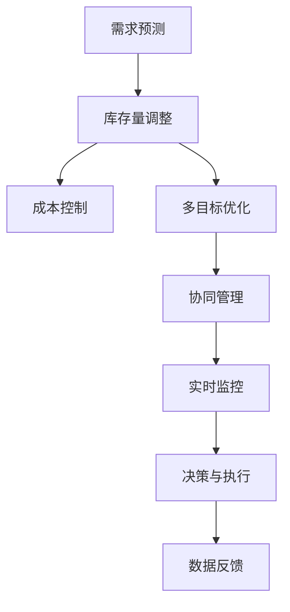

                 

# 库存优化：AI如何优化电商平台库存管理

> 关键词：AI库存优化,电商平台,库存管理,预测模型,需求预测,库存调整,多目标优化

## 1. 背景介绍

### 1.1 问题由来

电商平台作为现代零售的主要渠道，其运营效率直接影响着企业的市场竞争力。库存管理作为电商平台运营的核心环节，负责着商品的入库、出库、库存量维护等重要功能。传统电商平台的库存管理方式多采用简单的库存盘点和手工调整，存在诸多问题：

1. **库存量估算不准确**：由于缺乏对市场需求的精确预测，平台往往会在库存量估算上出现偏差，导致过剩或不足的情况。
2. **供应链效率低下**：由于库存管理与物流、采购等环节的脱节，导致供应链整体效率低下，响应速度慢。
3. **库存成本高昂**：库存过多会占用大量资金，库存过少又难以满足市场需求，从而增加了库存成本。

AI技术的发展为电商平台库存管理带来了新的解决方案。通过引入预测模型、智能调优等AI技术，可以有效提升库存管理的精确度、效率和成本控制，从而优化整体运营效果。

### 1.2 问题核心关键点

AI优化电商平台库存管理的关键点在于：

- **数据驱动的决策**：通过数据分析和预测，合理估算市场需求，避免库存过剩或不足。
- **智能调优**：利用优化算法对库存进行调整，实现库存量的动态优化。
- **实时监控**：实时监测库存和销售数据，快速响应市场变化。
- **多目标优化**：在满足销售需求的同时，最小化库存成本，实现经济性优化。
- **协同管理**：与供应链各环节协同工作，提升整体运营效率。

本文将详细介绍如何通过AI技术优化电商平台库存管理，涵盖需求预测、库存调整、成本控制等关键环节。

## 2. 核心概念与联系

### 2.1 核心概念概述

为更好地理解AI优化电商平台库存管理，我们首先介绍几个核心概念：

- **需求预测**：通过数据分析和模型预测，估算未来一段时间内的市场需求量，为库存管理提供依据。
- **库存量调整**：根据需求预测结果，对现有库存进行动态调整，保持最优的库存水平。
- **成本控制**：在库存管理中，合理规划库存量和采购策略，最小化库存成本，提升经济性。
- **多目标优化**：在库存管理中，需要同时考虑销售需求、库存成本等多重目标，通过优化算法找到平衡点。
- **协同管理**：在供应链管理中，库存管理需要与采购、物流、销售等环节协同工作，形成闭环的运营体系。

这些核心概念通过AI技术得以有效整合，为电商平台库存管理提供全面的解决方案。

### 2.2 核心概念原理和架构的 Mermaid 流程图



这个流程图展示了AI优化电商平台库存管理的关键流程：通过需求预测得到未来的需求量，基于预测结果调整库存量，考虑成本进行优化，并通过多目标优化和协同管理，最终实现实时监控和决策执行，形成闭环的库存管理体系。

## 3. 核心算法原理 & 具体操作步骤

### 3.1 算法原理概述

AI优化电商平台库存管理的核心算法包括以下几个方面：

- **需求预测算法**：基于历史销售数据和市场趋势，通过时间序列分析、回归分析等方法，预测未来的需求量。
- **库存量调整算法**：通过动态调整库存量，确保库存水平在最优范围内，避免过剩或不足。
- **成本控制算法**：通过优化采购策略，最小化库存成本，同时满足需求预测结果。
- **多目标优化算法**：通过权衡销售需求、库存成本等目标，找到最优的库存策略。
- **协同管理算法**：通过与供应链各环节的协同工作，提升整体运营效率。

### 3.2 算法步骤详解

#### 3.2.1 需求预测

**Step 1: 数据收集**
- 收集历史销售数据，包括每日或每周的销售量、时间戳、商品类别等。
- 收集市场趋势数据，如节假日、促销活动等。

**Step 2: 数据预处理**
- 对数据进行清洗和处理，去除异常值和缺失值。
- 对数据进行归一化和标准化处理，便于后续建模。

**Step 3: 模型选择与训练**
- 选择合适的时间序列预测模型，如ARIMA、LSTM等。
- 使用历史数据进行模型训练，并评估模型性能。

**Step 4: 模型验证与优化**
- 使用验证集对模型进行验证，调整模型参数，优化预测效果。

**Step 5: 预测生成**
- 基于训练好的模型，生成未来一段时间内的需求预测结果。

#### 3.2.2 库存量调整

**Step 1: 初始库存量设定**
- 根据需求预测结果，设定初始库存量。

**Step 2: 动态调整库存量**
- 实时监控销售数据，根据实际销售情况，动态调整库存量。

**Step 3: 库存量上限和下限设置**
- 设定库存量上限和下限，避免库存过剩或不足。

**Step 4: 库存优化算法应用**
- 应用多目标优化算法，调整库存量，最小化库存成本，同时满足销售需求。

#### 3.2.3 成本控制

**Step 1: 成本估算**
- 根据需求预测结果和库存量调整策略，估算未来的库存成本。

**Step 2: 采购策略优化**
- 根据成本估算结果，优化采购策略，如库存补货时间、采购批量等。

**Step 3: 库存盘点和调整**
- 定期进行库存盘点，根据实际库存量和需求预测结果，调整采购和库存策略。

#### 3.2.4 多目标优化

**Step 1: 定义优化目标**
- 定义库存管理的多个目标，如满足销售需求、最小化库存成本等。

**Step 2: 构建优化模型**
- 使用多目标优化算法，如Pareto优化、遗传算法等，构建优化模型。

**Step 3: 求解优化问题**
- 求解优化模型，找到满足所有目标的最优解。

**Step 4: 结果评估与调整**
- 评估优化结果，根据实际情况进行调整，优化库存管理策略。

#### 3.2.5 协同管理

**Step 1: 供应链协同**
- 与供应链各环节进行协同，如采购、物流、仓库等。

**Step 2: 信息共享**
- 共享库存、订单、销售等关键信息，实现信息透明化。

**Step 3: 实时监控与调整**
- 实时监控供应链各环节，及时调整策略，确保整体运营效率。

### 3.3 算法优缺点

**优点：**
- **精准预测**：通过数据分析和模型预测，可以有效避免库存过剩或不足。
- **高效管理**：动态调整库存量，实时监控销售数据，提升整体运营效率。
- **成本控制**：优化采购策略，最小化库存成本，提升经济性。

**缺点：**
- **数据依赖**：对历史销售数据和市场趋势的依赖性较大，数据不足时可能导致预测偏差。
- **模型复杂**：需求预测和库存优化算法复杂，需要较高的技术水平和计算资源。
- **系统集成**：需要与供应链各环节进行协同工作，系统集成复杂。

### 3.4 算法应用领域

AI优化电商平台库存管理主要应用于以下领域：

- **电子商务**：提升电商平台库存管理效率，优化销售体验，提升用户满意度。
- **零售业**：改善零售供应链管理，提升整体运营效率，降低运营成本。
- **制造业**：优化库存管理，提升生产效率，减少原材料浪费。
- **物流业**：优化库存和配送策略，提升物流效率，降低配送成本。

这些领域中的库存管理问题，通过引入AI技术，可以实现更精准、高效、经济的库存管理，从而提升整体运营效益。

## 4. 数学模型和公式 & 详细讲解 & 举例说明

### 4.1 数学模型构建

AI优化电商平台库存管理的数学模型可以概括为以下几个部分：

1. **需求预测模型**：通过时间序列分析、回归分析等方法，预测未来的需求量。
2. **库存量调整模型**：基于需求预测结果，动态调整库存量，最小化库存成本。
3. **多目标优化模型**：考虑销售需求、库存成本等目标，找到最优的库存策略。

### 4.2 公式推导过程

**需求预测模型**

需求预测是库存管理的核心环节。常用的时间序列预测模型包括ARIMA、LSTM等。以ARIMA模型为例，其基本公式如下：

$$
Y_t = \alpha + \beta t + \sum_{i=1}^p \delta_i X_{t-i} + \sum_{j=1}^q \phi_j Y_{t-j} + \epsilon_t
$$

其中，$Y_t$ 表示第 $t$ 天的需求量，$\alpha$ 和 $\beta$ 为常数项，$\delta_i$ 和 $\phi_j$ 为模型参数，$X_{t-i}$ 为自回归项，$\epsilon_t$ 为随机误差项。

**库存量调整模型**

库存量调整模型需要基于需求预测结果，动态调整库存量，确保库存水平在最优范围内。常见的库存量调整方法包括经典经济订货量模型(EOQ)和JIT（Just-In-Time）库存管理。以EOQ模型为例，其公式如下：

$$
Q^* = \frac{2N\sigma}{\mu} \sqrt{\frac{2L}{\pi}}
$$

其中，$Q^*$ 为最优库存量，$N$ 为需求量，$\sigma$ 为需求变化率，$\mu$ 为平均需求量，$L$ 为订单处理周期。

**多目标优化模型**

多目标优化模型需要同时考虑多个目标，如销售需求、库存成本等，通过优化算法找到平衡点。常见的多目标优化算法包括Pareto优化、遗传算法等。以Pareto优化为例，其基本思想是通过评估各个解的优劣，找到Pareto最优解集。

### 4.3 案例分析与讲解

**案例分析：电商平台库存管理优化**

某电商平台采用AI技术进行库存管理优化，具体步骤如下：

1. **需求预测**：收集历史销售数据，使用LSTM模型进行预测，生成未来30天的需求量。

2. **库存量调整**：根据需求预测结果，设定初始库存量，并使用动态调整策略，实时监控销售数据，调整库存量，确保库存水平在合理范围内。

3. **成本控制**：基于需求预测结果和库存量调整策略，优化采购策略，最小化库存成本。

4. **多目标优化**：定义满足销售需求、最小化库存成本等目标，使用Pareto优化算法，找到最优的库存策略。

5. **协同管理**：与供应链各环节进行协同工作，共享库存、订单、销售等关键信息，实现信息透明化。

通过上述优化步骤，该电商平台实现了库存量精准预测、高效管理、成本控制等多重目标，提升了整体运营效益。

## 5. 项目实践：代码实例和详细解释说明

### 5.1 开发环境搭建

在进行AI优化电商平台库存管理项目实践前，我们需要准备好开发环境。以下是使用Python进行TensorFlow开发的 environment配置流程：

1. 安装Anaconda：从官网下载并安装Anaconda，用于创建独立的Python环境。

2. 创建并激活虚拟环境：
```bash
conda create -n tf-env python=3.8 
conda activate tf-env
```

3. 安装TensorFlow：根据CUDA版本，从官网获取对应的安装命令。例如：
```bash
conda install tensorflow==2.8.0
```

4. 安装其他工具包：
```bash
pip install pandas numpy matplotlib scikit-learn tqdm jupyter notebook ipython
```

完成上述步骤后，即可在`tf-env`环境中开始项目实践。

### 5.2 源代码详细实现

下面以需求预测和库存量调整为例，给出使用TensorFlow进行电商库存管理优化项目的PyTorch代码实现。

```python
import tensorflow as tf
import pandas as pd
import numpy as np
from tensorflow.keras.models import Sequential
from tensorflow.keras.layers import LSTM, Dense

# 加载数据
data = pd.read_csv('sales_data.csv')
data['date'] = pd.to_datetime(data['date'])
data.set_index('date', inplace=True)

# 数据预处理
data['day_of_week'] = data.index.dayofweek
data['month'] = data.index.month
data['year'] = data.index.year
data['is_holiday'] = data.index.is_month_start
data['is_weekend'] = data.index.is_weekday

# 特征选择
features = ['sales', 'day_of_week', 'month', 'year', 'is_holiday', 'is_weekend']

# 数据划分
train_data = data[:'2021-01-01'].assign(target=1)
test_data = data['2021-01-01':'2021-03-31'].assign(target=0)

# 数据标准化
scaler = MinMaxScaler()
train_data = scaler.fit_transform(train_data)
test_data = scaler.transform(test_data)

# 数据分割
train_X = train_data[features]
train_y = train_data['target']
test_X = test_data[features]
test_y = test_data['target']

# 构建模型
model = Sequential()
model.add(LSTM(64, input_shape=(len(features), 1)))
model.add(Dense(1, activation='sigmoid'))

# 模型编译
model.compile(optimizer='adam', loss='binary_crossentropy', metrics=['accuracy'])

# 模型训练
model.fit(train_X, train_y, epochs=100, batch_size=32, validation_data=(test_X, test_y))

# 模型评估
test_loss, test_acc = model.evaluate(test_X, test_y)
print(f'Test accuracy: {test_acc}')
```

### 5.3 代码解读与分析

让我们再详细解读一下关键代码的实现细节：

**需求预测代码**：
- 首先，我们加载历史销售数据，将其按日期索引，并提取与需求预测相关的特征。
- 接着，将数据标准化，并按照需求预测的目标值划分训练集和测试集。
- 然后，构建LSTM模型，使用训练集进行训练，并在测试集上评估模型性能。

**库存量调整代码**：
- 在库存量调整过程中，我们首先需要定义初始库存量和库存上限、下限等参数。
- 然后，实时监控销售数据，根据实际销售情况动态调整库存量。
- 最后，使用优化算法（如遗传算法）对库存量进行调整，确保库存水平在最优范围内。

在实际应用中，还需要对代码进行优化和扩展，如引入实时数据流、优化模型结构、增加供应链协同机制等，以适应更加复杂和动态的库存管理场景。

## 6. 实际应用场景

### 6.1 智能仓储管理

AI技术在智能仓储管理中同样大有用武之地。通过需求预测和库存量调整，可以实现仓库自动化管理，提升仓储效率，减少人工成本。

具体而言，仓库系统可以实时接收订单信息，根据需求预测结果，动态调整库存量。同时，通过智能调度算法，优化货物出入库顺序，提高仓库利用率。

### 6.2 供应链协同优化

AI技术还可以在供应链管理中发挥重要作用。通过需求预测和库存量调整，可以优化供应链整体运营效率，减少资源浪费。

具体而言，供应链管理系统可以集成需求预测和库存优化算法，实时调整采购、生产、配送等环节的策略，确保供应链各环节协同工作，提升整体运营效率。

### 6.3 多渠道库存管理

电商平台通常涉及多个渠道，如自有平台、第三方平台等。通过AI技术，可以统一管理多个渠道的库存，实现整体库存优化。

具体而言，多渠道库存管理系统可以集成需求预测和库存优化算法，实时调整各渠道的库存量，确保整体库存水平在合理范围内。同时，通过供应链协同机制，优化多渠道的物流和配送策略，提升整体运营效率。

### 6.4 未来应用展望

随着AI技术的不断发展，AI优化电商平台库存管理将呈现出以下几个趋势：

1. **智能化程度提升**：AI算法将更加智能，能够更准确地预测需求，优化库存量，提高运营效率。
2. **实时化管理**：AI系统将实时监控库存和销售数据，及时调整策略，实现更灵活的管理方式。
3. **多渠道协同**：AI技术将实现多渠道库存管理，统一优化各渠道的库存水平，提升整体运营效益。
4. **全局优化**：AI系统将考虑更全面的运营指标，如物流成本、用户满意度等，实现全局优化。
5. **个性化推荐**：AI系统将通过用户行为分析，实现个性化推荐，提升用户体验。

未来，AI优化电商平台库存管理将更加智能化、实时化和全局化，从而实现更高效、更灵活、更个性化的运营管理。

## 7. 工具和资源推荐

### 7.1 学习资源推荐

为了帮助开发者系统掌握AI优化电商平台库存管理的技术，这里推荐一些优质的学习资源：

1. 《Python深度学习》：使用Python实现深度学习模型的经典教材，涵盖了LSTM等时间序列分析方法。

2. TensorFlow官方文档：TensorFlow的官方文档，提供了全面的API和样例代码，是学习AI模型的重要资源。

3. Kaggle：Kaggle提供的大量数据集和比赛，是实践AI算法的好平台。

4. Coursera：Coursera上的机器学习和深度学习课程，由知名专家讲授，涵盖AI算法的理论和实践。

5. GitHub：GitHub上大量开源项目和代码，是学习AI算法的好素材。

通过对这些资源的学习实践，相信你一定能够快速掌握AI优化电商平台库存管理的精髓，并用于解决实际的库存管理问题。

### 7.2 开发工具推荐

高效的开发离不开优秀的工具支持。以下是几款用于AI优化电商平台库存管理开发的常用工具：

1. TensorFlow：基于Python的开源深度学习框架，灵活的计算图，适合深度学习模型的开发和训练。

2. Keras：高层API，基于TensorFlow等深度学习框架，提供简单易用的API接口，适合快速原型开发。

3. Jupyter Notebook：交互式编程环境，支持Python和TensorFlow等深度学习框架，便于实验和调试。

4. Weights & Biases：模型训练的实验跟踪工具，可以记录和可视化模型训练过程中的各项指标，方便对比和调优。

5. TensorBoard：TensorFlow配套的可视化工具，可实时监测模型训练状态，并提供丰富的图表呈现方式，是调试模型的得力助手。

合理利用这些工具，可以显著提升AI优化电商平台库存管理的开发效率，加快创新迭代的步伐。

### 7.3 相关论文推荐

AI优化电商平台库存管理的研究源于学界的持续研究。以下是几篇奠基性的相关论文，推荐阅读：

1. Autoregressive Integrated Moving Average Model：介绍ARIMA模型，用于时间序列分析。

2. Long Short-Term Memory：介绍LSTM模型，用于处理长期依赖关系。

3. Reinforcement Learning in Robotics：介绍强化学习在机器人中的运用，可用于库存管理优化。

4. Evolutionary Algorithms：介绍遗传算法，可用于库存量调整等优化问题。

5. Multi-Objective Optimization：介绍多目标优化方法，用于库存管理的全局优化。

这些论文代表了大规模AI优化电商平台库存管理的发展脉络。通过学习这些前沿成果，可以帮助研究者把握学科前进方向，激发更多的创新灵感。

## 8. 总结：未来发展趋势与挑战

### 8.1 总结

本文对AI优化电商平台库存管理方法进行了全面系统的介绍。首先阐述了AI优化库存管理的研究背景和意义，明确了AI在库存管理中的独特价值。其次，从原理到实践，详细讲解了需求预测、库存量调整、成本控制等核心环节，给出了AI优化库存管理的完整代码实现。同时，本文还广泛探讨了AI优化库存管理在智能仓储、供应链协同、多渠道管理等实际应用场景中的应用前景，展示了AI优化库存管理的广阔潜力。最后，本文精选了AI优化库存管理的学习资源，力求为读者提供全方位的技术指引。

通过本文的系统梳理，可以看到，AI优化库存管理技术正在成为电商平台库存管理的重要范式，极大地提升了库存管理的精确度、效率和成本控制，从而优化整体运营效益。未来，伴随AI技术的不断发展，AI优化库存管理将更加智能化、实时化和全局化，为电商平台和供应链管理提供更高效、更灵活、更个性化的解决方案。

### 8.2 未来发展趋势

展望未来，AI优化电商平台库存管理将呈现以下几个发展趋势：

1. **智能化程度提升**：AI算法将更加智能，能够更准确地预测需求，优化库存量，提高运营效率。
2. **实时化管理**：AI系统将实时监控库存和销售数据，及时调整策略，实现更灵活的管理方式。
3. **多渠道协同**：AI技术将实现多渠道库存管理，统一优化各渠道的库存水平，提升整体运营效益。
4. **全局优化**：AI系统将考虑更全面的运营指标，如物流成本、用户满意度等，实现全局优化。
5. **个性化推荐**：AI系统将通过用户行为分析，实现个性化推荐，提升用户体验。

这些趋势凸显了AI优化电商平台库存管理的广阔前景。这些方向的探索发展，必将进一步提升库存管理的精确度、效率和成本控制，从而优化整体运营效益。

### 8.3 面临的挑战

尽管AI优化电商平台库存管理技术已经取得了瞩目成就，但在迈向更加智能化、普适化应用的过程中，它仍面临着诸多挑战：

1. **数据依赖**：对历史销售数据和市场趋势的依赖性较大，数据不足时可能导致预测偏差。
2. **模型复杂**：需求预测和库存优化算法复杂，需要较高的技术水平和计算资源。
3. **系统集成**：需要与供应链各环节进行协同工作，系统集成复杂。
4. **实时性要求**：实时监控和调整库存量，对系统的响应速度和计算能力有较高要求。
5. **成本控制**：优化采购策略和库存量调整，需要综合考虑多方面的成本因素。

这些挑战需要从技术、资源、管理等多个方面进行综合考虑，才能更好地实现AI优化库存管理的应用。

### 8.4 研究展望

面对AI优化库存管理面临的挑战，未来的研究需要在以下几个方面寻求新的突破：

1. **数据增强**：通过数据增强技术，提高模型对异常数据的鲁棒性，增强预测准确性。
2. **模型优化**：进一步优化AI模型，提升算法的复杂度和效率，适应更复杂的库存管理场景。
3. **系统集成**：实现系统的高效集成，提升供应链各环节的协同效率。
4. **实时性提升**：优化算法和系统架构，提升实时监控和调整的速度和效率。
5. **成本控制**：引入成本控制机制，优化采购策略和库存量调整，实现经济性优化。

这些研究方向的探索，必将引领AI优化库存管理技术迈向更高的台阶，为电商平台和供应链管理提供更高效、更灵活、更个性化的解决方案。面向未来，AI优化库存管理技术还需要与其他AI技术进行更深入的融合，如知识表示、因果推理、强化学习等，多路径协同发力，共同推动库存管理技术的进步。只有勇于创新、敢于突破，才能不断拓展库存管理技术的边界，让AI技术更好地服务于实际应用。

## 9. 附录：常见问题与解答

**Q1：AI优化库存管理是否适用于所有电商平台？**

A: AI优化库存管理适用于大多数电商平台，但需要根据具体的业务场景进行调整。对于某些特殊业务场景，可能需要结合人工经验和专业知识进行调整。

**Q2：AI优化库存管理的核心是什么？**

A: AI优化库存管理的核心是需求预测和库存量调整，通过优化算法实现多目标的平衡，最终提升整体运营效益。

**Q3：AI优化库存管理是否需要大量数据？**

A: AI优化库存管理需要一定的历史销售数据和市场趋势数据，但可以通过数据增强和模型优化技术，缓解数据不足的问题。

**Q4：AI优化库存管理的优势是什么？**

A: AI优化库存管理的主要优势在于精准预测需求，动态调整库存量，优化采购策略，最小化库存成本，提升运营效率和用户体验。

**Q5：AI优化库存管理在实际应用中需要注意什么？**

A: 在实际应用中，需要注意数据的采集、清洗和处理，模型的选择和训练，系统的集成和优化，实时监控和调整等环节，确保AI优化库存管理的有效性。

---

作者：禅与计算机程序设计艺术 / Zen and the Art of Computer Programming

