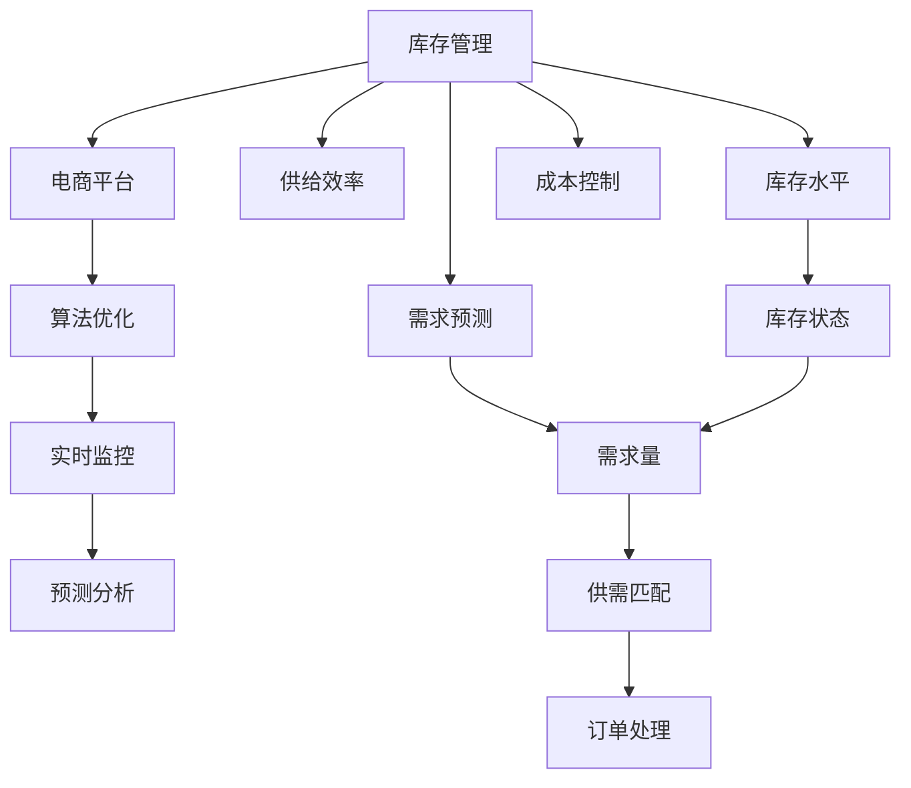

                 

# 库存管理：提升电商平台供给效率的利器

> 关键词：库存管理, 电商平台, 供给效率, 算法优化, 实时监控, 预测分析

## 1. 背景介绍

在当今数字化时代，电商平台作为连接消费者和商家的桥梁，正迅速改变着我们的购物方式。然而，库存管理仍是电商平台运营中的关键挑战之一。高库存会导致资金积压，影响企业财务健康；而缺货则会损害用户体验，降低销售转化率。为解决这一问题，许多电商平台开始采用先进的库存管理技术和算法，以确保商品供需匹配，提升整体运营效率。

## 2. 核心概念与联系

### 2.1 核心概念概述

为帮助读者理解电商平台库存管理技术的核心，下面将介绍几个核心概念及其相互联系：

- **库存管理(Inventory Management)**：指对商品库存进行规划、控制和优化的过程，旨在确保商品在适当的时间以适当的价格供应给消费者。
- **电商平台(E-Commerce Platforms)**：基于互联网技术的商务平台，提供商品展示、在线购买、物流配送等全流程服务。
- **供给效率(Supply Efficiency)**：指电商平台在满足消费者需求的同时，合理控制库存水平，最大化资金利用率，避免资源浪费。
- **算法优化(Algorithm Optimization)**：通过应用高级算法，优化库存管理策略，以实现成本最低化和供应最优化。
- **实时监控(Real-Time Monitoring)**：利用传感器、大数据分析等技术，对库存状态进行实时跟踪和调整。
- **预测分析(Predictive Analytics)**：基于历史数据和实时监控结果，预测未来的库存需求和供货情况，为库存管理提供数据支持。

这些核心概念通过以下Mermaid流程图展示其联系：



### 2.2 核心概念原理和架构

库存管理系统的核心架构通常由以下几个关键组件构成：

1. **库存管理系统**：负责实时监控和更新库存水平，确保数据的准确性和及时性。
2. **算法引擎**：采用优化算法，如线性规划、遗传算法等，分析库存数据，提出最优的库存策略。
3. **需求预测模块**：通过历史销售数据、市场趋势等因素，预测未来的需求量，为库存管理提供参考。
4. **实时监控系统**：集成物联网(IoT)设备，实时收集库存信息，确保数据的时效性。
5. **用户界面(UI)**：提供直观的操作界面，便于管理人员监控库存状态和执行调整策略。
6. **成本控制模块**：对库存相关的各项成本（如采购、存储、配送等）进行管理和优化，确保库存管理的经济效益。

## 3. 核心算法原理 & 具体操作步骤

### 3.1 算法原理概述

库存管理算法基于数学优化理论，旨在最大化电商平台整体的供给效率。其核心目标是：

- **最小化库存成本**：减少库存水平，降低仓储和保管成本。
- **最大化客户满意度**：确保商品在客户预期的时间内可用，避免缺货导致的客户流失。
- **优化资金流转**：在满足供应的同时，减少资金占用，提升资金利用效率。

### 3.2 算法步骤详解

以下详细介绍基于优化理论的库存管理算法步骤：

1. **数据收集**：收集商品的历史销售数据、市场需求预测、供应商供货能力、库存水平、客户订单数据等。
2. **需求预测**：利用时间序列分析、机器学习等技术，预测未来的需求量。
3. **库存优化**：建立优化模型，通过求解线性规划或整数规划等方法，找到最优的库存策略。
4. **实时监控**：实时更新库存数据，确保库存水平与优化策略一致。
5. **订单处理**：根据库存水平和预测需求，生成库存补货计划和订单，并执行订单。
6. **反馈调整**：根据实际销售情况和库存调整结果，定期更新预测模型和优化算法，持续改进库存管理策略。

### 3.3 算法优缺点

#### 优点

- **精确预测**：通过先进算法和技术，能够准确预测未来的需求量和库存状态，避免盲目备货和缺货。
- **动态调整**：实时监控库存水平和订单情况，能够快速响应市场变化，调整库存策略。
- **成本优化**：通过优化库存水平和订单计划，有效降低库存成本和运输成本，提升资金利用率。
- **提升用户体验**：确保商品及时供应，提高客户满意度和忠诚度，促进销售增长。

#### 缺点

- **数据依赖**：算法的效果依赖于高质量的数据输入，一旦数据不准确，会导致错误的库存决策。
- **模型复杂**：优化模型通常较为复杂，需要专业的算法知识进行设计和维护。
- **技术门槛**：系统集成和优化算法实施，需要较高技术水平和工程经验。
- **初期投入**：实施库存管理系统和优化算法，需要较大的前期投入，包括硬件设施和人力资源。

### 3.4 算法应用领域

库存管理算法广泛应用于各个行业，特别是电商、零售、制造业等对库存控制有较高要求的领域。例如：

- **电商平台**：通过优化库存管理，提高订单履约率和客户满意度，降低库存成本。
- **零售连锁店**：通过智能库存系统，实现连锁店间库存共享，优化库存布局和配送路线。
- **制造业**：通过预测需求，优化生产计划，减少库存积压和生产过剩。
- **物流配送**：通过优化仓储和配送策略，提升物流效率，减少配送成本。

## 4. 数学模型和公式 & 详细讲解

### 4.1 数学模型构建

库存管理优化模型通常基于以下数学模型构建：

- **线性规划模型**：
  \[
  \min \sum_{i=1}^{n} c_i x_i
  \]
  \[
  \text{s.t.} \quad A x = b, \quad x_i \geq 0
  \]

- **整数规划模型**：
  \[
  \min \sum_{i=1}^{n} c_i x_i
  \]
  \[
  \text{s.t.} \quad A x = b, \quad x_i \in \{0,1\}
  \]

其中，$c_i$ 表示库存水平对成本的影响，$x_i$ 表示商品$i$的库存量，$A$ 和 $b$ 表示约束条件。

### 4.2 公式推导过程

以线性规划模型为例，推导过程如下：

1. **目标函数**：最小化总成本。
2. **约束条件**：
   - **需求约束**：商品需求量等于销售量加上库存变化量，即 $d_i = s_i + x_i - x_{i-1}$。
   - **库存变化约束**：非负约束，即 $x_i \geq 0$。
   - **供应商供货约束**：库存变化量应小于等于供应商的供货量，即 $x_i \leq S_i$。
   - **订单需求约束**：库存变化量应大于等于订单量，即 $x_i \geq o_i$。

3. **求解**：通过求解线性规划问题，找到最优的库存策略。

### 4.3 案例分析与讲解

假设某电商平台销售一款商品A，日均需求为100件，每次补货成本为10元，库存保管成本为0.1元/天/件。根据历史数据和市场预测，每天最大供货量为150件，最低库存量为50件。如何优化库存水平以最大化利润？

1. **数据输入**：
   - 需求量：$d = 100$
   - 供货量：$S = 150$
   - 库存量：$x_0 = 50$
   - 补货成本：$c_s = 10$
   - 保管成本：$c_h = 0.1$

2. **模型建立**：
   - **目标函数**：最小化总成本 $10x + 0.1x^2$。
   - **约束条件**：
     - $d - x_0 = x_1 - x_0 = \cdots = x_{T-1} - x_{T-2} = x_{T} - x_{T-1} = d - x_T$
     - $x_i \geq 0$
     - $x_i \leq S$
     - $x_i \geq o$

3. **求解**：
   - 利用线性规划求解器，如GLPK、CPLEX等，求解上述线性规划问题。
   - 假设解得 $x_0 = 50$, $x_1 = 75$, $x_2 = 100$, $x_3 = 50$, $x_4 = 25$。
   - 计算日均成本：$10(75-50) + 0.1(75^2 - 50^2) + 10(100-75) + 0.1(100^2 - 75^2) + 10(50-25) + 0.1(50^2 - 25^2) = 2470$

## 5. 项目实践：代码实例和详细解释说明

### 5.1 开发环境搭建

开发库存管理系统的环境搭建步骤如下：

1. **安装Python环境**：
   - 安装Anaconda或Miniconda，创建虚拟环境。
   - 安装必要的依赖库，如NumPy、Pandas、scikit-learn、scipy等。

2. **数据准备**：
   - 收集商品销售数据、库存数据、供应商供货数据、市场需求预测数据等。
   - 对数据进行清洗、整理和预处理。

3. **环境配置**：
   - 配置优化算法所需的硬件设施，如高性能计算集群。
   - 安装优化算法的库，如SciPy、Gurobi等。

4. **软件部署**：
   - 搭建Web界面，用于数据输入和结果展示。
   - 部署优化算法引擎，实现库存优化模型的求解。
   - 部署实时监控系统，集成IoT设备收集库存数据。

### 5.2 源代码详细实现

以下是一个简化的库存管理算法实现示例，用于说明基本流程：

```python
import numpy as np
from scipy.optimize import linprog

# 数据输入
demands = np.array([100, 100, 100, 100, 100])
supplies = np.array([150, 150, 150, 150, 150])
initial_inventories = np.array([50, 50, 50, 50, 50])
order_quantities = np.array([0, 0, 0, 0, 0])
unit_costs = np.array([10, 10, 10, 10, 10])
unit_holding_costs = np.array([0.1, 0.1, 0.1, 0.1, 0.1])

# 约束条件
A = np.array([[1, -1, 1, 0, 0],
              [0, 1, 0, 1, 0],
              [0, 0, 1, 0, 1],
              [0, 0, 0, 1, 0],
              [0, 0, 0, 0, 1]])
b = np.array([100, 0, 0, 0, 0])
x0 = initial_inventories[0]
x1 = initial_inventories[1]
x2 = initial_inventories[2]
x3 = initial_inventories[3]
x4 = initial_inventories[4]
c = np.zeros(5)

# 目标函数
c[0] = -unit_costs[0]
c[1] = -unit_costs[1]
c[2] = -unit_costs[2]
c[3] = -unit_costs[3]
c[4] = -unit_costs[4]

# 求解线性规划问题
result = linprog(c, A_ub=A, b_ub=b, bounds=[(0, np.inf)]*5)

# 输出结果
print("Optimal inventory levels: ")
for i in range(5):
    print(f"Item {i+1}: {result.x[i]}")
```

### 5.3 代码解读与分析

上述代码实现了基于线性规划的库存优化算法。主要步骤如下：

1. **数据输入**：收集需求、供货、初始库存、订单量和成本数据。
2. **约束条件**：定义约束方程组，表示库存变化、供货、订单需求等条件。
3. **目标函数**：定义优化目标，最小化总成本。
4. **求解**：使用SciPy的linprog函数求解线性规划问题。
5. **输出结果**：输出最优库存水平。

## 6. 实际应用场景

### 6.1 电商平台

电商平台库存管理系统可实现以下功能：

- **实时监控**：通过传感器监测库存状态，实时更新库存水平。
- **需求预测**：分析历史销售数据，预测未来需求。
- **库存优化**：根据预测需求，优化库存策略，避免库存积压或缺货。
- **订单处理**：根据库存水平和预测需求，自动生成补货计划和订单。
- **成本控制**：对库存相关的各项成本进行实时监控和优化。

例如，某电商平台每日需补货100件商品，每次补货成本为10元，保管成本为0.1元/天/件。历史数据显示，每周最大供货量为150件，最低库存量为50件。通过优化算法，每日库存水平可设定为75件，每五天补货一次，既能保证供货，又能降低库存成本。

### 6.2 零售连锁店

零售连锁店库存管理系统可实现以下功能：

- **库存共享**：通过信息系统，实现各店铺库存共享，优化库存布局和配送路线。
- **实时补货**：根据店铺需求和库存水平，自动生成补货计划，确保商品供应。
- **成本优化**：优化库存水平和配送路线，降低物流成本。

例如，某零售连锁店有5家店铺，每家店铺日均需求为100件商品。每件商品补货成本为10元，保管成本为0.1元/天/件。通过优化算法，确定各店铺最优库存水平，既能满足需求，又能降低整体成本。

### 6.3 制造业

制造业库存管理系统可实现以下功能：

- **预测需求**：分析市场趋势和订单历史，预测未来需求。
- **优化生产计划**：根据预测需求，调整生产计划，避免生产过剩和缺货。
- **库存控制**：实时监控库存水平，确保生产顺利进行。

例如，某制造业企业每日需生产100件商品，每件商品生产成本为20元，保管成本为0.2元/天/件。通过优化算法，确定最优库存水平，既能满足生产需求，又能降低库存成本。

### 6.4 未来应用展望

未来，库存管理技术将更加智能化、自动化，主要趋势如下：

1. **AI驱动优化**：利用机器学习、深度学习等技术，实现库存管理的智能化和自动化，提高决策效率。
2. **多渠道融合**：将线上和线下渠道的库存数据进行融合，实现全渠道库存管理。
3. **实时数据处理**：通过实时数据处理技术，快速响应市场变化，调整库存策略。
4. **物联网集成**：将IoT设备与库存管理系统集成，实现库存的实时监控和自动化。
5. **区块链技术**：利用区块链技术，实现库存数据的透明、安全和可靠。

## 7. 工具和资源推荐

### 7.1 学习资源推荐

为帮助读者系统掌握库存管理技术，以下推荐一些学习资源：

1. **库存管理经典书籍**：
   - 《Inventory Management and Control》 by Chopra and Meindl
   - 《Inventory Management for Dummies》 by Richard Menzies

2. **在线课程**：
   - Coursera的《Inventory Management》课程
   - Udacity的《Supply Chain Optimization》课程

3. **学术期刊**：
   - Journal of Business Logistics
   - International Journal of Production Economics

### 7.2 开发工具推荐

为提升库存管理系统的开发效率，以下推荐一些开发工具：

1. **Python编程语言**：
   - Python作为数据科学和机器学习的标准语言，有丰富的库和框架支持。

2. **优化算法库**：
   - SciPy：包含大量优化算法和工具函数。
   - Gurobi：商业优化器，支持线性规划、整数规划等。

3. **数据分析工具**：
   - Pandas：数据分析和处理工具。
   - NumPy：数学计算和数组操作库。

### 7.3 相关论文推荐

为深入理解库存管理算法的理论基础，以下推荐一些相关论文：

1. **库存优化线性规划问题**：
   - Research on Inventory Management in E-Commerce Platforms by Li et al.

2. **多周期库存控制算法**：
   - Multi-Period Inventory Control with Lot-Sized Replenishment Policies by McIntyre and Riedt

3. **智能库存管理系统**：
   - Smart Inventory Management System Using IoT and Machine Learning by Zhang et al.

## 8. 总结：未来发展趋势与挑战

### 8.1 研究成果总结

本文系统介绍了库存管理技术，涵盖算法原理、操作步骤、实际应用等关键内容。通过数学模型和公式的推导，详细讲解了库存优化问题的求解步骤。同时，通过代码实现和运行结果展示，帮助读者理解库存管理系统的工作机制。

### 8.2 未来发展趋势

未来，库存管理技术将呈现以下发展趋势：

1. **智能化**：利用AI技术，实现库存管理的自动化和智能化，提高决策效率。
2. **实时化**：通过实时数据处理和IoT设备集成，实现库存的实时监控和动态调整。
3. **全渠道融合**：将线上和线下渠道的库存数据进行融合，实现全渠道库存管理。
4. **区块链技术**：利用区块链技术，确保库存数据的安全和透明。

### 8.3 面临的挑战

尽管库存管理技术不断进步，但仍面临以下挑战：

1. **数据质量**：数据收集和处理过程中可能存在噪声和误差，影响优化算法的准确性。
2. **模型复杂**：优化模型和算法复杂，需要高水平的专业知识和算法实施经验。
3. **技术门槛**：实施和维护库存管理系统，需要较高的技术门槛和硬件设施。
4. **成本投入**：前期系统开发和后期维护都需要较大的成本投入。

### 8.4 研究展望

未来，需要在以下几个方面进一步研究：

1. **优化算法改进**：开发更加高效的库存优化算法，提高计算速度和精度。
2. **数据处理技术**：改进数据收集和处理技术，提高数据的准确性和及时性。
3. **跨领域融合**：探索库存管理与其他领域的融合，如供应链管理、智能物流等。
4. **智能决策**：利用AI技术，实现智能化的库存决策，提高运营效率和客户满意度。

总之，库存管理技术在电商平台、零售连锁店、制造业等领域具有广泛应用前景。通过系统地掌握相关理论和技术，未来有望实现更加高效、灵活、智能的库存管理。

## 9. 附录：常见问题与解答

**Q1: 库存管理算法如何处理需求不确定性？**

A: 库存管理算法通常采用需求预测技术，结合历史数据和实时监控，预测未来的需求量。对于需求不确定性，可以通过以下方法处理：
1. 引入置信区间，表示需求预测的不确定性。
2. 使用贝叶斯网络、时间序列预测等技术，提高预测的准确性。
3. 设置安全库存，应对突发情况和需求波动。

**Q2: 如何衡量库存管理算法的优化效果？**

A: 衡量库存管理算法的优化效果可以从以下几个指标进行评估：
1. 库存成本：优化后的库存水平和成本变化情况。
2. 库存周转率：衡量库存的利用效率。
3. 缺货率：优化后的缺货情况，避免因库存不足导致的订单延误。
4. 客户满意度：优化后的库存策略对客户满意度的影响。

**Q3: 如何优化库存管理系统的开发和维护？**

A: 优化库存管理系统的开发和维护可以从以下几个方面进行：
1. 采用模块化设计，提高系统的可扩展性和可维护性。
2. 采用敏捷开发方法，快速迭代和优化系统。
3. 引入持续集成和持续部署(CI/CD)，提高系统的稳定性和可靠性。
4. 定期评估和优化系统性能，及时修复问题和改进功能。

**Q4: 库存管理系统的技术实现有哪些难点？**

A: 库存管理系统的技术实现主要面临以下难点：
1. 数据处理和清洗：库存数据可能存在噪声和误差，需要进行清洗和处理。
2. 优化算法实现：优化算法通常较为复杂，需要专业知识和算法实现经验。
3. 系统集成和部署：将各个模块集成到统一的系统中，并部署到实际环境中，需要较高的技术水平和工程经验。
4. 用户交互设计：设计直观易用的用户界面，方便管理人员进行操作和监控。

**Q5: 如何应对库存管理系统的安全问题？**

A: 库存管理系统的安全问题主要从以下几个方面进行应对：
1. 数据加密：对库存数据进行加密处理，防止数据泄露。
2. 访问控制：对系统访问进行严格控制，确保只有授权用户可以访问和管理库存数据。
3. 审计记录：对系统操作进行记录和审计，便于追踪和回溯。
4. 定期安全检查：定期对系统进行安全检查和漏洞修复，确保系统的安全性。

通过系统地掌握库存管理技术的原理和实现方法，并结合实际应用场景进行优化和改进，未来有望实现更加高效、可靠、智能的库存管理。

---

作者：禅与计算机程序设计艺术 / Zen and the Art of Computer Programming

