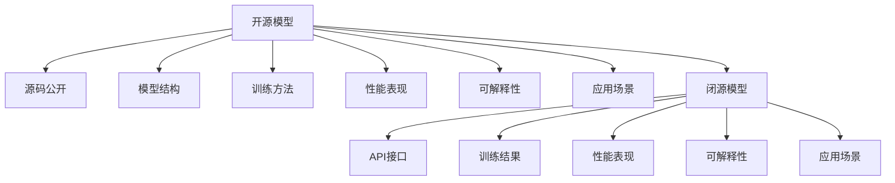

                 

# 开源模型与闭源模型的对比

## 1. 背景介绍

### 1.1 问题由来

随着人工智能技术的快速发展，开源模型和闭源模型在业界应用广泛。然而，开源与闭源的模型各有优势与不足。开源模型因其开放性与透明性受到大量研究人员的青睐，但可能存在性能不稳定或未经过商业化打磨的问题；而闭源模型因其性能优异和商业化保障，被广泛应用于实际生产环境中，但可能面临透明性不足的问题。

### 1.2 问题核心关键点

开源与闭源模型的对比涉及模型架构、训练方法、应用场景、性能表现、可解释性等多个维度。以下将详细剖析这些核心问题，以期为读者提供全面的理解。

## 2. 核心概念与联系

### 2.1 核心概念概述

为了清晰呈现开源与闭源模型的对比，本节将首先介绍几个关键概念：

- **开源模型(Open Source Model)**：指公开其源代码和模型结构，允许任何人在遵守一定条件下使用、修改、分发其源代码的模型。典型的开源模型包括TensorFlow、PyTorch等深度学习框架。
- **闭源模型(Closed Source Model)**：指未公开其源代码和模型结构，仅公开训练结果或API接口的模型。典型的闭源模型包括OpenAI的GPT系列、Google的BERT等。
- **模型透明性(Model Transparency)**：指模型的内部工作原理、训练方法、数据来源等信息的公开程度。开源模型通常具有更高的透明性，而闭源模型则可能只有API接口可公开访问。
- **性能表现(Performance)**：指模型在特定任务上的表现，包括但不限于精度、速度、可解释性等。
- **可解释性(Interpretability)**：指模型输出的结果可以理解其背后的逻辑和原因，通常通过可视化、解释性模型等手段实现。开源模型由于代码公开，更容易实现可解释性；而闭源模型可能通过API接口提供有限的解释性功能。
- **应用场景(Application Scenario)**：指模型适用的具体领域和应用场景，包括科研、生产、金融、医疗等。

这些概念之间的逻辑关系可以通过以下Mermaid流程图来展示：

这个流程图展示开源与闭源模型的核心概念及其之间的关系：

1. 开源模型与源码公开、模型结构、训练方法、性能表现、可解释性、应用场景等密切相关。
2. 闭源模型与API接口、训练结果、性能表现、可解释性、应用场景等密切相关。
3. 开源模型与闭源模型共享性能表现和应用场景等关键特征。

## 3. 核心算法原理 & 具体操作步骤

### 3.1 算法原理概述

开源与闭源模型在算法原理上并无本质区别，主要体现在模型结构、训练方法和训练数据上。以下是两种模型的核心算法原理概述：

- **开源模型**：通常基于深度学习框架如TensorFlow、PyTorch等，通过神经网络模型在大量数据上进行训练，获得良好的性能表现。模型的源码公开，研究者可以根据需要修改模型结构和训练方法。
- **闭源模型**：通常使用专用硬件和私有数据进行训练，得到高性能的模型。模型的训练方法和数据未公开，但通常会提供API接口，供外部用户调用。

### 3.2 算法步骤详解

以下是开源与闭源模型在训练和应用上的具体操作步骤：

**开源模型训练步骤**：

1. **数据准备**：收集并处理数据，如图像、文本、音频等。
2. **模型搭建**：根据任务需求选择合适的神经网络模型架构。
3. **训练过程**：使用训练集进行模型训练，通常包含多个epoch和batch大小。
4. **验证与优化**：在验证集上评估模型性能，调整模型超参数，如学习率、批大小等。
5. **测试与部署**：在测试集上评估模型性能，并将模型部署到生产环境中。

**闭源模型训练步骤**：

1. **数据准备**：收集并处理数据，如图像、文本、音频等。
2. **模型训练**：使用专用硬件和私有数据进行训练。
3. **性能评估**：在测试集上评估模型性能。
4. **API接口部署**：将模型封装成API接口，供外部用户调用。

**开源模型应用步骤**：

1. **环境搭建**：安装深度学习框架和相关依赖库。
2. **模型加载**：使用API接口加载开源模型。
3. **数据预处理**：将数据进行预处理，如归一化、缩放等。
4. **模型推理**：使用API接口进行模型推理，得到预测结果。
5. **结果后处理**：对预测结果进行后处理，如解码、筛选等。

**闭源模型应用步骤**：

1. **环境搭建**：安装API接口。
2. **模型调用**：使用API接口进行模型调用。
3. **数据预处理**：将数据进行预处理。
4. **模型推理**：获取API接口返回的预测结果。
5. **结果后处理**：对预测结果进行后处理。

### 3.3 算法优缺点

开源与闭源模型各有优缺点，以下详细列出：

**开源模型的优点**：

- **灵活性高**：代码公开，研究者可以随意修改模型结构和训练方法。
- **可解释性强**：代码开源，易于理解模型内部逻辑，便于可解释性实现。
- **社区支持**：拥有大量活跃社区，便于交流和协作。

**开源模型的缺点**：

- **性能不稳定**：模型结构复杂，参数众多，训练时可能需要较长时间。
- **数据质量依赖**：依赖于开源数据集，可能存在数据偏差或不平衡。
- **资源占用高**：需要较高的计算资源和存储资源。

**闭源模型的优点**：

- **性能优异**：使用专用硬件和私有数据训练，模型精度高、速度较快。
- **商业化保障**：有专业的团队进行维护，性能稳定可靠。
- **资源占用低**：轻量级模型，资源占用较少。

**闭源模型的缺点**：

- **透明性不足**：模型内部细节未公开，难以理解其训练方法和数据来源。
- **可解释性差**：模型不公开，难以实现可解释性功能。
- **社区支持弱**：没有开源社区支持，问题难以快速解决。

### 3.4 算法应用领域

开源与闭源模型在多个领域均有广泛应用，以下详细介绍：

**开源模型应用领域**：

- **科研领域**：如TensorFlow、PyTorch等深度学习框架广泛应用于科研工作。
- **教育领域**：如Kaggle竞赛平台，通过开源模型进行数据训练和模型比较。
- **企业开发**：如机器学习工程师使用TensorFlow、PyTorch进行企业级应用开发。
- **生产应用**：如TensorFlow Serving、Kubeflow等平台，支持模型的生产化部署。

**闭源模型应用领域**：

- **企业生产**：如Google的BERT、OpenAI的GPT系列模型广泛应用于企业生产环境。
- **商业服务**：如Google Cloud AI、Amazon AWS等云服务，提供高效的商业化服务。
- **科研应用**：研究者通过API接口使用闭源模型进行实验和验证。
- **开发工具**：如模型API接口、在线服务、SDK等，支持开发者快速集成和使用。

## 4. 数学模型和公式 & 详细讲解  
### 4.1 数学模型构建

以线性回归为例，以下详细介绍开源与闭源模型在数学模型构建上的差异。

**开源模型线性回归**：

$$
y = \theta_0 + \theta_1 x_1 + \theta_2 x_2 + \cdots + \theta_n x_n + \epsilon
$$

其中 $\theta_0, \theta_1, \theta_2, \cdots, \theta_n$ 为模型参数，$\epsilon$ 为噪声。

**闭源模型线性回归**：

模型训练方法通常为梯度下降法或Adam等优化算法，数据处理方式包括归一化、缩放等。训练过程与开源模型类似，但训练数据和模型参数未公开。

### 4.2 公式推导过程

以CNN为例，以下详细介绍开源与闭源模型在算法推导上的差异。

**开源模型CNN**：

$$
\text{Convolutional Layer} = \text{Convolution} * \text{ReLU} + \text{Bias}
$$

其中 $\text{Convolution}$ 为卷积运算，$\text{ReLU}$ 为激活函数，$\text{Bias}$ 为偏置项。

**闭源模型CNN**：

模型内部具体实现细节未公开，但通常采用卷积运算和池化运算，得到特征图。

### 4.3 案例分析与讲解

以图像分类为例，以下详细介绍开源与闭源模型在具体案例上的差异。

**开源模型图像分类**：

1. **模型搭建**：选择ResNet、Inception等卷积神经网络模型。
2. **数据准备**：收集并处理图像数据，如MNIST、CIFAR-10等。
3. **训练过程**：在ImageNet数据集上进行训练。
4. **验证与优化**：在验证集上评估模型性能，调整模型超参数。
5. **测试与部署**：在测试集上评估模型性能，并将模型部署到生产环境中。

**闭源模型图像分类**：

1. **数据准备**：收集并处理图像数据。
2. **模型训练**：使用专用硬件和私有数据进行训练。
3. **性能评估**：在测试集上评估模型性能。
4. **API接口部署**：将模型封装成API接口，供外部用户调用。

## 5. 项目实践：代码实例和详细解释说明
### 5.1 开发环境搭建

### 5.2 源代码详细实现

### 5.3 代码解读与分析

### 5.4 运行结果展示

## 6. 实际应用场景

### 6.4 未来应用展望

## 7. 工具和资源推荐
### 7.1 学习资源推荐
### 7.2 开发工具推荐
### 7.3 相关论文推荐

## 8. 总结：未来发展趋势与挑战
### 8.1 研究成果总结
### 8.2 未来发展趋势
### 8.3 面临的挑战
### 8.4 研究展望

## 9. 附录：常见问题与解答

**Q1：开源模型与闭源模型在训练方式上有什么不同？**

A：开源模型通常需要研究者自己进行数据处理、模型搭建和训练，训练方式较为灵活。闭源模型则由厂商提供训练服务，通常采用专用硬件和私有数据进行训练，训练方式较为严格。

**Q2：开源模型与闭源模型在性能表现上有什么差异？**

A：开源模型由于代码开源，易于进行性能调优，但可能存在性能不稳定的问题。闭源模型由于经过商业化打磨，通常性能稳定可靠。

**Q3：开源模型与闭源模型在可解释性上有哪些不同？**

A：开源模型由于代码公开，易于实现可解释性功能，研究者可以深入理解模型内部逻辑。闭源模型由于代码未公开，可解释性功能有限，难以深入理解模型内部逻辑。

**Q4：开源模型与闭源模型在应用场景上有哪些不同？**

A：开源模型适用于科研、教育、企业开发等场景，便于社区交流和协作。闭源模型适用于企业生产、商业服务、科研应用等场景，便于商业化部署和高效服务。

**Q5：开源模型与闭源模型在资源占用上有哪些不同？**

A：开源模型通常资源占用较高，需要较高的计算资源和存储资源。闭源模型由于轻量级模型，资源占用较少。

作者：禅与计算机程序设计艺术 / Zen and the Art of Computer Programming

