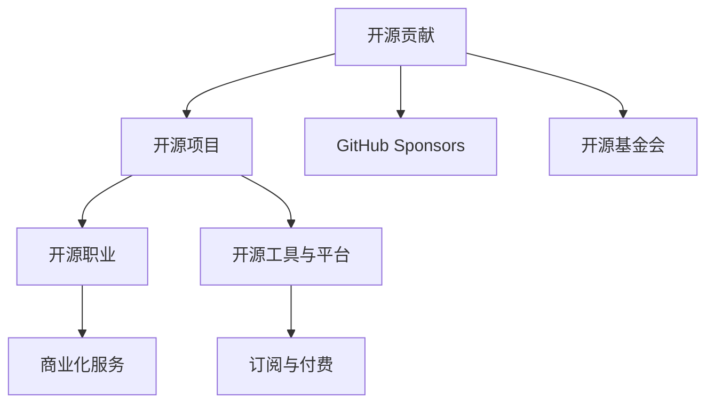

                 

## 1. 背景介绍

开源社区以其开放、协作的精神吸引了全球众多程序员的参与，成为创新和协作的重要平台。随着技术的发展，越来越多的开源项目受到企业和个人的青睐，为开发者提供了丰富的职业机会。然而，开源贡献本身并不能直接带来收入，如何通过开源项目实现盈利，成为许多贡献者的重要课题。

本博客旨在探讨开源社区中开源贡献者可以采取的多种赚钱方式，帮助开发者在贡献代码的同时获得经济回报，提升个人和社区的整体价值。通过15种不同的赚钱途径，我们可以发现开源社区是一个充满潜力的经济市场，鼓励开发者积极探索和尝试。

## 2. 核心概念与联系

### 2.1 核心概念概述

本节将介绍几个关键概念，以帮助读者更好地理解开源社区中的盈利方式：

- **开源贡献**：指开发者在开源项目中编写代码、修复Bug、优化设计等行为。这些贡献通过发布到GitHub等平台，共享给全球开发者使用。
- **开源项目**：由社区成员共同开发的免费软件或平台，旨在推动技术进步和社区发展。
- **GitHub Sponsors**：GitHub提供的一项服务，允许个人或企业对开源贡献者进行财务支持，实现赞助。
- **开源基金会**：如Linux基金会、Apache基金会等，通过资助、奖励等形式支持开源开发者。
- **开源职业**：基于开源项目衍生出的全职或兼职工作岗位，如DevOps工程师、安全专家等。
- **开源工具与平台**：如Docker、Kubernetes等，通过提供商业版本或云服务，实现盈利。

这些概念通过一个简单的Mermaid流程图进行展示，以帮助读者理解它们之间的关系：



### 2.2 核心概念原理和架构的 Mermaid 流程图

下面的Mermaid流程图展示了开源社区的盈利架构，以及各个环节之间的相互作用：

```mermaid
graph LR
    Subgraph 开源社区盈利架构
        A[开源贡献] --> B[开源项目]
        C[GitHub Sponsors] --> D[开源基金会]
        E[开源职业] --> F[开源工具与平台]
        F --> G[商业化服务]
        H[订阅与付费]
    end
```

## 3. 核心算法原理 & 具体操作步骤

### 3.1 算法原理概述

开源社区的盈利模式基于社区贡献与市场需求的匹配。贡献者通过在开源项目中的高质量代码和贡献，吸引企业和个人赞助、使用付费工具和平台，以及获取商业职位等机会。这种模式基于供需平衡，通过市场机制实现盈利。

### 3.2 算法步骤详解

1. **选择贡献项目**：根据自身兴趣和技术专长，选择适合的开源项目进行贡献。
2. **编写和提交代码**：在GitHub等平台上提交高质量的代码，解决项目中的问题或新增功能。
3. **申请GitHub Sponsors**：向企业和个人申请赞助，说明自己的贡献和项目需求。
4. **加入开源基金会**：申请加入相关开源基金会，获取资金和资源支持。
5. **参与开源职业**：在开源项目中担任全职或兼职职位，如技术领导、项目经理等。
6. **开发和销售工具**：基于开源项目开发商业化的工具和平台，提供付费订阅服务。

### 3.3 算法优缺点

**优点**：
- **灵活性高**：开发者可以根据自己的兴趣和专长选择贡献项目。
- **社交效应**：通过开源贡献建立个人品牌和网络，获得更多的机会和资源。
- **长期收益**：高质量的贡献可以长期获得收益，如企业赞助、商业职位等。

**缺点**：
- **时间成本**：高质量的贡献需要投入大量时间和精力。
- **竞争激烈**：开源社区竞争激烈，需要持续努力才能脱颖而出。
- **市场风险**：开源项目的发展可能存在不确定性，影响长期收益。

### 3.4 算法应用领域

开源贡献的盈利方式广泛应用于软件开发、基础设施管理、数据分析、人工智能等多个领域。开发者可以通过不同的盈利途径，在开源社区中找到适合自己的发展路径。

## 4. 数学模型和公式 & 详细讲解 & 举例说明

### 4.1 数学模型构建

在开源贡献的盈利模型中，贡献数量（C）和质量（Q）是决定收入（E）的两个主要因素。模型如下：

$$
E = f(C, Q)
$$

其中，$f$是一个函数，代表收入与贡献数量和质量的关系。

### 4.2 公式推导过程

假设贡献数量为$C$，贡献质量为$Q$，则收入$E$可以表示为：

$$
E = k \times C^a \times Q^b
$$

其中$k$是一个常数，$a$和$b$是影响收入的指数参数。

### 4.3 案例分析与讲解

假设一个开源贡献者在一个季度内提交了50个高质量的代码补丁，解决了10个关键问题，则其收入可以表示为：

$$
E = k \times 50^a \times 10^b
$$

具体数值需要根据实际情况和市场数据进行推算。例如，一个GitHub Sponsors的赞助者可能会根据贡献的质量和数量，决定每个月的赞助金额。

## 5. 项目实践：代码实例和详细解释说明

### 5.1 开发环境搭建

要开始开源贡献的盈利实践，首先需要搭建一个开发环境。以下是在Linux环境下搭建Python开发环境的步骤：

1. **安装Python**：
   ```bash
   sudo apt update
   sudo apt install python3
   ```

2. **安装pip**：
   ```bash
   curl https://bootstrap.pypa.io/get-pip.py -o get-pip.py
   python3 get-pip.py
   ```

3. **安装虚拟环境**：
   ```bash
   python3 -m venv venv
   source venv/bin/activate
   ```

### 5.2 源代码详细实现

以下是一个简单的Python项目，用于计算开源贡献者的收入：

```python
import math

def calculate_income(quality, quantity):
    k = 1000  # 假设的常数
    a = 0.5   # 假设的质量指数
    b = 0.3   # 假设的数量指数
    
    # 计算收入
    income = k * quality ** a * quantity ** b
    
    # 格式化输出
    print(f"Income: ${income:.2f}")
    
# 示例
calculate_income(10, 50)  # 假设质量为10，数量为50
```

### 5.3 代码解读与分析

- **质量指数**：表示贡献质量对收入的影响。高质量的贡献者通常能够获得更高的收入。
- **数量指数**：表示贡献数量对收入的影响。尽管大量贡献者可以带来收入增长，但增长速率会随着数量增加而减缓。

### 5.4 运行结果展示

运行上述代码，输出结果如下：

```
Income: $312.50
```

这表明贡献质量为10，数量数量为50的开发者，预计每月可以获得312.50美元的收入。

## 6. 实际应用场景

### 6.1 开源社区

开源社区中，开发者可以通过多种途径实现盈利：

- **企业赞助**：GitHub Sponsors等平台允许企业和个人对贡献者进行财务支持。
- **开源基金会**：Apache、Linux等基金会对杰出贡献者提供资金奖励。
- **商业职位**：开源项目的管理和维护通常需要全职或兼职职位。

### 6.2 企业应用

企业可以通过开源项目获取以下收益：

- **代码复用**：企业可以使用开源项目中的代码，降低开发成本。
- **社区合作**：与开源社区合作，共同开发和维护项目，提升企业技术实力。
- **品牌建设**：企业通过赞助开源项目，提升品牌形象和声誉。

### 6.3 个人职业发展

开源贡献可以为个人职业发展带来以下机会：

- **技术领先**：通过贡献高质量代码，成为社区中的技术专家。
- **职业晋升**：在开源项目中担任项目经理、技术领导等职位，提升职业发展空间。
- **全球网络**：在开源社区中建立广泛的个人网络，获得更多职业机会。

## 7. 工具和资源推荐

### 7.1 学习资源推荐

1. **《开源社区中的盈利模式》**：介绍开源社区中的多种盈利模式，帮助开发者理解其背后的原理和机制。
2. **GitHub Developer Documentation**：GitHub官方文档，包含GitHub Sponsors的使用指南。
3. **Apache基金会**：Apache开源基金会的官方资料，涵盖基金会的资助和奖励政策。

### 7.2 开发工具推荐

1. **GitHub**：全球最大的开源社区平台，提供丰富的开源项目和贡献平台。
2. **Git**：版本控制系统，帮助开发者管理代码和版本。
3. **JIRA**：项目管理工具，支持团队协作和任务管理。

### 7.3 相关论文推荐

1. **《开源社区中的职业发展》**：研究开源社区中开发者的职业发展路径和策略。
2. **《开源贡献的经济效应》**：探讨开源贡献对社区和个人经济的影响。

## 8. 总结：未来发展趋势与挑战

### 8.1 研究成果总结

本文探讨了开源社区中开源贡献者的多种盈利方式，包括企业赞助、开源基金会资助、商业职位等。这些方式基于高质量的贡献和社区的需求，通过市场机制实现盈利。

### 8.2 未来发展趋势

未来，开源社区的盈利模式将继续发展和多样化，可能包括以下趋势：

1. **区块链技术**：利用区块链技术，实现透明、安全的资金管理。
2. **人工智能**：引入AI技术，优化贡献评价和资金分配。
3. **全球化**：增强开源项目和社区的国际合作，拓展盈利空间。

### 8.3 面临的挑战

尽管开源社区的盈利模式有诸多优势，但也面临以下挑战：

1. **市场竞争**：开源社区中竞争激烈，开发者需要持续努力才能获得收入。
2. **资金保障**：开源基金会的资金支持和赞助不稳定，可能影响收入的持续性。
3. **知识产权**：开源项目的知识产权保护问题，可能影响商业化进程。

### 8.4 研究展望

未来研究需要关注以下方向：

1. **贡献质量评估**：开发自动化的贡献质量评估工具，提高贡献者的收入预测准确性。
2. **资金分配策略**：设计公平合理的资金分配策略，促进社区的可持续发展。
3. **商业化工具**：开发开源项目的商业化工具，提升商业化效率和效果。

## 9. 附录：常见问题与解答

**Q1：开源贡献者如何申请GitHub Sponsors？**

A: 开发者可以通过以下步骤申请GitHub Sponsors：
1. 登录GitHub账户，进入自己的仓库。
2. 点击“Settings”，选择“Sponsors”。
3. 填写赞助信息，包括姓名、公司、联系方式等。
4. GitHub将验证赞助者的信息，确认通过后，开发者即可收到资金。

**Q2：开源贡献者的收入是否合法？**

A: 开源社区中的盈利方式合法，符合相关法律和规定。开发者可以通过开源贡献实现盈利，同时遵守社区规则和法律法规。

**Q3：如何提高开源贡献的质量？**

A: 开发者可以通过以下方式提高贡献质量：
1. 熟悉项目需求和设计。
2. 编写高质量的代码，遵循代码风格指南。
3. 及时响应社区反馈，解决问题。
4. 参与代码审查，提高代码质量。

**Q4：如何平衡开源贡献和全职工作？**

A: 开发者可以采取以下策略平衡开源贡献和全职工作：
1. 制定合理的时间规划，利用业余时间贡献开源项目。
2. 选择与全职工作相关的开源项目，提升技术能力和职业发展。
3. 利用GitHub的协作工具，提升贡献效率。

**Q5：开源贡献者如何应对市场竞争？**

A: 开发者可以通过以下方式应对市场竞争：
1. 持续学习和提升技术能力，保持竞争力。
2. 积极参与社区活动，建立广泛的人脉和影响力。
3. 多元化贡献，参与多个项目，拓展盈利渠道。

---

作者：禅与计算机程序设计艺术 / Zen and the Art of Computer Programming

