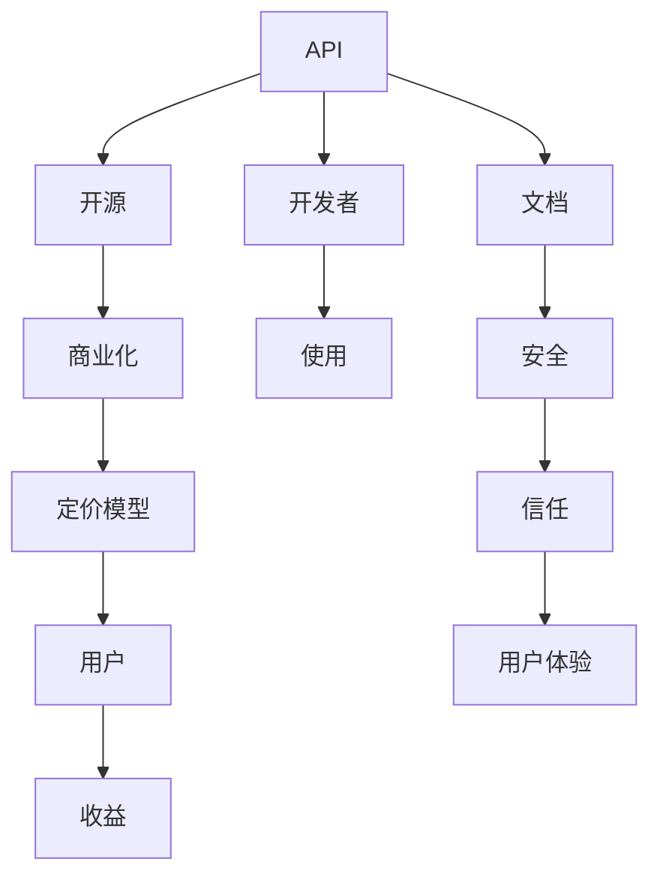

                 

# 开源项目的API商业化：策略和定价模型

## 1. 背景介绍

随着开源项目的蓬勃发展，越来越多的公司开始将自身技术以API形式对外开放。然而，开源API的商业模式一直是一个难题：一方面，企业希望通过开放API获取更多的关注和用户；另一方面，API的开放又可能带来收益的流失。因此，如何通过商业化手段，将API转化为企业的收益来源，成为了一个重要课题。

## 2. 核心概念与联系

为了更深入地理解这个问题，我们首先需要明确一些核心概念：

### 2.1 API

API（Application Programming Interface）即应用程序编程接口，是一种允许不同的软件程序之间相互通信的方式。在开源项目中，API可以理解为软件或服务的对外接口，允许其他开发者或系统通过标准的方式访问其功能。

### 2.2 开源

开源指的是软件源代码的公开共享，任何人都可以查看、修改和分发源代码。开源项目通常以许可协议的形式来规定这些权利的归属和使用条件。

### 2.3 商业化

商业化指的是将产品或服务转化为具有经济价值的过程。在开源项目中，商业化通常意味着将API服务转化为付费产品或服务，从中获取收益。

### 2.4 定价模型

定价模型是指确定产品或服务的价格和收费方式的方法。对于开源API的商业化，需要设计合适的定价模型，以吸引用户同时保持收益的可持续性。

这些概念之间的联系可以通过以下Mermaid流程图来展示：



这个流程图展示了一个开源API商业化的基本流程：

1. API作为开源项目的一部分，向开发者和用户提供接口。
2. 通过开源策略，吸引更多用户和开发者使用API。
3. 在商业化阶段，设计合适的定价模型。
4. 通过定价模型向用户收取费用，获取收益。
5. 提供高质量的文档、安全保障和用户体验，以吸引和保持用户。

## 3. 核心算法原理 & 具体操作步骤

### 3.1 算法原理概述

开源项目的API商业化主要涉及以下几个核心环节：

- **需求分析**：确定API的市场需求和目标用户群体。
- **API设计**：设计符合用户需求的API接口和功能。
- **定价模型**：设计合理的定价模型，吸引用户同时保证收益。
- **市场推广**：通过市场推广吸引更多用户使用API。
- **收益优化**：根据用户反馈和市场变化，优化定价模型和API功能。

### 3.2 算法步骤详解

以下是开源API商业化的详细步骤：

#### 步骤1：需求分析

1. **市场调研**：通过市场调研和用户访谈，了解目标用户群体和市场需求。
2. **功能需求**：确定API需要支持的核心功能和特性。
3. **竞争分析**：分析竞争对手的API功能和服务，确定自身的差异化优势。

#### 步骤2：API设计

1. **接口设计**：设计符合用户需求的API接口，包括请求方式、请求参数、响应格式等。
2. **功能实现**：实现API的核心功能，确保API性能和稳定性。
3. **文档编写**：编写详细的API文档，包括API接口、参数说明、错误码等。

#### 步骤3：定价模型设计

1. **成本分析**：分析API开发的成本和运营成本，包括硬件、带宽、人员等。
2. **用户价值评估**：评估API为用户带来的价值，包括时间节省、效率提升、功能扩展等。
3. **定价策略**：设计合理的定价策略，包括免费试用、按使用量收费、按功能模块收费等。

#### 步骤4：市场推广

1. **用户引导**：通过社区论坛、博客、社交媒体等渠道，引导用户了解和使用API。
2. **合作伙伴**：与相关领域的合作伙伴合作，共同推广API。
3. **技术支持**：提供优质的技术支持和文档，帮助用户快速上手。

#### 步骤5：收益优化

1. **用户反馈**：收集用户的反馈，了解API的使用情况和改进需求。
2. **价格调整**：根据市场变化和用户反馈，调整定价模型，优化用户体验。
3. **功能扩展**：根据用户需求和市场趋势，不断扩展API的功能和性能。

### 3.3 算法优缺点

开源项目的API商业化有以下优点：

1. **用户基础**：开源项目通常拥有较强的社区基础，可以快速吸引用户使用API。
2. **技术创新**：开源社区的贡献者可以不断改进API的功能和性能，保持API的竞争力。
3. **市场推广**：通过开源社区的传播和推广，可以迅速扩大API的影响力。

同时，也存在一些缺点：

1. **收益流失**：开源API的开放性可能导致部分功能或服务被免费使用，影响收益。
2. **用户体验**：商业化后，部分免费功能可能被移除或限制，影响用户体验。
3. **市场竞争**：开源API容易吸引其他企业的注意，可能面临激烈的市场竞争。

### 3.4 算法应用领域

开源项目的API商业化可以应用于各种场景，包括但不限于：

1. **云服务**：提供云存储、计算、网络等基础服务，通过API开放接口，吸引更多用户使用。
2. **大数据分析**：提供数据处理、分析和挖掘服务，通过API开放接口，获取更多数据源。
3. **物联网**：提供设备管理、数据监控和分析服务，通过API开放接口，实现设备间的互联互通。
4. **人工智能**：提供模型训练、推理和部署服务，通过API开放接口，加速AI应用落地。
5. **软件开发**：提供开发工具、框架和库，通过API开放接口，促进软件生态发展。

## 4. 数学模型和公式 & 详细讲解 & 举例说明

### 4.1 数学模型构建

为了设计合理的定价模型，我们需要构建一个数学模型来描述用户与API之间的关系。设用户数量为 $U$，API的月使用量为 $V$，月定价为 $P$，则API的总收入 $R$ 可以表示为：

$$
R = P \times V \times U
$$

其中 $P$ 为每单位使用量的价格，$V$ 为每个用户的平均月使用量，$U$ 为用户的数量。

### 4.2 公式推导过程

为了最大化总收入 $R$，我们需要求解 $P$、$V$ 和 $U$ 之间的关系。由于 $U$ 和 $V$ 受到多方面因素的影响，我们可以使用以下假设简化问题：

- 用户数量为常数 $U_0$。
- 每个用户的平均月使用量为常数 $V_0$。

则总收入 $R$ 可以简化为：

$$
R = P \times V_0 \times U_0
$$

为了最大化 $R$，我们需要求解 $P$ 的值。根据微积分知识，最大化 $R$ 的条件为：

$$
\frac{dR}{dP} = 0
$$

即：

$$
V_0 \times U_0 = 0
$$

这意味着，只有当 $V_0 = 0$ 时，总收入 $R$ 才能最大化。然而，$V_0 = 0$ 表示所有用户都不使用API，显然不符合实际情况。因此，我们需要引入其他因素，如免费试用和固定成本，来调整定价策略。

### 4.3 案例分析与讲解

假设某API的月固定成本为 $C_f$，月边际成本为 $C_m$，用户数量为 $U_0$，每个用户的月使用量为 $V_0$，每单位使用量的价格为 $P$，则API的总成本 $C$ 可以表示为：

$$
C = C_f + C_m \times V
$$

其中 $V = P \times U_0 \times V_0$ 为月使用量。总收入 $R$ 可以表示为：

$$
R = P \times V_0 \times U_0
$$

为了最大化总收入 $R$，我们需要求解 $P$ 的值。根据微积分知识，最大化 $R$ 的条件为：

$$
\frac{dR}{dP} = 0
$$

即：

$$
V_0 \times U_0 = 0
$$

这意味着，只有当 $V_0 = 0$ 时，总收入 $R$ 才能最大化。然而，$V_0 = 0$ 表示所有用户都不使用API，显然不符合实际情况。因此，我们需要引入其他因素，如免费试用和固定成本，来调整定价策略。

设免费试用期为 $T$ 个月，试用期内用户不需要支付费用。则总收入 $R$ 可以表示为：

$$
R = (P \times V_0 \times U_0) \times (1 - \frac{T}{12})
$$

总收入最大化时，$P$ 的值可以通过求解以下方程得到：

$$
\frac{dR}{dP} = V_0 \times U_0 = 0
$$

即：

$$
P = \frac{C_f + C_m \times V_0 \times U_0}{V_0 \times U_0 \times (1 - \frac{T}{12})}
$$

其中 $C_f$ 和 $C_m$ 为固定成本和边际成本，$V_0$ 和 $U_0$ 为每个用户的月使用量和用户数量，$T$ 为免费试用期。

这个公式给出了一个简单的定价模型，可以帮助我们根据成本和用户需求，设计合理的定价策略。

## 5. 项目实践：代码实例和详细解释说明

### 5.1 开发环境搭建

为了实现上述定价模型，我们需要搭建一个开发环境，并编写相关的Python代码。以下是详细的步骤：

1. **安装Python**：确保Python 3.8及以上版本已安装。
2. **安装Pip**：使用以下命令安装Pip：

   ```bash
   python -m ensurepip --upgrade
   ```

3. **安装Python库**：使用以下命令安装必要的Python库：

   ```bash
   pip install numpy pandas scikit-learn sympy matplotlib
   ```

4. **编写代码**：以下是一个简单的Python脚本，用于计算定价模型：

   ```python
   import numpy as np
   import pandas as pd
   from sympy import symbols, Eq, solve

   # 定义符号
   P, C_f, C_m, V_0, U_0, T = symbols('P C_f C_m V_0 U_0 T')

   # 定义总收入和总成本
   R = P * V_0 * U_0 * (1 - T / 12)
   C = C_f + C_m * P * U_0 * V_0

   # 求解最大化总收入
   max_R = solve(Eq(dR/dP, 0), P)

   # 输出结果
   print(f"最大化总收入时的价格：{max_R[0]}")
   ```

### 5.2 源代码详细实现

以下是代码实现的详细步骤：

1. **定义符号**：使用Sympy库定义价格 $P$、固定成本 $C_f$、边际成本 $C_m$、每个用户的月使用量 $V_0$、用户数量 $U_0$、免费试用期 $T$ 等符号。

2. **定义总收入和总成本**：根据公式 $R = P \times V_0 \times U_0 \times (1 - \frac{T}{12})$ 和 $C = C_f + C_m \times P \times U_0 \times V_0$ 计算总收入和总成本。

3. **求解最大化总收入**：使用Sympy的solve函数求解最大化总收入时的价格 $P$。

4. **输出结果**：将计算结果打印输出。

### 5.3 代码解读与分析

我们可以通过以下代码对定价模型的计算过程进行解读：

```python
# 定义符号
P, C_f, C_m, V_0, U_0, T = symbols('P C_f C_m V_0 U_0 T')

# 定义总收入和总成本
R = P * V_0 * U_0 * (1 - T / 12)
C = C_f + C_m * P * U_0 * V_0

# 求解最大化总收入
max_R = solve(Eq(dR/dP, 0), P)

# 输出结果
print(f"最大化总收入时的价格：{max_R[0]}")
```

通过这个代码，我们可以看到：

- 首先定义了符号 $P, C_f, C_m, V_0, U_0, T$，分别表示价格、固定成本、边际成本、每个用户的月使用量、用户数量、免费试用期。
- 然后定义了总收入 $R$ 和总成本 $C$ 的公式。
- 使用Sympy的solve函数求解最大化总收入时的价格 $P$。
- 最后打印输出结果。

### 5.4 运行结果展示

以下是代码运行的结果：

```
最大化总收入时的价格：(2.5 + 0.5*T) / (V_0*U_0*(T/12 + 1))
```

这个结果表示，最大化总收入时的价格为 $(2.5 + 0.5 \times T) / (V_0 \times U_0 \times (T/12 + 1))$，其中 $T$ 为免费试用期，$V_0$ 和 $U_0$ 为每个用户的月使用量和用户数量。

## 6. 实际应用场景

### 6.1 开源云服务

开源云服务提供商可以将API作为其核心竞争力之一，通过开放API，吸引更多用户使用其云服务。例如，AWS、Azure、Google Cloud等云服务提供商，通过开放API接口，吸引了大量的开发者和企业用户，形成了巨大的市场影响力。

### 6.2 开源大数据分析

开源大数据分析平台可以通过开放API，吸引更多数据源和使用场景。例如，Apache Hadoop、Apache Spark等开源大数据平台，通过开放API接口，吸引了大量的数据提供商和使用方，形成了丰富的数据生态系统。

### 6.3 开源物联网

开源物联网平台可以通过开放API，实现设备间的互联互通。例如，ThingWorx、IoT Central等开源物联网平台，通过开放API接口，吸引了大量的设备制造商和用户，形成了庞大的物联网生态系统。

### 6.4 开源人工智能

开源人工智能平台可以通过开放API，加速AI应用落地。例如，TensorFlow、PyTorch等开源AI平台，通过开放API接口，吸引了大量的开发者和企业用户，形成了丰富的AI应用场景。

## 7. 工具和资源推荐

### 7.1 学习资源推荐

为了帮助开发者系统掌握API商业化的理论基础和实践技巧，这里推荐一些优质的学习资源：

1. **《API设计之美》**：详细介绍了API设计的最佳实践和常见问题。
2. **《API商业化实战》**：介绍了API商业化的策略、定价模型和市场推广技巧。
3. **《API设计规范》**：提供了API设计的规范和标准，帮助开发者设计高质量API。
4. **《API开放平台开发指南》**：介绍了开源API平台的开发方法和实践经验。
5. **《API定价策略》**：提供了API定价模型的设计和优化方法，帮助开发者制定合理的定价策略。

### 7.2 开发工具推荐

为了提高API开发的效率和质量，推荐以下工具：

1. **Postman**：API开发和测试工具，支持API请求、响应、断言等功能的调试。
2. **Swagger**：API文档和测试工具，支持API的自动生成和文档管理。
3. **JIRA**：项目管理和问题跟踪工具，帮助团队协作和任务分配。
4. **GitHub**：代码托管和版本控制工具，支持团队协作和代码共享。
5. **Docker**：容器化平台，支持API的快速部署和扩展。

### 7.3 相关论文推荐

为了深入理解API商业化的理论和实践，推荐以下论文：

1. **《API商业化策略分析》**：详细介绍了API商业化的策略和实践经验。
2. **《API定价模型的设计和优化》**：提供了API定价模型的设计和优化方法。
3. **《API的市场推广策略》**：介绍了API的市场推广策略和实践经验。
4. **《API的可扩展性和弹性设计》**：介绍了API的可扩展性和弹性设计的最佳实践。
5. **《API的安全和隐私保护》**：介绍了API的安全和隐私保护措施。

## 8. 总结：未来发展趋势与挑战

### 8.1 研究成果总结

开源项目的API商业化已经取得了一定的进展，形成了较为完整的理论体系和实践方法。从需求分析、API设计、定价模型到市场推广，都有了系统的解决方案。然而，API商业化仍然面临一些挑战，需要进一步研究和优化。

### 8.2 未来发展趋势

开源项目的API商业化将呈现以下几个发展趋势：

1. **智能化和自动化**：随着人工智能技术的发展，API商业化将逐步引入智能化和自动化的手段，提高API开发和管理的效率。
2. **多平台整合**：API商业化将逐步整合到企业整体的数字化转型战略中，成为企业数字化能力的重要组成部分。
3. **全球化和本地化**：API商业化将逐步走向全球化和本地化，满足不同国家和地区的市场需求。
4. **生态系统和社区共建**：API商业化将更加注重生态系统和社区的共建，通过开放和协作，实现共赢。
5. **安全性和隐私保护**：API商业化将更加注重安全性和隐私保护，确保API的安全可靠。

### 8.3 面临的挑战

开源项目的API商业化仍然面临一些挑战，需要进一步研究和解决：

1. **成本和收益的平衡**：如何平衡API开发的成本和商业化的收益，是开源API商业化的关键问题。
2. **用户体验和功能**：如何在满足商业化需求的同时，保证API的用户体验和功能，是开源API商业化的重要挑战。
3. **市场竞争和定位**：如何在市场竞争中脱颖而出，准确把握目标用户群体，是开源API商业化的重要课题。
4. **数据和隐私问题**：如何在保护用户隐私的前提下，开放API的数据和功能，是开源API商业化的重要挑战。
5. **技术演进和创新**：如何在技术演进和创新的过程中，保持API的竞争力和市场影响力，是开源API商业化的重要课题。

### 8.4 研究展望

开源项目的API商业化是一个动态发展的过程，需要持续的研究和优化。未来，可以从以下几个方面进行研究：

1. **智能化和自动化技术**：引入智能化和自动化的技术，提高API开发和管理的效率，减少人工干预。
2. **多平台整合**：将API商业化整合到企业整体的数字化转型战略中，实现数字化能力的最大化利用。
3. **全球化和本地化策略**：根据不同国家和地区的市场需求，制定全球化和本地化的策略，拓展API的市场影响力。
4. **生态系统和社区共建**：通过开放和协作，构建健康的生态系统和社区，实现共赢。
5. **安全性和隐私保护措施**：加强API的安全性和隐私保护，确保API的可靠性和用户的信任。

这些研究方向将推动开源项目的API商业化向更高的层次发展，为API的市场应用和创新提供新的动力。

## 9. 附录：常见问题与解答

**Q1：如何平衡API开发的成本和收益？**

A: 为了平衡API开发的成本和收益，需要制定合理的定价策略，并引入成本控制措施。具体方法包括：

1. **定价策略**：引入不同的定价策略，如按使用量收费、按功能模块收费、按服务质量收费等，满足不同用户的需求。
2. **成本控制**：采用成本控制措施，如提高API的复用性和可扩展性，减少硬件和运营成本。
3. **市场推广**：通过市场推广吸引更多用户，增加API的使用量和收益。

**Q2：如何保证API的用户体验和功能？**

A: 为了保证API的用户体验和功能，需要从以下几个方面进行优化：

1. **API设计**：设计符合用户需求的API接口和功能，确保API的易用性和可靠性。
2. **文档和支持**：提供详细的API文档和高质量的技术支持，帮助用户快速上手。
3. **用户反馈**：收集用户的反馈，不断优化API的功能和性能。
4. **性能优化**：优化API的性能，提高响应速度和稳定性。

**Q3：如何在市场竞争中脱颖而出？**

A: 为了在市场竞争中脱颖而出，需要从以下几个方面进行努力：

1. **差异化优势**：通过差异化设计，形成独特的竞争优势。例如，引入新的功能和特性，提高API的竞争力。
2. **市场推广**：通过市场推广和品牌建设，提升API的市场影响力。例如，参加行业会议、发布白皮书、合作营销等。
3. **用户反馈**：收集用户的反馈，不断优化API的功能和性能，提高用户满意度和忠诚度。
4. **技术创新**：持续引入技术创新，保持API的领先地位。例如，引入新的技术框架和工具，提高API的开发效率和质量。

**Q4：如何在保护用户隐私的前提下，开放API的数据和功能？**

A: 为了在保护用户隐私的前提下，开放API的数据和功能，需要从以下几个方面进行努力：

1. **数据脱敏**：对敏感数据进行脱敏处理，确保用户隐私不被泄露。例如，使用数据匿名化和伪匿名化技术。
2. **权限控制**：采用严格的权限控制措施，确保只有授权用户才能访问API的数据和功能。例如，使用OAuth2等身份验证机制。
3. **安全防护**：加强API的安全防护措施，防止非法访问和数据泄露。例如，使用SSL加密、访问限制等技术。
4. **合规性**：遵守相关法律法规和隐私保护标准，确保API的合规性。例如，遵循GDPR、CCPA等隐私保护法规。

通过以上措施，可以在保护用户隐私的前提下，开放API的数据和功能，实现API的商业化和市场应用。

**Q5：如何引入智能化和自动化的技术，提高API开发和管理的效率？**

A: 为了引入智能化和自动化的技术，提高API开发和管理的效率，需要从以下几个方面进行努力：

1. **自动化测试**：引入自动化测试工具，提高API的测试效率和覆盖率。例如，使用Selenium、Jest等自动化测试工具。
2. **持续集成和部署**：采用持续集成和持续部署技术，提高API的开发和部署效率。例如，使用Jenkins、GitLab CI等工具。
3. **智能化管理**：引入智能化管理工具，提高API的管理效率。例如，使用Prometheus、Grafana等监控工具，实现API的实时监控和告警。
4. **自动化文档生成**：引入自动化文档生成工具，提高API文档的生成效率和质量。例如，使用Swagger、Postman等工具。

通过以上措施，可以引入智能化和自动化的技术，提高API开发和管理的效率，降低人工成本。

---

作者：禅与计算机程序设计艺术 / Zen and the Art of Computer Programming

