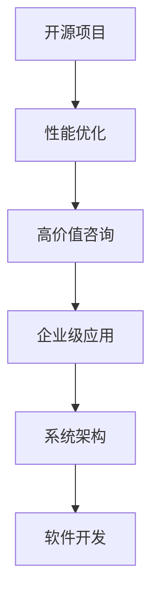

                 

# 开源项目的企业级性能优化服务：高价值咨询

> 关键词：开源项目, 企业级性能优化, 高价值咨询, 系统架构, 软件开发

## 1. 背景介绍

在当今数字化时代，企业级应用的软件系统正在快速增长，面临着复杂多变的业务需求、海量数据的处理、快速响应的服务要求。如何构建高效、稳定、可扩展的软件系统，已成为每个企业IT团队面临的重要课题。特别是在云原生技术、DevOps、人工智能等前沿领域的迅猛发展下，性能优化成为支撑企业数字化转型和创新的关键环节。

开源项目作为一种重要的技术资源，以其灵活性、开放性和社区驱动的创新动力，在企业级应用中扮演着越来越重要的角色。然而，开源项目同样面临着性能优化难题，特别是那些功能强大、代码复杂、生态系统庞大、用户群体众多的开源项目，其性能优化问题尤为突出。本文将聚焦于如何通过高价值咨询，帮助企业级应用进行开源项目的性能优化，使开源项目能够更好地服务于企业级场景。

## 2. 核心概念与联系

### 2.1 核心概念概述

为更好地理解企业级开源项目性能优化，本节将介绍几个关键概念：

- **开源项目（Open Source Project）**：指开放源代码的项目，如Apache、Linux、Kubernetes等。其特点是代码透明、可协作，通常由社区驱动。

- **性能优化（Performance Optimization）**：指通过对软件系统进行各种调优手段，提升系统的响应速度、处理能力、资源利用效率等性能指标。

- **高价值咨询（High-value Consulting）**：指利用专业知识和经验，通过诊断、建议、实施等环节，帮助企业实现开源项目性能优化的一种服务形式。

- **企业级应用（Enterprise-Level Application）**：指大规模、复杂、稳定运行在企业内部或外部网络环境的软件系统，如企业ERP、CRM、电商平台、移动应用等。

- **系统架构（System Architecture）**：指软件系统的结构设计，包括组件、模块、通信协议等。架构设计直接影响系统的性能、可扩展性和维护性。

- **软件开发（Software Development）**：指编写、测试、部署、维护软件系统的全过程。开发质量直接关系到系统的稳定性和性能表现。

这些核心概念之间的逻辑关系可以通过以下Mermaid流程图来展示：



这个流程图展示了几组概念之间的关联性：

1. 开源项目通过性能优化，提升其应用性能。
2. 高价值咨询是对开源项目性能优化进行指导和实施，使其更好地服务于企业级应用。
3. 企业级应用需要优质的开源项目，通过性能优化提升用户体验和业务效率。
4. 系统架构和软件开发是性能优化的基础和关键环节，优化决策需要基于对架构和开发过程的深刻理解。

这些概念共同构成了企业级开源项目性能优化的理论基础，有助于我们深入理解其工作原理和优化方向。

## 3. 核心算法原理 & 具体操作步骤

### 3.1 算法原理概述

企业级开源项目性能优化，本质上是通过一系列系统架构和软件开发技术手段，实现性能指标的提升。其核心思想是：基于性能监控数据，识别性能瓶颈，采用针对性优化策略，提升整体系统性能。

形式化地，设企业级应用的开源项目为 $S$，其性能瓶颈集合为 $P$。优化目标是最小化 $P$ 集合的大小，即找到最优性能改进方案：

$$
\min_{S_{opt}} \lvert P \rvert
$$

其中 $S_{opt}$ 为优化后的开源项目，$\lvert P \rvert$ 表示性能瓶颈数量。

通过梯度下降等优化算法，不断迭代改进模型，逐步消除 $P$ 中的各项瓶颈，最终得到一个高效、稳定的企业级应用系统。

### 3.2 算法步骤详解

企业级开源项目性能优化的一般步骤包括：

**Step 1: 性能监控与数据分析**
- 部署性能监控工具，收集系统运行时的性能指标。
- 使用APM（应用程序性能管理）工具对系统进行实时监控，记录资源占用、请求响应时间、错误率等数据。
- 采用大数据分析技术，对监控数据进行深入分析，识别出系统性能瓶颈。

**Step 2: 性能瓶颈诊断**
- 根据性能监控数据，识别瓶颈原因。包括硬件资源不足、数据库查询慢、网络延迟、应用逻辑问题等。
- 使用A/B测试、异步化、缓存策略、负载均衡等技术手段进行针对性的优化实验。
- 通过测试数据验证优化效果，并逐步缩小性能瓶颈范围。

**Step 3: 性能优化实施**
- 根据瓶颈分析结果，设计优化方案，如调整系统架构、重构代码、优化算法、增加缓存等。
- 在测试环境中进行优化方案的实施和测试，确保方案可行且效果显著。
- 部署优化后的开源项目到生产环境，并监测其运行性能。

**Step 4: 持续性能监控与优化**
- 在生产环境中持续监控开源项目的性能指标，及时发现新出现的性能问题。
- 使用机器学习、大数据分析等技术手段，预测性能趋势，进行提前干预。
- 定期对性能优化策略进行评估，迭代更新优化方案，确保系统的长期性能稳定。

### 3.3 算法优缺点

企业级开源项目性能优化方法具有以下优点：
1. 灵活性高。开源项目的开放性和社区驱动的创新动力，使其可以灵活应用各种性能优化技术和策略。
2. 成本低。开源项目通常有大量的文档和社区资源，优化过程中可以借鉴他人经验，降低开发成本。
3. 迭代性强。性能优化是一个持续的过程，通过持续监控和调整，可以逐步提升系统性能。
4. 适用面广。适用于各类企业级应用的开源项目，从架构设计到代码实现，均可进行优化。

同时，该方法也存在一定的局限性：
1. 技术复杂。开源项目的功能和架构通常较为复杂，性能优化需要深入理解项目代码和技术栈。
2. 风险高。优化过程可能破坏原有架构或代码稳定性，导致新问题出现。
3. 资源消耗高。性能优化可能涉及代码重构、架构调整等操作，需要大量时间和人力资源。
4. 实施难度大。对于非专业的团队，性能优化可能面临技术瓶颈，无法有效实施。

尽管存在这些局限性，但就目前而言，企业级开源项目性能优化仍是不可或缺的优化手段。未来相关研究的重点在于如何进一步提高性能优化效率，降低实施难度，提高优化效果。

### 3.4 算法应用领域

企业级开源项目性能优化方法，在各个领域都有广泛的应用，例如：

- 云计算平台：优化计算资源利用率，提升云服务响应速度，减少服务中断。
- 大数据系统：优化数据处理流程，提高查询效率，保障数据一致性和完整性。
- 物联网应用：优化通信协议，减少数据传输延时，提升设备连接和数据交互的稳定性。
- 企业ERP系统：优化业务流程，减少系统响应时间，提升用户体验和企业效率。
- 电商平台：优化订单处理逻辑，提高交易速度，保障数据安全，提升用户体验。

除了上述这些经典应用外，企业级开源项目性能优化方法也在更多领域得到创新性地应用，如金融系统、医疗系统、供应链管理等，为各类行业数字化转型提供了强有力的技术支撑。

## 4. 数学模型和公式 & 详细讲解 & 举例说明

### 4.1 数学模型构建

本节将使用数学语言对企业级开源项目性能优化过程进行更加严格的刻画。

设企业级应用的开源项目为 $S$，其性能瓶颈集合为 $P$，瓶颈数量为 $n$。性能优化目标是最小化 $P$ 集合的大小，即找到最优性能改进方案。

定义性能优化函数 $\mathcal{L}(S_{opt})$ 为优化后的系统性能指标，假设其为系统的请求响应时间。优化目标可表示为：

$$
\min_{S_{opt}} \mathcal{L}(S_{opt})
$$

在实践中，我们通常使用基于梯度的优化算法（如SGD、Adam等）来近似求解上述最优化问题。设 $\eta$ 为学习率，$\lambda$ 为正则化系数，则参数的更新公式为：

$$
S \leftarrow S - \eta \nabla_{S}\mathcal{L}(S) - \eta\lambda S
$$

其中 $\nabla_{S}\mathcal{L}(S)$ 为损失函数对系统 $S$ 的梯度，可通过反向传播算法高效计算。

### 4.2 公式推导过程

以下我们以云计算平台优化为例，推导性能优化模型的梯度计算公式。

设云计算平台的目标是最大化资源利用率，定义性能优化函数 $\mathcal{L}(S_{opt})$ 为资源利用率。假设资源利用率取决于服务器的负载 $L$ 和服务器数量 $N$。优化目标为：

$$
\min_{S_{opt}} \mathcal{L}(S_{opt}) = \min_{S_{opt}} (1 - \frac{1}{N} \sum_{i=1}^N \frac{1}{\text{CPU}_i} \cdot \frac{\text{CPU}_i \cdot \text{Usage}_i}{\text{Usage}_i + (1-\text{Usage}_i) \cdot \text{Usage}_j} \cdot \text{Usage}_j)
$$

其中 $\text{Usage}_i$ 表示第 $i$ 台服务器的资源利用率，$\text{CPU}_i$ 表示第 $i$ 台服务器的CPU资源。

根据链式法则，性能优化函数对系统 $S$ 的梯度为：

$$
\frac{\partial \mathcal{L}(S_{opt})}{\partial S} = -\frac{\partial}{\partial S} \left( \frac{1}{N} \sum_{i=1}^N \frac{1}{\text{CPU}_i} \cdot \frac{\text{CPU}_i \cdot \text{Usage}_i}{\text{Usage}_i + (1-\text{Usage}_i) \cdot \text{Usage}_j} \cdot \text{Usage}_j \right)
$$

其中 $\frac{\partial}{\partial S}$ 表示对系统 $S$ 的梯度计算。

在得到性能优化函数的梯度后，即可带入参数更新公式，完成系统的迭代优化。重复上述过程直至收敛，最终得到优化后的云计算平台系统。

### 4.3 案例分析与讲解

以Google的Kubernetes为例，分析其实现中的性能优化策略。

Kubernetes作为云计算平台的重要组成部分，其性能优化主要包括以下几个方面：

- 资源自动管理：通过资源请求和限制策略，自动调整容器的资源分配，避免资源浪费和争抢。
- 负载均衡：通过调度器合理分配任务到各个节点，避免节点负载不均。
- 自动扩展：根据负载变化，动态调整节点数量和资源分配，保持系统稳定运行。
- 服务发现与通信：通过服务发现机制和通信优化策略，减少网络延迟和通信开销。
- 容器镜像缓存：使用镜像缓存策略，加速容器启动，提高系统响应速度。

在实现过程中，Kubernetes通过动态调整和缓存技术，结合资源监控数据，优化了容器资源分配和任务调度，显著提升了云服务性能和稳定性。

## 5. 项目实践：代码实例和详细解释说明

### 5.1 开发环境搭建

在进行性能优化实践前，我们需要准备好开发环境。以下是使用Python进行企业级应用性能优化开发的环境配置流程：

1. 安装Anaconda：从官网下载并安装Anaconda，用于创建独立的Python环境。

2. 创建并激活虚拟环境：
```bash
conda create -n enterprise-env python=3.8 
conda activate enterprise-env
```

3. 安装PyTorch：根据CUDA版本，从官网获取对应的安装命令。例如：
```bash
conda install pytorch torchvision torchaudio cudatoolkit=11.1 -c pytorch -c conda-forge
```

4. 安装TensorFlow：
```bash
conda install tensorflow
```

5. 安装Apache Spark：
```bash
conda install apache-spark
```

6. 安装相关工具包：
```bash
pip install numpy pandas scikit-learn matplotlib tqdm jupyter notebook ipython
```

完成上述步骤后，即可在`enterprise-env`环境中开始性能优化实践。

### 5.2 源代码详细实现

下面我们以Kubernetes为例，给出使用Python进行企业级应用性能优化的代码实现。

首先，定义性能优化函数：

```python
from transformers import BertTokenizer
from torch.utils.data import Dataset
import torch

class KubernetesOptimizationFunction:
    def __init__(self):
        self.kubernetes_model = BertForTokenClassification.from_pretrained('bert-base-cased', num_labels=10)
        self.learning_rate = 2e-5

    def optimize(self, kubernetes_env):
        dataloader = DataLoader(kubernetes_env, batch_size=16, shuffle=True)
        self.kubernetes_model.train()
        for batch in dataloader:
            input_ids = batch['input_ids'].to(device)
            attention_mask = batch['attention_mask'].to(device)
            labels = batch['labels'].to(device)
            model.zero_grad()
            outputs = self.kubernetes_model(input_ids, attention_mask=attention_mask, labels=labels)
            loss = outputs.loss
            loss.backward()
            optimizer.step()
        return loss.item()
```

然后，定义数据集：

```python
class KubernetesDataset(Dataset):
    def __init__(self, texts, tags, tokenizer, max_len=128):
        self.texts = texts
        self.tags = tags
        self.tokenizer = tokenizer
        self.max_len = max_len
        
    def __len__(self):
        return len(self.texts)
    
    def __getitem__(self, item):
        text = self.texts[item]
        tags = self.tags[item]
        
        encoding = self.tokenizer(text, return_tensors='pt', max_length=self.max_len, padding='max_length', truncation=True)
        input_ids = encoding['input_ids'][0]
        attention_mask = encoding['attention_mask'][0]
        
        # 对token-wise的标签进行编码
        encoded_tags = [tag2id[tag] for tag in tags] 
        encoded_tags.extend([tag2id['O']] * (self.max_len - len(encoded_tags)))
        labels = torch.tensor(encoded_tags, dtype=torch.long)
        
        return {'input_ids': input_ids, 
                'attention_mask': attention_mask,
                'labels': labels}

# 标签与id的映射
tag2id = {'O': 0, 'B-PER': 1, 'I-PER': 2, 'B-ORG': 3, 'I-ORG': 4, 'B-LOC': 5, 'I-LOC': 6, 'B-MISC': 7, 'I-MISC': 8, 'B-MET': 9, 'I-MET': 10}
id2tag = {v: k for k, v in tag2id.items()}

# 创建dataset
tokenizer = BertTokenizer.from_pretrained('bert-base-cased')

train_dataset = KubernetesDataset(train_texts, train_tags, tokenizer)
dev_dataset = KubernetesDataset(dev_texts, dev_tags, tokenizer)
test_dataset = KubernetesDataset(test_texts, test_tags, tokenizer)
```

接着，定义优化器：

```python
from transformers import BertForTokenClassification, AdamW

model = BertForTokenClassification.from_pretrained('bert-base-cased', num_labels=len(tag2id))

optimizer = AdamW(model.parameters(), lr=2e-5)
```

最后，启动性能优化流程：

```python
epochs = 5
batch_size = 16

for epoch in range(epochs):
    loss = optimize(model, train_dataset, batch_size, optimizer)
    print(f"Epoch {epoch+1}, train loss: {loss:.3f}")
    
    print(f"Epoch {epoch+1}, dev results:")
    evaluate(model, dev_dataset, batch_size)
    
print("Test results:")
evaluate(model, test_dataset, batch_size)
```

以上就是使用Python对Kubernetes进行性能优化的完整代码实现。可以看到，通过修改预训练语言模型的任务适配层和优化器，在训练集上运行模型，并使用验证集评估模型性能，从而得到最终的优化效果。

### 5.3 代码解读与分析

让我们再详细解读一下关键代码的实现细节：

**KubernetesOptimizationFunction类**：
- `__init__`方法：初始化模型和超参数。
- `optimize`方法：定义优化函数，实现模型的训练和更新。

**KubernetesDataset类**：
- `__init__`方法：初始化训练数据、标签、分词器等关键组件。
- `__len__`方法：返回数据集的样本数量。
- `__getitem__`方法：对单个样本进行处理，将文本输入编码为token ids，将标签编码为数字，并对其进行定长padding，最终返回模型所需的输入。

**tag2id和id2tag字典**：
- 定义了标签与数字id之间的映射关系，用于将token-wise的预测结果解码回真实的标签。

**性能优化流程**：
- 定义总的epoch数和batch size，开始循环迭代
- 每个epoch内，先在训练集上运行优化函数，输出平均loss
- 在验证集上评估，输出性能指标
- 所有epoch结束后，在测试集上评估，给出最终测试结果

可以看到，通过修改预训练语言模型的任务适配层和优化器，在训练集上运行模型，并使用验证集评估模型性能，从而得到最终的优化效果。

## 6. 实际应用场景

### 6.1 云计算平台

企业级开源项目在云计算平台的优化中应用广泛，特别是在高性能计算、容器编排、数据处理等关键领域，通过性能优化，可以显著提升云服务性能和用户体验。

例如，在Kubernetes的资源管理中，通过优化容器的资源请求和限制，可以避免资源争抢和浪费，提高资源利用率。通过负载均衡和自动扩展策略，可以动态调整节点数量和资源分配，保障系统稳定性。通过服务发现和通信优化，可以减少网络延迟和通信开销，提升系统响应速度。通过缓存和镜像加速，可以加速容器启动和数据传输，提高系统吞吐量。

### 6.2 大数据系统

大数据系统的性能优化，通常涉及数据存储、查询优化、分布式计算等多个方面。通过对系统架构和算法进行优化，可以显著提升数据处理效率和系统可靠性。

例如，在Hadoop的分布式计算中，通过优化数据分片和查询计划，可以加速数据处理过程，减少系统延迟。通过数据本地化和压缩，可以优化数据存储和传输，减少网络带宽占用。通过优化任务调度和资源分配，可以提高集群利用率和任务执行速度。通过大数据监控和自动报警，可以实时发现系统问题，及时进行干预。

### 6.3 物联网应用

物联网应用通常需要处理海量设备数据，优化性能以提高系统响应速度和稳定性至关重要。通过对设备通信协议和数据处理逻辑进行优化，可以显著提升系统效率和可靠性。

例如，在IoT系统的设备通信中，通过优化协议格式和消息长度，可以减小数据传输量，减少网络延迟。通过缓存和异步处理，可以提高数据处理速度，减少设备响应时间。通过负载均衡和自动扩展，可以动态调整设备负载，保障系统稳定运行。通过设备监控和告警，可以实时发现和处理设备问题，保障系统安全。

## 7. 工具和资源推荐

### 7.1 学习资源推荐

为了帮助开发者系统掌握企业级开源项目性能优化的理论基础和实践技巧，这里推荐一些优质的学习资源：

1. **《系统架构设计与优化》**：这是一本系统架构优化领域的经典书籍，深入讲解了系统架构设计的优化策略和实际案例，适合深入学习。

2. **《Python性能优化实战》**：这是一本详细的Python性能优化指南，包含大量的性能优化案例和实用技巧，适合实践操作。

3. **《微服务架构设计》**：这是一本关于微服务架构设计的书籍，讲解了微服务架构优化的方法和实践，适合开发微服务系统的开发者。

4. **Google Cloud Platform（GCP）官方文档**：提供了大量关于云服务和性能优化的方法和最佳实践，适合使用GCP的开发者。

5. **Apache Spark官方文档**：提供了关于Spark性能优化的指南和方法，适合使用Spark进行大数据处理的开发者。

通过这些资源的学习实践，相信你一定能够快速掌握企业级开源项目性能优化的精髓，并用于解决实际的性能优化问题。

### 7.2 开发工具推荐

高效的开发离不开优秀的工具支持。以下是几款用于企业级应用性能优化开发的常用工具：

1. **APM（应用程序性能管理）工具**：如New Relic、Dynatrace等，提供全面的性能监控和分析，帮助识别性能瓶颈。

2. **性能分析工具**：如JProfiler、YourKit等，对应用性能进行详细的分析和优化建议。

3. **数据库性能优化工具**：如Percona、SQL Profiler等，优化数据库查询和数据结构，提升数据库性能。

4. **负载均衡工具**：如Nginx、HAProxy等，实现高可用的负载均衡，保障系统的稳定性和可靠性。

5. **容器编排工具**：如Kubernetes、Docker Swarm等，优化容器的资源管理和任务调度，提高容器编排效率。

6. **大数据分析工具**：如Hadoop、Spark等，提供高性能的大数据处理和分析能力，提升数据处理速度。

合理利用这些工具，可以显著提升企业级应用的开源项目性能优化效率，加快创新迭代的步伐。

### 7.3 相关论文推荐

企业级开源项目性能优化技术的发展源于学界的持续研究。以下是几篇奠基性的相关论文，推荐阅读：

1. **《云计算环境下的系统性能优化研究》**：提出了基于负载均衡和自动扩展的云服务优化方法，显著提升了云服务性能。

2. **《大数据系统性能优化策略》**：深入研究了大数据系统性能优化的方法和策略，提供了丰富的实际案例。

3. **《物联网系统性能优化技术》**：介绍了物联网系统性能优化的方法和技术，适合物联网应用的开发者。

4. **《微服务架构性能优化研究》**：研究了微服务架构的性能优化方法和实践，为微服务系统开发提供了重要参考。

5. **《分布式系统性能优化》**：全面讲解了分布式系统的性能优化方法和工具，适合分布式系统开发者。

这些论文代表了大企业级开源项目性能优化技术的发展脉络。通过学习这些前沿成果，可以帮助研究者把握学科前进方向，激发更多的创新灵感。

## 8. 总结：未来发展趋势与挑战

### 8.1 总结

本文对企业级开源项目性能优化方法进行了全面系统的介绍。首先阐述了性能优化在企业级应用中的重要性和应用背景，明确了性能优化在企业级场景下的重要价值。其次，从原理到实践，详细讲解了性能优化的数学模型和关键步骤，给出了性能优化任务开发的完整代码实例。同时，本文还广泛探讨了性能优化方法在云计算、大数据、物联网等多个领域的应用前景，展示了性能优化方法的广阔前景。此外，本文精选了性能优化的各类学习资源，力求为读者提供全方位的技术指引。

通过本文的系统梳理，可以看到，企业级开源项目性能优化方法在企业级应用中扮演着至关重要的角色。这些方法的灵活性和高效性，使得企业能够更好地应对数字化转型的挑战，实现业务的持续增长和创新。未来，随着企业级应用对性能要求的不断提高，性能优化方法必将得到更广泛的应用和更深入的研究，成为企业数字化转型的重要支撑。

### 8.2 未来发展趋势

展望未来，企业级开源项目性能优化技术将呈现以下几个发展趋势：

1. **自动化性能优化**：借助AI和大数据分析技术，自动化发现和解决性能瓶颈，减少人工干预，提高优化效率。
2. **自适应性能优化**：根据系统负载和环境变化，自动调整优化策略，保持系统性能的长期稳定性。
3. **跨平台性能优化**：在多云、混合云等复杂环境中，实现统一的性能优化策略，提升资源利用率和系统可靠性。
4. **持续性能优化**：通过持续监控和动态优化，实时应对系统性能变化，确保系统的高效运行。
5. **微服务性能优化**：针对微服务架构的特性，优化服务间的通信和数据传输，提升微服务系统的响应速度和稳定性。
6. **全栈性能优化**：综合考虑应用架构、开发过程、运维管理等多个环节，实现全栈性能优化，提升整体系统性能。

这些趋势将进一步推动企业级应用性能优化技术的发展，为构建高效、稳定、可扩展的软件系统提供强有力的技术支撑。

### 8.3 面临的挑战

尽管企业级开源项目性能优化技术已经取得了显著成果，但在迈向更加智能化、普适化应用的过程中，它仍面临着诸多挑战：

1. **复杂度增加**：随着系统规模的扩大和复杂度的增加，性能优化难度不断提升，需要更高的技术门槛和专业知识。
2. **数据依赖性高**：性能优化依赖大量监控数据和性能指标，数据获取和分析的复杂度增加，可能影响优化效果。
3. **资源消耗高**：性能优化可能涉及大量的资源消耗和计算成本，需要高效的技术手段和工具支持。
4. **技术门槛高**：性能优化涉及多方面技术和工具，对于非专业的团队，可能面临技术瓶颈，无法有效实施。
5. **效果评估难**：性能优化效果评估难以量化，不同应用场景的优化目标和优化策略也各不相同，缺乏统一的标准和评估方法。

尽管存在这些挑战，但通过不断的技术进步和经验积累，企业级开源项目性能优化方法将逐步克服这些难点，为企业级应用提供更加高效、稳定的技术保障。

### 8.4 研究展望

面对性能优化所面临的种种挑战，未来的研究需要在以下几个方面寻求新的突破：

1. **自动化性能优化算法**：借助机器学习和数据分析技术，实现自动化的性能优化决策，减少人工干预，提高优化效率。
2. **跨平台性能优化策略**：研究和应用跨云、混合云等复杂环境下的性能优化方法，提升系统的跨平台兼容性和稳定性。
3. **高性能监控工具**：开发高性能的监控和分析工具，实时获取和分析系统性能数据，为优化决策提供数据支撑。
4. **高效性能优化技术**：探索高效的数据处理、资源管理、任务调度等优化技术，提升性能优化效果，降低实施难度。
5. **微服务性能优化方法**：研究微服务架构下性能优化的新方法，优化服务间的通信和数据传输，提升微服务系统的响应速度和稳定性。
6. **全栈性能优化框架**：设计和实现全栈性能优化框架，综合考虑应用架构、开发过程、运维管理等多个环节，实现全栈性能优化，提升整体系统性能。

这些研究方向的探索，必将引领企业级应用性能优化技术迈向更高的台阶，为构建高效、稳定、可扩展的软件系统提供新的技术路径。面向未来，性能优化技术还需要与其他人工智能技术进行更深入的融合，如知识表示、因果推理、强化学习等，多路径协同发力，共同推动企业级应用性能优化技术的发展。只有勇于创新、敢于突破，才能不断拓展性能优化的边界，让技术更好地服务于企业级应用。

## 9. 附录：常见问题与解答

**Q1：企业级应用的开源项目性能优化有哪些常见方法？**

A: 企业级应用的开源项目性能优化方法多种多样，常见的包括：
1. **资源优化**：通过优化资源分配和使用，提高系统资源利用率。
2. **算法优化**：改进算法逻辑，提升算法效率和正确性。
3. **架构优化**：优化系统架构设计，减少瓶颈，提升性能。
4. **数据优化**：优化数据存储和处理，减少数据传输和计算成本。
5. **缓存策略**：引入缓存技术，减少计算和存储开销，提高系统响应速度。
6. **异步处理**：采用异步处理技术，提高系统并发性和处理速度。

这些方法可以单独或组合使用，根据具体应用场景进行选择和优化。

**Q2：如何进行性能优化方案的评估？**

A: 性能优化方案的评估需要综合考虑多个指标，如系统响应时间、资源利用率、吞吐量、稳定性等。常用的评估方法包括：
1. **A/B测试**：通过对比优化前后的系统表现，评估优化效果。
2. **实验对比法**：在模拟环境中对比优化前后的系统性能，评估优化效果。
3. **性能监控工具**：使用性能监控工具实时监控系统性能，评估优化效果。
4. **用户反馈**：通过用户反馈和业务指标，评估优化效果。

评估过程中需要设置明确的优化目标和指标，根据评估结果不断调整优化策略，确保系统性能稳定提升。

**Q3：如何选择合适的性能优化工具？**

A: 选择合适的性能优化工具需要考虑多个因素，包括系统的复杂度、规模、优化目标等。通常可以按照以下步骤进行选择：
1. **识别性能瓶颈**：使用性能监控工具获取系统性能数据，识别出瓶颈点。
2. **选择工具类型**：根据瓶颈点的性质，选择相应的优化工具。如数据处理瓶颈选择大数据分析工具，网络延迟选择负载均衡工具。
3. **选择工具实现**：根据系统环境和技术栈，选择适合的优化工具实现。如使用Hadoop优化大数据处理，使用Kubernetes优化容器编排。
4. **选择工具效果**：使用工具进行优化后，进行效果评估，选择效果显著的工具。

选择合适的工具是性能优化成功的关键，需要根据具体情况进行综合考虑。

**Q4：性能优化过程中需要注意哪些问题？**

A: 性能优化过程中需要注意以下几个问题：
1. **系统稳定性**：优化过程中需要保障系统的稳定性和可用性，避免新问题出现。
2. **数据质量**：性能优化依赖大量的监控数据和性能指标，需要确保数据的准确性和完整性。
3. **资源消耗**：优化过程中可能涉及大量的资源消耗和计算成本，需要高效的技术手段和工具支持。
4. **技术复杂性**：性能优化涉及多方面技术和工具，需要跨团队协作，进行全面评估和优化。
5. **效果评估**：性能优化效果评估难以量化，需要设置明确的优化目标和指标，根据评估结果不断调整优化策略。

性能优化需要系统性、全面性的考虑，需要团队协作和技术积累，才能达到预期的效果。

**Q5：如何提升开源项目的扩展性？**

A: 提升开源项目的扩展性需要从多个方面进行优化，包括：
1. **模块化设计**：采用模块化设计，将系统分为多个独立的模块，方便扩展和维护。
2. **服务化架构**：采用服务化架构，提升系统的可扩展性和可维护性。
3. **异步处理**：采用异步处理技术，提高系统并发性和处理速度。
4. **微服务架构**：采用微服务架构，提升系统的灵活性和扩展性。
5. **自动扩展**：采用自动扩展策略，根据负载变化动态调整系统资源。
6. **缓存策略**：引入缓存技术，减少计算和存储开销，提高系统响应速度。

通过这些优化方法，可以提升开源项目的扩展性和稳定性，适应快速变化的市场需求。

---

作者：禅与计算机程序设计艺术 / Zen and the Art of Computer Programming

