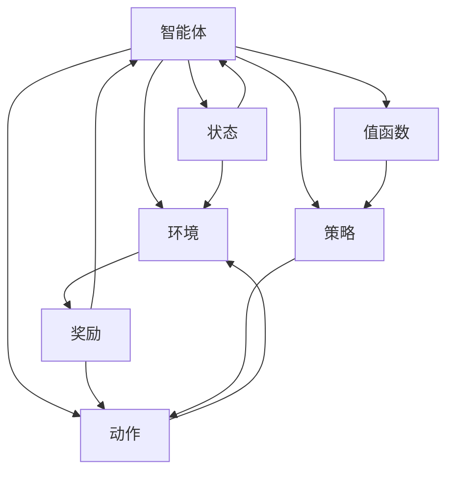

                 

# 强化学习基础：奖励和策略

> 关键词：强化学习,奖励(Reward),策略(Policy),策略梯度(SPG),值函数(Value Function),Q-learning,策略更新(Strategy Update),策略评估(Strategy Evaluation),深度强化学习(Deep RL)

## 1. 背景介绍

强化学习(Reinforcement Learning, RL)是一种机器学习方法，其目标是通过与环境的交互，使智能体(Agent)能够学习到最优策略，以最大化长期奖励。与传统的监督学习和无监督学习不同，强化学习不依赖于标注数据，也不需要显式的输入输出映射。它通过智能体在一个动态变化的环境中不断探索、试错，逐步优化决策策略，最终实现自动化的控制和学习。

强化学习的理论基础可以追溯到20世纪50年代，早期模型如马尔科夫决策过程(Markov Decision Process, MDP)为强化学习提供了基本的数学框架。近年来，随着计算资源和算法的不断进步，强化学习在智能游戏、机器人控制、自动驾驶、资源优化等领域取得了巨大的成功，成为人工智能的重要分支。

理解强化学习的基本概念和原理，对从事智能系统和机器人控制的研发人员来说至关重要。本文将从奖励和策略两个核心概念出发，系统讲解强化学习的核心思想和算法原理，并给出具体实践步骤和代码实现。

## 2. 核心概念与联系

### 2.1 核心概念概述

为了更清晰地理解强化学习，本节将详细介绍其中的核心概念：

- 强化学习(Reinforcement Learning)：通过智能体与环境的交互，使智能体学习最优策略的过程。智能体在每一步行动后，环境会给予一个奖励信号，用于评估当前策略的好坏。

- 奖励(Reward)：环境对智能体当前行为和状态给予的即时反馈，用于衡量当前策略的效果。奖励可以是正的、负的或零。

- 策略(Policy)：智能体在每个状态下采取行动的概率分布。策略是强化学习优化的核心对象，通常表示为概率模型或值函数。

- 状态(State)：描述环境当前状态的集合，通常包含位置、速度、时间等变量。

- 动作(Action)：智能体在每个状态下可采取的行动空间，可以是离散的也可以是连续的。

- 值函数(Value Function)：估计状态或策略的长期奖励，包括状态值函数(Q-Value)和策略值函数(V-Value)。值函数提供了评估当前策略优劣的指标。

- 策略梯度(SPG)：通过梯度上升的方法优化策略，使策略逐渐趋向最优。

- Q-learning：一种基于值函数的强化学习算法，通过近似Q值函数的更新来优化策略。

- 策略更新(Strategy Update)：基于当前状态和奖励，更新策略的概率分布。

- 策略评估(Strategy Evaluation)：通过值函数的近似估计，评估策略的性能。

这些核心概念之间紧密相连，共同构成了强化学习的数学框架。理解这些概念，有助于深入掌握强化学习的原理和算法。

### 2.2 核心概念原理和架构的 Mermaid 流程图



上述图表展示了智能体与环境交互的基本流程。智能体在每个状态下，根据当前策略选择一个动作，环境根据动作给予一个奖励，智能体更新状态，策略和值函数不断迭代优化。这种不断试错、逐步优化的过程，使得智能体能够学习到最优策略。

## 3. 核心算法原理 & 具体操作步骤

### 3.1 算法原理概述

强化学习的核心思想是使智能体通过与环境的交互，逐步优化策略，最大化长期奖励。这一过程可以用数学框架表示为：

$$
\max_{\pi} \sum_{t=0}^{\infty} \gamma^t R_t
$$

其中 $\pi$ 表示策略，$R_t$ 表示在第 $t$ 时刻的即时奖励，$\gamma$ 表示折扣因子，用于平衡长期奖励和即时奖励。智能体在每个状态下，根据策略 $\pi$ 选择一个动作 $a_t$，环境根据动作 $a_t$ 给予一个即时奖励 $R_t$，并从当前状态 $s_t$ 转移到下一个状态 $s_{t+1}$。折扣因子 $\gamma$ 用于衰减后续奖励的重要性，使得智能体更加注重长期收益。

强化学习的目标是通过优化策略 $\pi$，使得长期总奖励最大化。这一过程可以通过以下两种方式实现：

- 策略优化：直接优化策略 $\pi$，使其最大化期望总奖励。
- 值函数优化：先估计值函数，再通过值函数优化策略。

### 3.2 算法步骤详解

强化学习的主要算法步骤包括：

**Step 1: 环境初始化**

在算法开始前，首先需要将环境初始化为初始状态 $s_0$。环境可以是一个简单的虚拟环境，也可以是一个复杂的现实环境，如游戏、机器人控制等。

**Step 2: 状态感知**

智能体在每个状态下感知环境的状态 $s_t$，并将其输入到策略模型中，选择当前的动作 $a_t$。

**Step 3: 状态转移**

根据动作 $a_t$ 和当前状态 $s_t$，环境更新状态为 $s_{t+1}$。

**Step 4: 即时奖励**

环境根据动作 $a_t$ 和当前状态 $s_t$，给予一个即时奖励 $R_t$。

**Step 5: 策略更新**

根据即时奖励 $R_t$，智能体更新策略 $\pi$，使其更倾向于选择能够带来更大奖励的动作。

**Step 6: 值函数更新**

通过不断迭代，智能体逐步优化值函数，使得策略更加接近最优。

### 3.3 算法优缺点

强化学习具有以下优点：

- 适用于复杂环境：强化学习可以处理动态变化的环境，无需显式的输入输出映射。
- 自适应学习：强化学习能够自主学习最优策略，不需要大量标注数据。
- 可扩展性强：强化学习可以应用于各种领域，如图像处理、自然语言处理、机器人控制等。

同时，强化学习也存在一些缺点：

- 学习效率低：强化学习通常需要大量试错，训练时间较长。
- 奖励设计困难：设计合理的奖励函数是强化学习的关键，过于复杂的奖励设计会增加学习的难度。
- 样本效率低：强化学习需要大量样本数据，以避免局部最优和过拟合。

### 3.4 算法应用领域

强化学习的应用领域非常广泛，包括但不限于以下几类：

- 游戏AI：如AlphaGo、Dota2等游戏中的智能体，通过强化学习实现自我优化。
- 机器人控制：如机器人导航、操作等，通过强化学习实现自动化控制。
- 自然语言处理：如机器翻译、语音识别等，通过强化学习优化语言模型。
- 金融交易：如高频交易、投资组合优化等，通过强化学习实现智能交易策略。
- 推荐系统：如协同过滤、内容推荐等，通过强化学习优化推荐策略。

## 4. 数学模型和公式 & 详细讲解 & 举例说明

### 4.1 数学模型构建

强化学习的数学模型通常可以表示为马尔科夫决策过程(MDP)：

$$
\begin{aligned}
\max_{\pi} & \sum_{t=0}^{\infty} \gamma^t R_t \\
s_0 & \sim P_0 \\
s_{t+1} & \sim P(s_t,a_t) \\
R_t & \sim R(s_t,a_t)
\end{aligned}
$$

其中 $P_0$ 表示初始状态分布，$P(s_t,a_t)$ 表示状态转移概率，$R(s_t,a_t)$ 表示即时奖励分布。

### 4.2 公式推导过程

为了简化计算，我们可以使用值函数 $V(s_t)$ 来近似表示长期总奖励，其中 $V(s_t)$ 表示在状态 $s_t$ 下的值函数。值函数可以表示为：

$$
V(s_t) = \sum_{a} \pi(a|s_t) Q(s_t,a)
$$

其中 $Q(s_t,a)$ 表示在状态 $s_t$ 下，采取动作 $a$ 的即时奖励加长期奖励。Q值函数的更新公式为：

$$
Q(s_t,a) \leftarrow Q(s_t,a) + \alpha [R_t + \gamma \max_{a'} Q(s_{t+1},a') - Q(s_t,a)]
$$

其中 $\alpha$ 表示学习率，$\max_{a'} Q(s_{t+1},a')$ 表示在下一个状态 $s_{t+1}$ 下，采取最优动作的Q值。

### 4.3 案例分析与讲解

以简单的迷宫导航为例，解释强化学习的实现过程。迷宫环境的状态包括起点、终点和中间位置，动作包括左、右、上、下移动。智能体需要通过不断的试错，学习到最优的移动策略。

首先，我们将环境初始化为起点，智能体随机选择一个动作，环境根据动作更新状态并给予奖励。假设智能体从起点移动到终点，则获得正奖励，否则获得负奖励。通过不断迭代，智能体逐步优化策略，使得移动策略能够最大化长期总奖励。

## 5. 项目实践：代码实例和详细解释说明

### 5.1 开发环境搭建

在进行强化学习实践前，我们需要准备好开发环境。以下是使用Python进行PyTorch开发的环境配置流程：

1. 安装Anaconda：从官网下载并安装Anaconda，用于创建独立的Python环境。

2. 创建并激活虚拟环境：
```bash
conda create -n pytorch-env python=3.8 
conda activate pytorch-env
```

3. 安装PyTorch：根据CUDA版本，从官网获取对应的安装命令。例如：
```bash
conda install pytorch torchvision torchaudio cudatoolkit=11.1 -c pytorch -c conda-forge
```

4. 安装PyTorch-RL库：
```bash
pip install torch-rl
```

5. 安装各类工具包：
```bash
pip install numpy pandas scikit-learn matplotlib tqdm jupyter notebook ipython
```

完成上述步骤后，即可在`pytorch-env`环境中开始强化学习实践。

### 5.2 源代码详细实现

下面我们以Q-learning算法为例，给出使用PyTorch进行强化学习的PyTorch代码实现。

首先，定义Q值函数：

```python
import torch.nn as nn
import torch.optim as optim

class QNetwork(nn.Module):
    def __init__(self, input_size, output_size):
        super(QNetwork, self).__init__()
        self.fc1 = nn.Linear(input_size, 128)
        self.fc2 = nn.Linear(128, output_size)
    
    def forward(self, x):
        x = self.fc1(x)
        x = torch.relu(x)
        x = self.fc2(x)
        return x
```

然后，定义Q值函数优化器：

```python
class QLearning:
    def __init__(self, env, input_size, output_size, discount_factor=0.99, learning_rate=0.001):
        self.env = env
        self.input_size = input_size
        self.output_size = output_size
        self.discount_factor = discount_factor
        self.learning_rate = learning_rate
        
        self.q = QNetwork(input_size, output_size)
        self.optimizer = optim.Adam(self.q.parameters(), lr=learning_rate)
        self.loss_fn = nn.MSELoss()
    
    def select_action(self, state):
        state = torch.tensor(state, dtype=torch.float).unsqueeze(0)
        with torch.no_grad():
            q_values = self.q(state)
        action = torch.argmax(q_values, dim=1).item()
        return action
    
    def train(self, num_episodes=500):
        for episode in range(num_episodes):
            state = self.env.reset()
            done = False
            total_reward = 0
            
            while not done:
                action = self.select_action(state)
                next_state, reward, done, _ = self.env.step(action)
                total_reward += reward
                
                if done:
                    next_q_values = torch.zeros_like(self.q(state))
                    self.q_value = reward
                else:
                    next_q_values = self.q(next_state).detach()
                
                target_q_values = next_q_values * self.discount_factor + reward
                loss = self.loss_fn(target_q_values, self.q_value)
                self.optimizer.zero_grad()
                loss.backward()
                self.optimizer.step()
                
                state = next_state
```

最后，启动训练流程：

```python
import gym

env = gym.make('CartPole-v1')
input_size = env.observation_space.shape[0]
output_size = env.action_space.n

agent = QLearning(env, input_size, output_size)
agent.train()

env.close()
```

以上就是使用PyTorch进行Q-learning算法的完整代码实现。可以看到，PyTorch-RL库提供了强大的强化学习工具，能够轻松实现Q-learning等常见算法。

### 5.3 代码解读与分析

让我们再详细解读一下关键代码的实现细节：

**QNetwork类**：
- `__init__`方法：初始化网络结构，包括两个全连接层。
- `forward`方法：定义前向传播计算Q值。

**QLearning类**：
- `__init__`方法：初始化环境、网络参数等。
- `select_action`方法：根据当前状态，选择最优动作。
- `train`方法：进行Q-learning训练，更新Q值函数。

**Q-learning训练流程**：
- 循环遍历num_episodes轮训练，每轮训练中：
- 从环境获取初始状态，进入while循环。
- 根据当前状态，选择动作并执行，获取下一个状态和即时奖励。
- 更新Q值函数和策略，计算损失，更新参数。
- 将状态更新为下一个状态，继续迭代。

通过Q-learning算法的实现，我们可以直观地看到强化学习的具体过程，以及如何通过不断试错和优化，逐步学习到最优策略。

## 6. 实际应用场景

### 6.1 机器人控制

强化学习在机器人控制领域具有广阔的应用前景。传统的机器人控制通常依赖于专家设计和经验调整，难以应对复杂多变的环境。通过强化学习，机器人可以在实际环境中自主学习，逐步优化控制策略，实现更灵活、高效、稳定的运行。

在具体实现中，可以构建一个虚拟环境或现实环境，机器人根据传感器输入的状态，选择一个动作。环境根据动作更新状态并给予奖励，如机器人到达目标位置后获得正奖励，否则获得负奖励。通过不断试错和优化，机器人能够学习到最优的移动策略，避免碰撞和浪费资源。

### 6.2 自动驾驶

自动驾驶是强化学习的另一个重要应用领域。车辆需要在动态变化的道路环境中，自主学习最优的行驶策略，以确保安全、高效和舒适。

在自动驾驶中，车辆可以通过传感器获取当前状态，如车速、位置、车辆间距等。车辆根据当前状态选择一个驾驶动作，如加速、减速、变道等。环境根据动作更新状态并给予奖励，如成功避开障碍后获得正奖励，否则获得负奖励。通过不断学习，车辆能够逐步优化行驶策略，确保在复杂道路环境中的安全稳定。

### 6.3 游戏AI

游戏AI是强化学习的重要应用场景之一。传统的游戏AI依赖于规则和启发式方法，难以应对复杂和多变的游戏环境。通过强化学习，游戏AI能够在实际游戏中自主学习，逐步优化决策策略，实现高水平的游戏能力。

在具体实现中，游戏AI通过传感器获取当前游戏状态，如玩家位置、角色状态等。游戏AI根据当前状态选择一个游戏动作，如攻击、防御、移动等。游戏环境根据动作更新状态并给予奖励，如击败对手后获得正奖励，否则获得负奖励。通过不断学习，游戏AI能够逐步优化游戏策略，提升游戏性能。

### 6.4 未来应用展望

随着强化学习技术的发展，其应用领域将不断拓展，为更多行业带来变革性影响：

- 智慧医疗：通过强化学习，医疗机器人能够自主进行手术操作，提高手术精度和安全性。
- 金融交易：通过强化学习，智能交易系统能够自主进行高频交易，优化投资组合，提升收益。
- 智能制造：通过强化学习，工业机器人能够自主进行生产操作，优化生产流程，提高生产效率。
- 环境监测：通过强化学习，智能无人机能够自主进行环境监测，提高监测精度和时效性。
- 智慧农业：通过强化学习，智能农机能够自主进行耕作和施肥，优化农业生产。

## 7. 工具和资源推荐

### 7.1 学习资源推荐

为了帮助开发者系统掌握强化学习的理论基础和实践技巧，这里推荐一些优质的学习资源：

1. 《强化学习入门》系列博文：由大模型技术专家撰写，深入浅出地介绍了强化学习的基本概念和常见算法。

2. 斯坦福大学《强化学习》课程：斯坦福大学开设的强化学习课程，有Lecture视频和配套作业，带你入门强化学习的基本概念和经典模型。

3. 《Reinforcement Learning: An Introduction》书籍：Sutton和Barto的权威教材，全面介绍了强化学习的理论基础和经典算法。

4. 《Deep Reinforcement Learning》课程：Udacity的深度强化学习课程，涵盖了强化学习的最新进展和前沿技术。

5. PyTorch-RL官方文档：PyTorch-RL库的官方文档，提供了丰富的算法实现和代码样例，是学习强化学习的必备资料。

通过对这些资源的学习实践，相信你一定能够快速掌握强化学习的精髓，并用于解决实际的NLP问题。

### 7.2 开发工具推荐

高效的开发离不开优秀的工具支持。以下是几款用于强化学习开发的常用工具：

1. PyTorch：基于Python的开源深度学习框架，灵活动态的计算图，适合快速迭代研究。大部分强化学习算法都有PyTorch版本的实现。

2. TensorFlow：由Google主导开发的开源深度学习框架，生产部署方便，适合大规模工程应用。同样有丰富的强化学习算法资源。

3. OpenAI Gym：用于测试和比较强化学习算法的工具，包含大量经典的强化学习环境和算法实现。

4. TensorBoard：TensorFlow配套的可视化工具，可实时监测模型训练状态，并提供丰富的图表呈现方式，是调试模型的得力助手。

5. Weights & Biases：模型训练的实验跟踪工具，可以记录和可视化模型训练过程中的各项指标，方便对比和调优。

6. PyTorch-RL库：HuggingFace开发的强化学习工具库，集成了多种SOTA强化学习算法，方便进行算法实现和调试。

合理利用这些工具，可以显著提升强化学习的开发效率，加快创新迭代的步伐。

### 7.3 相关论文推荐

强化学习的研究历史悠久，但也始终处于动态发展之中。以下是几篇奠基性的相关论文，推荐阅读：

1. Q-learning：Watkins在1989年提出的基于值函数的强化学习算法，奠定了强化学习的基本范式。

2. SARSA：Sutton在1988年提出的状态-动作-奖励-状态-动作算法，扩展了Q-learning算法。

3. Policy Gradient：Sutton和Barto在1998年提出的基于策略梯度的强化学习算法，简化了Q-learning的实现。

4. Deep Q-Networks：Mnih在2015年提出的基于深度神经网络的Q-learning算法，取得了SOTA的强化学习效果。

5. Proximal Policy Optimization (PPO)：Schmidhuber在2017年提出的基于策略优化的强化学习算法，在实际应用中表现优异。

6. Actor-Critic：Sutton和Barto在1998年提出的基于策略和值函数的强化学习算法，广泛用于解决复杂的强化学习问题。

这些论文代表了大强化学习的发展脉络，通过学习这些前沿成果，可以帮助研究者把握学科前进方向，激发更多的创新灵感。

## 8. 总结：未来发展趋势与挑战

### 8.1 研究成果总结

强化学习作为人工智能的重要分支，经过多年的发展，已经成为一种广泛应用于各种领域的技术。它通过智能体与环境的交互，学习最优策略，最大化长期奖励，极大地拓展了机器学习的应用边界。

### 8.2 未来发展趋势

展望未来，强化学习将呈现以下几个发展趋势：

1. 深度强化学习：深度神经网络与强化学习相结合，提高了算法的泛化能力和复杂度。

2. 多智能体协同：多智能体协同强化学习，实现了智能体之间的合作与竞争，提升了系统复杂度。

3. 模型压缩与加速：通过模型压缩与优化，提高了强化学习模型的计算效率与实时性。

4. 强化学习与自然语言处理、计算机视觉等领域的融合：强化学习与其他AI技术的结合，提升了系统的综合能力。

5. 持续学习与迁移学习：强化学习模型能够持续学习新知识，提升系统的适应性和泛化能力。

6. 强化学习在伦理学与安全性的研究：强化学习在决策、公平、安全等方面的研究，提升了系统的可靠性和可解释性。

这些趋势凸显了强化学习技术的广阔前景，以及其在人工智能领域的深远影响。

### 8.3 面临的挑战

尽管强化学习技术已经取得了瞩目成就，但在迈向更加智能化、普适化应用的过程中，它仍面临诸多挑战：

1. 样本效率低：强化学习需要大量样本数据，以避免局部最优和过拟合。

2. 奖励设计困难：设计合理的奖励函数是强化学习的关键，过于复杂的奖励设计会增加学习的难度。

3. 模型复杂度高：深度强化学习模型通常非常复杂，难以理解和调试。

4. 计算资源需求高：深度强化学习模型对计算资源的需求较高，难以在大规模环境中应用。

5. 可解释性不足：强化学习模型通常缺乏可解释性，难以理解其决策过程。

6. 鲁棒性差：强化学习模型在面对复杂环境和突发情况时，容易产生不稳定行为。

这些挑战需要通过不断优化算法和改进模型来解决，以推动强化学习技术的进一步发展。

### 8.4 研究展望

为了解决这些挑战，未来的研究需要在以下几个方面寻求新的突破：

1. 强化学习在多模态数据上的应用：强化学习与视觉、语音、文本等不同模态数据的结合，提升了系统的复杂度和能力。

2. 强化学习在联邦学习中的应用：强化学习在分布式环境中的应用，提升了系统的鲁棒性和可扩展性。

3. 强化学习在跨领域应用中的应用：强化学习在跨领域任务上的应用，提升了系统的通用性和泛化能力。

4. 强化学习在持续学习中的应用：强化学习模型能够持续学习新知识，提升系统的适应性和泛化能力。

5. 强化学习在伦理与安全性的应用：强化学习在决策、公平、安全等方面的研究，提升了系统的可靠性和可解释性。

6. 强化学习在自动化机器学习中的应用：强化学习与自动化机器学习的结合，提升了系统的自动化水平。

这些研究方向的探索，必将引领强化学习技术迈向更高的台阶，为构建智能系统提供更强大的技术支持。面向未来，强化学习还需要与其他AI技术进行更深入的融合，共同推动人工智能技术的发展。

## 9. 附录：常见问题与解答

**Q1: 强化学习与监督学习和无监督学习的区别是什么？**

A: 强化学习与监督学习和无监督学习的主要区别在于目标函数不同。强化学习的目标函数是最大化长期总奖励，而监督学习和无监督学习的目标函数分别是最小化预测误差和最大化数据的相似性。

**Q2: 如何设计合理的奖励函数？**

A: 设计合理的奖励函数是强化学习成功的关键。奖励函数需要满足以下几个要求：
- 奖励信号要有明确的含义，易于理解。
- 奖励函数应避免奖励信号噪声，确保学习的稳定性。
- 奖励函数应考虑长期奖励，避免短视行为。
- 奖励函数应具有可解释性，便于理解和调试。

**Q3: 强化学习中策略更新和值函数更新有什么区别？**

A: 策略更新和值函数更新是强化学习的两种主要优化方法。策略更新通过优化策略参数，使得智能体在每个状态下更倾向于选择最优动作。值函数更新通过优化值函数，使得智能体能够更准确地估计长期总奖励。

**Q4: 如何提高强化学习的样本效率？**

A: 提高强化学习的样本效率可以通过以下几个方法：
- 使用基于模型的方法，如值函数近似和策略优化，减少样本需求。
- 使用多智能体协同学习，共享样本信息，提高学习效率。
- 使用模型压缩和优化，减小模型复杂度，提高样本利用率。

**Q5: 强化学习如何应用于机器人控制？**

A: 强化学习在机器人控制中的应用，主要通过构建虚拟或现实环境，机器人根据传感器输入的状态，选择一个动作。环境根据动作更新状态并给予奖励，如机器人到达目标位置后获得正奖励，否则获得负奖励。通过不断试错和优化，机器人能够学习到最优的移动策略，避免碰撞和浪费资源。

通过本文的系统梳理，可以看到，强化学习是一种通过智能体与环境的交互，逐步优化策略，最大化长期奖励的技术。它不仅适用于复杂多变的环境，还能自主学习最优策略，具有广阔的应用前景。未来，随着技术的不断进步和算力的不断提升，强化学习必将在更多领域大放异彩，推动人工智能技术的进一步发展。

---

作者：禅与计算机程序设计艺术 / Zen and the Art of Computer Programming

