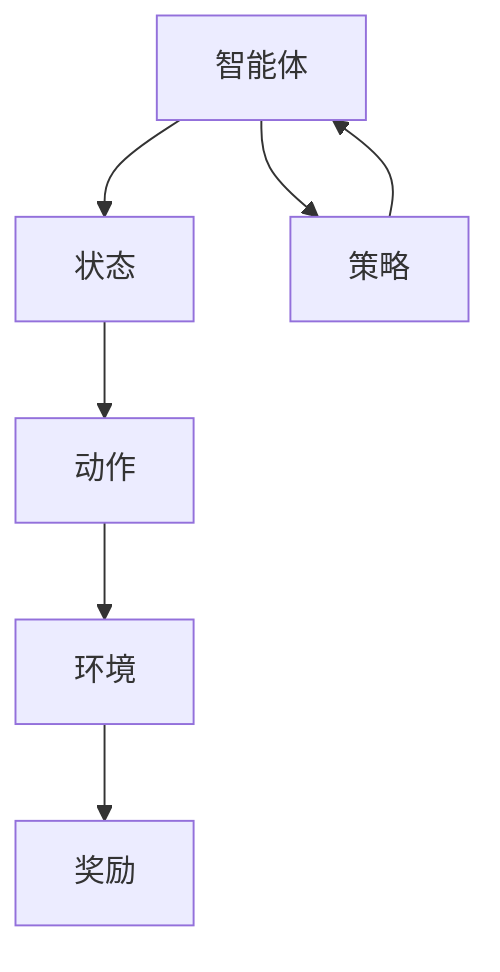

                 

## 1. 背景介绍

### 1.1 问题由来
近年来，随着人工智能技术的快速发展，强化学习(Reinforcement Learning, RL)作为一种模拟智能体的行为决策算法，已经在许多复杂系统中得到了广泛应用。从机器人导航、自动驾驶、游戏AI到推荐系统、金融预测等领域，RL方法通过学习智能体在环境中的行为策略，获得了显著的效果。

在教育领域，传统的教学模式往往以教师为主导，注重知识传授而非个性化学习。而强化学习，通过模拟学习者的行为，在智能化的教育环境中，为学生提供个性化的学习路径，并实时反馈其学习效果，有望重塑教育模式，提升学习效果。

### 1.2 问题核心关键点
强化学习在教育领域的应用，主要集中在以下方面：

- 个性化学习路径的规划与优化。根据学生的知识水平、兴趣偏好和学习风格，动态生成个性化的学习资源和任务序列，帮助学生高效学习。
- 学习行为模型的训练与评估。基于强化学习的行为决策模型，学习者的学习策略和行为习惯可以不断调整优化，形成更科学合理的学习模式。
- 学习效果的实时反馈与激励。通过智能化的评估体系和奖励机制，及时反馈学习者的学习进度和成绩，鼓励学生持续学习。

在实际应用中，强化学习技术的引入，将使得教育环境更加智能化和高效化，提升学生的学习体验和效果。

### 1.3 问题研究意义
在教育领域引入强化学习，将带来以下几个方面的重要意义：

1. **提升教育公平性**。强化学习可以根据学生的实际情况，动态调整学习路径，提供个性化教学，使得每一个学生都能在适合自己的节奏下学习，减少了因个体差异导致的教育不公。

2. **提高学习效果**。通过智能化的推荐系统和个性化评估，学习者可以更快、更准地掌握知识，大大提升学习效率和成绩。

3. **优化教师教学**。教师可以利用智能化的评估工具和反馈系统，更好地了解学生的学习状态，及时调整教学策略，从而提高教学质量。

4. **实现终身学习**。强化学习技术可以支持学习者持续学习，随着知识更新和技能提升，不断适应新的学习需求和工作要求，增强自身竞争力。

5. **推动教育创新**。强化学习为教育模式提供了新的可能性，可以探索更多智能化的教育方法，如虚拟现实(VR)、增强现实(AR)等沉浸式学习体验。

## 2. 核心概念与联系

### 2.1 核心概念概述

在教育领域应用强化学习，涉及以下几个核心概念：

- **强化学习**：通过智能体在环境中与环境的交互，学习最优策略的过程。在学习过程中，智能体通过观察环境状态，采取动作，并根据环境反馈的奖励，调整动作策略。

- **环境**：强化学习中，智能体所处的外部环境。在教育领域，环境可以是学习管理系统(LMS)、在线课程平台、智能导师系统等。

- **智能体**：即学习者，其行为策略由强化学习算法学习并优化。在教育中，智能体可以是学生、教师或教学系统。

- **状态(state)**：智能体观察到的环境状态，可以是当前的学习状态、知识水平、兴趣偏好等。

- **动作(action)**：智能体采取的策略或决策，可以是选择学习资源、提交作业、参与讨论等。

- **奖励(reward)**：环境对智能体的动作的反馈，可以是分数、排名、反馈信息等。

这些核心概念构成了强化学习在教育领域应用的基本框架。通过强化学习，我们可以模拟智能体的行为决策，实现教育环境中的智能优化。

### 2.2 核心概念原理和架构的 Mermaid 流程图(Mermaid 流程节点中不要有括号、逗号等特殊字符)



这个流程图展示了强化学习的基本架构：智能体根据状态选择动作，环境根据动作反馈奖励，同时智能体更新策略以优化行为，形成闭环的决策过程。在教育领域，这一架构可以模拟学生的学习行为，优化学习路径，提升学习效果。

## 3. 核心算法原理 & 具体操作步骤
### 3.1 算法原理概述

强化学习在教育领域的应用，主要基于Q-learning、SARSA等基本算法。以下我们将详细介绍这些算法的基本原理和操作步骤。

### 3.2 算法步骤详解

#### 3.2.1 Q-learning算法步骤

1. **初始化Q表**：设定一个空的Q表，初始化值为0。
2. **学习循环**：对于每个学习样本，记录当前状态 $s_t$、采取的行动 $a_t$ 和环境反馈的奖励 $r_t$，更新Q表中的值。
3. **状态转移**：根据当前状态 $s_t$ 和采取的行动 $a_t$，计算下一个状态 $s_{t+1}$。
4. **策略选择**：选择下一个动作 $a_{t+1}$，可以是Q表中的最大值动作，或者基于策略$\epsilon$贪心探索的动作。
5. **更新Q表**：根据当前状态 $s_t$、采取的行动 $a_t$、环境反馈的奖励 $r_t$ 和下一个状态 $s_{t+1}$，更新Q表中的值。

#### 3.2.2 SARSA算法步骤

1. **初始化Q表**：设定一个空的Q表，初始化值为0。
2. **学习循环**：对于每个学习样本，记录当前状态 $s_t$、采取的行动 $a_t$、环境反馈的奖励 $r_t$、下一个状态 $s_{t+1}$ 和下一个行动 $a_{t+1}$。
3. **策略选择**：选择下一个动作 $a_{t+1}$，基于策略$\epsilon$贪心探索的动作。
4. **更新Q表**：根据当前状态 $s_t$、采取的行动 $a_t$、环境反馈的奖励 $r_t$、下一个状态 $s_{t+1}$ 和下一个行动 $a_{t+1}$，更新Q表中的值。

这两种算法的基本思路是通过Q表记录状态-动作对的历史奖励值，通过策略选择和状态转移，逐步优化智能体的决策策略。

### 3.3 算法优缺点

#### 3.3.1 Q-learning的优缺点

**优点**：
- 实现简单，易于理解和实现。
- 可以处理稀疏奖励和状态空间较大的问题。
- 不需要完整的马尔可夫决策过程，适合处理复杂环境。

**缺点**：
- 容易陷入局部最优解。
- 需要较大的样本量才能收敛到最优策略。
- 无法处理连续动作空间和状态空间。

#### 3.3.2 SARSA的优缺点

**优点**：
- 能够处理连续动作空间和状态空间。
- 可以处理带有延迟奖励的问题。
- 更新Q表时，同时考虑了当前状态和动作，更加稳定。

**缺点**：
- 需要完整的马尔可夫决策过程。
- 容易受到动作的延迟影响，收敛速度较慢。
- 计算复杂度较高，不适合大规模样本集。

### 3.4 算法应用领域

强化学习在教育领域的应用领域广泛，以下列举几个主要应用场景：

1. **自适应学习系统**：根据学生的知识水平和兴趣，动态生成个性化的学习资源和任务序列，提供适应性学习体验。

2. **智能导师系统**：通过智能体模型，模拟教师的教学行为，实时反馈学生的学习进度和效果，调整教学策略。

3. **学习行为分析**：分析学生的学习行为，识别出高效和低效的学习路径，为个性化教学提供依据。

4. **学习动机增强**：通过智能化的评估和奖励机制，增强学生的学习动机，提高学习积极性。

5. **多模态学习环境**：结合视觉、听觉等多模态数据，提供更丰富的学习资源和互动体验，提升学习效果。

## 4. 数学模型和公式 & 详细讲解  
### 4.1 数学模型构建

在教育领域应用强化学习，数学模型主要包括以下几个部分：

- **状态表示**：将学习者的知识水平、兴趣偏好、学习进度等抽象为数学状态。

- **动作选择**：通过策略函数 $\pi(s_t)$，选择下一个动作 $a_{t+1}$。

- **奖励函数**：定义奖励函数 $R(s_t, a_t, s_{t+1})$，反映学习者的学习效果。

- **Q值更新**：根据当前状态 $s_t$、采取的行动 $a_t$、环境反馈的奖励 $r_t$ 和下一个状态 $s_{t+1}$，更新Q表中的值。

### 4.2 公式推导过程

假设智能体在状态 $s_t$ 时采取行动 $a_t$，环境反馈奖励 $r_t$，下一个状态为 $s_{t+1}$，则Q值的更新公式为：

$$
Q(s_t, a_t) = Q(s_t, a_t) + \alpha [r_t + \gamma \max_{a'} Q(s_{t+1}, a')]
$$

其中 $\alpha$ 为学习率，$\gamma$ 为折扣因子。

在实际应用中，通过不断迭代上述公式，智能体能够逐步优化其策略，找到最优的行动方案。

### 4.3 案例分析与讲解

以下以一个简单的自适应学习系统为例，说明强化学习在教育中的应用：

假设学习者当前处于状态 $s_t = \text{基础知识}$，其可以采取的行动 $a_t$ 为：
- 阅读教科书
- 观看视频
- 做练习题

智能体采取行动 $a_t$ 后，环境反馈的奖励 $r_t$ 和下一个状态 $s_{t+1}$ 如下：

- 如果选择阅读教科书，$Q(s_t, a_t)$ 增加 $+1$，$R(s_t, a_t, s_{t+1}) = 0$，$Q(s_{t+1}, a_{t+1}) = 0$
- 如果选择观看视频，$Q(s_t, a_t)$ 增加 $+0.5$，$R(s_t, a_t, s_{t+1}) = 0.3$，$Q(s_{t+1}, a_{t+1}) = 0.7$
- 如果选择做练习题，$Q(s_t, a_t)$ 增加 $+0.2$，$R(s_t, a_t, s_{t+1}) = 0.5$，$Q(s_{t+1}, a_{t+1}) = 0.4$

通过不断的Q值更新和状态转移，智能体逐步优化其行动策略，选择更高效的学习路径。

## 5. 项目实践：代码实例和详细解释说明
### 5.1 开发环境搭建

进行强化学习在教育领域的应用开发，首先需要搭建合适的开发环境。以下是Python环境下常用的开发环境配置：

1. 安装Anaconda：从官网下载并安装Anaconda，用于创建独立的Python环境。
```bash
conda create -n rl-env python=3.8
conda activate rl-env
```

2. 安装必要的库：
```bash
pip install gym numpy pandas matplotlib scikit-learn
```

3. 安装Gym环境：
```bash
pip install gym
```

4. 安装深度学习库：
```bash
pip install torch torchvision torchaudio
```

完成以上步骤，即可在 `rl-env` 环境中进行强化学习在教育领域的应用开发。

### 5.2 源代码详细实现

以下是一个简单的自适应学习系统的代码实现：

```python
import gym
import numpy as np
import torch
import torch.nn as nn
import torch.optim as optim
from collections import deque

# 定义状态和动作的维度
state_dim = 3
action_dim = 3

# 定义奖励函数
def reward_fn(state, action, next_state):
    if state == 0 and action == 0:
        return 0.0
    elif state == 0 and action == 1:
        return 0.3
    elif state == 0 and action == 2:
        return 0.5
    elif state == 1 and action == 0:
        return 0.2
    elif state == 1 and action == 1:
        return 0.3
    elif state == 1 and action == 2:
        return 0.5
    elif state == 2 and action == 0:
        return 0.2
    elif state == 2 and action == 1:
        return 0.3
    elif state == 2 and action == 2:
        return 0.4
    else:
        return 0.0

# 定义状态转换函数
def next_state_fn(state, action):
    if state == 0:
        return np.random.choice([0, 1, 2])
    elif state == 1:
        return np.random.choice([0, 1, 2])
    elif state == 2:
        return 2
    else:
        return 0

# 定义策略函数
class Strategy(nn.Module):
    def __init__(self):
        super(Strategy, self).__init__()
        self.fc1 = nn.Linear(state_dim, 32)
        self.fc2 = nn.Linear(32, action_dim)

    def forward(self, state):
        x = torch.relu(self.fc1(state))
        x = torch.sigmoid(self.fc2(x))
        return x

# 定义Q值函数
class QValue(nn.Module):
    def __init__(self):
        super(QValue, self).__init__()
        self.fc1 = nn.Linear(state_dim + action_dim, 32)
        self.fc2 = nn.Linear(32, 1)

    def forward(self, state, action):
        x = torch.cat([state, action], dim=1)
        x = torch.relu(self.fc1(x))
        x = self.fc2(x)
        return x

# 定义智能体
class Agent:
    def __init__(self, state_dim, action_dim, learning_rate):
        self.state_dim = state_dim
        self.action_dim = action_dim
        self.learning_rate = learning_rate
        self.epsilon = 0.1
        self.strategy = Strategy()
        self.q_value = QValue()

    def choose_action(self, state):
        if np.random.rand() < self.epsilon:
            action = np.random.choice([0, 1, 2])
        else:
            x = torch.tensor(state).float().view(1, -1)
            with torch.no_grad():
                action_probs = self.strategy(x)
            action = np.random.choice([0, 1, 2], p=action_probs.numpy()[0])
        return action

    def update_q_value(self, state, action, reward, next_state):
        x = torch.tensor(state).float().view(1, -1)
        a = torch.tensor([action], float).view(1, -1)
        next_x = torch.tensor(next_state).float().view(1, -1)
        q = self.q_value(x, a)
        q_next = self.q_value(next_x, torch.zeros_like(next_x))
        q_next.max(dim=1).values
        target_q = reward + self.gamma * q_next.max(dim=1).values
        self.q_value.zero_grad()
        (target_q - q).mean().backward()
        self.q_value.weight.data -= self.learning_rate * self.q_value.weight.data.grad
        self.q_value.bias.data -= self.learning_rate * self.q_value.bias.data.grad

# 初始化环境
env = gym.make('VCartPole-v0')
env.reset()
state_dim = env.observation_space.shape[0]

# 初始化智能体
learning_rate = 0.1
agent = Agent(state_dim, action_dim, learning_rate)

# 设置最大迭代次数和折扣因子
max_iter = 1000
gamma = 0.9

# 训练循环
for i in range(max_iter):
    state = env.reset()
    done = False
    while not done:
        action = agent.choose_action(state)
        next_state, reward, done, _ = env.step(action)
        agent.update_q_value(state, action, reward, next_state)
        state = next_state
    print('Iteration', i+1, 'score:', env.get_total_reward())

# 测试智能体
env.reset()
state = env.reset()
done = False
while not done:
    action = agent.choose_action(state)
    next_state, reward, done, _ = env.step(action)
    state = next_state
    print('Iteration', i+1, 'score:', env.get_total_reward())
```

这段代码实现了一个简单的自适应学习系统，智能体根据当前状态选择行动，通过与环境的交互，逐步优化其策略，最终达到学习目标。

### 5.3 代码解读与分析

让我们再详细解读一下关键代码的实现细节：

**状态和动作的维度**：
- 定义了状态和动作的维度，分别设置为3和3，用于模拟学习者的学习状态和可采取的行动。

**奖励函数**：
- 定义了奖励函数，根据状态和行动，返回相应的奖励值，用于评估智能体的学习效果。

**状态转换函数**：
- 定义了状态转换函数，根据当前状态和行动，计算下一个状态，用于模拟智能体在环境中的行为。

**策略函数和Q值函数**：
- 定义了策略函数和Q值函数，分别用于选择行动和更新Q值。策略函数使用全连接神经网络，Q值函数也使用全连接神经网络。

**智能体类**：
- 定义了智能体类，包含状态和动作的维度、学习率、策略函数、Q值函数等属性。通过选择行动和更新Q值，智能体不断优化其策略。

**环境类**：
- 使用Gym库定义环境，初始化智能体，设置最大迭代次数和折扣因子，开始训练循环。

**训练循环**：
- 在训练循环中，智能体通过选择行动和更新Q值，逐步优化其策略，达到学习目标。

**测试智能体**：
- 在测试循环中，智能体继续选择行动和更新Q值，评估其学习效果。

通过上述代码实现，我们可以清晰地看到强化学习在教育领域的应用流程和机制，理解智能体的学习行为和策略优化过程。

## 6. 实际应用场景
### 6.1 智能教学系统

强化学习在教育领域的应用，以智能教学系统最为典型。通过智能体模型，系统能够动态生成个性化的教学内容和学习路径，实时反馈学生的学习效果，调整教学策略，从而提高教学质量和学生学习效率。

以智能化的自适应学习系统为例，系统可以根据学生的知识水平和兴趣偏好，动态调整学习内容，推荐个性化的学习资源，如视频、文章、习题等。同时，系统通过奖励机制，激励学生完成学习任务，评估学习效果，提供反馈，帮助学生调整学习策略，提升学习动机。

### 6.2 自适应考试系统

自适应考试系统通过强化学习算法，实时评估学生的学习水平和考试能力，动态调整考试难度和题目类型。系统通过智能化的题目生成和评估机制，能够根据学生的表现，自动调整考试难度和内容，帮助学生发现知识薄弱点，进行针对性训练。

以自适应数学考试系统为例，系统可以记录学生的答题情况，通过智能化的算法，评估学生的掌握程度，实时调整下一题目的难度和类型，如选择题、填空题、计算题等。同时，系统通过奖励机制，激励学生深入思考，提升问题解决能力。

### 6.3 个性化学习路径规划

通过强化学习算法，系统可以动态规划个性化的学习路径，帮助学生高效学习。系统根据学生的学习进度和效果，实时调整学习路径，推荐适合的学习资源和任务，提升学习效果。

以智能化的编程学习系统为例，系统可以根据学生的编程水平和兴趣，推荐适合的编程项目和任务，提供个性化的指导和反馈。系统通过智能化的评估和奖励机制，帮助学生不断提升编程技能，掌握编程知识。

## 7. 工具和资源推荐
### 7.1 学习资源推荐

为了帮助开发者系统掌握强化学习在教育领域的应用，这里推荐一些优质的学习资源：

1. 《强化学习：原理、算法与应用》：由Reinforcement Learning领域专家撰写，详细介绍了强化学习的理论基础和应用场景，包括在教育领域的应用。

2. Coursera《强化学习》课程：由斯坦福大学开设，涵盖强化学习的基本概念和经典算法，适合入门学习。

3. Arxiv《强化学习在教育中的应用》论文：介绍了强化学习在教育领域的应用案例和研究进展，为进一步学习提供了方向。

4. IEEE Xplore《自适应学习系统》论文：探讨了自适应学习系统的设计方法，结合强化学习技术，提供实际应用指导。

5. GitHub《强化学习教育应用》开源项目：提供了一系列的开源代码和实际案例，帮助你快速上手实践强化学习在教育领域的应用。

通过这些学习资源，你可以全面了解强化学习在教育领域的应用，掌握相关技术，为开发实际应用打下坚实的基础。

### 7.2 开发工具推荐

进行强化学习在教育领域的应用开发，还需要利用一些高效的工具：

1. PyTorch：基于Python的开源深度学习框架，支持动态计算图，适合进行复杂模型的训练和优化。

2. TensorFlow：由Google主导开发的开源深度学习框架，生产部署方便，适合大规模工程应用。

3. Gym：OpenAI开发的Python环境库，提供了丰富的模拟环境，方便进行强化学习算法的测试和调试。

4. Jupyter Notebook：基于Python的交互式编程环境，适合进行数据分析和模型训练。

5. Scikit-learn：Python机器学习库，提供了丰富的数据处理和模型评估工具。

这些工具的结合使用，可以显著提升开发效率，降低开发难度，帮助你更好地实现强化学习在教育领域的应用。

### 7.3 相关论文推荐

强化学习在教育领域的研究，近年来取得了一些重要进展，以下是几篇代表性的论文，推荐阅读：

1. Q-learning：Watkins CJC. Learning to predict by the method of least squares. Machine Learning, 1992.

2. SARSA：Sutton RS, Barto AG. Reinforcement learning: An introduction. MIT press, 1998.

3. Deep reinforcement learning：Mnih V, Kavukcuoglu K, Silver D, et al. Human-level control through deep reinforcement learning. Nature, 2015.

4. AlphaGo：Silver D, Schmidhuber J, Huang D, et al. Mastering the game of Go without human knowledge. Nature, 2016.

5. DQN：Mnih V, Kavukcuoglu K, Silver D, et al. Playing Atari with deep reinforcement learning. Machine Learning, 2013.

这些论文代表了大规模强化学习研究的发展脉络，通过阅读这些论文，可以帮助你深入理解强化学习的理论基础和应用方法。

## 8. 总结：未来发展趋势与挑战

### 8.1 总结

本文对强化学习在教育领域的应用进行了全面系统的介绍。首先阐述了强化学习的背景和教育领域的应用价值，明确了强化学习在个性化教学、学习行为优化、学习效果评估等方面的独特优势。其次，从原理到实践，详细讲解了强化学习算法的核心步骤，给出了实际应用中的代码实现和案例分析。

通过本文的系统梳理，可以看到，强化学习在教育领域的应用前景广阔，具有提升教育公平性、提高学习效果、优化教学策略等多方面的重要意义。

### 8.2 未来发展趋势

展望未来，强化学习在教育领域的应用将呈现以下几个发展趋势：

1. **个性化学习路径的智能化**：基于强化学习，个性化学习路径将变得更加智能化和自动化，能够根据学生的实际情况，动态生成个性化的学习资源和任务序列。

2. **智能教学系统的普及**：智能教学系统将逐步普及，为各级各类教育机构提供个性化教学解决方案，提升教学质量和学生学习效果。

3. **自适应考试系统的完善**：自适应考试系统将不断完善，通过实时评估和反馈，帮助学生发现知识薄弱点，进行针对性训练，提升考试能力。

4. **多模态学习环境的融合**：结合视觉、听觉、触觉等多模态数据，提供更丰富的学习资源和互动体验，提升学习效果。

5. **实时化的学习分析**：通过实时数据分析，智能体能够动态调整学习策略，及时发现问题，提供个性化指导，帮助学生高效学习。

6. **跨领域应用的拓展**：强化学习将逐步拓展到其他领域，如智能客服、智能制造等，为各行各业提供智能化的解决方案。

以上趋势凸显了强化学习在教育领域的应用潜力，为构建智能化的教育环境提供了新的可能性。

### 8.3 面临的挑战

尽管强化学习在教育领域的应用前景广阔，但仍面临诸多挑战：

1. **数据质量问题**：强化学习需要大量的高质量数据进行训练，而教育领域的数据来源多样、数据质量参差不齐，难以满足算法需求。

2. **算法复杂性**：强化学习算法复杂度较高，需要高性能计算资源支持，难以在实际应用中大规模部署。

3. **效果评估难度**：教育领域的评估体系复杂，难以建立统一、有效的评估指标，导致强化学习的效果难以量化。

4. **伦理道德问题**：强化学习算法可能存在偏见和歧视，如何保障算法公平性、透明性和安全性，还需要深入研究。

5. **教师和学生的接受度**：教师和学生对新技术的接受度参差不齐，如何提高他们的使用意愿和能力，也是推广强化学习应用的重要挑战。

6. **技术融合难度**：强化学习需要与其他技术结合，如自然语言处理、知识图谱等，如何实现技术融合，形成协同效用，是未来研究的重要方向。

以上挑战需要学界和产业界共同努力，不断探索和创新，才能推动强化学习在教育领域的应用迈向成熟和普及。

### 8.4 研究展望

面对强化学习在教育领域应用面临的挑战，未来的研究需要在以下几个方面寻求新的突破：

1. **数据采集和预处理**：开发高效的数据采集和预处理技术，确保训练数据的质量和多样性，支持大规模算法的训练。

2. **模型优化和并行化**：优化强化学习算法，提高模型训练和推理的效率，支持高性能计算平台。

3. **评估指标的构建**：建立统一的、科学的评估指标体系，量化强化学习的效果，为算法优化提供依据。

4. **伦理道德的保障**：研究算法的公平性、透明性和安全性，确保其符合伦理道德要求。

5. **技术融合与创新**：结合自然语言处理、知识图谱等技术，形成更智能、更高效的教育应用系统。

6. **用户友好的界面**：设计用户友好的交互界面，提高教师和学生的接受度和使用意愿，推动技术的普及和应用。

通过这些研究方向的探索，相信强化学习在教育领域的应用将取得更大的突破，为构建智能化的教育环境提供新的技术路径，推动教育的创新与发展。

## 9. 附录：常见问题与解答

**Q1: 强化学习在教育领域的主要应用场景是什么？**

A: 强化学习在教育领域的主要应用场景包括个性化学习路径规划、智能教学系统、自适应考试系统、学习行为分析、学习动机增强、多模态学习环境融合等。

**Q2: 在教育领域应用强化学习时，如何选择奖励函数？**

A: 在教育领域应用强化学习时，奖励函数的设计应反映学习者的学习效果，如提高成绩、掌握新技能等。同时，需要考虑奖励的及时性和反馈的有效性，激励学习者持续学习。

**Q3: 强化学习在教育领域的应用是否需要大量的标注数据？**

A: 强化学习在教育领域的应用，不需要大量的标注数据，而是通过智能体与环境的交互，不断学习最优策略。但需要确保数据的质量和多样性，以便算法能够学习到有效的行为策略。

**Q4: 如何确保强化学习算法的公平性和透明性？**

A: 为了确保强化学习算法的公平性和透明性，需要建立统一的评估指标体系，进行定期的算法审查和监控，确保算法的公正性和可解释性。同时，引入伦理道德约束，避免算法中的偏见和歧视。

**Q5: 强化学习在教育领域的应用前景如何？**

A: 强化学习在教育领域的应用前景广阔，未来将逐步普及，帮助各级各类教育机构提升教学质量和学生学习效果。同时，将推动教育的创新与发展，为各行各业提供智能化的解决方案。

总之，强化学习在教育领域的应用，将带来教育模式的变革和创新，提升教学质量和学生学习效果，具有广阔的前景和应用价值。通过不断探索和创新，强化学习在教育领域的应用将进一步深化，推动教育的智能化和个性化发展。

