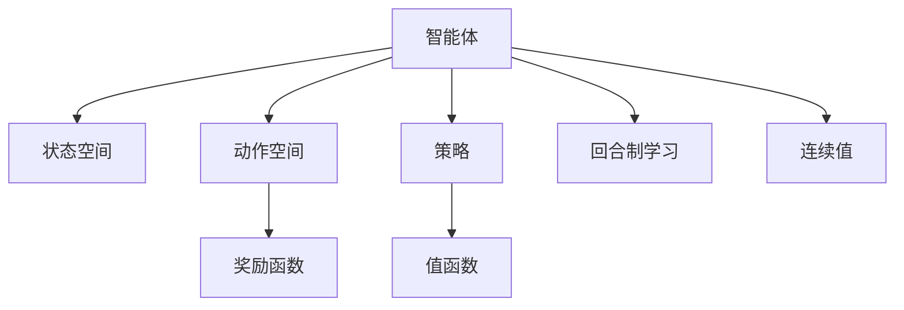
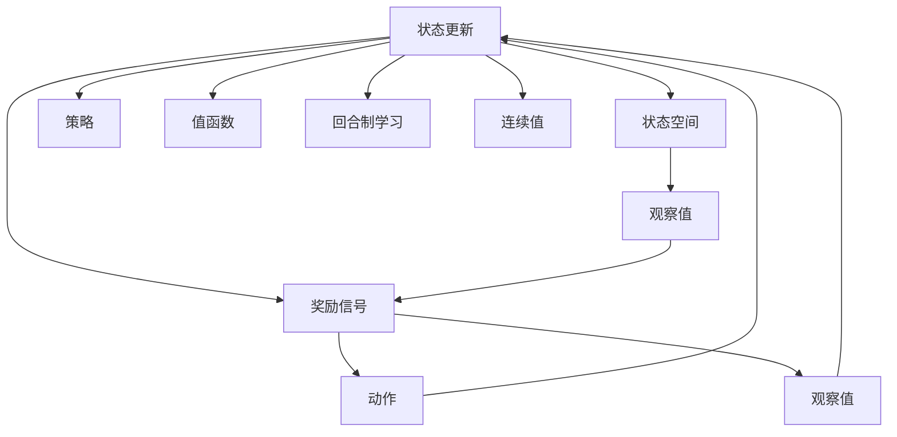

                 

# 强化学习：基础概念解析

## 1. 背景介绍

### 1.1 问题由来
强化学习（Reinforcement Learning, RL）是一种基于试错过程的机器学习范式，广泛应用于智能决策、机器人控制、游戏AI等领域。在强化学习中，智能体（Agent）通过与环境的交互，在每个时间步采取一个动作，根据环境反馈的奖励信号（Reward），不断调整策略，以最大化长期的累计奖励（Return）。

强化学习的核心在于，如何在没有显式标签的情况下，让智能体通过观察、尝试、学习，不断优化决策策略。相较于传统的监督学习和无监督学习，强化学习更具挑战性和灵活性，能够处理更加复杂和不确定的问题。

### 1.2 问题核心关键点
强化学习的关键点包括：

- **智能体**：在环境中采取动作的主体，可以是机器人、游戏角色、决策系统等。
- **环境**：智能体所处的外部世界，通过状态空间（State Space）、动作空间（Action Space）、奖励函数（Reward Function）等定义。
- **状态**：环境在某个时间点的特征描述，智能体根据状态做出决策。
- **动作**：智能体采取的具体行为，可以是连续值、离散值等。
- **奖励信号**：智能体采取动作后，环境给予的反馈，通常是瞬时奖励（Immediate Reward）或累计奖励（Return）。
- **策略**：智能体在给定状态下选择动作的规则或映射，策略可以是随机策略、确定性策略、策略函数等。
- **值函数**：评估策略的好坏的函数，如状态值函数（State Value Function）、动作值函数（Action Value Function）等。
- **Q-learning、SARSA等经典算法**：基于值函数的强化学习算法，通过样本数据积累不断优化策略。
- **深度强化学习**：通过深度神经网络逼近Q值函数或策略函数，提升强化学习模型的能力。

强化学习的研究背景和发展历史悠久，涉及数学、控制论、计算机科学等多个领域，是一门交叉学科。其核心思想可以追溯到经典博弈论，以及20世纪50年代的马尔可夫决策过程。

### 1.3 问题研究意义
强化学习对于自动驾驶、机器人控制、智能推荐系统、金融交易等众多领域具有重要的理论和应用价值：

1. **自主决策**：强化学习能够使智能体在复杂环境中自主决策，无需人工干预，减少人为错误。
2. **优化策略**：通过奖励信号引导智能体不断优化策略，提高决策的准确性和效率。
3. **探索未知**：在无标签数据环境下，强化学习能够探索环境中的未知区域，发现隐藏的模式和规律。
4. **数据利用**：强化学习可以高效利用样本数据，提升模型的泛化能力，减少标注成本。
5. **应用广泛**：强化学习广泛应用于游戏AI、机器人控制、自动驾驶、智能推荐等领域，推动了相关技术的进步。

## 2. 核心概念与联系

### 2.1 核心概念概述

为更好地理解强化学习的核心概念，本节将介绍几个关键概念：

- **强化学习（Reinforcement Learning, RL）**：基于智能体与环境的交互，通过奖励信号引导策略优化的机器学习范式。
- **马尔可夫决策过程（Markov Decision Process, MDP）**：描述智能体与环境互动的基本框架，包括状态空间、动作空间、奖励函数、转移概率等。
- **Q值函数（Q-value Function）**：评估智能体在每个状态下采取动作的价值，用于指导策略的优化。
- **策略（Policy）**：智能体在给定状态下选择动作的规则或映射，可以是确定性策略或随机策略。
- **值函数（Value Function）**：评估智能体策略的优劣，包括状态值函数和动作值函数。
- **回合制学习（Episodic Learning）**：强化学习中常用的学习范式，将学习过程分为多个回合，每个回合开始于初始状态，结束于某个终止状态或达到预设的时间限制。
- **连续值（Continuous Values）**：强化学习中动作空间的常见类型，如连续动作空间、连续状态空间等。

这些概念之间的逻辑关系可以通过以下Mermaid流程图来展示：



### 2.2 核心概念原理和架构的 Mermaid 流程图


## 3. 核心算法原理 & 具体操作步骤
### 3.1 算法原理概述

强化学习的核心算法原理可以概括为“试错学习”，即智能体通过不断与环境交互，在每个时间步采取动作，接收环境的奖励信号，根据奖励信号调整策略，以最大化长期的累计奖励。

强化学习的目标是通过学习最优策略，使得智能体在任意状态下，选择动作使得预期奖励最大。这个最优策略通常定义为一个策略函数 $\pi(a|s)$，表示在状态 $s$ 下选择动作 $a$ 的概率。最优策略满足贝尔曼方程（Bellman Equation）：

$$
Q^\pi(s, a) = r + \gamma \mathbb{E}_\pi [Q^\pi(s', a')] 
$$

其中 $r$ 是瞬时奖励，$\gamma$ 是折扣因子，$\mathbb{E}_\pi [Q^\pi(s', a')]$ 是在策略 $\pi$ 下，从状态 $s'$ 出发，按照策略 $\pi$ 选择动作 $a'$ 的预期回报。

### 3.2 算法步骤详解

基于强化学习的核心算法原理，强化学习的步骤如下：

**Step 1: 初始化环境**

- 初始化智能体和环境，设置初始状态 $s_0$。
- 智能体从初始状态 $s_0$ 开始，根据当前状态 $s_t$ 选择动作 $a_t$。

**Step 2: 执行动作并接收奖励**

- 智能体在当前状态 $s_t$ 下采取动作 $a_t$，环境根据动作和当前状态 $s_t$ 转移至新状态 $s_{t+1}$，并给予瞬时奖励 $r_{t+1}$。
- 智能体接收新状态 $s_{t+1}$ 和瞬时奖励 $r_{t+1}$。

**Step 3: 更新策略**

- 根据瞬时奖励和策略函数 $\pi(a|s)$，智能体更新状态值函数 $Q(s_t, a_t)$ 或策略函数 $\pi(s)$。
- 智能体根据更新后的状态值函数或策略函数，重新选择动作 $a_{t+1}$。

**Step 4: 迭代执行**

- 重复上述步骤，直到达到预设的终止条件（如时间限制、达到终止状态等）。
- 累积每个时间步的奖励，得到最终累计奖励 $R$。

### 3.3 算法优缺点

强化学习的优点包括：

- **自主决策**：智能体在环境中自主决策，无需人工干预。
- **适应性强**：强化学习能够适应复杂、非结构化的环境，适用于多种实际问题。
- **多样性**：强化学习能够处理连续值、离散值等多种类型的数据。

然而，强化学习也存在一些缺点：

- **试错成本高**：需要大量试错数据进行策略优化，计算和存储成本较高。
- **模型复杂**：智能体策略和环境的交互复杂，难以进行严格的分析和推断。
- **优化困难**：优化问题通常是非凸的，存在多个局部最优解。

### 3.4 算法应用领域

强化学习在各个领域都有广泛的应用，以下是几个典型的应用场景：

- **游戏AI**：如AlphaGo、星际争霸、围棋等，通过强化学习训练AI在复杂游戏中决策。
- **机器人控制**：如自适应控制系统、机器人导航等，通过强化学习训练机器人自主控制。
- **自动驾驶**：如自动驾驶车辆、无人车等，通过强化学习训练车辆自主决策。
- **智能推荐**：如推荐系统、广告投放等，通过强化学习训练推荐策略。
- **金融交易**：如高频交易、投资组合管理等，通过强化学习训练交易策略。
- **医疗诊断**：如治疗方案优化、医疗影像分析等，通过强化学习训练诊断策略。
- **能源管理**：如电网调度、能源优化等，通过强化学习训练能源管理策略。

## 4. 数学模型和公式 & 详细讲解 & 举例说明
### 4.1 数学模型构建

强化学习的数学模型可以定义为马尔可夫决策过程（MDP），其一般形式如下：

$$
\begin{aligned}
\mathcal{S} &= \text{状态空间}, \\
\mathcal{A} &= \text{动作空间}, \\
R(s, a) &= \text{瞬时奖励函数}, \\
P(s'|s, a) &= \text{状态转移概率}, \\
\pi(a|s) &= \text{策略函数}
\end{aligned}
$$

其中，状态空间 $\mathcal{S}$ 包含所有可能的状态，动作空间 $\mathcal{A}$ 包含所有可能的动作，瞬时奖励函数 $R(s, a)$ 是智能体在状态 $s$ 下采取动作 $a$ 的奖励，状态转移概率 $P(s'|s, a)$ 是智能体在状态 $s$ 下采取动作 $a$ 后转移到新状态 $s'$ 的概率，策略函数 $\pi(a|s)$ 是智能体在状态 $s$ 下选择动作 $a$ 的概率。

### 4.2 公式推导过程

强化学习的核心公式是贝尔曼方程，其推导过程如下：

- 设 $Q(s, a)$ 是在状态 $s$ 下采取动作 $a$ 的即时奖励加后续的预期回报。
- 对于状态 $s_t$ 和动作 $a_t$，根据瞬时奖励和后续的预期回报，可以定义如下方程：
$$
Q(s_t, a_t) = r_{t+1} + \gamma \mathbb{E}_\pi [Q(s_{t+1}, a_{t+1})]
$$

其中，$r_{t+1}$ 是智能体在时间步 $t+1$ 的瞬时奖励，$\gamma$ 是折扣因子，$\mathbb{E}_\pi [Q(s_{t+1}, a_{t+1})]$ 是在策略 $\pi$ 下，从状态 $s_{t+1}$ 出发，按照策略 $\pi$ 选择动作 $a_{t+1}$ 的预期回报。

通过递归上述方程，可以得到贝尔曼方程：
$$
Q^\pi(s, a) = r + \gamma \sum_{s'} P(s'|s, a) Q^\pi(s', a')
$$

其中 $r$ 是瞬时奖励，$\gamma$ 是折扣因子，$P(s'|s, a)$ 是状态转移概率，$Q^\pi(s', a')$ 是在策略 $\pi$ 下，从状态 $s'$ 出发，按照策略 $\pi$ 选择动作 $a'$ 的预期回报。

### 4.3 案例分析与讲解

考虑一个简单的马尔可夫决策过程，智能体在一个二元状态空间中，动作空间为 {Left, Right}，瞬时奖励函数为 {+1, -1}，状态转移概率为 {0.8, 0.2}，折扣因子为 $\gamma=0.9$。智能体希望最大化累计奖励。

假设智能体当前状态为 $s=1$，可以选择动作 $a=Left$ 或 $a=Right$。根据瞬时奖励和状态转移概率，可以计算出智能体采取不同动作的预期回报：

- 如果选择动作 $a=Left$，智能体转移到状态 $s'=0$，预期回报为 $Q^\pi(s', a')=1+0.9 \times (-1)=-0.1$。
- 如果选择动作 $a=Right$，智能体转移到状态 $s'=1$，预期回报为 $Q^\pi(s', a')=1+0.9 \times (-1)=-0.1$。

因此，在当前状态 $s=1$ 下，智能体应该采取动作 $a=Left$，以期望最大化累计奖励。

## 5. 项目实践：代码实例和详细解释说明
### 5.1 开发环境搭建

在进行强化学习实践前，我们需要准备好开发环境。以下是使用Python进行OpenAI Gym进行环境搭建的步骤：

1. 安装Anaconda：从官网下载并安装Anaconda，用于创建独立的Python环境。

2. 创建并激活虚拟环境：
```bash
conda create -n reinforcement-env python=3.8 
conda activate reinforcement-env
```

3. 安装Gym：
```bash
pip install gym
```

4. 安装PyTorch：
```bash
pip install torch torchvision torchaudio
```

5. 安装相关库：
```bash
pip install numpy pandas matplotlib scikit-learn
```

完成上述步骤后，即可在`reinforcement-env`环境中开始强化学习实践。

### 5.2 源代码详细实现

下面我们以Atari游戏“Pong”为例，给出使用PyTorch实现Q-learning算法的代码。

```python
import gym
import numpy as np
import torch
import torch.nn as nn
import torch.optim as optim

# 加载环境
env = gym.make('Pong-v0')

# 定义网络
class QNetwork(nn.Module):
    def __init__(self, input_size, output_size):
        super(QNetwork, self).__init__()
        self.fc1 = nn.Linear(input_size, 64)
        self.fc2 = nn.Linear(64, 64)
        self.fc3 = nn.Linear(64, output_size)
        
    def forward(self, x):
        x = F.relu(self.fc1(x))
        x = F.relu(self.fc2(x))
        x = self.fc3(x)
        return x

# 定义Q-learning算法
class QLearning:
    def __init__(self, input_size, output_size, learning_rate, discount_factor, epsilon):
        self.input_size = input_size
        self.output_size = output_size
        self.learning_rate = learning_rate
        self.discount_factor = discount_factor
        self.epsilon = epsilon
        self.q = QNetwork(input_size, output_size)
        self.optimizer = optim.Adam(self.q.parameters(), lr=learning_rate)
        
    def choose_action(self, state):
        if np.random.rand() > self.epsilon:
            return self.q(state).argmax().item()
        else:
            return np.random.randint(0, self.output_size)
    
    def update_q(self, state, action, reward, next_state, done):
        if not done:
            max_q = np.max(self.q(next_state).detach().numpy())
            td_target = reward + self.discount_factor * max_q
        else:
            td_target = reward
        
        q = self.q(state).gather(1, torch.tensor([action]).long())
        td_error = q - td_target
        loss = (td_error ** 2).mean()
        self.optimizer.zero_grad()
        loss.backward()
        self.optimizer.step()

# 定义主函数
def main():
    # 设置环境参数
    env = gym.make('Pong-v0')
    env.seed(42)
    torch.manual_seed(42)
    np.random.seed(42)

    # 定义Q-learning实例
    input_size = env.observation_space.shape[0]
    output_size = env.action_space.n
    learning_rate = 0.001
    discount_factor = 0.99
    epsilon = 0.1
    q_learning = QLearning(input_size, output_size, learning_rate, discount_factor, epsilon)
    
    # 训练
    state = env.reset()
    total_reward = 0
    for episode in range(1000):
        state = env.reset()
        total_reward = 0
        for t in range(1000):
            env.render()
            action = q_learning.choose_action(state)
            next_state, reward, done, _ = env.step(action)
            q_learning.update_q(state, action, reward, next_state, done)
            total_reward += reward
            state = next_state
            if done:
                print('Episode {}: reward = {} / total_reward = {}'.format(episode, reward, total_reward))
                break

# 启动训练
main()
```

在上述代码中，我们首先加载了“Pong”环境，定义了一个简单的Q网络（QNetwork），并在Q-learning算法（QLearning）中实现了选择动作、更新Q值等核心功能。最后，在主函数中通过循环迭代，训练智能体在“Pong”游戏中自主决策。

### 5.3 代码解读与分析

让我们再详细解读一下关键代码的实现细节：

**QNetwork类**：
- `__init__`方法：定义网络的结构，包含三个全连接层。
- `forward`方法：定义前向传播过程，通过三个全连接层进行特征提取和输出。

**QLearning类**：
- `__init__`方法：初始化Q值函数、优化器、折扣因子、ε-贪婪策略等参数。
- `choose_action`方法：根据当前状态和ε-贪婪策略，选择动作。
- `update_q`方法：根据状态、动作、奖励、下一个状态、是否完成，更新Q值函数。

**main函数**：
- 设置环境参数，初始化Q-learning实例。
- 在每个回合中，智能体通过ε-贪婪策略选择动作，根据环境反馈进行策略更新，累积奖励并输出。

可以看到，Q-learning算法通过构建Q值函数，并根据环境反馈不断更新Q值，实现了智能体在“Pong”游戏中的自主决策。虽然代码实现相对简单，但已经能够涵盖强化学习算法的核心步骤。

## 6. 实际应用场景
### 6.1 智能机器人控制

强化学习在智能机器人控制领域具有广泛的应用前景。例如，通过强化学习训练机器人自主导航、避障、抓取等复杂任务，能够显著提升机器人的自主决策能力和灵活性。

具体而言，可以设计一个智能机器人控制环境，智能体通过摄像头捕捉环境图像，通过状态空间表示环境的状态，动作空间定义机器人的可能动作（如前后移动、旋转、抓取等）。智能体通过观察环境状态，选择动作并接收奖励信号，最终学习到最优控制策略。

### 6.2 游戏AI

游戏AI是强化学习最早的实际应用之一。AlphaGo、AlphaStar等经典案例，展示了强化学习在解决复杂游戏问题上的强大能力。通过构建游戏环境，智能体通过与环境的交互，不断优化策略，学习到高水平的游戏能力。

例如，AlphaGo通过与人类围棋对弈的数据，构建蒙特卡洛树搜索（Monte Carlo Tree Search, MCTS）算法，结合强化学习优化决策策略，实现了超越人类棋手的围棋水平。

### 6.3 自动驾驶

自动驾驶是强化学习在实际应用中的重要方向。智能体通过与环境的交互，学习如何在复杂交通场景中做出决策，避免碰撞、识别行人、选择最优路径等。

例如，DeepMind通过强化学习训练自动驾驶车辆，通过与虚拟环境的交互，学习如何控制车辆，确保行车安全。

### 6.4 金融交易

强化学习在金融交易领域也具有广泛应用。智能体通过与金融市场数据的交互，学习如何预测股票价格、进行交易决策，优化投资组合等。

例如，通过构建金融交易环境，智能体通过历史股价数据进行模拟交易，学习到最优的交易策略，从而实现自动化的交易决策。

## 7. 工具和资源推荐
### 7.1 学习资源推荐

为了帮助开发者系统掌握强化学习的理论基础和实践技巧，这里推荐一些优质的学习资源：

1. 《强化学习：一种现代的方法》（Reinforcement Learning: An Introduction）：Sutton和Barto的经典教材，系统介绍了强化学习的基本概念、算法和应用。

2. 《深度强化学习》（Deep Reinforcement Learning）：Goodfellow等人的著作，介绍了深度神经网络在强化学习中的应用。

3. 《强化学习实战》（Hands-On Reinforcement Learning with PyTorch）：廖星宇等人的开源教程，详细介绍了使用PyTorch实现强化学习的具体步骤。

4. 《强化学习与Python编程》（Python Machine Learning: A Practical Introduction）：Geron的教程，介绍了使用Python进行强化学习开发的技巧和应用。

5. OpenAI Gym：开源的强化学习环境库，包含多种常见的游戏和模拟环境，用于进行算法测试和评估。

通过对这些资源的学习实践，相信你一定能够快速掌握强化学习的精髓，并用于解决实际的NLP问题。

### 7.2 开发工具推荐

高效的开发离不开优秀的工具支持。以下是几款用于强化学习开发的常用工具：

1. OpenAI Gym：开源的强化学习环境库，包含多种常见的游戏和模拟环境，用于进行算法测试和评估。

2. PyTorch：基于Python的开源深度学习框架，灵活动态的计算图，适合快速迭代研究。大部分预训练模型都有PyTorch版本的实现。

3. TensorFlow：由Google主导开发的开源深度学习框架，生产部署方便，适合大规模工程应用。同样有丰富的预训练语言模型资源。

4. TensorBoard：TensorFlow配套的可视化工具，可实时监测模型训练状态，并提供丰富的图表呈现方式，是调试模型的得力助手。

5. Weights & Biases：模型训练的实验跟踪工具，可以记录和可视化模型训练过程中的各项指标，方便对比和调优。

6. Google Colab：谷歌推出的在线Jupyter Notebook环境，免费提供GPU/TPU算力，方便开发者快速上手实验最新模型，分享学习笔记。

合理利用这些工具，可以显著提升强化学习任务的开发效率，加快创新迭代的步伐。

### 7.3 相关论文推荐

强化学习的研究背景和发展历史悠久，涉及数学、控制论、计算机科学等多个领域，是一门交叉学科。以下是几篇奠基性的相关论文，推荐阅读：

1. Q-learning：Watkins和Horn于1992年提出的经典Q-learning算法，是强化学习的重要基础。

2. SARSA：Manhatto等人在2002年提出的SARSA算法，是Q-learning的重要改进。

3. Actor-Critic算法：Sutton等人在2000年提出的Actor-Critic算法，通过结合Actor和Critic网络，提升强化学习模型的性能。

4. Deep Q-Network（DQN）：Mnih等人在2013年提出的DQN算法，通过深度神经网络逼近Q值函数，提升强化学习模型的能力。

5. Trust Region Policy Optimization（TRPO）：Schulman等人在2015年提出的TRPO算法，通过信任区域优化提升强化学习模型的稳定性。

6. Proximal Policy Optimization（PPO）：Schulman等人在2017年提出的PPO算法，通过近端策略优化提升强化学习模型的效率。

这些论文代表了大强化学习的发展脉络。通过学习这些前沿成果，可以帮助研究者把握学科前进方向，激发更多的创新灵感。

## 8. 总结：未来发展趋势与挑战

### 8.1 总结

本文对强化学习的核心概念、算法原理和操作步骤进行了全面系统的介绍。首先阐述了强化学习的背景和研究意义，明确了其在工作、游戏、自动驾驶、金融交易等众多领域的应用前景。其次，从原理到实践，详细讲解了强化学习的数学模型和关键步骤，给出了具体的代码实现。

通过本文的系统梳理，可以看到，强化学习通过试错学习的方式，使智能体在复杂环境中自主决策，具有广泛的应用前景。未来，伴随算法和工具的不断进步，强化学习必将在更多领域得到应用，为人类社会带来深远的影响。

### 8.2 未来发展趋势

展望未来，强化学习的技术发展将呈现以下几个趋势：

1. **深度强化学习**：通过深度神经网络逼近Q值函数或策略函数，提升强化学习模型的能力。

2. **强化学习与计算机视觉、自然语言处理等技术的融合**：通过多模态信息整合，提升强化学习模型的泛化能力和决策能力。

3. **自适应学习**：通过动态调整学习率和参数，提升强化学习模型的鲁棒性和适应性。

4. **分布式训练**：通过多机分布式训练，提升强化学习模型的训练效率和扩展性。

5. **迁移学习**：通过迁移学习，使智能体能够快速适应新环境和新任务，减少试错成本。

6. **强化学习优化**：通过新算法和新工具，提升强化学习模型的训练效率和精度。

7. **应用场景扩展**：强化学习将拓展到更多的应用领域，如医疗、教育、金融等，带来深远的影响。

这些趋势凸显了强化学习技术的广阔前景，必将推动强化学习在更多领域得到应用，为人类社会带来深远的影响。

### 8.3 面临的挑战

尽管强化学习技术在许多领域都取得了显著成果，但仍面临一些挑战：

1. **计算资源需求高**：强化学习需要大量的计算资源进行模型训练和参数优化，对于计算资源有限的场景，难以进行大规模部署。

2. **模型泛化能力不足**：强化学习模型往往在特定环境或任务上表现良好，但在新环境或新任务上的泛化能力较差。

3. **模型复杂度高**：强化学习模型通常结构复杂，难以进行严格的分析和推断。

4. **样本数据需求大**：强化学习需要大量的样本数据进行模型训练，对于数据稀缺的场景，难以进行有效的模型训练。

5. **模型解释性不足**：强化学习模型往往缺乏解释性，难以理解其内部工作机制和决策逻辑。

6. **伦理和安全问题**：强化学习模型可能存在潜在的伦理和安全风险，如决策不可控、恶意用途等。

7. **可解释性和透明性不足**：强化学习模型的决策过程难以解释，缺乏透明性，可能存在不公正或偏见的问题。

这些挑战需要学术界和产业界共同努力，积极探索新的技术手段和应用方法，推动强化学习技术的发展。

### 8.4 研究展望

面对强化学习面临的诸多挑战，未来的研究需要在以下几个方面寻求新的突破：

1. **计算效率优化**：通过算法改进、模型压缩、分布式训练等手段，优化计算效率，降低计算资源需求。

2. **模型泛化能力提升**：通过迁移学习、多任务学习等方法，提升强化学习模型的泛化能力，使其在更多场景下表现良好。

3. **模型复杂度降低**：通过模型压缩、简化、优化等手段，降低强化学习模型的复杂度，提升模型的可解释性和透明性。

4. **数据高效利用**：通过数据增强、采样、筛选等手段，优化样本数据利用率，提升模型训练效果。

5. **伦理和安全机制构建**：通过引入伦理导向的评价指标、安全机制，构建更加公正、安全的强化学习系统。

6. **可解释性增强**：通过可解释性模型、可视化工具等手段，增强强化学习模型的解释性和透明性，保障其决策过程的公正性和可信度。

这些研究方向的研究突破，将进一步推动强化学习技术的发展，带来更广泛的应用前景。

## 9. 附录：常见问题与解答

**Q1: 什么是强化学习？**

A: 强化学习是一种基于智能体与环境的交互，通过奖励信号引导策略优化的机器学习范式。

**Q2: 强化学习与传统机器学习的区别是什么？**

A: 强化学习与传统机器学习的区别在于，强化学习不需要显式的标签信息，而是通过环境反馈引导智能体自主决策，优化策略。

**Q3: 强化学习有哪些常见算法？**

A: 常见的强化学习算法包括Q-learning、SARSA、Actor-Critic、DQN、TRPO、PPO等。

**Q4: 强化学习在实际应用中面临哪些挑战？**

A: 强化学习在实际应用中面临的挑战包括计算资源需求高、模型泛化能力不足、模型复杂度高、数据需求大、模型解释性不足、伦理和安全问题等。

**Q5: 强化学习的应用场景有哪些？**

A: 强化学习在自动驾驶、机器人控制、游戏AI、金融交易、医疗诊断、能源管理等领域有广泛的应用前景。

---

作者：禅与计算机程序设计艺术 / Zen and the Art of Computer Programming

