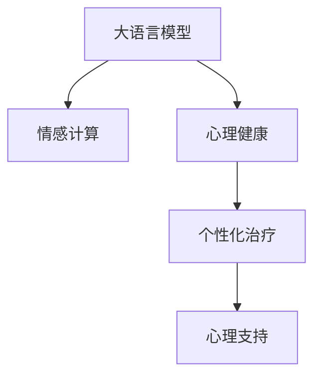
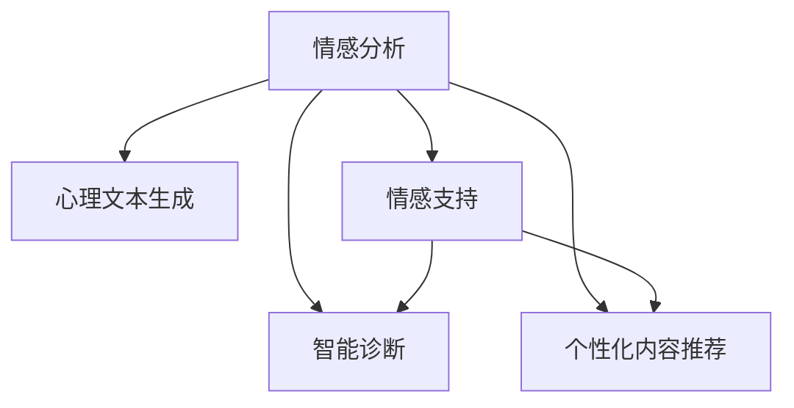

                 

# 心理健康和 LLM：个性化的支持和治疗

> 关键词：大语言模型(LLM), 心理健康, 情感计算, 心理支持, 个性化治疗

## 1. 背景介绍

### 1.1 问题由来

随着人工智能技术的快速发展，语言模型（尤其是大语言模型，Large Language Model，简称LLM）在多个领域取得了令人瞩目的成就，包括自然语言处理、机器翻译、智能客服等。然而，大语言模型在心理健康领域的应用研究相对较少。实际上，心理健康问题在全球范围内日益严峻，且对人类社会的影响深远。面对这一问题，大语言模型（包括基于其的聊天机器人）具备潜在的独特优势，可以提供个性化、可扩展且成本低廉的心理支持和治疗服务。

### 1.2 问题核心关键点

- **大语言模型**：以自回归模型（如GPT系列）和自编码模型（如BERT）为代表的大规模预训练语言模型，通过在海量无标签文本语料上进行预训练，学习到丰富的语言知识和常识。
- **心理健康**：指个体在生理、心理及社会各方面保持良好状态的过程，包括情绪调节、压力管理、焦虑症、抑郁症等各类心理问题的干预和治疗。
- **情感计算**：指通过计算和分析人的情感信息，提供与情感相关的信息处理和识别技术。
- **个性化治疗**：根据个体具体情况提供定制化的心理支持和治疗方案，以适应不同的心理状况和需求。
- **心理支持**：通过各种方式提供心理健康相关的帮助和指导，提升个体心理福祉。

这些核心概念之间的关系可以通过以下Mermaid流程图来展示：



大语言模型通过与情感计算、心理健康、个性化治疗和心理支持等概念的结合，可以在心理健康领域提供全新的解决方案。

## 2. 核心概念与联系

### 2.1 核心概念概述

为更好地理解大语言模型在心理健康领域的应用，本节将介绍几个密切相关的核心概念：

- **情感分析**：通过分析文本中的情感信息，识别情绪状态、情感倾向等。
- **心理文本生成**：生成符合心理状态、情感倾向的文本，用于心理治疗和支持。
- **情感支持**：提供情感陪伴、情绪调节、压力管理等功能，帮助个体提升心理韧性。
- **智能诊断**：通过分析个体描述的心理问题，提供初步的诊断和建议。
- **个性化内容推荐**：根据个体心理状况和历史互动，推荐合适的心理健康资源和活动。

这些概念之间相互联系，通过大语言模型的集成和应用，可以构建起一个全面、个性化的心理健康支持和治疗系统。

### 2.2 核心概念原理和架构的 Mermaid 流程图



此图展示了大语言模型在心理健康领域的核心概念和它们之间的相互关系。情感分析作为起点，结合心理文本生成、情感支持、智能诊断和个性化内容推荐，提供个性化的心理健康支持和治疗。

## 3. 核心算法原理 & 具体操作步骤

### 3.1 算法原理概述

基于大语言模型进行心理健康支持和治疗的核心算法原理包括：

- **情感分析算法**：通过深度学习模型（如BERT、GPT等），对个体描述的文本进行情感分析和情绪状态识别，从而提供初步的情感状态评估。
- **心理文本生成算法**：利用大语言模型的生成能力，生成与个体当前情感状态和需求相匹配的文本，用于心理治疗和支持。
- **情感支持算法**：通过聊天机器人等形式，实时提供情感陪伴和情绪调节等功能，帮助个体应对心理压力。
- **智能诊断算法**：通过分析个体描述的心理问题，结合预训练模型的知识库，进行初步的心理健康诊断，并提出相应的建议。
- **个性化内容推荐算法**：根据个体心理状况和历史互动，推荐合适的心理健康资源和活动，如心理咨询、心理游戏、心理阅读等。

### 3.2 算法步骤详解

1. **情感分析**：
   - **步骤**：输入个体描述的文本，通过情感分析模型计算情感极性和情绪状态。
   - **工具**：使用预训练的BERT或GPT模型，配合Fine-tuning进行情感分析。
   - **技术细节**：
     - 分词和嵌入层：将输入文本分词并转化为模型可接受的向量表示。
     - 情感分类器：通过多层的神经网络，对情感进行分类，输出情感极性（如正面、负面、中性）。
     - 情绪状态识别：使用注意力机制，识别具体的情绪状态（如焦虑、抑郁、愤怒等）。

2. **心理文本生成**：
   - **步骤**：根据情感分析结果，生成匹配个体当前情感状态和需求的文本。
   - **工具**：使用GPT或其他大语言模型。
   - **技术细节**：
     - 设定条件（情感极性和状态）：将情感分析结果作为条件输入到生成模型。
     - 文本生成过程：使用解码器生成符合条件的文字，例如安慰话语、建议、心灵鸡汤等。

3. **情感支持**：
   - **步骤**：通过聊天机器人与个体进行实时互动，提供情感陪伴和情绪调节。
   - **工具**：使用基于大语言模型的聊天机器人。
   - **技术细节**：
     - 搭建聊天机器人：使用Rasa、Dialogflow等工具，搭建对话系统。
     - 情感对话策略：设计多轮对话流程，识别个体情绪，提供相应的情感回应。
     - 互动反馈机制：记录对话历史和反馈，优化对话策略。

4. **智能诊断**：
   - **步骤**：根据个体描述的心理问题，结合预训练模型的知识库，进行初步诊断。
   - **工具**：使用预训练的BERT或GPT模型。
   - **技术细节**：
     - 问题抽取：使用自然语言处理技术，抽取文本中的关键问题。
     - 知识匹配：将问题与预训练模型知识库中的知识进行匹配，找出匹配度最高的相关问题。
     - 诊断输出：基于匹配结果，输出初步诊断和建议。

5. **个性化内容推荐**：
   - **步骤**：根据个体心理状况和历史互动，推荐合适的心理健康资源和活动。
   - **工具**：使用大语言模型和推荐算法。
   - **技术细节**：
     - 用户建模：通过文本数据或行为数据，构建用户心理状态模型。
     - 内容匹配：使用文本相似度算法，匹配心理健康资源。
     - 推荐输出：基于匹配结果，推荐资源或活动。

### 3.3 算法优缺点

基于大语言模型的心理健康支持和治疗算法具有以下优点：

- **高效性**：相较于传统心理治疗，大语言模型可以在短时间内提供大量的心理支持和建议，无需长时间等待。
- **可扩展性**：随着数据和模型的增长，大语言模型可以持续更新和优化，提供更全面的心理健康服务。
- **个性化**：能够根据个体情感状态和需求，提供量身定制的心理支持和治疗方案。
- **成本低廉**：相比于专业心理治疗，使用大语言模型的心理健康支持和治疗成本更低。

同时，该算法也存在一定的局限性：

- **准确性**：情感分析和智能诊断的准确性可能受到数据质量和预训练模型能力的限制。
- **隐私问题**：个体情感状态和心理健康问题的处理需要高度的隐私保护。
- **伦理道德**：使用大语言模型进行心理健康支持时，需要注意其伦理道德问题，避免误导和过度干预。

### 3.4 算法应用领域

基于大语言模型的心理健康支持和治疗算法在多个领域具有广泛的应用潜力，例如：

- **在线心理咨询**：为需要心理帮助的个体提供在线咨询服务，帮助其缓解心理压力和情绪困扰。
- **心理健康监测**：通过监测个体在社交媒体上的文本情感，提前识别心理健康风险，提供及时的干预和帮助。
- **心理康复训练**：结合虚拟现实（VR）等技术，为个体提供心理康复训练，帮助其恢复心理健康。
- **情感陪伴机器人**：通过聊天机器人、智能语音助手等形式，提供情感陪伴和情绪调节服务。
- **心理危机干预**：在紧急情况下，通过大语言模型提供的智能诊断和情感支持，快速识别并干预心理危机。

这些应用场景展示了大语言模型在心理健康领域的多样性和潜在的广泛应用前景。

## 4. 数学模型和公式 & 详细讲解 & 举例说明

### 4.1 数学模型构建

基于大语言模型的心理健康支持和治疗算法，涉及多个数学模型的构建。以情感分析为例，一个简单的情感分类模型可以表示为：

$$
\text{Emotion} = \mathcal{P}(\text{Sentiment}|\text{Text}; \theta)
$$

其中，$\mathcal{P}$ 表示概率分布，$\text{Sentiment}$ 表示情感极性，$\text{Text}$ 表示输入文本，$\theta$ 表示模型的参数。

### 4.2 公式推导过程

以BERT模型为例，情感分析的公式推导如下：

1. 文本嵌入：使用BERT的词向量表示文本中的每个单词。
2. 情感分类器：通过多层的神经网络，将嵌入的文本向量转化为情感极性。

公式为：

$$
\text{Emotion} = \mathcal{P}(\text{Sentiment}|\text{Text}; \theta) = \text{softmax}(\text{BERT}_{\theta}(\text{Text}))
$$

其中，$\text{softmax}$ 函数用于将输出向量转换为概率分布。

### 4.3 案例分析与讲解

假设一个用户描述自己最近情绪低落，可能会产生焦虑和抑郁。通过BERT模型进行情感分析，可以得到其情感极性为负面，情绪状态为焦虑和抑郁。

1. 输入文本：“最近工作压力很大，总是觉得焦虑和抑郁。”
2. 使用BERT模型进行文本嵌入，得到一个向量表示。
3. 通过情感分类器，计算出情感极性和情绪状态的概率分布。

假设模型的输出为：

$$
\begin{align*}
\text{Anxiety} &= 0.8 \\
\text{Depression} &= 0.7 \\
\text{Negative} &= 0.95
\end{align*}
$$

这意味着用户可能同时存在焦虑和抑郁的情绪，且整体情绪为负面。

## 5. 项目实践：代码实例和详细解释说明

### 5.1 开发环境搭建

在进行心理健康支持和治疗的大语言模型开发前，需要先搭建好开发环境：

1. 安装Python：确保Python版本为3.6及以上，建议使用Anaconda。
2. 安装必要的依赖包：如TensorFlow、PyTorch、NLTK等。
3. 准备数据集：收集心理健康相关的文本数据，如心理健康问卷、社交媒体文本、用户描述等。
4. 搭建服务器：使用AWS、Google Cloud等云服务搭建服务器，配置GPU资源。

### 5.2 源代码详细实现

以下是一个使用BERT模型进行情感分析的示例代码：

```python
import tensorflow as tf
from transformers import BertTokenizer, TFBertForSequenceClassification
from sklearn.model_selection import train_test_split

# 加载BERT模型和分词器
tokenizer = BertTokenizer.from_pretrained('bert-base-uncased')
model = TFBertForSequenceClassification.from_pretrained('bert-base-uncased', num_labels=3)

# 加载数据集
texts, labels = load_dataset()

# 将文本进行分词并转换为BERT可接受格式
tokenized_texts = [tokenizer.encode(text, add_special_tokens=True) for text in texts]
input_ids = [input_ids[0] for input_ids in tokenized_texts]
attention_masks = [[1] * len(input_ids) for _ in input_ids]

# 划分训练集和测试集
train_texts, test_texts, train_labels, test_labels = train_test_split(texts, labels, test_size=0.2)

# 构建模型输入
train_input = tf.data.Dataset.from_tensor_slices((input_ids, attention_masks, train_labels))
train_input = train_input.batch(16, drop_remainder=True)
train_input = train_input.prefetch(tf.data.experimental.AUTOTUNE)

test_input = tf.data.Dataset.from_tensor_slices((input_ids, attention_masks, test_labels))
test_input = test_input.batch(16, drop_remainder=True)
test_input = test_input.prefetch(tf.data.experimental.AUTOTUNE)

# 训练模型
model.compile(optimizer=tf.keras.optimizers.AdamW(learning_rate=2e-5), loss='sparse_categorical_crossentropy', metrics=['accuracy'])
model.fit(train_input, epochs=3)

# 评估模型
model.evaluate(test_input, verbose=1)
```

### 5.3 代码解读与分析

- **数据预处理**：将文本进行分词，转换为BERT模型可接受的格式，包括输入ID和注意力掩码。
- **模型构建**：使用BERT模型进行情感分类，设置损失函数为交叉熵，优化器为AdamW。
- **训练和评估**：使用训练集和测试集进行模型训练和评估。

## 6. 实际应用场景

### 6.1 在线心理咨询

在线心理咨询系统可以通过大语言模型实现，为个体提供实时、便捷的心理咨询服务。系统可以收集用户描述，进行情感分析，并结合心理文本生成算法，生成相应的回复和建议。

### 6.2 心理健康监测

通过社交媒体平台收集个体发布的文本，进行情感分析，识别心理健康风险。系统可以定时推送健康建议和心理测试，帮助个体及时调整情绪状态。

### 6.3 心理康复训练

结合虚拟现实（VR）技术，为个体提供沉浸式的心理康复训练。系统通过大语言模型进行情绪引导和内容推荐，帮助个体逐步恢复心理健康。

### 6.4 情感陪伴机器人

聊天机器人和智能语音助手可以通过大语言模型进行训练，提供情感陪伴和情绪调节服务。系统可以实时监测个体情感状态，提供相应的回应和建议。

### 6.5 心理危机干预

在紧急情况下，大语言模型可以用于初步的心理健康评估和诊断，结合实时情感支持，快速识别和干预心理危机。

## 7. 工具和资源推荐

### 7.1 学习资源推荐

为了帮助开发者系统掌握基于大语言模型的心理健康支持和治疗技术，这里推荐一些优质的学习资源：

1. **《深度学习与心理健康》书籍**：由心理学家和机器学习专家合著，介绍深度学习在心理健康中的应用。
2. **《情感计算与心理健康》课程**：Coursera上的课程，介绍情感计算在心理健康评估和干预中的作用。
3. **《心理健康与自然语言处理》博客**：Google AI博客，介绍NLP技术在心理健康中的应用。
4. **《心理健康数据集》**：Kaggle上的心理健康数据集，涵盖文本情感、心理健康问卷等。

### 7.2 开发工具推荐

- **TensorFlow**：强大的深度学习框架，适合构建大语言模型和情感分析模型。
- **PyTorch**：灵活的深度学习框架，易于调试和优化。
- **Rasa**：开源聊天机器人框架，支持对话管理和情感分析。
- **Dialogflow**：Google提供的聊天机器人平台，提供情感分析和对话管理功能。

### 7.3 相关论文推荐

1. **《基于大语言模型的情感分析》**：提出使用BERT模型进行情感分析的算法。
2. **《心理文本生成：大语言模型的应用》**：介绍使用GPT模型进行心理文本生成的算法。
3. **《情感支持与心理健康》**：研究基于聊天机器人的情感支持算法。
4. **《智能诊断与心理健康》**：提出使用BERT模型进行智能诊断的算法。
5. **《个性化内容推荐与心理健康》**：介绍使用大语言模型进行个性化内容推荐的算法。

## 8. 总结：未来发展趋势与挑战

### 8.1 研究成果总结

本文系统介绍了基于大语言模型的心理健康支持和治疗技术，展示了其高效性、可扩展性和个性化等优点，同时指出了其准确性、隐私和伦理等挑战。该技术在心理健康领域具有广泛的应用前景，可以提升个体心理健康水平，降低心理疾病的发病率。

### 8.2 未来发展趋势

未来，基于大语言模型的心理健康支持和治疗技术将呈现以下几个发展趋势：

1. **多模态融合**：结合视觉、听觉等模态信息，提供更全面、更精确的心理健康支持和治疗。
2. **跨领域应用**：将心理健康支持和技术应用于更多领域，如教育、企业员工福利等。
3. **自适应学习**：通过持续学习和反馈机制，提高大语言模型的适应性和个性化能力。
4. **实时监测**：利用物联网技术，实现对个体心理健康状态的实时监测和干预。
5. **隐私保护**：加强对个体情感状态和心理健康信息的保护，确保数据隐私和安全。

### 8.3 面临的挑战

尽管基于大语言模型的心理健康支持和治疗技术取得了初步成果，但仍面临以下挑战：

1. **数据隐私**：个体心理健康信息的隐私保护需要高度关注。
2. **模型准确性**：情感分析和智能诊断的准确性受数据质量和模型能力的限制。
3. **伦理道德**：大语言模型在心理健康支持中的应用需要遵守伦理规范，避免误导和过度干预。
4. **技术融合**：心理健康支持和治疗技术需要与其他技术（如虚拟现实、脑机接口等）进行深度融合。
5. **用户接受度**：个体对使用大语言模型进行心理健康支持和技术可能存在抵触情绪，需要加强教育与沟通。

### 8.4 研究展望

未来的研究需要在以下几个方面进行突破：

1. **隐私保护技术**：开发更加安全的隐私保护算法，保护个体心理健康信息。
2. **多模态融合算法**：结合视觉、听觉等多模态信息，提供更全面、更精确的心理健康支持和治疗。
3. **自适应学习算法**：通过持续学习和反馈机制，提高大语言模型的适应性和个性化能力。
4. **伦理道德框架**：建立大语言模型在心理健康支持中的伦理道德规范，确保其应用安全性。
5. **用户体验优化**：提高大语言模型在心理健康支持中的用户体验，增强其可信度和接受度。

## 9. 附录：常见问题与解答

**Q1: 如何确保大语言模型在心理健康支持中的准确性？**

A: 确保大语言模型在心理健康支持中的准确性，需要从数据质量、模型选择和训练策略等多个方面进行优化。具体措施包括：

1. 数据质量：使用高质量的心理健康数据进行训练，避免偏差和噪声。
2. 模型选择：选择经过充分训练和优化的预训练模型，如BERT、GPT等。
3. 训练策略：采用合适的损失函数、优化器和训练策略，如AdamW、L2正则等。
4. 多模型集成：结合多个模型的输出，提升准确性和鲁棒性。

**Q2: 如何在实际应用中保护心理健康信息的隐私？**

A: 保护心理健康信息的隐私，需要采取以下措施：

1. 数据脱敏：对用户输入的数据进行脱敏处理，避免敏感信息的泄露。
2. 匿名化处理：使用数据匿名化技术，去除与用户身份相关的信息。
3. 加密存储：对心理健康信息进行加密存储，确保数据安全。
4. 用户同意：在使用心理健康信息前，获取用户的明确同意，并告知数据用途。

**Q3: 如何提升大语言模型在心理健康支持中的用户体验？**

A: 提升大语言模型在心理健康支持中的用户体验，需要从界面设计、互动方式和个性化推荐等多个方面进行优化。具体措施包括：

1. 界面设计：设计简洁、易用的用户界面，提升用户体验。
2. 互动方式：提供自然、流畅的对话交互方式，增强用户的信任感。
3. 个性化推荐：根据用户情感状态和历史互动，推荐合适的心理健康资源和活动，提升用户的满意度。

**Q4: 如何在心理健康支持中确保大语言模型的伦理道德？**

A: 确保大语言模型在心理健康支持中的伦理道德，需要建立相应的规范和机制：

1. 伦理审查：在使用大语言模型进行心理健康支持前，进行伦理审查，确保其符合伦理道德规范。
2. 透明性：确保大语言模型的决策过程透明，便于用户理解和信任。
3. 责任归属：明确大语言模型在心理健康支持中的责任归属，确保其在出现问题时能够及时回应和处理。

**Q5: 大语言模型在心理健康支持中的未来展望是什么？**

A: 大语言模型在心理健康支持中的未来展望包括：

1. **跨领域应用**：将心理健康支持和技术应用于更多领域，如教育、企业员工福利等。
2. **多模态融合**：结合视觉、听觉等多模态信息，提供更全面、更精确的心理健康支持和治疗。
3. **实时监测**：利用物联网技术，实现对个体心理健康状态的实时监测和干预。
4. **隐私保护**：加强对个体心理健康信息的保护，确保数据隐私和安全。
5. **伦理道德**：建立大语言模型在心理健康支持中的伦理道德规范，确保其应用安全性。

---

作者：禅与计算机程序设计艺术 / Zen and the Art of Computer Programming

