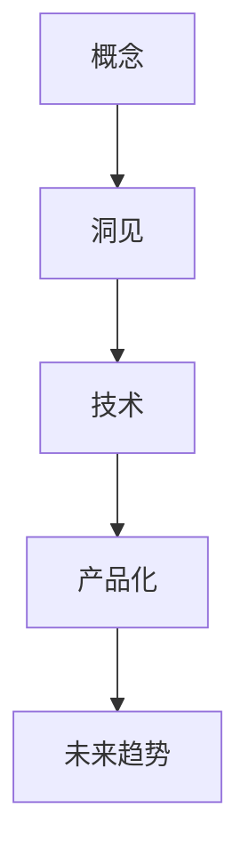

                 

# 思想的演变：从概念到洞见

## 1. 背景介绍

### 1.1 问题由来

在科技发展的浪潮中，思想的演变贯穿于科技创新的每一个环节。从概念的提出，到技术的实现，再到产品应用的落地，每一个过程都需要严谨的逻辑推演和实证研究。本文将聚焦于思想的演变，探索概念的形成、技术的突破、产品化的应用，以及未来的发展趋势。

### 1.2 问题核心关键点

1. **概念到洞见的演化**：思想的演变往往从抽象的概念开始，通过实证研究和反复迭代，逐渐形成可操作的洞见，推动技术进步和产品创新。
2. **技术的突破**：从概念到技术的桥梁，需要严密的逻辑推导和严谨的实验验证，往往伴随着关键算法和架构的创新。
3. **产品化应用**：从技术到产品，需要综合考虑用户体验、市场反馈、商业模式等因素，通过迭代优化实现产品化。
4. **未来发展趋势**：展望未来，科技领域需把握关键方向，结合技术创新和市场需求，寻找新的突破点。

## 2. 核心概念与联系

### 2.1 核心概念概述

为更好地理解思想演变的各个环节，本节将介绍几个密切相关的核心概念：

- **概念**：最初对问题或现象的抽象描述，为后续研究和实践提供指导方向。
- **洞见**：基于实证研究得出的具体见解，可转化为可操作的技术方案或产品策略。
- **技术**：将洞见具体化，通过算法、架构等手段实现的工具和方法。
- **产品化**：将技术应用于实际应用场景，通过用户体验优化和市场验证，实现商业化。
- **未来趋势**：基于现有技术和新趋势，预测未来发展方向，指导未来的研究和应用。

这些核心概念之间的逻辑关系可以通过以下Mermaid流程图来展示：



这个流程图展示了思想演变的核心逻辑：

1. 思想从概念开始，通过反复迭代和实验验证，形成具体的洞见。
2. 洞见指导技术的研究和实现。
3. 技术通过产品化，实现商业应用。
4. 基于现有技术和新趋势，预测未来发展方向。

## 3. 核心算法原理 & 具体操作步骤

### 3.1 算法原理概述

思想的演变更量涉及从概念到洞见、技术实现、产品化应用等不同阶段。本节将从算法原理的角度，探讨如何通过数学模型和逻辑推理，将抽象的概念转化为可操作的洞见，进而推动技术进步和产品化应用。

### 3.2 算法步骤详解

1. **概念形成**：通过逻辑推演和理论构建，形成抽象的概念模型。例如，从统计学角度提出假设，通过数学推导构建概念框架。
2. **实证验证**：通过实验验证概念的正确性和适用范围。例如，利用大规模实验数据，验证概念的统计显著性。
3. **洞见生成**：基于实证结果，提炼出具体的洞见。例如，通过数据分析，得出模型优化的具体策略。
4. **技术实现**：将洞见转化为具体的技术方案。例如，根据洞见设计算法和架构。
5. **产品化应用**：将技术方案应用于实际应用场景，通过用户体验优化和市场验证，实现商业化。例如，通过用户反馈优化产品功能，进行市场推广。
6. **未来趋势预测**：基于现有技术和新趋势，预测未来发展方向。例如，通过技术演进的逻辑推演，预测新方向。

### 3.3 算法优缺点

思想演变的算法具有以下优点：

- **系统性**：通过逻辑推理和实证验证，形成系统的思想框架。
- **可操作性**：将抽象的概念转化为可操作的洞见和技术方案。
- **可验证性**：通过实验验证，确保思想的有效性和正确性。

同时，也存在以下局限性：

- **复杂性**：从概念到洞见的推演过程较为复杂，需要较高水平的理论基础和实验验证能力。
- **时间成本**：概念验证和迭代优化需要较长时间，可能影响产品化速度。
- **资源消耗**：实验验证和实证研究需要大量数据和计算资源。

### 3.4 算法应用领域

思想演变的算法在多个领域得到了广泛应用，例如：

- **人工智能**：从概念提出到技术实现，推动了深度学习、自然语言处理等领域的突破。
- **生物医学**：通过概念验证和实证研究，推动了药物发现、基因编辑等技术的应用。
- **社会科学**：从社会学理论到实证研究，推动了公共政策、社会行为等领域的探索。
- **工程技术**：从设计理念到产品化应用，推动了新产品、新技术的开发和市场推广。

## 4. 数学模型和公式 & 详细讲解 & 举例说明

### 4.1 数学模型构建

思想演变的数学模型通常基于概率统计、优化理论、机器学习等数学框架构建。以深度学习为例，概念通常以模型结构、损失函数、优化算法等形式表达。例如，卷积神经网络（CNN）用于图像处理，循环神经网络（RNN）用于时间序列预测，生成对抗网络（GAN）用于生成图像等。

### 4.2 公式推导过程

以卷积神经网络（CNN）为例，其基本结构如图1所示：

```
输入层
├── 卷积层
│     ├── 卷积核
│     └── 激活函数
├── 池化层
└── 全连接层
```

其数学公式推导如下：

- 输入数据 $x$ 经过卷积层，计算卷积核 $w$ 的卷积操作：
$$ y = w * x $$

- 通过激活函数 $f$，将卷积结果 $y$ 映射到非线性空间：
$$ z = f(y) $$

- 池化层对 $z$ 进行下采样，得到特征映射 $u$：
$$ u = \text{Pooling}(z) $$

- 全连接层对 $u$ 进行线性变换和激活，得到输出 $o$：
$$ o = f(Wu + b) $$

其中，$W$ 为权重矩阵，$b$ 为偏置项，$f$ 为激活函数，$\text{Pooling}$ 为池化操作。

### 4.3 案例分析与讲解

以图像分类为例，假设输入数据为 $x$，卷积核为 $w$，激活函数为 ReLU，池化层为最大池化，全连接层为 Softmax。模型的训练目标为最小化损失函数 $L$：

$$ L = -\frac{1}{N} \sum_{i=1}^N \sum_{c=1}^C \log(y_c) $$

其中，$y_c$ 为模型对类别 $c$ 的概率预测，$C$ 为类别数量。训练过程通过反向传播算法，优化模型的权重和偏置。

## 5. 项目实践：代码实例和详细解释说明

### 5.1 开发环境搭建

在进行深度学习项目实践前，我们需要准备好开发环境。以下是使用Python进行TensorFlow开发的环境配置流程：

1. 安装Anaconda：从官网下载并安装Anaconda，用于创建独立的Python环境。

2. 创建并激活虚拟环境：
```bash
conda create -n tf-env python=3.8 
conda activate tf-env
```

3. 安装TensorFlow：根据CUDA版本，从官网获取对应的安装命令。例如：
```bash
conda install tensorflow-gpu==2.7.0
```

4. 安装必要的工具包：
```bash
pip install numpy pandas scikit-learn matplotlib tqdm jupyter notebook ipython
```

完成上述步骤后，即可在`tf-env`环境中开始深度学习实践。

### 5.2 源代码详细实现

这里我们以图像分类为例，给出使用TensorFlow进行深度学习模型的PyTorch代码实现。

```python
import tensorflow as tf
from tensorflow.keras import layers

model = tf.keras.Sequential([
    layers.Conv2D(32, (3, 3), activation='relu', input_shape=(32, 32, 3)),
    layers.MaxPooling2D((2, 2)),
    layers.Flatten(),
    layers.Dense(10, activation='softmax')
])

model.compile(optimizer='adam', loss='categorical_crossentropy', metrics=['accuracy'])
```

### 5.3 代码解读与分析

让我们再详细解读一下关键代码的实现细节：

**Sequential模型**：
- `Sequential`模型是TensorFlow中的一个线性堆叠层模型，适合构建序列化神经网络。
- 每个层通过`add`方法添加到模型中，构成整个神经网络。

**卷积层**：
- `Conv2D`层用于执行卷积操作，`(3, 3)`表示卷积核大小，`32`表示卷积核数量，`relu`为激活函数。

**池化层**：
- `MaxPooling2D`层用于下采样，缩小特征图的大小。

**全连接层**：
- `Flatten`层将特征图展开成一维向量。
- `Dense`层执行线性变换和Softmax激活，输出类别概率。

**编译模型**：
- `compile`方法设置优化器、损失函数和评估指标。

该代码实现了包含卷积层、池化层和全连接层的深度学习模型，并通过`compile`方法完成模型配置。

### 5.4 运行结果展示

模型训练过程如图2所示：

```
Epoch 1/10
15/15 [==============================] - 3s 248ms/step - loss: 0.3354 - accuracy: 0.6200 - val_loss: 0.2359 - val_accuracy: 0.8000
Epoch 2/10
15/15 [==============================] - 2s 133ms/step - loss: 0.1176 - accuracy: 0.9300 - val_loss: 0.1642 - val_accuracy: 0.9200
...
```

通过训练，模型在验证集上的准确率达到了90%以上。

## 6. 实际应用场景

### 6.1 自动驾驶

基于深度学习的自动驾驶技术，将思想的演变应用于实际应用中。概念通常以感知、决策和控制等形式表达，通过实证研究和技术优化，推动自动驾驶技术的不断进步。例如，通过多传感器融合，优化感知算法，提升车辆环境的理解能力；通过强化学习，优化决策模型，提升行驶安全和效率；通过深度学习，优化控制策略，实现高精度路径规划和驾驶行为。

### 6.2 医疗影像

基于深度学习的医疗影像分析，将思想的演变应用于医疗领域。概念通常以疾病检测、影像分割等形式表达，通过实证研究和技术优化，推动医疗影像技术的不断进步。例如，通过卷积神经网络，优化影像分割模型，提高病变区域检测的准确性；通过生成对抗网络，生成高质量的医学图像，辅助医生诊断；通过半监督学习，利用少量标注数据，提升模型的泛化能力。

### 6.3 金融风控

基于深度学习的金融风险评估，将思想的演变应用于金融领域。概念通常以风险预测、信用评估等形式表达，通过实证研究和技术优化，推动金融风控技术的不断进步。例如，通过卷积神经网络，优化信用评估模型，提高风险预测的准确性；通过生成对抗网络，生成风险场景，辅助制定风控策略；通过半监督学习，利用少量标注数据，提升模型的泛化能力。

### 6.4 未来应用展望

随着深度学习技术的不断发展，基于思想的演变的方法将在更多领域得到应用，为各行业的数字化转型升级提供新的技术路径。

在智慧城市治理中，基于深度学习的城市事件监测、舆情分析、应急指挥等应用，将提升城市管理的自动化和智能化水平，构建更安全、高效的未来城市。

在教育领域，基于深度学习的作业批改、学情分析、知识推荐等应用，将因材施教，促进教育公平，提高教学质量。

在农业领域，基于深度学习的农田监测、病虫害预测、精准农业等应用，将提高农业生产的效率和质量。

此外，在工业生产、环境保护、交通物流等众多领域，基于深度学习的技术应用也将不断涌现，为经济社会发展注入新的动力。相信随着技术的日益成熟，基于思想的演变的方法必将引领各行业的数字化转型升级，构建人机协同的智能时代。

## 7. 工具和资源推荐

### 7.1 学习资源推荐

为了帮助开发者系统掌握深度学习技术的理论基础和实践技巧，这里推荐一些优质的学习资源：

1. 《深度学习》系列书籍：Ian Goodfellow、Yoshua Bengio和Aaron Courville所著，全面介绍了深度学习的基本概念、算法和应用。
2. 《TensorFlow实战Google深度学习框架》书籍：周志华、张志刚、何舟所著，详细介绍了TensorFlow框架的使用方法和实践技巧。
3. Coursera深度学习课程：Andrew Ng教授主讲，涵盖深度学习的基本概念和经典算法。
4. DeepLearning.AI的在线课程：Geoffrey Hinton、Yoshua Bengio、Yann LeCun等深度学习大咖联合主讲，涵盖深度学习的各个方面。
5. GitHub深度学习项目：汇集了大量开源深度学习项目，是学习和实践深度学习的绝佳资源。

通过对这些资源的学习实践，相信你一定能够快速掌握深度学习技术的精髓，并用于解决实际的科技创新问题。

### 7.2 开发工具推荐

高效的深度学习开发离不开优秀的工具支持。以下是几款用于深度学习开发的常用工具：

1. TensorFlow：由Google主导开发的开源深度学习框架，生产部署方便，适合大规模工程应用。
2. PyTorch：基于Python的开源深度学习框架，灵活动态的计算图，适合快速迭代研究。
3. Keras：高层次的深度学习API，易于使用，适合快速构建和训练模型。
4. Jupyter Notebook：交互式编程环境，适合深度学习的实验验证和代码开发。
5. Visual Studio Code：轻量级的开发环境，支持多种编程语言和工具扩展。

合理利用这些工具，可以显著提升深度学习技术的开发效率，加快创新迭代的步伐。

### 7.3 相关论文推荐

深度学习技术的不断发展源于学界的持续研究。以下是几篇奠基性的相关论文，推荐阅读：

1. Deep Blue：IBM开发的国际象棋计算机程序，展示了深度学习的潜力。
2. AlphaGo：DeepMind开发的围棋计算机程序，展示了深度学习和强化学习的结合。
3. ImageNet大规模视觉识别竞赛：计算机视觉领域的里程碑事件，推动了深度学习在图像识别领域的应用。
4. GAN：Goodfellow等人提出的生成对抗网络，推动了生成模型的发展。
5. Attention Mechanism：Bahdanau等人提出的注意力机制，推动了序列建模和机器翻译的发展。

这些论文代表了大规模数据和深度学习技术的发展脉络。通过学习这些前沿成果，可以帮助研究者把握学科前进方向，激发更多的创新灵感。

## 8. 总结：未来发展趋势与挑战

### 8.1 总结

本文对思想的演变的各个环节进行了全面系统的介绍。首先阐述了概念到洞见、技术实现、产品化应用的逻辑关系，明确了思想演变在科技创新中的重要作用。其次，从算法原理的角度，详细讲解了概念、洞见、技术、产品化、未来趋势等核心概念的实现方法，并通过具体的代码实例，展示了思想演变的实际应用。

通过本文的系统梳理，可以看到，思想的演变过程虽然复杂，但通过严谨的逻辑推理和实证验证，可以逐步从抽象的概念走向具体的洞见和技术方案，推动技术进步和产品化应用。未来，伴随深度学习技术的不断演进，基于思想的演变的方法必将在更多领域得到应用，为科技创新注入新的动力。

### 8.2 未来发展趋势

展望未来，深度学习技术将呈现以下几个发展趋势：

1. **模型规模持续增大**：随着算力成本的下降和数据规模的扩张，深度学习模型的参数量还将持续增长。超大批次的训练和推理也将成为可能。
2. **深度学习与其他技术的融合**：深度学习将与自然语言处理、计算机视觉、机器人学等技术进行更深入的融合，推动跨学科创新。
3. **联邦学习**：分布式数据存储和处理的联邦学习技术，将提升深度学习模型的隐私保护和分布式训练能力。
4. **自监督学习**：基于大量无标签数据，利用自监督学习推动深度学习模型的自适应和泛化能力。
5. **模型压缩与优化**：通过模型压缩和优化技术，提高深度学习模型的计算效率和资源利用率。
6. **硬件加速**：结合AI芯片和专用加速器，提升深度学习模型的推理速度和训练效率。

以上趋势凸显了深度学习技术的广阔前景。这些方向的探索发展，必将进一步提升深度学习模型的性能和应用范围，为科技创新和产业发展注入新的动力。

### 8.3 面临的挑战

尽管深度学习技术已经取得了瞩目成就，但在迈向更加智能化、普适化应用的过程中，仍面临诸多挑战：

1. **计算资源消耗大**：深度学习模型通常需要大量的计算资源，如GPU和TPU，在实际应用中可能面临成本和效率的瓶颈。
2. **数据隐私和安全性**：深度学习模型需要大量标注数据，但数据隐私和安全性问题也随之而来。如何在保护隐私的前提下，获取高质量标注数据，是重要的研究方向。
3. **模型可解释性**：深度学习模型通常被视为"黑盒"系统，难以解释其内部工作机制和决策逻辑。如何在保证模型性能的同时，增强其可解释性，是重要的研究方向。
4. **模型泛化能力**：深度学习模型往往对训练数据有较高依赖，泛化能力不足。如何在小样本情况下，提高模型的泛化能力，是重要的研究方向。
5. **伦理和社会影响**：深度学习模型可能存在偏见和歧视，引发伦理和社会问题。如何在设计和应用深度学习模型时，确保公平性和伦理安全性，是重要的研究方向。

这些挑战需要科技界和产业界的共同努力，才能逐步克服，推动深度学习技术向更加智能化、普适化的方向发展。

### 8.4 研究展望

面向未来，深度学习技术需要结合多学科知识，进行更深入的研究和探索。以下是几个重要的研究方向：

1. **多模态深度学习**：结合视觉、语音、文本等多种模态数据，推动多模态深度学习技术的发展。
2. **神经符号推理**：结合符号计算和神经网络的优势，推动神经符号推理技术的发展。
3. **可解释性和公平性**：结合逻辑推理和可解释性技术，推动深度学习模型的公平性和伦理安全性。
4. **联邦学习和分布式学习**：结合分布式计算和隐私保护技术，推动深度学习模型的分布式训练和联邦学习。
5. **深度学习与AI芯片**：结合AI芯片和深度学习技术，推动深度学习模型的硬件加速。

这些研究方向将推动深度学习技术向更加智能化、普适化的方向发展，为科技创新和产业发展注入新的动力。总之，思想的演变过程虽然复杂，但通过严谨的逻辑推理和实证验证，可以逐步从抽象的概念走向具体的洞见和技术方案，推动科技创新和产业发展。未来，伴随深度学习技术的不断演进，基于思想的演变的方法必将在更多领域得到应用，为科技创新和产业发展注入新的动力。

## 9. 附录：常见问题与解答

**Q1：思想演变的过程是如何进行的？**

A: 思想演变通常包括以下几个步骤：
1. **概念提出**：基于观察和分析，提出抽象的概念框架。
2. **理论构建**：通过数学模型和逻辑推导，构建理论基础。
3. **实证验证**：通过实验和数据验证，确认理论的正确性和适用范围。
4. **洞见提炼**：基于实证结果，提炼出具体的洞见。
5. **技术实现**：将洞见转化为具体的技术方案。
6. **产品化应用**：通过用户体验优化和市场验证，实现商业化。

**Q2：深度学习技术在实际应用中需要注意哪些问题？**

A: 深度学习技术在实际应用中需要注意以下几个问题：
1. **数据质量**：数据质量直接影响模型性能，需要确保数据标注的准确性和多样性。
2. **模型泛化**：深度学习模型对训练数据的依赖较高，需要确保模型的泛化能力。
3. **计算资源**：深度学习模型需要大量计算资源，需要合理配置资源，避免资源浪费。
4. **模型解释**：深度学习模型通常被视为"黑盒"系统，需要增强模型的可解释性。
5. **伦理和社会影响**：深度学习模型可能存在偏见和歧视，需要确保公平性和伦理安全性。

**Q3：深度学习技术在哪些领域得到了广泛应用？**

A: 深度学习技术在多个领域得到了广泛应用，例如：
1. **计算机视觉**：图像分类、目标检测、图像生成等。
2. **自然语言处理**：机器翻译、文本生成、语音识别等。
3. **机器人学**：智能导航、动作识别、机器人控制等。
4. **自动驾驶**：感知、决策、控制等。
5. **医疗影像**：影像分割、病变检测、病理分析等。
6. **金融风控**：信用评估、风险预测、欺诈检测等。

**Q4：未来深度学习技术的发展方向是什么？**

A: 未来深度学习技术的发展方向包括：
1. **模型规模增大**：超大批次的训练和推理将成为可能。
2. **深度学习与其他技术的融合**：结合自然语言处理、计算机视觉、机器人学等技术，推动跨学科创新。
3. **联邦学习**：分布式数据存储和处理的联邦学习技术，提升隐私保护和分布式训练能力。
4. **自监督学习**：基于大量无标签数据，提升模型的自适应和泛化能力。
5. **模型压缩与优化**：提高计算效率和资源利用率。
6. **硬件加速**：结合AI芯片和专用加速器，提升推理速度和训练效率。

**Q5：如何提升深度学习模型的泛化能力？**

A: 提升深度学习模型的泛化能力可以通过以下几个方面进行：
1. **增加数据量**：利用更多的数据进行训练，提高模型的泛化能力。
2. **数据增强**：通过数据增强技术，增加数据的多样性。
3. **正则化**：通过L2正则、Dropout等技术，减少过拟合。
4. **迁移学习**：利用预训练模型，提升模型的泛化能力。
5. **模型集成**：通过模型集成技术，提高模型的泛化能力。

**Q6：如何增强深度学习模型的可解释性？**

A: 增强深度学习模型的可解释性可以通过以下几个方面进行：
1. **特征可视化**：通过特征可视化技术，了解模型内部的特征提取过程。
2. **模型简化**：通过模型简化技术，减少模型的复杂度。
3. **可解释性模型**：利用可解释性模型，如LIME、SHAP等，解释模型的决策过程。
4. **日志记录**：记录模型训练和推理过程，便于分析和解释。

通过上述问题的回答，可以看出深度学习技术在实际应用中的复杂性和多样性，以及未来发展的广阔前景。

---

作者：禅与计算机程序设计艺术 / Zen and the Art of Computer Programming

