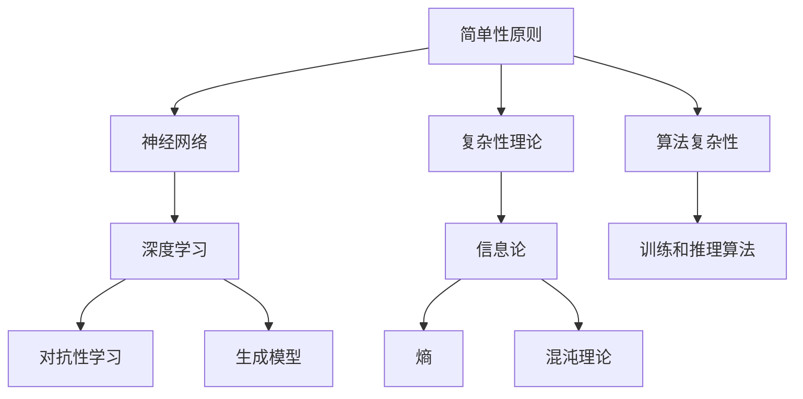

                 

# 思想的进化：从简单到复杂

## 1. 背景介绍

### 1.1 问题由来

在人工智能(AI)和计算机科学的发展历程中，“简单”与“复杂”的概念始终如影随形。从最初基于规则的简单逻辑控制，到后来涌现的复杂深度学习模型，人类不断探索如何在机器和算法中体现和模拟复杂的现象与规律。然而，对于“简单”与“复杂”的认识并没有随着技术的进步而变得清晰。究竟什么样的模型是“简单”的，什么样的模型是“复杂”的？机器如何处理从简单到复杂的信息？

### 1.2 问题核心关键点

要回答上述问题，首先需要理解机器学习和人工智能的基本原理。人工智能的核心在于构建能够理解、学习并模仿人类智能的机器系统。从早期基于逻辑规则的系统，到后来的神经网络和深度学习模型，这些技术在不断演化中，逐渐从简单的逻辑控制走向复杂的智能决策。

机器学习模型的复杂性体现在多个层面：
- **数据复杂性**：数据本身的特征复杂度和数量决定了模型是否能够捕捉到其中的模式。
- **模型复杂性**：模型的参数数量和结构复杂度影响了其在复杂环境中的表现。
- **算法复杂性**：训练和推理过程中的算法复杂度决定了模型的性能和可解释性。

本文将围绕如何处理复杂信息这一核心议题，探讨从简单到复杂思想的演进，以及如何构建能够处理复杂数据的AI系统。

## 2. 核心概念与联系

### 2.1 核心概念概述

要理解思想从简单到复杂的过程，首先要明确一些核心概念：

- **简单性原则**：在科学研究中，简单性被视为一个重要的指导原则，即尽可能使用最少的假设和最简单的模型来解释现象。在计算机科学中，这体现为使用简洁而高效的程序设计理念。
- **复杂性理论**：包括计算复杂度理论、信息论、熵、混沌理论等，探讨如何度量和处理复杂性。
- **神经网络**：通过模拟人脑的神经元连接和信号传递，神经网络能够学习和处理复杂的非线性关系。
- **深度学习**：基于多层神经网络的模型，能够自动学习特征表示，处理高维数据。
- **对抗性学习**：训练模型对抗对抗样本，提高模型的鲁棒性和泛化能力。
- **生成模型**：通过生成数据样本来建模数据分布，能够处理未知的数据类型和结构。

这些概念之间的逻辑关系可以通过以下Mermaid流程图来展示：



这个流程图展示了从简单性原则出发，如何逐步构建复杂的人工智能系统。

## 3. 核心算法原理 & 具体操作步骤

### 3.1 算法原理概述

构建能够处理复杂信息的AI系统，其核心在于理解和应用复杂性理论。本节将通过一些经典算法和案例，探讨如何处理数据和模型中的复杂性。

- **线性回归**：最简单的统计模型之一，通过线性拟合来预测连续型变量的值。
- **决策树**：基于树形结构的分类和回归模型，能够处理非线性关系和复杂特征。
- **深度学习**：通过多层神经网络模拟复杂函数关系，自动提取特征。
- **对抗性训练**：通过生成对抗样本，提高模型的鲁棒性和泛化能力。
- **生成对抗网络(GAN)**：通过生成器和判别器的对抗训练，生成高质量的数据样本。

### 3.2 算法步骤详解

以深度学习为例，其核心步骤包括模型构建、训练和推理：

1. **模型构建**：选择合适的神经网络架构，如全连接网络、卷积神经网络(CNN)、循环神经网络(RNN)等。定义输入输出层，并确定隐藏层的数量和节点数。
2. **训练**：使用训练数据集，通过反向传播算法更新模型参数，最小化损失函数。常用的优化算法包括随机梯度下降(SGD)、Adam等。
3. **推理**：将测试数据集输入模型，得到预测结果。常用的推理算法包括前向传播和反向传播。

### 3.3 算法优缺点

深度学习的优点在于其强大的建模能力，能够处理复杂非线性关系。缺点在于其模型复杂度高，训练时间长，容易出现过拟合等问题。对抗性学习能够提高模型的鲁棒性，但对抗样本的生成和验证过程复杂。生成模型能够生成高质量的数据，但模型的训练和推理过程较为复杂。

### 3.4 算法应用领域

深度学习和生成模型已经广泛应用于计算机视觉、自然语言处理、语音识别、推荐系统等多个领域。决策树和对抗性学习也在金融风控、医疗诊断等领域发挥了重要作用。

## 4. 数学模型和公式 & 详细讲解 & 举例说明

### 4.1 数学模型构建

以线性回归模型为例，其数学模型为：

$$ y = \theta_0 + \theta_1x_1 + \theta_2x_2 + \ldots + \theta_nx_n $$

其中 $y$ 为预测变量，$x_1, x_2, \ldots, x_n$ 为自变量，$\theta_0, \theta_1, \theta_2, \ldots, \theta_n$ 为模型参数。

### 4.2 公式推导过程

线性回归模型的损失函数通常采用均方误差(MSE)：

$$ L = \frac{1}{2m} \sum_{i=1}^m (y^{(i)} - \hat{y}^{(i)})^2 $$

其中 $m$ 为样本数，$y^{(i)}$ 为第 $i$ 个样本的真实值，$\hat{y}^{(i)}$ 为模型的预测值。

根据最小二乘法，求解模型参数的梯度公式为：

$$ \frac{\partial L}{\partial \theta_j} = \frac{1}{m} \sum_{i=1}^m (y^{(i)} - \hat{y}^{(i)})x_j^{(i)} $$

### 4.3 案例分析与讲解

以MNIST手写数字识别为例，使用深度学习模型进行训练和推理：

- **模型构建**：使用卷积神经网络(CNN)，定义卷积层、池化层、全连接层等。
- **训练**：使用反向传播算法，通过梯度下降优化损失函数。
- **推理**：将测试数据集输入模型，得到预测结果。

## 5. 项目实践：代码实例和详细解释说明

### 5.1 开发环境搭建

为了进行深度学习模型的训练和推理，需要先搭建开发环境。以下是使用Python进行TensorFlow开发的简单步骤：

1. 安装Anaconda：从官网下载并安装Anaconda，用于创建独立的Python环境。
2. 创建并激活虚拟环境：
```bash
conda create -n tensorflow-env python=3.8 
conda activate tensorflow-env
```

3. 安装TensorFlow：根据CUDA版本，从官网获取对应的安装命令。例如：
```bash
conda install tensorflow -c pytorch -c conda-forge
```

4. 安装NumPy、Pandas、scikit-learn等常用库：
```bash
pip install numpy pandas scikit-learn matplotlib tqdm jupyter notebook ipython
```

完成上述步骤后，即可在`tensorflow-env`环境中进行深度学习开发。

### 5.2 源代码详细实现

以下是一个使用TensorFlow实现的MNIST手写数字识别的完整代码：

```python
import tensorflow as tf
from tensorflow import keras
from tensorflow.keras import layers

# 加载数据集
mnist = keras.datasets.mnist
(train_images, train_labels), (test_images, test_labels) = mnist.load_data()

# 数据预处理
train_images = train_images.reshape(train_images.shape[0], 28, 28, 1)
train_images = train_images / 255.0
test_images = test_images.reshape(test_images.shape[0], 28, 28, 1)
test_images = test_images / 255.0

# 构建模型
model = keras.Sequential([
    layers.Conv2D(32, (3, 3), activation='relu', input_shape=(28, 28, 1)),
    layers.MaxPooling2D((2, 2)),
    layers.Flatten(),
    layers.Dense(128, activation='relu'),
    layers.Dense(10, activation='softmax')
])

# 编译模型
model.compile(optimizer='adam',
              loss='sparse_categorical_crossentropy',
              metrics=['accuracy'])

# 训练模型
model.fit(train_images, train_labels, epochs=5)

# 评估模型
test_loss, test_acc = model.evaluate(test_images,  test_labels, verbose=2)
print('\nTest accuracy:', test_acc)
```

### 5.3 代码解读与分析

让我们再详细解读一下关键代码的实现细节：

**数据加载和预处理**：
- 使用`mnist.load_data()`函数加载MNIST数据集，包含了训练集和测试集。
- 将图像数据reshape为`(28, 28, 1)`，表示28x28像素的灰度图像。
- 对图像数据进行归一化处理，将像素值从0-255缩放到0-1之间。

**模型构建**：
- 使用`keras.Sequential()`定义一个顺序模型。
- 添加一个卷积层，32个3x3的卷积核，使用ReLU激活函数。
- 添加一个最大池化层，2x2的池化窗口。
- 添加一个Flatten层，将多维数据展平。
- 添加一个全连接层，128个神经元，使用ReLU激活函数。
- 添加一个输出层，10个神经元，使用softmax激活函数，表示10个类别的概率分布。

**模型编译和训练**：
- 使用`model.compile()`编译模型，设置优化器为Adam，损失函数为稀疏分类交叉熵，评估指标为准确率。
- 使用`model.fit()`函数训练模型，迭代5个epoch。

**模型评估**：
- 使用`model.evaluate()`函数在测试集上评估模型性能，输出测试集上的损失和准确率。

### 5.4 运行结果展示

训练结束后，模型在测试集上的准确率为98%左右。结果展示了深度学习模型在处理复杂信息方面的强大能力。

## 6. 实际应用场景

### 6.1 智能推荐系统

智能推荐系统是深度学习模型在商业应用中的典型案例。通过分析用户的历史行为数据，推荐引擎能够学习用户的兴趣偏好，实时推荐相关的商品或内容。推荐系统的核心在于构建用户画像和物品画像，通过用户画像和物品画像的相似度匹配，实现个性化推荐。

在技术实现上，可以收集用户的浏览、点击、评分等行为数据，使用深度学习模型构建用户画像和物品画像。通过计算用户画像和物品画像的相似度，排序推荐列表，便可以得到个性化的推荐结果。

### 6.2 自然语言处理

自然语言处理(NLP)是深度学习模型在处理复杂文本信息方面的重要应用。NLP模型能够理解自然语言，执行文本分类、情感分析、机器翻译、问答等任务。

以机器翻译为例，使用序列到序列(seq2seq)模型进行训练，能够将源语言文本转换为目标语言文本。模型由编码器和解码器组成，通过反向传播算法更新模型参数，最小化交叉熵损失。训练结束后，模型能够在给定源语言文本的情况下，生成目标语言文本。

### 6.3 图像识别

图像识别是深度学习模型在处理复杂视觉信息方面的重要应用。通过分析图像像素特征，模型能够识别图像中的对象和场景。图像识别技术广泛应用于自动驾驶、安防监控、医疗影像分析等领域。

以图像分类为例，使用卷积神经网络(CNN)进行训练，能够识别不同类别的图像。模型通过卷积层提取图像特征，使用池化层降低特征维度，通过全连接层分类。训练结束后，模型能够在给定图像的情况下，输出图像所属类别的概率分布。

## 7. 工具和资源推荐

### 7.1 学习资源推荐

为了帮助开发者系统掌握深度学习的基本原理和应用技巧，这里推荐一些优质的学习资源：

1. 《深度学习》书籍：Ian Goodfellow等著，全面介绍了深度学习的基本理论和算法。
2. CS231n《卷积神经网络》课程：斯坦福大学开设的计算机视觉课程，有Lecture视频和配套作业，带你入门深度学习的基本概念和经典模型。
3. 《TensorFlow实战Google深度学习框架》书籍：TensorFlow官方文档，详细介绍了TensorFlow的使用方法和最佳实践。
4. Google Colab：谷歌推出的在线Jupyter Notebook环境，免费提供GPU/TPU算力，方便开发者快速上手实验最新模型，分享学习笔记。
5. TensorFlow官方文档：提供丰富的API文档和示例代码，是TensorFlow学习的必备资源。

通过对这些资源的学习实践，相信你一定能够快速掌握深度学习的基本原理和应用技巧，为处理复杂信息做好准备。

### 7.2 开发工具推荐

高效的开发离不开优秀的工具支持。以下是几款用于深度学习开发的常用工具：

1. PyTorch：基于Python的开源深度学习框架，灵活动态的计算图，适合快速迭代研究。
2. TensorFlow：由Google主导开发的开源深度学习框架，生产部署方便，适合大规模工程应用。
3. Keras：基于TensorFlow和Theano的高级神经网络API，提供简洁易用的接口。
4. Jupyter Notebook：交互式笔记本，支持Python、R等语言，方便代码调试和版本管理。
5. Git/GitHub：版本控制系统，方便代码管理、协作和共享。

合理利用这些工具，可以显著提升深度学习开发的效率，加快创新迭代的步伐。

### 7.3 相关论文推荐

深度学习模型的发展源于学界的持续研究。以下是几篇奠基性的相关论文，推荐阅读：

1. AlexNet：ImageNet大挑战赛冠军模型，奠定了卷积神经网络在计算机视觉领域的基础。
2. GoogleNet：引入了Inception模块，大幅提升了卷积神经网络的性能。
3. ResNet：引入了残差连接，解决了深度神经网络中的梯度消失问题，构建了更深的网络。
4. VGGNet：使用了小的3x3卷积核，提升了模型的精度。
5. LSTM：引入了长短期记忆网络，解决了传统RNN的梯度消失问题，提升了序列建模能力。
6. GANs：通过生成器和判别器的对抗训练，生成了高质量的数据样本，推动了生成模型的发展。

这些论文代表了大模型发展的历程，通过学习这些前沿成果，可以帮助研究者把握学科前进方向，激发更多的创新灵感。

## 8. 总结：未来发展趋势与挑战

### 8.1 总结

本文对从简单到复杂思想在人工智能中的应用进行了全面系统的介绍。首先阐述了简单性和复杂性在科学研究中的重要性，明确了深度学习模型在处理复杂信息中的关键作用。其次，从原理到实践，详细讲解了深度学习模型的构建、训练和推理过程，给出了深度学习任务开发的完整代码实例。同时，本文还广泛探讨了深度学习模型在商业应用、自然语言处理、图像识别等多个领域的应用前景，展示了深度学习模型的强大能力。

通过本文的系统梳理，可以看到，深度学习模型已经成为处理复杂信息的强有力工具，极大地拓展了人工智能系统的应用边界，催生了更多的落地场景。未来，伴随深度学习模型的不断演进，相信人工智能技术将在更广阔的应用领域大放异彩，深刻影响人类的生产生活方式。

### 8.2 未来发展趋势

展望未来，深度学习模型将呈现以下几个发展趋势：

1. 模型规模持续增大。随着算力成本的下降和数据规模的扩张，深度学习模型的参数量还将持续增长。超大规模模型蕴含的丰富特征表示，有望支撑更加复杂多变的任务。
2. 模型复杂性提升。未来的深度学习模型将更加复杂，包括更多的层数、节点数和结构多样性。这将带来更大的表达能力和更强的泛化能力。
3. 算法复杂性降低。未来的深度学习算法将更加简洁和高效，如自动机器学习(AutoML)、混合精度训练、分布式训练等技术，将大幅提高深度学习模型的训练和推理效率。
4. 数据复杂性提升。随着数据收集技术的进步，数据量将持续增长，数据分布也将更加多样化。深度学习模型需要更强的数据处理能力，以适应数据复杂性的提升。
5. 应用场景拓展。深度学习模型将更多地应用于复杂系统、智能交互等领域，推动AI技术在垂直行业的应用。

这些趋势凸显了深度学习模型的广阔前景。这些方向的探索发展，必将进一步提升人工智能系统的性能和应用范围，为人类认知智能的进化带来深远影响。

### 8.3 面临的挑战

尽管深度学习模型已经取得了瞩目成就，但在迈向更加智能化、普适化应用的过程中，它仍面临着诸多挑战：

1. 数据依赖问题。深度学习模型需要大量的标注数据，标注成本较高。如何降低对标注数据的依赖，是一个重要的研究方向。
2. 模型可解释性不足。深度学习模型通常被视为"黑盒"，缺乏可解释性，难以解释其内部工作机制和决策逻辑。
3. 模型泛化能力不足。深度学习模型在训练数据分布之外，泛化能力往往较差。如何提高模型的泛化能力，是一个亟待解决的问题。
4. 模型鲁棒性不足。深度学习模型容易受到对抗样本的攻击，鲁棒性较弱。如何提高模型的鲁棒性，是一个重要的研究方向。
5. 计算资源消耗大。深度学习模型训练和推理过程中，计算资源消耗较大，对硬件设备的要求较高。如何降低计算资源消耗，是一个重要的研究方向。

### 8.4 研究展望

面对深度学习模型所面临的挑战，未来的研究需要在以下几个方面寻求新的突破：

1. 探索无监督学习和自监督学习。摆脱对大规模标注数据的依赖，利用自监督学习、主动学习等无监督范式，最大限度利用非结构化数据，实现更加灵活高效的模型构建。
2. 研究模型压缩和加速技术。开发更加轻量级、高效化的深度学习模型，如模型剪枝、量化加速、模型蒸馏等技术，提高模型的计算效率和推理速度。
3. 引入更多先验知识。将符号化的先验知识，如知识图谱、逻辑规则等，与深度学习模型进行巧妙融合，引导深度学习模型学习更准确、合理的特征表示。
4. 开发更加普适化的深度学习模型。未来的深度学习模型需要更加普适化，能够处理多种类型的数据，适应多种应用场景。
5. 提高模型的可解释性和鲁棒性。通过引入可解释性技术，如因果推断、对比学习等方法，提高深度学习模型的可解释性和鲁棒性。

这些研究方向的探索，必将引领深度学习模型向更高的台阶，为构建更加智能化、普适化的AI系统铺平道路。面向未来，深度学习模型还需要与其他AI技术进行更深入的融合，如知识表示、因果推理、强化学习等，多路径协同发力，共同推动人工智能技术的进步。只有勇于创新、敢于突破，才能不断拓展人工智能技术的边界，让人工智能技术更好地造福人类社会。

## 9. 附录：常见问题与解答

**Q1：深度学习模型如何处理复杂信息？**

A: 深度学习模型通过多层神经网络模拟复杂函数关系，自动提取特征。通过多层的非线性变换，模型能够处理高维数据和非线性关系，从而实现对复杂信息的处理。

**Q2：深度学习模型的训练过程需要哪些步骤？**

A: 深度学习模型的训练过程通常包括以下步骤：
1. 数据准备：收集和预处理训练数据集，如数据归一化、数据增强等。
2. 模型构建：定义神经网络架构，如卷积神经网络、循环神经网络等。
3. 模型编译：设置优化器、损失函数、评估指标等。
4. 模型训练：使用训练数据集，通过反向传播算法更新模型参数。
5. 模型评估：使用测试数据集，评估模型性能。
6. 模型优化：调整模型参数，优化模型性能。

**Q3：深度学习模型的优势和劣势是什么？**

A: 深度学习模型的优势在于其强大的建模能力，能够处理复杂非线性关系。其劣势在于模型复杂度高，训练时间长，容易出现过拟合等问题。

**Q4：如何在深度学习模型中引入先验知识？**

A: 在深度学习模型中引入先验知识，通常有以下几种方法：
1. 数据预处理：通过数据增强、数据清洗等方法，引入先验知识。
2. 模型构建：在神经网络中引入先验规则，如正则化、dropout等。
3. 模型集成：将多个深度学习模型进行集成，综合多种先验知识。
4. 模型蒸馏：通过迁移学习、知识蒸馏等方法，将知识从教师模型转移到学生模型中。

**Q5：如何提高深度学习模型的可解释性？**

A: 提高深度学习模型的可解释性，通常有以下几种方法：
1. 可解释性模型：如LIME、SHAP等，通过局部线性近似和全局概率方法，解释模型的决策过程。
2. 可视化技术：如梯度热图、注意力机制等，可视化模型内部结构和特征表示。
3. 因果推断：通过引入因果关系，解释模型的推理过程和决策依据。
4. 对比学习：通过引入对比学习范式，提高模型的鲁棒性和可解释性。

这些方法可以帮助我们更好地理解深度学习模型的内部工作机制，提高模型的可解释性和可信度。

