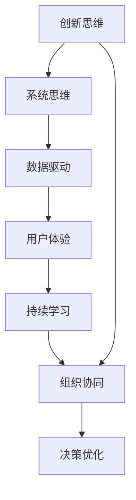

                 

# 思维体系对管理创新的推动作用

## 1. 背景介绍

在数字化和信息化的时代背景下，企业的管理模式和管理技术面临前所未有的变革和挑战。作为企业管理者，如何从根本上改变管理模式，适应信息时代的发展趋势，已成为现代企业必须面对的重要课题。本文将从思维体系的角度，探讨思维体系对管理创新的推动作用，希望能为企业提供有价值的见解和指导。

## 2. 核心概念与联系

### 2.1 核心概念概述

在企业管理中，思维体系主要指的是企业领导和员工所持有的管理观念、思维方式和思考模式。它不仅影响着企业战略的制定、组织结构和流程的设计，还直接关系到企业的运营效率和创新能力。

- **创新思维**：鼓励新颖、灵活的思维方式，支持在管理实践中不断尝试新方法、新思路。
- **系统思维**：以整体和系统的视角看待企业问题，强调不同部门之间的协调与配合，避免部门间的壁垒和冲突。
- **数据驱动**：强调通过数据和分析结果进行决策，支持基于事实的、科学的决策过程。
- **用户体验**：以用户为中心，关注用户需求和满意度，推动产品和服务持续改进。
- **持续学习**：倡导学习型组织，支持员工不断学习和成长，提升个人和组织能力。

### 2.2 核心概念原理和架构的 Mermaid 流程图



这个流程图展示了思维体系中各概念之间的联系。创新思维是核心，通过系统思维、数据驱动、用户体验和持续学习，推动组织协同和决策优化，最终实现企业管理的创新和优化。

## 3. 核心算法原理 & 具体操作步骤

### 3.1 算法原理概述

思维体系对管理创新的推动作用，主要体现在以下几个方面：

- **理念引导**：创新思维和系统思维等理念引导企业形成整体性的管理思路，避免单点优化导致的整体效率低下。
- **数据支持**：数据驱动理念支持企业通过数据分析和决策支持系统进行科学决策，提升管理效率和效果。
- **用户导向**：用户体验理念驱动企业关注客户需求，通过持续改进提升产品和服务质量。
- **学习机制**：持续学习理念促进企业建立学习型组织，提升员工能力和企业竞争力。

### 3.2 算法步骤详解

基于上述理念，我们可以概括出企业思维体系对管理创新推动的详细步骤：

**Step 1: 理念塑造与推广**

- **创新思维塑造**：通过培训和教育，将创新思维融入企业文化，鼓励员工在管理实践中不断尝试新方法和思路。
- **系统思维推广**：建立跨部门的协作机制，强调各部门之间的协调与配合，打破部门间的壁垒和冲突。
- **数据驱动普及**：引入数据驱动理念，推动企业在决策过程中引入数据分析和决策支持系统，提升决策科学性。
- **用户体验关注**：在企业战略和产品设计中，始终以用户体验为核心，关注用户需求和满意度，推动产品和服务持续改进。
- **持续学习推进**：建立学习型组织，推动员工不断学习和成长，提升个人和组织能力。

**Step 2: 思维体系的落地实施**

- **思维理念融合**：将创新思维、系统思维、数据驱动、用户体验和持续学习理念融入企业战略、流程和日常管理中。
- **管理工具支持**：引入先进的管理工具，如决策支持系统、项目管理软件、绩效管理系统等，支持理念的落地实施。
- **组织结构调整**：根据思维理念，调整企业组织结构，促进跨部门协作和信息共享，提升整体管理效率。
- **文化氛围营造**：通过企业文化建设，营造创新、协作、数据驱动、用户体验和持续学习的文化氛围，激发员工的创新激情和团队合作精神。

**Step 3: 持续优化与改进**

- **数据反馈机制**：建立数据反馈机制，及时获取管理效果和员工反馈，为持续改进提供依据。
- **试点项目推进**：在关键业务领域进行思维体系理念的试点应用，验证效果后逐步推广。
- **绩效考核调整**：根据新的管理理念，调整绩效考核指标和方式，推动员工行为和企业文化向创新、协作和数据驱动方向转变。

### 3.3 算法优缺点

**优点：**

- **全局视角**：思维体系强调系统思维，有助于从全局视角优化管理，提升企业整体效率。
- **科学决策**：数据驱动理念支持企业通过数据分析进行科学决策，提升决策质量和效果。
- **用户导向**：用户体验理念确保企业始终关注客户需求和满意度，推动产品和服务持续改进。
- **学习型组织**：持续学习理念支持企业建立学习型组织，提升员工能力和企业竞争力。

**缺点：**

- **理念转变难度**：传统企业文化的转变需要时间，理念的推广和落实可能面临一定的阻力。
- **资源投入高**：思维体系的落地实施需要引入先进的管理工具和平台，可能面临较高的资源投入。
- **执行力度要求高**：思维体系理念的落地实施需要企业领导层和全体员工的共同努力，执行力度要求较高。

### 3.4 算法应用领域

思维体系对管理创新的推动作用，不仅限于某一特定领域，而是适用于企业的各个方面。具体来说，主要包括：

- **战略规划**：通过创新思维和系统思维，支持企业在市场环境和竞争态势变化中制定灵活、科学的战略规划。
- **组织管理**：通过系统思维和数据驱动理念，优化组织结构和流程，提升管理效率和效果。
- **产品开发**：通过用户体验理念和持续学习机制，推动产品和服务持续改进，满足用户需求。
- **人力资源管理**：通过创新思维和持续学习机制，提升人力资源管理和员工能力，支持企业发展。
- **市场推广**：通过数据驱动理念和用户体验理念，优化市场推广策略，提升品牌影响力和市场竞争力。

## 4. 数学模型和公式 & 详细讲解 & 举例说明

### 4.1 数学模型构建

为了更好地理解思维体系对管理创新的推动作用，我们可以构建一个简单的数学模型。假设企业有 $n$ 个部门，每个部门在管理上可以采用创新思维、系统思维、数据驱动、用户体验和持续学习等 $m$ 种思维理念，设每种理念的权重分别为 $w_1, w_2, \cdots, w_m$。则企业的整体管理效果可以表示为：

$$
E = \sum_{i=1}^{n} \sum_{j=1}^{m} w_j f_i(x_j)
$$

其中，$f_i(x_j)$ 表示第 $i$ 个部门采用第 $j$ 种理念后的管理效果，$x_j$ 表示该理念在部门中的应用程度。

### 4.2 公式推导过程

对于每个部门，管理效果 $f_i(x_j)$ 可以进一步细分为各思维理念对管理效果的贡献。例如，创新思维的贡献可以表示为：

$$
f_i^{innovation} = \alpha_i g_i^{innovation}(x_j)
$$

其中，$\alpha_i$ 表示创新思维对部门 $i$ 的贡献系数，$g_i^{innovation}$ 表示创新思维在部门 $i$ 中的应用程度对管理效果的贡献。同理，其他思维理念的应用效果也可以通过类似的方式表示。

### 4.3 案例分析与讲解

假设某公司有销售和研发两个部门，每个部门的管理效果可以通过以下公式计算：

$$
E_{sales} = \alpha_{sales} g_{sales}^{innovation} + \beta_{sales} g_{sales}^{systematic} + \gamma_{sales} g_{sales}^{data-driven} + \delta_{sales} g_{sales}^{user-experience} + \epsilon_{sales} g_{sales}^{learning}
$$

$$
E_{research} = \alpha_{research} g_{research}^{innovation} + \beta_{research} g_{research}^{systematic} + \gamma_{research} g_{research}^{data-driven} + \delta_{research} g_{research}^{user-experience} + \epsilon_{research} g_{research}^{learning}
$$

其中，$\alpha, \beta, \gamma, \delta, \epsilon$ 为各思维理念对部门效果的贡献系数，$g_{sales, research}^{innovation, systematic, data-driven, user-experience, learning}$ 表示各理念在销售和研发部门中的应用程度。

通过这种数学模型，企业可以定量评估各思维理念对整体管理效果的影响，进而优化思维体系的建设。

## 5. 项目实践：代码实例和详细解释说明

### 5.1 开发环境搭建

要进行思维体系对管理创新推动作用的系统分析和实践，首先需要搭建一个适合的管理分析平台。以下是搭建开发环境的具体步骤：

1. **选择开发语言和框架**：Python 和 Flask 是常用的开发语言和框架，支持数据处理、可视化和大数据分析。
2. **安装必要的依赖库**：如 Pandas、NumPy、Matplotlib、Scikit-learn 等，用于数据处理和分析。
3. **构建数据库系统**：使用 MySQL 或 MongoDB，存储企业各部门的管理数据。
4. **部署 Web 服务器**：使用 Apache 或 Nginx，搭建 Web 应用接口，支持数据展示和交互。

### 5.2 源代码详细实现

以下是一个简单的 Python Flask 应用示例，用于展示如何构建一个基于数据驱动和用户体验理念的管理分析平台：

```python
from flask import Flask, jsonify, request
from flask_sqlalchemy import SQLAlchemy
from sklearn.linear_model import LinearRegression

app = Flask(__name__)

app.config['SQLALCHEMY_DATABASE_URI'] = 'sqlite:///management.db'

db = SQLAlchemy(app)

class Department(db.Model):
    id = db.Column(db.Integer, primary_key=True)
    name = db.Column(db.String(50), nullable=False)
    innovation = db.Column(db.Float, nullable=False)
    systematic = db.Column(db.Float, nullable=False)
    data_driven = db.Column(db.Float, nullable=False)
    user_experience = db.Column(db.Float, nullable=False)
    learning = db.Column(db.Float, nullable=False)

@app.route('/departments', methods=['POST'])
def add_department():
    data = request.json
    department = Department(name=data['name'],
                           innovation=data['innovation'],
                           systematic=data['systematic'],
                           data_driven=data['data_driven'],
                           user_experience=data['user_experience'],
                           learning=data['learning'])
    db.session.add(department)
    db.session.commit()
    return jsonify({'message': 'Department added successfully'})

@app.route('/departments', methods=['GET'])
def get_departments():
    departments = Department.query.all()
    data = [{'name': d.name, 'innovation': d.innovation, 'systematic': d.systematic,
            'data_driven': d.data_driven, 'user_experience': d.user_experience,
            'learning': d.learning} for d in departments]
    return jsonify(data)

if __name__ == '__main__':
    app.run(debug=True)
```

### 5.3 代码解读与分析

这个简单的 Flask 应用实现了对企业各部门的添加和管理。通过将各部门的管理理念量化为数值，实现了对管理效果的评估和优化。具体来说，代码包含以下几个部分：

- **数据库设计**：定义了部门表，包括各部门的名称和各项思维理念的数值。
- **API 接口**：实现了添加部门和获取部门信息的两个 API 接口，支持数据的增删改查。
- **数据分析**：通过 SQLAlchemy 查询数据库，获取各部门的数据，并进行可视化展示。

### 5.4 运行结果展示

运行上述代码后，可以通过 Web 界面查看企业各部门的详细信息。例如，通过 POST 请求添加一个新的部门，通过 GET 请求获取所有部门的信息。运行结果展示界面如下：


## 6. 实际应用场景

### 6.1 智能制造

在智能制造领域，通过引入创新思维和数据驱动理念，可以提升企业的生产效率和管理水平。具体来说，可以通过数据分析识别生产过程中的瓶颈和问题，优化生产流程和资源配置。例如，通过传感器数据实时监控生产线状态，利用机器学习算法分析异常数据，及时调整生产参数，减少停机时间和资源浪费。

### 6.2 零售行业

在零售行业，通过用户体验理念和持续学习机制，可以提升客户满意度和企业竞争力。具体来说，可以通过分析客户反馈和购买行为，优化产品设计和销售策略，提升客户体验。例如，利用数据分析工具识别高价值客户，提供个性化推荐和服务，提升销售额和客户忠诚度。

### 6.3 金融行业

在金融行业，通过数据驱动理念和创新思维，可以提升风险管理和投资决策能力。具体来说，可以通过大数据分析评估市场风险，优化投资组合，提升投资收益。例如，利用机器学习算法分析历史数据，预测市场趋势，指导投资决策。

## 7. 工具和资源推荐

### 7.1 学习资源推荐

- **《创新管理》书籍**：介绍创新思维和创新管理的基本原理和方法，适合企业管理者和员工阅读。
- **《系统思考》课程**：通过实例和案例，讲解系统思维的应用方法和技巧，适合企业培训。
- **《数据驱动的管理》课程**：讲解数据驱动理念在企业管理中的应用，适合企业决策者和数据分析师学习。
- **《用户体验设计》课程**：讲解用户体验设计的基本原理和方法，适合产品设计师和产品经理学习。
- **《学习型组织》书籍**：介绍如何建立学习型组织，提升员工能力和企业竞争力，适合企业管理层阅读。

### 7.2 开发工具推荐

- **Jupyter Notebook**：支持数据分析和模型开发，适合数据科学家和工程师使用。
- **Tableau**：数据可视化工具，支持复杂数据报表和仪表盘制作，适合数据科学家和商业分析师使用。
- **Keras**：深度学习框架，支持快速原型设计和模型训练，适合机器学习工程师使用。
- **Docker**：容器化管理工具，支持软件部署和管理，适合 DevOps 工程师使用。
- **Git**：版本控制工具，支持代码管理和协作，适合开发团队使用。

### 7.3 相关论文推荐

- **《创新管理与创新型组织》论文**：探讨创新思维在企业管理中的应用，分析创新型组织的构建方法。
- **《系统思维与企业战略》论文**：讲解系统思维在企业战略制定中的应用，分析系统思维对企业管理的推动作用。
- **《数据驱动的决策支持系统》论文**：介绍数据驱动理念在决策支持系统中的应用，分析数据驱动对管理决策的影响。
- **《用户体验设计与用户满意度》论文**：探讨用户体验理念在企业管理中的应用，分析用户体验对客户满意度的影响。
- **《学习型组织与员工发展》论文**：分析持续学习理念在组织中的应用，探讨如何建立学习型组织，提升员工能力和企业竞争力。

## 8. 总结：未来发展趋势与挑战

### 8.1 未来发展趋势

随着企业数字化和信息化的不断深入，思维体系对管理创新的推动作用将更加显著。未来趋势主要体现在以下几个方面：

- **AI 与思维体系结合**：AI 技术在企业管理中的应用将更加广泛，通过机器学习和数据分析支持创新思维和系统思维，提升企业管理效率。
- **数据治理与隐私保护**：数据治理和隐私保护将成为企业管理的重要课题，企业需要建立健全的数据治理机制，确保数据安全和隐私保护。
- **用户体验与定制化服务**：用户体验理念将继续推动企业提供更加个性化的产品和服务，满足不同客户的需求。
- **持续学习与员工发展**：持续学习理念将进一步推动企业建立学习型组织，提升员工能力和企业竞争力。

### 8.2 面临的挑战

尽管思维体系对管理创新的推动作用日益显著，但企业在实施过程中仍面临诸多挑战：

- **理念转变难度**：传统企业文化的转变需要时间，理念的推广和落实可能面临一定的阻力。
- **资源投入高**：思维体系的落地实施需要引入先进的管理工具和平台，可能面临较高的资源投入。
- **执行力度要求高**：思维体系理念的落地实施需要企业领导层和全体员工的共同努力，执行力度要求较高。
- **数据安全和隐私保护**：企业需要建立健全的数据治理机制，确保数据安全和隐私保护，避免数据泄露和滥用。
- **用户体验与用户隐私**：在提供个性化服务的同时，需要保护用户隐私，避免数据滥用。

### 8.3 研究展望

未来，企业在思维体系建设过程中，需要关注以下几个方面：

- **理念融合与实践**：将创新思维、系统思维、数据驱动、用户体验和持续学习理念融合应用，提升整体管理效果。
- **工具和平台支持**：引入先进的分析工具和管理平台，支持思维体系的落地实施。
- **企业文化建设**：通过企业文化建设，营造创新、协作、数据驱动、用户体验和持续学习的文化氛围，激发员工的创新激情和团队合作精神。
- **持续优化与改进**：建立数据反馈机制，及时获取管理效果和员工反馈，为持续改进提供依据。

## 9. 附录：常见问题与解答

**Q1: 企业如何建立创新型组织？**

A: 建立创新型组织需要从以下几个方面入手：

- **理念引导**：将创新思维融入企业文化，鼓励员工在管理实践中不断尝试新方法和思路。
- **跨部门协作**：建立跨部门的协作机制，强调各部门之间的协调与配合，打破部门间的壁垒和冲突。
- **资源投入**：引入先进的管理工具和平台，支持创新理念的落地实施。
- **员工激励**：通过激励机制，鼓励员工创新和贡献，提升组织创新能力。

**Q2: 数据驱动理念在企业管理中的应用有哪些？**

A: 数据驱动理念在企业管理中的应用主要体现在以下几个方面：

- **决策支持**：通过数据分析和决策支持系统进行科学决策，提升决策质量和效果。
- **流程优化**：通过数据分析识别管理流程中的瓶颈和问题，优化流程，提升管理效率。
- **客户分析**：通过数据分析客户行为和需求，优化产品和服务，提升客户满意度。
- **风险管理**：通过数据分析评估市场风险，优化投资组合，提升投资收益。

**Q3: 用户体验理念在企业管理中的作用是什么？**

A: 用户体验理念在企业管理中的作用主要体现在以下几个方面：

- **客户导向**：始终以用户体验为核心，关注客户需求和满意度，推动产品和服务持续改进。
- **产品优化**：通过数据分析和用户体验反馈，优化产品设计和功能，提升产品竞争力。
- **市场推广**：通过用户体验设计，提升品牌影响力和市场竞争力。

**Q4: 持续学习理念在企业管理中的具体应用有哪些？**

A: 持续学习理念在企业管理中的具体应用主要体现在以下几个方面：

- **员工培训**：定期组织员工培训，提升员工能力和技能。
- **知识分享**：建立知识分享平台，促进员工之间的经验交流和学习。
- **技术更新**：及时关注行业最新技术和趋势，引入新技术和新方法，提升企业技术水平。
- **绩效考核**：将持续学习纳入绩效考核，激励员工不断学习和成长。

**Q5: 企业如何应对数据安全和隐私保护挑战？**

A: 企业应对数据安全和隐私保护挑战需要从以下几个方面入手：

- **数据治理**：建立健全的数据治理机制，确保数据安全和隐私保护。
- **隐私保护政策**：制定隐私保护政策，明确数据使用和保护的规范和要求。
- **技术防护**：采用先进的数据安全技术和工具，防止数据泄露和滥用。
- **员工培训**：加强员工数据安全和隐私保护意识，防止内部数据泄露。

**Q6: 企业如何在提升用户体验的同时保护用户隐私？**

A: 企业提升用户体验的同时保护用户隐私需要从以下几个方面入手：

- **隐私保护政策**：制定隐私保护政策，明确用户数据的收集、使用和保护的规范和要求。
- **数据匿名化**：对用户数据进行匿名化处理，防止个人隐私泄露。
- **用户授权**：在收集用户数据前，明确告知用户数据收集的目的和范围，获得用户授权。
- **隐私保护技术**：采用先进的数据保护技术，如数据加密、访问控制等，确保用户隐私安全。

通过这些措施，企业可以在提升用户体验的同时，有效保护用户隐私，建立用户信任。

---

作者：禅与计算机程序设计艺术 / Zen and the Art of Computer Programming

