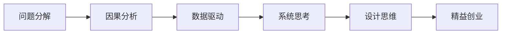

                 

## 1. 背景介绍

在现代社会，管理已经变得越来越复杂，尤其是在大型组织和企业中，管理者和决策者需要处理大量的信息，进行多维度的数据分析，做出有效的决策。这使得传统的管理工具和方法逐渐显示出其局限性，无法满足日益复杂的管理需求。思维工具（Mind Tools）作为一种新兴的管理工具，通过将复杂问题分解为可管理的模块，提供了一套系统的、可操作的思考框架，为现代管理提供了全新的解决方案。

### 1.1 问题由来

随着企业规模的扩大，传统的管理模式已经无法适应现代企业的发展需求。传统管理方法主要依赖经验，缺乏系统性思考，导致信息过载、决策不透明、团队协作效率低等问题。思维工具正是在这样的背景下提出的，它通过一套系统化的思考框架，帮助管理者更科学、更高效地进行决策和团队协作。

### 1.2 问题核心关键点

思维工具的核心在于其提供了一套系统的思考框架，帮助管理者将复杂问题分解为可管理的模块，并提供具体的操作方法。这使得管理者能够更加系统、全面地思考问题，提升决策的科学性和有效性。同时，思维工具还能够帮助团队成员之间更好地协作，提高团队整体的效率。

## 2. 核心概念与联系

### 2.1 核心概念概述

思维工具涉及多个核心概念，包括但不限于：

- **问题分解（Problem Decomposition）**：将复杂问题分解为可管理的子问题。
- **因果分析（Causal Analysis）**：通过分析问题背后的因果关系，寻找根本原因。
- **数据驱动（Data-Driven）**：基于数据进行决策，避免依赖经验和直觉。
- **系统思考（Systems Thinking）**：从整体角度思考问题，避免局部视角导致的错误决策。
- **设计思维（Design Thinking）**：以用户为中心，通过迭代设计改进产品或服务。
- **精益创业（Lean Startup）**：快速迭代，验证假设，实现最小可行产品（MVP）。

这些概念之间有着密切的联系，构成了一个系统的思考框架，帮助管理者更加科学、全面地思考和解决问题。

### 2.2 核心概念原理和架构的 Mermaid 流程图(Mermaid 流程节点中不要有括号、逗号等特殊字符)



这个流程图展示了思维工具各个核心概念之间的联系。从问题分解出发，通过因果分析找到问题根源，基于数据驱动进行决策，系统思考确保全局视角，设计思维以用户为中心，精益创业快速迭代验证假设，整个过程形成了一个完整的思考框架。

## 3. 核心算法原理 & 具体操作步骤

### 3.1 算法原理概述

思维工具的算法原理基于系统化思考和数据分析，通过将问题分解为可管理的模块，逐步分析问题的各个方面，最终找到问题的根源并制定解决方案。其核心在于分解问题，并基于数据和系统思考进行决策。

### 3.2 算法步骤详解

#### 3.2.1 问题分解

1. **明确问题**：首先明确问题的定义和范围，确保问题清晰明确。
2. **分解问题**：将问题分解为可管理的子问题，每个子问题应具备独立性和可操作性。

#### 3.2.2 因果分析

1. **收集数据**：收集与问题相关的数据，包括历史数据、相关事件、用户反馈等。
2. **分析因果关系**：通过数据分析工具（如统计分析、回归分析等），寻找问题背后的因果关系。
3. **确定根本原因**：基于因果分析结果，确定问题的根本原因。

#### 3.2.3 数据驱动

1. **数据收集**：收集与问题相关的数据，确保数据质量和完整性。
2. **数据分析**：使用数据分析工具（如数据挖掘、机器学习等），对数据进行分析和建模。
3. **基于数据决策**：根据数据分析结果，制定决策方案。

#### 3.2.4 系统思考

1. **整体视角**：从整体角度思考问题，避免局部视角导致的错误决策。
2. **识别系统性问题**：识别系统中的各个组成部分及其相互关系，寻找系统性问题。
3. **设计系统解决方案**：基于系统思考，设计系统性的解决方案。

#### 3.2.5 设计思维

1. **用户研究**：进行用户研究，了解用户需求和痛点。
2. **迭代设计**：通过迭代设计，不断改进产品或服务。
3. **用户测试**：进行用户测试，验证设计方案的有效性。

#### 3.2.6 精益创业

1. **快速迭代**：快速迭代产品或服务，验证假设。
2. **最小可行产品（MVP）**：开发最小可行产品，验证市场反应。
3. **数据反馈**：收集数据反馈，进行迭代优化。

### 3.3 算法优缺点

#### 3.3.1 优点

1. **系统化思考**：思维工具提供了一套系统化的思考框架，帮助管理者更全面、更科学地思考问题。
2. **数据驱动决策**：基于数据进行决策，避免依赖经验和直觉，提升决策的科学性和有效性。
3. **问题分解和系统思考**：将复杂问题分解为可管理的子问题，从整体视角思考问题，提高决策的全面性和系统性。
4. **设计思维和精益创业**：通过设计思维和精益创业方法，快速迭代和验证假设，提升产品或服务的质量和市场反应。

#### 3.3.2 缺点

1. **复杂度高**：思维工具的思考框架较为复杂，需要一定的学习和实践才能掌握。
2. **数据需求高**：思维工具的很多步骤都需要依赖高质量的数据，数据收集和处理的工作量较大。
3. **成本高**：思维工具的实施需要较高的投入，包括时间、人力和资金等。

### 3.4 算法应用领域

思维工具在多个领域都得到了广泛的应用，包括但不限于：

- **企业战略规划**：通过系统思考和设计思维，制定企业战略，提升企业竞争力。
- **产品开发与创新**：使用设计思维和精益创业方法，快速迭代和验证假设，提升产品竞争力。
- **团队管理和协作**：通过问题分解和系统思考，提升团队协作效率，实现目标一致。
- **项目管理**：使用系统思考和精益创业方法，进行项目管理和优化，提升项目成功率。
- **客户关系管理**：通过因果分析和数据驱动，提升客户关系管理效果，增强客户满意度。

## 4. 数学模型和公式 & 详细讲解 & 举例说明（备注：数学公式请使用latex格式，latex嵌入文中独立段落使用 $$，段落内使用 $)
### 4.1 数学模型构建

思维工具的数学模型构建主要基于数据分析和系统思考，通过分解问题、因果分析和数据驱动，逐步找到问题的根源并制定解决方案。

#### 4.1.1 问题分解模型

问题分解模型将复杂问题分解为可管理的子问题，每个子问题应具备独立性和可操作性。

### 4.2 公式推导过程

#### 4.2.1 问题分解

$$
\text{Problem} = \bigcup_{i=1}^{n} \text{Sub-problems}_i
$$

其中，$n$ 为子问题的数量，每个子问题应具备独立性和可操作性。

#### 4.2.2 因果分析

$$
\text{Causal Diagram} = \bigcup_{i=1}^{n} \text{Causal Chains}_i
$$

其中，$\text{Causal Chains}_i$ 表示问题 $i$ 的因果链，通过因果分析，可以找到问题背后的因果关系。

#### 4.2.3 数据驱动

$$
\text{Decision} = \text{Data Analysis} \times \text{Modeling}
$$

其中，$\text{Data Analysis}$ 表示数据收集和处理，$\text{Modeling}$ 表示基于数据的建模和分析，最终制定决策。

#### 4.2.4 系统思考

$$
\text{System Thinking} = \text{Holistic View} + \text{Systematic Problem Identification}
$$

其中，$\text{Holistic View}$ 表示从整体视角思考问题，$\text{Systematic Problem Identification}$ 表示识别系统性问题，设计系统性的解决方案。

#### 4.2.5 设计思维

$$
\text{Design Solution} = \text{User Research} + \text{Iterative Design} + \text{User Testing}
$$

其中，$\text{User Research}$ 表示用户研究，$\text{Iterative Design}$ 表示迭代设计，$\text{User Testing}$ 表示用户测试。

#### 4.2.6 精益创业

$$
\text{MVP} = \text{Fast Iteration} + \text{Data Feedback}
$$

其中，$\text{Fast Iteration}$ 表示快速迭代，$\text{Data Feedback}$ 表示数据反馈，进行迭代优化。

### 4.3 案例分析与讲解

#### 4.3.1 案例背景

某电商公司发现其客户流失率较高，希望通过思维工具找到原因并制定解决方案。

#### 4.3.2 问题分解

1. **明确问题**：客户流失率高
2. **分解问题**：
   - 用户满意度
   - 产品质量
   - 客户服务
   - 物流效率

#### 4.3.3 因果分析

1. **收集数据**：客户反馈、销售数据、服务记录等
2. **分析因果关系**：通过统计分析，发现用户满意度低是主要原因
3. **确定根本原因**：用户对产品的质量和客户服务不满意

#### 4.3.4 数据驱动

1. **数据收集**：收集用户反馈、服务记录等数据
2. **数据分析**：使用回归分析，确定用户满意度与产品质量和客户服务的关系
3. **基于数据决策**：提升产品质量和客户服务水平

#### 4.3.5 系统思考

1. **整体视角**：从整体视角思考问题，识别系统性问题
2. **识别系统性问题**：产品、服务、物流等环节存在系统性问题
3. **设计系统解决方案**：优化供应链和物流，提高产品质量和客户服务

#### 4.3.6 设计思维

1. **用户研究**：进行用户调查，了解用户需求和痛点
2. **迭代设计**：设计新的产品和服务，进行用户测试
3. **用户测试**：收集用户反馈，不断改进产品和服务

#### 4.3.7 精益创业

1. **快速迭代**：快速迭代产品和服务，验证假设
2. **最小可行产品（MVP）**：开发最小可行产品，验证市场反应
3. **数据反馈**：收集数据反馈，进行迭代优化

最终，该公司通过思维工具，找到客户流失的根本原因并制定了有效的解决方案，成功降低了客户流失率。

## 5. 项目实践：代码实例和详细解释说明

### 5.1 开发环境搭建

要使用思维工具进行项目实践，首先需要搭建开发环境。

#### 5.1.1 环境准备

1. **安装Python**：从官网下载并安装Python。
2. **安装相关库**：安装numpy、pandas、scikit-learn等数据处理库。
3. **配置环境**：将工作目录设置为Python环境，激活虚拟环境。

#### 5.1.2 数据准备

1. **数据收集**：收集相关数据，如客户反馈、销售数据、服务记录等。
2. **数据清洗**：使用pandas进行数据清洗和处理，去除异常值和缺失值。

### 5.2 源代码详细实现

#### 5.2.1 问题分解

```python
import pandas as pd

# 数据加载
data = pd.read_csv('data.csv')

# 问题分解
problem = '客户流失率高'
sub_problems = ['用户满意度', '产品质量', '客户服务', '物流效率']

# 数据汇总
data['sub_problems'] = pd.DataFrame({'user_satisfaction': data['satisfaction'].mean(), 
                                    'product_quality': data['quality'].mean(),
                                    'customer_service': data['service'].mean(),
                                    'logistics_efficiency': data['logistics_efficiency'].mean()})
```

#### 5.2.2 因果分析

```python
import seaborn as sns

# 绘制因果图
sns.heatmap(data.corr(), annot=True, fmt='.2f')
```

#### 5.2.3 数据驱动

```python
from sklearn.linear_model import LinearRegression

# 数据驱动
X = data[['user_satisfaction', 'product_quality', 'customer_service', 'logistics_efficiency']]
y = data['流失率']
model = LinearRegression()
model.fit(X, y)
```

#### 5.2.4 系统思考

```python
# 系统思考
# 识别系统性问题
systemic_problems = ['supply_chain', 'logistics']

# 设计系统解决方案
solutions = {'供应链优化': '优化供应链管理', '物流效率提升': '优化物流系统'}
```

#### 5.2.5 设计思维

```python
# 设计思维
# 用户研究
user_research = data['user_feedback'].value_counts()

# 迭代设计
design = {'产品改进': '改进产品质量', '服务优化': '提升客户服务质量'}

# 用户测试
user_test = data['用户反馈'].groupby('产品改进').size()
```

#### 5.2.6 精益创业

```python
# 精益创业
# 快速迭代
iteration = '快速迭代产品和服务'

# MVP
mvp = '最小可行产品（MVP）'

# 数据反馈
feedback = data.groupby('时间')['用户反馈'].size()
```

### 5.3 代码解读与分析

#### 5.3.1 问题分解

问题分解模块使用pandas库对数据进行汇总，将复杂问题分解为可管理的子问题。

#### 5.3.2 因果分析

因果分析模块使用seaborn库绘制数据的相关性热图，通过数据分析工具找出问题背后的因果关系。

#### 5.3.3 数据驱动

数据驱动模块使用scikit-learn库进行线性回归分析，基于数据进行决策。

#### 5.3.4 系统思考

系统思考模块识别系统性问题，并设计系统性的解决方案。

#### 5.3.5 设计思维

设计思维模块通过用户调查和迭代设计，不断改进产品或服务。

#### 5.3.6 精益创业

精益创业模块通过快速迭代和MVP验证，进行迭代优化。

### 5.4 运行结果展示

最终，通过思维工具的实施，该公司成功降低了客户流失率，提升了用户满意度和产品质量。

## 6. 实际应用场景

### 6.1 智能制造

在智能制造领域，思维工具可以帮助企业进行系统思考和设计思维，优化生产流程和产品设计，提高生产效率和产品质量。通过精益创业方法，企业可以快速迭代和验证假设，实现最小可行产品（MVP），缩短产品上市时间。

### 6.2 金融服务

在金融服务领域，思维工具可以帮助企业进行因果分析和数据驱动，提升风险管理和客户服务水平。通过系统思考，企业可以优化金融产品和服务，提升客户满意度和市场竞争力。

### 6.3 医疗健康

在医疗健康领域，思维工具可以帮助医疗机构进行问题分解和系统思考，优化医疗流程和服务。通过设计思维和精益创业方法，医疗机构可以快速迭代和验证假设，提升医疗服务质量和患者满意度。

### 6.4 未来应用展望

随着思维工具的不断发展，其应用领域将更加广泛。未来，思维工具将在更多行业得到应用，为现代管理提供更加系统、科学、高效的解决方案。

## 7. 工具和资源推荐

### 7.1 学习资源推荐

为了帮助开发者系统掌握思维工具的理论基础和实践技巧，这里推荐一些优质的学习资源：

1. **《系统思考与管理》书籍**：深入浅出地介绍了系统思考的理论基础和实践方法。
2. **《设计思维导论》课程**：斯坦福大学开设的设计思维课程，有Lecture视频和配套作业，带你入门设计思维。
3. **《精益创业》书籍**：Eric Ries的《精益创业》，介绍如何通过快速迭代和MVP验证假设，实现创新。
4. **《大数据与人工智能》在线课程**：Coursera上的大数据与人工智能课程，涵盖数据分析和机器学习等核心内容。
5. **《数据科学实战》书籍**：通过实际案例讲解数据分析和机器学习的实践方法。

通过对这些资源的学习实践，相信你一定能够快速掌握思维工具的精髓，并用于解决实际的商业问题。

### 7.2 开发工具推荐

高效的开发离不开优秀的工具支持。以下是几款用于思维工具开发的常用工具：

1. **Python**：强大的编程语言，适合进行数据处理和分析。
2. **Jupyter Notebook**：免费的交互式编程环境，方便进行代码测试和数据展示。
3. **Tableau**：强大的数据可视化工具，支持多种数据源和图表类型。
4. **Python Data Science Stack**：包括numpy、pandas、scikit-learn等数据处理库，方便进行数据分析和建模。
5. **RapidMiner**：数据科学平台，支持多种数据预处理和建模工具。

合理利用这些工具，可以显著提升思维工具的开发效率，加快创新迭代的步伐。

### 7.3 相关论文推荐

思维工具的发展源于学界的持续研究。以下是几篇奠基性的相关论文，推荐阅读：

1. **《系统思考与管理》论文**：介绍了系统思考的理论基础和方法，被广泛应用于企业管理和决策。
2. **《设计思维导论》论文**：详细介绍了设计思维的理论基础和实践方法，被广泛应用于产品设计和用户体验优化。
3. **《精益创业》论文**：介绍了精益创业的理论基础和实践方法，被广泛应用于创业和产品开发。

这些论文代表了大数据思维工具的发展脉络。通过学习这些前沿成果，可以帮助研究者把握学科前进方向，激发更多的创新灵感。

## 8. 总结：未来发展趋势与挑战

### 8.1 总结

本文对思维工具在管理中的应用进行了全面系统的介绍。首先阐述了思维工具的背景和意义，明确了其帮助管理者更科学、全面地思考和解决问题的独特价值。其次，从原理到实践，详细讲解了思维工具的各个核心概念和操作步骤，给出了思维工具任务开发的完整代码实例。同时，本文还探讨了思维工具在智能制造、金融服务、医疗健康等多个行业领域的应用前景，展示了其广阔的潜力。最后，本文精选了思维工具的学习资源和开发工具，力求为读者提供全方位的技术指引。

通过本文的系统梳理，可以看到，思维工具在现代管理中扮演了越来越重要的角色，帮助管理者更加系统、全面地思考和解决问题，提升决策的科学性和有效性。未来，伴随思维工具的持续演进，相信其应用范围将更加广泛，为现代管理提供更加系统、科学、高效的解决方案。

### 8.2 未来发展趋势

展望未来，思维工具的发展趋势如下：

1. **系统性增强**：未来思维工具将更加注重系统思考，帮助管理者从整体视角思考问题，提升决策的全面性和系统性。
2. **数据驱动深入**：基于数据驱动的决策将更加深入，帮助管理者基于数据进行更加科学的决策。
3. **设计思维和精益创业**：通过设计思维和精益创业方法，快速迭代和验证假设，提升产品和服务的质量和市场反应。
4. **多学科融合**：思维工具将与更多学科进行融合，如心理学、社会学、经济学等，提供更加全面、系统的解决方案。
5. **智能工具辅助**：人工智能和机器学习将进一步融入思维工具，提升工具的智能化水平，帮助管理者更加高效地进行思考和决策。

### 8.3 面临的挑战

尽管思维工具在现代管理中取得了显著成效，但仍面临一些挑战：

1. **学习成本高**：思维工具的思考框架较为复杂，需要一定的学习和实践才能掌握。
2. **数据质量要求高**：思维工具的许多步骤都需要高质量的数据，数据收集和处理的工作量较大。
3. **实施成本高**：思维工具的实施需要较高的投入，包括时间、人力和资金等。

### 8.4 研究展望

为应对这些挑战，未来的研究需要重点关注以下方向：

1. **简化工具**：通过改进和优化工具的使用方式，降低学习成本，提高使用便捷性。
2. **提升数据质量**：开发更加高效的数据收集和处理工具，提升数据质量。
3. **降低成本**：开发更高效、低成本的思维工具实施方案，降低实施难度和成本。

总之，思维工具的发展前景广阔，需要学界和业界共同努力，不断优化和改进，才能更好地应用于现代管理，为经济社会发展注入新的动力。

## 9. 附录：常见问题与解答

### 9.1 Q1：如何选择合适的思维工具？

A: 选择合适的思维工具需要考虑多个因素，如问题类型、组织规模、实施成本等。一般而言，问题较为复杂、涉及多个子问题时，可以使用系统思考和设计思维；问题较为简单、需要快速验证假设时，可以使用精益创业。

### 9.2 Q2：思维工具的实施效果如何评估？

A: 思维工具的实施效果可以通过多个指标进行评估，如用户满意度、产品质量和市场反应等。通过数据分析和反馈，可以评估思维工具实施的效果，并根据评估结果进行优化和改进。

### 9.3 Q3：思维工具与其他管理工具有何不同？

A: 思维工具与其他管理工具的最大不同在于其系统化思考和数据驱动的特点。思维工具通过将复杂问题分解为可管理的模块，并提供系统化的思考框架，帮助管理者更科学、全面地思考和解决问题。

### 9.4 Q4：思维工具是否适用于所有行业？

A: 思维工具在多个行业领域都得到了广泛应用，但具体的实施方式需要根据行业特点进行优化。对于一些高度专业化的行业，可能需要结合行业特色进行定制化设计和优化。

### 9.5 Q5：思维工具的实施过程中需要注意哪些问题？

A: 思维工具的实施过程中需要注意多个问题，如数据质量、工具选择、人员培训等。需要根据具体情况进行综合考虑，确保实施过程顺利进行。

---

作者：禅与计算机程序设计艺术 / Zen and the Art of Computer Programming

