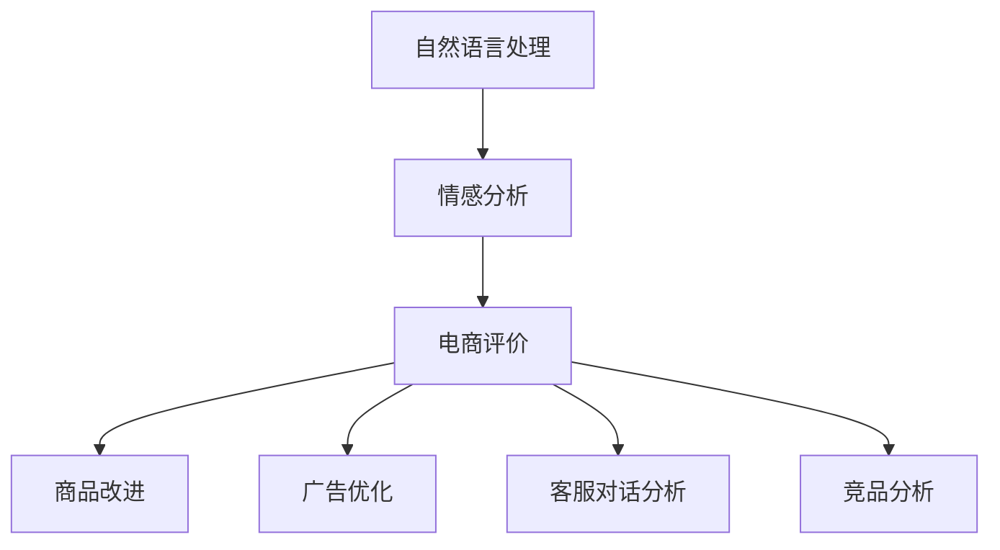

                 

# 情感分析在电商领域的应用：从用户评价到商品改进

> 关键词：情感分析, 用户评价, 商品改进, 电商, 自然语言处理(NLP), 机器学习

## 1. 背景介绍

### 1.1 问题由来

在现代电商行业，消费者评价是了解商品质量和市场接受度的重要依据。传统上，商家依靠人工阅读和分析消费者评价，但这种方法存在诸多缺陷：工作量大、效率低、易受主观偏见影响，且难以全面掌握消费者情感倾向。因此，电商平台迫切需要一种自动化的情感分析工具，以快速高效地从海量用户评价中提取出有用的情感信息，指导商品改进和营销决策。

### 1.2 问题核心关键点
情感分析是自然语言处理(Natural Language Processing, NLP)中的一个重要研究方向。其核心目标是识别文本中的情感倾向，如正面、中性、负面，并将这些情感信息用于指导商品改进、市场策略调整等业务决策。

电商领域的应用场景包括：
- 商品评价分析：根据用户评论情感分析结果，快速了解商品优劣，及时调整产品质量。
- 竞品分析：分析竞争对手商品的用户评价情感，发现自身优势和劣势。
- 广告优化：通过情感分析结果优化广告投放策略，提升广告点击率和转化率。
- 客服对话分析：分析用户反馈，优化客服响应策略，提升客户满意度。

### 1.3 问题研究意义
情感分析技术在电商领域的广泛应用，将有助于：

1. 提升用户体验：及时回应用户反馈，优化商品设计，提升用户满意度。
2. 降低运营成本：自动化的情感分析工具可快速识别问题和改进点，减少人工干预。
3. 增强市场竞争力：深入理解消费者需求，精准制定营销策略，提升市场份额。
4. 提供决策支持：通过全面准确的情感分析，辅助业务决策，优化经营策略。
5. 数据驱动决策：基于数据驱动的情感分析结果，优化库存管理、供应链优化等。

## 2. 核心概念与联系

### 2.1 核心概念概述

为更好地理解基于情感分析的电商应用，本节将介绍几个关键概念：

- 自然语言处理(Natural Language Processing, NLP)：一种涉及计算机科学、人工智能和语言学的交叉学科，旨在使计算机能够理解、分析、处理和生成自然语言。

- 情感分析(Sentiment Analysis)：一种文本分析技术，旨在识别和提取文本中的情感倾向，包括正面、中性、负面。

- 电商评价(E-Commerce Reviews)：电商平台用户对商品的评价、评论和反馈。

- 商品改进(Product Improvement)：根据用户反馈，优化商品质量、设计、功能等，提升用户满意度和市场竞争力。

- 广告优化(Advertising Optimization)：根据用户情感倾向，优化广告文案和投放策略，提高广告效果。

- 客服对话分析(Customer Service Chat Analysis)：分析客服对话中的用户情感，优化客服策略，提升客户服务质量。

- 竞品分析(Competitor Analysis)：通过情感分析竞争对手商品评价，发现市场机会和潜在威胁，制定竞品策略。

这些概念之间的逻辑关系可以通过以下Mermaid流程图来展示：



这个流程图展示了一个基于情感分析的电商应用场景：

1. 通过自然语言处理技术，从电商评价中提取文本数据。
2. 对电商评价进行情感分析，识别用户情感倾向。
3. 根据情感分析结果，指导商品改进、广告优化等业务决策。
4. 通过对竞品情感分析，制定市场策略。

## 3. 核心算法原理 & 具体操作步骤
### 3.1 算法原理概述

基于情感分析的电商应用，本质上是一种文本分类任务。其核心思想是：通过机器学习模型，从电商评价中自动识别和分类用户情感倾向，并将这些信息用于指导商品改进、广告优化等业务决策。

情感分类模型的训练一般包含两个步骤：

1. 预训练：使用大规模标注数据集对模型进行预训练，学习语言表示和情感分类规律。
2. 微调：在电商评价数据集上，通过有监督学习对预训练模型进行微调，以适应电商领域的特定需求。

预训练模型通常使用BERT、LSTM等神经网络架构，通过自监督任务（如掩码语言模型、下划线预测等）学习语言表示。微调模型则根据电商评价数据集，对预训练模型进行任务适配层和损失函数的添加，并进行有监督学习优化。

### 3.2 算法步骤详解

基于情感分析的电商应用一般包括以下几个关键步骤：

**Step 1: 准备数据集**

- 收集电商评价数据集，一般包含商品评价、商品描述、用户属性等。
- 将电商评价数据集划分为训练集、验证集和测试集。
- 进行数据预处理，包括去除停用词、词干提取、分词等。

**Step 2: 构建情感分类模型**

- 选择合适的预训练模型，如BERT、LSTM等。
- 添加情感分类任务适配层，如全连接层、Dropout层、批归一化层等。
- 定义损失函数，如交叉熵损失、二元交叉熵损失等。
- 设置优化算法及其参数，如AdamW、SGD等，设置学习率、批大小、迭代轮数等。

**Step 3: 模型微调**

- 在电商评价数据集上，使用微调模型进行有监督学习。
- 周期性在验证集上评估模型性能，根据性能指标决定是否触发 Early Stopping。
- 重复上述步骤直至满足预设的迭代轮数或 Early Stopping 条件。

**Step 4: 评估与部署**

- 在测试集上评估微调后模型的情感分类性能，对比微调前后的精度提升。
- 使用微调后的模型对新评价进行情感分类，集成到实际的应用系统中。
- 持续收集新的数据，定期重新微调模型，以适应数据分布的变化。

### 3.3 算法优缺点

基于情感分析的电商应用具有以下优点：

1. 快速高效：自动化的情感分析工具可以大规模处理电商评价，提升分析效率。
2. 全面准确：机器学习模型能够从海量的文本中全面准确地识别用户情感。
3. 可解释性强：情感分析模型通过训练数据生成规则，提供明确的分类依据。
4. 适用性强：电商评价数据丰富多样，情感分析模型可以适应各种电商场景。

同时，该方法也存在一定的局限性：

1. 数据质量依赖：情感分析模型的性能依赖于标注数据的质量和数量。
2. 语境理解不足：模型难以理解文本中的隐含情感和语境信息。
3. 多模态数据处理：电商评价多模态（文本、图片、视频等），情感分析模型处理复杂。
4. 动态变化问题：用户情感可能随时间变化，情感分析模型需要定期更新。
5. 业务场景适配：不同电商场景下的评价特征差异大，需要针对性地调整模型。

尽管存在这些局限性，但就目前而言，基于情感分析的电商应用仍是大规模电商评价分析的主流范式。未来相关研究的重点在于如何进一步提升模型的泛化能力、多模态融合能力，同时兼顾可解释性和鲁棒性等因素。

### 3.4 算法应用领域

基于情感分析的电商应用已广泛应用于以下几个领域：

- 商品评价分析：根据用户评价情感分析结果，快速了解商品优劣，及时调整产品质量。
- 竞品分析：分析竞争对手商品的用户评价情感，发现自身优势和劣势。
- 广告优化：通过情感分析结果优化广告文案和投放策略，提高广告效果。
- 客服对话分析：分析客服对话中的用户情感，优化客服响应策略，提升客户服务质量。
- 个性化推荐：根据用户评价情感，推荐相关商品，提升用户购买体验。

## 4. 数学模型和公式 & 详细讲解 & 举例说明
### 4.1 数学模型构建

本节将使用数学语言对基于情感分析的电商应用进行更加严格的刻画。

假设电商评价数据集为 $D=\{(x_i,y_i)\}_{i=1}^N$，其中 $x_i$ 为电商评价文本，$y_i$ 为情感标签（0: 负面，1: 中性，2: 正面）。定义模型 $M_{\theta}$ 在输入 $x$ 上的输出为 $\hat{y}=M_{\theta}(x) \in [0,1,2]$。

情感分类模型的损失函数为二元交叉熵损失函数，定义如下：

$$
\ell(M_{\theta}(x),y) = -\sum_{k=0}^2 y_k \log(M_{\theta}(x)_k)
$$

其中 $y_k$ 为情感标签向量，$M_{\theta}(x)_k$ 为模型在输入 $x$ 上输出情感标签的概率。

在模型训练过程中，目标是最小化损失函数，即：

$$
\theta^* = \mathop{\arg\min}_{\theta} \mathcal{L}(\theta)
$$

其中 $\mathcal{L}$ 为情感分类模型的经验风险，计算公式如下：

$$
\mathcal{L}(\theta) = \frac{1}{N}\sum_{i=1}^N \ell(M_{\theta}(x_i),y_i)
$$

通过梯度下降等优化算法，微调过程不断更新模型参数 $\theta$，最小化损失函数 $\mathcal{L}$，使得模型输出逼近真实标签。

### 4.2 公式推导过程

以二分类为例，假设模型 $M_{\theta}$ 在输入 $x$ 上的输出为 $\hat{y}=M_{\theta}(x) \in [0,1]$，表示样本属于正类的概率。真实标签 $y \in \{0,1\}$。则二分类交叉熵损失函数定义为：

$$
\ell(M_{\theta}(x),y) = -[y\log \hat{y} + (1-y)\log (1-\hat{y})]
$$

将其代入经验风险公式，得：

$$
\mathcal{L}(\theta) = -\frac{1}{N}\sum_{i=1}^N [y_i\log M_{\theta}(x_i)+(1-y_i)\log(1-M_{\theta}(x_i))]
$$

根据链式法则，损失函数对参数 $\theta_k$ 的梯度为：

$$
\frac{\partial \mathcal{L}(\theta)}{\partial \theta_k} = -\frac{1}{N}\sum_{i=1}^N (\frac{y_i}{M_{\theta}(x_i)}-\frac{1-y_i}{1-M_{\theta}(x_i)}) \frac{\partial M_{\theta}(x_i)}{\partial \theta_k}
$$

其中 $\frac{\partial M_{\theta}(x_i)}{\partial \theta_k}$ 可进一步递归展开，利用自动微分技术完成计算。

在得到损失函数的梯度后，即可带入参数更新公式，完成模型的迭代优化。重复上述过程直至收敛，最终得到适应电商评价数据的情感分类模型。

### 4.3 案例分析与讲解

以电商评价情感分析为例，我们展示如何在电商评价数据集上微调情感分类模型。

假设电商评价数据集包含商品名称、用户评价、情感标签等字段。首先将用户评价文本进行分词、去停用词等预处理，使用BERT等预训练模型对文本进行编码。

```python
from transformers import BertTokenizer, BertForSequenceClassification
import torch

tokenizer = BertTokenizer.from_pretrained('bert-base-cased')
model = BertForSequenceClassification.from_pretrained('bert-base-cased', num_labels=3)
```

然后，将预处理后的文本数据输入模型，计算损失函数和梯度，更新模型参数。

```python
from transformers import AdamW
from torch.utils.data import DataLoader
import pandas as pd

# 加载电商评价数据集
data = pd.read_csv('review_data.csv')

# 数据预处理
tokenized_data = [tokenizer.encode(text) for text in data['review']]
labels = data['label'].values

# 构建DataLoader
dataloader = DataLoader(tokenized_data, batch_size=16)

# 定义优化器
optimizer = AdamW(model.parameters(), lr=2e-5)

# 训练模型
device = torch.device('cuda' if torch.cuda.is_available() else 'cpu')
model.to(device)
for epoch in range(10):
    model.train()
    total_loss = 0
    for batch in dataloader:
        input_ids = torch.tensor(batch, dtype=torch.long).to(device)
        labels = torch.tensor(labels, dtype=torch.long).to(device)
        outputs = model(input_ids)
        loss = outputs.loss
        loss.backward()
        optimizer.step()
        total_loss += loss.item()
    print(f"Epoch {epoch+1}, loss: {total_loss/N}")
```

最后，在测试集上评估模型性能。

```python
# 加载测试集数据
test_data = pd.read_csv('test_data.csv')
test_tokenized_data = [tokenizer.encode(text) for text in test_data['review']]
test_labels = test_data['label'].values

# 构建测试集DataLoader
test_dataloader = DataLoader(test_tokenized_data, batch_size=16)

# 评估模型
model.eval()
total_loss = 0
correct = 0
for batch in test_dataloader:
    input_ids = torch.tensor(batch, dtype=torch.long).to(device)
    labels = torch.tensor(test_labels, dtype=torch.long).to(device)
    outputs = model(input_ids)
    loss = outputs.loss
    total_loss += loss.item()
    _, preds = torch.max(outputs, dim=1)
    correct += torch.sum(preds == labels)
print(f"Test loss: {total_loss/N}, Accuracy: {correct/N}")
```

以上就是使用PyTorch对BERT进行电商评价情感分析的完整代码实现。可以看到，通过简单的代码修改，即可实现电商评价数据的情感分析任务。

## 5. 项目实践：代码实例和详细解释说明
### 5.1 开发环境搭建

在进行电商情感分析实践前，我们需要准备好开发环境。以下是使用Python进行PyTorch开发的环境配置流程：

1. 安装Anaconda：从官网下载并安装Anaconda，用于创建独立的Python环境。

2. 创建并激活虚拟环境：
```bash
conda create -n pytorch-env python=3.8 
conda activate pytorch-env
```

3. 安装PyTorch：根据CUDA版本，从官网获取对应的安装命令。例如：
```bash
conda install pytorch torchvision torchaudio cudatoolkit=11.1 -c pytorch -c conda-forge
```

4. 安装Transformers库：
```bash
pip install transformers
```

5. 安装各类工具包：
```bash
pip install numpy pandas scikit-learn matplotlib tqdm jupyter notebook ipython
```

完成上述步骤后，即可在`pytorch-env`环境中开始电商情感分析实践。

### 5.2 源代码详细实现

这里我们以电商评价情感分析为例，给出使用Transformers库对BERT模型进行情感分析的PyTorch代码实现。

首先，定义情感分类任务的数据处理函数：

```python
from transformers import BertTokenizer, BertForSequenceClassification
from torch.utils.data import Dataset
import torch

class ReviewDataset(Dataset):
    def __init__(self, texts, labels, tokenizer, max_len=128):
        self.texts = texts
        self.labels = labels
        self.tokenizer = tokenizer
        self.max_len = max_len
        
    def __len__(self):
        return len(self.texts)
    
    def __getitem__(self, item):
        text = self.texts[item]
        label = self.labels[item]
        
        encoding = self.tokenizer(text, return_tensors='pt', max_length=self.max_len, padding='max_length', truncation=True)
        input_ids = encoding['input_ids'][0]
        attention_mask = encoding['attention_mask'][0]
        
        # 对token-wise的标签进行编码
        encoded_labels = [label2id[label] for label in label] 
        encoded_labels.extend([label2id['O']] * (self.max_len - len(encoded_labels)))
        labels = torch.tensor(encoded_labels, dtype=torch.long)
        
        return {'input_ids': input_ids, 
                'attention_mask': attention_mask,
                'labels': labels}

# 标签与id的映射
label2id = {'O': 0, 'Negative': 1, 'Positive': 2}
id2label = {v: k for k, v in label2id.items()}

# 创建dataset
tokenizer = BertTokenizer.from_pretrained('bert-base-cased')

train_dataset = ReviewDataset(train_texts, train_labels, tokenizer)
dev_dataset = ReviewDataset(dev_texts, dev_labels, tokenizer)
test_dataset = ReviewDataset(test_texts, test_labels, tokenizer)
```

然后，定义模型和优化器：

```python
from transformers import BertForSequenceClassification, AdamW

model = BertForSequenceClassification.from_pretrained('bert-base-cased', num_labels=len(label2id))

optimizer = AdamW(model.parameters(), lr=2e-5)
```

接着，定义训练和评估函数：

```python
from torch.utils.data import DataLoader
from tqdm import tqdm
from sklearn.metrics import classification_report

device = torch.device('cuda') if torch.cuda.is_available() else torch.device('cpu')
model.to(device)

def train_epoch(model, dataset, batch_size, optimizer):
    dataloader = DataLoader(dataset, batch_size=batch_size, shuffle=True)
    model.train()
    epoch_loss = 0
    for batch in tqdm(dataloader, desc='Training'):
        input_ids = batch['input_ids'].to(device)
        attention_mask = batch['attention_mask'].to(device)
        labels = batch['labels'].to(device)
        model.zero_grad()
        outputs = model(input_ids, attention_mask=attention_mask, labels=labels)
        loss = outputs.loss
        epoch_loss += loss.item()
        loss.backward()
        optimizer.step()
    return epoch_loss / len(dataloader)

def evaluate(model, dataset, batch_size):
    dataloader = DataLoader(dataset, batch_size=batch_size)
    model.eval()
    preds, labels = [], []
    with torch.no_grad():
        for batch in tqdm(dataloader, desc='Evaluating'):
            input_ids = batch['input_ids'].to(device)
            attention_mask = batch['attention_mask'].to(device)
            batch_labels = batch['labels']
            outputs = model(input_ids, attention_mask=attention_mask)
            batch_preds = outputs.logits.argmax(dim=2).to('cpu').tolist()
            batch_labels = batch_labels.to('cpu').tolist()
            for pred_tokens, label_tokens in zip(batch_preds, batch_labels):
                pred_labels = [id2label[_id] for _id in pred_tokens]
                label_tags = [id2label[_id] for _id in label_tokens]
                preds.append(pred_labels[:len(label_tags)])
                labels.append(label_tags)
                
    print(classification_report(labels, preds))
```

最后，启动训练流程并在测试集上评估：

```python
epochs = 5
batch_size = 16

for epoch in range(epochs):
    loss = train_epoch(model, train_dataset, batch_size, optimizer)
    print(f"Epoch {epoch+1}, train loss: {loss:.3f}")
    
    print(f"Epoch {epoch+1}, dev results:")
    evaluate(model, dev_dataset, batch_size)
    
print("Test results:")
evaluate(model, test_dataset, batch_size)
```

以上就是使用PyTorch对BERT进行电商评价情感分析的完整代码实现。可以看到，通过简单的代码修改，即可实现电商评价数据的情感分析任务。

### 5.3 代码解读与分析

让我们再详细解读一下关键代码的实现细节：

**ReviewDataset类**：
- `__init__`方法：初始化电商评价数据、标签、分词器等关键组件。
- `__len__`方法：返回数据集的样本数量。
- `__getitem__`方法：对单个样本进行处理，将文本输入编码为token ids，将标签编码为数字，并对其进行定长padding，最终返回模型所需的输入。

**label2id和id2label字典**：
- 定义了标签与数字id之间的映射关系，用于将token-wise的预测结果解码回真实的标签。

**训练和评估函数**：
- 使用PyTorch的DataLoader对数据集进行批次化加载，供模型训练和推理使用。
- 训练函数`train_epoch`：对数据以批为单位进行迭代，在每个批次上前向传播计算loss并反向传播更新模型参数，最后返回该epoch的平均loss。
- 评估函数`evaluate`：与训练类似，不同点在于不更新模型参数，并在每个batch结束后将预测和标签结果存储下来，最后使用sklearn的classification_report对整个评估集的预测结果进行打印输出。

**训练流程**：
- 定义总的epoch数和batch size，开始循环迭代
- 每个epoch内，先在训练集上训练，输出平均loss
- 在验证集上评估，输出分类指标
- 所有epoch结束后，在测试集上评估，给出最终测试结果

可以看到，PyTorch配合Transformers库使得情感分析的代码实现变得简洁高效。开发者可以将更多精力放在数据处理、模型改进等高层逻辑上，而不必过多关注底层的实现细节。

当然，工业级的系统实现还需考虑更多因素，如模型的保存和部署、超参数的自动搜索、更灵活的任务适配层等。但核心的情感分析范式基本与此类似。

## 6. 实际应用场景
### 6.1 智能客服系统

基于情感分析的电商应用，可以广泛应用于智能客服系统的构建。传统客服往往需要配备大量人力，高峰期响应缓慢，且一致性和专业性难以保证。而使用情感分析技术，可以自动分析客户反馈，指导客服人员及时响应客户咨询，提升客户满意度。

在技术实现上，可以收集用户反馈数据，进行情感分类，然后根据分类结果自动分配客服工单，优化客服策略。对于客户提出的投诉，情感分析系统可以自动识别并优先处理，提高问题解决效率。

### 6.2 个性化推荐系统

电商平台的个性化推荐系统需要根据用户反馈，不断调整推荐内容。情感分析技术可以从用户评价中提取情感倾向，用于指导推荐算法，提升用户满意度。

在实际应用中，可以将用户评价数据作为情感输入，使用情感分析模型识别情感倾向，然后根据情感倾向调整推荐策略。对于情感倾向为正面的用户，可以推荐更多类似好评的商品；对于情感倾向为负面的用户，可以推荐相似好评的商品以缓解不满。

### 6.3 营销决策优化

情感分析技术可以用于分析用户对营销活动的反馈，帮助企业优化营销策略。通过对用户评价数据的情感分类，识别广告、活动效果，调整投放策略，提升广告效果和转化率。

例如，可以分析用户对某次促销活动的反馈，通过情感分析模型识别促销效果，然后根据情感倾向调整广告文案和投放策略，提升点击率和转化率。

### 6.4 竞品分析

通过分析竞争对手的用户评价数据，情感分析技术可以帮助企业了解市场动态，制定竞争策略。例如，可以分析竞争对手在某个领域的评价数据，识别其优势和劣势，制定相应的市场策略。

## 7. 工具和资源推荐
### 7.1 学习资源推荐

为了帮助开发者系统掌握情感分析的理论基础和实践技巧，这里推荐一些优质的学习资源：

1. 《Natural Language Processing with PyTorch》书籍：由NLP专家撰写，详细介绍了使用PyTorch进行NLP任务开发的流程和技巧。

2. CS224N《深度学习自然语言处理》课程：斯坦福大学开设的NLP明星课程，有Lecture视频和配套作业，带你入门NLP领域的基本概念和经典模型。

3. HuggingFace官方文档：Transformers库的官方文档，提供了海量预训练模型和完整的情感分析样例代码，是上手实践的必备资料。

4. PyTorch官方文档：PyTorch框架的官方文档，介绍了框架的基本用法和高级特性，适合深度学习开发者学习。

5. Kaggle竞赛：Kaggle平台上有大量的情感分析竞赛，提供大量的数据集和算法实现，适合实践学习和算法创新。

通过对这些资源的学习实践，相信你一定能够快速掌握情感分析的精髓，并用于解决实际的电商问题。
###  7.2 开发工具推荐

高效的开发离不开优秀的工具支持。以下是几款用于情感分析开发的常用工具：

1. PyTorch：基于Python的开源深度学习框架，灵活动态的计算图，适合快速迭代研究。大部分预训练语言模型都有PyTorch版本的实现。

2. TensorFlow：由Google主导开发的开源深度学习框架，生产部署方便，适合大规模工程应用。同样有丰富的预训练语言模型资源。

3. Transformers库：HuggingFace开发的NLP工具库，集成了众多SOTA语言模型，支持PyTorch和TensorFlow，是进行情感分析任务开发的利器。

4. Weights & Biases：模型训练的实验跟踪工具，可以记录和可视化模型训练过程中的各项指标，方便对比和调优。与主流深度学习框架无缝集成。

5. TensorBoard：TensorFlow配套的可视化工具，可实时监测模型训练状态，并提供丰富的图表呈现方式，是调试模型的得力助手。

6. Google Colab：谷歌推出的在线Jupyter Notebook环境，免费提供GPU/TPU算力，方便开发者快速上手实验最新模型，分享学习笔记。

合理利用这些工具，可以显著提升情感分析任务的开发效率，加快创新迭代的步伐。

### 7.3 相关论文推荐

情感分析技术的发展源于学界的持续研究。以下是几篇奠基性的相关论文，推荐阅读：

1. Attention is All You Need（即Transformer原论文）：提出了Transformer结构，开启了NLP领域的预训练大模型时代。

2. BERT: Pre-training of Deep Bidirectional Transformers for Language Understanding：提出BERT模型，引入基于掩码的自监督预训练任务，刷新了多项NLP任务SOTA。

3. Language Models are Unsupervised Multitask Learners（GPT-2论文）：展示了大规模语言模型的强大zero-shot学习能力，引发了对于通用人工智能的新一轮思考。

4. Sentiment Analysis by Training a Bidirectional LSTM with Attention：首次提出基于LSTM的情感分类模型，奠定了情感分析模型的基础。

5. A Survey on Deep Learning Techniques for Sentiment Analysis：系统回顾了深度学习在情感分析中的最新进展，包括卷积神经网络、循环神经网络、注意力机制等。

这些论文代表了大语言模型情感分析的发展脉络。通过学习这些前沿成果，可以帮助研究者把握学科前进方向，激发更多的创新灵感。

## 8. 总结：未来发展趋势与挑战

### 8.1 总结

本文对基于情感分析的电商应用进行了全面系统的介绍。首先阐述了情感分析技术在电商领域的研究背景和意义，明确了情感分析在商品评价分析、竞品分析、广告优化、客服对话分析等方面的应用价值。

本文还详细讲解了情感分析模型的核心算法原理，从预训练模型选择、任务适配层设计、优化算法选择到模型微调等关键步骤，给出了完整的代码实现流程。同时，本文还探讨了情感分析模型在电商领域的广泛应用场景，包括智能客服系统、个性化推荐系统、营销决策优化等。

通过本文的系统梳理，可以看到，基于情感分析的电商应用将有助于提升电商平台的用户体验、优化营销策略、改善客服服务，具有广阔的发展前景。

### 8.2 未来发展趋势

展望未来，情感分析技术在电商领域将呈现以下几个发展趋势：

1. 模型规模持续增大。随着算力成本的下降和数据规模的扩张，预训练语言模型的参数量还将持续增长。超大批次的训练和推理也可能遇到显存不足的问题。

2. 微调方法日趋多样。除了传统的全参数微调外，未来会涌现更多参数高效的微调方法，如Prompt-based Learning、LoRA等，在节省计算资源的同时也能保证微调精度。

3. 持续学习成为常态。随着数据分布的不断变化，情感分析模型也需要持续学习新知识以保持性能。如何在不遗忘原有知识的同时，高效吸收新样本信息，将成为重要的研究课题。

4. 标注样本需求降低。受启发于提示学习(Prompt-based Learning)的思路，未来的情感分析方法将更好地利用大模型的语言理解能力，通过更加巧妙的任务描述，在更少的标注样本上也能实现理想的情感分类效果。

5. 多模态融合能力增强。电商评价多模态（文本、图片、视频等），情感分析模型处理复杂。未来的情感分析模型将更加注重多模态信息的融合，提升模型对现实世界的理解能力。

6. 业务场景适配能力提升。不同电商场景下的评价特征差异大，需要针对性地调整模型。未来的情感分析模型将更加注重业务场景适配，适应不同的电商需求。

以上趋势凸显了情感分析技术的广阔前景。这些方向的探索发展，必将进一步提升电商平台的性能和应用范围，为电商用户提供更加智能化、个性化的服务体验。

### 8.3 面临的挑战

尽管情感分析技术已经取得了瞩目成就，但在迈向更加智能化、普适化应用的过程中，它仍面临着诸多挑战：

1. 数据质量依赖。情感分析模型的性能依赖于标注数据的质量和数量。对于特定领域的数据，可能难以获得充足的高质量标注数据，成为制约模型性能的瓶颈。

2. 语境理解不足。模型难以理解文本中的隐含情感和语境信息，对情感分类结果的影响较大。

3. 动态变化问题。用户情感可能随时间变化，情感分析模型需要定期更新以适应新的情感分布。

4. 业务场景适配。不同电商场景下的评价特征差异大，需要针对性地调整模型。

5. 资源消耗问题。情感分析模型通常需要大规模的计算资源，如何在保证性能的同时，减少资源消耗，是亟待解决的问题。

尽管存在这些局限性，但就目前而言，基于情感分析的电商应用仍是大规模电商评价分析的主流范式。未来相关研究的重点在于如何进一步提升模型的泛化能力、多模态融合能力，同时兼顾可解释性和鲁棒性等因素。

### 8.4 研究展望

面对情感分析面临的这些挑战，未来的研究需要在以下几个方面寻求新的突破：

1. 探索无监督和半监督情感分析方法。摆脱对大规模标注数据的依赖，利用自监督学习、主动学习等无监督和半监督范式，最大限度利用非结构化数据，实现更加灵活高效的情感分析。

2. 研究参数高效和计算高效的情感分析范式。开发更加参数高效的情感分析方法，在固定大部分预训练参数的同时，只更新极少量的任务相关参数。同时优化情感分析模型的计算图，减少前向传播和反向传播的资源消耗，实现更加轻量级、实时性的部署。

3. 引入更多先验知识。将符号化的先验知识，如知识图谱、逻辑规则等，与神经网络模型进行巧妙融合，引导情感分析过程学习更准确、合理的情感表示。同时加强不同模态数据的整合，实现视觉、语音等多模态信息与文本信息的协同建模。

4. 结合因果分析和博弈论工具。将因果分析方法引入情感分析模型，识别出情感分析过程中的关键特征，增强输出解释的因果性和逻辑性。借助博弈论工具刻画人机交互过程，主动探索并规避情感分析模型的脆弱点，提高系统稳定性。

5. 纳入伦理道德约束。在模型训练目标中引入伦理导向的评估指标，过滤和惩罚有偏见、有害的输出倾向。同时加强人工干预和审核，建立模型行为的监管机制，确保输出符合人类价值观和伦理道德。

这些研究方向的探索，必将引领情感分析技术迈向更高的台阶，为构建安全、可靠、可解释、可控的智能系统铺平道路。面向未来，情感分析技术还需要与其他人工智能技术进行更深入的融合，如知识表示、因果推理、强化学习等，多路径协同发力，共同推动自然语言理解和智能交互系统的进步。只有勇于创新、敢于突破，才能不断拓展情感分析的边界，让智能技术更好地造福人类社会。

## 9. 附录：常见问题与解答

**Q1：情感分析模型的训练需要大量的标注数据吗？**

A: 情感分析模型的训练确实需要大量的标注数据，尤其是在大规模电商环境中，数据量通常非常庞大。标注数据的质量和数量对模型的性能影响较大，但通过无监督学习和半监督学习等方法，可以在一定程度上缓解对标注数据的需求。

**Q2：情感分析模型如何处理多模态数据？**

A: 情感分析模型通常处理文本数据，对于图片、视频等非文本数据，可以通过预处理（如OCR、图像分割等）将其转换为文本数据，然后将其作为情感分析模型的输入。此外，也可以使用多模态情感分析模型，同时处理文本、图片、视频等多种模态数据。

**Q3：情感分析模型如何应对动态变化的数据？**

A: 对于动态变化的数据，情感分析模型需要定期重新训练以适应新的情感分布。同时，可以使用在线学习算法，不断更新模型参数，以适应数据分布的变化。

**Q4：情感分析模型如何处理异常情感数据？**

A: 异常情感数据可能对模型性能产生负面影响，因此需要对异常数据进行处理。一种方法是使用数据清洗技术，去除异常数据；另一种方法是使用异常检测技术，识别并排除异常数据。

**Q5：情感分析模型如何提高可解释性？**

A: 情感分析模型的可解释性可以通过特征重要性分析、可视化等方法提升。例如，可以通过可视化模型输出的特征权重，理解模型在情感分类过程中的关键特征。此外，可以使用预训练语言模型（如BERT、GPT等）作为情感分析的基础，通过迁移学习提高模型的可解释性。

这些问答展示了情感分析模型在实际应用中的常见问题及其解决方案，帮助开发者更好地理解情感分析技术，解决实际问题。

---

作者：禅与计算机程序设计艺术 / Zen and the Art of Computer Programming

