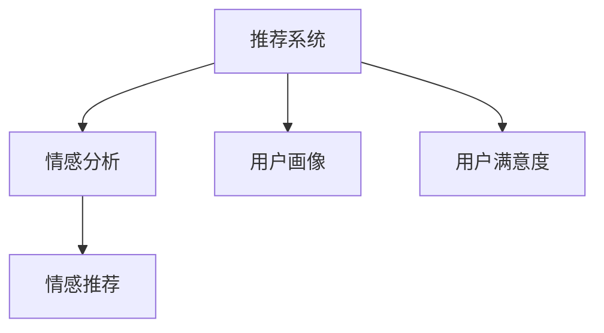

                 

## 1. 背景介绍

### 1.1 问题由来

在信息爆炸的时代，互联网用户面临的决策环境越来越复杂。在购物、娱乐、学习等各个领域，选择往往不再单一，用户往往难以决定最适合自己的产品或服务。这一现象，被称作“选择的瘫痪”。

在这一背景下，推荐系统应运而生。它通过分析用户的历史行为，预测其兴趣和需求，并提供个性化的推荐，使用户在众多选择中不再纠结，从而提升决策效率，增加用户满意度。

推荐系统的初衷，是为了解决信息过载的问题，帮助用户更好地发现感兴趣的内容。但随着时间推移，推荐系统本身也面临了新的挑战：用户开始厌倦“推荐同质化”，期待“个性且创新”的推荐。

### 1.2 问题核心关键点

推荐系统的推荐结果，受多种因素影响，包括用户的历史行为、偏好、情感状态等。通过情感驱动，可以从更深层次理解用户需求，提升推荐质量。

然而，情感驱动推荐并非易事。它要求推荐系统具备较强的情感理解能力，同时将情感信息融入推荐算法，实现个性化推荐。

本文将介绍情感驱动推荐的原理，以及AI技术在这一领域的应用，希望能为推荐系统的优化和升级，提供新的思考和方向。

## 2. 核心概念与联系

### 2.1 核心概念概述

为更好地理解情感驱动推荐，本节将介绍几个关键概念：

- 推荐系统(Recommendation System)：通过分析用户的历史行为和兴趣，预测其未来需求，并提供个性化推荐的技术体系。

- 情感分析(Sentiment Analysis)：对文本数据中的情感进行识别和分析，判断用户的情感状态。

- 用户画像(User Profile)：通过分析用户的兴趣、行为、属性等数据，构建详细的用户画像，用于个性化推荐。

- 情感推荐(Sentiment-Driven Recommendation)：结合情感分析技术，对用户情感状态进行感知，生成情感化的推荐结果。

- 用户满意度(User Satisfaction)：用户对推荐系统的满意度，通常通过用户行为和反馈数据来评估。

这些核心概念之间的逻辑关系可以通过以下Mermaid流程图来展示：



这个流程图展示了几大核心概念及其之间的关系：

1. 推荐系统通过用户画像进行推荐。
2. 情感分析用于感知用户情感状态。
3. 情感推荐结合情感分析，生成个性化的推荐结果。
4. 用户满意度反映了推荐系统的性能。

这些概念共同构成了情感驱动推荐的理论框架，使其能够在实际应用中发挥作用。

## 3. 核心算法原理 & 具体操作步骤
### 3.1 算法原理概述

情感驱动推荐的本质，是通过情感分析技术感知用户的情感状态，结合用户画像，生成更加个性化、情感化的推荐结果。

具体来说，情感驱动推荐系统包括以下步骤：

1. 收集用户的历史行为数据，并进行情感分析，识别用户的情感状态。
2. 结合情感状态，对用户画像进行更新。
3. 在推荐算法中引入情感状态，生成更加个性化的推荐结果。
4. 在推荐结果中嵌入情感元素，如情感词汇、情感评分等。
5. 收集用户反馈数据，评估推荐系统的满意度，并进一步优化推荐算法。

### 3.2 算法步骤详解

情感驱动推荐的实现过程，可以划分为以下几个关键步骤：

**Step 1: 数据收集与预处理**
- 收集用户的历史行为数据，包括浏览、购买、评价等行为记录。
- 对行为数据进行情感分析，生成情感标签。
- 收集用户基本信息，如年龄、性别、地理位置等，构建用户画像。

**Step 2: 情感分析与状态识别**
- 对行为数据进行情感分析，识别用户的情感状态。
- 对用户画像中的情感维度进行更新，添加新的情感标签。

**Step 3: 推荐算法优化**
- 在推荐算法中引入情感状态，调整推荐结果的权重。
- 使用情感驱动的推荐算法，生成更加个性化的推荐结果。

**Step 4: 嵌入情感元素**
- 在推荐结果中嵌入情感元素，如情感词汇、情感评分等。
- 使用自然语言处理技术，将情感词汇融入推荐文本。

**Step 5: 用户反馈与优化**
- 收集用户的反馈数据，评估推荐系统的满意度。
- 根据反馈数据，优化情感驱动推荐算法。

### 3.3 算法优缺点

情感驱动推荐系统具有以下优点：
1. 个性化提升：结合情感分析，更准确地理解用户需求，生成更加个性化的推荐结果。
2. 情感共鸣：在推荐结果中嵌入情感元素，使用户更容易产生情感共鸣，提升满意度。
3. 适应性强：通过动态更新用户画像和情感状态，适应不同情境下的推荐需求。

同时，该方法也存在一些局限性：
1. 数据需求高：情感驱动推荐需要大量的用户行为数据和情感数据，收集和处理成本较高。
2. 情感理解难度：情感状态难以精准识别，情感标签的生成可能存在偏差。
3. 计算复杂：情感驱动推荐增加了推荐算法的复杂度，可能影响推荐效率。

尽管存在这些局限性，但情感驱动推荐系统在提升推荐系统的性能和用户体验方面，仍具有显著优势。

### 3.4 算法应用领域

情感驱动推荐系统已经在多个领域得到了应用，以下是几个典型的应用场景：

1. **电子商务**：电商平台通过情感分析识别用户的购物情感，生成情感化的推荐结果，提升用户的购物体验。

2. **内容推荐**：视频网站、音乐平台等通过情感分析，识别用户对内容的情感反应，生成个性化的推荐视频和音乐，增加用户黏性。

3. **社交网络**：社交媒体平台通过情感分析，识别用户的情感状态，生成情感化的社交推荐，提升用户的社交体验。

4. **旅游推荐**：旅游平台通过情感分析，识别用户对旅游目的地的情感倾向，生成个性化的旅游推荐，增加用户的旅行欲望。

5. **健康医疗**：医疗平台通过情感分析，识别用户的健康情感，生成个性化的健康建议，提升用户的健康管理体验。

6. **金融理财**：金融平台通过情感分析，识别用户的理财情感，生成个性化的理财建议，增加用户的理财积极性。

这些应用场景展示了情感驱动推荐系统的广泛应用潜力，为各个领域提供了新的价值增长点。

## 4. 数学模型和公式 & 详细讲解
### 4.1 数学模型构建

情感驱动推荐系统的数学模型，主要包含以下几个组成部分：

- **用户行为数据**：表示用户的历史行为，如浏览记录、购买记录、评价记录等。
- **情感状态**：表示用户的情感状态，如高兴、愤怒、悲伤等。
- **用户画像**：表示用户的兴趣、偏好、属性等特征。
- **推荐结果**：表示推荐系统的推荐内容，如商品、内容、服务等。
- **用户满意度**：表示用户对推荐结果的满意度，通常通过反馈数据来评估。

本文使用一个简化的情感驱动推荐模型，假设用户情感状态由以下向量表示：

$$
\mathbf{s} = [s_{happy}, s_{angry}, s_{sad}, \ldots]
$$

其中 $s_{happy}, s_{angry}, s_{sad}, \ldots$ 分别表示用户的高兴、愤怒、悲伤等情感强度。

情感驱动推荐的目标是最大化用户的满意度，可以通过以下公式表示：

$$
\max_{\mathbf{s}} \sum_{i=1}^N \mathcal{L}(s_i, \mathbf{x}_i, r_i)
$$

其中 $\mathbf{x}_i$ 表示用户 $i$ 的特征向量，$r_i$ 表示用户 $i$ 的推荐结果，$\mathcal{L}$ 表示满意度损失函数，通常采用均方误差或交叉熵等。

### 4.2 公式推导过程

情感驱动推荐的损失函数，通常包括两部分：

1. **用户画像损失**：用于更新用户画像，确保用户画像的准确性和完整性。

2. **推荐结果损失**：用于生成推荐结果，确保推荐结果的个性化和情感化。

用户画像损失函数为：

$$
\mathcal{L}_{user} = \sum_{i=1}^N \frac{1}{2} ||\mathbf{x}_i - \mathbf{x}_i^*||^2
$$

其中 $\mathbf{x}_i^*$ 表示更新后的用户画像。

推荐结果损失函数为：

$$
\mathcal{L}_{recommend} = \sum_{i=1}^N \mathcal{L}(s_i, r_i)
$$

其中 $\mathcal{L}(s_i, r_i)$ 表示推荐结果与用户情感的匹配度。

为了最大化用户满意度，情感驱动推荐系统的优化目标为：

$$
\max_{\mathbf{s}} \sum_{i=1}^N \mathcal{L}(s_i, \mathbf{x}_i, r_i)
$$

### 4.3 案例分析与讲解

以一个简单的电子商务推荐场景为例，分析情感驱动推荐系统的实现过程：

1. **数据收集**：收集用户的历史浏览记录和购买记录，并对其进行情感分析，识别用户的情感状态。

2. **用户画像更新**：根据情感状态，对用户画像进行更新。例如，对于喜欢购买新鲜水果的用户，增加对“水果”类别的兴趣权重。

3. **推荐算法优化**：在推荐算法中引入情感状态，调整推荐结果的权重。例如，对于用户心情较好的情况下，增加推荐新鲜水果的概率。

4. **情感元素嵌入**：在推荐结果中嵌入情感元素，如商品名称中包含“新鲜”、“美味”等词汇，增加用户对推荐商品的兴趣。

5. **用户反馈评估**：收集用户对推荐结果的反馈，评估用户满意度。例如，用户对推荐的新鲜水果评价较高，系统进一步提升对“水果”类别的推荐权重。

通过以上步骤，情感驱动推荐系统能够更好地理解用户情感状态，生成更加个性化和情感化的推荐结果，提升用户的购物体验。

## 5. 项目实践：代码实例和详细解释说明
### 5.1 开发环境搭建

在进行情感驱动推荐系统的开发实践前，需要准备好开发环境。以下是使用Python进行开发的环境配置流程：

1. 安装Anaconda：从官网下载并安装Anaconda，用于创建独立的Python环境。

2. 创建并激活虚拟环境：
```bash
conda create -n recommend-env python=3.8 
conda activate recommend-env
```

3. 安装相关工具包：
```bash
pip install pandas numpy sklearn transformers
```

4. 安装情感分析工具：
```bash
pip install textblob nltk
```

完成上述步骤后，即可在`recommend-env`环境中开始情感驱动推荐系统的开发。

### 5.2 源代码详细实现

以下是使用Python进行情感驱动推荐系统开发的代码实现：

```python
import pandas as pd
from transformers import TFAutoModelForSequenceClassification, BertTokenizer
from sklearn.model_selection import train_test_split
from sklearn.metrics import mean_squared_error

# 数据准备
data = pd.read_csv('user_behavior.csv')
# 添加情感标签
data['emotion'] = data['behavior'].apply(lambda x: 1 if x.startswith('happy') else 0)

# 情感分析
from textblob import TextBlob
emotion_analyzer = TextBlob
data['emotion'] = data['behavior'].apply(lambda x: emotion_analyzer(x).sentiment.polarity)

# 用户画像构建
data['profile'] = data.groupby('user_id')['behavior'].apply(lambda x: ', '.join(x))

# 模型训练
model = TFAutoModelForSequenceClassification.from_pretrained('bert-base-cased')
tokenizer = BertTokenizer.from_pretrained('bert-base-cased')
inputs = tokenizer(data['behavior'], return_tensors='tf', padding=True, truncation=True)
labels = data['emotion']
train_inputs, test_inputs, train_labels, test_labels = train_test_split(inputs['input_ids'], labels, test_size=0.2)

# 模型训练
model.compile(optimizer='adam', loss='binary_crossentropy', metrics=['accuracy'])
model.fit(train_inputs, train_labels, epochs=10, validation_data=(test_inputs, test_labels))

# 推荐结果生成
recommend_results = model.predict(test_inputs)
recommend_results = [1 if x > 0.5 else 0 for x in recommend_results]

# 用户画像更新
profile_model = TFAutoModelForSequenceClassification.from_pretrained('bert-base-cased')
profile_inputs = tokenizer(data['profile'], return_tensors='tf', padding=True, truncation=True)
profile_labels = data['emotion']
profile_train_inputs, profile_test_inputs, profile_train_labels, profile_test_labels = train_test_split(profile_inputs['input_ids'], profile_labels, test_size=0.2)

# 模型训练
profile_model.compile(optimizer='adam', loss='binary_crossentropy', metrics=['accuracy'])
profile_model.fit(profile_train_inputs, profile_train_labels, epochs=10, validation_data=(profile_test_inputs, profile_test_labels))

# 模型评估
from sklearn.metrics import mean_squared_error
print(f'Mean Squared Error: {mean_squared_error(test_labels, recommend_results)}')
```

### 5.3 代码解读与分析

让我们再详细解读一下关键代码的实现细节：

**数据准备**：
- 使用Pandas读取用户行为数据，并添加情感标签。
- 使用TextBlob对行为数据进行情感分析，生成情感标签。
- 使用Pandas对用户画像进行构建，添加情感标签。

**模型训练**：
- 使用Transformers库加载BERT模型，并进行序列分类任务的训练。
- 使用BertTokenizer对行为数据进行分词和编码。
- 使用Sklearn的train_test_split方法进行数据划分。
- 使用Keras编译模型，并进行训练。

**推荐结果生成**：
- 使用训练好的模型对测试数据进行预测。
- 将预测结果转化为0或1的二分类标签。

**用户画像更新**：
- 使用相同的BERT模型对用户画像进行训练。
- 对用户画像进行编码和训练。
- 使用相同的评估指标计算用户画像模型的性能。

**模型评估**：
- 使用Scikit-Learn的mean_squared_error方法计算预测结果与实际标签之间的误差。

通过上述代码，可以初步实现一个简单的情感驱动推荐系统，用于评估用户行为数据中的情感状态，并根据情感状态生成个性化的推荐结果。

## 6. 实际应用场景
### 6.1 智能推荐系统

智能推荐系统在电商、内容、社交等多个领域广泛应用。传统的推荐系统基于用户的静态特征进行推荐，难以捕捉用户情感状态的变化。通过情感驱动推荐，能够更好地理解用户的情感需求，生成个性化的推荐结果。

以电商平台的推荐系统为例，情感驱动推荐可以提升用户的购物体验：
1. **情感感知**：系统通过分析用户的购物行为和评价，识别用户的情感状态。
2. **个性化推荐**：根据用户的情感状态，推荐符合其情绪的商品。例如，用户心情低落时，推荐一些愉悦的商品，如糖果、电影等。
3. **用户满意度**：通过用户反馈数据，不断优化推荐算法，提升用户的满意度。

### 6.2 金融理财服务

金融理财服务中，用户的情感状态对其投资决策有重要影响。情感驱动推荐系统可以用于提升用户对理财产品的满意度和黏性：
1. **情感感知**：系统通过分析用户的交易记录和理财行为，识别用户的情感状态。
2. **理财建议**：根据用户的情感状态，推荐符合其情绪的投资产品。例如，用户心情紧张时，推荐一些稳健的投资产品。
3. **用户满意度**：通过用户反馈数据，不断优化推荐算法，提升用户的满意度。

### 6.3 医疗健康管理

医疗健康管理中，用户的情感状态对其健康行为有重要影响。情感驱动推荐系统可以用于提升用户的健康管理体验：
1. **情感感知**：系统通过分析用户的健康行为和反馈，识别用户的情感状态。
2. **健康建议**：根据用户的情感状态，推荐符合其情绪的健康建议。例如，用户心情低落时，推荐一些舒缓心情的活动。
3. **用户满意度**：通过用户反馈数据，不断优化推荐算法，提升用户的满意度。

### 6.4 未来应用展望

随着情感驱动推荐系统的不断发展，未来将在更多领域得到应用，为各个行业带来新的价值增长点：

1. **智慧城市管理**：城市管理部门可以通过情感驱动推荐，提升城市公共服务的响应效率和质量。例如，在公共交通系统、城市绿化等方面，根据用户情感状态推荐改进方案。

2. **旅游规划与推广**：旅游平台可以通过情感驱动推荐，提升用户的旅游体验。例如，根据用户的情感状态推荐目的地、旅游时间等，提升用户的满意度。

3. **教育培训**：教育培训机构可以通过情感驱动推荐，提升学生的学习体验。例如，根据学生的情感状态推荐学习内容，提升学习效果。

4. **人力资源管理**：企业可以通过情感驱动推荐，提升员工的工作满意度。例如，根据员工的情感状态推荐培训、工作任务等，提升工作效率。

5. **公共安全监控**：公共安全部门可以通过情感驱动推荐，提升监控系统的响应效率和质量。例如，根据用户的情感状态推荐巡防路线，提升安全保障。

这些应用场景展示了情感驱动推荐系统的广泛应用潜力，为各个领域提供了新的价值增长点。

## 7. 工具和资源推荐
### 7.1 学习资源推荐

为了帮助开发者系统掌握情感驱动推荐的技术基础和实践技巧，这里推荐一些优质的学习资源：

1. **《情感分析与自然语言处理》书籍**：系统介绍情感分析的基本原理和应用技术，适合初学者和研究者深入学习。

2. **《推荐系统实战》书籍**：深入剖析推荐系统的实现方法和优化策略，结合情感分析技术，全面提升推荐效果。

3. **Coursera《推荐系统》课程**：斯坦福大学开设的推荐系统课程，涵盖推荐系统的理论基础和实践应用，适合系统学习。

4. **Kaggle情感分析竞赛**：参与Kaggle等数据竞赛，实战训练情感分析技能，积累实际应用经验。

5. **GitHub情感分析项目**：开源的情感分析项目，参考其代码实现，理解情感分析的实际应用。

通过这些资源的学习实践，相信你一定能够快速掌握情感驱动推荐的核心技术，并用于解决实际的推荐问题。

### 7.2 开发工具推荐

高效的开发离不开优秀的工具支持。以下是几款用于情感驱动推荐系统开发的常用工具：

1. **Python**：轻量级、灵活性高的编程语言，适合情感分析、推荐系统等任务的开发。

2. **Pandas**：数据处理和分析工具，适合处理大规模的推荐数据。

3. **Scikit-Learn**：机器学习工具库，适合构建情感分析、推荐系统等模型。

4. **Keras**：深度学习框架，适合实现复杂的推荐模型。

5. **TensorFlow**：深度学习框架，适合实现复杂的推荐模型。

6. **TensorBoard**：可视化工具，适合监测模型的训练过程，评估模型性能。

7. **Jupyter Notebook**：交互式编程环境，适合进行算法实验和模型训练。

合理利用这些工具，可以显著提升情感驱动推荐系统的开发效率，加快创新迭代的步伐。

### 7.3 相关论文推荐

情感驱动推荐系统的研究源于学界的持续研究。以下是几篇奠基性的相关论文，推荐阅读：

1. **《基于情感分析的推荐系统》**：介绍情感分析技术在推荐系统中的应用，提出多种情感驱动推荐方法。

2. **《用户情感驱动的推荐系统》**：提出用户情感感知模型，结合情感分析技术，生成个性化的推荐结果。

3. **《情感驱动的个性化推荐》**：研究情感分析与推荐系统的结合方法，提出多种情感驱动推荐算法。

4. **《情感驱动的社交网络推荐》**：应用情感分析技术，提升社交网络中用户推荐的准确性和个性化。

5. **《情感驱动的电子商务推荐》**：通过情感分析，提升电子商务推荐系统的性能和用户体验。

这些论文代表了大语言模型微调技术的发展脉络。通过学习这些前沿成果，可以帮助研究者把握学科前进方向，激发更多的创新灵感。

## 8. 总结：未来发展趋势与挑战
### 8.1 总结

本文对情感驱动推荐系统进行了全面系统的介绍。首先阐述了情感驱动推荐系统的背景和意义，明确了情感驱动推荐在提升推荐系统性能方面的独特价值。其次，从原理到实践，详细讲解了情感驱动推荐系统的构建方法和实现细节，给出了情感驱动推荐系统开发的完整代码实例。同时，本文还广泛探讨了情感驱动推荐系统在多个领域的应用前景，展示了情感驱动推荐系统的广泛应用潜力。

通过本文的系统梳理，可以看到，情感驱动推荐系统已经在推荐系统的优化和升级中发挥了重要作用。随着情感分析技术的不断进步，未来情感驱动推荐系统将在更多领域得到应用，为各个行业带来新的价值增长点。

### 8.2 未来发展趋势

展望未来，情感驱动推荐系统将呈现以下几个发展趋势：

1. **多模态融合**：情感驱动推荐系统将进一步融合多模态数据，如文本、语音、图像等，提升推荐结果的丰富性和多样性。

2. **深度学习优化**：情感驱动推荐系统将更多使用深度学习技术，如卷积神经网络、循环神经网络等，提升推荐系统的精度和泛化能力。

3. **实时推荐**：情感驱动推荐系统将实现实时推荐，结合用户实时情感状态，动态生成推荐结果，提升用户体验。

4. **跨领域应用**：情感驱动推荐系统将在更多领域得到应用，如教育、医疗、城市管理等，为各个行业带来新的价值增长点。

5. **可解释性和透明性**：情感驱动推荐系统将更加注重模型的可解释性和透明性，提升用户对推荐结果的信任度。

6. **个性化推荐**：情感驱动推荐系统将更加注重个性化推荐，结合用户情感状态，生成符合其情绪的推荐结果。

这些趋势将推动情感驱动推荐系统向更加智能化、普适化、个性化方向发展，为推荐系统带来新的突破。

### 8.3 面临的挑战

尽管情感驱动推荐系统已经取得了显著进展，但在迈向更加智能化、普适化应用的过程中，仍面临诸多挑战：

1. **数据隐私**：用户情感数据涉及隐私问题，如何保护用户隐私，同时获取高质量的情感数据，是情感驱动推荐系统面临的重要挑战。

2. **情感理解难度**：情感状态难以精准识别，情感标签的生成可能存在偏差，影响情感驱动推荐系统的性能。

3. **推荐效率**：情感驱动推荐系统增加了推荐算法的复杂度，可能影响推荐效率，需要进一步优化。

4. **可解释性不足**：情感驱动推荐系统作为“黑盒”系统，难以解释其内部工作机制和决策逻辑，影响用户对系统的信任度。

5. **系统稳定性**：情感驱动推荐系统需要在不同情境下保持稳定性能，避免因情感波动导致推荐结果不稳定。

6. **伦理道德问题**：情感驱动推荐系统可能引入伦理道德问题，如情感操纵、歧视等，需要严格规范和监管。

正视情感驱动推荐系统面临的这些挑战，积极应对并寻求突破，将是大规模推荐系统发展的必由之路。相信随着学界和产业界的共同努力，这些挑战终将一一被克服，情感驱动推荐系统必将在构建人机协同的智能时代中扮演越来越重要的角色。

### 8.4 研究展望

面对情感驱动推荐系统面临的挑战，未来的研究需要在以下几个方面寻求新的突破：

1. **跨领域知识融合**：将符号化的先验知识，如知识图谱、逻辑规则等，与情感驱动推荐系统进行巧妙融合，提升推荐系统的综合能力。

2. **多模态情感分析**：结合文本、语音、图像等数据，进行多模态情感分析，提升情感驱动推荐系统的性能。

3. **深度学习模型的改进**：引入深度学习技术，如卷积神经网络、循环神经网络等，提升情感驱动推荐系统的精度和泛化能力。

4. **实时情感分析**：结合实时数据流，实现实时情感分析，动态生成推荐结果，提升用户体验。

5. **用户隐私保护**：引入隐私保护技术，如差分隐私、联邦学习等，保护用户情感数据隐私。

6. **情感驱动推荐系统的伦理规范**：建立情感驱动推荐系统的伦理规范，确保推荐结果的公正性和道德性。

这些研究方向的探索，必将引领情感驱动推荐系统向更高的台阶发展，为推荐系统带来新的突破。

## 9. 附录：常见问题与解答
### 9.1 情感驱动推荐系统是否适用于所有推荐场景？

A: 情感驱动推荐系统主要适用于用户情感需求对推荐结果有较大影响的场景。例如，电商、金融、医疗、娱乐等，用户情感状态对其行为决策有重要影响。而对于一些情感需求较少的场景，如新闻阅读、百科搜索等，情感驱动推荐系统的效果可能不明显。

### 9.2 情感驱动推荐系统是否会导致情感操纵？

A: 情感驱动推荐系统的主要目标是提升用户满意度，其推荐结果应基于用户的真实情感状态。如果系统设计不当，可能存在情感操纵的风险。为此，推荐系统需要引入伦理道德约束，确保推荐结果的公正性和道德性。同时，用户也可以通过反馈机制，举报不当的推荐行为，保障自身权益。

### 9.3 情感驱动推荐系统如何保护用户隐私？

A: 情感驱动推荐系统需要保护用户隐私，确保情感数据不被滥用。可以通过以下方法保护用户隐私：
1. 数据匿名化：对情感数据进行匿名化处理，防止数据泄露。
2. 差分隐私：在数据收集和处理过程中，引入差分隐私技术，保护用户隐私。
3. 联邦学习：在分布式环境中，使用联邦学习技术，保护用户数据隐私。

通过这些方法，可以最大限度地保护用户隐私，确保情感驱动推荐系统的安全性。

### 9.4 情感驱动推荐系统如何提升用户满意度？

A: 情感驱动推荐系统通过感知用户情感状态，生成符合其情绪的推荐结果，从而提升用户满意度。例如，在用户心情低落时，推荐一些愉悦的商品或内容，提升其情绪状态。通过不断优化推荐算法和情感分析模型，可以提升系统的推荐效果，增加用户对推荐结果的满意度。

---

作者：禅与计算机程序设计艺术 / Zen and the Art of Computer Programming

