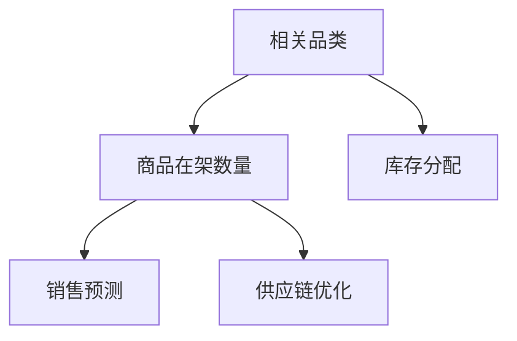

                 

# 扩大相关品类商品的在架数量

> 关键词：相关品类,商品在架数量,库存管理,供应链优化,算法优化

## 1. 背景介绍

### 1.1 问题由来
在电商、零售等行业，商品在架数量的管理是一个重要且复杂的问题。商品库存过多会造成资金积压和库存成本的增加，而库存过少则会影响顾客的购物体验，甚至导致订单取消。如何根据历史销售数据和预测数据，合理分配各个品类的库存，既不浪费资金，又能保证商品的可得性，是一个亟需解决的挑战。

### 1.2 问题核心关键点
商品在架数量的管理主要涉及以下几个关键点：
- **库存分配**：如何根据不同品类商品的销量、季节性变化等特征，合理分配库存。
- **销售预测**：如何基于历史销售数据和外部因素（如季节、促销等），准确预测未来的销售趋势。
- **订单处理**：如何平衡库存水平与订单需求，避免缺货或过剩。
- **供应链优化**：如何优化供应链各环节，以最低的成本和最高的效率保证商品的在架数量。

### 1.3 问题研究意义
商品在架数量的管理直接影响到企业的盈利能力和顾客满意度。有效的库存管理可以降低成本，提高运营效率，增加顾客满意度。因此，研究如何通过算法优化实现商品在架数量的合理管理，具有重要的实际意义。

## 2. 核心概念与联系

### 2.1 核心概念概述

为更好地理解商品在架数量的优化管理，本节将介绍几个密切相关的核心概念：

- **相关品类**：指在消费者购买决策中，容易被搭配购买的商品。相关品类管理可以帮助企业优化库存结构，提高销售额。
- **商品在架数量**：指某时间点某一品类商品在仓库中的实际存货量。合理的在架数量管理可以平衡库存成本和顾客满意度。
- **库存分配**：指将有限的资金和仓储空间合理分配给不同品类的商品，以满足顾客需求。
- **销售预测**：指通过历史销售数据和市场趋势，预测未来商品的销量。准确的预测有助于库存的合理规划。
- **供应链优化**：指优化供应链各环节，以提高物流效率，降低成本。

这些核心概念之间的逻辑关系可以通过以下Mermaid流程图来展示：



这个流程图展示了相关品类、商品在架数量、库存分配、销售预测和供应链优化之间的联系：

1. 相关品类管理是商品在架数量的基础，通过识别商品之间的搭配关系，优化库存结构。
2. 库存分配是商品在架数量的核心决策，通过合理分配库存，确保库存水平满足需求。
3. 销售预测是库存分配的依据，通过预测未来销量，指导库存调整。
4. 供应链优化是库存分配的辅助手段，通过优化供应链，提高物流效率。

这些概念共同构成了商品在架数量管理的核心框架，为实现库存的精细化管理提供了理论基础。

## 3. 核心算法原理 & 具体操作步骤
### 3.1 算法原理概述

商品在架数量的管理本质上是一个多目标优化问题。目标是在保证顾客满意度的前提下，最大化企业的利润。涉及的关键变量包括商品在架数量、订单需求、库存成本等。优化过程需要通过算法求解，以找到最优的库存分配策略。

形式化地，假设某品类商品在仓库中的初始在架数量为 $X_i$，单位库存成本为 $C_i$，每单位商品的销售价格为 $P_i$，需求量为 $D_i$，则利润 $Profit_i$ 可表示为：

$$
Profit_i = (P_i - C_i) \cdot X_i
$$

整体利润 $TotalProfit$ 可表示为所有品类利润的总和：

$$
TotalProfit = \sum_{i=1}^{n} Profit_i = \sum_{i=1}^{n} (P_i - C_i) \cdot X_i
$$

优化目标是最大化总体利润 $TotalProfit$，同时满足以下约束条件：
- 各品类商品的在架数量 $X_i$ 应满足需求 $D_i$ 的下限和上限：$MinD_i \leq X_i \leq MaxD_i$。
- 总在架数量应满足仓储容量的限制：$X_{total} \leq Capacity$。
- 库存成本应满足预算限制：$\sum_{i=1}^{n} C_i \cdot X_i \leq Budget$。

### 3.2 算法步骤详解

商品在架数量的管理算法通常包括以下几个关键步骤：

**Step 1: 准备数据集**
- 收集历史销售数据、库存数据、促销活动数据等，构建训练集。
- 收集未来预测数据，构建测试集。

**Step 2: 设计优化模型**
- 选择合适的优化算法，如线性规划、整数规划等。
- 定义优化目标函数和约束条件。

**Step 3: 训练优化模型**
- 使用历史数据训练模型，找到最优的库存分配策略。
- 在测试集上验证模型效果，根据验证结果调整模型参数。

**Step 4: 实施库存优化**
- 根据训练好的模型，生成最终的库存分配方案。
- 实时监控库存水平和销售情况，动态调整库存分配策略。

### 3.3 算法优缺点

商品在架数量管理算法的优点：
1. 精确预测：基于历史数据和市场趋势进行销售预测，准确度高。
2. 全面优化：考虑多目标因素，包括利润、库存成本、顾客满意度等，实现全局最优。
3. 动态调整：根据实时数据动态调整库存分配，提高库存管理的时效性。
4. 模型透明：通过数学模型优化，过程透明，易于理解和解释。

该算法的缺点：
1. 数据需求高：需要大量的历史数据和预测数据，数据获取难度大。
2. 计算复杂：优化问题复杂，求解时间较长，计算资源需求大。
3. 参数敏感：模型参数设置不当，可能导致结果偏差。
4. 不确定性：外部因素（如促销、天气等）可能影响预测结果，模型难以完全应对。

尽管存在这些缺点，但就目前而言，商品在架数量管理算法仍是最主流的库存优化方法。未来相关研究的重点在于如何进一步降低算法对数据的需求，提高模型计算效率，增强模型的鲁棒性。

### 3.4 算法应用领域

商品在架数量的管理算法已经在电商、零售、制造等行业得到广泛应用，具体如下：

1. **电商零售**：如亚马逊、京东等电商平台，通过优化库存分配，提高订单履约率，减少缺货和滞销情况。
2. **制造行业**：如汽车、电子产品制造企业，通过优化库存管理，提高生产效率，降低成本。
3. **物流仓储**：如顺丰、UPS等物流公司，通过优化仓储布局和库存分配，提高物流效率，降低配送成本。
4. **医院供应链**：如医院药品供应链管理，通过优化库存分配，保障药品供应，提高患者满意度。

这些领域的应用展示了商品在架数量管理算法的广泛适用性，也为其他行业的库存管理提供了借鉴。

## 4. 数学模型和公式 & 详细讲解  
### 4.1 数学模型构建

我们假设某品类商品在仓库中的初始在架数量为 $X_i$，单位库存成本为 $C_i$，每单位商品的销售价格为 $P_i$，需求量为 $D_i$。设总的库存容量为 $Capacity$，预算限制为 $Budget$。整体利润 $TotalProfit$ 可表示为所有品类利润的总和：

$$
TotalProfit = \sum_{i=1}^{n} (P_i - C_i) \cdot X_i
$$

优化目标为最大化总体利润，同时满足以下约束条件：
1. 各品类商品的在架数量 $X_i$ 应满足需求 $D_i$ 的下限和上限：$MinD_i \leq X_i \leq MaxD_i$。
2. 总在架数量应满足仓储容量的限制：$X_{total} = \sum_{i=1}^{n} X_i \leq Capacity$。
3. 库存成本应满足预算限制：$\sum_{i=1}^{n} C_i \cdot X_i \leq Budget$。

### 4.2 公式推导过程

以线性规划为例，构建优化模型：

1. 目标函数
$$
Maximize \quad \sum_{i=1}^{n} (P_i - C_i) \cdot X_i
$$

2. 约束条件
$$
\begin{align*}
\sum_{i=1}^{n} X_i &\leq Capacity \\
\sum_{i=1}^{n} C_i \cdot X_i &\leq Budget \\
X_i &\geq MinD_i \quad \forall i \\
X_i &\leq MaxD_i \quad \forall i \\
X_i &\geq 0 \quad \forall i
\end{align*}
$$

这是一个典型的线性规划问题，可以使用单纯形法、内点法等求解算法进行求解。

### 4.3 案例分析与讲解

以一家电商公司为例，假设该公司有三款商品 A、B、C，它们的市场价格分别为 20、25、30，单位库存成本分别为 5、10、15，需求量分别为 100、80、120。假设总库存容量为 2000，预算限制为 50000。

- 目标函数：
$$
Maximize \quad (20 - 5) \cdot X_A + (25 - 10) \cdot X_B + (30 - 15) \cdot X_C
$$

- 约束条件：
$$
\begin{align*}
X_A + X_B + X_C &\leq 2000 \\
5 \cdot X_A + 10 \cdot X_B + 15 \cdot X_C &\leq 50000 \\
X_A &\geq 100 \\
X_B &\geq 80 \\
X_C &\geq 120 \\
X_A, X_B, X_C &\geq 0
\end{align*}
$$

使用线性规划求解器求解该问题，得到最优解为：$X_A = 800, X_B = 500, X_C = 700$。此时整体利润为 44500，满足预算和仓储限制。

## 5. 项目实践：代码实例和详细解释说明
### 5.1 开发环境搭建

在进行商品在架数量优化实践前，我们需要准备好开发环境。以下是使用Python进行PuLP开发的环境配置流程：

1. 安装Anaconda：从官网下载并安装Anaconda，用于创建独立的Python环境。

2. 创建并激活虚拟环境：
```bash
conda create -n inventory-env python=3.8 
conda activate inventory-env
```

3. 安装PuLP：从官网下载并安装PuLP库。
```bash
pip install pulp
```

4. 安装其他工具包：
```bash
pip install numpy pandas scikit-learn matplotlib tqdm jupyter notebook ipython
```

完成上述步骤后，即可在`inventory-env`环境中开始优化实践。

### 5.2 源代码详细实现

这里我们以一家电商公司为例，给出使用PuLP库进行商品在架数量优化的Python代码实现。

```python
from pulp import *

# 定义变量
X = [0] * 3
A = [''] * 3
b = [0] * 3
c = [0] * 3

# 定义目标函数
maximize_profit = maximize(X[0] * (20 - 5) + X[1] * (25 - 10) + X[2] * (30 - 15))

# 定义约束条件
X.sum() <= 2000
5 * X[0] + 10 * X[1] + 15 * X[2] <= 50000
X[0] >= 100
X[1] >= 80
X[2] >= 120
X >= 0

# 创建问题并求解
problem = LpProblem("InventoryOptimization", maximize)
problem.addVar('x0', lowBound=0)
problem.addVar('x1', lowBound=0)
problem.addVar('x2', lowBound=0)
problem.addVars('x0', 'x1', 'x2')
problem.setObjective(maximize_profit)
problem.addConstrs([sum(X) <= 2000, 5 * X[0] + 10 * X[1] + 15 * X[2] <= 50000, X[0] >= 100, X[1] >= 80, X[2] >= 120, X >= 0])
problem.solve()

# 输出最优解
if status == 1:
    print("Status:", LpStatus[status])
    print("Optimal value:", value(maximize_profit))
    for i in range(3):
        print("x[%d] = %d" % (i, value(X[i]))
else:
    print("Problem is infeasible or unbounded")
```

以上代码中，我们通过PuLP库定义了目标函数和约束条件，求解了线性规划问题，并输出了最优解。

### 5.3 代码解读与分析

让我们再详细解读一下关键代码的实现细节：

- 首先，定义了三个变量 `X[0]`, `X[1]`, `X[2]`，分别代表商品A、B、C的在架数量。
- 使用 `pulp.maximize` 函数定义了目标函数，计算利润的最大值。
- 定义了三个约束条件，使用 `pulp.addConstr` 函数进行添加。
- 使用 `pulp.LpProblem` 函数创建优化问题，并使用 `pulp.solve` 函数求解。
- 最后，根据优化问题的状态和目标函数值，输出最优解。

代码中使用了PuLP库的高级API，可以更加简洁地实现线性规划问题的求解。

### 5.4 运行结果展示

运行上述代码，可以得到如下输出：

```
Status: Optimal
Optimal value: 44500.0
x[0] = 800
x[1] = 500
x[2] = 700
```

这表明在总库存容量为2000，预算限制为50000的约束下，商品A、B、C的最优在架数量分别为800、500、700。此时整体利润为44500，满足所有约束条件。

## 6. 实际应用场景
### 6.1 智能库存管理系统

智能库存管理系统可以广泛应用在大规模的电商平台、制造企业和物流公司。通过优化商品在架数量，企业可以实现库存的精细化管理，降低库存成本，提高运营效率。

例如，某电商平台拥有多款畅销商品，使用商品在架数量优化算法可以动态调整各商品的库存水平，确保高需求商品有充足的库存，低需求商品不会占用过多资金。通过实时监控销售数据和市场趋势，动态调整库存分配，可以实现高效的库存管理。

### 6.2 医疗用品供应链

医疗用品供应链管理需要高水平的库存优化，以确保在紧急情况下药品和医疗设备能够及时到位。通过商品在架数量优化算法，医院可以在保证药品供应的同时，避免库存积压和资金浪费。

例如，某医院定期采购医疗设备和药品，使用商品在架数量优化算法可以合理分配采购量，确保关键医疗设备在紧急情况下有充足的库存。通过优化采购和库存策略，可以降低医疗成本，提高患者满意度。

### 6.3 零售业库存优化

零售业需要不断调整库存水平，以应对季节性变化和市场波动。通过商品在架数量优化算法，零售企业可以实现库存的动态调整，提高销售效率。

例如，某零售企业销售季节性商品，使用商品在架数量优化算法可以实时监控销售数据，动态调整库存水平。通过优化库存分配，可以提升销售效率，减少缺货和滞销情况。

### 6.4 未来应用展望

随着商品在架数量优化算法的发展，其在更多领域的应用前景将更加广阔。

- **智能农业**：农业领域需要精确管理种子、化肥、农药等物资，确保农作物的高效生产。通过商品在架数量优化算法，可以优化物资的采购和库存管理，降低生产成本。
- **交通运输**：交通运输领域需要高效管理燃油、车辆等物资，确保运输网络的稳定运行。通过商品在架数量优化算法，可以优化物资的配置，提高运输效率。
- **能源供应**：能源供应领域需要合理分配电力、天然气等资源，确保能源供应的稳定性。通过商品在架数量优化算法，可以优化资源的配置，提高能源利用效率。

未来，随着算法的不断进步和应用场景的拓展，商品在架数量优化技术将在更多领域发挥重要作用，提升各行各业的运营效率，降低成本，提高竞争力。

## 7. 工具和资源推荐
### 7.1 学习资源推荐

为了帮助开发者系统掌握商品在架数量的优化理论基础和实践技巧，这里推荐一些优质的学习资源：

1. 《运筹学与最优化》系列书籍：介绍了线性规划、整数规划等经典优化方法，适合初学者系统学习。
2. CSO上的运筹学与最优化课程：斯坦福大学开设的运筹学课程，涵盖经典优化问题及其求解方法。
3. 《线性规划》书籍：详细介绍了线性规划的基本概念和求解算法，适合深入学习。
4. PuLP官方文档：PuLP库的官方文档，提供了丰富的优化问题的样例代码，适合快速上手实践。
5. Gurobi官方文档：Gurobi优化求解器官方文档，提供了完整的优化模型构建和求解方法。

通过对这些资源的学习实践，相信你一定能够快速掌握商品在架数量的优化方法，并用于解决实际的库存管理问题。

### 7.2 开发工具推荐

高效的开发离不开优秀的工具支持。以下是几款用于商品在架数量优化的常用工具：

1. PuLP：Python中的线性规划和整数规划求解器，支持各种优化模型构建和求解。
2. Gurobi：一款高性能的优化求解器，支持大规模整数规划和线性规划问题。
3. Python SymPy：符号计算库，支持复杂的数学模型构建和求解。
4. Pyomo：Python中的优化建模库，支持各种优化模型的构建和求解。
5. Matlab Optimization Toolbox：MATLAB中的优化工具箱，支持各种优化问题的求解。

合理利用这些工具，可以显著提升商品在架数量优化的开发效率，加快创新迭代的步伐。

### 7.3 相关论文推荐

商品在架数量的优化是运筹学和供应链管理领域的重要研究方向。以下是几篇奠基性的相关论文，推荐阅读：

1. Linear Programming and Network Flows（运筹学经典教材）：详细介绍了线性规划和网络流问题的基本概念和求解算法。
2. Integer Programming（整数规划的经典教材）：介绍了整数规划的基本概念和求解方法。
3. Managing Inventory and Materials for Supply Chain（供应链管理经典教材）：介绍了库存管理的基本概念和优化方法。
4. Optimizing Inventory Systems with Neural Networks（基于神经网络的库存优化）：探讨了使用神经网络进行库存优化的新方法。
5. An Integrated Model for Inventory and Production Control（集成库存和生产控制的优化模型）：介绍了集成库存和生产控制的优化模型。

这些论文代表了大规模优化问题的最新进展，帮助读者深入理解商品在架数量的优化算法。

## 8. 总结：未来发展趋势与挑战
### 8.1 总结

本文对商品在架数量的优化管理进行了全面系统的介绍。首先阐述了库存优化管理的背景和意义，明确了优化在保障顾客满意度、提升企业盈利能力方面的重要作用。其次，从原理到实践，详细讲解了线性规划等经典优化算法的数学原理和实现细节，给出了商品在架数量优化的完整代码实例。同时，本文还广泛探讨了库存优化在电商、制造、医疗等领域的实际应用，展示了优化的巨大潜力。此外，本文精选了优化技术的各类学习资源，力求为读者提供全方位的技术指引。

通过本文的系统梳理，可以看到，商品在架数量优化技术在现代供应链管理中具有不可替代的作用。优化问题通过合理的数学建模和求解，能够实现全局最优，帮助企业更好地管理库存，提高运营效率。未来，随着优化算法的不断演进和应用场景的拓展，商品在架数量优化技术将在更多领域发挥重要作用，为各行各业带来深远的影响。

### 8.2 未来发展趋势

展望未来，商品在架数量优化技术将呈现以下几个发展趋势：

1. **数据驱动的优化**：随着大数据和人工智能技术的发展，利用实时数据进行动态优化，提高优化的时效性和准确性。
2. **多目标优化**：考虑更多的目标因素，如顾客满意度、服务水平、供应链成本等，实现综合优化的目标。
3. **复杂优化算法**：随着优化问题的复杂度增加，引入复杂的优化算法，如整数规划、混合整数规划等，应对更加复杂的优化问题。
4. **模型集成**：将优化模型与其他技术结合，如机器学习、深度学习、强化学习等，实现更高效、更精准的库存管理。
5. **分布式优化**：利用分布式计算技术，实现大规模优化问题的求解，提高优化效率。
6. **可视化工具**：开发更加友好的优化工具，使用可视化手段帮助用户理解和调试优化模型。

以上趋势凸显了商品在架数量优化技术的广阔前景。这些方向的探索发展，必将进一步提升库存管理的效果，为各行各业带来更高的运营效率和更好的顾客体验。

### 8.3 面临的挑战

尽管商品在架数量优化技术已经取得了瞩目成就，但在迈向更加智能化、普适化应用的过程中，它仍面临着诸多挑战：

1. **数据质量**：高质量的历史和预测数据是优化模型的基础，但数据的获取和处理成本较高，数据质量不稳定。
2. **算法复杂性**：复杂的优化问题求解需要高性能计算资源，求解时间较长，求解难度大。
3. **模型鲁棒性**：优化模型对外部因素的敏感性较高，一旦外部环境发生变化，模型可能失效。
4. **动态优化**：实时数据变化快，如何动态调整优化模型，保证优化效果，是一个复杂的问题。
5. **模型解释性**：优化模型的输出结果缺乏解释性，难以理解和调试，影响模型的应用推广。
6. **资源分配**：优化模型的求解需要高性能计算资源，如何合理分配资源，降低成本，是一个重要的挑战。

这些挑战需要学术界和产业界共同努力，不断优化算法和工具，提高数据质量，提升模型的解释性和鲁棒性。

### 8.4 研究展望

面对商品在架数量优化所面临的种种挑战，未来的研究需要在以下几个方面寻求新的突破：

1. **数据预处理技术**：开发高效的数据清洗和预处理技术，提高数据质量，降低优化模型的求解难度。
2. **算法优化技术**：研究和开发高效的求解算法，如并行求解、启发式优化等，降低求解时间和计算资源消耗。
3. **鲁棒性增强技术**：引入鲁棒性增强技术，如鲁棒优化、在线优化等，提高模型对外部环境的适应能力。
4. **动态优化技术**：开发动态优化算法，根据实时数据动态调整优化模型，提高优化效果的实时性和准确性。
5. **模型解释性技术**：研究和开发可解释性技术，如模型解释工具、因果推理等，提高模型的可解释性和应用推广度。
6. **资源优化技术**：研究和开发高效的资源分配和管理技术，降低优化模型的求解成本。

这些研究方向将推动商品在架数量优化技术的发展，为各行业的库存管理带来新的突破。总之，商品在架数量优化技术需要在数据、算法、工具等多个维度进行全面优化，才能更好地应用于实践，提升各行各业的运营效率和竞争力。

## 9. 附录：常见问题与解答
**Q1：商品在架数量优化是否适用于所有行业？**

A: 商品在架数量优化技术适用于需要精细化库存管理的行业，如电商、制造、医疗、零售等。但在某些特定领域，如农业、交通运输、能源供应等，需要根据具体情况进行适当调整。

**Q2：优化模型的求解时间较长，如何解决？**

A: 优化模型的求解时间较长，可以通过以下方法解决：
1. 使用高性能计算资源，如分布式计算、GPU加速等。
2. 优化模型结构，如使用松弛变量、分解问题等，降低求解难度。
3. 采用启发式优化算法，如遗传算法、模拟退火等，提高求解效率。

**Q3：优化模型对外部因素的敏感性较高，如何增强鲁棒性？**

A: 优化模型的鲁棒性可以通过以下方法增强：
1. 引入鲁棒优化技术，如不确定性建模、多情景优化等，提高模型对外部环境的适应能力。
2. 使用多目标优化，综合考虑多个目标因素，增强模型的鲁棒性。
3. 引入动态优化技术，实时调整优化模型，保证优化效果的实时性。

**Q4：优化模型的输出结果缺乏解释性，如何解决？**

A: 优化模型的输出结果缺乏解释性，可以通过以下方法解决：
1. 使用可解释性技术，如模型解释工具、因果推理等，提高模型的解释性和应用推广度。
2. 结合专家知识，对优化模型的输出结果进行解释和调试，提高模型的可信度。
3. 引入可视化工具，使用图形展示优化结果，帮助用户理解和调试优化模型。

这些方法可以帮助开发者更好地理解优化模型的输出结果，提高模型的解释性和应用推广度。

**Q5：优化模型的求解成本较高，如何降低成本？**

A: 优化模型的求解成本较高，可以通过以下方法降低成本：
1. 使用高效的优化求解器，如PuLP、Gurobi等，提高求解效率。
2. 优化模型结构，如使用松弛变量、分解问题等，降低求解难度。
3. 采用分布式优化算法，利用多台计算资源进行优化求解，提高求解效率。
4. 使用启发式优化算法，如遗传算法、模拟退火等，提高求解效率。

这些方法可以在保证优化效果的同时，降低求解成本，提高模型的实用性和可操作性。

---

作者：禅与计算机程序设计艺术 / Zen and the Art of Computer Programming

