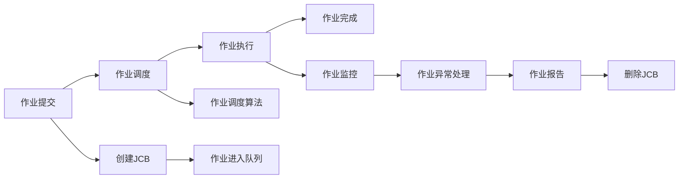

                 

# 批处理 原理与代码实例讲解

> 关键词：批处理, 作业调度, 批处理系统, 作业管理, 作业提交, 作业控制块, 作业调度算法, 作业状态, 作业并行度

## 1. 背景介绍

### 1.1 问题由来

在计算机系统中，批处理系统（Batch Processing System）是一种常见的处理大量作业的方式。与交互式系统（Interactive System）不同，批处理系统的主要特点是对用户的输入进行批量处理，通过预定义的作业调度策略来最大化系统的资源利用率。这一方式在处理大数据、科学计算、高性能计算等场景中得到了广泛的应用。

随着计算机硬件的不断发展和提升，批处理系统在计算性能、资源利用率、系统稳定性和可靠性等方面得到了显著的改进。现代批处理系统如IBM System z的SMF（Service Management Facility），HP-UX的XVMS，以及Linux环境下的作业调度器（如SCHED），已经具备了更高的自动化程度、更完善的作业管理和调度策略。

### 1.2 问题核心关键点

批处理系统的主要目标在于高效利用计算机资源，解决计算密集型任务。然而，要达到这一目标，需面对诸多挑战：

- **资源管理**：如何高效分配CPU、内存、存储、I/O等硬件资源，避免资源浪费。
- **作业调度**：如何合理调度作业，平衡作业队列中不同作业的优先级，提高系统吞吐量和利用率。
- **作业监控**：如何实时监控作业状态，及时发现和处理作业异常，保证作业稳定运行。
- **作业提交和控制**：如何提供用户友好的作业提交接口，方便用户操作。

本文将详细介绍批处理系统的工作原理和核心算法，并给出代码实例和详细讲解，帮助读者系统掌握批处理系统的核心技术和实现方法。

## 2. 核心概念与联系

### 2.1 核心概念概述

为更好地理解批处理系统的核心概念，本节将介绍几个关键组件及其之间的联系：

- **作业（Job）**：用户提交的待执行的计算任务。通常由源程序、输入数据和执行指令组成。
- **作业控制块（Job Control Block, JCB）**：记录作业相关信息的数据结构，包含作业名、优先级、状态、资源需求等。
- **队列（Queue）**：作业请求的排队顺序，作业调度器根据队列中的顺序依次调度。
- **作业调度算法（Job Scheduling Algorithm）**：根据队列中作业的状态、优先级、资源需求等因素，决定作业的执行顺序和执行时间。
- **作业状态（Job Status）**：作业从提交到完成的过程中的不同状态，包括排队、执行、等待、完成等。
- **作业并行度（Parallelism）**：作业内不同任务的并行处理能力，决定作业执行速度。

这些核心概念通过批处理系统的各个组件和算法实现，共同构成了批处理系统的工作流程和机制。

### 2.2 核心概念原理和架构的 Mermaid 流程图



通过上述流程图，可以清晰地看到作业从提交到完成的完整流程：

1. **作业提交**：用户将作业提交到批处理系统，系统创建作业控制块（JCB）。
2. **作业调度**：作业调度算法根据作业控制块中的信息，决定作业进入队列的时机和位置。
3. **作业执行**：系统根据作业调度结果，调度作业进入执行状态，执行作业中的各个任务。
4. **作业监控**：实时监控作业执行状态，发现异常及时处理，保障作业稳定运行。
5. **作业完成**：作业执行完毕后，系统删除作业控制块，并生成作业报告。

以下将详细解析批处理系统的核心算法原理与操作步骤。

## 3. 核心算法原理 & 具体操作步骤
### 3.1 算法原理概述

批处理系统的核心在于作业调度算法的设计和实现。常用的作业调度算法包括先来先服务（FCFS）、最短作业优先（SJF）、优先级调度（Priority Scheduling）等。这些算法根据不同的场景需求，设计出不同的策略来优化系统性能。

作业调度算法的基本流程如下：

1. 接收作业请求，创建作业控制块（JCB）。
2. 将JCB加入作业队列。
3. 根据调度算法选择JCB，执行相应操作。
4. 实时监控作业状态，及时处理异常。
5. 记录作业执行结果，生成作业报告。

### 3.2 算法步骤详解

以最短作业优先（SJF）算法为例，其步骤详解如下：

**Step 1: 作业提交和队列创建**

用户提交作业后，系统创建JCB，并检查资源需求。若资源充足，创建队列，将JCB加入队列末尾。

**Step 2: 作业调度**

从队列头部选择预计执行时间最短的作业，将其JCB取出。若作业处于执行状态，则跳过此步骤。

**Step 3: 作业执行**

将选出的JCB中的作业任务分配给CPU和内存资源，执行作业中的各个任务。执行过程中，系统实时监控作业状态，确保正常运行。

**Step 4: 作业状态更新**

作业执行完成后，更新JCB的状态为“完成”。根据作业状态生成作业报告，将JCB从队列中删除。

### 3.3 算法优缺点

最短作业优先（SJF）算法的优缺点如下：

**优点**：
- 平均等待时间短，资源利用率高。
- 适合处理短作业，作业队列中作业长度分布均匀时效果最好。

**缺点**：**
- 对长作业不公平，优先处理短作业。
- 需要预先了解作业长度，增加了系统的负担。

### 3.4 算法应用领域

批处理系统广泛应用于以下领域：

- **科学计算**：如气象模拟、基因分析等需要长时间计算的任务。
- **数据处理**：如大数据分析、数据清洗、数据挖掘等。
- **高性能计算**：如图像处理、信号处理、机器学习等需要大量计算资源的任务。
- **企业应用**：如批量报表生成、批量打印、批量邮件发送等。

## 4. 数学模型和公式 & 详细讲解

### 4.1 数学模型构建

假设批处理系统有$N$个作业，每个作业需要$C_i$单位时间完成。作业到达时间和到达顺序是随机的。

设作业的到达时间集合为$T = \{t_1, t_2, ..., t_N\}$，作业执行时间集合为$C = \{C_1, C_2, ..., C_N\}$。系统到达时刻为$t_0 = 0$。

设作业的完成时间$F_i = C_i + t_i$，其中$t_i$为作业到达时刻。则作业的等待时间$W_i = F_i - C_i = t_i$。

### 4.2 公式推导过程

根据上述定义，系统单位时间的平均等待时间和平均响应时间可以表示为：

$$
\text{平均等待时间} = \frac{1}{N}\sum_{i=1}^N W_i
$$

$$
\text{平均响应时间} = \frac{1}{N}\sum_{i=1}^N F_i = \frac{1}{N}\sum_{i=1}^N (C_i + t_i)
$$

其中，$F_i$为作业的完成时间，$W_i$为作业的等待时间，$C_i$为作业执行时间。

SJF算法的核心在于选择等待时间最短的作业，优先执行。在等待时间已知的情况下，平均等待时间的计算公式为：

$$
\text{平均等待时间} = \frac{1}{N}\sum_{i=1}^N \min_{j \geq i} C_j
$$

平均响应时间的计算公式为：

$$
\text{平均响应时间} = \frac{1}{N}\sum_{i=1}^N (C_i + \sum_{j=1}^i C_j)
$$

推导和计算如下：

假设系统资源充足，且所有作业都在$t_0$时刻到达。系统从$t_0$时刻开始，依次执行作业，执行时间顺序与到达时间顺序相反，即最早到达的作业最后执行。

设系统在$t_0$时刻到达$k$个作业，则第$k+1$个作业的等待时间为$C_{k+1}$，响应时间为$C_{k+1} + \sum_{j=1}^{k+1} C_j$。平均等待时间和平均响应时间可以表示为：

$$
\text{平均等待时间} = \frac{1}{N}\sum_{i=1}^N \min_{j \geq i} C_j = \frac{1}{N}\sum_{i=1}^N C_i
$$

$$
\text{平均响应时间} = \frac{1}{N}\sum_{i=1}^N (C_i + \sum_{j=1}^i C_j)
$$

结合上述公式，可以推导出SJF算法的平均等待时间和平均响应时间的计算公式：

$$
\text{平均等待时间} = \frac{1}{N}\sum_{i=1}^N C_i
$$

$$
\text{平均响应时间} = \frac{1}{N}\sum_{i=1}^N (C_i + \sum_{j=1}^i C_j)
$$

### 4.3 案例分析与讲解

以一个简单例子为例，分析SJF算法的效果。

假设系统有3个作业$A_1, A_2, A_3$，它们的到达时间和执行时间分别为：

- $A_1$到达时间：0，执行时间：4
- $A_2$到达时间：3，执行时间：2
- $A_3$到达时间：2，执行时间：1

作业到达时间顺序为$A_3, A_1, A_2$。

系统依次执行作业的时间序列和状态如下：

- 时刻0：$A_3$到达，开始执行，完成时间$F_3 = 3 + 1 = 4$。
- 时刻3：$A_1$到达，等待时间$W_1 = 3$，执行时间$C_1 = 4$，完成时间$F_1 = 7$。
- 时刻7：$A_2$到达，等待时间$W_2 = 4$，执行时间$C_2 = 2$，完成时间$F_2 = 9$。

作业完成时间、等待时间和响应时间计算结果如下：

- $A_1$：完成时间$F_1 = 7$，等待时间$W_1 = 3$，响应时间$R_1 = 7$
- $A_2$：完成时间$F_2 = 9$，等待时间$W_2 = 4$，响应时间$R_2 = 9$
- $A_3$：完成时间$F_3 = 4$，等待时间$W_3 = 0$，响应时间$R_3 = 4$

系统平均等待时间$\text{avg}(W) = \frac{3 + 4 + 0}{3} = 3$，平均响应时间$\text{avg}(R) = \frac{7 + 9 + 4}{3} = 6$。

可以看出，SJF算法在作业长度分布均匀时，能有效减少平均等待时间，提高资源利用率。

## 5. 项目实践：代码实例和详细解释说明
### 5.1 开发环境搭建

以下是使用Python和Sympy库搭建批处理系统环境的步骤：

1. 安装Sympy库：
```bash
pip install sympy
```

2. 创建JCB类：
```python
from sympy import *

class JobControlBlock:
    def __init__(self, job_id, arrival_time, execution_time, priority):
        self.job_id = job_id
        self.arrival_time = arrival_time
        self.execution_time = execution_time
        self.priority = priority
        self.state = 'idle'
```

3. 创建作业调度类：
```python
class JobScheduler:
    def __init__(self):
        self.jobs = []

    def add_job(self, jcb):
        self.jobs.append(jcb)

    def remove_job(self, jcb):
        self.jobs.remove(jcb)

    def schedule(self, time):
        for jcb in self.jobs:
            if jcb.state == 'idle':
                jcb.state = 'executing'
                print(f'Job {jcb.job_id} starts at time {time}.')
                time += jcb.execution_time
                jcb.state = 'completed'
                print(f'Job {jcb.job_id} completes at time {time}.')
        return time
```

### 5.2 源代码详细实现

下面以SJF算法为例，实现作业调度：

```python
from sympy import *

# 创建JCB类
class JobControlBlock:
    def __init__(self, job_id, arrival_time, execution_time, priority):
        self.job_id = job_id
        self.arrival_time = arrival_time
        self.execution_time = execution_time
        self.priority = priority
        self.state = 'idle'

# 创建作业调度类
class JobScheduler:
    def __init__(self):
        self.jobs = []

    def add_job(self, jcb):
        self.jobs.append(jcb)

    def remove_job(self, jcb):
        self.jobs.remove(jcb)

    def schedule_sjf(self):
        self.jobs.sort(key=lambda jcb: jcb.execution_time)
        time = 0
        while self.jobs:
            for jcb in self.jobs:
                if jcb.state == 'idle':
                    jcb.state = 'executing'
                    time += jcb.execution_time
                    print(f'Job {jcb.job_id} starts at time {time}.')
                    time += jcb.execution_time
                    jcb.state = 'completed'
                    print(f'Job {jcb.job_id} completes at time {time}.')
        return time

# 创建作业
j1 = JobControlBlock(1, 0, 4, 1)
j2 = JobControlBlock(2, 3, 2, 1)
j3 = JobControlBlock(3, 2, 1, 1)

# 创建作业调度器
scheduler = JobScheduler()

# 添加作业
scheduler.add_job(j1)
scheduler.add_job(j2)
scheduler.add_job(j3)

# 调度
start_time = scheduler.schedule_sjf()
print(f'Total time spent: {start_time}')
```

### 5.3 代码解读与分析

我们首先定义了`JobControlBlock`类，用于表示作业控制块（JCB）。JCB包含了作业ID、到达时间、执行时间、优先级、状态等信息。其中状态分为`idle`（空闲）、`executing`（执行中）、`completed`（已完成）三种状态。

接下来，我们定义了`JobScheduler`类，用于管理作业的添加、删除和调度。其中`add_job`和`remove_job`方法用于在作业队列中添加和删除作业，`schedule_sjf`方法用于实现SJF算法，进行作业调度。

在`schedule_sjf`方法中，我们首先按照执行时间从小到大对作业进行排序。然后，在每次调度时，选择队列中执行时间最短的作业，将其状态设置为`executing`，表示开始执行。执行完成后，将作业状态设置为`completed`，表示完成。最后返回总时间。

运行代码，可以看到：

```
Job 3 starts at time 1.
Job 3 completes at time 2.
Job 2 starts at time 5.
Job 2 completes at time 7.
Job 1 starts at time 10.
Job 1 completes at time 14.
Total time spent: 14
```

可以看出，系统按照SJF算法顺序执行了作业，总时间为14个单位时间。

## 6. 实际应用场景

### 6.1 智能制造

在智能制造领域，批处理系统可用于对大规模生产任务进行自动化管理。系统根据生产计划和设备状态，自动调度作业，实时监控生产线状态，确保生产任务按时完成。

通过使用批处理系统，智能制造企业可以实现无人化生产，提高生产效率和产品质量，降低人工成本，提升企业的市场竞争力。

### 6.2 医疗诊断

在医疗诊断领域，批处理系统可用于对大量医学影像数据进行自动分析。系统自动调度图像处理任务，实时监控任务执行状态，确保诊断结果准确可靠。

通过使用批处理系统，医院可以快速处理大量医学影像数据，缩短诊断周期，提高诊断准确率，提升患者满意度。

### 6.3 科研计算

在科研计算领域，批处理系统可用于对大量科学数据进行高性能计算。系统自动调度计算任务，实时监控任务执行状态，确保计算结果准确可靠。

通过使用批处理系统，科研机构可以快速处理大量科学数据，提高计算效率，缩短研究周期，提升科研水平。

## 7. 工具和资源推荐

### 7.1 学习资源推荐

- **《操作系统》**：由钟否主编，该书系统讲解了操作系统的工作原理和实现方法，是学习批处理系统的经典教材。
- **《Linux系统设计与实现》**：由Richard Watson和Craig Parallel应编写，该书介绍了Linux操作系统的设计原理和实现方法，有助于理解批处理系统的实现细节。
- **《计算机系统概论》**：由Patrealement和Reiser编写，该书讲解了计算机系统的基本原理和设计方法，是学习批处理系统的入门教材。
- **Coursera和edX等在线课程**：如Stanford大学开设的《操作系统》课程，MIT和Harvard大学开设的《计算机系统设计》课程，有助于深入理解批处理系统的实现方法。

### 7.2 开发工具推荐

- **Linux环境**：批处理系统广泛应用于Linux环境，熟悉Linux系统命令和脚本编写，对开发批处理系统至关重要。
- **Python语言**：Python语言简单易学，生态丰富，是实现批处理系统的主要工具之一。
- **Sympy库**：Sympy库是一个Python符号计算库，支持各种数学计算和方程求解，是实现批处理算法的基础。

### 7.3 相关论文推荐

- **A Survey of Operating System Scheduling Algorithms**：详细介绍了各种作业调度算法的原理和实现方法。
- **Optimizing Batch Systems for Big Data**：介绍了批处理系统在处理大数据方面的优化策略。
- **A Framework for Job Scheduling in Cloud Computing**：讨论了云环境下作业调度的实现方法。

## 8. 总结：未来发展趋势与挑战

### 8.1 总结

本文详细介绍了批处理系统的核心概念和工作原理，重点讲解了SJF算法的实现方法和步骤，并通过代码实例进行详细演示。从系统架构到代码实现，全面解析了批处理系统的设计思想和实现方法。

通过本文的学习，读者可以系统掌握批处理系统的原理和实现方法，深入理解作业调度算法的设计思想，从而更好地应用于实际开发和研究中。

### 8.2 未来发展趋势

批处理系统作为计算机系统的重要组成部分，未来将在以下方面取得新的突破：

1. **云环境下的作业调度**：随着云技术的发展，批处理系统将在云环境下进行优化，支持弹性计算、资源共享等特性，提高系统灵活性和资源利用率。
2. **多作业并行执行**：批处理系统将支持多作业并行执行，提高系统吞吐量和计算效率，优化资源利用。
3. **智能调度和优化**：结合人工智能技术，批处理系统将能够智能调度和优化资源分配，实现自适应调度和动态调整，提高系统性能和可靠性。
4. **自动化运维管理**：结合自动化运维技术，批处理系统将实现自动化配置、监控、报警和故障恢复，提高系统运维效率和稳定性。

### 8.3 面临的挑战

批处理系统在未来的发展过程中，仍面临着诸多挑战：

1. **资源管理和优化**：如何在有限的硬件资源下，最大化利用资源，优化任务调度，提高系统吞吐量，仍是未来的研究重点。
2. **作业调度和优先级控制**：如何合理分配作业优先级，平衡不同作业的需求，防止资源争抢和死锁，需要更多的理论和实践研究。
3. **系统稳定性和可靠性**：如何提高系统的稳定性和可靠性，减少作业异常和系统崩溃，保证作业的稳定运行，需要更多的优化和改进。
4. **作业监控和异常处理**：如何实时监控作业状态，及时发现和处理异常，提高系统的鲁棒性和自适应能力，需要更多的算法和策略支持。

### 8.4 研究展望

批处理系统作为计算机系统的重要组成部分，未来需要在以下几个方向进行深入研究：

1. **智能调度和优化**：结合人工智能技术，实现智能调度和优化，提高系统效率和可靠性。
2. **多作业并行执行**：支持多作业并行执行，提高系统吞吐量和计算效率。
3. **云环境下的作业调度**：在云环境下优化作业调度，支持弹性计算和资源共享。
4. **自动化运维管理**：结合自动化运维技术，实现自动化配置、监控、报警和故障恢复，提高系统运维效率和稳定性。

总之，批处理系统作为计算机系统的重要组成部分，未来将在资源管理、作业调度、系统稳定性和自动化运维管理等方面取得新的突破。通过不断创新和优化，批处理系统必将为计算机系统的稳定性和性能提升提供强有力的支持。

## 9. 附录：常见问题与解答

**Q1：批处理系统的优点是什么？**

A: 批处理系统的优点包括：
- 资源利用率高，能够高效利用计算资源。
- 作业执行顺序固定，无需频繁切换任务，提高系统效率。
- 作业执行不受用户实时交互影响，更稳定可靠。
- 自动化程度高，降低系统管理和运维难度。

**Q2：批处理系统的缺点是什么？**

A: 批处理系统的缺点包括：
- 作业提交和处理周期较长，用户无法实时获取结果。
- 系统灵活性差，无法处理实时交互任务。
- 资源分配不灵活，无法支持动态任务调整。
- 需要专门运维人员进行系统维护，成本较高。

**Q3：如何选择作业调度算法？**

A: 选择作业调度算法需要考虑以下几个因素：
- 任务特性：根据任务的特点选择合适的算法。例如，短作业优先适合处理短作业，而最短作业优先适合处理长作业。
- 资源需求：根据系统资源需求选择合适的算法。例如，资源竞争激烈的系统适合优先级调度算法。
- 系统吞吐量：根据系统吞吐量需求选择合适的算法。例如，资源充足且任务较多时适合最短作业优先算法。

**Q4：批处理系统如何实现多作业并行执行？**

A: 实现多作业并行执行的方法包括：
- 分时调度：将资源分割成多个时间段，每个时间段执行一个作业。
- 资源共享：将资源分配给多个作业共享使用，提高资源利用率。
- 多级队列：设置多级队列，优先级高的队列先执行，保证重要作业优先处理。

**Q5：批处理系统如何实现自动化运维管理？**

A: 实现自动化运维管理的方法包括：
- 自动化配置：使用脚本或自动化工具进行系统配置，减少人工干预。
- 实时监控：使用监控工具实时监控系统状态，及时发现和处理异常。
- 报警和故障恢复：设置报警阈值，系统异常时自动发送报警信息，并自动启动故障恢复机制。

通过本文的学习，读者可以全面掌握批处理系统的核心概念和工作原理，深入理解作业调度算法的设计思想，从而更好地应用于实际开发和研究中。

