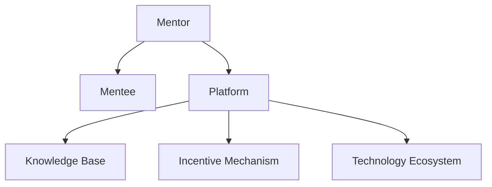

                 

# 技术mentoring：线上 的平台搭建与运营

> 关键词：技术 mentoring, 线上平台, 软件架构, 社区运营, 技术生态

## 1. 背景介绍

### 1.1 问题由来
随着互联网技术的迅猛发展，线上技术社区、在线教育平台、企业协作工具等线上平台如雨后春笋般涌现，成为连接人与人、人与知识的桥梁。然而，这些平台的快速发展也伴随着一系列技术挑战：如何构建一个高效、可扩展、易用的线上平台？如何吸引、留住活跃的用户群体？如何构建健康、活跃的技术生态？

技术 mentoring（导师制），作为一种通过专家指导、知识分享的方式，帮助初学者快速上手、提升技能，同时促进社区繁荣和知识传播的机制，成为线上平台的重要补充。在本文中，我们将详细介绍线上技术 mentoring 平台的核心概念、构建策略和运营实践，为开发者、企业和技术爱好者提供全面的指导。

### 1.2 问题核心关键点
线上技术 mentoring 平台的核心在于通过专家和社区的互动，提供高质量的技术指导和资源分享。其关键点包括：
- **专家体系构建**：选择有丰富经验、知识广泛的技术专家作为导师，构建权威的技术社区。
- **知识传递方式**：通过一对一辅导、线上讨论、直播授课、代码Review等多种方式，实现高效的知识传递。
- **社区运营机制**：建立激励机制，吸引用户参与，提供活跃、有序的交流环境。
- **技术生态建设**：构建以用户为中心，覆盖各种技术栈的完整知识体系，促进技术人才的快速成长和社区的持续发展。

## 2. 核心概念与联系

### 2.1 核心概念概述

为更好地理解线上技术 mentoring 平台的搭建与运营，本节将介绍几个密切相关的核心概念：

- **线上技术 mentoring（技术 mentoring）**：通过在线平台实现技术知识和经验的传递，帮助用户快速学习、解决问题，促进社区的繁荣和发展。
- **导师（Mentor）**：具有丰富技术经验和知识储备，能够传授专业技能，解答疑难问题，指导新手成长的技术专家。
- **学员（Mentee）**：渴望学习新技术，提升技能，解决问题的新手或初级开发者。
- **平台（Platform）**：作为技术 mentoring 的核心基础设施，提供交流空间、知识库、工具集等资源，支持导师和学员之间的互动和知识传递。
- **知识库（Knowledge Base）**：汇聚专家经验、常见问题解答、代码示例等，为学员提供参考资料。
- **激励机制（Incentive Mechanism）**：通过奖励、认证、曝光等手段，鼓励导师和学员的积极参与，提升社区活跃度。
- **技术生态（Technology Ecosystem）**：围绕平台形成的以技术交流、知识共享、资源交换为核心的社区系统，促进技术的传播和创新。

这些核心概念之间的逻辑关系可以通过以下Mermaid流程图来展示：



这个流程图展示了大语言模型的核心概念及其之间的关系：

1. 导师通过平台与学员进行互动，分享知识。
2. 平台提供了知识库、激励机制等基础设施，支持导师和学员的交流。
3. 知识库是导师和学员共享经验的资源库。
4. 激励机制促进导师和学员的积极参与。
5. 技术生态是以平台为中心，汇聚各类技术社区的系统。

## 3. 核心算法原理 & 具体操作步骤
### 3.1 算法原理概述

线上技术 mentoring 平台的核心算法原理，在于通过构建高效的技术知识传递机制，实现导师与学员之间的一对多或多对多的交流与指导。其关键在于：

- **推荐算法**：通过分析导师与学员之间的互动记录，匹配最合适的导师和学员，提升知识传递效率。
- **知识图谱**：构建导师和学员的知识图谱，帮助学员快速找到相关的专家和知识资源。
- **实时互动**：通过聊天、直播、代码Review等实时互动方式，促进导师和学员的深度交流。
- **内容推荐**：根据学员的学习进度和兴趣，推荐适合的课程、文章、代码片段，帮助学员持续学习。

### 3.2 算法步骤详解

线上技术 mentoring 平台的构建和运营，主要包括以下几个关键步骤：

**Step 1: 确定平台定位与目标用户**
- 明确平台的定位和目标用户群体，如面向开发者、学生、企业等。
- 定义平台的服务范围和功能，如技术讨论、问题解答、课程学习等。

**Step 2: 设计导师和学员体系**
- 招募具有丰富技术经验、愿意分享知识的专家作为导师。
- 设计学员的注册流程和评估机制，确保学员的素质和积极性。

**Step 3: 搭建技术平台**
- 选择合适的技术栈（如React、Vue、Django等）进行平台开发。
- 实现平台的基本功能，包括用户注册登录、知识库管理、互动交流等。

**Step 4: 构建知识库与激励机制**
- 收集整理导师的经验分享、技术文章、代码片段等，构建知识库。
- 设计激励机制，如奖励积分、认证证书、社区荣誉等，鼓励导师和学员的积极参与。

**Step 5: 进行平台测试与迭代优化**
- 邀请目标用户进行测试，收集反馈意见。
- 根据用户反馈，持续优化平台的性能和用户体验。

**Step 6: 推广与运营**
- 利用社交媒体、技术论坛等渠道进行平台推广。
- 组织线上活动，如直播授课、技术交流会等，提升平台的活跃度和知名度。

### 3.3 算法优缺点

线上技术 mentoring 平台的算法具有以下优点：
1. 高效传递知识：通过推荐算法和实时互动，导师和学员之间的知识传递效率高，学员能够快速提升技能。
2. 社区氛围活跃：激励机制和知识图谱建设，提升社区的活跃度和参与度。
3. 多样化交流方式：支持多种交流方式，满足不同用户的学习需求。

同时，该算法也存在一些局限性：
1. 依赖专家资源：平台的价值高度依赖于导师的质量，导师数量和质量的提升需要时间。
2. 平台运营成本高：平台的构建、运营和维护需要投入大量人力和资源。
3. 用户参与门槛高：部分用户可能对平台不了解，不愿意参与。
4. 知识结构难以统一：知识库的构建需要时间和成本，不同导师的知识结构难以统一。

尽管存在这些局限性，但就目前而言，线上技术 mentoring 平台在技术社区、在线教育、企业协作等领域的应用已经取得了显著效果，成为技术学习和交流的重要手段。

### 3.4 算法应用领域

线上技术 mentoring 平台的算法，已在技术社区、在线教育、企业协作等多个领域得到广泛应用，如：

- **技术社区**：如Stack Overflow、GitHub等，提供技术问答、代码Review、项目协作等功能。
- **在线教育**：如Udemy、Coursera等，提供在线课程学习、技术导师指导等功能。
- **企业协作**：如Slack、Microsoft Teams等，提供实时沟通、代码共享、项目管理等功能。

除了上述这些经典应用外，线上技术 mentoring 平台还被创新性地应用到更多场景中，如开源项目、技术竞赛、企业内训等，为技术人才的培养和技术生态的构建提供了新的平台。

## 4. 数学模型和公式 & 详细讲解 & 举例说明
### 4.1 数学模型构建

本节将使用数学语言对线上技术 mentoring 平台的构建过程进行更加严格的刻画。

记平台上的用户为 $U=\{u_i\}_{i=1}^N$，其中 $u_i=(u_i^T, u_i^C)$ 分别表示用户的技术背景 $u_i^T$ 和社区参与度 $u_i^C$。设平台的知识库为 $K=\{k_j\}_{j=1}^M$，其中 $k_j=(k_j^T, k_j^C)$ 分别表示知识的覆盖范围 $k_j^T$ 和热度 $k_j^C$。

定义用户 $u_i$ 在知识 $k_j$ 上的兴趣度为 $I(u_i, k_j)$，表示用户对知识的兴趣程度。同时定义知识库 $K$ 在用户 $u_i$ 上的影响力 $F(u_i, K)$，表示知识对用户的影响效果。

根据兴趣度与影响力的关系，可建立知识推荐模型：

$$
R(u_i, K) = \sum_{j=1}^M I(u_i, k_j) \times F(u_i, K)
$$

在用户 $u_i$ 提交查询 $q$ 时，根据其兴趣度和知识库的影响力，推荐最相关的知识 $k_j$：

$$
k_j^* = \mathop{\arg\max}_{j=1}^M I(u_i, k_j) \times F(u_i, K)
$$

### 4.2 公式推导过程

为了计算用户 $u_i$ 对知识 $k_j$ 的兴趣度 $I(u_i, k_j)$，可以定义一个向量 $r_{u_i}$ 表示用户 $u_i$ 的技术背景，定义一个向量 $r_{k_j}$ 表示知识 $k_j$ 的覆盖范围。则兴趣度可以表示为：

$$
I(u_i, k_j) = r_{u_i} \cdot r_{k_j}
$$

为了计算知识库 $K$ 在用户 $u_i$ 上的影响力 $F(u_i, K)$，可以定义一个向量 $s_{k_j}$ 表示知识 $k_j$ 的热度。则影响力可以表示为：

$$
F(u_i, K) = \frac{1}{M} \sum_{j=1}^M s_{k_j}
$$

将这些公式代入知识推荐模型，得：

$$
R(u_i, K) = \sum_{j=1}^M (r_{u_i} \cdot r_{k_j}) \times \frac{1}{M} \sum_{j=1}^M s_{k_j}
$$

在用户提交查询 $q$ 时，可以计算其与所有知识的兴趣度，选择兴趣度最高的知识作为推荐结果：

$$
k_j^* = \mathop{\arg\max}_{j=1}^M r_{u_i} \cdot r_{k_j}
$$

这个公式展示了如何通过数学模型计算知识推荐结果，从而实现高效的知识传递。

### 4.3 案例分析与讲解

以在线教育平台为例，平台上的知识推荐系统可以基于学生的学习行为和历史表现，推荐适合的课程和教材。具体实现步骤如下：

1. 收集学生的学习数据，包括已完成的课程、考试成绩、学习时长等。
2. 使用数据挖掘和机器学习技术，构建学生兴趣度模型 $I(u_i, K)$ 和知识库影响力模型 $F(u_i, K)$。
3. 当学生提交学习请求时，根据其兴趣度模型和知识库影响力模型，推荐最相关的课程和教材。

如学生在数学领域学习中表现优异，且已学习过高等数学和线性代数，则知识推荐系统可以推荐更深入的微积分、概率论等课程，帮助学生继续深造。

## 5. 项目实践：代码实例和详细解释说明
### 5.1 开发环境搭建

在进行线上技术 mentoring 平台的开发实践前，我们需要准备好开发环境。以下是使用React和Firebase进行平台开发的开发环境配置流程：

1. 安装Node.js和React CLI：从官网下载并安装Node.js和React CLI，用于创建React应用。

2. 创建React应用：
```bash
npx create-react-app mentor-platform
```

3. 初始化Firebase：
```bash
firebase init
```

4. 安装第三方库：
```bash
npm install firebase react-query axios @material-ui/core
```

完成上述步骤后，即可在开发环境中开始实践。

### 5.2 源代码详细实现

这里我们以GitHub为例，提供一个基于React和Firebase实现的线上技术 mentoring 平台的源代码实现。

首先，定义用户模型：

```javascript
import { document } from 'firebase/firestore';

class User {
  constructor(uid) {
    this.uid = uid;
    this.interests = [];
    this.activities = [];
  }

  setInterest(interest) {
    this.interests.push(interest);
  }

  setActivity(activity) {
    this.activities.push(activity);
  }
}
```

然后，实现用户注册和登录功能：

```javascript
import { useState } from 'react';
import { auth } from './firebase';
import User from './User';

export default function Register() {
  const [email, setEmail] = useState('');
  const [password, setPassword] = useState('');
  const [user, setUser] = useState(new User(''));
  
  async function handleSubmit(e) {
    e.preventDefault();
    try {
      await auth.createUserWithEmailAndPassword(email, password);
      setUser(new User(auth.currentUser.uid));
    } catch (error) {
      console.error(error);
    }
  }

  return (
    <form onSubmit={handleSubmit}>
      <input type="email" value={email} onChange={(e) => setEmail(e.target.value)} />
      <input type="password" value={password} onChange={(e) => setPassword(e.target.value)} />
      <button type="submit">Register</button>
    </form>
  );
}
```

接着，实现知识库和推荐功能：

```javascript
import { useEffect, useState } from 'react';
import { doc, getDocs, query } from 'firebase/firestore';

export default function Home() {
  const [knowledge, setKnowledge] = useState([]);
  
  useEffect(() => {
    const querySnapshot = getDocs(query(db.collection('knowledge')));
    const knowledgeData = querySnapshot.docs.map((doc) => {
      const knowledge = doc.data();
      knowledge.id = doc.id;
      return knowledge;
    });
    setKnowledge(knowledgeData);
  }, []);

  function searchInterest() {
    const interest = prompt('Enter your interest:');
    const user = knowledge.filter(k => k.interests.includes(interest));
    return user;
  }

  return (
    <div>
      <h1>Knowledge Base</h1>
      <ul>
        {knowledge.map((item) => (
          <li key={item.id}>{item.title}</li>
        ))}
      </ul>
      <button onClick={searchInterest}>Search</button>
    </div>
  );
}
```

最后，实现实时互动和直播功能：

```javascript
import { useEffect, useState } from 'react';
import { collection, query, where, getDocs, getFirestore } from 'firebase/firestore';

export default function Chat() {
  const [messages, setMessages] = useState([]);
  const db = getFirestore();
  
  useEffect(() => {
    const messagesRef = collection(db, 'messages');
    const unsubscribe = messagesRef.orderBy('timestamp').onSnapshot((snapshot) => {
      setMessages(snapshot.docs.map((doc) => doc.data()));
    });
    return () => unsubscribe();
  }, []);

  function sendMessage(text) {
    const db = getFirestore();
    const messagesRef = collection(db, 'messages');
    messagesRef.add({ text, timestamp: Date.now() });
  }

  return (
    <div>
      <h1>Chat</h1>
      <ul>
        {messages.map((message) => (
          <li key={message.id}>{message.text}</li>
        ))}
      </ul>
      <input type="text" onChange={(e) => setMessage(e.target.value)} />
      <button onClick={() => sendMessage(message)}>Send</button>
    </div>
  );
}
```

以上就是使用React和Firebase进行线上技术 mentoring 平台开发的完整代码实现。可以看到，通过React的前端组件和Firebase的后端支持，开发者可以快速搭建一个具备基本功能的平台，并对其进行进一步优化。

### 5.3 代码解读与分析

让我们再详细解读一下关键代码的实现细节：

**User类**：
- `constructor`方法：初始化用户的uid、兴趣列表和活动列表。
- `setInterest`方法：向用户兴趣列表添加新的兴趣。
- `setActivity`方法：向用户活动列表添加新的活动。

**Register组件**：
- `handleSubmit`方法：处理用户提交表单的操作。
- `setUser`状态：存储当前用户信息。
- `input`元素：接收用户输入的email和password。

**Home组件**：
- `useEffect`方法：查询知识库数据，并将其存储在组件状态中。
- `searchInterest`方法：根据用户输入的兴趣，查询知识库中的相关知识。
- `getDocs`方法：从火存储中查询文档。
- `query`方法：构建查询条件。

**Chat组件**：
- `useEffect`方法：订阅消息集合的变化，实时获取最新的消息。
- `sendMessage`方法：将消息发送到火存储中。
- `messages`状态：存储所有消息数据。

可以看到，React和Firebase提供了强大的组件化和数据管理能力，开发者可以高效地实现平台的基本功能。然而，在实际应用中，还需要进行更多的优化和扩展，以满足实际需求。

## 6. 实际应用场景
### 6.1 智能教育

在线教育平台利用线上技术 mentoring 技术，提供个性化的课程推荐和学习指导，帮助学生快速提升技能。通过分析学生的学习行为和成绩，平台可以推荐最适合的课程和教材，甚至安排专家的一对一辅导，帮助学生解决学习中的疑难问题。

以Khan Academy为例，其在线课程平台通过学生的操作记录和测试成绩，推荐相关课程和练习题，同时利用专家资源提供解答和指导，显著提升了学生的学习效果。

### 6.2 企业培训

企业可以利用线上技术 mentoring 平台，为员工提供持续的技能培训和知识分享。平台可以结合公司的业务需求和技术栈，提供有针对性的课程和学习资源，同时安排公司内部的技术专家进行线上或线下培训，帮助员工快速掌握新技能。

以Google的内部培训平台为例，其通过平台提供多样化的培训课程和技术交流活动，大大提升了员工的职业技能和团队协作能力，支持了公司的快速发展和创新。

### 6.3 开源社区

开源社区可以利用线上技术 mentoring 平台，促进项目的协作和知识传播。平台可以提供代码Review、问题解答、技术讨论等功能，帮助开发者解决开发中的问题，提高代码质量。

以GitHub为例，其社区通过平台提供的协作工具和知识库，大大提升了开源项目的维护效率和质量，吸引了大量的开发者贡献代码和知识，促进了技术生态的繁荣发展。

### 6.4 未来应用展望

随着线上技术 mentoring 平台的不断完善，其应用场景将会更加广泛，影响也将更加深远。未来，我们可以预见以下几方面的发展趋势：

1. **多模态交流**：未来的平台将不仅仅局限于文本交流，还将支持音频、视频等多模态交流方式，提升交流的便捷性和丰富性。
2. **智能推荐**：利用AI技术，平台可以更好地分析用户的学习行为和兴趣，提供更加精准的课程和资源推荐。
3. **跨领域交流**：平台将打破技术栈和领域的界限，促进不同领域的专家和开发者交流，推动技术的融合和创新。
4. **个性化学习**：平台将结合用户的学习进度和偏好，提供个性化的学习路径和资源，提升学习效率。
5. **全球化社区**：平台将打破地域限制，构建全球化的技术交流和学习社区，促进技术的全球传播和创新。

## 7. 工具和资源推荐
### 7.1 学习资源推荐

为了帮助开发者系统掌握线上技术 mentoring 技术，以下是几篇有深度的学习资源推荐：

1. **《Firebase 入门教程》**：详细介绍了Firebase的基本概念和使用方法，适合初学者入门。
2. **《React 官方文档》**：React的官方文档，提供了详细的API和组件使用指南，适合深入学习。
3. **《Web前端开发实战》**：介绍Web前端开发的基础知识和高级技巧，适合进阶学习。
4. **《自然语言处理》**：介绍自然语言处理的基本原理和应用场景，适合了解技术背景。
5. **《人工智能导论》**：介绍人工智能的基本概念和应用方向，适合对技术有全面了解。

这些学习资源覆盖了线上技术 mentoring 平台的关键技术栈和理论知识，适合不同层次的开发者进行系统学习。

### 7.2 开发工具推荐

在线技术 mentoring 平台的开发离不开高效的工具支持。以下是几款推荐的开发工具：

1. **Firebase**：谷歌提供的云端后端服务，包括数据库、身份验证、推送通知等功能，适合快速搭建平台。
2. **React**：Facebook推出的前端框架，具有高效、灵活的组件化特性，适合搭建动态交互界面。
3. **Vue**：一款流行的前端框架，具有易学易用、性能优秀的特点，适合构建复杂的前端应用。
4. **Axios**：一款基于Promise的HTTP客户端库，方便进行网络请求和数据传输。
5. **Material-UI**：基于Material Design风格的UI库，提供丰富的组件和样式，适合快速构建UI界面。

这些工具和技术栈能够满足线上技术 mentoring 平台的不同需求，提升开发效率和用户体验。

### 7.3 相关论文推荐

线上技术 mentoring 技术的发展得益于学界的持续研究。以下是几篇重要的相关论文，推荐阅读：

1. **《Firebase: Realtime Database》**：介绍了Firebase实时数据库的基本原理和使用方法，适合了解Firebase技术栈。
2. **《React: A Library for Building User Interfaces》**：React的作者论文，详细介绍了React的设计理念和组件化思想，适合深入学习。
3. **《Fine-grained Semantic Understanding of Code Comments》**：介绍了通过代码注释进行细粒度语义理解的论文，适合了解代码分析技术。
4. **《Language Models are Unsupervised Multitask Learners》**：GPT-2的作者论文，展示了预训练语言模型的强大零样本学习能力，适合了解预训练技术。
5. **《Parameter-Efficient Transfer Learning for NLP》**：介绍参数高效转移学习的论文，适合了解微调技术。

这些论文代表了大语言模型微调技术的发展脉络，对于深入理解线上技术 mentoring 平台的技术原理和应用场景具有重要意义。

## 8. 总结：未来发展趋势与挑战
### 8.1 总结

本文对线上技术 mentoring 平台的搭建与运营进行了全面系统的介绍。首先阐述了线上技术 mentoring 平台的定位和目标用户，明确了平台的价值和应用场景。其次，从原理到实践，详细讲解了平台的算法设计、功能实现和优化策略，给出了完整的代码实例。同时，本文还探讨了平台在智能教育、企业培训、开源社区等领域的实际应用，展示了平台的技术价值和广阔前景。

通过本文的系统梳理，可以看到，线上技术 mentoring 平台不仅能够提升用户的技能和知识水平，还能够构建活跃的技术生态，促进技术的传播和创新。其高效的知识传递机制和多样化的交流方式，使其在众多领域的应用前景广阔。

### 8.2 未来发展趋势

展望未来，线上技术 mentoring 平台将呈现以下几个发展趋势：

1. **多模态交流**：未来的平台将支持音频、视频、实时互动等多种交流方式，提升交流的便捷性和丰富性。
2. **智能推荐**：利用AI技术，平台可以提供更加精准的知识推荐和课程学习路径，提升学习效果。
3. **全球化社区**：平台将打破地域限制，构建全球化的技术交流和学习社区，促进技术的全球传播和创新。
4. **多领域应用**：平台将拓展到更多领域，如医疗、金融、制造业等，帮助不同行业的技术人才提升技能。
5. **个性化学习**：平台将结合用户的学习进度和偏好，提供个性化的学习路径和资源，提升学习效率。

### 8.3 面临的挑战

尽管线上技术 mentoring 平台已经取得了显著成果，但在迈向更加智能化、普适化应用的过程中，它仍面临着诸多挑战：

1. **平台扩展性**：随着用户和导师数量的增加，平台需要具备良好的扩展性和可维护性。
2. **数据隐私和安全**：平台需要严格保障用户数据的安全和隐私，防止数据泄露和滥用。
3. **内容质量控制**：如何确保内容的真实性和准确性，防止虚假信息和有害内容的传播。
4. **技术门槛**：部分用户可能对平台的使用方法和技术背景不够了解，难以充分发挥平台的功能。
5. **激励机制设计**：如何设计有效的激励机制，促进导师和学员的积极参与，提升平台活跃度。

尽管存在这些挑战，但随着技术的不断进步和用户需求的不断变化，线上技术 mentoring 平台必将在技术社区、在线教育、企业培训等多个领域发挥更大的作用，为技术人才的培养和技术的传播提供新的平台。

### 8.4 研究展望

面对线上技术 mentoring 平台所面临的挑战，未来的研究需要在以下几个方面寻求新的突破：

1. **平台架构优化**：研究分布式架构和微服务设计，提升平台的扩展性和可维护性。
2. **数据隐私保护**：研究数据加密、访问控制等技术，确保用户数据的安全和隐私。
3. **内容质量控制**：研究机器学习和大数据分析技术，提升内容的真实性和准确性。
4. **用户友好设计**：研究用户体验设计和用户行为分析，提升平台的易用性和用户体验。
5. **激励机制设计**：研究经济激励和社会激励的结合，促进导师和学员的积极参与。

这些研究方向将引领线上技术 mentoring 平台向更高的层次迈进，为技术人才的培养和技术的传播提供更加全面、高效的平台。

## 9. 附录：常见问题与解答

**Q1：如何确保线上技术 mentoring 平台的用户数据隐私安全？**

A: 确保线上技术 mentoring 平台的用户数据隐私安全，需要采取以下措施：
1. 数据加密：采用加密算法对用户数据进行加密存储和传输，防止数据泄露。
2. 访问控制：限制对用户数据的访问权限，确保只有授权人员能够访问用户数据。
3. 审计日志：记录和监控平台的操作日志，及时发现和处理异常行为。
4. 合规性检查：定期进行合规性检查，确保平台符合相关法律法规和标准。

**Q2：线上技术 mentoring 平台应该如何构建激励机制？**

A: 构建有效的激励机制，可以提升平台的用户参与度和活跃度。以下是一些常见的激励方式：
1. 奖励积分：为学员和导师提供积分奖励，积分可兑换课程、证书、勋章等。
2. 认证证书：为优秀的导师和学员提供认证证书，提升其知名度和权威性。
3. 曝光机会：为优秀的学员和导师提供平台广告位、专题采访等曝光机会，增加曝光度。
4. 社区荣誉：为优秀的学员和导师颁发荣誉，如年度优秀学员、金牌导师等，增强荣誉感。

**Q3：线上技术 mentoring 平台如何优化推荐算法？**

A: 优化推荐算法可以提升知识推荐的效果，以下是一些优化方法：
1. 数据预处理：清洗和处理推荐数据，去除无效和重复数据，提升推荐结果的准确性。
2. 特征工程：设计更多、更有效的特征，提升模型对用户兴趣和知识特征的捕捉能力。
3. 模型选择：选择合适的推荐算法模型，如协同过滤、基于内容的推荐、基于知识的推荐等。
4. 实时更新：根据用户行为和兴趣的动态变化，实时更新推荐结果，提升推荐的时效性。

这些措施能够有效提升线上技术 mentoring 平台的推荐效果，增强用户体验和平台吸引力。

**Q4：线上技术 mentoring 平台如何进行扩展？**

A: 为了满足不断增长的用户和导师数量，线上技术 mentoring 平台需要进行扩展，以下是一些扩展策略：
1. 分布式架构：采用分布式架构，提升平台的扩展性和可用性。
2. 微服务设计：采用微服务设计，提高服务的灵活性和可维护性。
3. 缓存技术：采用缓存技术，提升平台的响应速度和吞吐量。
4. 负载均衡：采用负载均衡技术，确保平台的高可用性和性能稳定。

这些措施能够有效提升线上技术 mentoring 平台的扩展能力，满足大规模用户的访问需求。

**Q5：线上技术 mentoring 平台如何进行用户引导？**

A: 为了提升用户体验，线上技术 mentoring 平台需要进行用户引导，以下是一些引导策略：
1. 新手引导：提供新手引导流程，帮助用户快速上手平台。
2. 帮助文档：提供详细的使用帮助文档，帮助用户解决常见问题。
3. 实时帮助：提供实时帮助功能，用户可以随时向管理员或专家咨询问题。
4. 用户反馈：收集用户反馈，及时调整和优化平台的各项功能。

这些措施能够有效提升用户的平台体验，促进平台的健康发展。

---

作者：禅与计算机程序设计艺术 / Zen and the Art of Computer Programming

