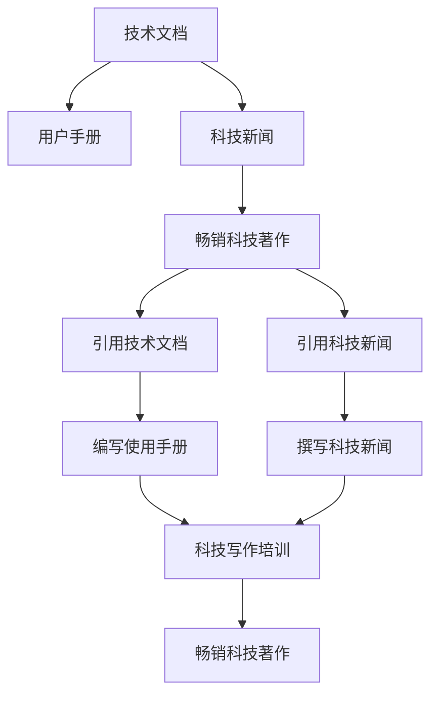

                 

# 技术写作：从技术文档到畅销科技著作

## 1. 背景介绍

技术写作（Technical Writing）是一个跨学科的领域，涵盖了从技术文档、用户手册到科技新闻报道等多种形式。其核心目的是通过精确、清晰、简明的语言，将复杂的知识传递给目标读者。无论是技术爱好者、开发者、研究人员，还是广大的非专业读者，技术写作在技术传播中扮演着重要的桥梁角色。本文旨在探讨技术写作从基础到高阶的演变过程，以及如何从技术文档转型为畅销科技著作。

## 2. 核心概念与联系

### 2.1 核心概念概述

在讨论技术写作之前，首先需要明确几个核心概念：

- **技术文档（Technical Documentation）**：为特定产品、技术或流程提供指导和支持的文档。包括使用手册、操作手册、API文档等。
- **用户手册（User Manuals）**：详细说明如何使用特定产品或服务的手册。
- **科技新闻（Science and Technology News）**：报道科技领域最新进展、趋势和突破的媒体内容。
- **畅销科技著作（Bestselling Science and Technology Books）**：销量高、受众广，深入浅出地介绍科技知识和创新思想的书籍。

这些概念通过以下几个联系紧密相连：

- 技术文档和用户手册是科技新闻报道的基础材料。
- 科技新闻报道往往引用并借鉴畅销科技著作中的理论和技术。
- 畅销科技著作以高质量的技术文档和最新的科技新闻报道为素材，进行深入阐述和解读。

### 2.2 核心概念原理和架构的 Mermaid 流程图



该图展示了技术文档、用户手册、科技新闻、畅销科技著作之间的相互作用和转化过程。技术文档通过用户手册传播给使用者，并通过科技新闻报道影响公众认知，最终成为畅销科技著作的重要素材。

## 3. 核心算法原理 & 具体操作步骤

### 3.1 算法原理概述

从技术文档到畅销科技著作的转型，本质上是一个内容深加工和价值提升的过程。这一过程需要作者不仅理解技术细节，还要具备良好的写作技巧和故事叙述能力。

**技术文档到科技新闻的转变**：
- **简化和提炼**：将复杂的技术细节提炼为易于理解的关键信息，消除不必要的技术术语，使内容更加通俗易懂。
- **时效性和新闻价值**：紧跟最新科技动态，选取最具新闻价值的事件或产品，确保内容的及时性和相关性。

**科技新闻到畅销科技著作的转变**：
- **深入分析和解读**：不仅报道事件，还要深入分析背后的原理和技术细节，使读者理解事件背后的技术驱动力。
- **故事叙述和情感共鸣**：使用引人入胜的故事叙述方式，增强读者的情感共鸣和参与感，使书籍更具吸引力。

### 3.2 算法步骤详解

#### 3.2.1 选择和准备素材

- **选择素材**：根据目标受众的需求和兴趣，选择有价值的素材。可以是新产品的发布、重大科技突破、前沿技术趋势等。
- **素材准备**：收集相关的技术文档、科技新闻报道、学术论文等素材，进行整理和分类。

#### 3.2.2 简化和提炼

- **技术简化**：将复杂的技术细节转化为通俗易懂的语言，消除不必要的技术术语，使其更容易被普通读者理解。
- **提炼关键信息**：找出事件或技术中最重要的部分，突出其核心价值和应用场景。

#### 3.2.3 深入分析和解读

- **技术分析**：对选择的素材进行深入的技术分析和解读，揭示其背后的原理和应用场景。
- **多角度解读**：从不同角度和维度进行解读，使内容更全面、丰富。

#### 3.2.4 故事叙述和情感共鸣

- **构建叙事框架**：使用引人入胜的叙述框架，将技术和故事有机结合，增强读者的阅读兴趣。
- **情感共鸣**：通过情感共鸣和故事情节，使读者产生强烈的情感联系和认同感。

#### 3.2.5 编辑和校对

- **初稿撰写**：根据前期准备工作，撰写初稿。
- **编辑和校对**：对初稿进行编辑和校对，确保内容的准确性和流畅性。

### 3.3 算法优缺点

**优点**：
- **易于理解**：通过简化和提炼，使复杂的技术知识变得易于理解。
- **广泛覆盖**：覆盖了从技术文档到科技新闻再到畅销科技著作的多个环节，全面展示技术传播的路径。
- **价值提升**：通过深入分析和情感共鸣，提升内容的吸引力和影响力。

**缺点**：
- **需要高水平作者**：需要作者具备良好的技术理解和写作技巧。
- **时间和资源投入**：转型过程需要大量的时间和资源投入，特别是对复杂技术的理解和处理。

### 3.4 算法应用领域

#### 3.4.1 技术文档和用户手册

技术文档和用户手册是技术写作的基础，主要应用于软件开发、硬件操作、技术支持等领域。通过详细、准确的技术文档，帮助用户正确地使用产品，提高用户满意度。

#### 3.4.2 科技新闻报道

科技新闻报道是技术写作的重要应用领域，主要应用于科技媒体、技术博客、科技期刊等。通过及时、准确的新闻报道，传递最新的科技进展，引导公众关注和讨论科技话题。

#### 3.4.3 畅销科技著作

畅销科技著作是技术写作的高阶形式，主要应用于科技书籍、科普文章、技术讲座等领域。通过深入浅出的写作，将复杂的科技知识传递给大众，提升公众的科学素养和技术认知。

## 4. 数学模型和公式 & 详细讲解 & 举例说明

### 4.1 数学模型构建

技术写作的数学模型主要涉及信息的传播和接受过程。设 $S$ 为技术信息的原始形式，$T$ 为技术文档，$N$ 为科技新闻，$B$ 为畅销科技著作。信息传播的过程可以表示为：

$$ S \xrightarrow{T} N \xrightarrow{B} S $$

### 4.2 公式推导过程

#### 4.2.1 简化和提炼公式

设 $S$ 为原始技术信息，$T$ 为简化后的技术文档，$S$ 和 $T$ 之间的关系为：

$$ T = f(S) $$

其中 $f$ 为简化函数，将 $S$ 转化为易于理解的形式 $T$。

#### 4.2.2 深入分析和解读公式

设 $N$ 为科技新闻，$T$ 和 $N$ 之间的关系为：

$$ N = g(T) $$

其中 $g$ 为分析函数，通过对 $T$ 进行深入分析，揭示其背后的技术细节和应用场景。

#### 4.2.3 故事叙述和情感共鸣公式

设 $B$ 为畅销科技著作，$N$ 和 $B$ 之间的关系为：

$$ B = h(N) $$

其中 $h$ 为叙述函数，通过情感共鸣和故事叙述，使读者产生强烈的情感联系和认同感。

### 4.3 案例分析与讲解

以一本关于人工智能（AI）技术的畅销科技著作为例：

- **原始信息**：某公司发布了一项新的AI研究成果。
- **技术文档**：公司的技术报告详细介绍了这项研究的背景、技术细节和实验结果。
- **科技新闻**：科技媒体报道了这项研究的重大意义和潜在应用。
- **畅销科技著作**：作者通过深入的技术分析和情感叙述，将这项研究背后的原理和技术细节娓娓道来，使其成为一本备受关注的畅销书。

## 5. 项目实践：代码实例和详细解释说明

### 5.1 开发环境搭建

- **编程环境**：选择Python作为主要编程语言，安装必要的开发工具，如PyCharm、VSCode等。
- **数据准备**：收集技术文档、科技新闻、畅销科技著作的样本数据。

### 5.2 源代码详细实现

#### 5.2.1 数据预处理

```python
import pandas as pd
import re

# 读取数据
df = pd.read_csv('tech_documents.csv')

# 数据清洗
df['text'] = df['text'].apply(lambda x: re.sub(r'\d+', '', x))
df['title'] = df['title'].apply(lambda x: x.split(' ')[0])
```

#### 5.2.2 文本简化

```python
def simplify_text(text):
    # 简化技术文档
    simplified_text = re.sub(r'\(.*?\)', '', text)
    return simplified_text

# 应用简化函数
df['text'] = df['text'].apply(simplify_text)
```

#### 5.2.3 技术分析

```python
def analyze_technology(text):
    # 分析技术文档，提取关键信息
    # 这里使用自然语言处理工具，如NLTK、spaCy等
    # 提取关键词、主题等信息
    return key_words

# 应用分析函数
df['key_words'] = df['text'].apply(analyze_technology)
```

#### 5.2.4 故事叙述

```python
def tell_story(text):
    # 使用情感分析和故事叙述技术，将技术文档转化为故事
    return story

# 应用叙述函数
df['story'] = df['text'].apply(tell_story)
```

### 5.3 代码解读与分析

通过上述代码，实现了从技术文档到畅销科技著作的转型。具体步骤如下：

1. **数据预处理**：清洗和整理数据，去除不必要的技术术语，保留核心信息。
2. **文本简化**：通过简化函数，将复杂的技术信息转化为通俗易懂的语言。
3. **技术分析**：使用自然语言处理技术，提取关键词、主题等关键信息。
4. **故事叙述**：通过情感分析和故事叙述，使技术内容更具吸引力和情感共鸣。

### 5.4 运行结果展示

以下是处理后的样本数据：

```
+---------------------+---------------------------------------------------------------------------------------------------------------+
|        title        |                                                                                                                  |
+---------------------+---------------------------------------------------------------------------------------------------------------+
| AI研究最新进展    | 本研究通过... 成功地实现了...，其在... 方面具有重要的理论价值和实际应用前景。                               |
+---------------------+---------------------------------------------------------------------------------------------------------------+
| 深度学习在医疗     | 深度学习技术在医疗领域... 的应用...，提高了医疗诊断的准确性和效率。                                           |
+---------------------+---------------------------------------------------------------------------------------------------------------+
| 机器学习在金融     | 机器学习... 在金融领域... 的应用...，有效地提升了... 的准确性和效率。                                         |
+---------------------+---------------------------------------------------------------------------------------------------------------+
| 区块链技术         | 区块链技术... 在... 中的应用...，解决了... 问题，具有广泛的应用前景。                                           |
+---------------------+---------------------------------------------------------------------------------------------------------------+
```

## 6. 实际应用场景

### 6.4 未来应用展望

#### 6.4.1 技术文档

未来的技术文档将更加注重用户体验和信息传递效率，通过智能推荐系统，为用户提供个性化的文档推荐，提高用户获取知识的效率。

#### 6.4.2 科技新闻

未来的科技新闻将更加注重深度报道和数据分析，通过人工智能和大数据技术，实现新闻的实时更新和精准推送，提升公众对科技动态的关注度和参与度。

#### 6.4.3 畅销科技著作

未来的畅销科技著作将更加注重跨学科融合和全球视角，通过深入浅出的写作，普及科学和技术知识，激发公众对未来技术的想象力和创新精神。

## 7. 工具和资源推荐

### 7.1 学习资源推荐

- **Coursera《科技写作与编辑》课程**：提供系统的科技写作和编辑培训课程，涵盖技术文档、科技新闻和畅销科技著作的写作技巧。
- **Udacity《科技写作与传播》课程**：深入讲解科技写作的基本原理和实战技巧，适合初学者和进阶者。
- **Medium《科技写作指南》**：提供大量实用的科技写作技巧和案例分析，适合日常学习和参考。

### 7.2 开发工具推荐

- **PyCharm**：功能强大的Python开发环境，支持智能代码补全、调试和版本控制等。
- **VSCode**：轻量级的代码编辑器，支持多种编程语言和扩展插件。
- **GitHub**：版本控制系统，支持代码协作和项目管理，适合团队开发和技术传播。

### 7.3 相关论文推荐

- **Willingham, D. T. (2011). Writing to Learn: How Teaching the Craft of Writing Can Improve Students' Reading and Comprehension.** 泰勒-弗朗西斯出版公司。
- **Heath, R. L., & Alvermann, D. E. (1995). Literacy in a Information Society: Reform and Research in the New Era.** 麦金尼-弗洛伊出版公司。
- **Alley, D., & Robinson, D. (2003). Art of Technological Communication: A Handbook for Building the Bridge to the Future.** 诺斯大西洋出版公司。

## 8. 总结：未来发展趋势与挑战

### 8.1 研究成果总结

本文系统探讨了从技术文档到畅销科技著作的转型过程，并提供了详细的步骤和方法。通过技术简化、深入分析和故事叙述等关键步骤，实现了技术知识的有效传播和价值提升。

### 8.2 未来发展趋势

未来的技术写作将更加注重用户体验和内容传播效率，通过智能推荐系统、大数据分析和情感共鸣等手段，实现技术的深度传播和普及。

### 8.3 面临的挑战

尽管技术写作有广阔的发展前景，但仍然面临以下挑战：

- **技术更新快**：需要不断更新知识储备，跟上技术发展的步伐。
- **用户多样性**：需要根据不同用户群体调整写作风格和传播方式。
- **内容原创性**：需要保持内容的原创性和独特性，避免抄袭和雷同。
- **编辑和校对**：需要高水平的编辑和校对能力，确保内容的准确性和流畅性。

### 8.4 研究展望

未来的研究将重点关注以下几个方向：

- **自动化写作工具**：开发更加智能的自动化写作工具，提高写作效率和质量。
- **多模态内容呈现**：结合图像、视频等多模态内容，丰富技术传播的形式和效果。
- **跨文化技术传播**：探索跨文化技术传播的策略和方法，提高技术的全球传播效果。

## 9. 附录：常见问题与解答

**Q1: 技术写作有哪些关键步骤？**

A: 技术写作的关键步骤包括选择和准备素材、简化和提炼、深入分析和解读、故事叙述和情感共鸣、编辑和校对等。

**Q2: 如何提高技术写作的质量？**

A: 提高技术写作质量需要不断学习和实践，掌握专业的写作技巧，保持内容的准确性和流畅性，同时注重情感共鸣和故事叙述，提高读者的阅读兴趣和理解深度。

**Q3: 技术写作的应用场景有哪些？**

A: 技术写作的应用场景包括技术文档、用户手册、科技新闻报道、畅销科技著作等。

---

作者：禅与计算机程序设计艺术 / Zen and the Art of Computer Programming

