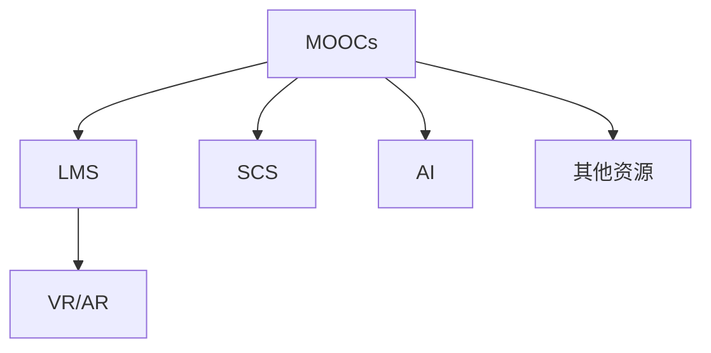

                 

# 技术分享：从线下会议到在线课程

## 1. 背景介绍

### 1.1 问题由来
随着互联网技术的快速发展，信息传播方式发生了革命性的变化。传统的线下会议，虽然具有面对面交流的便利，但在组织成本、参与人数、覆盖范围等方面存在明显局限。尤其是疫情的冲击，使得线下活动变得极为困难，加速了线上技术应用的趋势。

与此同时，在线课程、虚拟研讨会等线上形式，凭借其高效、灵活、覆盖广泛等优势，逐渐成为科技交流与知识传播的主要手段。在线课程不仅仅是简单的视频回放，而是一个系统化的知识传递和互动平台，具备丰富的教学资源和工具，满足了不同学习者的需求。

### 1.2 问题核心关键点
在线课程的核心在于如何构建高效、互动、自适应的学习环境，使其能够适应不同的学习者群体和教学场景。这包括：

1. **课程内容设计**：如何设计优质的课程内容，使其既有深度又有广度，既贴近实践又能启发思考。
2. **技术支持**：如何利用先进的技术手段，实现在线互动、实时反馈、自适应学习等关键功能。
3. **学习体验**：如何营造良好的学习体验，提高学生的参与度和满意度，激发学习兴趣。
4. **评估与反馈**：如何设计科学的评估机制，提供及时、有效的反馈，帮助学生掌握知识，提高学习效果。

本文将从这些关键点出发，系统探讨在线课程的设计、开发与实践，希望能为读者提供有价值的参考和指导。

## 2. 核心概念与联系

### 2.1 核心概念概述

在线课程的构建涉及多个领域的技术和知识，包括但不限于教育学、心理学、学习科学、计算机科学等。本文将重点介绍几个核心概念及其联系：

- **MOOCs**：大规模开放在线课程(Massive Open Online Courses)，通过互联网向全球用户提供免费或收费的在线学习资源。
- **LMS**：学习管理系统(Learning Management System)，提供课程管理、学习支持、互动交流等功能的平台。
- **SCS**：自适应学习系统(Self-Adaptive Learning System)，根据学生的学习情况和反馈，动态调整课程内容和难度。
- **AI**：人工智能，用于自动化评估、个性化推荐、情感识别等功能，提升在线学习的智能化水平。
- **VR/AR**：虚拟现实/增强现实技术，提供沉浸式学习体验，增强课程的互动性和趣味性。

这些概念之间存在紧密的联系，通过它们的有机结合，可以实现高效、个性化的在线课程。

### 2.2 核心概念原理和架构的 Mermaid 流程图



该流程图展示了MOOCs、LMS、SCS、AI和VR/AR等核心概念及其相互关系。MOOCs作为在线课程的载体，通过LMS提供学习管理与支持，利用SCS进行自适应学习，借助AI实现个性化推荐和自动化评估，引入VR/AR技术提供沉浸式学习体验，并整合其他辅助资源，共同构成完整的在线课程体系。

## 3. 核心算法原理 & 具体操作步骤

### 3.1 算法原理概述

在线课程的构建涉及多个算法和模型，其中关键算法包括：

- **推荐系统算法**：用于个性化课程推荐，提高学生的学习兴趣和效率。
- **自适应学习算法**：根据学生的学习进度和理解情况，动态调整课程难度和内容。
- **情感分析算法**：通过分析学生的互动和反馈，识别学习情绪，及时调整教学策略。
- **内容生成算法**：用于自动生成课程内容和练习题，丰富课程资源。

这些算法共同构建了在线课程的技术支撑体系，使其能够实现高效、个性化的学习。

### 3.2 算法步骤详解

以下是构建在线课程的关键算法步骤：

**Step 1: 数据收集与预处理**

- **学习数据收集**：从课程平台收集学生的学习行为数据，包括视频观看时间、互动评论、测试成绩等。
- **特征提取**：将收集到的数据转化为可供算法使用的特征向量。
- **数据清洗**：去除噪音数据，确保数据的质量和完整性。

**Step 2: 模型训练**

- **推荐模型训练**：基于学生的兴趣和行为数据，训练推荐系统模型，如协同过滤、矩阵分解等。
- **自适应模型训练**：根据学生的学习进度和理解情况，训练自适应学习模型，如深度神经网络、贝叶斯网络等。
- **情感分析模型训练**：利用情感分析算法，训练情感识别模型，如情感分类器、卷积神经网络等。
- **内容生成模型训练**：使用自然语言处理技术，训练内容生成模型，如语言模型、生成对抗网络等。

**Step 3: 模型应用与优化**

- **推荐应用**：在课程平台上实现个性化推荐功能，推荐适合学生的课程和资源。
- **自适应应用**：根据学生的学习情况，动态调整课程内容和难度，提高学习效率。
- **情感反馈应用**：实时分析学生的互动和反馈，识别学习情绪，调整教学策略。
- **内容生成应用**：自动生成课程内容和练习题，丰富课程资源。
- **模型优化**：持续收集反馈数据，优化推荐系统、自适应学习、情感分析和内容生成模型。

### 3.3 算法优缺点

在线课程的核心算法具有以下优点：

- **高效个性化**：能够根据学生的学习情况和偏好，提供定制化的课程推荐和学习路径。
- **实时互动**：通过互动交流和反馈机制，实现实时的学生学习跟踪和支持。
- **自适应学习**：动态调整课程难度和内容，适应学生的学习进度和理解能力。

同时，这些算法也存在一定的局限性：

- **数据依赖**：算法的效果高度依赖于学习数据的质量和数量，难以处理低质量或缺失数据。
- **模型复杂性**：算法的实现和维护需要高水平的技术团队和丰富的资源支持。
- **公平性问题**：个性化推荐可能导致学生之间的学习差距增大，影响学习公平性。
- **隐私保护**：学生的学习数据涉及隐私问题，需严格保护和管理。

### 3.4 算法应用领域

在线课程的核心算法在多个领域得到了广泛应用，包括但不限于：

- **企业培训**：通过在线课程平台，提供员工技能培训和职业发展课程，提升员工技能和绩效。
- **学术研究**：利用在线课程资源，提供科学研究和数据分析课程，支持科研团队的学术创新。
- **在线教育**：构建开放和免费的学习平台，满足不同人群的学习需求，促进教育公平。
- **职业发展**：提供职业规划、技能提升和行业动态等课程，帮助职场人士的职业发展。

这些应用领域展示了在线课程的广阔前景和深远影响。

## 4. 数学模型和公式 & 详细讲解 & 举例说明

### 4.1 数学模型构建

在线课程的算法构建通常涉及多个数学模型，以下是几个典型的数学模型：

- **协同过滤算法**：基于用户行为数据，预测用户对未尝试课程的评分，用于推荐系统。
- **深度神经网络**：用于自适应学习系统，根据学生的学习情况动态调整课程内容。
- **情感分类算法**：通过文本分析，识别学生的情感状态，用于情感分析。
- **语言模型**：用于内容生成系统，根据给定上下文自动生成文本内容。

### 4.2 公式推导过程

**协同过滤算法**：假设有一个用户集合 $U$ 和一个课程集合 $I$，用户对课程的评分矩阵为 $R \in \mathbb{R}^{m \times n}$，其中 $m$ 表示用户数量，$n$ 表示课程数量。协同过滤算法的目标是预测用户对未尝试课程的评分，公式如下：

$$
\hat{r}_{ui} = \frac{\sum_{v=1}^{m} r_{vi} \cdot a_{uv}}{\sqrt{\sum_{v=1}^{m} a_{uv}^2 + \epsilon}
$$

其中，$a_{uv}$ 表示用户 $u$ 和用户 $v$ 之间的相似度，$\epsilon$ 是正则化项。

**深度神经网络**：以长短期记忆网络(LSTM)为例，其结构如图：

```
input -- 隐藏层 -- output
```

输入 $x_t$ 经过隐藏层 $h_t$ 处理后，输出 $y_t$，公式如下：

$$
h_t = \tanh(W_h \cdot [h_{t-1}, x_t] + b_h)
$$

$$
y_t = softmax(W_y \cdot h_t + b_y)
$$

其中，$W_h$、$b_h$ 和 $W_y$、$b_y$ 为网络参数。

**情感分类算法**：假设有一个情感分类器 $C$，输入文本 $text$ 经过特征提取后，转化为向量 $vec$，分类器输出情感标签 $label$，公式如下：

$$
label = C(vec)
$$

其中，$vec$ 为特征提取后的文本向量，$C$ 为分类器模型。

**语言模型**：以LSTM语言模型为例，假设有一个上下文 $context$ 和一个词汇 $word$，其概率分布为 $P(word|context)$，公式如下：

$$
P(word|context) = \frac{exp(W_{word} \cdot [h_{t-1}, word] + b_{word})}{\sum_{w \in V} exp(W_{word} \cdot [h_{t-1}, w] + b_{word})}
$$

其中，$W_{word}$ 和 $b_{word}$ 为网络参数，$V$ 为词汇表。

### 4.3 案例分析与讲解

**推荐系统案例**：假设有10000个用户和10000门课程，每个用户对10门课程进行评分，利用协同过滤算法，计算用户 $u$ 对未尝试课程 $i$ 的评分预测值 $\hat{r}_{ui}$。假设 $a_{uv}$ 表示用户 $u$ 和用户 $v$ 的相似度，可以通过余弦相似度计算。

**自适应学习案例**：假设有一个深度神经网络，用于自适应学习系统，根据学生的学习情况动态调整课程难度和内容。假设学生 $s$ 在当前课程 $c$ 上的成绩为 $score_s^c$，利用深度神经网络，计算学生 $s$ 在课程 $c$ 上未来的学习难度 $difficulty_s^{c+1}$，公式如下：

$$
difficulty_s^{c+1} = \sigma(W_{difficulty} \cdot [score_s^c, c] + b_{difficulty})
$$

其中，$W_{difficulty}$ 和 $b_{difficulty}$ 为网络参数，$\sigma$ 为激活函数。

**情感分析案例**：假设有一个情感分类器，输入文本为学生 $u$ 的互动评论 $text_u$，经过特征提取后转化为向量 $vec_u$，分类器输出情感标签 $label_u$，公式如下：

$$
label_u = C(vec_u)
$$

其中，$C$ 为分类器模型，$vec_u$ 为特征提取后的文本向量。

## 5. 项目实践：代码实例和详细解释说明

### 5.1 开发环境搭建

在进行在线课程开发前，需要准备好开发环境。以下是使用Python进行Flask开发的环境配置流程：

1. 安装Anaconda：从官网下载并安装Anaconda，用于创建独立的Python环境。

2. 创建并激活虚拟环境：
```bash
conda create -n flask-env python=3.8 
conda activate flask-env
```

3. 安装Flask：
```bash
pip install flask
```

4. 安装SQLAlchemy：用于数据库连接和操作。
```bash
pip install sqlalchemy
```

5. 安装Flask-SocketIO：用于实现WebSocket实时通信。
```bash
pip install flask-socketio
```

完成上述步骤后，即可在`flask-env`环境中开始在线课程的开发。

### 5.2 源代码详细实现

以下是一个基于Flask的在线课程平台的核心代码实现：

**用户注册和登录模块**：

```python
from flask import Flask, render_template, request, redirect, url_for
from flask_login import LoginManager, UserMixin, login_user, logout_user, login_required
from werkzeug.security import generate_password_hash, check_password_hash

app = Flask(__name__)
login_manager = LoginManager(app)

class User(UserMixin):
    def __init__(self, id):
        self.id = id

@login_manager.user_loader
def load_user(user_id):
    return User(user_id)

@app.route('/register', methods=['GET', 'POST'])
def register():
    if request.method == 'POST':
        password_hash = generate_password_hash(request.form['password'])
        user = User(request.form['username'])
        user.id = request.form['username']
        app.config['USER'] = user
        return redirect(url_for('login'))
    return render_template('register.html')

@app.route('/login', methods=['GET', 'POST'])
def login():
    if request.method == 'POST':
        user = User(request.form['username'])
        if user.id in app.config['USER']:
            if check_password_hash(user.id, request.form['password']):
                login_user(user)
                return redirect(url_for('dashboard'))
    return render_template('login.html')

@app.route('/logout')
@login_required
def logout():
    logout_user()
    return redirect(url_for('home'))
```

**课程管理模块**：

```python
@app.route('/dashboard')
@login_required
def dashboard():
    courses = []
    return render_template('dashboard.html', courses=courses)

@app.route('/courses')
@login_required
def courses():
    courses = []
    return render_template('courses.html', courses=courses)
```

**学习模块**：

```python
@app.route('/learning', methods=['GET', 'POST'])
@login_required
def learning():
    if request.method == 'POST':
        course_id = request.form['course_id']
        section_id = request.form['section_id']
        video_id = request.form['video_id']
        student_id = request.user.id
        video_learning = {
            'student_id': student_id,
            'course_id': course_id,
            'section_id': section_id,
            'video_id': video_id
        }
        # 保存视频学习记录到数据库
        return redirect(url_for('dashboard'))
    return render_template('learning.html')
```

### 5.3 代码解读与分析

让我们再详细解读一下关键代码的实现细节：

**用户注册和登录模块**：
- `register` 函数：接收用户名和密码，生成密码哈希值，创建用户对象，并将其保存到全局配置中。
- `login` 函数：接收用户名和密码，检查用户是否存在于全局配置中，并验证密码是否正确。如果验证通过，使用 Flask-Login 提供的 `login_user` 函数登录用户。
- `logout` 函数：使用 Flask-Login 提供的 `logout_user` 函数注销用户。

**课程管理模块**：
- `dashboard` 函数：显示当前用户的学习进度和课程列表。
- `courses` 函数：显示当前用户选修的所有课程列表。

**学习模块**：
- `learning` 函数：接收用户选择的课程、节和视频，将学习记录保存到数据库。

**代码解读与分析**：
- Flask 提供了强大的路由和视图机制，使得实现前后端分离的在线课程平台变得简单高效。
- Flask-Login 提供了用户认证和授权功能，简化了用户登录和注销的实现。
- SQLAlchemy 用于数据库连接和操作，使得数据存储和查询变得灵活方便。
- WebSocket 通过 Flask-SocketIO 实现实时通信，使得在线互动功能得以实现。

## 6. 实际应用场景

### 6.1 企业培训

在线课程平台在企业培训中的应用非常广泛，企业可以通过在线课程平台提供各类技能培训和职业发展课程，提升员工技能和绩效。例如，某大型企业通过在线课程平台提供编程、数据分析、项目管理等课程，帮助员工提升技能，促进企业发展。

### 6.2 学术研究

在线课程平台在学术研究中的应用也非常重要。学术研究人员可以利用在线课程平台获取各类学术资源，如论文、课程、数据集等，促进学术交流和合作。例如，某大学通过在线课程平台提供各类学术研究和数据分析课程，支持科研团队的学术创新。

### 6.3 在线教育

在线课程平台在在线教育中的应用最为广泛。学生可以通过在线课程平台获取各类课程，满足不同的学习需求。例如，某平台提供 K-12 教育课程、大学课程和职业培训课程，支持学生自主学习和终身学习。

## 7. 工具和资源推荐

### 7.1 学习资源推荐

为了帮助开发者系统掌握在线课程的设计、开发与实践，这里推荐一些优质的学习资源：

1. **Coursera**：提供全球知名大学的在线课程，覆盖各个领域的知识。

2. **edX**：提供开放式在线课程，由世界顶尖大学和机构提供。

3. **Udacity**：提供实用的在线课程和纳米学位，专注于职业发展和技能提升。

4. **Khan Academy**：提供免费的在线课程，覆盖 K-12 和大学教育。

5. **Coursera for Business**：为企业提供定制化的在线课程和认证，支持员工培训和职业发展。

通过对这些资源的学习实践，相信你一定能够快速掌握在线课程的开发方法和实践技巧。

### 7.2 开发工具推荐

高效的开发离不开优秀的工具支持。以下是几款用于在线课程开发的常用工具：

1. **Flask**：基于 Python 的轻量级 Web 框架，简单易用，适合快速开发。

2. **SQLAlchemy**：Python 数据库 ORM 工具，支持多种数据库，灵活方便。

3. **Flask-SocketIO**：Flask 的 WebSocket 扩展，支持实时通信，适合实现在线互动功能。

4. **Jupyter Notebook**：交互式编程和数据可视化工具，支持多种语言和库。

5. **Google Colab**：谷歌提供的免费在线 Jupyter Notebook 环境，支持 GPU/TPU 算力，适合快速实验和迭代。

合理利用这些工具，可以显著提升在线课程的开发效率，加快创新迭代的步伐。

### 7.3 相关论文推荐

在线课程的开发涉及多个领域的研究，以下是几篇奠基性的相关论文，推荐阅读：

1. **A Survey of Recommender Systems for Educational Data Mining**：综述了在线课程推荐系统的发展现状和未来方向。

2. **Adaptive Learning Systems: A Survey and Synthesis**：综述了自适应学习系统的理论和方法，探讨了其应用前景。

3. **Sentiment Analysis and Computational Linguistics**：综述了情感分析技术在在线课程中的应用。

4. **Natural Language Generation for Educational Applications**：探讨了自然语言生成技术在在线课程内容生成的应用。

5. **Deep Learning and Natural Language Processing in Educational Data Mining**：综述了深度学习和自然语言处理技术在在线课程中的研究进展。

这些论文代表了大语言模型微调技术的发展脉络。通过学习这些前沿成果，可以帮助研究者把握学科前进方向，激发更多的创新灵感。

## 8. 总结：未来发展趋势与挑战

### 8.1 总结

本文对在线课程的设计、开发与实践进行了全面系统的介绍。首先阐述了在线课程的背景和意义，明确了在线课程在企业培训、学术研究、在线教育等领域的广泛应用。其次，从数据收集与预处理、模型训练、模型应用与优化等角度，详细讲解了在线课程的核心算法。最后，结合实际应用场景，探讨了在线课程的发展趋势和面临的挑战。

通过本文的系统梳理，可以看到，在线课程作为一种高效、灵活、个性化的学习方式，正在逐渐取代传统的线下教育，成为知识传递和技能提升的重要手段。未来，随着技术的不断进步和应用场景的不断拓展，在线课程必将在更多领域发挥重要作用，为经济社会发展注入新的活力。

### 8.2 未来发展趋势

展望未来，在线课程的发展趋势主要体现在以下几个方面：

1. **个性化学习**：利用人工智能和大数据分析技术，实现个性化推荐和学习路径优化，提高学习效率和效果。
2. **互动和反馈**：通过实时互动和即时反馈，增强学习体验，提升学习动力和参与度。
3. **多模态学习**：结合视觉、听觉、触觉等多模态数据，丰富学习内容，增强学习效果。
4. **自适应学习**：根据学生的学习情况和反馈，动态调整课程难度和内容，提供个性化的学习支持。
5. **虚拟和增强现实**：利用虚拟现实和增强现实技术，提供沉浸式学习体验，增强学习趣味和互动性。

这些趋势将推动在线课程向更加智能化、个性化、多样化方向发展，为学习者提供更优质的学习体验。

### 8.3 面临的挑战

尽管在线课程具有诸多优势，但在发展过程中仍面临诸多挑战：

1. **数据隐私和安全**：在线课程平台需要处理大量的用户数据，如何保护用户隐私和数据安全是重要课题。
2. **教学质量保证**：在线课程的质量和效果依赖于课程内容、教师资质和平台功能，如何保证教学质量是重要挑战。
3. **技术门槛和资源投入**：在线课程的开发和维护需要高水平的技术团队和丰富的资源投入，如何降低技术门槛和成本是重要问题。
4. **学生自主学习能力**：在线学习需要学生具备较强的自主学习能力，如何提高学生自主学习能力和学习动机是重要课题。
5. **平台兼容性和可访问性**：在线课程平台需要兼容多种设备和浏览器，如何提升平台的兼容性和可访问性是重要问题。

只有积极应对这些挑战，才能确保在线课程平台的高效、安全和可持续发展。

### 8.4 研究展望

未来，在线课程的研究方向将主要体现在以下几个方面：

1. **智能辅助学习**：利用人工智能和大数据分析技术，提供智能辅助学习工具，提高学习效率和效果。
2. **自适应学习系统**：基于学生的学习情况和反馈，动态调整课程难度和内容，提供个性化的学习支持。
3. **多模态学习系统**：结合视觉、听觉、触觉等多模态数据，丰富学习内容，增强学习效果。
4. **互动和反馈机制**：通过实时互动和即时反馈，增强学习体验，提升学习动力和参与度。
5. **平台集成和应用**：将在线课程平台与其他教育资源和服务进行集成，提供一站式的学习体验。

这些研究方向将推动在线课程平台向更加智能化、个性化、多样化方向发展，为学习者提供更优质的学习体验。

## 9. 附录：常见问题与解答

**Q1: 在线课程平台如何实现个性化推荐？**

A: 个性化推荐通常基于协同过滤算法或矩阵分解算法。具体实现步骤如下：
1. 收集用户行为数据，包括观看视频时长、互动评论等。
2. 将数据转化为特征向量，用于训练推荐模型。
3. 根据用户行为和课程特征，计算课程评分预测值。
4. 根据评分预测值，推荐用户未尝试的课程。

**Q2: 在线课程平台如何实现自适应学习？**

A: 自适应学习通常基于深度神经网络或贝叶斯网络。具体实现步骤如下：
1. 收集学生的学习行为数据，包括观看视频时长、测试成绩等。
2. 将数据转化为特征向量，用于训练自适应学习模型。
3. 根据学生的学习情况和反馈，动态调整课程难度和内容。
4. 提供个性化的学习路径和资源。

**Q3: 在线课程平台如何实现实时互动和即时反馈？**

A: 实时互动和即时反馈通常通过 WebSocket 实现。具体实现步骤如下：
1. 使用 Flask-SocketIO 实现 WebSocket 连接。
2. 监听 WebSocket 连接，接收用户的操作和消息。
3. 根据用户的操作和消息，提供实时的课程更新和反馈。
4. 记录互动和反馈数据，用于改进课程和平台功能。

**Q4: 在线课程平台如何保护用户隐私和数据安全？**

A: 在线课程平台需要采取以下措施来保护用户隐私和数据安全：
1. 数据加密和匿名化处理，防止数据泄露和滥用。
2. 采用访问控制和权限管理，限制数据的访问和使用。
3. 定期进行数据备份和灾难恢复，防止数据丢失和损坏。
4. 采用多层次的安全机制，如防火墙、入侵检测等，防止恶意攻击。

**Q5: 在线课程平台如何提高教学质量？**

A: 在线课程平台需要采取以下措施来提高教学质量：
1. 引入优质课程资源，包括名师授课、教材和参考资料等。
2. 建立教师培训和认证体系，提升教师的教学水平和质量。
3. 提供多样化的教学工具和资源，支持学生的自主学习和互动。
4. 采用评估和反馈机制，及时识别和解决问题，提升教学效果。

---

作者：禅与计算机程序设计艺术 / Zen and the Art of Computer Programming

