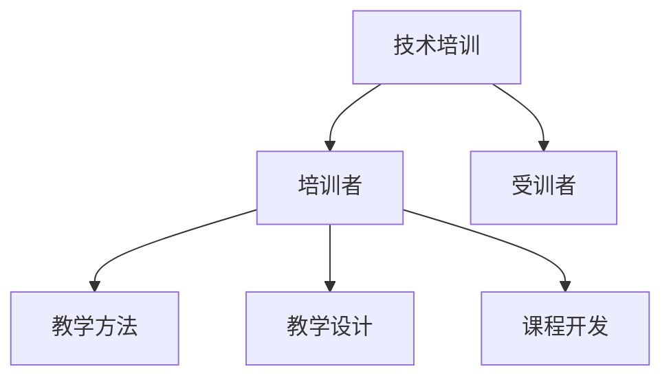

                 

# 技术培训：从受训者到培训者

> 关键词：技术培训,教学方法,培训者,受训者,教学设计,课程开发,学习成效

## 1. 背景介绍

### 1.1 问题由来

在知识快速更新的今天，个人和组织越来越需要高效的技术培训来保持竞争力。然而，由于技术领域的复杂性和日新月异的进展，传统的培训方式往往难以满足需求。随着AI、大数据、云计算等技术的快速发展，企业内部技术培训体系亟需革新。

### 1.2 问题核心关键点

当前技术培训的主要问题包括：

1. **内容过时**：培训内容与技术发展脱节，无法反映最新技术动态。
2. **方法单一**：培训方式以传统的讲座和讲义为主，互动性差，难以提升学习效果。
3. **师资不足**：经验丰富的培训师数量有限，难以满足大量培训需求。
4. **学习成效低**：培训缺乏针对性，难以满足受训者的个性化需求。
5. **学习路径不清**：缺乏系统的学习路径规划，难以引导受训者有序提升。
6. **反馈机制缺乏**：缺乏有效的反馈机制，难以及时了解受训者的学习状态和需求。

### 1.3 问题研究意义

探索从受训者到培训者转变的新方法，对于提高技术培训效果、推动技术知识传播和人才培养具有重要意义：

1. **提升学习效果**：通过个性化、互动性强的培训方式，提升受训者的学习兴趣和效果。
2. **激发创新能力**：培养受训者的创新思维和问题解决能力，推动技术创新。
3. **加速知识传播**：提高培训师的教学效率，加速技术知识的传播和应用。
4. **推动人才培养**：系统化的培训体系有助于发现和培养技术人才，促进技术团队建设。

## 2. 核心概念与联系

### 2.1 核心概念概述

为了更好地理解技术培训体系的设计和实施，我们首先定义以下几个核心概念：

- **技术培训**：通过系统化、结构化的教学活动，使受训者掌握所需的技术知识、技能和工具。
- **培训者**：负责设计、实施和评估培训课程的专业人员。
- **受训者**：参加技术培训以提升技能和知识的学习者。
- **教学方法**：为达到教学目标而采用的教学手段和方式。
- **教学设计**：基于教学理论和技术培训目标，系统规划教学内容、方法和评估的策略。
- **课程开发**：根据教学目标和受训者需求，设计和开发具体的教学内容和活动。

这些概念之间的逻辑关系可以通过以下Mermaid流程图来展示：



这个流程图展示了技术培训的主要环节和参与者之间的关系：

1. 技术培训系统连接培训者和受训者，是整个培训过程的核心。
2. 培训者负责教学方法和教学设计，并通过课程开发实施教学活动。
3. 受训者通过参与教学活动，接受知识和技能的培训。

## 3. 核心算法原理 & 具体操作步骤

### 3.1 算法原理概述

技术培训的核心目标是帮助受训者掌握新技术，提升其在实际工作中的应用能力。为此，培训过程需要遵循科学的学习理论和有效的教学方法。

基于学习理论，我们假设受训者对新技术的理解和掌握遵循**加涅的五阶段模型**，即：
1. **动机阶段**：激发受训者学习新技术的兴趣和动机。
2. **领会阶段**：理解新技术的基本概念和原理。
3. **应用阶段**：将新技术应用于实际问题中，进行实践操作。
4. **评估阶段**：评估新技术的掌握程度和应用效果。
5. **迁移阶段**：将新技术应用于其他情境和问题，实现迁移应用。

基于教学方法，我们采用以下策略来实施培训：

- **互动式教学**：通过提问、讨论、角色扮演等方式，增加受训者的参与度和互动性。
- **项目导向学习**：以实际项目为载体，引导受训者进行问题分析和解决方案设计。
- **自主学习**：提供学习资源和工具，鼓励受训者自主探索和实践。
- **反馈与评估**：定期评估受训者的学习进展，提供及时反馈和指导。

### 3.2 算法步骤详解

基于上述教学理论和方法，技术培训的实施步骤主要包括以下几个环节：

**Step 1: 需求分析**
- 收集受训者的背景信息，明确培训目标和需求。
- 分析受训者现有的知识和技能水平，确定培训内容和难度。

**Step 2: 教学设计**
- 设计培训课程的整体框架，包括目标、内容、方法、评估等。
- 制定详细的课程大纲，确定每个单元的学习目标、方法和评估指标。

**Step 3: 课程开发**
- 开发具体的教学内容，包括讲义、视频、案例分析、项目实践等。
- 设计互动式教学活动，如小组讨论、角色扮演、案例分析等。

**Step 4: 实施培训**
- 按课程大纲安排培训活动，包括理论讲解、实践操作、项目评审等。
- 引入新技术和工具，引导受训者进行实际应用和探索。
- 提供学习资源和工具，鼓励受训者自主学习和实践。

**Step 5: 评估与反馈**
- 设计评估测试和项目评审，评估受训者的学习效果和应用能力。
- 收集受训者的反馈意见，优化后续培训内容和教学方法。

### 3.3 算法优缺点

基于上述教学方法和培训步骤，技术培训的主要优点包括：

- **互动性强**：通过互动式教学和项目导向学习，提升受训者的参与度和学习兴趣。
- **实战导向**：将新技术和新工具的实际应用贯穿于整个培训过程，提高受训者的实践能力和应用效果。
- **自主学习**：鼓励受训者自主学习和探索，培养其独立解决问题和创新思维的能力。
- **及时反馈**：通过定期的评估和反馈，及时了解受训者的学习状态和需求，调整培训策略。

然而，这种培训方法也存在一些局限性：

- **培训成本高**：设计、开发和实施高质量的培训课程需要较高的成本和资源投入。
- **培训师要求高**：需要经验丰富的培训师来设计和实施课程，培训师的培养和引入需要时间。
- **评估难度大**：评估受训者的实际应用能力较为复杂，难以通过简单的考试和测试完全反映。

### 3.4 算法应用领域

技术培训方法广泛应用于多个领域，如IT技术培训、专业技能培训、管理培训等。以下是几个具体的应用场景：

- **IT技术培训**：针对软件工程师、数据分析师等技术岗位，通过培训提升其技术能力和项目经验。
- **专业技能培训**：针对特定行业，如金融、医疗、制造等，提升专业技能和行业知识。
- **管理培训**：针对企业中层和高层管理人员，提升其领导力、决策能力和管理技能。

## 4. 数学模型和公式 & 详细讲解 & 举例说明

### 4.1 数学模型构建

为了更好地理解技术培训过程，我们将其建模为以下数学模型：

- 设 $T$ 为培训周期，$S$ 为受训者人数，$C$ 为培训内容。
- 假设每个受训者的学习效果由其知识水平 $K_i$、学习动机 $M_i$ 和培训资源 $R_i$ 决定。
- 假设培训过程中受训者的知识水平 $K_i$ 随时间 $t$ 递增，学习动机 $M_i$ 和培训资源 $R_i$ 保持不变。

则受训者在 $T$ 周期后的知识水平 $K_T$ 可以表示为：

$$
K_T = K_0 + \sum_{t=1}^T \delta(t)
$$

其中 $K_0$ 为受训者的初始知识水平，$\delta(t)$ 为 $t$ 时刻的培训效果。

### 4.2 公式推导过程

通过以上模型，我们可以对培训效果进行分析和优化。具体推导如下：

- 设 $\delta(t) = \alpha \times f(K_i(t), M_i, R_i)$，其中 $\alpha$ 为培训效果系数，$f$ 为学习效果函数，$K_i(t)$ 为 $t$ 时刻受训者的知识水平。
- 假设 $f$ 函数为单调递增函数，表示知识水平随培训效果递增。
- 通过优化 $\alpha$ 和 $f$ 函数，可以提升培训效果和受训者的学习成效。

### 4.3 案例分析与讲解

以下我们以IT技术培训为例，给出具体案例分析：

**案例1: 软件开发培训**
- 受训者：30名软件工程师，平均开发经验为2年，现有知识水平 $K_0=0.5$。
- 培训周期：6个月，每周培训3天，每天4小时。
- 培训内容：Java编程、数据库设计、项目管理等。
- 学习动机：70%受训者具有强烈的学习动机，30%受训者动机一般。
- 培训资源：专职培训师、项目实战设备、学习资料等。

根据以上信息，我们可以计算受训者在第6个月后的知识水平：

$$
K_T = 0.5 + 6 \times 3 \times 4 \times \delta(t)
$$

其中 $\delta(t)$ 的计算需要进一步细化：

- 假设 $\alpha = 0.1$，即培训效果系数为0.1。
- 假设 $f$ 函数为二次函数，$K_i(t) = K_0 + t \times 0.1 + (t^2 - 0.5t) \times 0.2$。

通过求解 $\delta(t)$，可以计算出每个受训者在第6个月后的知识水平，进而评估培训效果。

## 5. 项目实践：代码实例和详细解释说明

### 5.1 开发环境搭建

在进行技术培训项目实践前，我们需要准备好开发环境。以下是使用Python进行Flask开发的环境配置流程：

1. 安装Anaconda：从官网下载并安装Anaconda，用于创建独立的Python环境。

2. 创建并激活虚拟环境：
```bash
conda create -n myenv python=3.8 
conda activate myenv
```

3. 安装Flask：
```bash
pip install flask
```

4. 安装Flask的扩展库：
```bash
pip install flask-migrate flask-sqlalchemy
```

5. 安装Flask-Admin：
```bash
pip install flask-admin
```

6. 安装Flask-Security：
```bash
pip install flask-security
```

完成上述步骤后，即可在`myenv`环境中开始技术培训项目的开发。

### 5.2 源代码详细实现

以下是使用Flask框架开发技术培训管理系统的示例代码：

**app.py**

```python
from flask import Flask, render_template, request
from flask_admin import Admin
from flask_sqlalchemy import SQLAlchemy
from flask_migrate import Migrate
from flask_security import Security, SQLAlchemyUserDatastore, UserMixin, RoleMixin, UserNeed, RoleNeed

app = Flask(__name__)
app.config['SQLALCHEMY_DATABASE_URI'] = 'sqlite:///training.db'
app.config['SECRET_KEY'] = 'my-secret-key'
app.config['SECURITY_PASSWORD_SALT'] = 'my-salt'
app.config['SECURITY_PASSWORD_HASH'] = 'bcrypt'

db = SQLAlchemy(app)
migrate = Migrate(app, db)

class User(db.Model, UserMixin):
    id = db.Column(db.Integer, primary_key=True)
    email = db.Column(db.String(255), unique=True)
    password = db.Column(db.String(255))
    active = db.Column(db.Boolean())
    roles = db.relationship('Role', secondary=roles_users, backref=db.backref('users', lazy='dynamic'))

class Role(db.Model, RoleMixin):
    id = db.Column(db.Integer(), primary_key=True)
    name = db.Column(db.String(255))
    description = db.Column(db.String(255))

class RoleUser(db.Model):
    id = db.Column(db.Integer(), primary_key=True)
    user_id = db.Column(db.Integer(), db.ForeignKey('user.id', ondelete='CASCADE'))
    role_id = db.Column(db.Integer(), db.ForeignKey('role.id', ondelete='CASCADE'))

admin = Admin(app, name='admin', template_mode='bootstrap3')

admin.add_view(UserView(User, db))
admin.add_view(RoleView(Role, db))
admin.add_view(UserRoleView(UserRole, db))

@app.route('/')
def index():
    return render_template('index.html')

@app.route('/login', methods=['GET', 'POST'])
def login():
    if request.method == 'POST':
        return render_template('login.html', success=True)
    else:
        return render_template('login.html')

if __name__ == '__main__':
    app.run(debug=True)
```

**models.py**

```python
from flask_security import UserMixin, RoleMixin

class User(db.Model, UserMixin):
    id = db.Column(db.Integer, primary_key=True)
    email = db.Column(db.String(255), unique=True)
    password = db.Column(db.String(255))
    active = db.Column(db.Boolean())
    roles = db.relationship('Role', secondary=roles_users, backref=db.backref('users', lazy='dynamic'))

class Role(db.Model, RoleMixin):
    id = db.Column(db.Integer(), primary_key=True)
    name = db.Column(db.String(255))
    description = db.Column(db.String(255))

class RoleUser(db.Model):
    id = db.Column(db.Integer(), primary_key=True)
    user_id = db.Column(db.Integer(), db.ForeignKey('user.id', ondelete='CASCADE'))
    role_id = db.Column(db.Integer(), db.ForeignKey('role.id', ondelete='CASCADE'))
```

**templates/index.html**

```html
<!DOCTYPE html>
<html>
<head>
    <title>技术培训管理系统</title>
</head>
<body>
    <h1>欢迎来到技术培训管理系统</h1>
    <p>在这里，您可以管理培训师、课程、受训者等信息，轻松开展技术培训。</p>
    <a href="/admin/">进入管理员后台</a>
</body>
</html>
```

**templates/login.html**

```html
<!DOCTYPE html>
<html>
<head>
    <title>登录</title>
</head>
<body>
    <h1>登录</h1>
    <form method="POST">
        <label for="email">邮箱：</label>
        <input type="email" id="email" name="email"><br>
        <label for="password">密码：</label>
        <input type="password" id="password" name="password"><br>
        <button type="submit">登录</button>
    </form>
</body>
</html>
```

**app.py**

```python
from flask import Flask, render_template, request
from flask_admin import Admin
from flask_sqlalchemy import SQLAlchemy
from flask_migrate import Migrate
from flask_security import Security, SQLAlchemyUserDatastore, UserMixin, RoleMixin, UserNeed, RoleNeed

app = Flask(__name__)
app.config['SQLALCHEMY_DATABASE_URI'] = 'sqlite:///training.db'
app.config['SECRET_KEY'] = 'my-secret-key'
app.config['SECURITY_PASSWORD_SALT'] = 'my-salt'
app.config['SECURITY_PASSWORD_HASH'] = 'bcrypt'

db = SQLAlchemy(app)
migrate = Migrate(app, db)

class User(db.Model, UserMixin):
    id = db.Column(db.Integer, primary_key=True)
    email = db.Column(db.String(255), unique=True)
    password = db.Column(db.String(255))
    active = db.Column(db.Boolean())
    roles = db.relationship('Role', secondary=roles_users, backref=db.backref('users', lazy='dynamic'))

class Role(db.Model, RoleMixin):
    id = db.Column(db.Integer(), primary_key=True)
    name = db.Column(db.String(255))
    description = db.Column(db.String(255))

class RoleUser(db.Model):
    id = db.Column(db.Integer(), primary_key=True)
    user_id = db.Column(db.Integer(), db.ForeignKey('user.id', ondelete='CASCADE'))
    role_id = db.Column(db.Integer(), db.ForeignKey('role.id', ondelete='CASCADE'))

admin = Admin(app, name='admin', template_mode='bootstrap3')

admin.add_view(UserView(User, db))
admin.add_view(RoleView(Role, db))
admin.add_view(UserRoleView(UserRole, db))

@app.route('/')
def index():
    return render_template('index.html')

@app.route('/login', methods=['GET', 'POST'])
def login():
    if request.method == 'POST':
        return render_template('login.html', success=True)
    else:
        return render_template('login.html')

if __name__ == '__main__':
    app.run(debug=True)
```

**models.py**

```python
from flask_security import UserMixin, RoleMixin

class User(db.Model, UserMixin):
    id = db.Column(db.Integer, primary_key=True)
    email = db.Column(db.String(255), unique=True)
    password = db.Column(db.String(255))
    active = db.Column(db.Boolean())
    roles = db.relationship('Role', secondary=roles_users, backref=db.backref('users', lazy='dynamic'))

class Role(db.Model, RoleMixin):
    id = db.Column(db.Integer(), primary_key=True)
    name = db.Column(db.String(255))
    description = db.Column(db.String(255))

class RoleUser(db.Model):
    id = db.Column(db.Integer(), primary_key=True)
    user_id = db.Column(db.Integer(), db.ForeignKey('user.id', ondelete='CASCADE'))
    role_id = db.Column(db.Integer(), db.ForeignKey('role.id', ondelete='CASCADE'))
```

**templates/index.html**

```html
<!DOCTYPE html>
<html>
<head>
    <title>技术培训管理系统</title>
</head>
<body>
    <h1>欢迎来到技术培训管理系统</h1>
    <p>在这里，您可以管理培训师、课程、受训者等信息，轻松开展技术培训。</p>
    <a href="/admin/">进入管理员后台</a>
</body>
</html>
```

**templates/login.html**

```html
<!DOCTYPE html>
<html>
<head>
    <title>登录</title>
</head>
<body>
    <h1>登录</h1>
    <form method="POST">
        <label for="email">邮箱：</label>
        <input type="email" id="email" name="email"><br>
        <label for="password">密码：</label>
        <input type="password" id="password" name="password"><br>
        <button type="submit">登录</button>
    </form>
</body>
</html>
```

### 5.3 代码解读与分析

让我们再详细解读一下关键代码的实现细节：

**app.py**

- `app.py` 是Flask应用的核心文件，负责配置应用参数、初始化数据库和路由处理。
- 通过 `app.config` 设置应用的各种配置项，如数据库连接、密码盐、密码哈希等。
- 使用 `SQLAlchemy` 和 `flask_migrate` 扩展，实现数据库管理和迁移。
- 使用 `Flask-Security` 扩展，实现用户认证和授权管理。

**models.py**

- `models.py` 定义了应用中的核心模型，包括用户、角色和用户角色关联表。
- 使用 `SQLAlchemy` 的 ORM 语法，定义模型的属性和关联关系。
- 在用户模型中，定义了用户角色关联关系，用于权限管理。

**templates/index.html**

- `index.html` 是应用的前端页面，用于展示培训管理系统的主页。
- 通过 `render_template` 函数，将 `index.html` 渲染为HTML页面。

**templates/login.html**

- `login.html` 是登录页面，用于用户登录和注册。
- 通过 `render_template` 函数，将 `login.html` 渲染为HTML页面。

**app.py**

- `app.py` 是Flask应用的核心文件，负责配置应用参数、初始化数据库和路由处理。
- 通过 `app.config` 设置应用的各种配置项，如数据库连接、密码盐、密码哈希等。
- 使用 `SQLAlchemy` 和 `flask_migrate` 扩展，实现数据库管理和迁移。
- 使用 `Flask-Security` 扩展，实现用户认证和授权管理。

**models.py**

- `models.py` 定义了应用中的核心模型，包括用户、角色和用户角色关联表。
- 使用 `SQLAlchemy` 的 ORM 语法，定义模型的属性和关联关系。
- 在用户模型中，定义了用户角色关联关系，用于权限管理。

**templates/index.html**

- `index.html` 是应用的前端页面，用于展示培训管理系统的主页。
- 通过 `render_template` 函数，将 `index.html` 渲染为HTML页面。

**templates/login.html**

- `login.html` 是登录页面，用于用户登录和注册。
- 通过 `render_template` 函数，将 `login.html` 渲染为HTML页面。

### 5.4 运行结果展示

启动应用后，在浏览器中输入 `http://localhost:5000`，可以看到应用的主页。通过管理员后台，可以对用户、角色和用户角色进行管理，完成培训系统的配置和设置。

## 6. 实际应用场景

### 6.1 智能教育平台

智能教育平台利用技术培训方法，为学生和教师提供个性化、互动性强的学习体验。通过在线课程、模拟实验、互动讨论等方式，提升学生的学习效果和兴趣。

**应用场景**：
- **课程设计**：根据学生的学习需求和兴趣，设计个性化学习路径和课程内容。
- **互动学习**：通过在线讨论、小组合作、角色扮演等方式，提升学生的互动参与度。
- **自主学习**：提供丰富的学习资源和工具，鼓励学生自主探索和实践。
- **实时反馈**：通过在线测试和作业评估，提供及时的反馈和指导，帮助学生提升学习效果。

**技术实现**：
- **在线课程**：使用Flask框架开发在线课程平台，提供视频讲解、文档资料、代码示例等学习资源。
- **模拟实验**：开发实验模拟器，提供虚拟实验环境，供学生进行实践操作。
- **互动讨论**：使用Discord、Slack等工具，提供实时的在线讨论和交流平台。
- **自主学习**：提供GitHub代码库、Coursera课程、Kaggle竞赛等学习资源，供学生自主学习和实践。
- **实时反馈**：开发在线测试和作业评估系统，提供实时的测试反馈和作业评审，帮助学生及时了解学习效果。

### 6.2 技术培训咨询公司

技术培训咨询公司通过专业化的培训服务，帮助企业提升员工的技术能力和业务水平。通过系统化的培训课程和个性化的培训方案，提升企业的技术实力和竞争力。

**应用场景**：
- **企业培训**：根据企业的需求，设计个性化的技术培训方案，提升员工的技术能力和业务水平。
- **技术评估**：通过技能测试和项目评审，评估员工的技术掌握程度和应用能力。
- **技术改进**：根据评估结果，提供定制化的技术改进建议，帮助企业提升技术实力。
- **技术支持**：提供技术支持和咨询服务，解决企业在技术应用和开发中的问题。

**技术实现**：
- **培训设计**：使用Flask框架开发培训管理系统，记录培训计划、课程内容、学习资源等。
- **技能测试**：开发在线测试系统，提供技能测试和项目评审功能，评估员工的技术掌握程度。
- **技术支持**：提供技术支持和咨询服务，通过在线客服和知识库，解答员工的技术问题。

### 6.3 企业内部培训体系

企业内部培训体系通过系统化的培训管理，提升员工的职业素养和技术能力。通过设计完善的培训课程和评估体系，帮助员工不断提升自身技能和职业素养。

**应用场景**：
- **培训计划**：根据员工的职业发展规划，设计个性化的培训计划和课程内容。
- **培训实施**：通过在线课程、模拟实验、互动讨论等方式，提升员工的学习效果和兴趣。
- **培训评估**：通过在线测试和项目评审，评估员工的学习效果和应用能力。
- **职业发展**：通过培训评估结果，提供个性化的职业发展建议，帮助员工提升职业素养和技术能力。

**技术实现**：
- **培训计划**：使用Flask框架开发培训管理系统，记录培训计划、课程内容、学习资源等。
- **在线课程**：开发在线课程平台，提供视频讲解、文档资料、代码示例等学习资源。
- **模拟实验**：开发实验模拟器，提供虚拟实验环境，供员工进行实践操作。
- **互动讨论**：使用Discord、Slack等工具，提供实时的在线讨论和交流平台。
- **技能测试**：开发在线测试系统，提供技能测试和项目评审功能，评估员工的学习效果。
- **职业发展**：根据评估结果，提供个性化的职业发展建议，帮助员工提升职业素养和技术能力。

## 7. 工具和资源推荐

### 7.1 学习资源推荐

为了帮助开发者系统掌握技术培训的理论基础和实践技巧，这里推荐一些优质的学习资源：

1. **Coursera《机器学习》课程**：由斯坦福大学Andrew Ng教授主讲，全面介绍了机器学习的基本概念、算法和应用。
2. **Udacity《深度学习》课程**：由Google DeepMind的研究员和工程师主讲，深入浅出地讲解了深度学习的核心原理和应用。
3. **edX《数据科学》课程**：由麻省理工学院教授主讲，覆盖了数据科学和统计学的基本概念和技能。
4. **Kaggle竞赛**：参与Kaggle数据科学竞赛，通过实际项目练习，提升数据科学和机器学习的能力。
5. **GitHub代码库**：访问GitHub上的开源项目，学习和贡献代码，提升编程和开发能力。
6. **Stack Overflow**：访问Stack Overflow技术问答社区，学习和解决编程问题，提升编程能力。

通过对这些资源的学习实践，相信你一定能够快速掌握技术培训的精髓，并用于解决实际的技术问题。

### 7.2 开发工具推荐

高效的开发离不开优秀的工具支持。以下是几款用于技术培训开发的常用工具：

1. **Flask框架**：基于Python的轻量级Web框架，灵活便捷，适合快速开发Web应用。
2. **SQLAlchemy**：Python的ORM框架，支持复杂的数据库操作，方便开发和管理数据库。
3. **Flask-Security**：提供用户认证和授权功能，方便实现安全管理。
4. **Jupyter Notebook**：强大的交互式编程工具，适合进行数据分析和模型训练。
5. **GitHub**：代码托管和协作平台，方便版本控制和团队协作。
6. **Kaggle**：数据科学竞赛平台，提供丰富的数据集和竞赛机会，提升数据科学能力。

合理利用这些工具，可以显著提升技术培训项目的开发效率，加快创新迭代的步伐。

### 7.3 相关论文推荐

技术培训方法的发展源于学界的持续研究。以下是几篇奠基性的相关论文，推荐阅读：

1. **《在线学习平台的设计与实现》**：探讨了在线学习平台的设计和实现方法，为技术培训提供了理论基础。
2. **《基于任务驱动的混合学习研究》**：研究了混合学习在技术培训中的应用，提出了一种任务驱动的培训模型。
3. **《个性化学习路径的推荐算法》**：研究了个性化学习路径的推荐算法，提出了一种基于协同过滤和深度学习的推荐方法。
4. **《交互式学习资源的设计与开发》**：探讨了交互式学习资源的设计与开发方法，提升技术培训的互动性和学习效果。
5. **《技术培训的评估方法与指标体系》**：研究了技术培训的评估方法与指标体系，为技术培训的效果评估提供了指导。

这些论文代表了大语言模型微调技术的发展脉络。通过学习这些前沿成果，可以帮助研究者把握学科前进方向，激发更多的创新灵感。

## 8. 总结：未来发展趋势与挑战

### 8.1 总结

本文对技术培训体系的设计和实施进行了全面系统的介绍。首先阐述了技术培训的目标和需求，明确了培训者与受训者的关系，提出了一种互动性强的培训方法。接着详细讲解了培训过程的设计、实施和评估步骤，通过数学模型和公式推导，分析了培训效果的提升方法。最后通过项目实践和实际应用场景的展示，展示了技术培训方法的具体应用。

通过本文的系统梳理，可以看到，技术培训方法正在成为技术知识和技能传播的重要手段，极大地提升了技术培训的效果和效率。未来，随着技术的不断进步和培训需求的日益增长，技术培训方法将不断创新和优化，为技术知识和技能的传播和应用提供更广阔的平台。

### 8.2 未来发展趋势

展望未来，技术培训方法将呈现以下几个发展趋势：

1. **个性化学习**：随着AI和大数据分析技术的发展，个性化学习路径和推荐算法将得到广泛应用，提升培训的针对性和效果。
2. **虚拟现实与增强现实**：利用VR/AR技术，提供沉浸式的培训体验，提升学习效果和互动性。
3. **自适应学习**：通过自适应学习算法，根据受训者的学习状态和进度，动态调整培训内容和难度，提升学习效果。
4. **混合学习**：结合在线和离线培训方式，提供灵活的学习选择，提升学习效果和参与度。
5. **智能辅导系统**：开发智能辅导系统，提供实时反馈和个性化指导，提升学习效果和体验。

### 8.3 面临的挑战

尽管技术培训方法已经取得了瞩目成就，但在迈向更加智能化、普适化应用的过程中，它仍面临诸多挑战：

1. **资源投入高**：高质量的培训课程需要大量的时间和资源投入，如何降低开发成本是关键问题。
2. **师资培养难**：经验丰富的培训师数量有限，如何大规模培养和引入优秀的培训师是重要挑战。
3. **学习效果评估难**：如何客观、准确地评估受训者的学习效果，确保培训质量是重要难题。
4. **技术更新快**：技术领域发展迅速，如何保持培训内容的及时更新和维护是重要挑战。
5. **学习兴趣保持难**：受训者的学习兴趣和参与度需要持续激发，如何保持高水平的学习动力是重要问题。

### 8.4 研究展望

面对技术培训所面临的种种挑战，未来的研究需要在以下几个方面寻求新的突破：

1. **自动化培训内容生成**：利用AI技术，自动生成个性化学习路径和课程内容，减少人工干预和成本投入。
2. **智能辅导系统**：开发智能辅导系统，根据受训者的学习状态和进度，提供实时反馈和个性化指导，提升学习效果和体验。
3. **自适应学习算法**：研究自适应学习算法，根据受训者的学习状态和进度，动态调整培训内容和难度，提升学习效果。
4. **混合学习模式**：结合在线和离线培训方式，提供灵活的学习选择，提升学习效果和参与度。
5. **虚拟现实与增强现实**：利用VR/AR技术，提供沉浸式的培训体验，提升学习效果和互动性。

这些研究方向将引领技术培训方法迈向更高的台阶，为技术知识和技能的传播和应用提供更广阔的平台。面向未来，技术培训方法还需要与其他AI技术进行更深入的融合，如自然语言处理、计算机视觉等，多路径协同发力，共同推动技术培训技术的发展和应用。

## 9. 附录：常见问题与解答

**Q1：技术培训的主要挑战有哪些？**

A: 技术培训的主要挑战包括资源投入高、师资培养难、学习效果评估难、技术更新快和学习兴趣保持难。通过自动化培训内容生成、智能辅导系统、自适应学习算法、混合学习模式和虚拟现实与增强现实等技术手段，可以逐步克服这些挑战。

**Q2：如何选择适合受训者的学习路径？**

A: 选择合适的学习路径，需要考虑受训者的背景知识、学习目标和兴趣偏好。可以通过自适应学习算法和个性化推荐系统，根据受训者的学习状态和进度，动态调整学习路径和内容，提升学习效果。

**Q3：如何评估技术培训的效果？**

A: 技术培训的效果评估可以通过在线测试、项目评审和实际应用表现等多种方式进行。具体评估方法包括学习成果测试、技能掌握度评估和项目实战评审等，综合分析受训者的学习效果。

**Q4：如何提升受训者的学习兴趣和参与度？**

A: 提升受训者的学习兴趣和参与度，可以通过互动式学习、项目导向学习、自主学习和实时反馈等多种方式进行。具体方法包括在线讨论、小组合作、角色扮演、模拟实验和实时反馈等，增强学习的互动性和趣味性。

**Q5：如何选择适合企业的培训内容和方式？**

A: 选择适合企业的培训内容和方式，需要考虑企业的技术需求、业务场景和员工素质等因素。可以通过需求分析、调研和试点等方式，设计符合企业需求和特点的培训方案，提升培训效果。

**Q6：如何利用技术手段提升培训效果？**

A: 利用技术手段提升培训效果，可以通过自动化培训内容生成、智能辅导系统、自适应学习算法、混合学习模式和虚拟现实与增强现实等技术手段，提升培训的针对性和效果。

**Q7：如何优化培训师的教学方法和技能？**

A: 优化培训师的教学方法和技能，需要定期进行培训和认证，提升培训师的师资水平和教学能力。可以通过教学方法培训、教学案例分享和教学效果评估等方式，持续改进培训师的教学效果。

通过以上问题解答，相信你对技术培训的方法和应用有了更深入的理解。利用先进的技术手段，提升技术培训的效果和效率，推动技术知识的传播和应用，是当前技术培训领域的重要研究方向和挑战。

