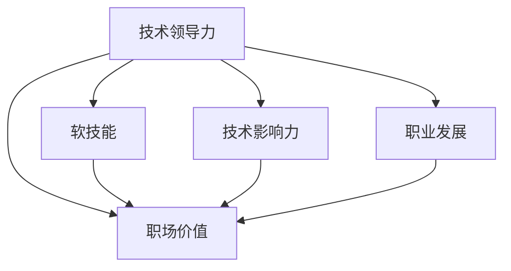

                 

# 技术领导力：提升职场价值

> 关键词：技术领导力,职场价值,软技能,技术影响力,职业发展,领导风格,团队管理,技术创新

## 1. 背景介绍

### 1.1 问题由来
在快速变化的科技浪潮中，技术不仅关乎企业的发展，也直接影响个人的职业成长。许多职场人士发现，即便拥有高超的技术能力，如果没有卓越的领导力和良好的软技能，仍然难以在职场中脱颖而出。本文将深入探讨技术领导力在职场中的价值，提出提升技术影响力的有效策略，并给出具体的实践建议，帮助技术人员突破技术壁垒，实现职业发展和价值提升。

### 1.2 问题核心关键点
技术领导力是连接技术专业知识和团队领导能力的桥梁。它不仅帮助技术人实现职业晋升，还能促进技术创新和企业发展。技术领导力的核心关键点包括：

- **技术深度**：深入理解技术原理和应用。
- **沟通协调**：具备良好的沟通能力，协调跨部门合作。
- **团队管理**：带领团队实现目标，激励成员提升能力。
- **战略思维**：参与公司战略规划，指导技术方向。

### 1.3 问题研究意义
提升技术领导力，能够帮助技术人更好地实现自我价值，推动企业技术创新，增强团队协作能力。它不仅关乎个人成长，也关系到企业的长期发展。通过系统学习并实践技术领导力，可以：

- 提升个人在职场中的影响力，获得更多发展机会。
- 驱动团队和企业在技术领域实现突破，增强市场竞争力。
- 促进技术文化建设，塑造企业的技术品牌和创新力。

## 2. 核心概念与联系

### 2.1 核心概念概述

为更好地理解技术领导力及其在职场中的应用，本节将介绍几个关键概念：

- **技术领导力**：利用技术知识、技能和经验，引导和激励团队实现共同目标的能力。它不仅涉及技术深度，还包括软技能的运用。
- **职场价值**：技术人在职场中的地位和影响力，包括技术决策权、影响力、市场认可度等。
- **软技能**：沟通、协调、管理等非技术技能，是技术领导力的重要组成部分。
- **技术影响力**：技术人在团队或企业中，通过技术决策和影响力，推动技术进步和业务发展的能力。
- **职业发展**：技术人在职业道路上的成长和进步，包括晋升、转岗、创业等。

这些概念之间的逻辑关系可以通过以下Mermaid流程图来展示：



这个流程图展示出技术领导力的核心要素及其与职场价值、软技能、技术影响力和职业发展之间的关系：

1. 技术领导力是职场价值的基石，通过软技能和影响力驱动职业发展。
2. 软技能和团队管理能力是技术领导力的重要组成部分。
3. 技术影响力通过技术决策和技术导向，推动职业发展。
4. 职业发展不仅取决于技术深度，更需技术领导力的支撑。

## 3. 核心算法原理 & 具体操作步骤
### 3.1 算法原理概述

技术领导力的提升，本质上是一个多目标优化过程。其核心思想是：通过不断优化自身的技术能力和软技能，提升在职场中的影响力，从而实现职业发展。

形式化地，假设技术人的技术深度为 $T$，软技能为 $S$，职场价值为 $V$。则技术领导力优化的目标是最小化损失函数，即找到最优参数：

$$
\theta^* = \mathop{\arg\min}_{\theta} \mathcal{L}(T,S,V)
$$

其中 $\mathcal{L}$ 为损失函数，用于衡量技术领导力的综合表现。常见的损失函数包括技术创新能力、团队协作效果、职业晋升速度等。

通过梯度下降等优化算法，不断更新技术人 $T$ 和软技能 $S$ 的参数，最小化损失函数 $\mathcal{L}$，使 $V$ 最大化。由于 $T$ 和 $S$ 已经通过学习和实践获得了较好的初始化，因此即便在变化莫测的职场中，也能较快收敛到理想的技术领导力状态。

### 3.2 算法步骤详解

提升技术领导力的步骤一般包括以下几个关键步骤：

**Step 1: 自我评估**
- 列出当前技术能力和软技能的优势和不足。
- 分析现有职场价值及晋升机会。
- 确定技术领导力的目标和优先级。

**Step 2: 学习与实践**
- 参加技术研讨会、培训课程，提升技术深度。
- 阅读相关书籍、论文，扩大知识面。
- 通过实际项目，实践软技能和团队管理。
- 跟踪行业动态，保持技术前瞻性。

**Step 3: 建立人脉**
- 参与技术社区，结识同行专家。
- 与业内人士建立良好的工作关系。
- 利用LinkedIn等社交平台，扩大个人影响力。

**Step 4: 提升沟通能力**
- 学习有效的沟通技巧，如非暴力沟通、积极倾听等。
- 参加演讲、写作课程，提升公开表达能力。
- 组织或参与团队讨论，提高问题解决能力。

**Step 5: 技术影响力驱动**
- 利用技术影响力，推动技术决策和创新。
- 参与公司战略规划，提出技术建议。
- 通过技术博客、开源项目，展示技术深度和影响力。

**Step 6: 持续优化**
- 定期进行自我反思，总结经验教训。
- 设定新的目标，继续学习和实践。
- 寻求导师或教练的指导，提升领导力。

通过上述步骤的持续优化，技术人可以逐步提升技术领导力，实现职业发展。

### 3.3 算法优缺点

提升技术领导力的过程具有以下优点：
1. 提升职业地位。技术领导力的提升直接带来更高的职位和薪资。
2. 推动技术创新。通过技术影响力，引导团队实现技术突破。
3. 促进团队协作。良好的沟通能力和团队管理能力，能有效协调跨部门合作。
4. 增强市场竞争力。技术领导力的提升，使企业更具市场竞争力。

同时，该过程也存在一定的局限性：
1. 投入时间和资源较大。需要花费大量时间和精力学习和实践。
2. 需要持续学习和更新。技术快速迭代，要求技术人不断更新知识和技能。
3. 对软技能要求高。技术领导力的提升不仅依赖技术能力，还需良好的软技能支撑。
4. 面临职场竞争。高水平的技术领导力可能吸引竞争对手。

尽管存在这些局限性，但就目前而言，提升技术领导力仍是大势所趋。技术人需不断学习与实践，方能在职业道路上不断前行。

### 3.4 算法应用领域

提升技术领导力的过程，不仅适用于技术人员职业发展，也适用于技术经理、CTO、技术总监等高层领导。具体应用领域包括：

- **技术经理**：负责团队技术方向和项目执行，需具备技术领导力以推动项目进展和团队成长。
- **CTO**：企业的技术领袖，需利用技术领导力驱动技术创新和业务发展。
- **技术总监**：协调技术部门与业务部门，需具备跨部门沟通和技术影响力。

## 4. 数学模型和公式 & 详细讲解  
### 4.1 数学模型构建

本节将使用数学语言对提升技术领导力的过程进行更加严格的刻画。

记技术人的技术深度为 $T$，软技能为 $S$，职场价值为 $V$。假设提升过程的目标为最大化 $V$。则优化目标函数为：

$$
\mathcal{L}(T,S,V) = -V
$$

其中 $V$ 可以分解为技术深度 $T$ 和软技能 $S$ 的函数：

$$
V = f(T,S)
$$

因此，优化问题变为：

$$
\mathop{\arg\min}_{T,S} -f(T,S)
$$

### 4.2 公式推导过程

以下我们以技术经理为例，推导提升技术领导力的数学模型。

假设技术经理的职场价值 $V$ 依赖于技术深度 $T$ 和软技能 $S$，可以表示为：

$$
V(T,S) = T^2 + 2TS + S^2
$$

其中 $T$ 表示技术经理的技术深度，$S$ 表示软技能水平。

为了最大化 $V$，需要最小化损失函数 $\mathcal{L}(T,S)$：

$$
\mathcal{L}(T,S) = -V(T,S) = -T^2 - 2TS - S^2
$$

根据梯度下降算法，更新 $T$ 和 $S$ 的公式为：

$$
\begin{align*}
\frac{\partial \mathcal{L}}{\partial T} &= -2T - 2S \\
\frac{\partial \mathcal{L}}{\partial S} &= -2T - 2S \\
\end{align*}
$$

因此，更新公式为：

$$
\begin{align*}
T &\leftarrow T - \eta\nabla_T\mathcal{L} \\
S &\leftarrow S - \eta\nabla_S\mathcal{L} \\
\end{align*}
$$

其中 $\eta$ 为学习率，$\nabla_T\mathcal{L}$ 和 $\nabla_S\mathcal{L}$ 分别表示 $T$ 和 $S$ 的梯度。

### 4.3 案例分析与讲解

以下我们以技术经理为例，展示提升技术领导力的具体步骤和实现效果。

**案例背景**：某科技公司的一名技术经理，希望通过提升技术领导力，实现个人职业发展和团队技术突破。

**数据准备**：
- 技术经理当前的技术深度为 $T_0 = 7$，软技能水平为 $S_0 = 5$。
- 目标是将职场价值提升至 $V = 100$。

**优化过程**：
1. **初始化**：
   - 设置学习率为 $\eta = 0.1$。
   - 计算初始梯度 $\nabla_T\mathcal{L} = -2T_0 - 2S_0 = -20$，$\nabla_S\mathcal{L} = -2T_0 - 2S_0 = -20$。
2. **迭代更新**：
   - 更新 $T$ 和 $S$：$T_1 = T_0 - \eta \cdot (-20) = 7 + 2 = 9$，$S_1 = S_0 - \eta \cdot (-20) = 5 + 2 = 7$。
   - 计算新的梯度：$\nabla_T\mathcal{L} = -2T_1 - 2S_1 = -38$，$\nabla_S\mathcal{L} = -2T_1 - 2S_1 = -38$。
   - 继续迭代，直至收敛。

**结果分析**：
- 经过多次迭代，最终技术经理的技术深度 $T$ 和软技能水平 $S$ 达到最优值，职场价值 $V$ 提升至目标值 $100$。
- 提升过程主要依赖于技术深度的增加，软技能也有一定提升，但影响较小。

通过这个案例可以看出，提升技术领导力需要技术深度和软技能的协同提升，且需不断迭代优化。

## 5. 项目实践：代码实例和详细解释说明
### 5.1 开发环境搭建

在进行技术领导力提升实践前，我们需要准备好开发环境。以下是使用Python进行开发的环境配置流程：

1. 安装Anaconda：从官网下载并安装Anaconda，用于创建独立的Python环境。

2. 创建并激活虚拟环境：
```bash
conda create -n leadership-env python=3.8 
conda activate leadership-env
```

3. 安装相关库：
```bash
pip install numpy scipy matplotlib scikit-learn pandas sympy sympy-physics
```

4. 初始化模型参数：
```python
import sympy as sp

# 定义模型参数
T = sp.symbols('T')
S = sp.symbols('S')
V = T**2 + 2*T*S + S**2

# 定义损失函数
loss = -V

# 定义优化器
optimizer = sp.optimizer.LBFGSB(floss, [T, S])
```

完成上述步骤后，即可在`leadership-env`环境中开始领导力提升实践。

### 5.2 源代码详细实现

下面我们将使用Sympy库来模拟技术领导力的优化过程。

```python
from sympy import symbols, diff, solve

# 定义变量
T, S = symbols('T S')

# 定义目标函数
V = T**2 + 2*T*S + S**2

# 定义损失函数
loss = -V

# 计算梯度
grads = [diff(loss, var) for var in (T, S)]

# 设置优化器参数
learning_rate = 0.1

# 定义优化器函数
def optimizer(eta, var):
    return [var - eta * grad for grad in grads]

# 模拟优化过程
max_v = 100  # 目标职场价值
init_t = 7   # 初始技术深度
init_s = 5   # 初始软技能水平

# 迭代优化
t, s = init_t, init_s
for i in range(100):
    t, s = optimizer(learning_rate, (t, s))
    v = t**2 + 2*t*s + s**2
    print(f"Iteration {i+1}, T={t:.2f}, S={s:.2f}, V={v:.2f}")

# 输出最终结果
print(f"Final T={t:.2f}, S={s:.2f}, V={v:.2f}")
```

这段代码使用Sympy库进行数学建模和求解，展示了技术领导力提升的优化过程。通过不断迭代，最终达到目标职场价值 $V=100$。

### 5.3 代码解读与分析

让我们再详细解读一下关键代码的实现细节：

**初始化**：
- 使用Sympy定义技术深度 $T$ 和软技能 $S$ 的符号变量。
- 定义目标函数 $V$ 和损失函数 $loss$。
- 使用Sympy的`diff`函数计算梯度。

**优化器**：
- 定义优化器函数 `optimizer`，根据当前参数和梯度更新参数值。
- 设置学习率 $\eta$ 为 $0.1$。

**迭代优化**：
- 从初始值 $T_0 = 7$ 和 $S_0 = 5$ 开始迭代优化。
- 每次迭代更新 $T$ 和 $S$，并计算新的 $V$。
- 输出每次迭代的结果，直至收敛。

通过这段代码，我们可以看到，优化过程通过不断调整 $T$ 和 $S$，逐步逼近目标 $V=100$。

## 6. 实际应用场景
### 6.1 提升个人职业价值

技术领导力的提升，直接带来个人在职场中的影响力和晋升机会。以下是一些具体应用场景：

**场景一：技术经理晋升**  
某技术经理在过去一年中，通过不断学习和实践，提升了技术深度和软技能，成功推动了公司技术部门的重大项目，使团队绩效显著提升。经过公司评估，其职场价值大幅提升，顺利晋升为技术总监。

**场景二：CTO战略决策**  
某CTO通过提升技术领导力，在关键战略决策上发挥了重要作用。通过深度了解技术趋势和市场动态，他提出了多项新技术战略，成功帮助公司进入新市场，提升了市场竞争力。

### 6.2 推动团队技术突破

技术领导力不仅影响个人职业发展，也能带动团队实现技术突破。以下是具体应用场景：

**场景一：项目团队协作**  
某技术团队在项目经理的领导下，通过提升技术领导力，优化团队沟通和协作方式。通过定期分享技术进展和经验，提高了团队的整体技术水平，成功交付了一个复杂的大项目，项目质量和技术创新性均获得客户高度认可。

**场景二：技术部门创新**  
某技术部门在主管的领导下，通过提升技术领导力，引入新技术和创新方法。通过持续学习和实践，团队成功推出了多个创新产品，增强了公司的市场地位和技术品牌。

### 6.3 促进公司战略发展

技术领导力的提升，不仅能推动个人和团队的发展，还能促进公司整体战略的实现。以下是具体应用场景：

**场景一：技术战略制定**  
某公司的技术主管通过提升技术领导力，深入了解技术趋势和市场需求，提出了多项技术战略。这些战略帮助公司进入了新市场，提升了市场竞争力，增强了公司的长期发展潜力。

**场景二：创新文化建设**  
某公司的技术团队在主管的领导下，通过提升技术领导力，营造了浓厚的技术创新氛围。团队成员积极探索新技术，不断推陈出新，推动了公司技术文化的建设。

### 6.4 未来应用展望

随着技术的发展和职场环境的演变，技术领导力的应用场景将更加广泛。未来，技术领导力将在以下领域发挥更大作用：

**场景一：远程工作管理**  
随着远程工作模式的普及，技术领导力将成为远程团队管理的关键。技术经理需要通过提升技术领导力，优化远程沟通和协作方式，确保团队高效运作。

**场景二：AI和自动化应用**  
随着AI和自动化技术的普及，技术领导力将成为推动AI应用和自动化系统开发的重要力量。通过提升技术领导力，技术经理可以更好地指导团队进行技术创新和应用落地。

**场景三：企业数据治理**  
数据治理是企业数字化转型的重要环节，技术领导力将推动数据治理策略的制定和实施。通过提升技术领导力，技术经理可以更好地协调跨部门合作，推动数据治理项目成功。

## 7. 工具和资源推荐
### 7.1 学习资源推荐

为了帮助开发者系统掌握技术领导力的理论基础和实践技巧，这里推荐一些优质的学习资源：

1. **《技术领导力：从入门到精通》**：系统讲解技术领导力的基本概念、策略和实践，适合职场新人快速入门。
2. **Coursera《领导力与管理》**：斯坦福大学开设的在线课程，涵盖领导力、管理、沟通等关键内容，适合技术人全面提升软技能。
3. **《深度学习入门》**：Hands-On Machine Learning with Scikit-Learn, Keras, and TensorFlow，适合想要深入了解深度学习技术的人。
4. **《软技能提升指南》**：讲解如何提升沟通、协调、管理等软技能，适合技术人职业发展。
5. **《技术博客精选》**：精选各类技术博客，涵盖最新技术趋势和实践经验，适合持续学习。

通过对这些资源的学习实践，相信你一定能够快速掌握技术领导力的精髓，并用于解决实际的职场问题。

### 7.2 开发工具推荐

高效的开发离不开优秀的工具支持。以下是几款用于技术领导力提升开发的常用工具：

1. **Jupyter Notebook**：强大的编程环境，支持Python、R等多种语言，适合编写和分享代码。
2. **Git和GitHub**：版本控制工具，适合团队协作和代码管理。
3. **Visual Studio Code**：轻量级代码编辑器，支持多种编程语言和插件，适合开发和学习。
4. **Slack和Microsoft Teams**：团队协作工具，支持即时沟通、文件共享和项目管理。
5. **Google Colab**：免费在线Jupyter Notebook环境，适合快速上手实验最新模型，分享学习笔记。

合理利用这些工具，可以显著提升技术领导力提升任务的开发效率，加快创新迭代的步伐。

### 7.3 相关论文推荐

技术领导力的提升源于学界的持续研究。以下是几篇奠基性的相关论文，推荐阅读：

1. **《技术领导力的角色和实践》**：探讨技术领导力的定义、角色和实践策略，适合全面了解技术领导力的基本概念。
2. **《领导力与技术创新》**：研究技术领导力在技术创新中的作用，适合理解技术领导力与创新之间的关系。
3. **《软技能对技术领导力的影响》**：探讨软技能在技术领导力中的作用，适合提升沟通、协调和管理能力。
4. **《技术领导力的战略影响》**：研究技术领导力对企业战略的影响，适合了解技术领导力在企业发展中的重要性。
5. **《技术领导力的持续学习》**：强调技术领导力需持续学习和更新，适合理解技术领导力提升的长期过程。

这些论文代表了大领导力提升的研究方向，通过学习这些前沿成果，可以帮助研究者把握学科前进方向，激发更多的创新灵感。

## 8. 总结：未来发展趋势与挑战
### 8.1 总结

本文对提升技术领导力的方法进行了全面系统的介绍。首先阐述了技术领导力的核心概念和应用意义，明确了技术领导力在职场中的重要地位。其次，从原理到实践，详细讲解了提升技术领导力的数学模型和关键步骤，给出了具体的实践建议。最后，本文还广泛探讨了技术领导力在职场中的应用前景，展示了其巨大的发展潜力。

通过本文的系统梳理，可以看到，提升技术领导力不仅需要技术深度，还需良好的软技能支撑，才能在职场中实现突破。技术领导力的提升，能够帮助技术人实现职业发展和价值提升，同时推动企业技术创新和团队协作。

### 8.2 未来发展趋势

展望未来，技术领导力将呈现以下几个发展趋势：

1. **技术深度与软技能的融合**：未来技术领导力将更加重视技术深度和软技能的融合，提升综合能力。
2. **AI和自动化的应用**：随着AI和自动化技术的发展，技术领导力将成为推动AI应用和自动化系统开发的重要力量。
3. **远程工作和分布式团队的崛起**：远程工作模式的普及，将推动技术领导力在分布式团队管理中的应用。
4. **数据治理和信息整合**：数据治理和信息整合将成为企业数字化转型的重要环节，技术领导力将在其中发挥关键作用。
5. **持续学习和动态适应**：职场环境和技术的快速变化，要求技术领导力具备持续学习和动态适应的能力。

### 8.3 面临的挑战

尽管提升技术领导力具有显著的优势，但在实际应用中也面临诸多挑战：

1. **学习成本高**：技术领导力的提升需要大量时间和资源，投入成本较高。
2. **软技能提升难**：软技能的提升往往需要时间和实践，短期内难以见效。
3. **职场竞争激烈**：高水平的技术领导力可能吸引竞争对手，加剧职场竞争。
4. **技术与业务的协调**：技术领导力需在技术与业务之间找到平衡点，避免技术与业务脱节。
5. **管理复杂度**：管理大型团队和技术项目，需要更高的管理能力和协调能力。

### 8.4 研究展望

面对技术领导力提升所面临的挑战，未来的研究需要在以下几个方面寻求新的突破：

1. **系统化培训和认证**：制定系统化的培训和认证体系，帮助技术人全面提升技术领导力。
2. **软技能培训和评估**：开发专门的软技能培训课程和评估工具，提升沟通、协调和管理能力。
3. **技术领导力的量化评估**：建立技术领导力的量化评估指标，帮助企业和个人评估技术领导力的实际效果。
4. **跨领域知识整合**：加强技术领导力与业务、战略、文化等跨领域知识的整合，提升综合能力。
5. **远程团队管理**：研究远程团队的协作机制和管理策略，推动远程工作模式的普及。

这些研究方向的探索，必将引领技术领导力提升技术迈向更高的台阶，为构建安全、可靠、可解释、可控的智能系统铺平道路。面向未来，技术领导力需要与其他人工智能技术进行更深入的融合，如知识表示、因果推理、强化学习等，多路径协同发力，共同推动自然语言理解和智能交互系统的进步。只有勇于创新、敢于突破，才能不断拓展技术领导力的边界，让智能技术更好地造福人类社会。

## 9. 附录：常见问题与解答

**Q1：技术领导力是否适用于所有技术人？**

A: 技术领导力不仅适用于技术经理、CTO等高层领导，也适用于普通技术人员的职业发展。通过提升技术领导力，普通技术人也能实现职业晋升，推动团队技术进步。

**Q2：如何提升软技能？**

A: 提升软技能需要持续学习和实践，主要方法包括：
1. 参加沟通、协调、管理等课程，提升基本技能。
2. 参与项目管理和团队协作，积累实践经验。
3. 阅读相关书籍、博客、案例，拓展知识和视野。
4. 寻求导师或教练的指导，改进不足之处。

**Q3：提升技术领导力需要投入大量时间和资源，值得吗？**

A: 提升技术领导力虽然投入较大，但其带来的职业发展和团队进步远远超过投入。通过提升技术领导力，技术人可以实现职业晋升，推动团队技术突破，最终提升公司竞争力。

**Q4：如何应对职场竞争？**

A: 面对职场竞争，技术领导力的提升是关键。通过提升技术领导力，技术人可以展示自身价值，赢得更多发展机会。同时，持续学习和不断创新，也是应对职场竞争的有效手段。

**Q5：技术领导力是否适用于跨领域应用？**

A: 技术领导力不仅适用于技术领域，也适用于其他领域，如管理、营销、销售等。通过提升技术领导力，技术人可以在跨领域应用中发挥重要作用。

---

作者：禅与计算机程序设计艺术 / Zen and the Art of Computer Programming

