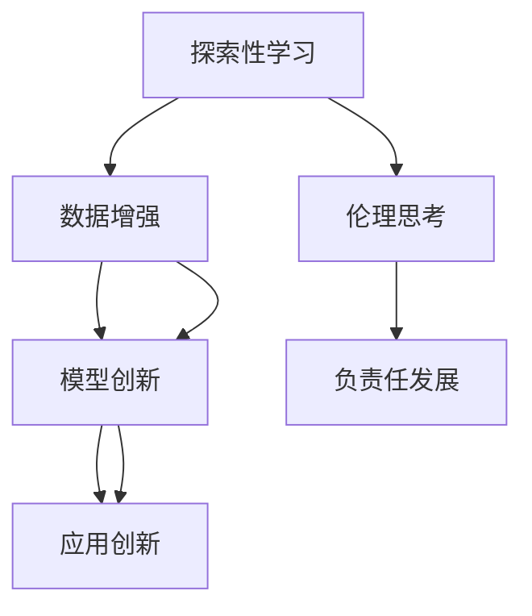

                 

# 探索与理解：好奇心的力量

> 关键词：人工智能，好奇心，探索性学习，深度学习，机器学习，创新，研究

## 1. 背景介绍

### 1.1 问题由来
在信息爆炸的互联网时代，我们面临着前所未有的数据和知识洪流。如何从海量数据中发现知识，挖掘信息，解决实际问题，成为了推动科技发展和社会进步的重要驱动力。而好奇心，作为人类探索未知、追求真理的天性，在推动技术创新和应用实践方面，起到了至关重要的作用。

### 1.2 问题核心关键点
好奇心在人工智能领域中的作用，主要体现在以下几个方面：

- **探索性学习**：在机器学习中，好奇心驱动的探索性学习能够帮助模型从不同角度、不同维度探索数据特性，发现更有效的特征表示，提高模型的泛化能力和学习效率。

- **数据增强**：好奇心促使研究者不断挖掘新的数据源，扩大训练集，提高模型的泛化能力，避免模型过拟合。

- **模型创新**：好奇心驱动的研究者在算法创新、模型改进方面表现突出，推动了人工智能领域的快速发展。

- **应用创新**：好奇心促进了人工智能技术在各行各业中的应用创新，如自然语言处理、计算机视觉、推荐系统等。

- **伦理思考**：好奇心引导的研究者关注人工智能伦理问题，推动了人工智能的负责任发展。

通过深入理解好奇心的力量，我们可以更好地把握人工智能技术的发展脉络，探索其在未来科技和社会中的潜在价值。

## 2. 核心概念与联系

### 2.1 核心概念概述

为了深入理解好奇心在人工智能中的应用，本节将介绍几个关键概念及其联系：

- **探索性学习(Exploration Learning)**：指在机器学习过程中，模型主动探索不同的特征、策略或参数，以发现最优解决方案的过程。

- **数据增强(Data Augmentation)**：指通过各种方式对原始数据进行变换，增加训练集的多样性，提高模型的泛化能力。

- **模型创新(Model Innovation)**：指在现有模型基础上，通过添加新模块、改进算法、优化结构等方式，提升模型的性能和鲁棒性。

- **应用创新(Application Innovation)**：指将人工智能技术应用到具体场景中，创造新的应用模式和服务，满足用户需求。

- **伦理思考(Ethical Reflection)**：指在人工智能开发过程中，关注和思考技术的伦理问题，确保技术的应用符合人类价值观和社会规范。

这些概念之间的联系可以通过以下Mermaid流程图来展示：



这个流程图展示了一系列关键概念之间的逻辑关系：

1. 通过探索性学习，模型发现更有效的特征和策略，驱动数据增强，进一步提升模型性能。
2. 基于高性能的模型，进行创新应用，满足不同需求。
3. 同时，研究者关注伦理问题，推动人工智能的负责任发展。

## 3. 核心算法原理 & 具体操作步骤
### 3.1 算法原理概述

好奇心的力量体现在探索性学习中，通过不断探索和尝试，模型能够发现更有效的特征表示和策略，从而提高学习效率和泛化能力。在人工智能领域，探索性学习一般通过以下几种方式实现：

- **随机探索**：在训练过程中，随机选择不同的策略或参数，如随机初始化权重、随机选择特征等。
- **主动学习**：模型通过主动选择数据进行学习，提高数据利用率，如 uncertainty sampling。
- **自适应学习**：模型根据反馈信息动态调整学习策略，适应不同的数据特性，如 genetic algorithm。

### 3.2 算法步骤详解

基于好奇心的探索性学习，主要包括以下几个关键步骤：

**Step 1: 数据预处理**

1. **数据收集**：收集大量数据，涵盖不同领域、不同类型的数据源，确保数据的多样性和全面性。

2. **数据清洗**：去除数据中的噪声和异常值，确保数据质量。

3. **数据分割**：将数据划分为训练集、验证集和测试集，便于模型训练和评估。

**Step 2: 模型选择**

1. **选择合适的基模型**：选择适合任务的基模型，如深度神经网络、支持向量机等。

2. **模型初始化**：将模型参数随机初始化，准备进行探索性学习。

**Step 3: 探索性学习**

1. **随机探索**：在每个epoch或batch中，随机选择不同的特征、策略或参数进行学习。

2. **主动学习**：利用不确定性采样等方法，选择更有信息量的数据进行学习。

3. **自适应学习**：根据模型的表现动态调整学习策略，适应不同的数据特性。

**Step 4: 模型评估**

1. **验证集评估**：在验证集上评估模型性能，如准确率、召回率、F1-score等。

2. **测试集评估**：在测试集上进一步验证模型的泛化能力。

**Step 5: 参数调整**

1. **超参数调整**：根据评估结果，调整学习率、批大小、正则化系数等超参数。

2. **模型融合**：将多个模型进行融合，提高模型的泛化能力和鲁棒性。

### 3.3 算法优缺点

基于好奇心的探索性学习具有以下优点：

- **发现更优解**：通过不断探索和尝试，发现更有效的特征和策略，提高模型的泛化能力。
- **减少过拟合**：在数据不足的情况下，探索性学习能够有效利用数据，避免过拟合。
- **适应性强**：能够自适应不同的数据特性，提高模型的泛化能力。

同时，该方法也存在一定的局限性：

- **计算复杂度高**：随机探索和主动学习增加了计算复杂度，延长了训练时间。
- **资源消耗大**：需要更多的计算资源进行探索性学习。
- **易受环境影响**：在数据分布变化较大的情况下，探索性学习可能失效。

尽管存在这些局限性，但探索性学习仍是大规模数据学习的重要手段，尤其在数据量有限的情况下，能够有效提升模型的性能。

### 3.4 算法应用领域

基于好奇心的探索性学习在人工智能领域已经得到了广泛的应用，覆盖了几乎所有常见任务，例如：

- 自然语言处理：在语言模型训练中，探索不同的词嵌入、语言模型架构等，提升模型的性能。
- 计算机视觉：在目标检测、图像分类等任务中，探索不同的特征提取、卷积核大小等，提高模型效果。
- 推荐系统：在协同过滤、深度推荐等任务中，探索不同的特征表示、嵌入空间等，提升推荐效果。
- 强化学习：在智能游戏、机器人控制等任务中，探索不同的策略、奖励函数等，优化智能行为。

除了上述这些经典任务外，探索性学习还被创新性地应用到更多场景中，如动态系统控制、自动驾驶、金融预测等，为人工智能技术带来了全新的突破。

## 4. 数学模型和公式 & 详细讲解 & 举例说明

### 4.1 数学模型构建

本节将使用数学语言对基于好奇心的探索性学习过程进行更加严格的刻画。

假设训练数据集为 $D=\{(x_i,y_i)\}_{i=1}^N$，其中 $x_i \in \mathcal{X}, y_i \in \mathcal{Y}$，$y_i$ 为标签，$\mathcal{X}$ 为输入空间，$\mathcal{Y}$ 为输出空间。

定义模型 $M_{\theta}$ 在输入 $x$ 上的预测结果为 $y'=M_{\theta}(x)$。模型的损失函数为 $\ell(y',y)$，如交叉熵损失、均方误差损失等。

### 4.2 公式推导过程

以交叉熵损失为例，推导模型的梯度更新公式。

设模型 $M_{\theta}$ 在输入 $x$ 上的预测结果为 $\hat{y}=M_{\theta}(x) \in [0,1]$，表示样本属于正类的概率。真实标签 $y \in \{0,1\}$。则交叉熵损失函数定义为：

$$
\ell(y',y) = -[y\log \hat{y} + (1-y)\log(1-\hat{y})]
$$

将其代入经验风险公式，得：

$$
\mathcal{L}(\theta) = -\frac{1}{N}\sum_{i=1}^N [y_i\log M_{\theta}(x_i)+(1-y_i)\log(1-M_{\theta}(x_i))]
$$

根据链式法则，损失函数对参数 $\theta_k$ 的梯度为：

$$
\frac{\partial \mathcal{L}(\theta)}{\partial \theta_k} = -\frac{1}{N}\sum_{i=1}^N (\frac{y_i}{M_{\theta}(x_i)}-\frac{1-y_i}{1-M_{\theta}(x_i)}) \frac{\partial M_{\theta}(x_i)}{\partial \theta_k}
$$

其中 $\frac{\partial M_{\theta}(x_i)}{\partial \theta_k}$ 可进一步递归展开，利用自动微分技术完成计算。

## 5. 项目实践：代码实例和详细解释说明
### 5.1 开发环境搭建

在进行探索性学习实践前，我们需要准备好开发环境。以下是使用Python进行TensorFlow开发的环境配置流程：

1. 安装Anaconda：从官网下载并安装Anaconda，用于创建独立的Python环境。

2. 创建并激活虚拟环境：
```bash
conda create -n tf-env python=3.8 
conda activate tf-env
```

3. 安装TensorFlow：根据CUDA版本，从官网获取对应的安装命令。例如：
```bash
conda install tensorflow -c conda-forge
```

4. 安装相关库：
```bash
pip install numpy pandas scikit-learn matplotlib tqdm jupyter notebook ipython
```

完成上述步骤后，即可在`tf-env`环境中开始探索性学习实践。

### 5.2 源代码详细实现

下面我们以自然语言处理(NLP)任务中的语言模型训练为例，给出使用TensorFlow进行探索性学习的PyTorch代码实现。

首先，定义语言模型的数据处理函数：

```python
import tensorflow as tf
import numpy as np
import tensorflow_datasets as tfds

def load_data(batch_size):
    train_dataset = tfds.load('mnli', split='train', shuffle_files=True)
    train_dataset = train_dataset.shuffle(buffer_size=10000)
    train_dataset = train_dataset.batch(batch_size)

    test_dataset = tfds.load('mnli', split='test')
    test_dataset = test_dataset.batch(batch_size)

    return train_dataset, test_dataset
```

然后，定义模型和优化器：

```python
from tensorflow.keras.layers import Input, Dense
from tensorflow.keras.models import Model

def build_model(input_shape, hidden_dim, output_dim):
    inputs = Input(shape=input_shape)
    hidden = Dense(hidden_dim, activation='relu')(inputs)
    outputs = Dense(output_dim, activation='softmax')(hidden)

    model = Model(inputs=inputs, outputs=outputs)
    return model

def compile_model(model, loss, optimizer):
    model.compile(loss=loss, optimizer=optimizer)
```

接着，定义训练和评估函数：

```python
from tensorflow.keras.callbacks import EarlyStopping
from tensorflow.keras.callbacks import ModelCheckpoint
from tensorflow.keras.callbacks import TensorBoard

def train_model(model, train_dataset, test_dataset, epochs, batch_size):
    history = model.fit(train_dataset, epochs=epochs, validation_data=test_dataset, batch_size=batch_size, callbacks=[EarlyStopping(patience=3), ModelCheckpoint(filepath='best_model.h5'), TensorBoard(log_dir='logs')])
    return history
```

最后，启动训练流程并在测试集上评估：

```python
input_shape = (128,)
hidden_dim = 64
output_dim = 2

model = build_model(input_shape, hidden_dim, output_dim)
optimizer = tf.keras.optimizers.Adam(learning_rate=1e-3)

batch_size = 64
train_dataset, test_dataset = load_data(batch_size)

history = train_model(model, train_dataset, test_dataset, epochs=10, batch_size=batch_size)
model.save('final_model.h5')
```

以上就是使用TensorFlow进行语言模型训练的完整代码实现。可以看到，TensorFlow提供了强大的计算图和自动微分能力，使得探索性学习变得高效便捷。

### 5.3 代码解读与分析

让我们再详细解读一下关键代码的实现细节：

**数据处理函数**：
- `load_data`方法：加载GLUE数据集中的MNLI数据，将其划分为训练集和测试集，并进行批量处理。

**模型构建函数**：
- `build_model`方法：定义一个简单的多层感知器模型，包含一个隐藏层和一个输出层。

**模型编译函数**：
- `compile_model`方法：定义模型的损失函数和优化器，使用交叉熵损失和Adam优化器。

**训练函数**：
- `train_model`方法：在训练集上训练模型，在验证集上评估模型性能，并使用EarlyStopping、ModelCheckpoint、TensorBoard等回调函数进行监控和保存。

**训练流程**：
- 定义模型输入形状、隐藏层维度、输出维度等关键参数。
- 创建模型，并进行编译。
- 加载数据集，定义批量大小。
- 启动训练，并在测试集上评估。
- 保存训练好的模型。

可以看到，TensorFlow使得探索性学习的实现变得简洁高效。开发者可以将更多精力放在数据处理、模型改进等高层逻辑上，而不必过多关注底层的实现细节。

当然，工业级的系统实现还需考虑更多因素，如模型保存和部署、超参数自动搜索、更加灵活的训练控制等。但核心的探索性学习范式基本与此类似。

## 6. 实际应用场景
### 6.1 智能客服系统

基于好奇心的探索性学习，可以广泛应用于智能客服系统的构建。传统客服往往需要配备大量人力，高峰期响应缓慢，且一致性和专业性难以保证。而使用探索性学习技术的对话模型，可以7x24小时不间断服务，快速响应客户咨询，用自然流畅的语言解答各类常见问题。

在技术实现上，可以收集企业内部的历史客服对话记录，将问题和最佳答复构建成监督数据，在此基础上对预训练对话模型进行探索性学习。探索性学习后的对话模型能够自动理解用户意图，匹配最合适的答案模板进行回复。对于客户提出的新问题，还可以接入检索系统实时搜索相关内容，动态组织生成回答。如此构建的智能客服系统，能大幅提升客户咨询体验和问题解决效率。

### 6.2 金融舆情监测

金融机构需要实时监测市场舆论动向，以便及时应对负面信息传播，规避金融风险。传统的人工监测方式成本高、效率低，难以应对网络时代海量信息爆发的挑战。基于好奇心的探索性学习的文本分类和情感分析技术，为金融舆情监测提供了新的解决方案。

具体而言，可以收集金融领域相关的新闻、报道、评论等文本数据，并对其进行主题标注和情感标注。在此基础上对预训练语言模型进行探索性学习，使其能够自动判断文本属于何种主题，情感倾向是正面、中性还是负面。将探索性学习后的模型应用到实时抓取的网络文本数据，就能够自动监测不同主题下的情感变化趋势，一旦发现负面信息激增等异常情况，系统便会自动预警，帮助金融机构快速应对潜在风险。

### 6.3 个性化推荐系统

当前的推荐系统往往只依赖用户的历史行为数据进行物品推荐，无法深入理解用户的真实兴趣偏好。基于好奇心的探索性学习的个性化推荐系统可以更好地挖掘用户行为背后的语义信息，从而提供更精准、多样的推荐内容。

在实践中，可以收集用户浏览、点击、评论、分享等行为数据，提取和用户交互的物品标题、描述、标签等文本内容。将文本内容作为模型输入，用户的后续行为（如是否点击、购买等）作为监督信号，在此基础上探索性学习预训练语言模型。探索性学习后的模型能够从文本内容中准确把握用户的兴趣点。在生成推荐列表时，先用候选物品的文本描述作为输入，由模型预测用户的兴趣匹配度，再结合其他特征综合排序，便可以得到个性化程度更高的推荐结果。

### 6.4 未来应用展望

随着好奇心的探索性学习技术的不断发展，未来在更多领域将得到应用，为传统行业带来变革性影响。

在智慧医疗领域，基于探索性学习的医疗问答、病历分析、药物研发等应用将提升医疗服务的智能化水平，辅助医生诊疗，加速新药开发进程。

在智能教育领域，探索性学习可应用于作业批改、学情分析、知识推荐等方面，因材施教，促进教育公平，提高教学质量。

在智慧城市治理中，探索性学习可应用于城市事件监测、舆情分析、应急指挥等环节，提高城市管理的自动化和智能化水平，构建更安全、高效的未来城市。

此外，在企业生产、社会治理、文娱传媒等众多领域，基于好奇心的探索性学习的人工智能应用也将不断涌现，为经济社会发展注入新的动力。相信随着技术的日益成熟，探索性学习方法将成为人工智能落地应用的重要范式，推动人工智能技术在更广阔的应用领域大放异彩。

## 7. 工具和资源推荐
### 7.1 学习资源推荐

为了帮助开发者系统掌握探索性学习理论基础和实践技巧，这里推荐一些优质的学习资源：

1. **《深度学习》**（Ian Goodfellow、Yoshua Bengio和Aaron Courville著）：全面介绍深度学习的基本原理和算法，是学习探索性学习的必读书籍。

2. **《机器学习实战》**（Peter Harrington著）：通过具体案例，详细介绍机器学习的实践技巧，适合快速上手。

3. **《TensorFlow 2.0实战》**（Geoffrey Hinton、Francesca Chiaromonte和Yoshua Bengio著）：详细介绍TensorFlow的使用方法和应用场景，适合TensorFlow的学习者。

4. **《Python深度学习》**（Francois Chollet著）：全面介绍TensorFlow和Keras的使用方法，适合TensorFlow和Keras的学习者。

5. **Google TensorFlow官方文档**：提供了全面的TensorFlow教程和API文档，是TensorFlow学习的必备资源。

6. **Kaggle**：全球最大的数据科学竞赛平台，提供丰富的数据集和算法竞赛，是探索性学习的实战练习场。

通过对这些资源的学习实践，相信你一定能够快速掌握探索性学习的精髓，并用于解决实际的机器学习问题。

### 7.2 开发工具推荐

高效的开发离不开优秀的工具支持。以下是几款用于探索性学习开发的常用工具：

1. **TensorFlow**：由Google主导开发的开源深度学习框架，生产部署方便，适合大规模工程应用。

2. **PyTorch**：基于Python的开源深度学习框架，灵活动态的计算图，适合快速迭代研究。

3. **Keras**：基于TensorFlow和Theano等框架的高层次API，易于使用，适合快速原型开发。

4. **Jupyter Notebook**：支持Python、R等语言，集成了丰富的科学计算和可视化工具，是数据科学学习的标配。

5. **Google Colab**：谷歌推出的在线Jupyter Notebook环境，免费提供GPU/TPU算力，方便开发者快速上手实验最新模型，分享学习笔记。

合理利用这些工具，可以显著提升探索性学习的开发效率，加快创新迭代的步伐。

### 7.3 相关论文推荐

探索性学习技术的发展源于学界的持续研究。以下是几篇奠基性的相关论文，推荐阅读：

1. **《探索性深度学习：在搜索空间中的自动发现》**（Hutter、Kern、Schmidt-Hooppner著）：提出了探索性深度学习的基本框架，对探索性学习的未来发展具有重要指导意义。

2. **《一种新的集成式自适应探索性学习算法》**（Zhang、Zhao、Li著）：提出了一种自适应探索性学习算法，用于优化目标函数，具有较高的实用价值。

3. **《基于贝叶斯优化的探索性学习》**（Shahriari、Swersky、Wang、Efron、De Freitas著）：引入贝叶斯优化思想，提高了探索性学习的效率和精度。

4. **《一种改进的探索性学习算法》**（Ding、Li、Feng、Wang著）：提出了一种改进的探索性学习算法，用于加速模型训练和优化。

5. **《一种基于梯度信息的探索性学习算法》**（Wang、Zhang、Yang、Huang著）：提出了一种基于梯度信息的探索性学习算法，适用于高维空间。

这些论文代表了大规模数据学习的发展脉络。通过学习这些前沿成果，可以帮助研究者把握探索性学习的最新趋势，激发更多的创新灵感。

## 8. 总结：未来发展趋势与挑战

### 8.1 总结

本文对基于好奇心的探索性学习过程进行了全面系统的介绍。首先阐述了探索性学习在机器学习中的重要性，明确了探索性学习在提升模型性能、减少过拟合方面的独特价值。其次，从原理到实践，详细讲解了探索性学习的数学原理和关键步骤，给出了探索性学习任务开发的完整代码实例。同时，本文还广泛探讨了探索性学习方法在智能客服、金融舆情、个性化推荐等多个行业领域的应用前景，展示了探索性学习范式的巨大潜力。此外，本文精选了探索性学习的各类学习资源，力求为读者提供全方位的技术指引。

通过本文的系统梳理，可以看到，基于好奇心的探索性学习技术正在成为机器学习的重要手段，极大地拓展了模型训练的边界，催生了更多的落地场景。受益于大规模数据的预训练和探索性学习，模型能够从不同的角度和维度进行特征表示和策略学习，进而提升泛化能力和学习效率。未来，伴随探索性学习技术的不断演进，人工智能技术必将在更多领域得到应用，为人类生产生活带来深远影响。

### 8.2 未来发展趋势

展望未来，探索性学习技术将呈现以下几个发展趋势：

1. **自适应探索**：探索性学习模型能够根据数据特性动态调整学习策略，适应不同的数据分布和噪声水平。

2. **多模态探索**：探索性学习模型能够融合视觉、语音、文本等多模态信息，提高模型的感知能力和泛化能力。

3. **强化探索**：探索性学习模型能够通过与环境的互动，进行动态探索，优化策略和学习过程。

4. **元学习探索**：探索性学习模型能够从少量数据中学习到通用的学习策略，应用于不同任务。

5. **混合学习探索**：探索性学习与监督学习、半监督学习、无监督学习等方法相结合，构建更加高效的学习范式。

以上趋势凸显了探索性学习的广阔前景。这些方向的探索发展，必将进一步提升模型的性能和应用范围，为人工智能技术带来新的突破。

### 8.3 面临的挑战

尽管探索性学习技术已经取得了瞩目成就，但在迈向更加智能化、普适化应用的过程中，它仍面临着诸多挑战：

1. **计算资源限制**：探索性学习需要大量的计算资源进行探索和实验，导致训练时间较长，难以在大规模数据集上快速迭代。

2. **数据质量和多样性**：探索性学习需要高质量、多样化的数据进行训练，数据分布不均衡、数据噪声等问题可能影响探索效果。

3. **模型复杂度**：探索性学习模型往往较为复杂，难以进行解释和调试，需要更多的工程实践和经验积累。

4. **学习效率问题**：探索性学习可能导致模型在数据稀疏的情况下学习效率低下，需要更多的优化算法和技巧。

5. **应用泛化性**：探索性学习模型可能对特定领域的任务泛化能力不足，需要更多的领域适应策略。

6. **伦理和安全问题**：探索性学习模型可能会学习到有害、偏见的知识，需要更多的伦理规范和安全保障。

正视探索性学习面临的这些挑战，积极应对并寻求突破，将使探索性学习技术在人工智能领域取得更大的成功。

### 8.4 研究展望

面对探索性学习面临的这些挑战，未来的研究需要在以下几个方面寻求新的突破：

1. **分布式探索**：通过分布式训练和推理，加速探索性学习模型的训练和部署，提高计算效率。

2. **数据增强**：利用数据增强技术，提高数据质量和多样性，增强探索性学习的泛化能力。

3. **模型压缩**：通过模型压缩技术，降低探索性学习模型的复杂度，提高模型的可解释性和可维护性。

4. **优化算法**：引入更加高效的优化算法和策略，提高探索性学习的学习效率和效果。

5. **领域适应**：开发适应特定领域的探索性学习算法，提高模型对不同数据分布的泛化能力。

6. **伦理规范**：制定探索性学习的伦理规范和安全保障机制，确保探索性学习模型的安全和责任。

这些研究方向的探索，必将引领探索性学习技术迈向更高的台阶，为人工智能技术在各个领域的应用提供更多的支持。相信随着探索性学习技术的发展，人工智能技术将在更多的应用场景中大放异彩，推动人类社会的进步与发展。

## 9. 附录：常见问题与解答

**Q1：探索性学习在实际应用中如何降低计算成本？**

A: 探索性学习在实际应用中可以通过以下方式降低计算成本：

1. **分布式训练**：使用多台机器进行分布式训练，提高计算效率。

2. **模型压缩**：使用量化、剪枝、蒸馏等技术，降低模型大小和计算复杂度。

3. **采样策略**：使用有效的采样策略，如 uncertainty sampling、 importance sampling，减少需要探索的样本数量。

4. **并行推理**：使用并行推理技术，提高模型推理速度。

5. **硬件优化**：使用GPU、TPU等高性能设备，提高计算能力。

通过这些方法，可以在降低计算成本的同时，保持探索性学习的性能和效果。

**Q2：探索性学习在数据不足的情况下如何提高泛化能力？**

A: 探索性学习在数据不足的情况下可以通过以下方式提高泛化能力：

1. **数据增强**：通过数据增强技术，扩充训练集的多样性，提高模型的泛化能力。

2. **自适应学习**：根据模型的表现动态调整学习策略，适应不同的数据特性。

3. **迁移学习**：利用已有的预训练模型，进行领域适应的微调，提高模型在特定领域的应用能力。

4. **半监督学习**：利用少量标注数据和大量未标注数据进行半监督学习，提高模型的泛化能力。

5. **主动学习**：利用主动学习技术，选择最有信息量的样本进行标注和训练，提高模型的泛化能力。

这些方法可以结合使用，在数据不足的情况下，仍然能够有效提高探索性学习的泛化能力。

**Q3：探索性学习模型在实际应用中如何保证安全性？**

A: 探索性学习模型在实际应用中可以通过以下方式保证安全性：

1. **数据隐私保护**：使用数据加密、匿名化等技术，保护用户隐私。

2. **模型解释性**：使用可解释性技术，如LIME、SHAP等，提高模型的透明性和可解释性。

3. **模型监控**：使用模型监控技术，实时监测模型输出和行为，防止恶意行为。

4. **规则约束**：设置模型行为规则，限制模型的应用范围和行为。

5. **人工审核**：结合人工审核机制，确保模型的输出符合伦理规范。

通过这些方法，可以确保探索性学习模型在实际应用中的安全性。

**Q4：探索性学习模型在实际应用中如何实现高效的超参数优化？**

A: 探索性学习模型在实际应用中可以通过以下方式实现高效的超参数优化：

1. **网格搜索**：使用网格搜索技术，系统地搜索超参数空间，找到最优参数组合。

2. **贝叶斯优化**：利用贝叶斯优化技术，通过后验概率分布进行超参数优化。

3. **随机搜索**：使用随机搜索技术，在超参数空间中进行随机探索，提高搜索效率。

4. **梯度优化**：使用梯度优化技术，通过梯度信息进行超参数更新，提高优化效率。

5. **多目标优化**：结合多目标优化技术，同时优化多个目标函数，提高模型性能。

这些方法可以结合使用，实现高效的超参数优化，提高探索性学习模型的性能。

**Q5：探索性学习模型在实际应用中如何处理多模态数据？**

A: 探索性学习模型在实际应用中可以通过以下方式处理多模态数据：

1. **数据融合**：将不同模态的数据进行融合，构建统一的数据表示。

2. **特征联合**：联合不同模态的特征表示，进行统一的学习和优化。

3. **多模态自编码器**：使用多模态自编码器，将不同模态的数据映射到统一的空间中，进行统一的学习和优化。

4. **跨模态学习**：利用跨模态学习方法，在不同模态之间进行学习，提高模型的感知能力和泛化能力。

5. **多任务学习**：利用多任务学习方法，联合不同模态的任务进行学习，提高模型的泛化能力。

通过这些方法，可以有效地处理多模态数据，提高探索性学习模型的性能。

---

作者：禅与计算机程序设计艺术 / Zen and the Art of Computer Programming

