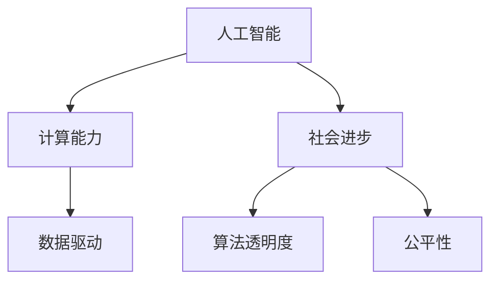

                 

# 推动社会进步的动力：人类计算的积极影响

> 关键词：人工智能,计算,社会进步,创新,数据,信息,生产力,可持续发展,未来展望

## 1. 背景介绍

### 1.1 问题由来

随着科技的飞速发展，计算能力已成为衡量一个国家科技实力的重要标志。在过去几十年里，人类计算能力的提升，不仅推动了科技创新，还深刻影响了社会的各个方面，包括教育、医疗、金融、交通等领域。人工智能(AI)作为新一代计算技术的代表，正在以不可阻挡的趋势，改变着人类的生活和工作方式。

AI技术通过大数据、算法和计算资源，实现了从感知、理解到决策的全流程自动化，极大地提升了生产效率和质量，重塑了产业结构。在医疗领域，AI辅助诊断技术提高了诊断的准确性和效率；在金融行业，AI算法优化了风险控制和投资策略；在教育领域，个性化学习系统使教育更加公平和高效。AI技术正逐步渗透到社会生活的方方面面，成为推动社会进步的重要动力。

### 1.2 问题核心关键点

AI技术驱动社会进步的核心关键点在于其强大的计算能力，使得处理和分析海量数据成为可能。这一能力不仅推动了科研创新，还促进了经济增长、改善了生活质量，并推动了可持续发展目标的实现。然而，AI技术的迅猛发展也带来了诸多挑战，如数据隐私保护、算法透明度、公平性等问题，需要在技术、政策和伦理等多方面进行综合考虑。

本文将重点讨论AI技术在社会进步中的积极影响，以及如何通过技术创新和政策引导，最大化其正面效应，规避潜在的风险。

## 2. 核心概念与联系

### 2.1 核心概念概述

为更好地理解AI技术在社会进步中的作用，本节将介绍几个关键概念：

- **人工智能(AI)**：通过模拟人脑的思维过程和决策能力，使机器具备学习和解决问题的能力。
- **计算能力**：指处理和执行算法所需的能力，是衡量AI技术强度的重要指标。
- **社会进步**：指通过科技进步，提高生产力、改善生活质量、推动经济和文化的持续发展。
- **数据驱动**：基于海量数据进行计算分析和决策，是AI技术的基本特点。
- **算法透明度**：AI算法的内部工作原理和决策依据，对用户和社会的可解释性和可信赖性。
- **公平性**：AI系统在应用过程中是否对所有用户或群体公正对待，避免算法偏见。

这些概念之间的联系可以通过以下Mermaid流程图来展示：



这个流程图展示了AI技术通过计算能力驱动社会进步，同时关注数据驱动、算法透明度和公平性，以实现可持续的社会发展。

## 3. 核心算法原理 & 具体操作步骤

### 3.1 算法原理概述

AI技术的核心在于其强大的计算能力，这使得处理和分析大规模数据成为可能。通过机器学习和深度学习等算法，AI系统能够从数据中提取模式和规律，并据此进行预测和决策。这一过程可以分为以下几个关键步骤：

1. **数据收集**：收集来自不同来源和格式的数据，作为训练和测试AI模型的基础。
2. **数据预处理**：清洗、标注和转换数据，以便模型能够理解和处理。
3. **模型训练**：使用训练数据集对AI模型进行训练，通过反向传播等技术优化模型参数，使其能够准确预测新数据。
4. **模型评估**：使用测试数据集对训练好的模型进行评估，确保其性能满足要求。
5. **模型应用**：将训练好的模型应用到实际问题中，解决具体问题或提供决策支持。

### 3.2 算法步骤详解

下面以图像识别为例，详细说明AI模型训练和应用的整个过程：

**Step 1: 数据收集和预处理**
- 从公共数据集或自采数据集中收集标注好的图像数据，作为训练数据。
- 使用图像处理工具（如OpenCV、Pillow等）对图像进行裁剪、缩放、归一化等预处理。
- 对图像数据进行标注，如分类标签、边界框等。

**Step 2: 模型选择和设计**
- 选择适合的深度学习框架（如TensorFlow、PyTorch等）和预训练模型（如ResNet、VGG等）。
- 设计网络结构，添加卷积层、池化层、全连接层等组件。
- 设定损失函数、优化器和超参数（如学习率、批大小等）。

**Step 3: 模型训练**
- 将预处理后的数据集划分为训练集和验证集。
- 使用训练集数据迭代训练模型，通过反向传播算法调整参数，最小化损失函数。
- 在验证集上定期评估模型性能，防止过拟合。

**Step 4: 模型评估和优化**
- 使用测试集数据评估模型性能，如准确率、召回率、F1分数等。
- 根据评估结果调整模型超参数，如学习率、批大小等。
- 重复训练和评估过程，直到模型达到最优性能。

**Step 5: 模型应用**
- 将训练好的模型应用于实际问题中，如图像分类、目标检测等。
- 对输入图像进行预处理，提取特征，输入模型进行预测。
- 根据预测结果，输出分类标签、边界框等信息。

### 3.3 算法优缺点

AI技术在驱动社会进步方面具有以下优点：
1. **提升效率**：自动化处理大量数据，大幅提高工作效率和准确性。
2. **创新驱动**：基于大数据和算法创新，推动科学研究和产业创新。
3. **改善生活质量**：在医疗、交通等领域提升服务质量，改善人们的生活体验。
4. **可持续发展**：通过优化资源配置，促进环境友好和可持续发展。

同时，AI技术也存在一些缺点：
1. **依赖数据**：高质量数据的获取和标注成本较高，数据偏差可能影响模型性能。
2. **算法透明性**：深度学习模型的黑盒特性，导致其决策过程难以解释和理解。
3. **公平性问题**：算法偏见可能导致对某些群体的歧视，影响公平性。
4. **技术风险**：AI系统可能被恶意利用，导致安全问题和社会风险。

在实际应用中，需要权衡这些利弊，通过技术改进和政策引导，最大化AI技术的积极影响，同时规避潜在的风险。

### 3.4 算法应用领域

AI技术在多个领域都有广泛应用，具体包括：

- **医疗**：AI辅助诊断、药物研发、个性化治疗等。
- **金融**：风险控制、投资策略、金融预测等。
- **教育**：个性化学习、智能辅导、作业批改等。
- **交通**：智能交通管理、自动驾驶、路径规划等。
- **制造**：智能制造、质量控制、预测性维护等。
- **农业**：精准农业、灾害预测、生物信息学等。
- **能源**：智能电网、能源管理、可再生能源优化等。

AI技术的广泛应用，正在推动各行各业实现数字化、智能化转型，提升生产效率和生活质量，促进可持续发展。

## 4. 数学模型和公式 & 详细讲解 & 举例说明

### 4.1 数学模型构建

AI技术的核心模型主要包括深度神经网络和深度学习算法。以卷积神经网络(CNN)为例，其数学模型可以表示为：

$$
y = W*x + b
$$

其中，$y$ 为输出结果，$x$ 为输入数据，$W$ 为权重矩阵，$b$ 为偏置向量。CNN通过多层卷积、池化等操作，提取输入数据的特征，并通过全连接层进行分类或回归。

### 4.2 公式推导过程

以线性回归为例，推导模型训练过程：

**Step 1: 数据准备**
- 准备训练数据集 $(x_1, y_1), (x_2, y_2), ..., (x_n, y_n)$，其中 $x_i$ 为输入特征，$y_i$ 为输出标签。

**Step 2: 模型定义**
- 定义线性回归模型 $y = W*x + b$，其中 $W$ 为权重矩阵，$b$ 为偏置向量。

**Step 3: 损失函数**
- 定义均方误差损失函数 $L(y, \hat{y}) = \frac{1}{2n} \sum_{i=1}^n (y_i - \hat{y}_i)^2$，其中 $\hat{y}_i$ 为模型的预测值。

**Step 4: 梯度下降**
- 计算损失函数对权重和偏置的梯度，使用梯度下降算法更新参数：
  $$
  \frac{\partial L}{\partial W} = -\frac{1}{n} \sum_{i=1}^n (y_i - W*x_i)
  $$
  $$
  \frac{\partial L}{\partial b} = -\frac{1}{n} \sum_{i=1}^n (y_i - b)
  $$

**Step 5: 模型训练**
- 迭代训练模型，更新权重和偏置，直到损失函数收敛。

### 4.3 案例分析与讲解

以图像分类为例，说明卷积神经网络（CNN）的训练和应用过程：

**Step 1: 数据准备**
- 收集标注好的图像数据集，如CIFAR-10、MNIST等。
- 将图像数据预处理为标准尺寸和格式。

**Step 2: 模型定义**
- 使用TensorFlow或PyTorch等框架，定义CNN模型结构。
- 添加卷积层、池化层、全连接层等组件，并定义损失函数和优化器。

**Step 3: 模型训练**
- 使用训练数据集进行迭代训练，计算损失函数，使用梯度下降算法更新参数。
- 在验证集上定期评估模型性能，避免过拟合。

**Step 4: 模型应用**
- 使用测试集数据评估模型性能。
- 对新的图像数据进行预处理，提取特征，输入模型进行分类预测。

## 5. 项目实践：代码实例和详细解释说明

### 5.1 开发环境搭建

在进行AI项目开发前，需要先准备好开发环境。以下是使用Python进行TensorFlow开发的流程：

1. 安装Anaconda：从官网下载并安装Anaconda，用于创建独立的Python环境。
2. 创建并激活虚拟环境：
```bash
conda create -n tensorflow-env python=3.8 
conda activate tensorflow-env
```

3. 安装TensorFlow：根据CUDA版本，从官网获取对应的安装命令。例如：
```bash
conda install tensorflow -c pytorch -c conda-forge
```

4. 安装Pillow库，用于图像预处理：
```bash
pip install pillow
```

5. 安装其他相关工具包：
```bash
pip install numpy pandas matplotlib scikit-learn tqdm jupyter notebook ipython
```

完成上述步骤后，即可在`tensorflow-env`环境中开始AI项目开发。

### 5.2 源代码详细实现

下面我们以图像分类为例，给出使用TensorFlow对卷积神经网络进行训练和应用的代码实现。

```python
import tensorflow as tf
from tensorflow.keras import layers, models

# 定义CNN模型结构
def create_model(input_shape):
    model = models.Sequential([
        layers.Conv2D(32, (3, 3), activation='relu', input_shape=input_shape),
        layers.MaxPooling2D((2, 2)),
        layers.Conv2D(64, (3, 3), activation='relu'),
        layers.MaxPooling2D((2, 2)),
        layers.Conv2D(64, (3, 3), activation='relu'),
        layers.Flatten(),
        layers.Dense(64, activation='relu'),
        layers.Dense(10, activation='softmax')
    ])
    return model

# 加载和预处理数据集
(x_train, y_train), (x_test, y_test) = tf.keras.datasets.cifar10.load_data()
x_train = x_train / 255.0
x_test = x_test / 255.0

# 定义模型和损失函数
model = create_model(x_train.shape[1:])
model.compile(optimizer='adam', loss='sparse_categorical_crossentropy', metrics=['accuracy'])

# 训练模型
model.fit(x_train, y_train, epochs=10, validation_data=(x_test, y_test))

# 评估模型
test_loss, test_acc = model.evaluate(x_test, y_test)
print('Test accuracy:', test_acc)
```

这段代码展示了从定义CNN模型到训练和评估的全过程。其中，`create_model`函数定义了卷积神经网络的结构，`model.compile`设置了优化器和损失函数，`model.fit`和`model.evaluate`分别进行了模型训练和评估。通过这段代码，可以深入理解CNN模型的训练和应用过程。

### 5.3 代码解读与分析

以下是关键代码的解读：

**定义模型结构**
```python
def create_model(input_shape):
    model = models.Sequential([
        layers.Conv2D(32, (3, 3), activation='relu', input_shape=input_shape),
        layers.MaxPooling2D((2, 2)),
        layers.Conv2D(64, (3, 3), activation='relu'),
        layers.MaxPooling2D((2, 2)),
        layers.Conv2D(64, (3, 3), activation='relu'),
        layers.Flatten(),
        layers.Dense(64, activation='relu'),
        layers.Dense(10, activation='softmax')
    ])
    return model
```

**数据加载和预处理**
```python
(x_train, y_train), (x_test, y_test) = tf.keras.datasets.cifar10.load_data()
x_train = x_train / 255.0
x_test = x_test / 255.0
```

**模型编译**
```python
model = create_model(x_train.shape[1:])
model.compile(optimizer='adam', loss='sparse_categorical_crossentropy', metrics=['accuracy'])
```

**模型训练和评估**
```python
model.fit(x_train, y_train, epochs=10, validation_data=(x_test, y_test))
test_loss, test_acc = model.evaluate(x_test, y_test)
print('Test accuracy:', test_acc)
```

这段代码展示了从数据加载、模型定义到训练和评估的完整过程。其中，`create_model`函数定义了卷积神经网络的结构，`model.compile`设置了优化器和损失函数，`model.fit`和`model.evaluate`分别进行了模型训练和评估。通过这段代码，可以深入理解CNN模型的训练和应用过程。

## 6. 实际应用场景

### 6.1 医疗健康

AI在医疗领域的应用日益广泛，通过数据分析和算法优化，推动了医疗技术的进步。例如，AI辅助诊断系统能够快速分析医学影像，帮助医生诊断疾病，提高诊断的准确性和效率。AI还可以用于药物研发，通过分析大量的生物数据和文献，预测药物的效果和副作用，加速新药的研发进程。

**实际案例**：IBM的Watson Health利用AI技术，对医疗影像进行自动分析和诊断，在多个医院和医疗机构中成功应用。Watson Health不仅提高了诊断速度，还减少了误诊率，提高了医疗服务的质量。

### 6.2 金融行业

金融行业一直是AI应用的热点领域。AI技术通过大数据分析和机器学习算法，提升了风险控制和投资策略的精度和效率。例如，AI算法可以分析市场数据，预测股票和商品的价格波动，帮助投资者制定投资策略。AI还可以用于信用评估和欺诈检测，提高了金融服务的可靠性和安全性。

**实际案例**：JP摩根大通开发的JPMorgan AI Research平台，通过AI算法优化投资策略，提高了金融产品的收益和稳定性。该平台还集成了机器学习模型，进行信用风险评估和欺诈检测，提升了金融服务的质量和效率。

### 6.3 智慧城市

智慧城市是AI技术在城市管理中的应用，通过数据分析和智能化管理，提升了城市管理的效率和质量。例如，AI技术可以用于交通管理，通过分析交通数据，优化交通信号灯的配时，缓解交通拥堵。AI还可以用于智能安防，通过视频分析和异常检测，提高城市的安全性。

**实际案例**：阿里巴巴的Ali Cloud IoT Platform，通过AI技术实现了智能城市的管理。该平台集成了各类传感器数据，进行数据分析和预测，优化城市资源配置。在交通管理、环境监测、智慧安防等方面，取得了显著的效果。

### 6.4 未来应用展望

随着AI技术的不断进步，未来的应用前景将更加广阔。以下是几个未来应用的方向：

- **自动驾驶**：AI技术在自动驾驶领域的应用前景广阔。通过高精度的图像和传感器数据，AI算法可以实现对道路环境的实时感知和决策，提升驾驶安全和效率。
- **智能家居**：AI技术在智能家居中的应用，可以通过语音识别、图像识别等技术，实现对家庭设备的智能控制和优化，提升生活质量。
- **虚拟助手**：AI技术在虚拟助手中的应用，通过自然语言处理和机器学习，实现对用户指令的准确理解和执行，提升人机交互的体验。
- **个性化推荐**：AI技术在个性化推荐中的应用，通过分析用户行为和偏好，实现对商品、内容等的高效推荐，提升用户体验和满意度。
- **环境监测**：AI技术在环境监测中的应用，通过数据分析和预测，提升环境保护和治理的效率和精度。

## 7. 工具和资源推荐

### 7.1 学习资源推荐

为帮助开发者系统掌握AI技术的理论基础和实践技巧，这里推荐一些优质的学习资源：

1. 《Deep Learning》：Ian Goodfellow、Yoshua Bengio和Aaron Courville合著的经典教材，全面介绍了深度学习的基本原理和应用。
2. CS231n《卷积神经网络》课程：斯坦福大学开设的计算机视觉课程，详细讲解了卷积神经网络的结构和应用。
3. CS224n《自然语言处理》课程：斯坦福大学开设的自然语言处理课程，涵盖NLP的基本概念和算法。
4. Google AI的《TensorFlow教程》：TensorFlow官方提供的教程，涵盖TensorFlow的基本用法和高级功能。
5. Coursera的《机器学习》课程：Andrew Ng教授开设的机器学习课程，通过实践项目帮助学生掌握机器学习的基本技能。

通过对这些资源的学习实践，相信你一定能够快速掌握AI技术的精髓，并用于解决实际的业务问题。

### 7.2 开发工具推荐

高效的开发离不开优秀的工具支持。以下是几款用于AI项目开发的常用工具：

1. TensorFlow：由Google主导开发的开源深度学习框架，生产部署方便，适合大规模工程应用。
2. PyTorch：基于Python的开源深度学习框架，灵活动态的计算图，适合快速迭代研究。
3. Jupyter Notebook：用于数据科学和机器学习的交互式开发环境，支持Python、R等多种语言。
4. Scikit-learn：用于机器学习和数据挖掘的Python库，提供了多种常用的机器学习算法和工具。
5. Keras：高层API，简化深度学习的开发流程，支持TensorFlow、Theano等多种后端。
6. OpenCV：用于计算机视觉的库，提供了图像处理和分析的各类工具。

合理利用这些工具，可以显著提升AI项目开发的效率，加快创新迭代的步伐。

### 7.3 相关论文推荐

AI技术的发展离不开学界的持续研究。以下是几篇奠基性的相关论文，推荐阅读：

1. 《ImageNet Classification with Deep Convolutional Neural Networks》：Hinton等人提出的卷积神经网络结构，推动了计算机视觉领域的突破。
2. 《Playing Atari with deep reinforcement learning》：Silver等人利用深度强化学习技术，成功训练了能够在Atari游戏中进行复杂决策的AI算法。
3. 《Attention is All You Need》：Vaswani等人提出的Transformer结构，开启了NLP领域的预训练大模型时代。
4. 《A Survey on Deep Learning for Financial Time Series Forecasting》：综述了深度学习在金融时间序列预测中的应用，总结了相关研究和技术进展。
5. 《Distributional Smart Metering》：Wang等人利用AI技术优化智能电表系统，实现了电力资源的智能管理。

这些论文代表了大规模AI技术的发展脉络。通过学习这些前沿成果，可以帮助研究者把握学科前进方向，激发更多的创新灵感。

## 8. 总结：未来发展趋势与挑战

### 8.1 总结

本文对AI技术在社会进步中的积极影响进行了全面系统的介绍。首先阐述了AI技术在提升生产效率、改善生活质量、促进可持续发展等方面的重要作用。其次，从原理到实践，详细讲解了AI模型的训练和应用过程，给出了具体的代码实现。同时，本文还广泛探讨了AI技术在医疗、金融、城市管理等多个领域的应用前景，展示了AI技术的广泛潜力。

通过本文的系统梳理，可以看到，AI技术通过强大的计算能力，驱动社会进步，促进各行各业实现数字化、智能化转型。AI技术的广泛应用，正在推动科研创新、经济增长和可持续发展，改善人类生活质量。未来，伴随AI技术的不断演进，其在社会进步中的作用将更加显著，为人类社会带来更多的可能性。

### 8.2 未来发展趋势

展望未来，AI技术的发展趋势主要包括以下几个方向：

1. **算力提升**：随着AI芯片和量子计算等技术的不断进步，AI的计算能力将得到大幅提升，进一步推动AI技术在各行各业的应用。
2. **多模态学习**：未来的AI技术将更加注重多模态数据的融合，实现视觉、语音、文本等多种数据源的协同建模，提升系统性能和鲁棒性。
3. **自监督学习**：自监督学习算法能够利用未标注数据进行预训练，大幅提升模型性能，降低对标注数据的依赖。
4. **可解释性增强**：未来的AI模型将更加注重可解释性和透明性，通过因果分析、知识图谱等方法，提升用户和社会的信任度。
5. **公平性和伦理**：未来的AI技术将更加注重公平性和伦理，通过算法审计、隐私保护等措施，确保AI系统公正对待所有用户，规避潜在的风险。
6. **人机协同**：未来的AI技术将更加注重人机协同，通过自然语言处理、图像识别等技术，提升人机交互的效率和体验。

这些发展趋势将推动AI技术在更多领域实现突破，为社会进步带来更多的创新和变革。

### 8.3 面临的挑战

尽管AI技术在社会进步中发挥了巨大作用，但也面临着诸多挑战：

1. **数据隐私**：AI系统需要大量的数据进行训练和优化，数据隐私和安全问题亟待解决。
2. **公平性**：AI系统可能存在算法偏见，导致对某些群体的歧视，影响公平性。
3. **透明性**：深度学习模型的黑盒特性，导致其决策过程难以解释和理解。
4. **安全性**：AI系统可能被恶意利用，导致安全问题和社会风险。
5. **伦理道德**：AI技术在应用过程中需要考虑伦理道德问题，避免产生不良影响。

这些挑战需要在技术、政策和伦理等多方面进行综合考虑，确保AI技术的健康发展。

### 8.4 研究展望

面对AI技术面临的挑战，未来的研究需要在以下几个方面寻求新的突破：

1. **隐私保护技术**：开发更加有效的数据保护技术，确保AI系统的数据隐私和安全。
2. **公平性算法**：研究公平性算法，消除AI系统的算法偏见，确保其对所有用户公正对待。
3. **可解释性模型**：开发可解释性模型，提升AI系统的透明性和可信度。
4. **安全保障措施**：研究安全保障措施，防止AI系统的恶意利用，确保其应用安全性。
5. **伦理道德框架**：建立AI伦理道德框架，确保AI技术的应用符合人类价值观和伦理道德。

这些研究方向的探索，将推动AI技术在更广泛的领域实现应用，为社会进步带来更多的创新和变革。

## 9. 附录：常见问题与解答

**Q1: AI技术是如何驱动社会进步的？**

A: AI技术通过强大的计算能力，驱动社会进步，主要体现在以下几个方面：
1. **提升生产力**：AI技术通过自动化处理大量数据，大幅提高工作效率和准确性，推动生产力的提升。
2. **改善生活质量**：AI技术在医疗、交通等领域提升了服务质量，改善了人们的生活体验。
3. **促进可持续发展**：AI技术通过优化资源配置，提升了能源利用效率，推动了环境保护和可持续发展。

**Q2: 数据隐私和安全性如何保障？**

A: 数据隐私和安全性是AI技术应用中的重要问题。以下是一些保障措施：
1. **数据匿名化**：对数据进行去标识化处理，保护用户隐私。
2. **加密技术**：对数据进行加密存储和传输，防止数据泄露。
3. **访问控制**：设置严格的访问权限，确保数据访问的安全性。
4. **安全审计**：定期对AI系统进行安全审计，及时发现和修复潜在的安全漏洞。

**Q3: 如何提高AI系统的透明性和可解释性？**

A: 提高AI系统的透明性和可解释性，需要从算法设计和应用流程两个方面进行改进：
1. **可解释性算法**：开发可解释性算法，如因果分析、决策树等，提升模型的透明性。
2. **用户反馈机制**：建立用户反馈机制，收集用户对AI系统的反馈意见，不断优化模型。
3. **知识图谱**：引入知识图谱等外部知识，提升AI系统的推理能力和透明度。

**Q4: 如何确保AI系统的公平性和公正性？**

A: 确保AI系统的公平性和公正性，需要从算法设计和数据处理两个方面进行改进：
1. **公平性算法**：研究公平性算法，消除AI系统的算法偏见，确保其对所有用户公正对待。
2. **多样性数据**：使用多样性数据进行训练，避免数据偏差导致模型偏见。
3. **算法审计**：定期对AI系统进行算法审计，确保其公平性和公正性。

通过这些措施，可以最大限度地减少AI系统对特定群体的偏见，确保其公平性和公正性。

总之，AI技术在推动社会进步中发挥了巨大的作用，但也面临诸多挑战。通过技术创新和政策引导，我们可以在保障数据隐私、提升公平性和透明度、确保安全性和伦理道德等方面取得突破，推动AI技术在更多领域实现应用，为社会进步带来更多的创新和变革。

